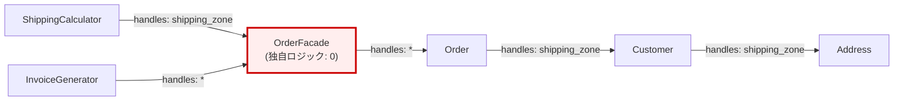
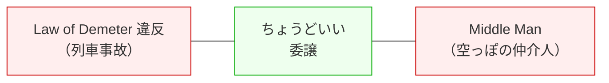
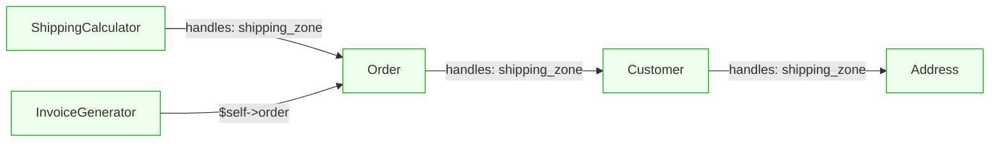

---
categories:
  - tech
date: 2026-04-08T07:07:05+09:00
description: handles委譲を全クラスに適用した結果、独自ロジックゼロの空っぽのクラスが量産された——Law of Demeter回の教訓を忠実に守りすぎたMiddle ManスメルをRemove Middle Manで解消するコード探偵ロックの推理。
draft: true
epoch: 1775599625
image: /favicon.png
iso8601: 2026-04-08T07:07:05+09:00
tags:
  - design-pattern
  - perl
  - moo
  - middle-man
  - remove-middle-man
  - law-of-demeter
  - handles
  - refactoring
  - code-detective
title: コード探偵ロックの事件簿【Middle Man】忠実すぎる仲介人の罠〜委譲の鎖が絡みつく空っぽの部屋〜
toc: true
---

一週間ぶりだった。

僕は森川ユウジ、30歳。先週の深夜、配送料計算の全滅事故を直してもらった、あの3階のオフィスにまた来ている。ただし今回は障害対応ではない。報告だ。

先週ロックさんに教わった `handles` による委譲——列車事故を解体するリファクタリングを、1週間かけてシステム全体に適用した。メソッドチェーンは1本も残っていない。`$order->customer->address->prefecture` のような連鎖はすべて1段の委譲に置き換えた。テストも全部通っている。

手には缶コーヒーを2本持っている。1本は先週の礼。もう1本は今日の報告がてらの差し入れだ。

階段を上がって3階のドアの前に立つ。先週は半開きだったドアが、今日は閉まっている。ノックすると、中から声がした。

「開いている」

入ると、壁の様子が変わっていた。先週のクラス図はすべて剥がされていて、代わりに何かのグラフが貼ってある。ノードとエッジで構成された、メソッドの呼び出し関係図のようだった。赤い糸は健在で、ノード同士を結んでいる。

ロックさんはデスクに向かって画面を睨んでいた。先週と同じ位置にエナジードリンクの空き缶が並んでいるが、本数が増えている。7本。

「ロックさん、先週はどうもありがとうございました。お礼に——」

「ああ、列車事故の」

覚えてはいるらしい。ただし名前は覚えていない雰囲気だった。

「森川です。先週教わった `handles` の委譲を、全クラスに適用してきました。結果を見てもらえますか」

缶コーヒーをデスクの端に置くと、ロックさんは缶を一瞥してから僕のノートPCに視線を移した。

「見せたまえ」

## 一週間ぶりの再来

僕はリファクタリング後のコードを開いた。先週の障害の原因だった `ShippingCalculator` ——あの4段の列車事故を、`handles` で1段に解体した。同じことを `TaxCalculator` にも `InvoiceGenerator` にもやった。さらに、全体を統一的に扱うために `OrderFacade` というクラスを新設した。

「すべてのメソッドチェーンを潰しました。`Order` に対するアクセスは全部 `OrderFacade` 経由で、1段の委譲です」

自信はあった。先週教わったことを忠実に守った結果だ。

ロックさんは画面を覗き込んだ。5秒、10秒。先週は5秒で問題箇所を指さしたが、今回は黙って画面を見続けている。

「……ワトソン君」

「森川です」

「この `OrderFacade` を開いてくれたまえ」

```perl
package OrderFacade;
use v5.36;
use Moo;

has order => (
    is       => 'ro',
    required => 1,
    handles  => [qw(
        shipping_zone
        item_name
        quantity
        unit_price
        total_price
    )],
);
```

「これだ。これが全貌かね」

「はい。`OrderFacade` は `Order` へのアクセスを一元化するクラスです。`ShippingCalculator` も `InvoiceGenerator` も、`Order` を直接触らず `OrderFacade` 経由で——」

「このクラスには、独自のメソッドがいくつある」

質問の意図が分からなかった。

「委譲メソッドが5つです。`shipping_zone`、`item_name`、`quantity`、`unit_price`、`total_price`」

「そうではない。委譲ではなく、このクラス自身が何かを計算し、判断し、変換するメソッドは、いくつある」

数えるまでもなかった。

「……ゼロです」

ロックさんはエナジードリンクの缶を1本取り上げた。空だった。いつも空だ。

「ワトソン君。君は先週、列車事故を解体した。連鎖を断ち切り、各車両が自分の仕事をするように壁を立てた。それは正しかった」

「はい」

「だが今、君は壁だけで構成された車両を1両追加した。乗客も荷物も載っていない。通路だけがある。誰かが通り抜けるためだけに存在する車両だ」

## 空っぽの部屋

ロックさんは壁のグラフに新しい紙を1枚追加した。`OrderFacade` のメソッド一覧を書き出し、それぞれに矢印を引いた。矢印はすべて `Order` の同名メソッドに向かっている。

「5本のメソッドがある。5本ともが `Order` への委譲だ。1本も例外がない。この状態を **Middle Man** と呼ぶ」

「Middle Man」

「仲介人だ。郵便局のように、届いた手紙を隣の部屋に渡すだけの存在。手紙を読みもしない、返事を書きもしない。ただ受け取って、ただ渡す」

「でも——」

言葉が出た。反論したかった。

「先週、ロックさんが言ったじゃないですか。『直接の友人とだけ話せ、見知らぬ者と話すな』と。だから `ShippingCalculator` が `Order` の中身を知らなくて済むように、`OrderFacade` で1段にまとめたんです」

ロックさんは缶を置いた。

「Law of Demeter——デメテルの法則は『見知らぬ者と話すな』と言っている。だが『全員の間に通訳を立てろ』とは言っていない」

「何が違うんですか」

「通訳が翻訳をしているなら、彼がいる意味がある。だが通訳が、聞いた言葉をそのまま隣に繰り返しているだけなら、彼がいない方が会話は速い」

ロックさんは `ShippingCalculator` のコードを開いた。

```perl
package ShippingCalculator;
use v5.36;
use Moo;

has facade => (
    is       => 'ro',
    required => 1,
    handles  => [qw(shipping_zone)],
);

sub calculate ($self) {
    my %rate = (kanto => 500, kansai => 700, other => 1000);
    return $rate{$self->shipping_zone};
}
```

「`ShippingCalculator` は `facade` から `shipping_zone` を受け取る。`OrderFacade` は `order` から `shipping_zone` を受け取る。`Order` は `customer` から `shipping_zone` を受け取る。`Customer` は `address` から `shipping_zone` を受け取る」

「4段の委譲になっている。でもそれぞれが1段ずつだから、Law of Demeter には違反していないですよね」

「違反していない。だが `OrderFacade` の委譲を取り除いて、`ShippingCalculator` が `Order` を直接受け取っても——やはり違反しない」

言われて気づいた。`ShippingCalculator` にとって `Order` は「1段先」の存在だ。`OrderFacade` を間に挟んでも挟まなくても、`shipping_zone` を呼ぶのは1段。

「`OrderFacade` を挟むことで得られる防御は何もない。`Order` のインターフェースが変わったら、`OrderFacade` の `handles` も `ShippingCalculator` の `handles` も同時に壊れる。間にガラスを1枚足しただけで、衝撃は素通りする」

「じゃあ `OrderFacade` は完全に不要だったってことですか」

「不要かどうかは、このクラスに独自の仕事があるかどうかで決まる。今の `OrderFacade` にはない。だから不要だ。だが独自のロジック——たとえば注文のバリデーションや、複数の Order を束ねる集計処理があるなら、それは Facade パターンであって Middle Man ではない」



## 仲介人の審問

ロックさんは壁のグラフに赤いマーカーで線を引いた。

「判定は単純だ。クラスのメソッドを3つに分類する」

### Step 1: メソッドの分類

「まず、そのクラスが持つすべてのメソッドを数え、3種類に分ける」

| 分類 | 定義 | 例 |
|:---|:---|:---|
| A. 独自ロジック | 委譲先のデータを加工・判断・変換するメソッド | `total_price` で `quantity * unit_price` を計算 |
| B. 純粋な委譲 | 引数も戻り値も変えず、ただ別オブジェクトに渡すだけ | `handles => [qw(shipping_zone)]` |
| C. そのクラスに属すべきロジック | 本来このクラスが持つべきだが、まだ移動されていない処理 | ——（今回は該当なし） |

「B が過半数を超えたら、そのクラスは Middle Man だ。`OrderFacade` の場合、5メソッド中5メソッドが B。100%だ」

「じゃあ半分以下なら問題ない？」

「割合だけで機械的に判断するものではない。1つでも A のメソッドがあれば、そのクラスには存在理由がある。ただ B を減らせないか検討する価値はある」

### Step 2: Remove Middle Man

「`OrderFacade` を除去する。`ShippingCalculator` と `InvoiceGenerator` が `Order` を直接受け取るように変更する」

まず `ShippingCalculator` を直す。

```perl
package ShippingCalculator;
use v5.36;
use Moo;

has order => (
    is       => 'ro',
    required => 1,
    handles  => [qw(shipping_zone)],
);

sub calculate ($self) {
    my %rate = (kanto => 500, kansai => 700, other => 1000);
    return $rate{$self->shipping_zone};
}
```

「変更は属性名だけだ。`facade` を `order` に変え、型を `OrderFacade` から `Order` に切り替える。`handles` で `shipping_zone` を委譲する構造は同じだが、間の1層が消えている」

次に `InvoiceGenerator`。

```perl
package InvoiceGenerator;
use v5.36;
use Moo;

has order => (
    is       => 'ro',
    required => 1,
);

sub generate ($self) {
    my $order = $self->order;
    my $shipping = do {
        my %rate = (kanto => 500, kansai => 700, other => 1000);
        $rate{$order->shipping_zone};
    };
    return sprintf(
        "請求書\n商品: %s x%d @%d = %d\n配送料: %d\n合計: %d",
        $order->item_name,
        $order->quantity,
        $order->unit_price,
        $order->total_price,
        $shipping,
        $order->total_price + $shipping,
    );
}
```

「こちらは `handles` を使わず、`$self->order` 経由でメソッドを呼んでいる。Law of Demeter に違反しないか」

僕は自分で考えた。`$self->order->item_name` は2段の連鎖だが、`order` は `InvoiceGenerator` の直接の属性だ。`order` の先にある `item_name` は `Order` の公開メソッド。2つだけの関係であり、`Order` の中の `Customer` や `Address` の構造を知る必要はない。

「……違反していないですね。`$self->order` は直接の友人だから」

「そうだ。ただし `$self->order->customer->address->prefecture` と書けば3段先まで到達する。やるなとは言っていない——やるなら `handles` で1段にまとめろ、と先週言った。今回のポイントは、そのまとめ方が過剰だったという話だ」

### Step 3: 振り子のバランス

ロックさんは壁に貼ったグラフの隣に、新しい紙を追加した。天秤のイラストだった。手描きの、かなり雑な天秤。



「Law of Demeter 違反と Middle Man は、天秤の両端だ。委譲が足りなければ列車事故が起き、委譲が過剰なら空っぽの仲介人が生まれる。完璧な均衡点は存在しない」

「じゃあ何を基準にすればいいんですか」

「変更が来たときに、壊れるクラスの数を数えろ。先週の列車事故では、1箇所の変更で3クラスが同時に壊れた。それは委譲が足りなかった。今の `OrderFacade` は、1箇所の変更で `OrderFacade` と、その先の消費者クラスが壊れる。間に挟まっているだけで、衝撃は素通りしている。壊れるクラスの数が減らないなら、その委譲は仕事をしていない」

ようやく基準が見えた。委譲を追加するのは「壊れるクラスの数を減らすため」であって、「メソッドチェーンのドット数を減らすため」ではない。

「先週の `Customer` の `handles => [qw(shipping_zone)]` は、`Address` の内部構造が変わっても `Customer` が衝撃を吸収する。壊れるのは `Customer` の `handles` 宣言だけで、`Order` や `ShippingCalculator` には波及しない。あの委譲には意味がありました」

「そうだ。あれは翻訳をしている通訳だ。`Address` が `prefecture` を `region` に変えても、`Customer` が `shipping_zone` を提供し続ける限り、上流は壊れない。だが `OrderFacade` は翻訳をしていない。`Order` の `shipping_zone` をそのまま `shipping_zone` として渡している。名前も意味も、何も変わっていない」



## 仲介人のいない世界

テスト全パス。

```perl
subtest 'Order: 基本属性と計算' => sub {
    my $order = Order->new(
        customer => Customer->new(
            name    => '森川ユウジ',
            email   => 'morikawa@example.com',
            address => Address->new(prefecture => '東京都'),
        ),
        item_name  => 'ウィジェットA',
        quantity   => 2,
        unit_price => 1000,
    );
    is($order->item_name,     'ウィジェットA', 'item_name');
    is($order->quantity,      2,               'quantity');
    is($order->unit_price,    1000,            'unit_price');
    is($order->total_price,   2000,            'total_price');
    is($order->shipping_zone, 'kanto',         'shipping_zone は Customer から委譲');
};
```

`Order` のテストは変わっていない。変わったのは `Order` を使う側——`ShippingCalculator` と `InvoiceGenerator` が `OrderFacade` を挟まず直接 `Order` を受け取るようになったこと。

```perl
subtest 'ShippingCalculator: Order を直接使って配送料計算' => sub {
    my $order = Order->new(
        customer => Customer->new(
            name    => '森川ユウジ',
            email   => 'morikawa@example.com',
            address => Address->new(prefecture => '東京都'),
        ),
        item_name  => 'ウィジェットA',
        quantity   => 2,
        unit_price => 1000,
    );
    my $calc = ShippingCalculator->new(order => $order);
    is($calc->calculate, 500, '関東ゾーン 500円');
};
```

`ShippingCalculator` のテストも構造は同じだ。`OrderFacade->new(order => $order)` という1行が消えただけ。テストが短くなったのは、間にいた仲介人がいなくなったからだ。

```perl
subtest 'InvoiceGenerator: Order を直接使って請求書生成' => sub {
    my $order = Order->new(
        customer => Customer->new(
            name    => '森川ユウジ',
            email   => 'morikawa@example.com',
            address => Address->new(prefecture => '東京都'),
        ),
        item_name  => 'ウィジェットA',
        quantity   => 2,
        unit_price => 1000,
    );
    my $gen = InvoiceGenerator->new(order => $order);
    my $text = $gen->generate;
    like($text, qr/ウィジェットA/, '商品名を含む');
    like($text, qr/合計: 2500/,    '合計金額を含む (2000 + 500)');
};
```

全テスト、パス。

僕は画面を見ながら、この1週間を振り返っていた。

先週、列車事故を直した夜。明日のリファクタリング計画を頭の中で組み立てながら階段を降りた。月曜から金曜まで、毎日2–3クラスずつ、メソッドチェーンを潰しては `handles` を設定した。全クラスの連鎖がなくなったとき、達成感があった。

それが今日、1クラスまるごと不要だと言われた。

「……悔しいんですけど、納得はしてます」

ロックさんはデスクの缶コーヒーに手を伸ばした。僕が持ってきた方だ。プルタブを開ける音がした。

「先週教わったことが間違っていたわけじゃないですよね。`Customer` の `handles` は残したし、`Order` の `handles` も残した。消したのは `OrderFacade` だけだ。`handles` 自体が悪いんじゃなくて、何も加工しない委譲だけのクラスを作ったのが問題だった」

「そうだ。薬と毒の違いは量にある——とはかのパラケルススの言葉だが、委譲も同じだ。1段の委譲が傷を塞ぐガーゼなら、意味のない委譲を重ねるのは、ガーゼを100枚巻いて患部が見えなくなることに等しい」

「パラケルススって誰でしたっけ」

「16世紀の錬金術師だ。化学と医学の祖とされている。今は関係ない」

関係なかった。

「ロックさん。1つだけ聞いてもいいですか」

「2つ目だが、構わない」

「先週の列車事故のとき、僕が『委譲は地図を持たなくて済むようにすることだ』って先に言ったら、ロックさんは怒りましたよね」

「先に推理を言うなという意味だ。怒ってはいない」

「今回、僕が作った `OrderFacade` を見た瞬間に、これが Middle Man だって分かったんですか」

ロックさんは缶コーヒーを一口飲んだ。

「5秒で分かった。だが10秒かけたのは、100%委譲で独自ロジックが本当にゼロかを確認するためだ。1つでもあれば——たとえば注文のバリデーションメソッドが1つでもあれば、あれは Middle Man ではなく Facade だった。判断を急いではいけない」

答えに納得した。先週学んだのは「委譲で列車を解体しろ」。今週学んだのは「解体したあと、空っぽの車両を走らせるな」。同じ道具が、使い方を間違えれば別の問題になる。

缶コーヒーの2本目は、ロックさんが飲んでいた。1本は僕の分だったのだが、言い出すタイミングを逃した。

---

## 探偵の調査報告書

| 容疑（アンチパターン） | 真実（パターン） | 証拠（効果） |
|:---|:---|:---|
| Middle Man（過剰な仲介人） | Remove Middle Man — 直接アクセスの許容と委譲の見直し | 無意味な中間層が消え、呼び出し経路が短くなり、変更時の波及箇所が明確になる |

### 推理のステップ

1. **空のクラスを見つける**: クラスのメソッドを「独自ロジック（A）」「純粋な委譲（B）」「移動すべきロジック（C）」に分類し、B が過半数を超えたら Middle Man の疑い
2. **委譲の価値を問う**: その `handles` は「衝撃を吸収している」か、それとも「素通りさせている」だけかを判定する。名前も意味も変えない委譲は仕事をしていない
3. **直接アクセスに戻す**: 消費者クラスが Middle Man を経由せず、元のオブジェクトを直接受け取るように変更する（`facade` → `order`）
4. **独自ロジックがあれば残す**: バリデーション、集計、変換など独自の仕事を持つメソッドがあれば、そのクラスは Facade であり Middle Man ではない。削除せず B のメソッドだけを減らす
5. **天秤を意識する**: Law of Demeter 違反（列車事故）と Middle Man（空の仲介人）は天秤の両端。完璧な均衡点はなく、変更の波及範囲が最小になる位置を探す

### ロックより

車両と車両の間に壁を立てるのは正しかった。だが壁だけで構成された車両を走らせてはいけない。乗客のいない車両は連結を外したまえ——列車は軽くなり、残った車両の乗客は快適になる。委譲という道具を手に入れたばかりの者が最初にやる失敗は、あらゆる場所にそれを使い、何も変換しない中間層を量産することだ。道具の価値は、使う回数ではなく、使うべき場所に使うことで決まる。
