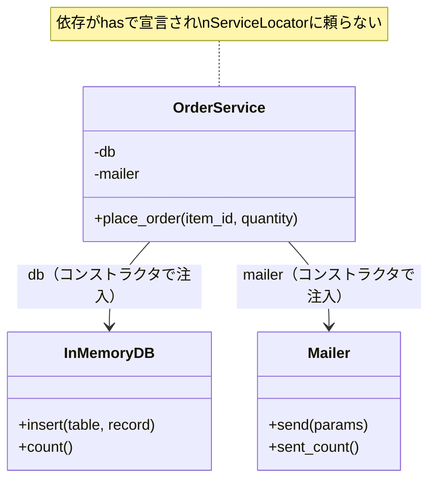

---
categories:
  - tech
date: 2026-04-09T07:07:05+09:00
description: テストを実行すると本番データが壊れる——便利なService Locatorの裏の顔を暴き、DIで依存の正面玄関を開くコード探偵ロックの推理。
draft: false
epoch: 1775686025
image: /favicon.png
iso8601: 2026-04-09T07:07:05+09:00
tags:
  - design-pattern
  - perl
  - moo
  - service-locator
  - hidden-dependencies
  - refactoring
  - code-detective
title: コード探偵ロックの事件簿【Service Locator】便利な情報屋の裏の顔〜テストが壊す本番データの怪〜
toc: true
---

「テストを実行したら、本番の在庫データが消えました」

僕は岡田翔太、三十四歳。社内ツール開発チームのリーダーだ。

社内の在庫管理ツールにテストを導入しようとしていた。テスト文化を根付かせたい。コードの品質を上げたい。そう思って、まず注文処理のテストを書いた。テストを走らせた。緑色になった。

そして、本番の在庫テーブルから三件のレコードが消えた。

最初はテストコードのバグだと思った。テストを見直した。問題はなかった。もう一度走らせた。また消えた。今度は五件。

テストを書くほど本番が壊れる。冗談のような現実だった。

「レガシー・コード・インベスティゲーション（LCI）」

雑居ビルの三階。扉を開けると、デスクの上にヴィンテージの技術書——初版のGoF本だろうか——が開かれていた。その横にルーペが置いてある。奥の椅子に座った男が、エナジードリンクを片手に言った。

「——情報屋のにおいがするね、ワトソン君」

「岡田です。情報屋って、何のことですか」

「すぐにわかるよ。テストが本番を壊す事件は、犯人が意外な場所にいるものだ。証拠品を見せたまえ」

## 現場検証：裏口から入る依存の正体

コードを見せると、ロックは二つのファイルを並べて読み始めた。

まず、`ServiceLocator`。

```perl
package ServiceLocator;
use Moo;

my %registry;

sub register {
    my ($class, $name, $instance) = @_;
    $registry{$name} = $instance;
}

sub get {
    my ($class, $name) = @_;
    die "Service not found: $name\n" unless exists $registry{$name};
    return $registry{$name};
}

sub clear {
    my ($class) = @_;
    %registry = ();
}
```

次に、`OrderService`。

```perl
package OrderService;
use Moo;

sub place_order {
    my ($self, $item_id, $quantity) = @_;

    my $db     = ServiceLocator->get('db');
    my $mailer = ServiceLocator->get('mailer');

    my $order = { id => 1001, item_id => $item_id, quantity => $quantity };
    $db->insert('orders', $order);
    $mailer->send(to => 'admin@example.com', subject => "New order: $item_id");

    return $order;
}
```

ロックは十秒ほど黙った。それから、ゆっくりと口を開いた。

「`ServiceLocator->get('db')`——この一行が犯人だ」

「ServiceLocator ですか？ これはうちのアプリ全体で使っている便利なユーティリティで……」

「便利。そう、便利なんだよ。どこからでもDBを手に入れられる。どこからでもメーラーを手に入れられる。場所を選ばず、身分も問わず、誰にでも同じサービスを渡してくれる。まるで路地裏の情報屋だ」

「情報屋……」

「問題は、この情報屋が誰にでも分け隔てなく本番のインスタンスを渡すことだ。テストコードが `ServiceLocator->get('db')` と呼べば、本番DBの接続がそのまま返ってくる。テストがINSERTすれば本番に書かれ、DELETEすれば本番から消える」

僕は息を呑んだ。テストコードに問題はなかった。テストが掴んだDBが、本番そのものだったのだ。

「もう一つ問題がある」

ロックは`OrderService`を指差した。

「このクラスのコンストラクタを見たまえ。`OrderService->new` ——引数が何もない。このクラスがDBに依存していること、メーラーに依存していること、コンストラクタからは一切読み取れない」

「確かに、newするだけでは何に依存しているか……」

「裏口から入る依存だ。表札も出さず、玄関も通らず、ServiceLocator という情報屋を通じて裏口からこっそり入り込む。**Hidden Dependencies（暗黙の依存）**——これが Service Locator の裏の顔だよ、ワトソン君」

## 推理披露：正面玄関を開く

「解決策は、情報屋を排除して正面玄関を開くことだ」

「正面玄関？」

「**Dependency Injection**——依存をコンストラクタで明示的に渡す。裏口で情報屋に頼む代わりに、正面玄関から堂々と入れるんだ」

ロックはキーボードを叩き始めた。

```perl
package OrderService;
use Moo;

has db     => (is => 'ro', required => 1);
has mailer => (is => 'ro', required => 1);

sub place_order {
    my ($self, $item_id, $quantity) = @_;

    my $order = { id => 1001, item_id => $item_id, quantity => $quantity };
    $self->db->insert('orders', $order);
    $self->mailer->send(to => 'admin@example.com', subject => "New order: $item_id");

    return $order;
}
```

「変わったのは二箇所だけだ」

ロックは画面を指差した。

「一つ目。`has db => (is => 'ro', required => 1)` と `has mailer => (is => 'ro', required => 1)`。依存がコンストラクタの引数として宣言された。これが正面玄関だ。このクラスがDBとメーラーに依存していることが、コードを読むだけで一目でわかる」

「二つ目。`ServiceLocator->get('db')` が `$self->db` に変わった。グローバルな情報屋に問い合わせる代わりに、自分が持っているインスタンスをそのまま使う」

「でも、テストの時はどうするんですか？ 本番のDBを渡したら同じ問題が起きますよね」

「逆だよ、ワトソン君。テスト時にはモックを渡す。本番時には本物を渡す。選ぶのは呼び出し側だ」

ロックはテストコードを書いた。

```perl
# テスト用のモック
my $mock_db     = InMemoryDB->new;
my $mock_mailer = MockMailer->new;

# DIでモックを注入
my $svc = OrderService->new(db => $mock_db, mailer => $mock_mailer);
$svc->place_order('ITEM-001', 3);

# モック上で検証（本番に一切触れない）
is($mock_db->count, 1, 'モックDBにレコードが保存された');
is($mock_mailer->sent->[0]{subject}, 'New order: ITEM-001', '送信内容を検証できる');
```

「`OrderService->new(db => $mock_db, mailer => $mock_mailer)`——テスト用のDBとメーラーをコンストラクタで渡すだけだ。ServiceLocator のグローバル状態はどこにも登場しない。テスト間で状態が干渉する余地がない」

僕はコードを見比べた。

Beforeでは、`OrderService` は `ServiceLocator` という情報屋に裏口で依存を問い合わせていた。何に依存しているかは、メソッドの中身を読まなければわからなかった。

Afterでは、依存が `has` で宣言されている。コンストラクタを見れば、このクラスがDBとメーラーを必要としていることが一目瞭然だ。テスト時はモック、本番時は本物。渡す側が選ぶ。



「Service Locator は『どこからでもサービスを取得できる便利な仕組み』に見える。だが実態は、依存関係を隠蔽し、テスタビリティを破壊するアンチパターンだ。情報屋に頼る代わりに、正面玄関から依存を受け取る——それが Dependency Injection だよ」

## 事件解決：テストが本番を壊さない日

テストを走らせた。

```
# Subtest: After: 正常系 — DIで注文が作成される
ok 1 - 商品IDが正しい
ok 2 - 数量が正しい
ok 3 - DBにレコードが1件
ok 4 - メールが1通送信された

# Subtest: After: テスト間でDB状態が干渉しない
ok 1 - テスト1のDBは1件のまま
ok 2 - テスト2のDBも1件のみ
ok 3 - 異なるDBインスタンス（テスト間干渉なし）

# Subtest: After: モック差し替えが容易
ok 1 - モックDBにレコードが保存された
ok 2 - モックメーラーに送信が記録された
ok 3 - 送信内容を検証できる
```

全テスト、警告ゼロでパスした。本番DBには一切触れていない。

「テストが安全に動く。本番のデータに一切触れていない……」

「当然だね。正面玄関から入る客は、招かれた部屋にしか行けない。裏口から入る情報屋は、どの部屋にも勝手に入り込む。その差だよ」

僕はチームのSlackに書いた。「テスト導入、再開できます」

ロックはGoF本を閉じた。

「報酬は、ServiceLocator に登録されていたサービスの数と同じ杯数のエスプレッソでいい」

登録されていたのは `db` と `mailer` の二つだ。エスプレッソ二杯。

「……安くないですか？」

「二杯のエスプレッソで、テストが本番を壊さなくなる。高い買い物だと思うかね？」

確かに。三ヶ月分のテスト導入の停滞を考えれば、エスプレッソ二杯は破格の報酬だった。

---

## 探偵の調査報告書

| 容疑（アンチパターン） | 真実（パターン） | 証拠（効果） |
|---|---|---|
| Service Locator（Hidden Dependencies） — グローバルなレジストリから依存を取得。依存がコンストラクタに表れず、テスト時に本番インスタンスを掴んでしまう | Dependency Injection — 依存をコンストラクタの引数として明示的に受け取る。テスト時はモック、本番時は本物を渡す | `ServiceLocator->get` が消え、`has db => (is => 'ro', required => 1)` で依存が宣言される。テストと本番でインスタンスが完全に分離される |
| グローバル状態の共有 — `ServiceLocator` の `%registry` がプロセス全体で共有されるため、テスト間で状態が干渉し、実行順序に依存するテスト失敗が起きる | ローカルな依存解決 — 各テストが独自のモックインスタンスを生成し、`OrderService->new(db => $mock)` で注入する。グローバル状態が存在しない | テスト間干渉がゼロ。テスト実行順序に依存しない。並列テスト実行も安全 |

### 推理のステップ

1. **Service Locator の使用箇所を洗い出す** — `ServiceLocator->get` を grep し、どのクラスがどのサービスに依存しているか依存グラフを描く
2. **依存をコンストラクタに移す** — `ServiceLocator->get('db')` を `has db => (is => 'ro', required => 1)` に変更する。メソッド内での取得を `$self->db` に置き換える
3. **テスト用モックを作成する** — 本番オブジェクトと同じインタフェース（`insert`、`send` 等）を持つモックを用意する。InMemoryDB や MockMailer がこれに相当する
4. **テストをDIで書き直す** — `OrderService->new(db => $mock_db, mailer => $mock_mailer)` のように、テスト用モックをコンストラクタで注入する
5. **ServiceLocator を段階的に廃止する** — すべてのクラスがDIに移行したら、ServiceLocator を削除する。依存はすべて正面玄関から入る

### ロックより

Service Locator は一見便利な情報屋に見える。どこからでもサービスを取得でき、新しい依存の追加もレジストリに一行足すだけだ。だが、その便利さには代償がある。依存関係がコードから読み取れなくなり、テスト時にグローバル状態が本番と衝突する。

Dependency Injection は、依存を隠さずにコンストラクタで宣言する。コードを読むだけで「このクラスは何を必要としているか」がわかる。テスト時にはモックを渡し、本番時には本物を渡す。判断は呼び出し側に委ねられる。

情報屋に頼るな。正面玄関を開けたまえ、ワトソン君。
