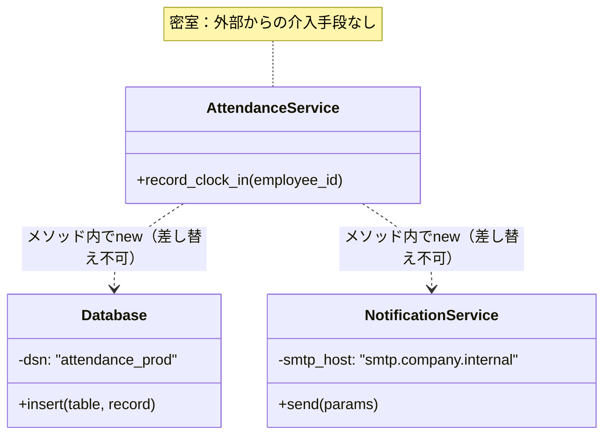
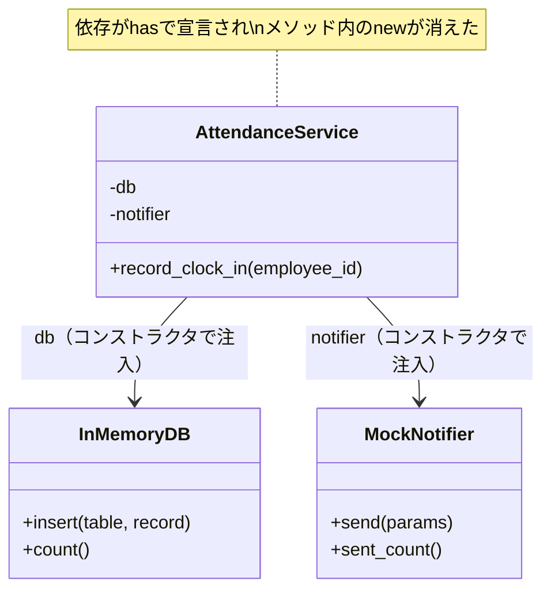

---
categories:
  - tech
date: 2026-04-10T07:07:05+09:00
description: メソッド内で直接newする密結合コード——テスト不能な密室を、Dependency Injectionで解き放つコード探偵ロックの推理。
draft: false
epoch: 1775772425
image: /favicon.png
iso8601: 2026-04-10T07:07:05+09:00
tags:
  - design-pattern
  - perl
  - moo
  - dependency-injection
  - tight-coupling
  - refactoring
  - code-detective
title: コード探偵ロックの事件簿【Dependency Injection】密室の共犯者たち〜硬直した依存関係を解き放て〜
toc: true
---

「テストを書こうとするたびに、本物のメールが飛ぶんです」

私は藤原美咲、二十八歳。社内の勤怠管理システムを一人で保守しているバックエンドエンジニアだ。

前任者が退職して半年。引き継ぎ資料はExcelファイル三枚。「あとはコード読んでください」という一行だけが、退職メールに添えられていた。

テストを書こう。そう決意して最初のテストケースを実行した瞬間、人事部のメールボックスに「Clock-in: Employee TEST-001」という件名のメールが届いた。人事部長から直接Slackが来た。「テストユーザーが出勤してるんだけど？」

テストを書くほど本物のメールが飛ぶ。本物のデータベースに打刻が記録される。テスト環境なんてものは、このシステムには存在しなかった。

「レガシー・コード・インベスティゲーション（LCI）」

雑居ビルの三階。扉を開けると、エナジードリンクの缶がピラミッド状に積み上げられている。その横で、年齢不詳の男がモニターを睨んでいた。

「——密室のにおいがするね」

「藤原です。密室って、何のことですか」

「君が持ってきた事件の話だよ、ワトソン君。テストが本番を動かす——それは、依存関係が密室に閉じ込められているということだ」

「依存関係が……密室？」

「コードを見せたまえ。犯人はそこにいるはずだ」

## 現場検証：密室に潜む共犯者

コードを見せると、ロックは `AttendanceService.pm` を食い入るように読み始めた。

```perl
package AttendanceService;
use Moo;
use Database;
use NotificationService;

sub record_clock_in {
    my ($self, $employee_id) = @_;

    my $db = Database->new(dsn => 'dbi:Pg:dbname=attendance_prod');
    my $now = time;
    $db->insert('clock_events', {
        employee_id => $employee_id,
        event_type  => 'clock_in',
        timestamp   => $now,
    });

    my $notifier = NotificationService->new(
        smtp_host => 'smtp.company.internal',
    );
    $notifier->send(
        to      => 'hr@company.internal',
        subject => "Clock-in: Employee $employee_id",
        body    => "Employee $employee_id clocked in at $now",
    );

    return { employee_id => $employee_id, timestamp => $now };
}
```

ロックは五秒ほど沈黙した。それから、画面の二行を指差した。

「`Database->new(dsn => 'dbi:Pg:dbname=attendance_prod')`——見たまえ。メソッドの内部で、本番DBへの接続が直接生成されている」

「はい。前任者がそう書いていて……」

「その下も同じだ。`NotificationService->new(smtp_host => 'smtp.company.internal')`——本番のメールサーバーへの接続も、メソッドの中で直接作られている」

ロックは椅子の背にもたれた。

「密室だよ、ワトソン君。このメソッドの中に二人の共犯者——Database と NotificationService がいる。彼らはこのメソッドの中で生まれ、このメソッドの中でしか生きられない。外からは一切手出しができない」

「外から手出しが……できない？」

「テストコードから、この二人をモックに差し替えることができるかね？」

私は考えた。`record_clock_in` を呼べば、メソッド内部で `Database->new` が走る。テスト用のDBを渡す手段がない。`NotificationService->new` も同じだ。メソッドの外から差し替える仕組みが、どこにもない。

「……できません」

「だから密室なんだ。テストコードが何をしようと、このメソッドは本番DBに接続し、本番メールサーバーからメールを送る。テスト環境という概念そのものが成立しない」

ロックはMermaid図を描いた。



「初歩的なにおいだよ、ワトソン君。**Hard-coded Dependencies（依存のハードコード）**——メソッド内部で依存を直接 `new` し、外部から差し替え不可能にしてしまう。これが今回の事件の真犯人だ」

「コンストラクタを見ても、このクラスがDBに依存していることすらわからない……」

「その通り。`AttendanceService->new` には引数がない。コンストラクタだけ読んで、このクラスが本番DBと本番メールサーバーに依存していると見抜けるかね？　無理だ。共犯者は密室の中に隠れている」

## 推理披露：密室の扉を開く鍵

「密室を開く鍵は一つだ。**Dependency Injection**——依存性の注入」

「注入……？」

「共犯者を密室の中で生まれさせるのではなく、外から送り込む。コンストラクタという正面玄関を作って、依存を堂々と渡すんだ」

ロックはキーボードを叩き始めた。

```perl
package AttendanceService;
use Moo;

has db       => (is => 'ro', required => 1);
has notifier => (is => 'ro', required => 1);

sub record_clock_in {
    my ($self, $employee_id) = @_;

    my $now = time;
    $self->db->insert('clock_events', {
        employee_id => $employee_id,
        event_type  => 'clock_in',
        timestamp   => $now,
    });

    $self->notifier->send(
        to      => 'hr@company.internal',
        subject => "Clock-in: Employee $employee_id",
        body    => "Employee $employee_id clocked in at $now",
    );

    return { employee_id => $employee_id, timestamp => $now };
}
```

「変わったのは三箇所だ」

ロックは画面を指差した。

「一つ目。`has db => (is => 'ro', required => 1)` と `has notifier => (is => 'ro', required => 1)`。依存がコンストラクタの引数として宣言された。これが正面玄関だ。`use Database` も `use NotificationService` も消えた——密室の壁が取り払われたんだ」

「二つ目。メソッド内の `Database->new(...)` が `$self->db` に変わった。`NotificationService->new(...)` も `$self->notifier` に変わった。依存を自分で生成する代わりに、外から渡されたものをそのまま使う」

「三つ目。`required => 1` だ。これは何を意味する？」

「`required` ってことは、依存を渡さないとインスタンスが作れない……つまり依存を隠しようがないんですね」

「その通り。密室の扉が開かれた。共犯者は白日のもとに晒される。このクラスがDBと通知サービスに依存していることは、`has` 宣言を見るだけでわかる」

「でも、テストの時はどうするんですか？」

「逆だよ、ワトソン君。テスト時にはモックを渡す。本番時には本物を渡す。選ぶのは呼び出し側だ」

ロックはテストコードを書いた。

```perl
# テスト用のモック
my $mock_db       = InMemoryDB->new;
my $mock_notifier = MockNotifier->new;

# DIでモックを注入
my $svc = AttendanceService->new(db => $mock_db, notifier => $mock_notifier);
$svc->record_clock_in('EMP-001');

# モック上で検証（本番に一切触れない）
is($mock_db->count, 1, 'モックDBにレコードが保存された');
like(
    $mock_notifier->sent->[0]{subject},
    qr/Clock-in: Employee EMP-001/,
    '送信内容を検証できる',
);
```

「`AttendanceService->new(db => $mock_db, notifier => $mock_notifier)` ——テスト用のDBと通知サービスをコンストラクタで渡すだけだ。メソッドの中で `new` は一切呼ばれない。本番DBにも本番メールサーバーにも、一切触れない」

私はコードを見比べた。

Beforeでは、`AttendanceService` のメソッド内部で `Database->new` と `NotificationService->new` が直接呼ばれていた。密室の中で共犯者が生まれ、外からは手が出せなかった。

Afterでは、依存が `has` で宣言されている。コンストラクタを見れば、このクラスがDBと通知サービスを必要としていることが一目瞭然だ。テスト時はモック、本番時は本物。渡す側が選ぶ。



「密室は開かれた。共犯者は日の光を浴びた。あとはテストで証明するだけだ」

## 事件解決：密室が開かれた日

テストを走らせた。

```
# Subtest: After: 正常系 — DIで打刻記録が作成される
ok 1 - 従業員IDが正しい
ok 2 - タイムスタンプが設定されている
ok 3 - DBにレコードが1件
ok 4 - 通知が1件送信された

# Subtest: After: テスト間でDB状態が干渉しない
ok 1 - テスト1のDBは1件のまま
ok 2 - テスト2のDBも1件のみ
ok 3 - 異なるDBインスタンス（テスト間干渉なし）

# Subtest: After: モック差し替えが容易
ok 1 - モックDBにレコードが保存された
ok 2 - モック通知に送信が記録された
ok 3 - 送信内容を検証できる
```

全テスト、警告ゼロでパスした。本番DBには一切触れていない。人事部にメールは飛んでいない。

「テストが……安全に動いています。本番のデータにもメールサーバーにも、何も触れていない」

「密室が開かれたからだよ。依存が外から渡されるなら、テストコードはテスト用の部品を渡せばいい。本番コードは本番用の部品を渡せばいい。それぞれの世界が、互いの密室に閉じ込められることはない」

私はテストコードを保存した。半年間書けなかったテストが、今日から書ける。

「報酬は……そうだな、このメソッドにハードコードされていた接続文字列の文字数と同じミリリットルのエスプレッソを頼む」

`dbi:Pg:dbname=attendance_prod` で32文字。32ミリリットルのエスプレッソ。

「……ほぼ一口ですけど、いいんですか？」

「密室の鍵を開ける報酬としては、十分すぎるだろう。むしろ君が払うべきはエスプレッソの代金ではなく、半年分のテスト負債だよ、ワトソン君」

それは、まったくその通りだった。

---

## 探偵の調査報告書

| 容疑（アンチパターン） | 真実（パターン） | 証拠（効果） |
|---|---|---|
| Hard-coded Dependencies — メソッド内で `Database->new` や `NotificationService->new` を直接呼び出し、外部からの差し替えが不可能。テスト時にも本番リソースに接続してしまう | Dependency Injection（Constructor Injection） — 依存をコンストラクタの `has` 宣言で受け取り、生成責務をクラスの外に追い出す | `->new(dsn => ...)` がメソッドから消え、`has db => (is => 'ro', required => 1)` で依存が宣言される。テスト時はモック、本番時は本物を注入 |
| 隠蔽された依存関係 — コンストラクタに引数がないため、クラスが何に依存しているか外部から判別できない。依存グラフの把握が不可能 | 明示的な依存宣言 — `has` 属性で依存が宣言され、コンストラクタを読むだけで依存関係が一目瞭然になる | `AttendanceService->new` が `AttendanceService->new(db => $db, notifier => $notifier)` に変わり、依存が可視化される |

### 推理のステップ

1. **メソッド内の `->new` を洗い出す** — メソッド内部で直接インスタンス化されている依存を特定する。`Database->new`、`NotificationService->new` のように、接続先やホスト名がハードコードされている箇所が標的
2. **依存をコンストラクタに移す** — `has db => (is => 'ro', required => 1)` のように、`has` 宣言で依存を受け取るように変更する。メソッド内の `Database->new(...)` は `$self->db` に置き換える
3. **テスト用モックを作成する** — 本番オブジェクトと同じメソッド（`insert`、`send` 等）を持つモックを用意する。InMemoryDB や MockNotifier がこれに相当する
4. **テストをDIで書き直す** — `AttendanceService->new(db => $mock_db, notifier => $mock_notifier)` のように、テスト用モックをコンストラクタで注入する
5. **`use` 宣言を整理する** — メソッド内で直接 `new` しなくなったクラスの `use` 宣言を削除し、依存がコンストラクタ経由のみであることを明確にする

### ロックより

メソッドの中で依存を直接 `new` する。これは一見、手っ取り早く動くコードに見える。だが、その密室は後から入ろうとする者——テストコード、別の環境、将来の自分——をすべて締め出す。

Dependency Injection は、密室の扉を開く。依存をコンストラクタで宣言し、外から渡す。クラスは自分が何を必要としているかを堂々と名乗り、呼び出し側がそれに応える。隠し事のないコードは、テストしやすく、変更しやすく、読みやすい。

密室に鍵をかけるな。正面玄関を開けたまえ、ワトソン君。
