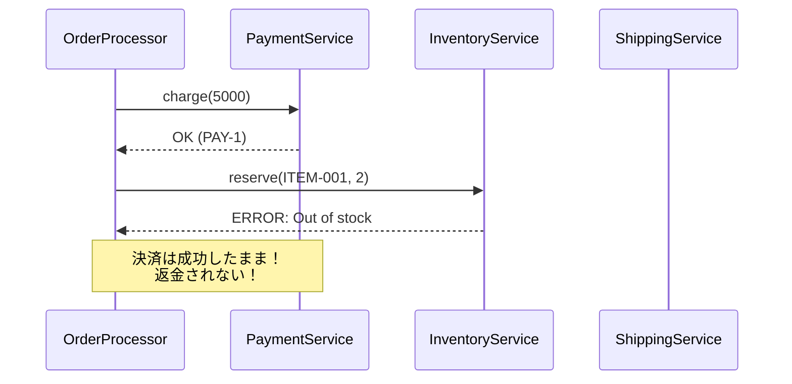
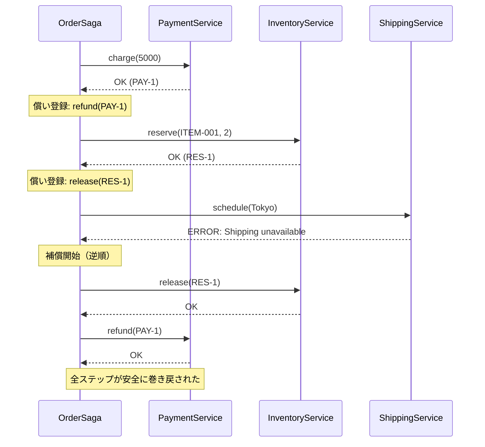

---
categories:
  - tech
date: 2026-04-11T07:07:05+09:00
description: 決済だけ成功して商品が届かない——補償なき分散処理の連鎖を、Sagaパターンで巻き戻すコード探偵ロックの推理。
draft: false
epoch: 1775858825
image: /favicon.png
iso8601: 2026-04-11T07:07:05+09:00
tags:
  - design-pattern
  - perl
  - moo
  - saga
  - no-compensation
  - refactoring
  - code-detective
title: コード探偵ロックの事件簿【Saga】連鎖する犯行と償いの記録〜巻き戻せないトランザクションの迷宮〜
toc: true
---

「決済だけ成功して、商品が届かないんです」

僕は中村拓也、三十一歳。ECサイトのバックエンドエンジニアだ。

注文処理は三つのステップで構成されている。決済、在庫引当、配送手配。この三つが順番に成功して、はじめて注文が完了する。

問題は、途中で失敗したときだ。

在庫がなかった。配送業者がメンテナンス中だった。理由はさまざまだが、結果はいつも同じだった。決済だけが成功し、お客様のクレジットカードからお金が引かれ、商品は届かない。

カスタマーサポートには「お金だけ引かれた」という問い合わせが週に数件。そのたびに僕が手動でDBを調べ、返金処理を走らせる。深夜の障害対応が三週間続いていた。

「レガシー・コード・インベスティゲーション（LCI）」

雑居ビルの三階。扉を開けると、エナジードリンクの缶でドミノが作られていた。一列に並んだ缶の先頭を、年齢不詳の男が人差し指でつつこうとしている。探偵事務所というより、暇を持て余した大学生の部屋だった。

「——あと一缶で完成だったのに。まあいい、犯行のにおいがするからね」

「中村です。犯行って……」（エナジードリンクのドミノを作っている人間に、僕の障害対応の深刻さが伝わるんだろうか）

「三段階の犯行が計画されている。だが計画には、失敗したときの後始末が含まれていない——典型的な未解決事件だよ、ワトソン君」

「未解決って、うちの注文処理のことですか？」

ロックはドミノの缶を一本抜いた。列が途中で止まった。倒れたのは先頭の二本だけで、残りは立ったまま取り残されている。

「これが今、君のシステムで起きていることだ。証拠を見せたまえ」

## 現場検証：償いなき犯行の連鎖

コードを見せると、ロックは `OrderProcessor` を読み始めた。

```perl
package OrderProcessor;
use Moo;

has payment_service   => (is => 'ro', required => 1);
has inventory_service => (is => 'ro', required => 1);
has shipping_service  => (is => 'ro', required => 1);

sub process_order {
    my ($self, $order) = @_;

    # Step 1: 決済
    my $payment = $self->payment_service->charge($order->{amount});

    # Step 2: 在庫引当
    my $reservation = $self->inventory_service->reserve($order->{item_id}, $order->{quantity});

    # Step 3: 配送手配
    my $shipment = $self->shipping_service->schedule($order->{address});

    return { payment => $payment, reservation => $reservation, shipment => $shipment };
}
```

ロックは十秒ほど黙った。それからエナジードリンクを一口飲み、口を開いた。

「犯行は三段階だ。決済、在庫引当、配送手配。順番に実行される。ここまではいい」

「はい、正常に動けば問題ないんです」

「だが在庫引当が失敗したとき——`reserve` が die したとき——決済はどうなる？」

僕はコードを見つめた。`charge` が成功した後に `reserve` が失敗する。`charge` を取り消すコードは、どこにもない。

「……そのまま残ります」

「配送手配が失敗したときは？」

「決済と在庫引当が、そのまま……」

「その通り。犯行は途中で止まっても、すでに実行された部分は巻き戻されない。決済だけが成功し、お金だけが消え、商品は届かない。在庫は引き当てられたまま、誰にも届かない幽霊在庫になる」

ロックはMermaid図を描いた。



「初歩的なにおいだよ、ワトソン君。**No Compensation（償いなき犯行）**——失敗時の巻き戻し手順が存在しない分散処理。犯行だけが記録され、償いの手順がどこにも書かれていない」

「償いの手順……」

「犯行には、必ず償いが対になっていなければならない。決済したなら返金、在庫を引き当てたなら解放、配送を手配したならキャンセル。これが用意されていないから、途中失敗でシステムが壊れるんだ」

## 推理披露：償いの手順を仕込む

「解決策は、各犯行に**償いの手順（補償トランザクション）**を仕込むことだ。これを **Saga パターン**という」

「サーガ……？ 北欧神話のですか？」

「北欧の叙事詩だよ。各章が独立しているが、全体で一つの物語を成す。そして重要なのは、どの章で物語が中断しても、そこまでの章を安全に巻き戻せる仕組みがあることだ」

（北欧神話に例えるのはいいけど、やっていることはPerlのエラーハンドリングだ——とは言わないでおいた）

ロックはキーボードを叩き始めた。

```perl
package OrderSaga;
use Moo;

has payment_service   => (is => 'ro', required => 1);
has inventory_service => (is => 'ro', required => 1);
has shipping_service  => (is => 'ro', required => 1);

sub execute {
    my ($self, $order) = @_;

    my @completed_steps;

    # Step 1: 決済
    my $payment = eval { $self->payment_service->charge($order->{amount}) };
    if ($@) {
        return { success => 0, error => "Payment failed: $@", step => 'payment' };
    }
    push @completed_steps, {
        name       => 'payment',
        compensate => sub { $self->payment_service->refund($payment->{id}) },
    };

    # Step 2: 在庫引当
    my $reservation = eval {
        $self->inventory_service->reserve($order->{item_id}, $order->{quantity})
    };
    if ($@) {
        $self->_compensate(\@completed_steps);
        return { success => 0, error => "Inventory failed: $@", step => 'inventory' };
    }
    push @completed_steps, {
        name       => 'inventory',
        compensate => sub { $self->inventory_service->release($reservation->{id}) },
    };

    # Step 3: 配送手配
    my $shipment = eval { $self->shipping_service->schedule($order->{address}) };
    if ($@) {
        $self->_compensate(\@completed_steps);
        return { success => 0, error => "Shipping failed: $@", step => 'shipping' };
    }

    return {
        success     => 1,
        payment     => $payment,
        reservation => $reservation,
        shipment    => $shipment,
    };
}
```

「構造を見たまえ。各ステップの直後に、`push @completed_steps` で償いの手順を登録している」

僕はコードを追った。決済が成功したら、返金処理をクロージャとして登録する。在庫引当が成功したら、解放処理を登録する。

「この `compensate` というのが、償いの手順ですか」

「その通り。決済の償いは返金（`refund`）、在庫引当の償いは解放（`release`）。各犯行に対応する償いが、セットで記録される」

「では、途中で失敗したら？」

「`_compensate` が呼ばれる。見たまえ」

```perl
sub _compensate {
    my ($self, $steps) = @_;
    for my $step (reverse @$steps) {
        eval { $step->{compensate}->() };
        warn "Compensation failed for $step->{name}: $@" if $@;
    }
}
```

「`reverse @$steps`——完了済みのステップを**逆順**にたどり、一つずつ償いを実行する。在庫引当で失敗したなら、その時点で完了しているのは決済だけだ。だから決済の償い——返金だけが実行される」

「配送手配で失敗したら？」

「完了しているのは決済と在庫引当の二つだ。逆順だから、まず在庫を解放し、次に決済を返金する。最後に実行されたものから順に巻き戻す——ドミノを逆再生するようなものだよ」

僕はエナジードリンクのドミノを思い出した。倒れたものを、最後の一本から順に立て直していく。



「もう一つ重要な点がある」ロックは `_compensate` の中を指差した。「補償自体が失敗する可能性もある。だから `eval` で囲んで `warn` でログを残している。補償の失敗は致命的だが、少なくともログに残れば運用で検知できる」

「完璧に巻き戻せなくても、何が残っているかわかる……」

「すべての不吉な `if` 構文を排除して残ったものが、いかにオブジェクト指向的でなくとも、それが真実なんだ。そして真実は、完璧でなくても——可視化されていれば対処できる」

## 事件解決：巻き戻せる日々

テストを走らせた。

```
# Subtest: After: 正常系 — 全ステップ成功で注文完了
ok 1 - 注文成功
ok 2 - 決済額が正しい
ok 3 - 在庫引当の商品IDが正しい
ok 4 - 配送先が正しい
ok 5 - 返金なし（成功時は補償不要）
ok 6 - 在庫解放なし（成功時は補償不要）

# Subtest: After: 在庫引当失敗時に決済が自動返金される
ok 1 - 注文失敗
ok 2 - 失敗箇所は在庫引当
ok 3 - 決済は一度実行された
ok 4 - 決済が自動返金された

# Subtest: After: 配送手配失敗時に決済返金＋在庫解放が逆順で実行される
ok 1 - 注文失敗
ok 2 - 失敗箇所は配送手配
ok 3 - 決済は一度実行された
ok 4 - 決済が自動返金された
ok 5 - 在庫引当は一度実行された
ok 6 - 在庫が自動解放された
```

全テスト、警告ゼロでパスした。

在庫引当が失敗すれば、決済は自動で返金される。配送手配が失敗すれば、在庫は解放され、決済は返金される。お客様のお金が宙に浮くことは、もうない。

「お金だけ引かれて商品が届かない、ということが……もう起きないんですね」

「犯行には必ず償いが伴う。それが Saga の原則だ。犯行だけ記録して償いを忘れる——それは杜撰な犯罪計画と同じだよ」

僕はカスタマーサポートのチャンネルを見た。三週間ぶりに、深夜の問い合わせがゼロだった。

「報酬は、この注文フローのステップ数と同じ杯数のエスプレッソでいい」

三ステップだから三杯。前回のDIの事件のときは二杯だったから、今回は一杯多い。

「……だんだん増えてませんか？」

「犯行が増えれば、償いも増える。エスプレッソも同じだよ、ワトソン君」

---

## 探偵の調査報告書

| 容疑（アンチパターン） | 真実（パターン） | 証拠（効果） |
|---|---|---|
| No Compensation（償いなき犯行） — 複数ステップの分散処理で途中失敗しても巻き戻し手順がない。決済だけ成功し、商品は届かず、手動で返金処理が必要になる | Saga（補償トランザクション） — 各ステップの成功後に補償手順（返金、解放、キャンセル）をクロージャとして登録し、失敗時に逆順で実行する | `@completed_steps` に償いの手順が蓄積され、`_compensate` で逆順に巻き戻される。途中失敗でもシステムの整合性が自動で回復される |
| 手動リカバリ依存 — 障害が起きるたびにエンジニアがDBを調べて手動修正。深夜対応が常態化し、運用コストが増大する | 自動補償＋ログ — 補償は自動実行され、補償自体の失敗もログに残る。運用で検知可能な状態が維持される | 手動の返金処理や在庫修正が不要になり、深夜の障害対応がゼロに |

### 推理のステップ

1. **分散処理のステップを洗い出す** — 注文フローの各ステップ（決済、在庫引当、配送手配）を特定し、それぞれが独立したサービスであることを確認する
2. **各ステップの補償操作を定義する** — 決済の補償は返金（`refund`）、在庫引当の補償は解放（`release`）、配送手配の補償はキャンセル（`cancel`）。各犯行に対応する償いをペアで設計する
3. **Saga オーケストレーターを実装する** — `OrderSaga` のように、各ステップを `eval` で実行し、成功後に補償クロージャを `@completed_steps` に登録する
4. **失敗時の逆順補償を実装する** — `_compensate` メソッドで `reverse @$steps` により、完了済みステップを最後から順に巻き戻す
5. **補償の失敗にも備える** — 補償自体が失敗する可能性があるため、`eval` と `warn` で囲み、ログに残して運用で検知できるようにする

### ロックより

分散処理の犯行は、一つのトランザクションで包めないからこそ厄介だ。決済サービスと在庫サービスと配送サービスは、それぞれ別の世界に住んでいる。一つのロールバックですべてを元に戻す魔法は存在しない。

Saga パターンは、魔法の代わりに**規律**を提供する。各犯行に償いを対にして記録し、失敗したら逆順にたどる。完璧ではないかもしれない。だが、償いの手順が存在する限り、システムは自力で立ち直れる。

犯行だけ記録して償いを忘れるな。すべての犯行には、償いの記録を残したまえ、ワトソン君。
