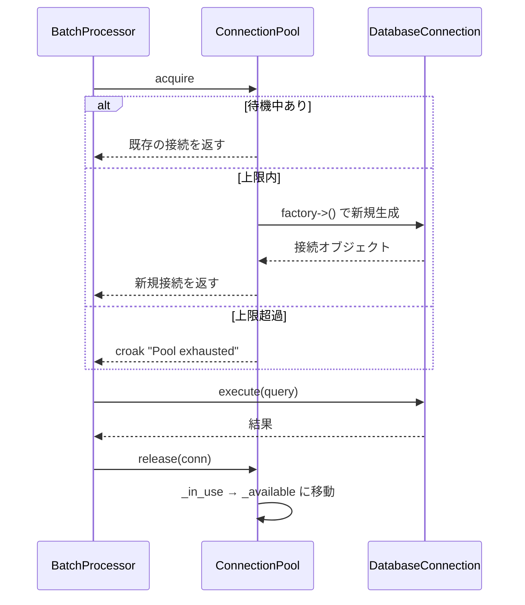

---
categories:
  - tech
date: 2026-04-13T07:07:05+09:00
description: DB接続を毎回生成・切断する使い捨てコードが月末バッチを崩壊させる——Object Poolパターンで接続を再利用し、リソース枯渇を防ぐコード探偵ロックの推理。
draft: false
epoch: 1776031625
image: /favicon.png
iso8601: 2026-04-13T07:07:05+09:00
tags:
  - design-pattern
  - perl
  - moo
  - object-pool
  - excessive-object-creation
  - refactoring
  - code-detective
title: コード探偵ロックの事件簿【Object Pool】回転ドアの人材派遣〜使い捨て接続が招くシステム崩壊〜
toc: true
---

「月末になると、バッチ処理がタイムアウトするんです」

僕は中西蓮、二十八歳。社内の売上集計バッチを運用しているエンジニアだ。

このバッチは毎月末に動く。全店舗の売上データを集計して、月次レポートを生成する仕組みだ。通常は問題なく動いているのだが、月末になるとデータ量が跳ね上がり、バッチが途中で止まる。エラーログには「Too many connections」の文字。DB接続数の上限に達しているらしい。

前任者が書いたコードをそのまま使い続けてきた。データ量が少なかった頃は問題にならなかった。だが店舗数が増え、データ量が三倍になった今、毎月末が恐怖だった。

「レガシー・コード・インベスティゲーション（LCI）」

雑居ビルの三階。扉を開けると、空のエナジードリンク缶が棚に整然と並べてあった。五本。それぞれにマスキングテープが貼られ、「利用可能」と書かれている。棚の横にはもう一つの区画があり、「使用中」のラベルが掲げられている。（探偵事務所なのか、リサイクルステーションなのかわからない）

「——ほう。回転ドアの人材派遣だね」

「中西です。回転ドアって何ですか」

「毎回新しい人間を雇い、仕事が終わったら即座にクビにする。翌日また新しい人間を雇って、また同じ仕事をさせる。面接、契約、研修——そのオーバーヘッドが仕事そのものより重くなる日が来る。コードも同じだよ、ワトソン君」

「あの、中西です。……DB接続の話なんですが」

「証拠を見せたまえ。接続の回転ドアを確認しよう」

## 現場検証：使い捨ての接続たち

コードを見せると、ロックは `process_records` メソッドを食い入るように読み始めた。

```perl
package DatabaseConnection;
use Moo;
use Types::Standard qw(Str Int Bool);

has host     => (is => 'ro', isa => Str, default => 'localhost');
has port     => (is => 'ro', isa => Int, default => 5432);
has database => (is => 'ro', isa => Str, default => 'sales');
has _connected => (is => 'rw', isa => Bool, default => 0);

sub connect {
    my ($self) = @_;
    # TCPハンドシェイク、認証、リソース確保……
    $self->_connected(1);
    return $self;
}

sub disconnect {
    my ($self) = @_;
    $self->_connected(0);
    return;
}

sub execute {
    my ($self, $query, @params) = @_;
    die "Not connected" unless $self->_connected;
    return { query => $query, params => \@params, status => 'ok' };
}
```

```perl
package BatchProcessor;
use Moo;

sub process_records {
    my ($self, $records) = @_;

    my @results;
    for my $record (@$records) {
        # 毎回接続を生成して切断する
        my $conn = DatabaseConnection->new;
        $conn->connect;

        my $result = $conn->execute(
            'SELECT * FROM sales WHERE id = ?', $record->{id}
        );
        push @results, $result;

        $conn->disconnect;
    }
    return \@results;
}
```

ロックはループの中の三行を指で叩いた。

「`new`、`connect`、`disconnect`。この三つがループの中にある。一件のレコードにつき一回の接続生成だ。千件のレコードなら？」

「……千回の接続生成です」

「TCPハンドシェイク千回。認証千回。リソース確保千回。そして千回のリソース解放。処理そのものより、接続の生成と破棄のほうが重い。まるで毎朝新しい探偵助手を雇って、夕方にクビにするようなものだ」

僕は月末のエラーログを思い出した。「Too many connections」——同時に大量の接続が生成され、DBの上限を突破していたのだ。

「初歩的なにおいだよ、ワトソン君。**Excessive Object Creation**——高コストなオブジェクトの使い捨てだ。生成コストの高いものを毎回捨てていれば、いつか資源は枯渇する」

「でも、使い終わった接続はちゃんと切断しているんです。リソースを開放しているわけですから——」

「開放はしている。だが、次の瞬間にまた同じコストをかけて新しい接続を作っている。壊しては建て、壊しては建て。それを効率的だと言うかね？」

## 推理披露：プールという名の精鋭部隊

「解決策は **Object Pool** だ。高コストなオブジェクトを使い捨てにするのではなく、プールに保持して再利用する」

「プール？　水泳の？」

「人材プールの方だよ、ワトソン君。優秀な人材を解雇せずにプールしておき、次の仕事が来たら再び配置する。採用面接も研修も省ける」

ロックはまず、プール本体を書いた。

```perl
package ConnectionPool;
use Moo;
use Types::Standard qw(Int ArrayRef CodeRef);
use Carp qw(croak);

has max_size   => (is => 'ro', isa => Int, default => 5);
has factory    => (is => 'ro', isa => CodeRef, required => 1);
has _available => (is => 'ro', isa => ArrayRef, default => sub { [] });
has _in_use    => (is => 'ro', isa => ArrayRef, default => sub { [] });
```

「四つの属性だ。`max_size` はプールの上限。`factory` はオブジェクトの生成方法をクロージャで注入する。`_available` は待機中のオブジェクト。`_in_use` は現在使用中のオブジェクト」

「`factory` をクロージャで渡すんですか？　直接 `DatabaseConnection->new->connect` と書かないのはなぜ？」

「テストのためだよ。本番ではDB接続を、テストではモックを注入できる。プールは『何を管理するか』を知らなくていい。『どう生成するか』だけを外から教えてもらう」

続いて `acquire` メソッド。

```perl
sub acquire {
    my ($self) = @_;
    my $obj;
    if (@{ $self->_available }) {
        $obj = pop @{ $self->_available };
    }
    elsif ($self->size < $self->max_size) {
        $obj = $self->factory->();
    }
    else {
        croak "Pool exhausted: all @{[$self->max_size]} objects in use";
    }
    push @{ $self->_in_use }, $obj;
    return $obj;
}
```

「`acquire` は三段階だ。まず、待機中のオブジェクトがあればそれを取り出す。なければ、上限内で新しく生成する。上限に達していたら——」

「例外を投げる？」

「その通り。プールの上限を超えてオブジェクトを生成してはならない。それでは使い捨てと同じだ」

そして `release` メソッド。

```perl
sub release {
    my ($self, $obj) = @_;
    my @remaining;
    my $found = 0;
    for my $item (@{ $self->_in_use }) {
        if (!$found && $item == $obj) {
            $found = 1;
            next;
        }
        push @remaining, $item;
    }
    croak "Object not found in pool" unless $found;
    @{ $self->_in_use } = @remaining;
    push @{ $self->_available }, $obj;
    return;
}
```

「`release` は返却だ。使い終わったオブジェクトを `_in_use` から `_available` に移す。捨てるのではない、待機席に戻すんだ」

最後にユーティリティメソッド。

```perl
sub size {
    my ($self) = @_;
    return scalar(@{ $self->_available }) + scalar(@{ $self->_in_use });
}

sub available_count {
    my ($self) = @_;
    return scalar @{ $self->_available };
}

sub in_use_count {
    my ($self) = @_;
    return scalar @{ $self->_in_use };
}
```



ロックは `BatchProcessor` を書き直した。

```perl
package BatchProcessor;
use Moo;

has pool => (is => 'ro', required => 1);

sub process_records {
    my ($self, $records) = @_;

    my @results;
    for my $record (@$records) {
        my $conn = $self->pool->acquire;

        my $result = $conn->execute(
            'SELECT * FROM sales WHERE id = ?', $record->{id}
        );
        push @results, $result;

        $self->pool->release($conn);
    }
    return \@results;
}
```

「見たまえ。`new` と `connect` と `disconnect` が消えた。代わりに `acquire` と `release` だ。接続を作って壊すのではなく、借りて返す」

僕はコードを見比べた。Before では `DatabaseConnection->new` → `connect` → `disconnect` をループのたびに繰り返していた。After では `pool->acquire` → `pool->release` に変わっている。接続自体は使い回される。

「千件のレコードを処理しても、接続生成は `max_size` の五回以下——いや、順番に処理しているから実質一回だけですか？」

「正確だね、ワトソン君。ループの中で一つずつ `acquire` して `release` しているから、プールには常に一つの接続しか生まれない。千件でも一万件でも、接続生成は一回だ」

「百倍どころか、千倍の節約……！」

「人材を大切にすることだよ。優秀な部下は使い捨てにするものではない」（この人に言われると、素直に頷けない）

## 事件解決：再利用される精鋭たち

テストを走らせた。

```
# Subtest: After: ConnectionPool — acquire で新規オブジェクトが生成される
ok 1 - An object of class 'DatabaseConnection' isa 'DatabaseConnection'
ok 2 - 接続済み
ok 3 - プールサイズが1

# Subtest: After: ConnectionPool — release で返却されたオブジェクトが再利用される
ok 1 - 返却後に利用可能が1
ok 2 - 使用中が0
ok 3 - 同一オブジェクトが再利用される
ok 4 - 接続生成は1回だけ

# Subtest: After: ConnectionPool — max_size を超えると例外
ok 1 - max_size超過で例外
ok 2 - 使用中が3

# Subtest: After: BatchProcessor — 接続が再利用され生成回数が激減する
ok 1 - 10件でも接続生成は1回

# Subtest: After: 大量レコードでも接続生成は max_size 以下
ok 1 - 100件でも接続生成は3以下
```

全テスト、警告ゼロでパスした。接続が再利用され、生成回数が劇的に減っている。

「百件処理しても接続生成は一回……。月末のバッチも、これなら接続数の上限に引っかからないです」

「`max_size` を適切に設定すれば、どれだけデータが増えても接続数は制御下に置ける。回転ドアの人材派遣を、精鋭の常駐チームに切り替えたんだ」

僕は来月の月末バッチのことを考えた。Before なら、店舗数が増えるたびに「Too many connections」の恐怖と戦うことになる。After なら、`max_size` を見直すだけでいい。

「報酬は、プールの `max_size` と同じ杯数のバーボンでいい」

五杯。仕事中なのに。

「……まだ十四時なんですが」

「灰色の脳細胞を活性化させるには、適度なアルコールが必要なんだよ、ワトソン君」（それはポワロのセリフだし、ポワロはそんなこと言わないと思う）

---

## 探偵の調査報告書

| 容疑（アンチパターン） | 真実（パターン） | 証拠（効果） |
|---|---|---|
| Excessive Object Creation — レコードごとにDB接続を生成・切断している。千件で千回の接続生成が発生し、TCPハンドシェイク・認証のオーバーヘッドが支配的になる | Object Pool — 生成済みの接続をプールに保持し、`acquire` / `release` で再利用する。接続は捨てずに返却する | 千件の処理で接続生成が千回から一回に激減。`max_size` で同時接続数を制御でき、リソース枯渇を防止 |
| リソース枯渇 — 大量データ処理時にDB接続数の上限に達し、「Too many connections」でシステムがダウンする | 上限管理 — `max_size` パラメータで同時使用オブジェクト数を制限し、上限超過時は例外を投げる | プールの上限値でリソース使用量を予測可能にし、月末の大量処理でも安定稼働 |

### 推理のステップ

1. **使い捨ての現場を特定する** — ループ内で `new` → 処理 → 破棄を繰り返しているコードを探す。DB接続、ファイルハンドル、HTTPクライアントなど、生成コストの高いオブジェクトが対象
2. **ConnectionPool クラスを実装する** — `factory`（生成方法）、`max_size`（上限）、`_available`（待機中）、`_in_use`（使用中）の四つの属性を持つプールを作る
3. **acquire / release メソッドを実装する** — `acquire` は待機中から取り出すか新規生成し、`release` は使用中から待機中に戻す。上限超過時は例外を投げる
4. **利用側を acquire / release に書き換える** — `new` → `connect` → `disconnect` を `pool->acquire` → `pool->release` に置き換える
5. **テストで再利用を検証する** — 同一オブジェクトが再利用されること、生成回数が `max_size` 以下であること、上限超過で例外が出ることを確認する

### ロックより

高コストなオブジェクトを使い捨てにするのは、優秀な人材を毎日雇って毎日クビにするようなものだ。面接と研修のコストが仕事そのものを上回り、いつか採用市場そのものが枯渇する。

Object Pool は、使い終わったオブジェクトを捨てるのではなく、待機席に戻す。次に必要になったとき、そこから取り出すだけでいい。生成コストはゼロだ。そして `max_size` という上限が、リソースの暴走を防ぐ安全装置になる。

回転ドアの人材派遣をやめたまえ。優秀な部下は、使い回すものだよ、ワトソン君。
