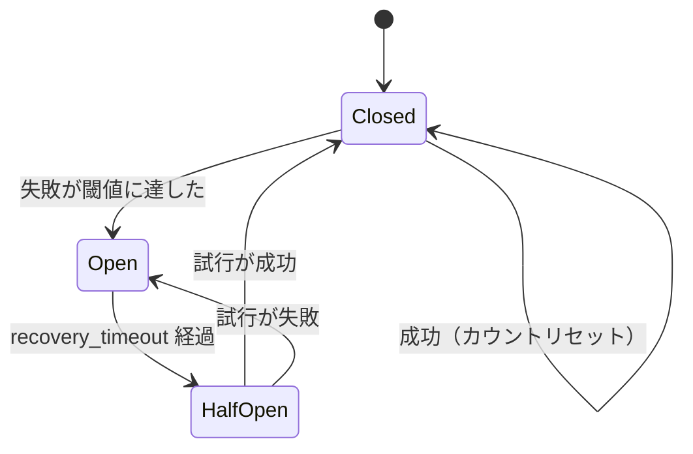

---
categories:
  - tech
date: 2026-04-14T07:07:05+09:00
description: 外部API障害でECサイトが共倒れ——忠実すぎるリトライが招く連鎖崩壊を、Circuit Breakerパターンの三つの状態で遮断するコード探偵ロックの推理。
draft: false
epoch: 1776118025
image: /favicon.png
iso8601: 2026-04-14T07:07:05+09:00
tags:
  - design-pattern
  - perl
  - moo
  - circuit-breaker
  - cascading-failure
  - refactoring
  - code-detective
title: コード探偵ロックの事件簿【Circuit Breaker】帰らない密偵たち〜落ちた通信網に送り続ける忠義の代償〜
toc: true
---

「倉庫のAPIが落ちると、ECサイト全体が道連れになるんです」

私は白石彩音、二十五歳。社内ECサイトのバックエンド開発を担当しているエンジニアだ。

このECサイトには、注文時に外部の倉庫管理APIを呼び出して在庫を確認する処理がある。普段は問題ない。だが月に一度くらいの頻度で倉庫APIが不安定になる。そのたびに、ECサイト全体が応答不能になる。

最初はリトライ処理を入れれば解決すると思った。一回目が失敗しても、二回目、三回目で成功するかもしれない。だがリトライを入れた結果、状況はむしろ悪化した。倉庫APIが落ちると、すべてのリクエストが三回ずつリトライを試みる。百件のリクエストで三百回の無駄な呼び出し。ECサイトのスレッドがリトライ待ちで埋め尽くされ、在庫確認と関係ないページまで表示できなくなる。

「レガシー・コード・インベスティゲーション（LCI）」

雑居ビルの三階。扉を開けると、壁にブレーカー——家庭にあるような配電盤の遮断器——のカタログが何枚も貼ってあった。付箋が大量に貼られていて、「20A」「過負荷検知」「自動復帰」といった文字が見える。（探偵事務所なのか、電気工事屋なのか。少なくとも探偵っぽくはない）

「——ほう。帰らない密偵の事件だね」

「白石です。密偵って何ですか」

「外部APIへのリクエストは、敵地に送り込む密偵のようなものだ。正常なら情報を持ち帰る。だが通信網が落ちたら？　密偵は帰ってこない。それでも次の密偵を送り込む。三人目も帰ってこない。なのに四人目を送る。これは忠誠心ではない、無謀だよ、ワトソン君」

「あの、白石です。……APIのリトライの話なんですが」

「証拠を見せたまえ。何人の密偵が帰ってこなかったか数えよう」

## 現場検証：帰らない密偵たち

コードを見せると、ロックは `ExternalApiClient` の `call` メソッドを読み始めた。

```perl
package ExternalApiClient;
use Moo;
use Types::Standard qw(Int Object);

has service     => (is => 'ro', isa => Object, required => 1);
has max_retries => (is => 'ro', isa => Int, default => 3);

sub call {
    my ($self, $params) = @_;

    my $attempts = 0;
    my $last_error;
    while ($attempts < $self->max_retries) {
        $attempts++;
        my $result = eval { $self->service->request($params) };
        if ($@) {
            $last_error = $@;
            next;
        }
        return $result;
    }
    die "API call failed after $attempts attempts: $last_error";
}
```

ロックは `while` ループを指で叩いた。

「失敗したら `next` で即リトライ。三回繰り返す。APIが落ちているなら、三回とも失敗する。待つだけ無駄だ」

「でも、たまたまAPIが復旧するかもしれないじゃないですか。リトライすれば——」

「一人の密偵が帰ってこないのは事故かもしれない。だが三人連続で帰ってこないなら、通信網そのものが落ちている。四人目を送っても結果は同じだ」

「それはそうですけど、でもリクエストごとに判断しているんです。前のリクエストが失敗したことは、次のリクエストでは知りようがない——」

「そこだ」ロックは立ち上がった。「この `ExternalApiClient` には**記憶がない**。前のリクエストが三回失敗したことを、次のリクエストは知らない。だから同じ過ちを繰り返す」

私はサーバーのログを思い出した。障害時のログには、同じエラーが何百行も並んでいた。すべてのリクエストが独立して三回ずつリトライしていたのだ。

「初歩的なにおいだよ、ワトソン君。**Cascading Failure**——忠実なリトライが、自分自身を巻き添えにする連鎖崩壊だ。倉庫APIが倒れると、ECサイトがリトライの嵐で自滅する。一つの障害が二つのシステムを倒す」

「じゃあ、リトライをなくせばいいんですか？」

「リトライをなくすのではない。**リトライすべきでない状況を判断する仕組み**が必要なんだ」

## 推理披露：三つの状態を持つ遮断器

「解決策は **Circuit Breaker** だ。電気のブレーカーと同じ原理だよ。過負荷を検知したら回路を遮断し、被害の拡大を防ぐ」

ロックは壁のブレーカーカタログを指した。

「家庭のブレーカーは過電流が流れると自動的に落ちるだろう？　電線が発火する前に回路を切る。コードのブレーカーも同じだ。失敗が続いたら、リクエストを通す回路を切る」

「回路を切ったら、リクエストはどうなるんですか？」

「即座にエラーを返す。APIを呼ばずに。密偵を送り込まずに。それだけで、自システムのリソースは守られる」

ロックはブレーカーの三つの状態を描いた。



「**Closed**——正常状態。リクエストはそのまま通す。ただし失敗を数えている。**Open**——遮断状態。リクエストを即座に拒否する。APIには一切触れない。そして**Half-Open**——試験状態。一定時間が経ったら、一件だけリクエストを通して回復を確認する」

「三つの状態……。状態遷移ですね」

「その通り。では実装を見せよう」

```perl
package CircuitBreaker;
use Moo;
use Types::Standard qw(Int Num Str CodeRef);
use Carp qw(croak);

has failure_threshold  => (is => 'ro', isa => Int, default => 3);
has recovery_timeout   => (is => 'ro', isa => Num, default => 30);
has _state             => (is => 'rw', isa => Str, default => 'closed');
has _failure_count     => (is => 'rw', isa => Int, default => 0);
has _last_failure_time => (is => 'rw', isa => Num, default => 0);
has _now_func          => (is => 'ro', isa => CodeRef,
                           default => sub { sub { time() } });
```

「六つの属性だ。`failure_threshold` は何回失敗したら回路を開くか。`recovery_timeout` は回路を開いてから何秒後に試験するか。`_state` は現在の状態。`_failure_count` は連続失敗回数。`_last_failure_time` は最後に失敗した時刻。そして `_now_func`——」

「時刻の取得をクロージャで渡しているんですか？」

「テストのためだ。本番では `time()` を使うが、テストでは時間を自由に操りたい。時間を外から注入できるようにしておく」（Object Pool の `factory` と同じ発想だ。テストのしやすさを最初から考えている）

続いて `call` メソッド。

```perl
sub call {
    my ($self, $action) = @_;

    if ($self->_state eq 'open') {
        if ($self->_now_func->() - $self->_last_failure_time
                >= $self->recovery_timeout) {
            $self->_state('half_open');
        }
        else {
            croak "Circuit is open: requests are blocked";
        }
    }

    my $result = eval { $action->() };
    if ($@) {
        $self->_on_failure;
        croak $@;
    }
    $self->_on_success;
    return $result;
}
```

「`call` の冒頭で状態をチェックする。Open なら `recovery_timeout` が経過しているか確認し、経過していれば Half-Open に遷移。経過していなければ即座にエラーを返す——APIを呼ばずに」

「APIを呼ばずにエラーを返す……。それって、ユーザーには同じエラーに見えませんか？」

「見える。だがAPIを呼んでタイムアウトまで三十秒待つのと、即座にエラーを返すのでは、リソース消費がまるで違う。三十秒間スレッドを占有するか、一ミリ秒で解放するか。百件のリクエストで五十分の待機時間が消えるんだ」

「五十分……！」

次に、成功時と失敗時のハンドラ。

```perl
sub _on_success {
    my ($self) = @_;
    $self->_failure_count(0);
    $self->_state('closed');
}

sub _on_failure {
    my ($self) = @_;
    $self->_failure_count($self->_failure_count + 1);
    $self->_last_failure_time($self->_now_func->());
    if ($self->_failure_count >= $self->failure_threshold) {
        $self->_state('open');
    }
}
```

「成功したら失敗カウントをリセットして Closed に。失敗したらカウントを増やし、閾値に達したら Open にする。シンプルだろう？」

「Half-Open の状態で成功したら `_on_success` が呼ばれて……Closed に戻るんですね」

「その通り。密偵を一人だけ送ってみて、無事に帰ってきたら通信網が復旧した証拠だ。回路を閉じて通常運用に戻す」

ロックは `ExternalApiClient` を書き直した。

```perl
package ExternalApiClient;
use Moo;
use Types::Standard qw(Object);

has service => (is => 'ro', isa => Object, required => 1);
has breaker => (is => 'ro', isa => Object, required => 1);

sub call {
    my ($self, $params) = @_;

    return $self->breaker->call(sub {
        $self->service->request($params);
    });
}
```

「Before では `while` ループでリトライしていた。After では `breaker->call` にクロージャを渡すだけだ。リトライの判断はブレーカーが行う」

私はコードを見比べた。Before の `call` メソッドは十五行。After は三行。ブレーカーという「記憶を持つ門番」が、リトライすべきかどうかを判断してくれる。

## 事件解決：遮断器が守る通信線

テストを走らせた。

```
# Subtest: After: Open 状態ではリクエストが即座に拒否される
ok 1 - Open になるまで3回呼び出し
ok 2 - Open 中は外部APIを一切呼ばない
ok 3 - Open 中はブレーカー例外

# Subtest: After: recovery_timeout 経過後に Half-Open になる
ok 1 - Open になった
ok 2 - リクエストが成功
ok 3 - Closed に復帰
ok 4 - 失敗カウントがリセット

# Subtest: After: 障害時に CircuitBreaker が呼び出しを遮断する
ok 1 - 3回で遮断
ok 2 - 遮断後は外部APIを呼ばない
```

全テスト、警告ゼロでパスした。ブレーカーが開くと、外部APIへの呼び出しが完全に止まる。

「三回失敗したら遮断。遮断中は外部APIを一切呼ばない。そして一定時間後に一件だけ試して、復旧を確認する……」

「Before なら、百件のリクエストで三百回の無駄な呼び出しだった。After なら、最初の三回で遮断が入り、残りの九十七件は即座にエラーを返す。外部APIへの呼び出しは三回だけだ」

「九十七件分のリソースが守られる……！　しかもAPIが復旧したら自動的に元に戻るんですね」

「密偵を全滅させる前に通信を切る。そして時間を置いてから偵察を一人だけ送る。帰ってきたら回線を開く。帰ってこなければ、もう少し待つ。それが Circuit Breaker だ」

私は次の月末のことを考えた。倉庫APIが落ちても、ECサイトは動き続ける。在庫確認はエラーになるが、商品一覧や検索は正常に表示される。全面ダウンを部分的なエラーに封じ込められる。

「報酬は、このブレーカーの `failure_threshold` と同じ杯数のアールグレイでいい」

三杯。まあ、紅茶なら常識的な量だ。

「……アールグレイにするところだけは、ちょっと探偵っぽいですね」

「当然だよ。ホームズはアールグレイを好んだ」（それ、本当だろうか。でも指摘する勇気はなかった）

---

## 探偵の調査報告書

| 容疑（アンチパターン） | 真実（パターン） | 証拠（効果） |
|---|---|---|
| Cascading Failure — 外部API障害時にリトライが殺到し、呼び出し側もリソースを使い果たして共倒れする。百件のリクエストで三百回の無駄な呼び出しが発生 | Circuit Breaker — 失敗が閾値に達したら回路を遮断（Open）し、外部APIへのリクエストを即座に拒否。recovery_timeout 経過後に Half-Open で復旧を確認 | 障害時の外部API呼び出しが三百回から三回に激減。ECサイトのリソースが守られ、全面ダウンが部分的エラーに封じ込められた |
| 記憶なきリトライ — 各リクエストが独立してリトライし、前のリクエストの失敗を活かせない | 状態を持つ門番 — CircuitBreaker が失敗回数と最終失敗時刻を記憶し、システム全体でリトライの判断を共有 | Closed / Open / Half-Open の三つの状態で、リトライすべき状況としてはならない状況を自動判断 |

### 推理のステップ

1. **連鎖崩壊の構造を見抜く** — 外部サービス障害時に、自システムがリトライの嵐で自滅する構造を特定する。ループ内の `eval` + リトライが典型的なサイン
2. **CircuitBreaker クラスを実装する** — `failure_threshold`（閾値）、`recovery_timeout`（回復待機時間）、三つの状態（Closed / Open / Half-Open）を持つブレーカーを作る
3. **call メソッドで状態遷移を実装する** — Open なら即座にエラー、Half-Open なら試行、Closed なら通過。成功でカウントリセット、失敗でカウント増加
4. **利用側をブレーカー経由に書き換える** — `while` ループのリトライを `breaker->call(sub { ... })` に置き換える。リトライの判断をブレーカーに委譲する
5. **状態遷移のテストを書く** — Closed → Open（閾値到達）、Open → Half-Open（timeout経過）、Half-Open → Closed（試行成功）、Half-Open → Open（試行失敗）の各遷移を検証する

### ロックより

忠誠心は美徳だが、盲目の忠誠は味方を殺す。落ちた通信網に密偵を送り続ければ、密偵が全滅するだけでなく、本拠地の戦力まで削られる。一つの障害が二つのシステムを倒す。それが連鎖崩壊だ。

Circuit Breaker は「諦める勇気」を自動化する。三人帰ってこなかったら、回線を切る。一定時間後に一人だけ偵察に出す。帰ってきたら回線を開く。この単純な規律が、全滅を防ぐ。

帰らない密偵の後を追うな。回線を切り、時を待ちたまえ、ワトソン君。
