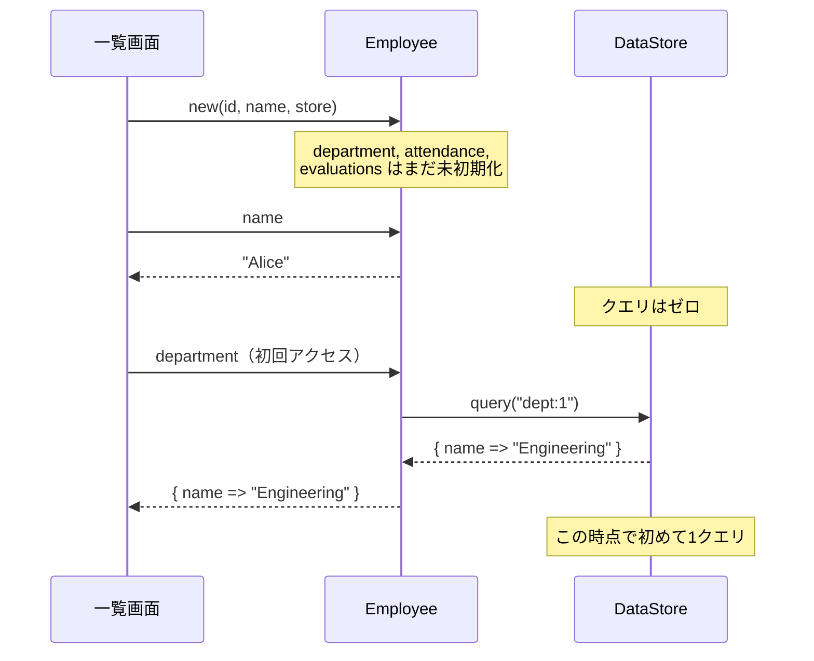

---
categories:
  - tech
date: 2026-04-15T07:07:05+09:00
description: 社員一覧で名前しか使わないのに全関連データを読み込む過剰なEager Loading——Mooのis => 'lazy'で必要な瞬間まで読み込みを遅延するコード探偵ロックの推理。
draft: false
epoch: 1776204425
image: /favicon.png
iso8601: 2026-04-15T07:07:05+09:00
tags:
  - design-pattern
  - perl
  - moo
  - lazy-loading
  - eager-loading
  - refactoring
  - code-detective
title: コード探偵ロックの事件簿【Lazy Loading】開かずの重荷物〜読まない調書が押し潰す証拠庫〜
toc: true
---

「社員一覧の画面が、表示に十秒以上かかるんです」

僕は園田航平、二十七歳。社内の人事管理システムを開発しているバックエンドエンジニアだ。

このシステムには社員一覧画面がある。名前とIDを一覧で表示するだけのシンプルな画面だ。なのに、社員が百人を超えたあたりから目に見えて遅くなった。

原因の見当はついていた。社員データを取得する処理が重いのだ。だがどこが重いのかまでは掴めていない。コード自体はシンプルで、`Employee->new` でオブジェクトを作って、`name` を表示しているだけ。なのになぜ遅い？

「レガシー・コード・インベスティゲーション（LCI）」

雑居ビルの三階。扉を開けると、机の上に本が山積みになっていた。技術書、ミステリー小説、ヴィンテージのキーボードのカタログ。少なくとも二十冊はある。背表紙に埃が積もっている。（読んでいないのが一目でわかる）

「——ほう。開かずの重荷物だね」

「園田です。重荷物って何ですか」

ロックは机の山を指して言った。

「この本を見たまえ。いつか読むと思って手元に置いてある。だが実際に開くのは二、三冊だ。残りは机を圧迫しているだけ。コードも同じだよ、ワトソン君」

「あの、園田です。……社員一覧が遅いんですが」

「証拠を見せたまえ。何冊の本が開かれずに積まれているか数えよう」

## 現場検証：開かずの重荷物

コードを見せると、ロックは `Employee` クラスを読み始めた。

```perl
package Employee;
use Moo;
use Types::Standard qw(Str Int ArrayRef HashRef Object);

has id    => (is => 'ro', isa => Int, required => 1);
has name  => (is => 'ro', isa => Str, required => 1);
has store => (is => 'ro', isa => Object, required => 1);

has department  => (is => 'lazy', isa => HashRef);
has attendance  => (is => 'lazy', isa => ArrayRef);
has evaluations => (is => 'lazy', isa => ArrayRef);

# 生成時に全属性を強制ロード
sub BUILD {
    my ($self) = @_;
    $self->department;
    $self->attendance;
    $self->evaluations;
}

sub _build_department {
    my ($self) = @_;
    return $self->store->query("dept:" . $self->id) // {};
}

sub _build_attendance {
    my ($self) = @_;
    return $self->store->query("attendance:" . $self->id) // [];
}

sub _build_evaluations {
    my ($self) = @_;
    return $self->store->query("evaluations:" . $self->id) // [];
}
```

ロックは `BUILD` メソッドを指で叩いた。

「ここだ。`BUILD` の中で `department`、`attendance`、`evaluations` を呼んでいる。オブジェクト生成時に、三つの属性をすべて強制的に読み込んでいるんだ」

「でも、`lazy` って書いてあるじゃないですか。遅延読み込みでは？」

「`is => 'lazy'` は確かに遅延読み込みの宣言だ。だが `BUILD` の中で即座にアクセスしている。せっかくの遅延を、自分で帳消しにしているんだよ」

僕は `BUILD` の三行を見つめた。`$self->department` を呼んだ瞬間に `_build_department` が走り、データベースにクエリが飛ぶ。`attendance` も `evaluations` も同様だ。

「一人の社員を生成するたびに三回のクエリ。百人なら——」

「三百回です」

「そして一覧画面で使っているのは？」

「……名前と ID だけです」

「三百回のクエリを発行して、使うのは名前だけ。残りの二百回は開かずの調書だ。証拠庫に積まれたまま、誰も読まない」

ロックは机の本の山を手で示した。

「初歩的なにおいだよ、ワトソン君。**Eager Loading**——使うかどうか分からないデータを、先にすべて読み込む過剰な事前読み込みだ」

「念のため全部読んでおけば、どの画面でも使えると思って……」

「念のため。その二文字が三百回のクエリを生んでいる」

## 推理披露：必要な証人だけ呼べ

「解決策は **Lazy Loading** だ。Moo にはこれを実現する仕組みが最初から備わっている」

「`is => 'lazy'`……さっきも見ましたけど、`BUILD` で台無しになっていたやつですよね」

「その通り。だから `BUILD` を消す」

ロックは `BUILD` メソッドを削除した。それだけだった。

```perl
package Employee;
use Moo;
use Types::Standard qw(Str Int ArrayRef HashRef Object);

has id    => (is => 'ro', isa => Int, required => 1);
has name  => (is => 'ro', isa => Str, required => 1);
has store => (is => 'ro', isa => Object, required => 1);

has department  => (is => 'lazy', isa => HashRef);
has attendance  => (is => 'lazy', isa => ArrayRef);
has evaluations => (is => 'lazy', isa => ArrayRef);

sub _build_department {
    my ($self) = @_;
    return $self->store->query("dept:" . $self->id) // {};
}

sub _build_attendance {
    my ($self) = @_;
    return $self->store->query("attendance:" . $self->id) // [];
}

sub _build_evaluations {
    my ($self) = @_;
    return $self->store->query("evaluations:" . $self->id) // [];
}
```

「……変わったの、`BUILD` を消しただけですよね」

「それだけだ」

「たった五行の削除で？」

「`is => 'lazy'` が仕事をしてくれる。Moo の `lazy` 属性は、最初に `$self->department` が呼ばれた瞬間に `_build_department` を実行する。呼ばれなければ、永遠に実行されない」



「`Employee->new` した時点では、`department` も `attendance` も `evaluations` も空っぽだ。メモリも消費しないし、クエリも飛ばない」

「じゃあ、一覧画面で百人の名前だけ表示するなら——」

「クエリはゼロだ。名前と ID は `required` で渡されているから、データベースに聞く必要がない。`department` にアクセスしなければ `_build_department` は永遠に動かない」

「ゼロ……！　三百回がゼロに……！」

「そして、詳細画面で一人の社員の部署を表示するなら、クエリは一回だ。その一人の `department` だけが読み込まれる。残りの九十九人の `department` は未初期化のままだ」

僕は頭の中で計算した。一覧表示でクエリ三百回がゼロに。詳細表示で三回が一回に。しかもコードの変更は `BUILD` の削除だけ。

「さらに、一度読み込んだ値はキャッシュされる。同じ `$self->department` を二回呼んでも、`_build_department` は一回目しか実行されない。Moo が結果を保持してくれる」

「二回目以降はキャッシュから返すんですね。データベースには聞かない」

「その通り。必要な証人だけ呼べばいい。全員を法廷に連れてくる必要はない」

## 事件解決：軽くなった証拠庫

テストを走らせた。

```
# Subtest: After: 生成時にはクエリが発生しない
ok 1 - new してもクエリはゼロ

# Subtest: After: 名前だけ使えばクエリはゼロ
ok 1 - 名前が正しい
ok 2 - 名前だけならクエリはゼロ

# Subtest: After: department だけアクセスすれば1回のクエリ
ok 1 - 部署が正しい
ok 2 - 部署だけなら1回のクエリ

# Subtest: After: 同じ属性への2回目のアクセスではクエリが発生しない
ok 1 - 1回目のアクセスで1クエリ
ok 2 - 2回目のアクセスでクエリ増えない

# Subtest: After: 100人の一覧表示（名前のみ）でクエリはゼロ
ok 1 - 100人の名前を取得
ok 2 - 100人でもクエリはゼロ
```

全テスト、警告ゼロでパスした。一覧表示のクエリが三百回からゼロになっている。

「百人でもゼロ……。しかも `BUILD` を消しただけで」

「Lazy Loading の本質は『必要になるまで仕事をしない』ことだ。仕事をしないのが最も速い。そして Moo の `lazy` は、その怠惰を正しく実現してくれる」

僕は社員一覧画面のことを考えた。Before なら、百人分の社員オブジェクトを作るだけで三百回のクエリが走る。一覧に必要なのは名前だけなのに。After なら、クエリはゼロ。詳細画面を開いたときに初めて、その社員の情報だけが読み込まれる。

「報酬は、削減したクエリ数の百分の一杯のコーヒーでいい」

三百回の削減で三杯。

「……三杯なら、まあ常識的ですね」

「怠惰は美徳だよ、ワトソン君。プログラマの三大美徳の一つだ」（それはラリー・ウォールの言葉だ。探偵の言葉じゃない。でも、Perl の生みの親の言葉なら、この場にはふさわしいのかもしれない）

---

## 探偵の調査報告書

| 容疑（アンチパターン） | 真実（パターン） | 証拠（効果） |
|---|---|---|
| Eager Loading — `BUILD` でオブジェクト生成時にすべての関連データを強制ロードしている。一覧表示で名前しか使わないのに、百人分の部署・勤怠・評価を一括読み込み（300クエリ） | Lazy Loading — Moo の `is => 'lazy'` で、属性に最初にアクセスした時点で初めて `_build_*` を実行する。アクセスしなければクエリはゼロ | 一覧表示のクエリが300回からゼロに。詳細表示でも必要な属性だけが読み込まれ、クエリは最小限 |
| キャッシュなし — 同じデータに二回アクセスすると二回クエリが走る可能性がある | 自動キャッシュ — Moo の `lazy` は `_build_*` の結果を保持し、二回目以降のアクセスではキャッシュから返す | 同じ属性への複数回アクセスでもクエリは初回の一回だけ |

### 推理のステップ

1. **過剰な事前読み込みを特定する** — `BUILD` やコンストラクタで、使用が不確実な関連データを即座に読み込んでいる箇所を探す
2. **`BUILD` での強制アクセスを削除する** — `$self->department` のような強制アクセスを `BUILD` から取り除く。これだけで `lazy` が本来の遅延動作を取り戻す
3. **`is => 'lazy'` を確認する** — 遅延したい属性が `is => 'lazy'`（または `lazy => 1`）になっていることを確認する。Moo はこの宣言で `_build_*` の実行を最初のアクセスまで遅延する
4. **テストでクエリ回数を検証する** — オブジェクト生成時のクエリ数がゼロであること、属性アクセス時にだけクエリが発生すること、二回目のアクセスでクエリが増えないことを確認する
5. **利用パターンごとに効果を測定する** — 一覧表示（名前のみ）、詳細表示（部署のみ）、全データ表示のそれぞれで、クエリ回数が最小限であることを検証する

### ロックより

開かずの調書を証拠庫に積み上げるな。読まない資料は、置いてあるだけで場所を取り、棚を圧迫し、本当に必要な証拠へのアクセスを遅くする。

Lazy Loading は「怠惰の美徳」を設計に組み込む技法だ。必要になるまで仕事をしない。呼ばれるまで読み込まない。そして一度読んだものは覚えておく。この三つの規律が、三百回のクエリをゼロにする。

必要な証人だけ呼びたまえ。全員を法廷に連れてくるのは、裁判官の仕事ではないよ、ワトソン君。
