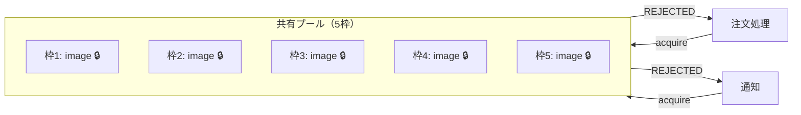
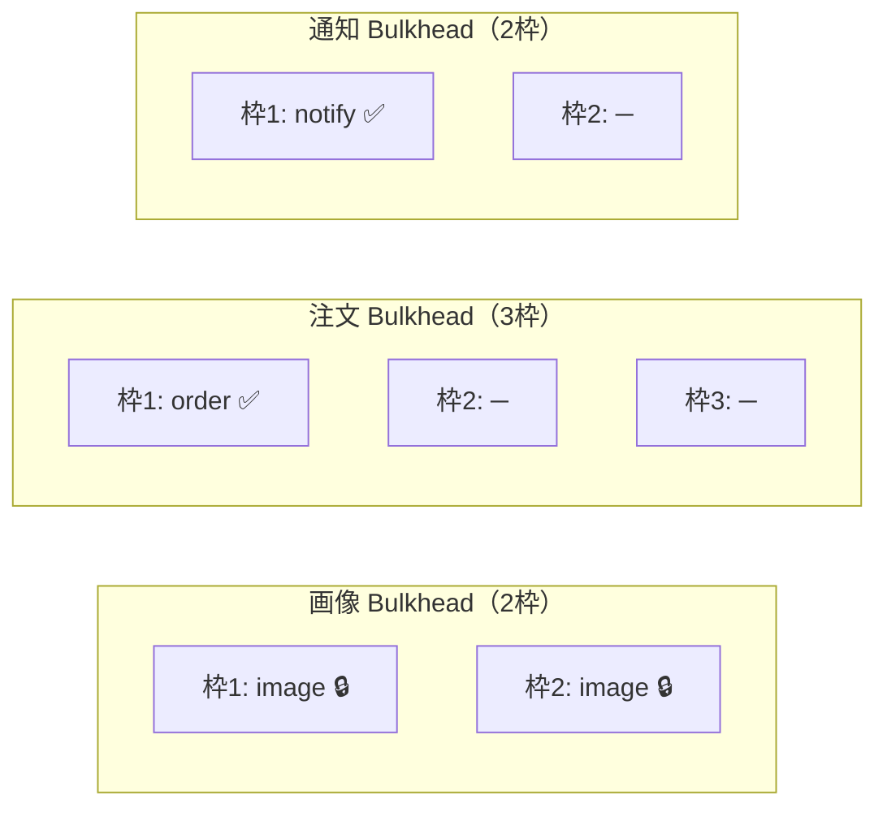

---
categories:
  - tech
date: 2026-04-16T07:07:05+09:00
description: 共有コネクションプールを画像変換が独占しECサイト全体が停止——Circuit Breakerでは防げなかった「遅延による占有」を、Bulkheadパターンのリソース隔壁で封じ込めるコード探偵ロックの推理。
draft: false
epoch: 1776290825
image: /favicon.png
iso8601: 2026-04-16T07:07:05+09:00
tags:
  - design-pattern
  - perl
  - moo
  - bulkhead
  - shared-resource-pool
  - refactoring
  - code-detective
title: コード探偵ロックの事件簿【Bulkhead】全館停電の共犯者〜一室の暴走が招く連鎖崩壊〜
toc: true
---

「Circuit Breakerを入れたのに、またシステムが落ちたんです」

私は白石彩音、二十五歳。社内ECサイトのバックエンド開発を担当しているエンジニアだ。

前回、ロックさんの助けでCircuit Breakerを導入した。外部の倉庫管理APIが落ちたとき、リトライの嵐でECサイトが自滅する問題は解消された。三回失敗したら回路を遮断する。密偵を全滅させる前に通信を切る。あれは見事な解決だった。

だが今回は違う。APIは落ちていない。ただ、**遅い**のだ。

商品画像の変換処理を外部サービスに委託しているのだが、先週そのサービスが極端に遅くなった。通常は200ミリ秒で返る処理が、20秒以上かかるようになった。エラーは出ない。タイムアウトもしない。ただ、じわじわとコネクションを保持し続ける。

結果、共有コネクションプールが画像変換のリクエストで埋め尽くされた。注文処理も、メール通知も、コネクションを取得できず次々にエラーになった。画像変換とは何の関係もないのに。

Circuit Breakerは発動しなかった。失敗していないのだから当然だ。遅いだけでは、ブレーカーは落ちない。

二度目のLCI訪問。正直に言えば、二度もお世話になるのは少し悔しい。

「——ほう。またワトソン君か」

扉を開けると、ロックはデスクの上で小さな船の模型を組み立てていた。帆船ではなく、客船のようだ。船体が何枚かの仕切り板で区切られているのが見える。

「前回のCircuit Breakerで解決したと思ったんですが……」

「ブレーカーは落ちなかったんだろう？」

「……はい。APIは落ちてないんです。ただ、画像変換が異常に遅くて——」

「遅いが、失敗しない。Circuit Breakerは**失敗**を数える仕組みだからね。遅延は失敗ではない」ロックは船の模型を持ち上げた。「この船にはいくつの区画がある？　一つの区画に水が入っても、他の区画は浸水しない。**隔壁**で仕切られているからだ。だが君のシステムには——壁がない」

## 現場検証：壁のない船

コードを見せると、ロックは `SharedPool` を読み始めた。

```perl
package SharedPool;
use Moo;
use Types::Standard qw(Int ArrayRef);
use Carp qw(croak);

has max_size   => (is => 'ro', isa => Int, default => 5);
has _available => (is => 'rw', isa => Int, lazy => 1, builder => '_build_available');
has _log       => (is => 'ro', isa => ArrayRef, default => sub { [] });

sub _build_available { $_[0]->max_size }

sub acquire {
    my ($self, $label) = @_;
    if ($self->_available <= 0) {
        push @{$self->_log}, "REJECTED:$label";
        croak "Pool exhausted: no connections available for '$label'";
    }
    $self->_available($self->_available - 1);
    push @{$self->_log}, "ACQUIRED:$label";
    return 1;
}

sub release {
    my ($self, $label) = @_;
    if ($self->_available < $self->max_size) {
        $self->_available($self->_available + 1);
        push @{$self->_log}, "RELEASED:$label";
    }
}
```

「五つの接続枠を全員で共有している。画像変換も、注文処理も、通知も。同じプールで泳いでいるわけだ」

```perl
package ServiceRunner;
use Moo;
use Types::Standard qw(InstanceOf);

has pool => (is => 'ro', isa => InstanceOf['SharedPool'], required => 1);

sub run_image_processing {
    my ($self) = @_;
    $self->pool->acquire('image');
    # 画像変換は重い——接続を長時間保持
    return 'image_done';
}

sub run_order_processing {
    my ($self) = @_;
    $self->pool->acquire('order');
    $self->pool->release('order');
    return 'order_done';
}

sub run_notification {
    my ($self) = @_;
    $self->pool->acquire('notify');
    $self->pool->release('notify');
    return 'notify_done';
}
```

ロックは `run_image_processing` を指した。

「画像変換は `acquire` した後、処理が終わるまで `release` しない。処理が20秒かかるなら、20秒間接続を占有する。五枠中三枠が画像変換に取られたら？」

「注文処理は残り二枠を奪い合うことに……」

「そしてその二枠も画像変換が取れば、注文処理はゼロ枠だ」



「全員が同じ部屋にいるから、一人が暴れると全員が倒れる。犯人の名は **Shared Resource Pool**——共有リソースの独占による連鎖崩壊だ」

「Circuit Breakerでは防げないんですね……」

「Circuit Breakerは**失敗に対する遮断器**だ。遅延によるリソース占有は管轄外。前回は回路を切った。今回は**壁を建てる**」

## 推理披露：船に隔壁を

「解決策は **Bulkhead（隔壁）** だ。船の隔壁と同じ原理」

ロックは船の模型の仕切り板を指でなぞった。

「タイタニック号が沈没した原因の一つは、隔壁の高さが足りなかったことだ。水が隔壁を越えて隣の区画に流れ込んだ。だが現代の船は、各区画が完全に独立している。一つの区画が浸水しても、他の区画は乾いたままだ」

「それをコードでやる、と」

「各サービスに**専用の同時実行枠**を割り当てる。共有プールをやめて、隔壁で仕切る」

```perl
package Bulkhead;
use Moo;
use Types::Standard qw(Int Str ArrayRef);
use Carp qw(croak);

has name           => (is => 'ro', isa => Str, required => 1);
has max_concurrent => (is => 'ro', isa => Int, required => 1);
has _active_count  => (is => 'rw', isa => Int, default => 0);
has _log           => (is => 'ro', isa => ArrayRef, default => sub { [] });
```

「四つの属性だ。`name` はこの隔壁の名前。`max_concurrent` は同時実行の上限。`_active_count` は現在のアクティブ数。`_log` は記録」

「SharedPool の `max_size` と似ていますが、`_active_count` で管理しているんですね。アクティブ数と上限だけ」

「そこが肝だ。共有プールは残り枠を減らしていくが、Bulkhead はアクティブ数を数える。各隔壁が自分の枠だけを見る。他の隔壁の枠は知らないし、奪えない」

続いて `execute` メソッド。

```perl
sub execute {
    my ($self, $action) = @_;
    if ($self->_active_count >= $self->max_concurrent) {
        push @{$self->_log}, "REJECTED:" . $self->name;
        croak sprintf(
            "Bulkhead '%s' is full (%d/%d): request rejected",
            $self->name, $self->_active_count, $self->max_concurrent,
        );
    }
    $self->_active_count($self->_active_count + 1);
    push @{$self->_log}, "ADMITTED:" . $self->name;
    my $result = eval { $action->() };
    my $err = $@;
    $self->_active_count($self->_active_count - 1);
    push @{$self->_log}, "RELEASED:" . $self->name;
    die $err if $err;
    return $result;
}
```

「まずアクティブ数が上限に達しているかチェックする。達していたら即座に拒否。待たせるのではなく、**断る**」

「待たせない、というのがポイントですか？」

「その通り。行列に並ばせたら、並んでいる間もリソースを消費する。門前払いなら一ミリ秒で終わる。被害を最小化するには、速く失敗させることだ」

「`eval` で囲んで、例外が出ても `_active_count` を減らしていますね」

「忘れてはいけない。アクションが例外を投げても、隔壁の枠は必ず解放する。`eval` と `$@` の組み合わせで、いわゆる try-finally に相当する処理を書いている。枠を解放し忘れたら、隔壁が永遠に詰まってしまう」

次に、ロックは `IsolatedServiceRunner` を書いた。

```perl
package IsolatedServiceRunner;
use Moo;
use Types::Standard qw(InstanceOf);

has image_bulkhead => (
    is      => 'ro',
    isa     => InstanceOf['Bulkhead'],
    default => sub { Bulkhead->new(name => 'image', max_concurrent => 2) },
);
has order_bulkhead => (
    is      => 'ro',
    isa     => InstanceOf['Bulkhead'],
    default => sub { Bulkhead->new(name => 'order', max_concurrent => 3) },
);
has notify_bulkhead => (
    is      => 'ro',
    isa     => InstanceOf['Bulkhead'],
    default => sub { Bulkhead->new(name => 'notify', max_concurrent => 2) },
);

sub run_image_processing {
    my ($self) = @_;
    return $self->image_bulkhead->execute(sub {
        return 'image_done';
    });
}

sub run_order_processing {
    my ($self) = @_;
    return $self->order_bulkhead->execute(sub {
        return 'order_done';
    });
}

sub run_notification {
    my ($self) = @_;
    return $self->notify_bulkhead->execute(sub {
        return 'notify_done';
    });
}
```

「Before では全サービスが一つの `pool` を共有していた。After では各サービスが自分専用の `bulkhead` を持つ。画像変換は2枠、注文処理は3枠、通知は2枠。合計7枠だが、互いに侵食しない」



「画像変換が2枠とも埋まっても、注文処理の3枠はまるごと空いている。壁で仕切られているから、隣の区画の浸水が流れ込まない」

「なるほど……。画像変換が遅くなっても、注文は影響を受けない。完全に独立しているんですね」

「それが隔壁の力だ。一つの区画が沈んでも、船は沈まない」

## 事件解決：隔壁に守られた航路

テストを走らせた。

```
# Subtest: After: 画像変換の枠が満杯でも注文処理は独立して動作する
ok 1 - 画像変換が拒否される
ok 2 - 注文処理は正常
ok 3 - 通知も正常

# Subtest: After: 各 Bulkhead のアクティブ数は互いに独立している
ok 1 - 画像: アクティブ2
ok 2 - 注文: アクティブ0
ok 3 - 通知: アクティブ0

# Subtest: After: アクション内で例外が発生してもアクティブ数が解放される
ok 1 - 例外が伝播する
ok 2 - 例外後もアクティブ数は0に戻る
```

全テスト、警告ゼロでパスした。画像変換の隔壁が満杯でも、注文処理と通知は自分の枠で独立して動いている。

「画像変換が遅くなっても、注文はちゃんと通る……！」

「前回はCircuit Breakerで**失敗の連鎖**を断ち切った。今回はBulkheadで**遅延の侵食**を防いだ。この二つは補完関係にある」

「Circuit Breakerが回路の遮断で、Bulkheadが部屋の隔離……」

「その通り。外部サービスが完全に落ちたらCircuit Breakerが回路を切る。外部サービスが遅くなったらBulkheadがリソースの浸水を食い止める。どちらも**障害の影響範囲を限定する**という同じ哲学だ」

私は先週の障害を思い出した。画像変換が遅くなっただけで、注文もメールも止まった。あのとき隔壁があれば、画像変換だけが遅くなり、注文は正常に処理されていた。全面停止と部分的な遅延では、ビジネスへのインパクトがまるで違う。

「報酬は——この船の模型の区画数と同じ杯数のエスプレッソだ。つまり五杯」

「五杯……。前回のアールグレイ三杯に比べると、随分カフェインが強くなりましたね」

「隔壁が多い船ほど沈みにくい。カフェインが多い探偵ほど鋭い。同じ原理だよ」

（それは原理とは言わない気がする。でも前回よりコーヒー代が安いので、指摘しないでおく）

---

## 探偵の調査報告書

| 容疑（アンチパターン） | 真実（パターン） | 証拠（効果） |
|---|---|---|
| Shared Resource Pool — 全サービスが単一のコネクションプールを共有し、画像変換の遅延が全5枠を占有。注文処理も通知もコネクションを取得できず全面停止 | Bulkhead — 各サービスに独立した同時実行枠（隔壁）を割り当て、リソースの相互侵食を防止。画像2枠・注文3枠・通知2枠で隔離 | 画像変換が遅延しても注文処理と通知は独立して稼働。全面停止が画像サービスのみの部分停止に封じ込められた |
| Circuit Breakerの盲点 — 遅延は失敗ではないため、Circuit Breakerが発動しない。エラーなき遅延がリソースを静かに食い尽くす | 即時拒否の原則 — 枠が満杯なら待たせずに即座に拒否。行列による二次被害を防ぎ、素早い失敗でリソースを解放 | 枠満杯時は1ミリ秒でエラーを返し、スレッドやコネクションの長時間占有を回避 |

### 推理のステップ

1. **共有リソースの構造を特定する** — 複数のサービスが単一のプール（コネクションプール、スレッドプール等）を共有していないか確認する。`acquire` と `release` が全員で同じインスタンスを叩いているのが典型的なサイン
2. **Bulkhead クラスを実装する** — `name`（隔壁名）、`max_concurrent`（同時実行上限）、`_active_count`（現在のアクティブ数）を持つ隔壁を作る
3. **execute メソッドで枠を管理する** — 上限に達していたら即座に拒否。枠内なら `_active_count` を増やしてアクションを実行し、完了後に必ず減らす。例外時も解放を忘れないこと
4. **各サービスに専用の Bulkhead を割り当てる** — 共有プールをやめて、サービスごとに独立した隔壁を持たせる。枠の配分は各サービスの重要度と負荷特性に応じて決める
5. **隔離のテストを書く** — 一つの隔壁が満杯のとき、他の隔壁が独立して動作することを検証する。例外時の枠解放も忘れずにテストする

### ロックより

前回は回路を切った。今回は壁を建てた。どちらも同じ哲学だ——障害の影響範囲を限定せよ。

Circuit Breakerは失敗を遮断する。だがすべての障害が「失敗」の形をとるわけではない。遅延という名の静かな殺人もある。エラーを出さず、ただリソースを食い尽くす。ブレーカーは沈黙の前に無力だ。

Bulkheadは空間を仕切る。一つの区画が沈んでも、隔壁が他の区画を守る。タイタニック号の教訓だよ。壁が足りなければ、船は沈む。

障害に強いシステムは、壁の数で決まる。壁を建てたまえ、ワトソン君。
