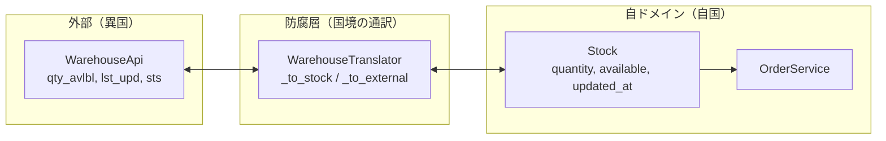

---
categories:
  - tech
date: 2026-04-17T07:07:05+09:00
description: 外部APIの略語カラムや歪な日付形式がドメインコードを侵食する——Anti-Corruption Layerで翻訳層を設け、外部の汚れを自ドメインに持ち込ませないコード探偵ロックの推理。
draft: false
epoch: 1776377225
image: /favicon.png
iso8601: 2026-04-17T07:07:05+09:00
tags:
  - design-pattern
  - perl
  - moo
  - anti-corruption-layer
  - domain-pollution
  - refactoring
  - code-detective
title: コード探偵ロックの事件簿【Anti-Corruption Layer】翻訳なき外交官〜異国の書式が壊す捜査本部〜
toc: true
---

「外部APIの仕様が変わるたびに、自社のコードを二十箇所以上直す羽目になるんです」

私は藤村真帆、二十六歳。自社ECサイトと外部の倉庫管理システムとの連携を担当しているエンジニアだ。

ECサイトでは、注文時に倉庫管理APIを呼び出して在庫を確認している。このAPI自体は安定して動いているのだが、問題はその返却データの形式だ。カラム名が `qty_avlbl`、`lst_upd`、`sts` のような暗号めいた略語で、日付は `YYYYDDMM` という見慣れない並び。ステータスは `1` と `0` の数値。

最初はそのまま使っていた。だが気がつくと、自社のドメインコードの至る所にこれらの略語と変換処理が散らばっていた。先月、外部APIのバージョンアップでカラム名が一部変わったとき、修正箇所を洗い出すだけで半日かかった。

「レガシー・コード・インベスティゲーション（LCI）」

雑居ビルの三階。扉を開けると、ロックが机の上に辞書を三冊広げていた。英和、仏和、独和。その傍らにはいつもの飲みかけのエナジードリンク缶。辞書に付箋が大量に貼ってあるが、どのページも開かれた形跡がない。（辞書を集めるだけで満足しているタイプだ）

「——ほう。翻訳なき外交官の事件だね」

「藤村です。翻訳って何ですか」

「異国の捜査機関から証拠品が届いたとする。書類の書式は異国のもの、日付の並びも違う、用語もすべて略語だ。それを翻訳もせずに自国の捜査ファイルに直接混ぜたらどうなる？」

「……異国の書式が変わるたびに、自国のファイルを全部書き直すことに——」

「まさにそういうことだよ、ワトソン君。証拠を見せたまえ」

## 現場検証：異国の書式に汚染された捜査本部

コードを見せると、ロックは `OrderService` の `check_availability` メソッドを読み始めた。

```perl
package OrderService;
use Moo;
use Types::Standard qw(Object);

has warehouse_api => (is => 'ro', isa => Object, required => 1);

sub check_availability {
    my ($self, $product_id) = @_;
    my $raw = $self->warehouse_api->get_stock($product_id);

    # 外部APIの形式を直接解釈
    my $quantity  = $raw->{qty_avlbl};
    my $raw_date  = $raw->{lst_upd};
    my $available = $raw->{sts} == 1;

    # YYYYDDMM → YYYY-MM-DD
    my ($y, $d, $m) = $raw_date =~ /^(\d{4})(\d{2})(\d{2})$/;
    my $updated_at = "$y-$m-$d";

    return {
        quantity   => $quantity,
        available  => $available,
        updated_at => $updated_at,
    };
}

sub place_order {
    my ($self, $product_id, $amount) = @_;
    my $stock = $self->check_availability($product_id);
    die "Out of stock" unless $stock->{available};
    die "Insufficient stock" unless $stock->{quantity} >= $amount;

    return $self->warehouse_api->reduce_stock({
        prd_id  => $product_id,
        qty_rdc => $amount,
        sts     => 1,
    });
}
```

ロックは `qty_avlbl` を指で叩いた。

「`qty_avlbl`——quantity available の略だろうか。`lst_upd` は last updated。`sts` は status。これは外部APIの言語だ。なぜ自社の `OrderService` がこの言語を直接読み書きしている？」

「外部APIがこの形式で返してくるので、仕方なく……」

「`check_availability` を見たまえ。日付の `YYYYDDMM` を `YYYY-MM-DD` に変換する三行がある。この変換を、在庫確認とは関係のないメソッドでも書いていないかね？」

私は黙った。在庫表示画面、発注履歴画面、管理者ダッシュボード。少なくとも五箇所に同じ日付変換のコードがあった。

「そして `place_order` を見たまえ。外部APIに送るデータも `prd_id`、`qty_rdc`、`sts`——外部の言語だ。自社のドメインロジック（在庫確認と注文処理）と、外部形式の変換が一つのクラスに混在している」

「初歩的なにおいだよ、ワトソン君。**Domain Pollution**——外部の汚れが自ドメインに侵食している。異国の書式を翻訳せずに使えば、異国の都合で自国が振り回される」

## 推理披露：国境に翻訳官を置け

「解決策は **Anti-Corruption Layer** だ。直訳すれば『防腐層』。外部システムとの境界に翻訳層を設け、外部の汚れを自ドメインに持ち込ませない」

「防腐層……。壁を作るんですか？」

「壁ではない、通訳だ。異国の書類を自国語に翻訳してから読む。自国の指示を異国語に翻訳してから送る。通訳がいれば、異国の書式が変わっても、通訳の対応表を直すだけで済む」

ロックはまず、自ドメインの「言語」を定義した。

```perl
package Stock;
use Moo;
use Types::Standard qw(Int Str Bool);

has product_id => (is => 'ro', isa => Int, required => 1);
has quantity   => (is => 'ro', isa => Int, required => 1);
has available  => (is => 'ro', isa => Bool, required => 1);
has updated_at => (is => 'ro', isa => Str, required => 1);
```

「`Stock` はドメインオブジェクトだ。自分たちの言葉で在庫を表現する。`quantity`、`available`、`updated_at`——略語ではない、意味がそのまま伝わる名前だ」

「`qty_avlbl` じゃなくて `quantity`……。確かに読みやすいですけど、外部APIは `qty_avlbl` で返してきますよね」

「だから通訳を置く」

```perl
package WarehouseTranslator;
use Moo;
use Types::Standard qw(Object);

has api => (is => 'ro', isa => Object, required => 1);

sub fetch_stock {
    my ($self, $product_id) = @_;
    my $raw = $self->api->get_stock($product_id);
    return $self->_to_stock($product_id, $raw);
}

sub reduce_stock {
    my ($self, $product_id, $amount) = @_;
    return $self->api->reduce_stock(
        $self->_to_external_reduce($product_id, $amount)
    );
}
```

「`WarehouseTranslator` が Anti-Corruption Layer だ。外部APIを呼び出し、結果を自ドメインの `Stock` に翻訳する。逆方向も同じだ——自ドメインの注文を外部APIの形式に変換して送る」

「翻訳メソッドはどうなっているんですか？」

```perl
sub _to_stock {
    my ($self, $product_id, $raw) = @_;
    my ($y, $d, $m) = $raw->{lst_upd} =~ /^(\d{4})(\d{2})(\d{2})$/;
    return Stock->new(
        product_id => $product_id,
        quantity   => $raw->{qty_avlbl},
        available  => ($raw->{sts} == 1),
        updated_at => "$y-$m-$d",
    );
}

sub _to_external_reduce {
    my ($self, $product_id, $amount) = @_;
    return {
        prd_id  => $product_id,
        qty_rdc => $amount,
        sts     => 1,
    };
}
```

「`_to_stock` は外部→自ドメインの翻訳。`qty_avlbl` を `quantity` に、`lst_upd` の `YYYYDDMM` を `YYYY-MM-DD` に、`sts` の `1/0` を真偽値に変換する。`_to_external_reduce` は自ドメイン→外部の翻訳だ」

「日付変換もここに集約されるんですね。五箇所に散らばっていた変換ロジックが一箇所に」

「その通り。そして `OrderService` はこうなる」

```perl
package OrderService;
use Moo;
use Types::Standard qw(Object);

has warehouse => (is => 'ro', isa => Object, required => 1);

sub check_availability {
    my ($self, $product_id) = @_;
    return $self->warehouse->fetch_stock($product_id);
}

sub place_order {
    my ($self, $product_id, $amount) = @_;
    my $stock = $self->check_availability($product_id);
    die "Out of stock" unless $stock->available;
    die "Insufficient stock" unless $stock->quantity >= $amount;
    return $self->warehouse->reduce_stock($product_id, $amount);
}
```

「……`qty_avlbl` も `lst_upd` も `sts` も、一つも残っていない」

「`OrderService` は `Stock` オブジェクトだけを扱う。`$stock->quantity`、`$stock->available`——すべて自ドメインの言葉だ。外部APIの存在すら知らない」



「通訳を挟めば、異国の書式が変わっても、通訳の対応表を直すだけで済む。自国の公文書には一切手を入れる必要がない」

私は先月の悪夢を思い出した。外部APIのカラム名が変わったとき、二十箇所以上を修正した。Anti-Corruption Layer があれば、修正は `_to_stock` と `_to_external_reduce` の二箇所だけで済む。

## 事件解決：浄化された捜査本部

テストを走らせた。

```
# Subtest: After: WarehouseTranslator — 外部形式を Stock に変換する
ok 1 - An object of class 'Stock' isa 'Stock'
ok 2 - 商品IDが正しい
ok 3 - 数量が正しい
ok 4 - 在庫あり
ok 5 - YYYYDDMM → YYYY-MM-DD に変換

# Subtest: After: OrderService — 外部カラム名が一切登場しない
ok 1 - An object of class 'Stock' isa 'Stock'
ok 2 - ドメインの言語で数量にアクセス
ok 3 - ドメインの言語で在庫状態にアクセス

# Subtest: After: 仕様変更シミュレーション — Translator だけ修正すれば済む
ok 1 - ドメインの quantity メソッド
ok 2 - ドメインの available メソッド
ok 3 - ドメインの updated_at メソッド
ok 4 - 外部の qty_avlbl は存在しない
ok 5 - 外部の lst_upd は存在しない
ok 6 - 外部の sts は存在しない
```

全テスト、警告ゼロでパスした。`OrderService` から外部APIの痕跡が完全に消えている。

「`Stock` オブジェクトには `qty_avlbl` メソッドが存在しない……。外部の汚れがドメインに入り込む余地がなくなったんですね」

「外部APIの仕様が変わっても、`WarehouseTranslator` の翻訳メソッドを直すだけだ。`OrderService` には指一本触れない」

「二十箇所の修正が、二箇所で済む……」

「外交には通訳がいる。異国の書類を直接読むな。翻訳してから読みたまえ」

ロックは辞書を閉じた。

「報酬は、翻訳した属性の数と同じ杯数のダージリンでいい」

四つの属性（`qty_avlbl` → `quantity`、`lst_upd` → `updated_at`、`sts` → `available`、`prd_id` → `product_id`）で四杯。

「……ダージリンにするところだけは、ちょっと英国紳士っぽいですね」

「ホームズもダージリンを好んだ」（そうかもしれない。でもこの人が好むのは、エナジードリンクの方だと思う）

---

## 探偵の調査報告書

| 容疑（アンチパターン） | 真実（パターン） | 証拠（効果） |
|---|---|---|
| Domain Pollution — 外部APIの独自カラム名（`qty_avlbl`, `lst_upd`, `sts`）と歪な日付形式がドメインコード全体に散らばっている。外部仕様変更のたびに二十箇所以上の修正が必要 | Anti-Corruption Layer — `WarehouseTranslator` が外部形式と自ドメインの唯一の翻訳層となる。外部 → `Stock` と 自ドメイン → 外部の双方向変換を担う | `OrderService` から外部カラム名が完全に消えた。外部API仕様変更時の修正箇所が翻訳層の二メソッドに集約 |
| 変換ロジックの散在 — 日付の `YYYYDDMM` → `YYYY-MM-DD` 変換が複数箇所に重複 | 変換の一元化 — `_to_stock` に日付変換を集約。同じ変換を二度書かない | 変換ロジックの修正が一箇所で完結し、変換ミスのリスクも低減 |

### 推理のステップ

1. **外部形式の侵食範囲を特定する** — ドメインコードの中で外部APIのカラム名（`qty_avlbl` 等）を直接参照している箇所を洗い出す。`grep` で一覧化するとよい
2. **ドメインオブジェクトを定義する** — 自ドメインの言葉で在庫を表現する `Stock` クラスを作る。`quantity`、`available`、`updated_at` のように、略語ではなく意味が伝わる名前にする
3. **翻訳層（Translator）を実装する** — 外部API → ドメインオブジェクト（`_to_stock`）と、ドメイン → 外部形式（`_to_external_reduce`）の双方向変換メソッドを持つ翻訳クラスを作る
4. **ドメインサービスを浄化する** — `OrderService` が翻訳層を介してのみ外部と通信するように書き換え、外部カラム名の直接参照をすべて削除する
5. **テストで汚染の遮断を検証する** — `Stock` オブジェクトに外部カラム名のメソッドが存在しないこと、`OrderService` が `Stock` だけに依存していることを確認する

### ロックより

外国の捜査機関から届いた証拠品を、翻訳もせずに自国の捜査ファイルに混ぜるのは愚の骨頂だ。書式が変われば捜査ファイルごと作り直す羽目になる。そして外国の書式は、こちらの都合などお構いなしに変わる。

Anti-Corruption Layer は、国境に通訳を置くことだ。異国の書類は通訳が自国語に翻訳してからファイルに入れる。自国の指示は通訳が異国語に直してから送る。ドメインは自分の言葉だけで仕事をする。外部の汚れに触れる必要はない。

異国の書式を直接読むな。通訳を雇いたまえ、ワトソン君。
