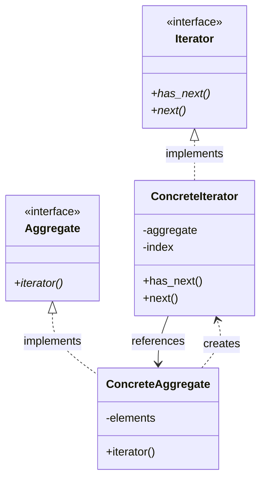
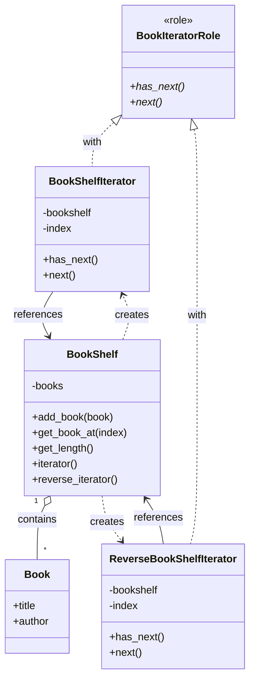

## はじめに

[@nqounet](https://x.com/nqounet)です。

シリーズ「**本棚アプリで覚える集合体の巡回**」の第5回、最終回です。

## これまでの振り返り

このシリーズでは、本棚アプリを題材に、集合体を巡回する仕組みを段階的に作ってきました。

- **第1回** — `Book`クラスと`BookShelf`クラスを作成し、集合体の基本を学んだ
- **第2回** — `for`ループで全ての本を表示し、カプセル化の問題に直面した
- **第3回** — `Moo::Role`で`BookIteratorRole`を定義し、`BookShelfIterator`クラスを作成した
- **第4回** — `BookShelf`に`iterator()`メソッドを追加し、利用者が走査クラスを意識せずに済むようにした

最終的に、利用者は以下のようなシンプルなコードで本棚の全ての本を順番に取り出せるようになりました。

```perl
my $iterator = $shelf->iterator;
while ($iterator->has_next) {
    my $book = $iterator->next;
    say $book->title . " / " . $book->author;
}
```

利用者は本棚の内部構造を知る必要がありません。「次があるか」と「次を取得する」という2つの操作だけで、全ての要素を処理できます。

## 今回学ぶこと：Iteratorパターンの全体像

実は、このシリーズで作ってきた設計には名前があります。**Iteratorパターン**です。

Iteratorパターンは、「GoF（Gang of Four）のデザインパターン」として知られる23のパターンの1つです。1994年に出版された『Design Patterns』という書籍で紹介され、オブジェクト指向設計の古典として世界中で読まれています。

### デザインパターンとは

デザインパターンとは、ソフトウェア設計における「よくある問題」に対する「再利用可能な解決策」のことです。先人たちが試行錯誤の末にたどり着いた設計の知恵が、パターンとして整理されています。

デザインパターンを学ぶメリットは以下の通りです。

- 設計の引き出しが増え、適切な設計を素早く選択できる
- 共通の語彙を持つことで、設計について議論しやすくなる
- 先人の失敗を繰り返さずに済む

### Iteratorパターンの目的

Iteratorパターンの目的は、「集合体の内部構造を公開せずに、その要素に順番にアクセスする手段を提供する」ことです。

このシリーズで直面した問題を思い出してください。

- `$shelf->books->@*`のように内部の配列に直接アクセスするとカプセル化が崩れる
- 本棚の内部構造が変更されると、利用者のコードも修正が必要になる

Iteratorパターンは、まさにこの問題を解決するためのパターンです。

## Iteratorパターンの4つの要素

Iteratorパターンは、以下の4つの要素（登場人物）で構成されます。



| 要素 | 役割 | 本棚アプリでの実装 |
|------|------|-------------------|
| **Iterator（反復子）** | 走査のインターフェースを定義する | `BookIteratorRole` |
| **ConcreteIterator（具体的な反復子）** | 実際の走査ロジックを実装する | `BookShelfIterator` |
| **Aggregate（集合体）** | イテレータを生成するインターフェースを定義する | （今回は省略） |
| **ConcreteAggregate（具体的な集合体）** | イテレータを返すメソッドを持つ | `BookShelf` |

それぞれの要素を詳しく見ていきます。

### Iterator（反復子）

走査に必要なメソッドを定義するインターフェースです。本棚アプリでは、`BookIteratorRole`がこの役割を担っています。

```perl
package BookIteratorRole {
    use Moo::Role;

    requires 'has_next';
    requires 'next';
}
```

`has_next`と`next`という2つのメソッドを要求することで、「Iteratorとは何か」を明確に定義しています。

### ConcreteIterator（具体的な反復子）

Iteratorインターフェースを実装し、実際の走査ロジックを提供するクラスです。本棚アプリでは、`BookShelfIterator`がこの役割を担っています。

```perl
package BookShelfIterator {
    use Moo;
    with 'BookIteratorRole';

    has bookshelf => (is => 'ro', required => 1);
    has index     => (is => 'rw', default  => 0);

    sub has_next ($self) { ... }
    sub next ($self) { ... }
}
```

走査の具体的なロジック（インデックスを進める、現在位置の要素を返すなど）はここに実装されています。

### Aggregate（集合体）

イテレータを生成するメソッドを定義するインターフェースです。本棚アプリでは明示的に作成していませんが、より厳密な実装では`AggregateRole`のようなロールを定義し、`requires 'iterator'`と宣言することもあります。

### ConcreteAggregate（具体的な集合体）

Aggregateインターフェースを実装し、具体的なイテレータを返すクラスです。本棚アプリでは、`BookShelf`がこの役割を担っています。

```perl
package BookShelf {
    use Moo;

    # ... 属性とメソッド ...

    sub iterator ($self) {
        return BookShelfIterator->new(bookshelf => $self);
    }
}
```

`iterator`メソッドが`BookShelfIterator`を返すことで、利用者は具体的な走査クラスを意識せずに済みます。

## 応用例：逆順イテレータの実装

Iteratorパターンの強力な点は、異なる走査方法を簡単に追加できることです。例として、本棚を逆順に巡回する`ReverseBookShelfIterator`を実装してみましょう。

以下は、逆順イテレータを追加した後の最終的なクラス構成です。



```perl
# Perl v5.36以降 / Moo
package ReverseBookShelfIterator {
    use Moo;

    with 'BookIteratorRole';

    has bookshelf => (is => 'ro', required => 1);
    has index     => (is => 'rw', builder  => 1);

    sub _build_index ($self) {
        return $self->bookshelf->get_length - 1;
    }

    sub has_next ($self) {
        return $self->index >= 0;
    }

    sub next ($self) {
        my $book = $self->bookshelf->get_book_at($self->index);
        $self->index($self->index - 1);
        return $book;
    }
}
```

このコードのポイントは以下の通りです。

- `builder => 1` — 初期値を動的に生成する。`_build_index`メソッドが呼ばれる
- `_build_index` — 本棚の最後のインデックス（`length - 1`）を返す
- `has_next` — インデックスが0以上であれば真を返す
- `next` — 現在位置の本を取得し、インデックスを1つ戻す

`ReverseBookShelfIterator`は`BookIteratorRole`を適用しているため、通常のイテレータと同じインターフェースで使用できます。利用者のコードを見てみましょう。

```perl
# 逆順イテレータを使う例
my $reverse_iterator = ReverseBookShelfIterator->new(bookshelf => $shelf);
while ($reverse_iterator->has_next) {
    my $book = $reverse_iterator->next;
    say $book->title . " / " . $book->author;
}
```

ループの書き方は全く同じです。異なるのはイテレータの生成部分だけです。これがIteratorパターンの柔軟性です。

さらに、`BookShelf`に`reverse_iterator`メソッドを追加すれば、利用者は走査クラスの名前すら知る必要がなくなります。

## 完成コード

以上をまとめた完成コードを以下に示します。このコードを`bookshelf.pl`として保存し、実行してみましょう。

```perl
#!/usr/bin/env perl
# Perl v5.36以降 / Moo
use v5.36;

package Book {
    use Moo;

    has title  => (is => 'ro', required => 1);
    has author => (is => 'ro', required => 1);
}

package BookIteratorRole {
    use Moo::Role;

    requires 'has_next';
    requires 'next';
}

package BookShelfIterator {
    use Moo;

    with 'BookIteratorRole';

    has bookshelf => (is => 'ro', required => 1);
    has index     => (is => 'rw', default  => 0);

    sub has_next ($self) {
        return $self->index < $self->bookshelf->get_length;
    }

    sub next ($self) {
        my $book = $self->bookshelf->get_book_at($self->index);
        $self->index($self->index + 1);
        return $book;
    }
}

package ReverseBookShelfIterator {
    use Moo;

    with 'BookIteratorRole';

    has bookshelf => (is => 'ro', required => 1);
    has index     => (is => 'rw', builder  => 1);

    sub _build_index ($self) {
        return $self->bookshelf->get_length - 1;
    }

    sub has_next ($self) {
        return $self->index >= 0;
    }

    sub next ($self) {
        my $book = $self->bookshelf->get_book_at($self->index);
        $self->index($self->index - 1);
        return $book;
    }
}

package BookShelf {
    use Moo;

    has books => (
        is      => 'ro',
        default => sub { [] },
    );

    sub add_book ($self, $book) {
        push $self->books->@*, $book;
    }

    sub get_book_at ($self, $index) {
        return $self->books->[$index];
    }

    sub get_length ($self) {
        return scalar $self->books->@*;
    }

    sub iterator ($self) {
        return BookShelfIterator->new(bookshelf => $self);
    }

    sub reverse_iterator ($self) {
        return ReverseBookShelfIterator->new(bookshelf => $self);
    }
}

package main;

# 本棚を作成
my $shelf = BookShelf->new;

# 本を追加
$shelf->add_book(Book->new(title => 'すぐわかるPerl', author => '深沢千尋'));
$shelf->add_book(Book->new(title => '初めてのPerl', author => 'Randal L. Schwartz'));
$shelf->add_book(Book->new(title => 'プログラミングPerl', author => 'Larry Wall'));

# 通常のイテレータで走査
say "=== 通常の順序 ===";
my $iterator = $shelf->iterator;
while ($iterator->has_next) {
    my $book = $iterator->next;
    say $book->title . " / " . $book->author;
}

say "";

# 逆順イテレータで走査
say "=== 逆順 ===";
my $reverse_iterator = $shelf->reverse_iterator;
while ($reverse_iterator->has_next) {
    my $book = $reverse_iterator->next;
    say $book->title . " / " . $book->author;
}
```

### 実行方法

```shell
cpanm Moo  # 未インストールの場合
perl bookshelf.pl
```

### 実行結果

```
=== 通常の順序 ===
すぐわかるPerl / 深沢千尋
初めてのPerl / Randal L. Schwartz
プログラミングPerl / Larry Wall

=== 逆順 ===
プログラミングPerl / Larry Wall
初めてのPerl / Randal L. Schwartz
すぐわかるPerl / 深沢千尋
```

## シリーズのまとめ

このシリーズで学んだことを振り返ります。

- 集合体（Aggregate）は、複数のオブジェクトをまとめて管理するオブジェクトである
- カプセル化を保つためには、内部構造を外部に公開しない設計が重要である
- Iterator（反復子）は、集合体の要素を順番に取り出すための専用オブジェクトである
- `Moo::Role`を使ってインターフェースを定義することで、契約を明確にできる
- Iteratorパターンは、走査のロジックを集合体から分離し、柔軟な設計を実現する

Iteratorパターンは、多くのプログラミング言語に組み込まれています。Perlの`each`関数やPythonの`for ... in ...`構文、JavaScriptの`for ... of ...`構文なども、内部的にはIteratorの概念を使用しています。

## 次のステップへ

デザインパターンの世界には、Iteratorパターン以外にも多くのパターンがあります。興味を持った方は、以下の方向に進んでみることをお勧めします。

- **GoFのデザインパターン** — 『オブジェクト指向における再利用のためのデザインパターン』を読んでみる
- **他のパターンを試す** — Factory、Observer、Strategyなど、身近な問題に適用できるパターンを探す
- **CPANモジュールのソースコードを読む** — 実際のPerlプロジェクトでパターンがどう使われているかを学ぶ

デザインパターンは「銀の弾丸」ではありません。パターンを知っているだけで良い設計ができるわけではありません。しかし、先人の知恵を学ぶことで、設計の選択肢が広がり、より良いコードを書けるようになります。

このシリーズが、皆さんのオブジェクト指向プログラミングの旅の一助になれば幸いです。

お読みいただきありがとうございました。
