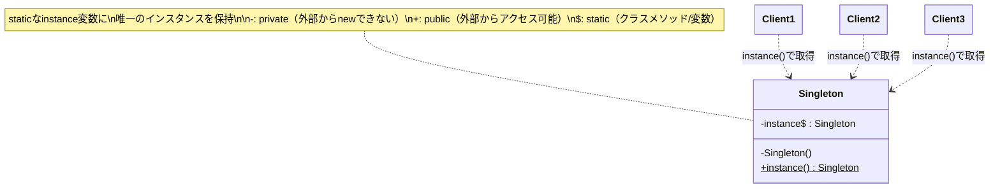

[@nqounet](https://x.com/nqounet)です。

シリーズ「設定ファイルマネージャーを作ってみよう」の第5回、最終回です。

## これまでのあらすじ

このシリーズでは、アプリケーションの設定を管理する仕組みを構築してきました。

- **第1回**: ハードコードされた設定値をMooのConfigクラスで管理する方法を学んだ
- **第2回**: 外部のINI形式の設定ファイルを読み込む `load_config` メソッドを追加した
- **第3回**: 複数の場所からConfigを使おうとしたら、それぞれで `new` したため設定が別々になる問題が発覚した
- **第4回**: クラス変数と `instance()` メソッドで単一インスタンスを保証する方法を実装した

そして今回は、これまで実装してきた仕組みの正体を明らかにします。

## 今回学ぶこと

今回の新しい概念は「Singletonパターン」です。

実は、前回実装した「クラス変数でインスタンスを保持し、`instance()` メソッドで唯一のインスタンスを返す」という仕組みには、正式な名前があります。それが **Singletonパターン** です。

## Singletonパターンとは

Singletonパターンは、GoF（Gang of Four）のデザインパターンの1つです。GoFとは、1994年に出版された書籍『Design Patterns』の4人の著者のことで、オブジェクト指向設計における23のパターンをまとめました。

Singletonパターンの目的は、**クラスのインスタンスが1つしか存在しないことを保証し、そのインスタンスへのグローバルなアクセスポイントを提供すること** です。

これはまさに、私たちが第3回で直面した問題を解決するために、第4回で実装した仕組みそのものです。

以下がSingletonパターンのクラス図です（GoFスタイル）。



*図1: Singletonパターンのクラス図（GoFスタイル）*

どのクライアント（利用者）も `instance()` メソッドを通じて同じインスタンスにアクセスします。

## パターンの構成要素

Singletonパターンは、以下の3つの要素で構成されます。

```
┌─────────────────────────────────────────────────┐
│                  Singleton                      │
├─────────────────────────────────────────────────┤
│ - instance : Singleton   ← 静的インスタンス変数 │
├─────────────────────────────────────────────────┤
│ - new()                  ← プライベートコンストラクタ相当 │
│ + instance() : Singleton ← 静的アクセスメソッド │
└─────────────────────────────────────────────────┘
```

それぞれの要素を、私たちの実装と対比してみましょう。

### 1. 静的インスタンス変数

クラス全体で共有される変数で、唯一のインスタンスを保持します。

```perl
# Perlでの実装
our $instance;
```

Perlでは `our` で宣言したパッケージ変数がこの役割を果たします。

### 2. プライベートコンストラクタ（相当）

外部から直接インスタンスを作成できないようにする仕組みです。JavaやC++では `private` 修飾子を使いますが、Perlには言語レベルでのアクセス制御がありません。

```perl
# Perlでは完全なprivateは実現できないが、
# 規約として「instance()を使うこと」を周知する
```

Perlでは、ドキュメントやコード規約で「`new` を直接呼ばず `instance()` を使う」というルールを周知することで対応します。

### 3. 静的アクセスメソッド

唯一のインスタンスを返すメソッドです。インスタンスが存在しなければ作成し、存在すればそれを返します。

```perl
sub instance ($class) {
    return $instance if defined $instance;
    $instance = $class->new;
    return $instance;
}
```

このメソッドが、アプリケーション全体からインスタンスにアクセスする唯一の窓口となります。

## Singletonパターンの利点と注意点

### 利点

Singletonパターンには、以下のような利点があります。

- **唯一性の保証**: インスタンスが1つしか存在しないことをクラス自身が保証する
- **グローバルアクセス**: どこからでも同じインスタンスにアクセスできる
- **遅延初期化**: 最初に必要になったときにインスタンスを作成できる（Lazy Initialization）
- **リソースの節約**: 設定の読み込みやDB接続など、コストのかかる処理を1回に抑えられる

設定クラスのほかにも、ロガー、データベース接続プール、キャッシュマネージャーなどに適用されることが多いパターンです。

### 注意点

一方で、Singletonパターンには注意すべき点もあります。

- **グローバル状態**: 事実上のグローバル変数となるため、依存関係が見えにくくなる
- **テストの困難さ**: モックに置き換えにくく、単体テストが書きづらい場合がある
- **並行処理**: マルチスレッド環境では、インスタンス生成時に競合が発生する可能性がある（Perlでは通常問題にならない）

これらの理由から、現代のソフトウェア設計では「アンチパターン」と見なされることもあります。代替手段として、DI（Dependency Injection）やサービスロケーターパターンが推奨される場面も増えています。

しかし、設定クラスのようにアプリケーション全体で1つのインスタンスを共有することが自然なケースでは、Singletonパターンは依然として有効な選択肢です。

## 完成したConfigクラス

シリーズ全体を通して作成したConfigクラスの最終形を示します。

```perl
package Config;
use v5.36;
use Moo;

# === Singletonパターンの実装 ===

# 1. 静的インスタンス変数
our $instance;

# === 設定属性 ===

# データベース設定
has db_host => (
    is      => 'ro',
    default => sub { 'localhost' },
);

has db_port => (
    is      => 'ro',
    default => sub { 3306 },
);

has db_name => (
    is      => 'ro',
    default => sub { 'myapp' },
);

has db_user => (
    is      => 'ro',
    default => sub { 'admin' },
);

has db_pass => (
    is      => 'ro',
    default => sub { 'secret123' },
);

# API設定
has api_url => (
    is      => 'ro',
    default => sub { 'https://api.example.com' },
);

has api_timeout => (
    is      => 'ro',
    default => sub { 30 },
);

# ログ設定
has log_file => (
    is      => 'ro',
    default => sub { '/var/log/myapp.log' },
);

has debug_mode => (
    is      => 'ro',
    default => sub { 1 },
);

# === Singletonパターンのメソッド ===

# 2. 静的アクセスメソッド：唯一のインスタンスを取得
sub instance ($class) {
    return $instance if defined $instance;
    $instance = $class->new;
    return $instance;
}

# ファイルから設定を読み込んでインスタンスを初期化
sub load_config ($class, $filename) {
    my %config;

    open my $fh, '<', $filename
        or die "Cannot open $filename: $!";

    while (my $line = <$fh>) {
        chomp $line;

        # 空行とコメント行をスキップ
        next if $line =~ /^\s*$/;
        next if $line =~ /^\s*#/;

        # key = value の形式をパース
        if ($line =~ /^\s*(\w+)\s*=\s*(.*)$/) {
            my ($key, $value) = ($1, $2);
            $value =~ s/\s+$//;  # 末尾の空白を除去
            $config{$key} = $value;
        }
    }

    close $fh;

    # Singletonインスタンスを初期化
    $instance = $class->new(%config);
    return $instance;
}

# テスト用：インスタンスをリセット
sub _reset_instance ($class) {
    $instance = undef;
}

1;
```

このクラスには、以下の機能が含まれています。

- **第1回で追加**: Mooによる設定属性の定義とデフォルト値
- **第2回で追加**: `load_config()` によるINIファイルの読み込み
- **第4回で追加**: クラス変数 `$instance` と `instance()` メソッドによるSingletonパターンの実装
- **今回追加**: テスト用の `_reset_instance()` メソッド（アンダースコアで始まるメソッドは内部用の慣例）

## 連載全体の振り返り

このシリーズでは、設定ファイルマネージャーを作りながら、以下のことを学びました。

| 回 | テーマ | 学んだこと |
|:--:|:-------|:-----------|
| 1 | 設定クラスの基本 | Mooによるクラス定義、属性とデフォルト値 |
| 2 | ファイル読み込み | INI形式のパース、クラスメソッド |
| 3 | 複数箇所での利用 | インスタンスが共有されない問題の発見 |
| 4 | instance()メソッド | クラス変数による単一インスタンスの保証 |
| 5 | Singletonパターン | GoFデザインパターンとしての位置づけ |

問題を発見し、それを解決するために実装した仕組みが、実は広く知られたデザインパターンだった、という体験ができたのではないでしょうか。デザインパターンは、このように「よくある問題に対するよくある解決策」に名前をつけたものです。

## 次のステップへ

Singletonパターンを理解したら、次は以下のトピックを学んでみることをおすすめします。

- **他のGoFデザインパターン**: Factoryパターン、Observerパターン、Strategyパターンなど
- **Dependency Injection（DI）**: Singletonの代替として、依存関係を外部から注入する手法
- **MooX::Singleton**: CPANにあるSingletonパターンの実装モジュール
- **Test::MockObject**: Singletonクラスをテストする際のモック作成

デザインパターンを知っていると、コードの設計について他の開発者と共通言語で話せるようになります。ぜひ、他のパターンも学んでみてください。

## まとめ

今回は、Singletonパターンを学びました。

- これまで実装してきた仕組みがGoFの「Singletonパターン」であることを確認した
- パターンの3つの構成要素（静的インスタンス変数、プライベートコンストラクタ相当、静的アクセスメソッド）を解説した
- Singletonパターンの利点（唯一性の保証、グローバルアクセス、遅延初期化）を学んだ
- 注意点（グローバル状態、テストの困難さ）と代替手段（DI）についても触れた
- 完成したConfigクラスの最終形を示した

5回にわたってお読みいただき、ありがとうございました。このシリーズが、Perlでのオブジェクト指向プログラミングとデザインパターンの学習の一助となれば幸いです。

## 関連記事


