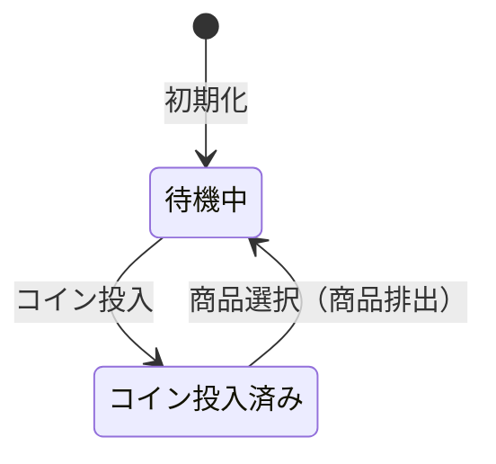

[@nqounet](https://twitter.com/nqounet)です。

新シリーズ「Mooを使って自動販売機を作ってみよう」を始めます！

このシリーズでは、コインを入れて商品を買う「自動販売機」をシミュレートするプログラムを作っていきます。身近な自動販売機を題材に、状態に応じて動作が変わる仕組みを学んでいきましょう。

Mooの基本は、[「Mooで覚えるオブジェクト指向プログラミング」](/2021/10/31/191008/)シリーズで学習済みであることを前提としています。

## 今回作るもの

自動販売機には「状態」があります。

- **待機中**: コインが入っていない状態
- **コイン投入済み**: コインが入っていて、商品を選べる状態

この2つの状態を切り替えながら、自動販売機の基本動作を実装してみましょう。



## if/elseで状態を切り替える

まずは素朴に、if/elseで状態を管理する実装をしてみます。

```perl
#!/usr/bin/env perl
use v5.36;

# 自動販売機の状態（'idle' または 'coin_inserted'）
my $state = 'idle';

# コイン投入処理
sub insert_coin {
    if ($state eq 'idle') {
        say "コインが投入されました";
        $state = 'coin_inserted';
    }
    elsif ($state eq 'coin_inserted') {
        say "すでにコインが入っています";
    }
}

# 商品選択処理
sub select_item {
    if ($state eq 'idle') {
        say "先にコインを入れてください";
    }
    elsif ($state eq 'coin_inserted') {
        say "商品が出てきました！";
        $state = 'idle';  # 待機状態に戻る
    }
}
```

状態を表す変数`$state`を用意し、操作ごとにif/elseで現在の状態をチェックしています。

## 実行してみよう

この自動販売機を動かしてみましょう。

```perl
#!/usr/bin/env perl
use v5.36;

# 自動販売機の状態（'idle' または 'coin_inserted'）
my $state = 'idle';

# コイン投入処理
sub insert_coin {
    if ($state eq 'idle') {
        say "コインが投入されました";
        $state = 'coin_inserted';
    }
    elsif ($state eq 'coin_inserted') {
        say "すでにコインが入っています";
    }
}

# 商品選択処理
sub select_item {
    if ($state eq 'idle') {
        say "先にコインを入れてください";
    }
    elsif ($state eq 'coin_inserted') {
        say "商品が出てきました！";
        $state = 'idle';  # 待機状態に戻る
    }
}

# ========================================
# 実行
# ========================================
say "=== 自動販売機シミュレーター ===";
say "";

say "1. コインを入れずに商品を選ぶ:";
select_item();
say "";

say "2. コインを投入:";
insert_coin();
say "";

say "3. もう一度コインを投入:";
insert_coin();
say "";

say "4. 商品を選択:";
select_item();
say "";

say "5. もう一度商品を選択:";
select_item();
```

出力結果：

```
=== 自動販売機シミュレーター ===

1. コインを入れずに商品を選ぶ:
先にコインを入れてください

2. コインを投入:
コインが投入されました

3. もう一度コインを投入:
すでにコインが入っています

4. 商品を選択:
商品が出てきました！

5. もう一度商品を選択:
先にコインを入れてください
```

状態に応じて、同じ操作でも異なる結果になることがわかります。これが「状態管理」の基本です。

## 今回のポイント

今回は、if/elseを使って「待機中」と「コイン投入済み」の2つの状態を切り替える実装をしました。

**状態（state）**とは、オブジェクトの現在の状況を表すものです。自動販売機は状態によって動作が変わります。

- 待機中にコインを投入 → コイン投入済みに遷移
- コイン投入済みに商品を選択 → 待機中に遷移

この方法はシンプルでわかりやすいですが、状態が増えるとどうなるでしょうか？

次回は、「商品排出中」という新しい状態を追加したときに何が起こるか見ていきましょう。

## 今回の完成コード

```perl
#!/usr/bin/env perl
use v5.36;

# 自動販売機の状態（'idle' または 'coin_inserted'）
my $state = 'idle';

# コイン投入処理
sub insert_coin {
    if ($state eq 'idle') {
        say "コインが投入されました";
        $state = 'coin_inserted';
    }
    elsif ($state eq 'coin_inserted') {
        say "すでにコインが入っています";
    }
}

# 商品選択処理
sub select_item {
    if ($state eq 'idle') {
        say "先にコインを入れてください";
    }
    elsif ($state eq 'coin_inserted') {
        say "商品が出てきました！";
        $state = 'idle';  # 待機状態に戻る
    }
}

# ========================================
# 実行
# ========================================
say "=== 自動販売機シミュレーター ===";
say "";

say "1. コインを入れずに商品を選ぶ:";
select_item();
say "";

say "2. コインを投入:";
insert_coin();
say "";

say "3. もう一度コインを投入:";
insert_coin();
say "";

say "4. 商品を選択:";
select_item();
say "";

say "5. もう一度商品を選択:";
select_item();
```

## まとめ

- 自動販売機には「待機中」「コイン投入済み」という状態がある
- 状態に応じて、同じ操作でも結果が変わる
- if/elseで状態を判定し、処理を分岐させた
- 状態変数を更新することで、状態を遷移させた

次回「第2回-商品を排出する状態を追加しよう」では、新しい状態を追加したときにコードがどうなるか見ていきます。お楽しみに！
