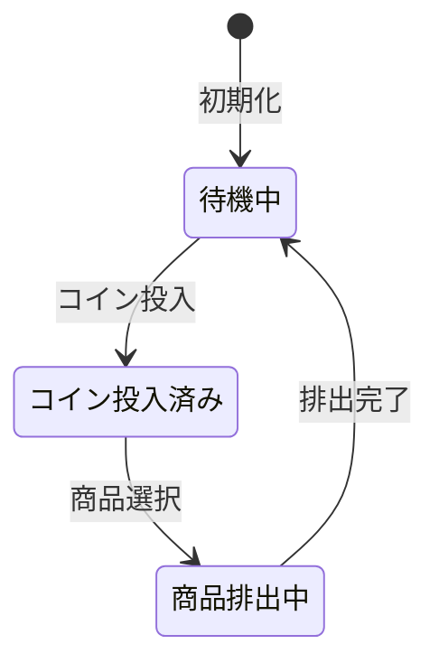

[@nqounet](https://twitter.com/nqounet)です。

前回は、if/elseを使って「待機中」と「コイン投入済み」の2つの状態を切り替える自動販売機を作りました。



今回は、「商品排出中」という新しい状態を追加してみましょう。

## 新しい状態を追加したい

実際の自動販売機では、商品を選択してもすぐに商品が出てくるわけではありません。商品が排出されるまでの「排出中」という状態があります。



この「商品排出中」状態を追加すると、コードはどうなるでしょうか？

## if/elseがどんどん増える

「商品排出中」状態を追加してみましょう。各関数に新しいelsifを追加します。

```perl
#!/usr/bin/env perl
use v5.36;

# 自動販売機の状態（'idle', 'coin_inserted', 'dispensing'）
my $state = 'idle';

# コイン投入処理
sub insert_coin {
    if ($state eq 'idle') {
        say "コインが投入されました";
        $state = 'coin_inserted';
    }
    elsif ($state eq 'coin_inserted') {
        say "すでにコインが入っています";
    }
    elsif ($state eq 'dispensing') {
        say "商品を排出中です。お待ちください";
    }
}

# 商品選択処理
sub select_item {
    if ($state eq 'idle') {
        say "先にコインを入れてください";
    }
    elsif ($state eq 'coin_inserted') {
        say "商品を選択しました。排出中...";
        $state = 'dispensing';
    }
    elsif ($state eq 'dispensing') {
        say "商品を排出中です。お待ちください";
    }
}

# 商品排出処理（新規追加）
sub dispense {
    if ($state eq 'idle') {
        say "商品は選択されていません";
    }
    elsif ($state eq 'coin_inserted') {
        say "先に商品を選択してください";
    }
    elsif ($state eq 'dispensing') {
        say "商品が出てきました！ありがとうございました";
        $state = 'idle';
    }
}
```

状態が1つ増えただけなのに、3つの関数すべてに`elsif`ブロックを追加する必要がありました。

## 問題点を整理しよう

コードが長くなってきました。問題点を整理してみましょう。

```
 ┌──────────────────────────────────────────────────────────────┐
 │                      vending_machine.pl                      │
 ├──────────────────────────────────────────────────────────────┤
 │  sub insert_coin {                                           │
 │      if (idle) { ... }                                       │
 │      elsif (coin_inserted) { ... }                           │
 │      elsif (dispensing) { ... }      ← 3つ目を追加！         │
 │      elsif (sold_out) { ... }        ← 今後も増える...      │
 │      elsif (maintenance) { ... }                             │
 │  }                                                           │
 │                                                              │
 │  sub select_item {                                           │
 │      if (idle) { ... }                                       │
 │      elsif (coin_inserted) { ... }                           │
 │      elsif (dispensing) { ... }      ← ここにも追加！       │
 │      elsif (sold_out) { ... }                                │
 │      elsif (maintenance) { ... }                             │
 │  }                                                           │
 │                                                              │
 │  sub dispense {                                              │
 │      if (idle) { ... }               ← 関数も増える！       │
 │      elsif (coin_inserted) { ... }                           │
 │      elsif (dispensing) { ... }                              │
 │      ...                                                     │
 │  }                                                           │
 └──────────────────────────────────────────────────────────────┘
```

**問題1: 状態を追加するたびに全関数を修正**

「売り切れ」「メンテナンス中」など新しい状態を追加するたびに、すべての関数に`elsif`ブロックを追加しなければなりません。

**問題2: 修正箇所が多く、ミスしやすい**

状態が5つ、操作が4つあれば、20箇所もの分岐を管理することになります。1箇所でも忘れるとバグになります。

**問題3: コードの見通しが悪くなる**

各関数が長くなり、「この状態のときにどう動くのか」を把握しにくくなります。

**問題4: テストが大変**

すべての状態×すべての操作の組み合わせをテストする必要があり、テストケースが爆発的に増えます。

## これが「コードの臭い」

このような問題を**コードの臭い（Code Smell）**と呼びます。

今回のケースは「**分岐の多さ（Switch Statements）**」という典型的なコードの臭いです。

[「Mooを使ってデータエクスポーターを作ってみよう」第2回](/2026/01/09/003703/)でも同じ問題に遭遇しましたね。if/elseが増えすぎると、保守性が著しく低下します。

## どうすれば良いのか？

次回から、このコードを改善していきます。

まずは「状態を別のクラスに分ける」ことから始めましょう。各状態がそれぞれ自分の振る舞いを持つようにすれば、状態ごとにコードが分離され、見通しが良くなります。

## 今回の完成コード

```perl
#!/usr/bin/env perl
use v5.36;

# 自動販売機の状態（'idle', 'coin_inserted', 'dispensing'）
my $state = 'idle';

# コイン投入処理
sub insert_coin {
    if ($state eq 'idle') {
        say "コインが投入されました";
        $state = 'coin_inserted';
    }
    elsif ($state eq 'coin_inserted') {
        say "すでにコインが入っています";
    }
    elsif ($state eq 'dispensing') {
        say "商品を排出中です。お待ちください";
    }
}

# 商品選択処理
sub select_item {
    if ($state eq 'idle') {
        say "先にコインを入れてください";
    }
    elsif ($state eq 'coin_inserted') {
        say "商品を選択しました。排出中...";
        $state = 'dispensing';
    }
    elsif ($state eq 'dispensing') {
        say "商品を排出中です。お待ちください";
    }
}

# 商品排出処理
sub dispense {
    if ($state eq 'idle') {
        say "商品は選択されていません";
    }
    elsif ($state eq 'coin_inserted') {
        say "先に商品を選択してください";
    }
    elsif ($state eq 'dispensing') {
        say "商品が出てきました！ありがとうございました";
        $state = 'idle';
    }
}

# ========================================
# 実行
# ========================================
say "=== 自動販売機シミュレーター（3状態版） ===";
say "";

say "1. コインを投入:";
insert_coin();
say "";

say "2. 商品を選択:";
select_item();
say "";

say "3. 排出中にコインを投入してみる:";
insert_coin();
say "";

say "4. 商品を受け取る:";
dispense();
say "";

say "5. もう一度商品を受け取ろうとする:";
dispense();
```

## まとめ

- 「商品排出中」状態を追加すると、すべての関数に`elsif`を追加する必要があった
- 状態が増えるとif/elseが肥大化し、保守性が低下する
- このような問題を「コードの臭い」と呼ぶ
- 次回から、この問題を解決するためのリファクタリングを始める

次回「第3回-状態を別のクラスに分けよう」では、状態を専用クラスに分離していきます。お楽しみに！
