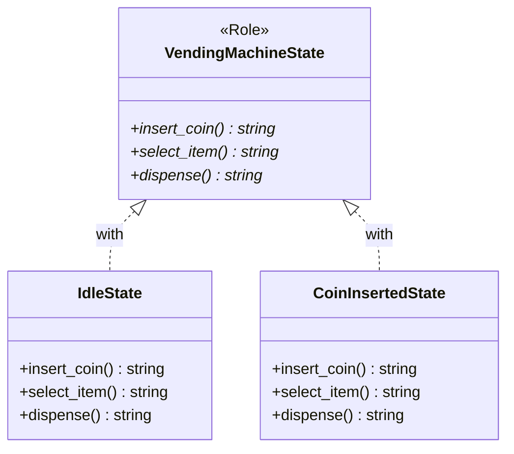

[@nqounet](https://twitter.com/nqounet)です。

前回は、状態を専用クラスに分離しました。IdleStateとCoinInsertedStateという2つのクラスを作りましたね。



今回は、Moo::Roleを使って「すべての状態クラスが必ず持つべきメソッド」を定義します。

## なぜ約束が必要なのか？

前回作った2つのクラスは、どちらも`insert_coin`、`select_item`、`dispense`というメソッドを持っています。

しかし、もし誰かが新しい状態クラスを作るときに`insert_coin`メソッドを実装し忘れたらどうなるでしょうか？

```perl
# うっかりinsert_coinを忘れた！
package BrokenState {
    use Moo;
    use v5.36;

    sub select_item ($self) { ... }
    sub dispense ($self) { ... }
    # insert_coinがない...
}
```

このクラスを使おうとすると、実行時にエラーになってしまいます。

できれば、クラスを定義した時点で「必要なメソッドがない」ことを検出したいですよね。

## Moo::Roleでインターフェースを定義

[「Mooで覚えるオブジェクト指向プログラミング」第10回](/2025/12/30/163818/)で学んだMoo::Roleを使います。

`requires`を使って「このRoleを使うクラスは、必ずこのメソッドを実装しなければならない」という約束を定義できます。

```perl
package VendingMachineState {
    use Moo::Role;

    # これらのメソッドを必ず実装すること！
    requires 'insert_coin';
    requires 'select_item';
    requires 'dispense';
}
```

`requires`で宣言されたメソッドは、このRoleを使う（`with`する）クラスで必ず実装しなければなりません。実装されていないと、クラスをロードした時点でエラーになります。

## 状態クラスでRoleを適用

定義したRoleを、各状態クラスに適用しましょう。

```perl
package IdleState {
    use Moo;
    use v5.36;
    with 'VendingMachineState';  # Roleを適用

    sub insert_coin ($self) {
        say "コインが投入されました";
        return 'coin_inserted';
    }

    sub select_item ($self) {
        say "先にコインを入れてください";
        return 'idle';
    }

    sub dispense ($self) {
        say "商品は選択されていません";
        return 'idle';
    }
}
```

`with 'VendingMachineState'`と書くことで、このクラスがVendingMachineStateというRoleを「消費」します。

もし`insert_coin`メソッドを実装し忘れると、以下のようなエラーが発生します。

```
Can't apply VendingMachineState to IdleState - missing insert_coin
```

これにより、実装漏れを早期に発見できます。

## CoinInsertedStateにもRoleを適用

同様に、CoinInsertedStateクラスにもRoleを適用します。

```perl
package CoinInsertedState {
    use Moo;
    use v5.36;
    with 'VendingMachineState';  # Roleを適用

    sub insert_coin ($self) {
        say "すでにコインが入っています";
        return 'coin_inserted';
    }

    sub select_item ($self) {
        say "商品を選択しました。排出中...";
        return 'dispensing';
    }

    sub dispense ($self) {
        say "先に商品を選択してください";
        return 'coin_inserted';
    }
}
```

これで、両方の状態クラスが同じインターフェースを持つことが保証されました。

## 何が良くなったのか？



**メリット1: 実装漏れを早期発見**

Roleを適用した時点で、必要なメソッドがなければエラーになります。実行時ではなくロード時にエラーになるので、問題を早く発見できます。

**メリット2: 新しい状態クラスを作るときの指針**

新しい状態を追加するとき、VendingMachineStateを`with`すれば、どのメソッドを実装すべきかがわかります。

**メリット3: ドキュメントとしての役割**

Roleを見れば「状態クラスはどんなメソッドを持つべきか」が一目瞭然です。

## 今回の完成コード

```perl
#!/usr/bin/env perl
use v5.36;

# ========================================
# VendingMachineState Role（状態インターフェース）
# ========================================
package VendingMachineState {
    use Moo::Role;

    # すべての状態クラスが実装すべきメソッドを宣言
    requires 'insert_coin';
    requires 'select_item';
    requires 'dispense';
}

# ========================================
# IdleStateクラス（待機中状態）
# ========================================
package IdleState {
    use Moo;
    use v5.36;
    with 'VendingMachineState';

    sub insert_coin ($self) {
        say "コインが投入されました";
        return 'coin_inserted';
    }

    sub select_item ($self) {
        say "先にコインを入れてください";
        return 'idle';
    }

    sub dispense ($self) {
        say "商品は選択されていません";
        return 'idle';
    }
}

# ========================================
# CoinInsertedStateクラス（コイン投入済み状態）
# ========================================
package CoinInsertedState {
    use Moo;
    use v5.36;
    with 'VendingMachineState';

    sub insert_coin ($self) {
        say "すでにコインが入っています";
        return 'coin_inserted';
    }

    sub select_item ($self) {
        say "商品を選択しました。排出中...";
        return 'dispensing';
    }

    sub dispense ($self) {
        say "先に商品を選択してください";
        return 'coin_inserted';
    }
}

# ========================================
# メイン処理
# ========================================
package main;

# 現在の状態を管理
my $current_state = 'idle';
my %states = (
    idle          => IdleState->new,
    coin_inserted => CoinInsertedState->new,
);

say "=== 自動販売機シミュレーター（Role適用版） ===";
say "";

say "1. コインを投入:";
$current_state = $states{$current_state}->insert_coin;
say "";

say "2. 商品を選択:";
$current_state = $states{$current_state}->select_item;
say "";
```

## まとめ

- `Moo::Role`と`requires`で「必須メソッド」を定義した
- 状態クラスで`with 'VendingMachineState'`と書いてRoleを適用した
- メソッドの実装漏れをロード時に検出できるようになった
- 新しい状態クラスを作るときの指針ができた

次回「第5回-自動販売機に状態を持たせよう」では、状態を一元管理するVendingMachineクラス（Context）を作成します。お楽しみに！
