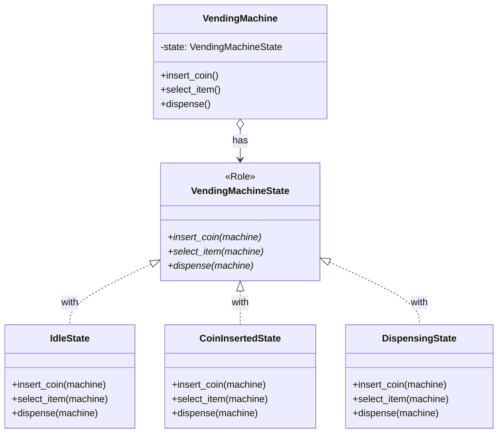

[@nqounet](https://twitter.com/nqounet)です。

前回は、Moo::Roleを使って状態クラスの共通インターフェースを定義しました。



今回は、状態を一元管理するVendingMachineクラス（Context）を作成します。

## 現状の問題点

前回までのコードでは、状態の管理がメイン処理に散らばっていました。

```perl
# メイン処理
my $current_state = 'idle';
my %states = (
    idle          => IdleState->new,
    coin_inserted => CoinInsertedState->new,
);

# 状態クラスのメソッドを呼び出して、次の状態を取得
$current_state = $states{$current_state}->insert_coin;
```

この方法には問題があります。

- 状態の管理ロジックがメイン処理に露出している
- 状態を使うたびに`%states`ハッシュにアクセスする必要がある
- 状態オブジェクトの生成と管理が分離されていない

## Contextクラスを作ろう

状態を保持し、操作を状態オブジェクトに委譲する「VendingMachine」クラスを作ります。

[「Mooで覚えるオブジェクト指向プログラミング」第11回](/2025/12/30/163819/)で学んだ「委譲」の考え方を使います。

```perl
package VendingMachine {
    use Moo;
    use v5.36;

    has state => (
        is      => 'rw',
        default => sub { IdleState->new },
    );

    sub insert_coin ($self) {
        $self->state->insert_coin($self);
    }

    sub select_item ($self) {
        $self->state->select_item($self);
    }

    sub dispense ($self) {
        $self->state->dispense($self);
    }
}
```

VendingMachineクラスは「現在の状態」を`state`属性として保持します。

`insert_coin`や`select_item`などのメソッドは、処理を現在の状態オブジェクトに**委譲**します。VendingMachineクラス自体は「どの状態のときに何をするか」を知りません。それは状態クラスの責任です。

## 状態クラスを修正

VendingMachineオブジェクト（Context）を受け取り、状態遷移を行うように状態クラスを修正します。

```perl
package IdleState {
    use Moo;
    use v5.36;
    with 'VendingMachineState';

    sub insert_coin ($self, $machine) {
        say "コインが投入されました";
        $machine->state(CoinInsertedState->new);
    }

    sub select_item ($self, $machine) {
        say "先にコインを入れてください";
        # 状態遷移なし
    }

    sub dispense ($self, $machine) {
        say "商品は選択されていません";
        # 状態遷移なし
    }
}
```

ポイントは、状態遷移を状態クラス内で行うことです。

`$machine->state(CoinInsertedState->new)`と書くことで、自動販売機の状態を「コイン投入済み」に変更しています。

これにより、「どのような条件で次の状態に遷移するか」は、現在の状態クラス自身が知っていることになります。

## CoinInsertedStateの修正

同様に、CoinInsertedStateも修正します。

```perl
package CoinInsertedState {
    use Moo;
    use v5.36;
    with 'VendingMachineState';

    sub insert_coin ($self, $machine) {
        say "すでにコインが入っています";
        # 状態遷移なし
    }

    sub select_item ($self, $machine) {
        say "商品を選択しました。排出中...";
        $machine->state(DispensingState->new);
    }

    sub dispense ($self, $machine) {
        say "先に商品を選択してください";
        # 状態遷移なし
    }
}
```

## DispensingStateを追加

せっかくなので、「商品排出中」状態も追加しましょう。

```perl
package DispensingState {
    use Moo;
    use v5.36;
    with 'VendingMachineState';

    sub insert_coin ($self, $machine) {
        say "商品を排出中です。お待ちください";
        # 状態遷移なし
    }

    sub select_item ($self, $machine) {
        say "商品を排出中です。お待ちください";
        # 状態遷移なし
    }

    sub dispense ($self, $machine) {
        say "商品が出てきました！ありがとうございました";
        $machine->state(IdleState->new);
    }
}
```

商品排出後は「待機中」状態に戻ります。

## 使ってみよう

VendingMachineクラスを使って自動販売機を操作してみましょう。

```perl
my $machine = VendingMachine->new;

$machine->select_item;  # 先にコインを入れてください
$machine->insert_coin;  # コインが投入されました
$machine->select_item;  # 商品を選択しました。排出中...
$machine->dispense;     # 商品が出てきました！ありがとうございました
$machine->select_item;  # 先にコインを入れてください（待機中に戻っている）
```

VendingMachineオブジェクトを通じて操作するだけで、内部で状態遷移が自動的に行われます。

## 構造を確認

今の設計を図で確認しましょう。



- **VendingMachine（Context）**: 現在の状態を保持し、操作を状態に委譲
- **VendingMachineState（Role）**: すべての状態クラスのインターフェース
- **IdleState、CoinInsertedState、DispensingState**: 各状態の具体的な振る舞い

## 今回の完成コード

```perl
#!/usr/bin/env perl
use v5.36;

# ========================================
# VendingMachineState Role（状態インターフェース）
# ========================================
package VendingMachineState {
    use Moo::Role;

    requires 'insert_coin';
    requires 'select_item';
    requires 'dispense';
}

# ========================================
# IdleStateクラス（待機中状態）
# ========================================
package IdleState {
    use Moo;
    use v5.36;
    with 'VendingMachineState';

    sub insert_coin ($self, $machine) {
        say "コインが投入されました";
        $machine->state(CoinInsertedState->new);
    }

    sub select_item ($self, $machine) {
        say "先にコインを入れてください";
    }

    sub dispense ($self, $machine) {
        say "商品は選択されていません";
    }
}

# ========================================
# CoinInsertedStateクラス（コイン投入済み状態）
# ========================================
package CoinInsertedState {
    use Moo;
    use v5.36;
    with 'VendingMachineState';

    sub insert_coin ($self, $machine) {
        say "すでにコインが入っています";
    }

    sub select_item ($self, $machine) {
        say "商品を選択しました。排出中...";
        $machine->state(DispensingState->new);
    }

    sub dispense ($self, $machine) {
        say "先に商品を選択してください";
    }
}

# ========================================
# DispensingStateクラス（商品排出中状態）
# ========================================
package DispensingState {
    use Moo;
    use v5.36;
    with 'VendingMachineState';

    sub insert_coin ($self, $machine) {
        say "商品を排出中です。お待ちください";
    }

    sub select_item ($self, $machine) {
        say "商品を排出中です。お待ちください";
    }

    sub dispense ($self, $machine) {
        say "商品が出てきました！ありがとうございました";
        $machine->state(IdleState->new);
    }
}

# ========================================
# VendingMachineクラス（Context）
# ========================================
package VendingMachine {
    use Moo;
    use v5.36;

    has state => (
        is      => 'rw',
        default => sub { IdleState->new },
    );

    sub insert_coin ($self) {
        $self->state->insert_coin($self);
    }

    sub select_item ($self) {
        $self->state->select_item($self);
    }

    sub dispense ($self) {
        $self->state->dispense($self);
    }
}

# ========================================
# メイン処理
# ========================================
package main;

my $machine = VendingMachine->new;

say "=== 自動販売機シミュレーター（Context版） ===";
say "";

say "1. コインを入れずに商品を選ぶ:";
$machine->select_item;
say "";

say "2. コインを投入:";
$machine->insert_coin;
say "";

say "3. 商品を選択:";
$machine->select_item;
say "";

say "4. 商品を受け取る:";
$machine->dispense;
say "";

say "5. もう一度商品を選択（待機中に戻っているはず）:";
$machine->select_item;
```

## まとめ

- VendingMachineクラス（Context）を作成し、状態を一元管理した
- `has state`で現在の状態オブジェクトを保持した
- 操作メソッドは状態オブジェクトに処理を委譲する
- 状態クラス内で`$machine->state(...)`を使って状態遷移を行う
- 「商品排出中」状態（DispensingState）を追加した

次回は、「状態が自分で次の状態を決める」という設計の利点をさらに深掘りしていきます。お楽しみに！
