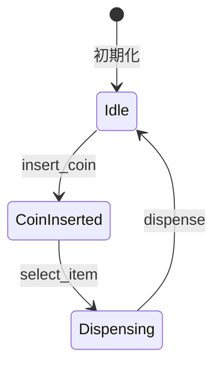

[@nqounet](https://twitter.com/nqounet)です。

前回は、VendingMachineクラス（Context）を作成し、状態を一元管理できるようになりました。



今回は、状態遷移のルールが状態クラス自身に閉じ込められていることの利点を深掘りしていきます。

## 状態遷移はどこで決める？

前回のコードでは、各状態クラスの中で「次の状態」を決めています。

```perl
package IdleState {
    sub insert_coin ($self, $machine) {
        say "コインが投入されました";
        $machine->state(CoinInsertedState->new);  # ここで次の状態を決定
    }
}
```

この設計には重要な意味があります。**遷移ルールが状態自身に閉じ込められている**のです。

## IdleStateの状態遷移を確認

「待機中」状態での遷移ルールを確認しましょう。

```perl
package IdleState {
    use Moo;
    use v5.36;
    with 'VendingMachineState';

    sub insert_coin ($self, $machine) {
        say "コインが投入されました";
        $machine->state(CoinInsertedState->new);
        # 待機中 → コイン投入済みに遷移
    }

    sub select_item ($self, $machine) {
        say "先にコインを入れてください";
        # 遷移しない（待機中のまま）
    }

    sub dispense ($self, $machine) {
        say "商品は選択されていません";
        # 遷移しない（待機中のまま）
    }
}
```

IdleStateクラスを見れば、「待機中」状態からどの状態に遷移するかがすべてわかります。

- コイン投入するとCoinInsertedStateに遷移する
- 商品選択すると遷移しない（エラーメッセージを表示）
- 商品排出すると遷移しない（エラーメッセージを表示）

## CoinInsertedStateの状態遷移を確認

「コイン投入済み」状態での遷移ルールも確認しましょう。

```perl
package CoinInsertedState {
    use Moo;
    use v5.36;
    with 'VendingMachineState';

    sub insert_coin ($self, $machine) {
        say "すでにコインが入っています";
        # 遷移しない（コイン投入済みのまま）
    }

    sub select_item ($self, $machine) {
        say "商品を選択しました。排出中...";
        $machine->state(DispensingState->new);
        # コイン投入済み → 商品排出中に遷移
    }

    sub dispense ($self, $machine) {
        say "先に商品を選択してください";
        # 遷移しない（コイン投入済みのまま）
    }
}
```

CoinInsertedStateクラスを見れば、「コイン投入済み」状態からどの状態に遷移するかがわかります。

- コイン投入すると遷移しない（追加コインはこのシンプル版では無視）
- 商品選択するとDispensingStateに遷移する
- 商品排出すると遷移しない（エラーメッセージを表示）

## 何が良いのか？

この設計には以下の利点があります。

**1. 遷移ルールがわかりやすい**

各状態クラスを見れば、その状態からの遷移ルールがすべてわかります。if/elseが複数の関数に散らばっていた頃と比べて、はるかに見通しが良くなりました。

**2. 変更の影響範囲が限定される**

「待機中」からの遷移ルールを変更したい場合、IdleStateクラスだけを修正すればよいです。他の状態クラスに影響を与えません。

**3. 状態ごとにテストできる**

各状態クラスを個別にテストできます。

```perl
# IdleStateのテスト
my $machine = VendingMachine->new;
$machine->insert_coin;
# $machine->stateがCoinInsertedStateになっているか確認
```

## 状態遷移図との対応

コードと状態遷移図を対応させて確認しましょう。



```
┌─────────────────────────────────────────────────────────────────┐
│  IdleState                                                       │
│    insert_coin → CoinInsertedState    ← 状態遷移                │
│    select_item → 遷移なし             ← エラー処理              │
│    dispense    → 遷移なし             ← エラー処理              │
├─────────────────────────────────────────────────────────────────┤
│  CoinInsertedState                                               │
│    insert_coin → 遷移なし             ← エラー処理              │
│    select_item → DispensingState      ← 状態遷移                │
│    dispense    → 遷移なし             ← エラー処理              │
├─────────────────────────────────────────────────────────────────┤
│  DispensingState                                                 │
│    insert_coin → 遷移なし             ← エラー処理              │
│    select_item → 遷移なし             ← エラー処理              │
│    dispense    → IdleState            ← 状態遷移                │
└─────────────────────────────────────────────────────────────────┘
```

## カプセル化の威力

この設計は**カプセル化**の良い例です。

[「Mooで覚えるオブジェクト指向プログラミング」第6回](/2025/12/30/163814/)で学んだ「内部実装を外から触らせない」という考え方を、状態遷移のルールに適用しています。

- VendingMachineクラスは「現在どんな状態か」を知っている
- VendingMachineクラスは「どの状態からどの状態に遷移するか」を知らなくてよい
- 遷移ルールは各状態クラスにカプセル化されている

## 今回の完成コード

```perl
#!/usr/bin/env perl
use v5.36;

# ========================================
# VendingMachineState Role（状態インターフェース）
# ========================================
package VendingMachineState {
    use Moo::Role;

    requires 'insert_coin';
    requires 'select_item';
    requires 'dispense';
}

# ========================================
# IdleStateクラス（待機中状態）
# ========================================
package IdleState {
    use Moo;
    use v5.36;
    with 'VendingMachineState';

    sub insert_coin ($self, $machine) {
        say "コインが投入されました";
        $machine->state(CoinInsertedState->new);
        # 遷移: 待機中 → コイン投入済み
    }

    sub select_item ($self, $machine) {
        say "先にコインを入れてください";
        # 遷移なし
    }

    sub dispense ($self, $machine) {
        say "商品は選択されていません";
        # 遷移なし
    }
}

# ========================================
# CoinInsertedStateクラス（コイン投入済み状態）
# ========================================
package CoinInsertedState {
    use Moo;
    use v5.36;
    with 'VendingMachineState';

    sub insert_coin ($self, $machine) {
        say "すでにコインが入っています";
        # 遷移なし
    }

    sub select_item ($self, $machine) {
        say "商品を選択しました。排出中...";
        $machine->state(DispensingState->new);
        # 遷移: コイン投入済み → 商品排出中
    }

    sub dispense ($self, $machine) {
        say "先に商品を選択してください";
        # 遷移なし
    }
}

# ========================================
# DispensingStateクラス（商品排出中状態）
# ========================================
package DispensingState {
    use Moo;
    use v5.36;
    with 'VendingMachineState';

    sub insert_coin ($self, $machine) {
        say "商品を排出中です。お待ちください";
        # 遷移なし
    }

    sub select_item ($self, $machine) {
        say "商品を排出中です。お待ちください";
        # 遷移なし
    }

    sub dispense ($self, $machine) {
        say "商品が出てきました！ありがとうございました";
        $machine->state(IdleState->new);
        # 遷移: 商品排出中 → 待機中
    }
}

# ========================================
# VendingMachineクラス（Context）
# ========================================
package VendingMachine {
    use Moo;
    use v5.36;

    has state => (
        is      => 'rw',
        default => sub { IdleState->new },
    );

    sub insert_coin ($self) {
        $self->state->insert_coin($self);
    }

    sub select_item ($self) {
        $self->state->select_item($self);
    }

    sub dispense ($self) {
        $self->state->dispense($self);
    }
}

# ========================================
# メイン処理
# ========================================
package main;

my $machine = VendingMachine->new;

say "=== 自動販売機シミュレーター（状態遷移カプセル化版） ===";
say "";

say "1. コインを投入:";
$machine->insert_coin;
say "   → 状態: " . ref($machine->state);
say "";

say "2. 商品を選択:";
$machine->select_item;
say "   → 状態: " . ref($machine->state);
say "";

say "3. 商品を受け取る:";
$machine->dispense;
say "   → 状態: " . ref($machine->state);
say "";

say "4. もう一度商品を選択:";
$machine->select_item;
say "   → 状態: " . ref($machine->state);
```

## まとめ

- 状態遷移のルールは各状態クラスにカプセル化されている
- 各状態クラスを見れば、その状態からの遷移先がわかる
- 遷移ルールの変更は該当する状態クラスだけに影響する
- VendingMachineクラスは遷移ルールを知らなくてよい
- これはカプセル化の良い実践例である

次回「第7回-売り切れ状態を追加しよう」では、新しい状態を追加するときにこの設計がどれほど役立つかを体験します。お楽しみに！
