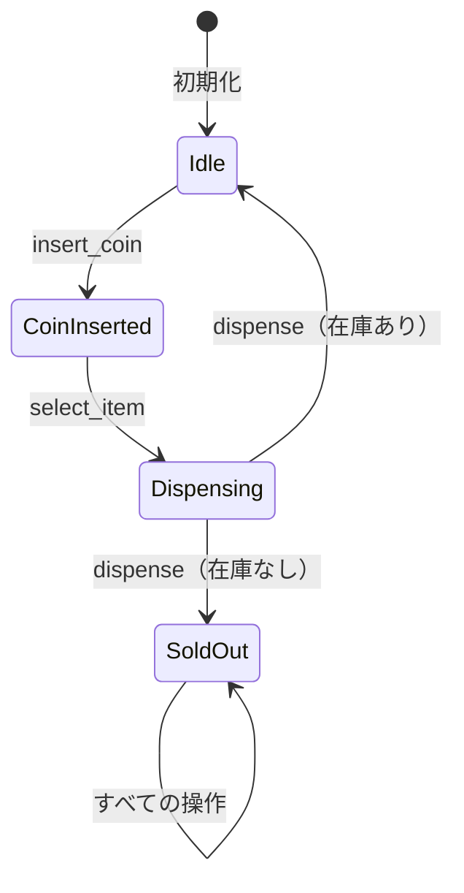

[@nqounet](https://twitter.com/nqounet)です。

前回は、状態遷移のルールが各状態クラスにカプセル化されていることの利点を学びました。



今回は、新しい状態「売り切れ」を追加して、この設計の威力を体験しましょう。

## 売り切れ状態を追加したい

実際の自動販売機には「売り切れ」状態があります。在庫がなくなると、コインを入れても商品を買えなくなりますね。

この新しい状態を追加してみましょう。



## SoldOutStateクラスを作成

「売り切れ」状態を表すクラスを新しく作ります。

```perl
package SoldOutState {
    use Moo;
    use v5.36;
    with 'VendingMachineState';

    sub insert_coin ($self, $machine) {
        say "申し訳ありません。売り切れです。";
        # 遷移なし
    }

    sub select_item ($self, $machine) {
        say "申し訳ありません。売り切れです。";
        # 遷移なし
    }

    sub dispense ($self, $machine) {
        say "申し訳ありません。売り切れです。";
        # 遷移なし
    }
}
```

VendingMachineStateロールを`with`しているので、必要なメソッドを実装しないとエラーになります。これにより、実装漏れを防げます。

## 既存コードは変更不要！

ここで注目してほしいのは、**既存のコードを一切変更していない**ことです。

```
変更なし: VendingMachineState（Role）
変更なし: IdleState
変更なし: CoinInsertedState
変更なし: DispensingState
変更なし: VendingMachine（Context）

新規追加: SoldOutState ← これだけ！
```

新しい状態を追加するのに、既存の状態クラスやContextクラスを修正する必要がありませんでした。

## 開放閉鎖原則（OCP）

この性質は**開放閉鎖原則（OCP: Open/Closed Principle）**と呼ばれます。

**「ソフトウェアは拡張に対して開かれ、修正に対して閉じているべき」**

- **拡張に開かれている**: 新しい状態（SoldOutState）を追加できる
- **修正に閉じている**: 既存のコードを変更する必要がない

[「Mooを使ってデータエクスポーターを作ってみよう」第7回](/2026/01/09/004713/)でも同じ原則を学びましたね。良い設計は自然とこの原則に従います。

## if/elseとの比較

もし最初のif/else版で「売り切れ」状態を追加したら、どうなっていたでしょうか？

```perl
# if/else版：すべての関数を修正が必要
sub insert_coin {
    if ($state eq 'idle') { ... }
    elsif ($state eq 'coin_inserted') { ... }
    elsif ($state eq 'dispensing') { ... }
    elsif ($state eq 'sold_out') { ... }  # ← 追加
}

sub select_item {
    if ($state eq 'idle') { ... }
    elsif ($state eq 'coin_inserted') { ... }
    elsif ($state eq 'dispensing') { ... }
    elsif ($state eq 'sold_out') { ... }  # ← 追加
}

sub dispense {
    if ($state eq 'idle') { ... }
    elsif ($state eq 'coin_inserted') { ... }
    elsif ($state eq 'dispensing') { ... }
    elsif ($state eq 'sold_out') { ... }  # ← 追加
}
```

**3つの関数すべてに`elsif`を追加**する必要がありました。しかも、1箇所でも忘れるとバグになります。

今回の設計では、新しいクラスを1つ作るだけで済みました。

## 在庫管理の実装

「売り切れ」状態への遷移を実装するため、VendingMachineに在庫を持たせましょう。

```perl
package VendingMachine {
    use Moo;
    use v5.36;

    has state => (
        is      => 'rw',
        default => sub { IdleState->new },
    );

    has stock => (
        is      => 'rw',
        default => 3,  # 初期在庫は3個
    );

    sub insert_coin ($self) {
        $self->state->insert_coin($self);
    }

    sub select_item ($self) {
        $self->state->select_item($self);
    }

    sub dispense ($self) {
        $self->state->dispense($self);
    }
}
```

## DispensingStateを修正

商品排出時に在庫を確認し、在庫がなくなったら「売り切れ」状態に遷移するよう修正します。

```perl
package DispensingState {
    use Moo;
    use v5.36;
    with 'VendingMachineState';

    sub insert_coin ($self, $machine) {
        say "商品を排出中です。お待ちください";
    }

    sub select_item ($self, $machine) {
        say "商品を排出中です。お待ちください";
    }

    sub dispense ($self, $machine) {
        # 在庫を減らす
        my $new_stock = $machine->stock - 1;
        $machine->stock($new_stock);
        
        say "商品が出てきました！ありがとうございました";
        say "（残り在庫: $new_stock）";
        
        if ($new_stock > 0) {
            $machine->state(IdleState->new);
        }
        else {
            say "※ 在庫がなくなりました";
            $machine->state(SoldOutState->new);
        }
    }
}
```

## 動作確認

在庫3個の自動販売機を動かしてみましょう。

```perl
my $machine = VendingMachine->new(stock => 3);

# 1個目の購入
$machine->insert_coin;
$machine->select_item;
$machine->dispense;  # 残り在庫: 2

# 2個目の購入
$machine->insert_coin;
$machine->select_item;
$machine->dispense;  # 残り在庫: 1

# 3個目の購入
$machine->insert_coin;
$machine->select_item;
$machine->dispense;  # 残り在庫: 0、売り切れへ

# 売り切れ後
$machine->insert_coin;  # 申し訳ありません。売り切れです。
```

在庫がなくなると自動的に「売り切れ」状態に遷移し、それ以降の操作はすべて拒否されます。

## 今回の完成コード

```perl
#!/usr/bin/env perl
use v5.36;

# ========================================
# VendingMachineState Role（状態インターフェース）
# ========================================
package VendingMachineState {
    use Moo::Role;

    requires 'insert_coin';
    requires 'select_item';
    requires 'dispense';
}

# ========================================
# IdleStateクラス（待機中状態）
# ========================================
package IdleState {
    use Moo;
    use v5.36;
    with 'VendingMachineState';

    sub insert_coin ($self, $machine) {
        say "コインが投入されました";
        $machine->state(CoinInsertedState->new);
    }

    sub select_item ($self, $machine) {
        say "先にコインを入れてください";
    }

    sub dispense ($self, $machine) {
        say "商品は選択されていません";
    }
}

# ========================================
# CoinInsertedStateクラス（コイン投入済み状態）
# ========================================
package CoinInsertedState {
    use Moo;
    use v5.36;
    with 'VendingMachineState';

    sub insert_coin ($self, $machine) {
        say "すでにコインが入っています";
    }

    sub select_item ($self, $machine) {
        say "商品を選択しました。排出中...";
        $machine->state(DispensingState->new);
    }

    sub dispense ($self, $machine) {
        say "先に商品を選択してください";
    }
}

# ========================================
# DispensingStateクラス（商品排出中状態）
# ========================================
package DispensingState {
    use Moo;
    use v5.36;
    with 'VendingMachineState';

    sub insert_coin ($self, $machine) {
        say "商品を排出中です。お待ちください";
    }

    sub select_item ($self, $machine) {
        say "商品を排出中です。お待ちください";
    }

    sub dispense ($self, $machine) {
        my $new_stock = $machine->stock - 1;
        $machine->stock($new_stock);
        
        say "商品が出てきました！ありがとうございました";
        say "（残り在庫: $new_stock）";
        
        if ($new_stock > 0) {
            $machine->state(IdleState->new);
        }
        else {
            say "※ 在庫がなくなりました";
            $machine->state(SoldOutState->new);
        }
    }
}

# ========================================
# SoldOutStateクラス（売り切れ状態）★新規追加★
# ========================================
package SoldOutState {
    use Moo;
    use v5.36;
    with 'VendingMachineState';

    sub insert_coin ($self, $machine) {
        say "申し訳ありません。売り切れです。";
    }

    sub select_item ($self, $machine) {
        say "申し訳ありません。売り切れです。";
    }

    sub dispense ($self, $machine) {
        say "申し訳ありません。売り切れです。";
    }
}

# ========================================
# VendingMachineクラス（Context）
# ========================================
package VendingMachine {
    use Moo;
    use v5.36;

    has state => (
        is      => 'rw',
        default => sub { IdleState->new },
    );

    has stock => (
        is      => 'rw',
        default => 3,
    );

    sub insert_coin ($self) {
        $self->state->insert_coin($self);
    }

    sub select_item ($self) {
        $self->state->select_item($self);
    }

    sub dispense ($self) {
        $self->state->dispense($self);
    }
}

# ========================================
# メイン処理
# ========================================
package main;

my $machine = VendingMachine->new(stock => 2);

say "=== 自動販売機シミュレーター（売り切れ対応版） ===";
say "初期在庫: " . $machine->stock . "個";
say "";

say "--- 1個目の購入 ---";
$machine->insert_coin;
$machine->select_item;
$machine->dispense;
say "";

say "--- 2個目の購入 ---";
$machine->insert_coin;
$machine->select_item;
$machine->dispense;
say "";

say "--- 売り切れ後にコインを投入 ---";
$machine->insert_coin;
say "";

say "--- 売り切れ後に商品を選択 ---";
$machine->select_item;
```

## まとめ

- 「売り切れ」状態（SoldOutState）を新しく追加した
- 既存の状態クラス（IdleState、CoinInsertedState）は変更不要だった
- VendingMachineクラス（Context）も変更不要だった（在庫追加を除く）
- この性質を「開放閉鎖原則（OCP）」と呼ぶ
- if/else版と比べて、変更箇所が大幅に少ない

次回「第8回-does制約で安全にしよう」では、間違ったオブジェクトが状態として設定されないようにする方法を学びます。お楽しみに！
