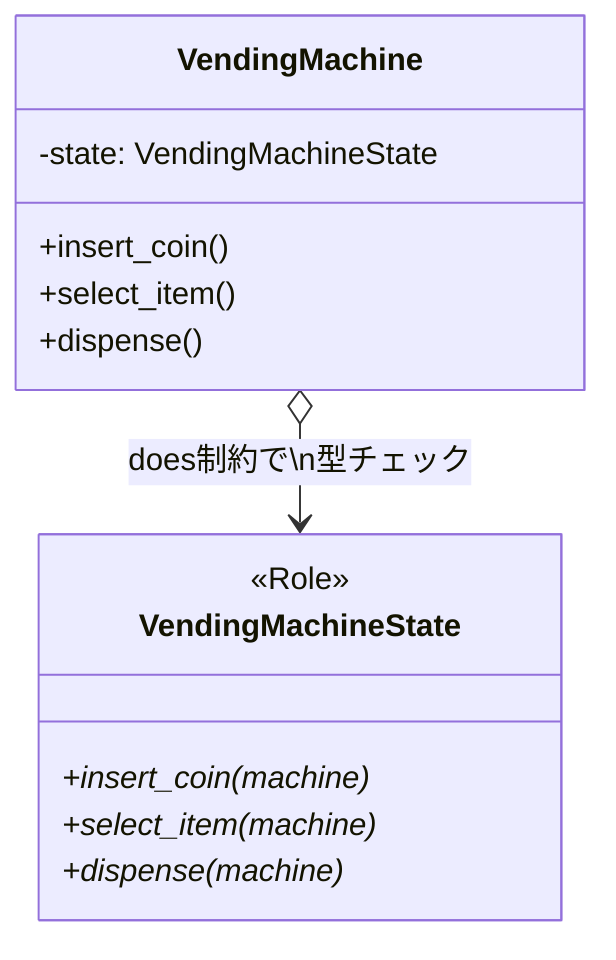

[@nqounet](https://twitter.com/nqounet)です。

前回は、「売り切れ」状態を追加しました。開放閉鎖原則（OCP）のおかげで、既存コードをほとんど変更せずに新しい状態を追加できましたね。



今回は、より堅牢なコードにするための「does制約」を導入します。

## 問題：間違ったオブジェクトを設定できてしまう

現在のVendingMachineクラスには問題があります。

```perl
my $machine = VendingMachine->new;

# これは正しい
$machine->state(CoinInsertedState->new);

# これも動いてしまう！（でも間違い）
$machine->state("hello");
$machine->state(123);
$machine->state({ foo => "bar" });
```

`state`属性にはどんな値でも設定できてしまいます。間違った値を設定すると、後で`insert_coin`などのメソッドを呼んだときにエラーになります。

```perl
$machine->state("hello");
$machine->insert_coin;  # エラー: Can't call method "insert_coin" on ...
```

このエラーは問題の原因から離れた場所で発生するため、デバッグが難しくなります。

## does制約でRoleを強制する

[「Mooで覚えるオブジェクト指向プログラミング」第12回](/2025/12/30/163820/)で学んだ`does`制約を使いましょう。

```perl
has state => (
    is      => 'rw',
    does    => 'VendingMachineState',  # Roleを実装していることを要求
    default => sub { IdleState->new },
);
```

`does => 'VendingMachineState'`と指定すると、VendingMachineStateロールを消費しているオブジェクトしか設定できなくなります。

## エラーを早期に検出

間違ったオブジェクトを設定しようとすると、**設定しようとした時点で**エラーが発生します。

```perl
$machine->state("hello");
# エラー: isa check for "state" failed: 
#         "hello" is not VendingMachineState
```

エラーが問題の原因の場所で発生するため、デバッグが容易になります。

```
Before（does制約なし）:
  1. state("hello") ← ここでは何も起きない
  2. insert_coin()  ← ここでエラー（原因から離れている）

After（does制約あり）:
  1. state("hello") ← ここでエラー！（原因がすぐわかる）
```

## 型エラーのデモ

実際にエラーが発生する様子を確認しましょう。

```perl
#!/usr/bin/env perl
use v5.36;

# VendingMachineStateロールを消費していないクラス
package NotAState {
    use Moo;
    use v5.36;
    
    sub some_method ($self) {
        say "これは状態クラスではありません";
    }
}

# VendingMachineクラス（does制約付き）
package VendingMachine {
    use Moo;
    use v5.36;

    has state => (
        is      => 'rw',
        does    => 'VendingMachineState',
        default => sub { IdleState->new },
    );
}

# 使用例
my $machine = VendingMachine->new;

# 間違ったオブジェクトを設定しようとする
eval {
    $machine->state(NotAState->new);
};
if ($@) {
    say "エラーが発生しました: $@";
}
```

出力：

```
エラーが発生しました: isa check for "state" failed: 
NotAState=HASH(0x...) is not VendingMachineState at ...
```

NotAStateクラスはVendingMachineStateロールを消費していないため、設定時にエラーになります。

## 正しい状態クラスは問題なし

VendingMachineStateロールを消費している状態クラスは、問題なく設定できます。

```perl
# これらはすべてOK
$machine->state(IdleState->new);
$machine->state(CoinInsertedState->new);
$machine->state(DispensingState->new);
$machine->state(SoldOutState->new);
```

## 何が良くなったのか？



**メリット1: バグの早期発見**

間違った値を設定しようとした時点でエラーになるため、バグを素早く発見できます。

**メリット2: デバッグが容易**

エラーメッセージが原因の場所を示すため、問題の特定が容易になります。

**メリット3: コードの意図が明確**

`does => 'VendingMachineState'`という記述を見れば、「この属性にはVendingMachineStateを実装したオブジェクトが入る」ことが明確にわかります。

**メリット4: ドキュメント効果**

型制約はドキュメントとしても機能します。コードを読む人が「どんなオブジェクトが入るか」を理解しやすくなります。

## 今回の完成コード

```perl
#!/usr/bin/env perl
use v5.36;

# ========================================
# VendingMachineState Role（状態インターフェース）
# ========================================
package VendingMachineState {
    use Moo::Role;

    requires 'insert_coin';
    requires 'select_item';
    requires 'dispense';
}

# ========================================
# IdleStateクラス（待機中状態）
# ========================================
package IdleState {
    use Moo;
    use v5.36;
    with 'VendingMachineState';

    sub insert_coin ($self, $machine) {
        say "コインが投入されました";
        $machine->state(CoinInsertedState->new);
    }

    sub select_item ($self, $machine) {
        say "先にコインを入れてください";
    }

    sub dispense ($self, $machine) {
        say "商品は選択されていません";
    }
}

# ========================================
# CoinInsertedStateクラス（コイン投入済み状態）
# ========================================
package CoinInsertedState {
    use Moo;
    use v5.36;
    with 'VendingMachineState';

    sub insert_coin ($self, $machine) {
        say "すでにコインが入っています";
    }

    sub select_item ($self, $machine) {
        say "商品を選択しました。排出中...";
        $machine->state(DispensingState->new);
    }

    sub dispense ($self, $machine) {
        say "先に商品を選択してください";
    }
}

# ========================================
# DispensingStateクラス（商品排出中状態）
# ========================================
package DispensingState {
    use Moo;
    use v5.36;
    with 'VendingMachineState';

    sub insert_coin ($self, $machine) {
        say "商品を排出中です。お待ちください";
    }

    sub select_item ($self, $machine) {
        say "商品を排出中です。お待ちください";
    }

    sub dispense ($self, $machine) {
        my $new_stock = $machine->stock - 1;
        $machine->stock($new_stock);
        
        say "商品が出てきました！ありがとうございました";
        say "（残り在庫: $new_stock）";
        
        if ($new_stock > 0) {
            $machine->state(IdleState->new);
        }
        else {
            say "※ 在庫がなくなりました";
            $machine->state(SoldOutState->new);
        }
    }
}

# ========================================
# SoldOutStateクラス（売り切れ状態）
# ========================================
package SoldOutState {
    use Moo;
    use v5.36;
    with 'VendingMachineState';

    sub insert_coin ($self, $machine) {
        say "申し訳ありません。売り切れです。";
    }

    sub select_item ($self, $machine) {
        say "申し訳ありません。売り切れです。";
    }

    sub dispense ($self, $machine) {
        say "申し訳ありません。売り切れです。";
    }
}

# ========================================
# VendingMachineクラス（Context）★does制約を追加★
# ========================================
package VendingMachine {
    use Moo;
    use v5.36;

    has state => (
        is      => 'rw',
        does    => 'VendingMachineState',  # ★Roleを実装していることを要求★
        default => sub { IdleState->new },
    );

    has stock => (
        is      => 'rw',
        default => 3,
    );

    sub insert_coin ($self) {
        $self->state->insert_coin($self);
    }

    sub select_item ($self) {
        $self->state->select_item($self);
    }

    sub dispense ($self) {
        $self->state->dispense($self);
    }
}

# ========================================
# メイン処理
# ========================================
package main;

my $machine = VendingMachine->new(stock => 2);

say "=== 自動販売機シミュレーター（does制約版） ===";
say "";

say "--- 正常な操作 ---";
$machine->insert_coin;
$machine->select_item;
$machine->dispense;
say "";

say "--- 間違ったオブジェクトを設定しようとする ---";
eval {
    $machine->state("これは文字列です");
};
if ($@) {
    say "エラー: 文字列は設定できません";
}

eval {
    $machine->state({ hash => "ref" });
};
if ($@) {
    say "エラー: ハッシュリファレンスは設定できません";
}

say "";
say "--- 正しい状態オブジェクトは設定できる ---";
$machine->state(IdleState->new);
say "IdleStateを設定しました: 現在の状態 = " . ref($machine->state);
```

## まとめ

- `has`の`does`制約で、Roleを実装したオブジェクトのみ設定可能にする
- 間違った値を設定しようとすると、設定時点でエラーになる
- エラーが原因の場所で発生するため、デバッグが容易になる
- 型制約はコードの意図を明確にし、ドキュメントとしても機能する
- より堅牢なアプリケーションを作るための重要なテクニックである

次回「第9回-完成！自動販売機」では、全機能を統合して自動販売機を完成させます。お楽しみに！
