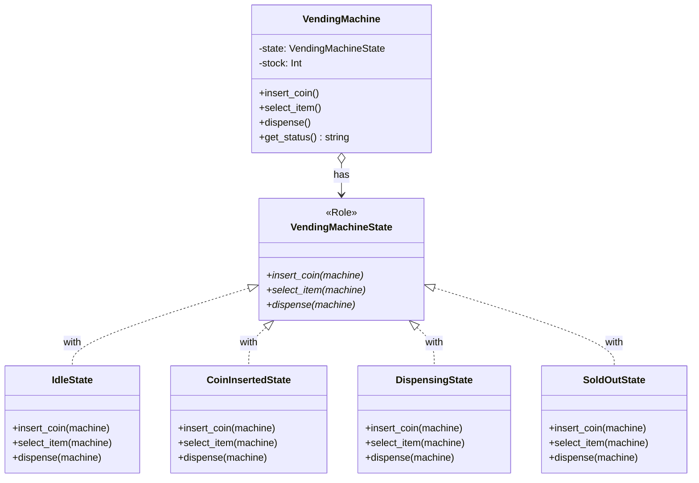
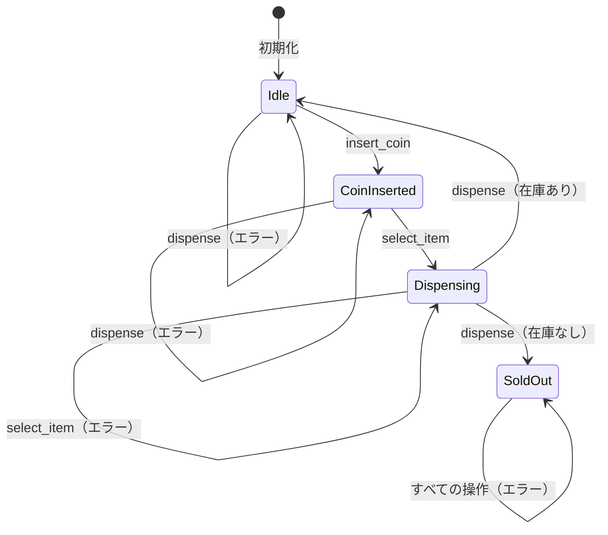

[@nqounet](https://twitter.com/nqounet)です。

前回は、`does`制約を使って型チェックを追加しました。間違ったオブジェクトを設定しようとするとエラーになるようになりましたね。



今回は、これまで作ってきた機能をすべて統合して、自動販売機シミュレーターを完成させます！

## 完成した自動販売機の全体像

まずは完成形の構造を確認しましょう。



## 状態遷移図

自動販売機の状態遷移を図で確認します。



## 各状態での動作確認

4つの状態それぞれで、各操作がどう動作するかを確認しましょう。

### 待機中（IdleState）

| 操作 | 結果 | 次の状態 |
|-----|------|---------|
| insert_coin | コインが投入されました | CoinInsertedState |
| select_item | 先にコインを入れてください | IdleState（変化なし） |
| dispense | 商品は選択されていません | IdleState（変化なし） |

### コイン投入済み（CoinInsertedState）

| 操作 | 結果 | 次の状態 |
|-----|------|---------|
| insert_coin | すでにコインが入っています | CoinInsertedState（変化なし） |
| select_item | 商品を選択しました。排出中... | DispensingState |
| dispense | 先に商品を選択してください | CoinInsertedState（変化なし） |

### 商品排出中（DispensingState）

| 操作 | 結果 | 次の状態 |
|-----|------|---------|
| insert_coin | 商品を排出中です。お待ちください | DispensingState（変化なし） |
| select_item | 商品を排出中です。お待ちください | DispensingState（変化なし） |
| dispense | 商品が出てきました！ありがとうございました | IdleStateまたはSoldOutState |

### 売り切れ（SoldOutState）

| 操作 | 結果 | 次の状態 |
|-----|------|---------|
| insert_coin | 申し訳ありません。売り切れです。 | SoldOutState（変化なし） |
| select_item | 申し訳ありません。売り切れです。 | SoldOutState（変化なし） |
| dispense | 申し訳ありません。売り切れです。 | SoldOutState（変化なし） |

## ステータス表示機能を追加

自動販売機の現在の状態を表示する機能を追加しましょう。

```perl
package VendingMachine {
    use Moo;
    use v5.36;

    # ... 省略 ...

    sub get_status ($self) {
        my $state_name = ref($self->state);
        $state_name =~ s/State$//;  # "State"を除去
        
        return sprintf("状態: %s / 在庫: %d個", $state_name, $self->stock);
    }
}
```

## 完成コード

```perl
#!/usr/bin/env perl
use v5.36;

# ========================================
# VendingMachineState Role（状態インターフェース）
# ========================================
package VendingMachineState {
    use Moo::Role;

    requires 'insert_coin';
    requires 'select_item';
    requires 'dispense';
}

# ========================================
# IdleStateクラス（待機中状態）
# ========================================
package IdleState {
    use Moo;
    use v5.36;
    with 'VendingMachineState';

    sub insert_coin ($self, $machine) {
        say "コインが投入されました";
        $machine->state(CoinInsertedState->new);
    }

    sub select_item ($self, $machine) {
        say "先にコインを入れてください";
    }

    sub dispense ($self, $machine) {
        say "商品は選択されていません";
    }
}

# ========================================
# CoinInsertedStateクラス（コイン投入済み状態）
# ========================================
package CoinInsertedState {
    use Moo;
    use v5.36;
    with 'VendingMachineState';

    sub insert_coin ($self, $machine) {
        say "すでにコインが入っています";
    }

    sub select_item ($self, $machine) {
        say "商品を選択しました。排出中...";
        $machine->state(DispensingState->new);
    }

    sub dispense ($self, $machine) {
        say "先に商品を選択してください";
    }
}

# ========================================
# DispensingStateクラス（商品排出中状態）
# ========================================
package DispensingState {
    use Moo;
    use v5.36;
    with 'VendingMachineState';

    sub insert_coin ($self, $machine) {
        say "商品を排出中です。お待ちください";
    }

    sub select_item ($self, $machine) {
        say "商品を排出中です。お待ちください";
    }

    sub dispense ($self, $machine) {
        my $new_stock = $machine->stock - 1;
        $machine->stock($new_stock);
        
        say "商品が出てきました！ありがとうございました";
        
        if ($new_stock > 0) {
            $machine->state(IdleState->new);
        }
        else {
            say "※ 在庫がなくなりました";
            $machine->state(SoldOutState->new);
        }
    }
}

# ========================================
# SoldOutStateクラス（売り切れ状態）
# ========================================
package SoldOutState {
    use Moo;
    use v5.36;
    with 'VendingMachineState';

    sub insert_coin ($self, $machine) {
        say "申し訳ありません。売り切れです。";
    }

    sub select_item ($self, $machine) {
        say "申し訳ありません。売り切れです。";
    }

    sub dispense ($self, $machine) {
        say "申し訳ありません。売り切れです。";
    }
}

# ========================================
# VendingMachineクラス（Context）
# ========================================
package VendingMachine {
    use Moo;
    use v5.36;

    has state => (
        is      => 'rw',
        does    => 'VendingMachineState',
        default => sub { IdleState->new },
    );

    has stock => (
        is      => 'rw',
        default => 3,
    );

    sub insert_coin ($self) {
        $self->state->insert_coin($self);
    }

    sub select_item ($self) {
        $self->state->select_item($self);
    }

    sub dispense ($self) {
        $self->state->dispense($self);
    }

    sub get_status ($self) {
        my $state_name = ref($self->state);
        $state_name =~ s/State$//;
        return sprintf("状態: %s / 在庫: %d個", $state_name, $self->stock);
    }
}

# ========================================
# メイン処理
# ========================================
package main;

say "╔══════════════════════════════════════════════════╗";
say "║    自動販売機シミュレーター（完成版）            ║";
say "╚══════════════════════════════════════════════════╝";
say "";

my $machine = VendingMachine->new(stock => 2);
say "【初期状態】" . $machine->get_status;
say "";

say "━━━━━━━━━━━━━━━━━━━━━━━━━━━━━━";
say "【テスト1】正常な購入フロー";
say "━━━━━━━━━━━━━━━━━━━━━━━━━━━━━━";

say "1. コインを投入:";
$machine->insert_coin;
say "   → " . $machine->get_status;
say "";

say "2. 商品を選択:";
$machine->select_item;
say "   → " . $machine->get_status;
say "";

say "3. 商品を受け取る:";
$machine->dispense;
say "   → " . $machine->get_status;
say "";

say "━━━━━━━━━━━━━━━━━━━━━━━━━━━━━━";
say "【テスト2】エラー操作のテスト";
say "━━━━━━━━━━━━━━━━━━━━━━━━━━━━━━";

say "1. コインなしで商品を選ぶ:";
$machine->select_item;
say "";

say "2. コインを投入:";
$machine->insert_coin;
say "";

say "3. もう一度コインを投入:";
$machine->insert_coin;
say "";

say "━━━━━━━━━━━━━━━━━━━━━━━━━━━━━━";
say "【テスト3】売り切れテスト";
say "━━━━━━━━━━━━━━━━━━━━━━━━━━━━━━";

say "1. 商品を選択:";
$machine->select_item;
say "";

say "2. 商品を受け取る（最後の1個）:";
$machine->dispense;
say "   → " . $machine->get_status;
say "";

say "3. 売り切れ後にコインを投入:";
$machine->insert_coin;
say "";

say "━━━━━━━━━━━━━━━━━━━━━━━━━━━━━━";
say "【完了】すべてのテストが終了しました";
say "━━━━━━━━━━━━━━━━━━━━━━━━━━━━━━";
```

## シリーズを振り返る

全9回でここまで来ました。振り返ってみましょう。

| 回 | タイトル | 学んだこと |
|----|---------|----------|
| 第1回 | コインを入れて商品を買おう | if/elseでの状態管理 |
| 第2回 | 商品を排出する状態を追加しよう | if/elseの肥大化問題 |
| 第3回 | 状態を別のクラスに分けよう | 責務分離 |
| 第4回 | Moo::Roleで状態の約束を決めよう | Roleとrequires |
| 第5回 | 自動販売機に状態を持たせよう | Contextクラスと委譲 |
| 第6回 | 状態が自分で次の状態を決めよう | 状態遷移のカプセル化 |
| 第7回 | 売り切れ状態を追加しよう | 開放閉鎖原則（OCP） |
| 第8回 | does制約で安全にしよう | 型チェック |
| 第9回 | 完成！自動販売機 | 統合とテスト |

## この設計の特徴

最終的に出来上がった設計には、以下の特徴があります。

**1. 状態ごとにクラスが分離されている**

各状態の振る舞いがそれぞれのクラスに閉じ込められており、変更が容易です。

**2. 状態遷移が状態自身に閉じ込められている**

どの状態からどの状態に遷移するかは、各状態クラスが知っています。

**3. 新しい状態を追加しやすい**

開放閉鎖原則（OCP）に従い、既存コードを変更せずに新しい状態を追加できます。

**4. 型チェックで安全性が確保されている**

`does`制約により、間違ったオブジェクトの設定を防止しています。

## まとめ

- 4つの状態（Idle、CoinInserted、Dispensing、SoldOut）を持つ自動販売機が完成した
- 各状態での動作を確認した
- ステータス表示機能を追加した
- これまで学んだ設計の特徴を振り返った

次回は最終回です。「第10回-これがStateパターンだ！」では、作ってきた設計が「Stateパターン」というデザインパターンだったことを明かします。Strategyパターンとの違いも解説します。お楽しみに！
