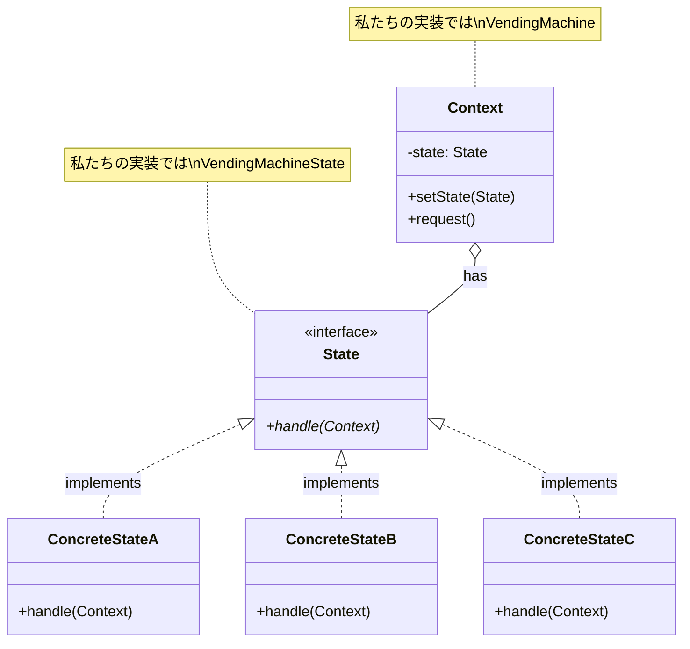

[@nqounet](https://twitter.com/nqounet)です。

前回で、自動販売機シミュレーターが完成しました。4つの状態を持ち、状態に応じて異なる振る舞いをする設計ができましたね。



最終回の今回は、これまで作ってきた設計に名前があることを明かします。

## 実は、これがStateパターンです！

このシリーズで作ってきた設計は、**Stateパターン（ステートパターン）**というデザインパターンです。

**デザインパターン**とは、ソフトウェア設計でよく使われる問題解決のパターン（定石）のことです。1994年に発表された「GoF本」で23個のパターンが紹介され、Stateパターンはその1つです。

GoFとは「Gang of Four（4人組）」の略で、この本の4人の著者を指します。

## Stateパターンの定義

GoF本でのStateパターンの定義は次のとおりです。

> **オブジェクトの内部状態が変化したとき、その振る舞いを変えられるようにする。オブジェクトはあたかもそのクラスが変わったかのように見える。**

私たちの自動販売機も、まさにこの定義のとおりに動いています。

- 「待機中」状態では、コイン投入を受け付ける
- 「コイン投入済み」状態では、商品選択を受け付ける
- 「売り切れ」状態では、すべての操作を拒否する

状態が変わると、同じ`insert_coin`メソッドでも異なる動作をします。

## Stateパターンの構造

作ってきたものを振り返りながら、Stateパターンの構造を確認しましょう。



## 私たちの実装との対応

| 用語 | 私たちが作ったもの | 役割 |
|-----|------------------|-----|
| State | VendingMachineState | 共通のインターフェース（Role） |
| ConcreteState | IdleState, CoinInsertedState, DispensingState, SoldOutState | 具体的な状態の振る舞い |
| Context | VendingMachine | 現在の状態を保持し、処理を委譲 |

```
┌─────────────────────┐
│   VendingMachine    │ ← Context（コンテキスト）
│   (自動販売機)       │    現在の状態を保持し、処理を委譲
└─────────┬───────────┘
          │ has state
          ▼
┌─────────────────────┐
│ VendingMachineState │ ← State（状態インターフェース）
│    (Moo::Role)      │    insert_coin, select_item, dispenseを要求
└─────────┬───────────┘
          │ implements
    ┌─────┴─────┬───────────┬───────────┐
    ▼           ▼           ▼           ▼
┌────────┐ ┌──────────┐ ┌──────────┐ ┌─────────┐
│ Idle   │ │ Coin     │ │Dispensing│ │ SoldOut │ ← ConcreteState
│ State  │ │ Inserted │ │  State   │ │  State  │    具体的な振る舞い
└────────┘ └──────────┘ └──────────┘ └─────────┘
```

## Strategyパターンとの違い

ここで重要なのが、Stateパターンと**Strategyパターン**の違いです。

[「Mooを使ってデータエクスポーターを作ってみよう」シリーズ第10回](/2026/01/09/005327/)でStrategyパターンを学びましたね。

構造はよく似ていますが、**意図と責任が異なります**。

### 比較表

| 項目 | Strategyパターン | Stateパターン |
|-----|-----------------|--------------|
| **目的** | アルゴリズムを切り替える | オブジェクトの状態に応じて振る舞いを変える |
| **変更の主体** | **クライアント（外部）**が選択 | **オブジェクト自身**が状態に応じて変更 |
| **状態遷移** | **なし**（独立したアルゴリズム選択） | **あり**（状態間の遷移ルールが存在） |
| **Contextへの参照** | Strategyは通常Contextを知らない | **StateはContextへの参照を持つ** |
| **ConcreteXXX間の関係** | 互いに独立、関係なし | **互いの存在を知り、遷移し合う** |

### コード例で比較

**Strategyパターン: クライアントがアルゴリズムを選択**

```perl
# クライアント（外部）が「どのエクスポーターを使うか」を選ぶ
my $exporter = DataExporter->new(
    exporter => CsvExporter->new   # ← クライアントが選択
);
$exporter->export_data($data);

# 別の形式に変更
$exporter->exporter(JsonExporter->new);  # ← クライアントが変更
$exporter->export_data($data);
```

**Stateパターン: オブジェクト自身が状態を遷移**

```perl
# クライアントは操作するだけ、状態遷移は自動販売機が管理
my $machine = VendingMachine->new;
$machine->insert_coin;  # 状態が自動的に Idle → CoinInserted に遷移
$machine->select_item;  # 状態が自動的に CoinInserted → Dispensing に遷移
$machine->dispense;     # 状態が自動的に Dispensing → Idle に遷移
```

### 選択の指針

- 「どう処理するか」を外部から選んで切り替えたい場合は **Strategyパターン** を使う
- 「オブジェクトの内部状態によって振る舞いを自動的に変えたい」場合は **Stateパターン** を使う

### 具体例で考える

| ユースケース | 適したパターン | 理由 |
|------------|--------------|------|
| データ出力形式（CSV/JSON/YAML） | Strategy | ユーザーが形式を選択する |
| 支払い方法（クレカ/電子マネー） | Strategy | ユーザーが方法を選択する |
| 自動販売機の動作 | **State** | 内部状態に応じて自動的に変化 |
| ワークフロー（申請→承認→完了） | **State** | 状態遷移のルールがある |
| ゲームキャラの状態（歩行→攻撃→死亡） | **State** | 状態遷移のルールがある |

## SOLID原則との関連

Stateパターンを使うと、自然とSOLID原則に従えます。

### 単一責任の原則（SRP）

各状態クラスは1つの状態のロジックのみを担当します。

- `IdleState`は待機中状態のロジックのみを担当する
- `CoinInsertedState`はコイン投入済み状態のロジックのみを担当する
- `SoldOutState`は売り切れ状態のロジックのみを担当する

### 開放閉鎖原則（OCP）

第7回で体験したとおり、新しい状態を追加しても既存コードを修正する必要がありませんでした。

```perl
# 新しい状態を追加するだけ
package MaintenanceState {
    use Moo;
    with 'VendingMachineState';
    # ... 実装 ...
}
# 既存のコードは変更不要！
```

## シリーズのまとめ

全10回のシリーズを振り返りましょう。

| 回 | タイトル | 学んだこと |
|----|---------|----------|
| 第1回 | コインを入れて商品を買おう | if/elseでの状態管理 |
| 第2回 | 商品を排出する状態を追加しよう | if/elseの肥大化問題 |
| 第3回 | 状態を別のクラスに分けよう | 責務分離 |
| 第4回 | Moo::Roleで状態の約束を決めよう | Roleとrequires |
| 第5回 | 自動販売機に状態を持たせよう | Contextクラスと委譲 |
| 第6回 | 状態が自分で次の状態を決めよう | 状態遷移のカプセル化 |
| 第7回 | 売り切れ状態を追加しよう | 開放閉鎖原則（OCP） |
| 第8回 | does制約で安全にしよう | 型チェック |
| 第9回 | 完成！自動販売機 | 統合とテスト |
| 第10回 | これがStateパターンだ！ | デザインパターンの理解 |

## おわりに

このシリーズでは、「自動販売機をシミュレートしたい」という身近な課題から始めて、if/elseの問題を体験し、それを解決するためにコードを改善してきました。

そして最後に、作ってきた設計が「Stateパターン」という名前を持つことを学びました。

デザインパターンは「パターン名を覚えて使う」のではなく、「**問題を解決しようとしたら自然とパターンになっていた**」という経験が大切です。

このシリーズがその体験の助けになれば幸いです。

お疲れ様でした！

## 参考リンク

- [「Mooで覚えるオブジェクト指向プログラミング」シリーズ](/2021/10/31/191008/)
- [「Mooを使ってデータエクスポーターを作ってみよう」第10回-これがStrategyパターンだ！](/2026/01/09/005327/)
