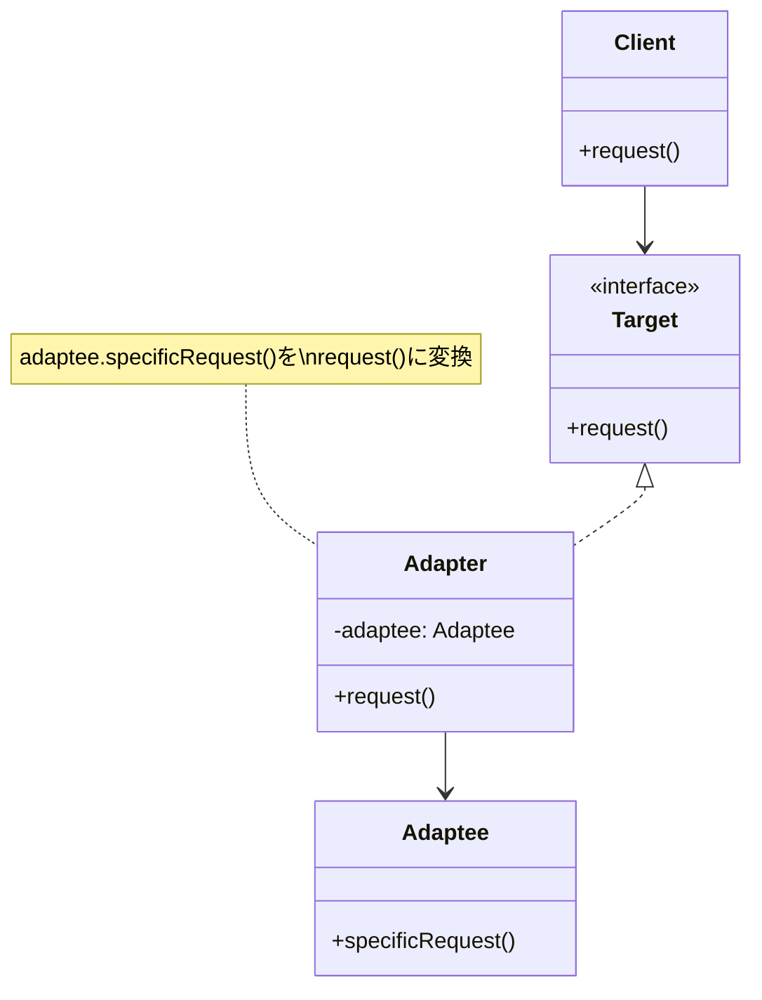

## 動作環境

この記事のコード例を実行するには、以下のPerlモジュールが必要です。

```bash
cpanm Moo
```

Mooは軽量で高速なPerlのオブジェクト指向フレームワークです。インストールしていない場合は、上記コマンドでインストールできます。

## はじめに

Adapterパターンは、互換性のないインターフェースを持つクラスやオブジェクト同士を接続するための**構造パターン**です。既存のコードを変更することなく、新しいインターフェースで既存の機能を再利用できるようにします。

デザインパターンの世界では「**Wrapper（ラッパー）パターン**」とも呼ばれ、あるクラスを「包み込む」ことでインターフェースを変換する手法です。

レガシーシステムとの統合、複数の決済APIの統一化、サードパーティライブラリの抽象化など、実務でよく遭遇する課題を解決できる実用的なパターンです。

## Adapterパターンとは - GoFの構造パターン

### Adapterパターンの定義

Adapterパターンは、GoF（Gang of Four）が定義する23のデザインパターンの中で「**構造パターン（Structural Patterns）**」に分類されます。

構造パターンは、クラスやオブジェクトを組み合わせて、より大きな構造を形成するためのパターンです。Adapterはその中でも特に「**インターフェースの不一致**」を解決するために使われます。

### パターンの構造

Adapterパターンには、主に2つの実装方法があります。

- **クラスアダプター**: 継承を使った実装
- **オブジェクトアダプター**: 委譲を使った実装（推奨）

一般的には、柔軟性が高く拡張しやすい「オブジェクトアダプター」が推奨されます。



- **Client**: Targetインターフェースを使うクライアント
- **Target**: クライアントが期待するインターフェース
- **Adapter**: TargetインターフェースをAdapteeに適合させるアダプター
- **Adaptee**: 既存の、適合させたいクラス

## Adapterパターンの用途と使用シーン

### Adapterパターンが解決する問題

Adapterパターンは、以下のような問題を解決します。

- 既存のクラスを変更できないが、新しいインターフェースで使いたい
- サードパーティライブラリの複雑なインターフェースを簡略化したい
- レガシーシステムと新システムを統合したい
- 複数の異なるAPIを統一的に扱いたい

### 実際の使用シーン

**1. レガシーシステムの統合**

古いシステムのAPIを、新しいシステムのインターフェースに適合させます。

**2. サードパーティAPIの統一化**

複数の決済サービス（PayPay、Stripe、楽天ペイなど）を統一的なインターフェースで扱います。

**3. データフォーマット変換**

JSONとXMLなど、異なるデータフォーマット間の変換を行います。

**4. ライブラリの抽象化**

特定のライブラリに依存しないインターフェースを提供し、将来的にライブラリを切り替えやすくします。

## Perl実装例 - Adapterパターンのサンプルコード

### シンプルな例：電圧変換アダプター

日本の100V家電をアメリカの120V電源で使うための変換アダプターを実装します。

```perl
package JapaneseAppliance;
use Moo;

sub connect_to_100v {
    my $self = shift;
    return "100Vに接続しました";
}

1;
```

```perl
package VoltageAdapter;
use Moo;

has 'japanese_appliance' => (
    is => 'ro',
    required => 1,
);

sub connect_to_120v {
    my $self = shift;
    # 120Vを100Vに変換して接続
    return $self->japanese_appliance->connect_to_100v . " (120Vから変換)";
}

1;
```

```perl
# 使用例
my $appliance = JapaneseAppliance->new;
my $adapter = VoltageAdapter->new(japanese_appliance => $appliance);

print $adapter->connect_to_120v;
# 出力: 100Vに接続しました (120Vから変換)
```

このように、Adapterパターンを使うことで、既存の`JapaneseAppliance`クラスを変更することなく、120V環境で使用できるようになります。

### 実践的な例：決済APIの統一化

複数の決済サービスを統一的なインターフェースで扱う例です。

```perl
# 統一インターフェース（Target）
package PaymentInterface;
use Moo::Role;

requires 'process_payment';
requires 'refund';

1;
```

```perl
# 既存のStripe API（Adaptee）
package StripeAPI;
use Moo;

sub charge {
    my ($self, $amount, $token) = @_;
    return "Stripe: Charged $amount yen with token $token";
}

sub create_refund {
    my ($self, $charge_id) = @_;
    return "Stripe: Refunded charge $charge_id";
}

1;
```

```perl
# StripeAdapter（Adapter）
package StripeAdapter;
use Moo;

with 'PaymentInterface';

has 'stripe_api' => (
    is => 'ro',
    default => sub { StripeAPI->new },
);

sub process_payment {
    my ($self, $amount, $payment_info) = @_;
    return $self->stripe_api->charge($amount, $payment_info->{token});
}

sub refund {
    my ($self, $transaction_id) = @_;
    return $self->stripe_api->create_refund($transaction_id);
}

1;
```

```perl
# 既存のPayPay API（別のAdaptee）
package PayPayAPI;
use Moo;

sub execute_payment {
    my ($self, $params) = @_;
    return "PayPay: Payment of $params->{amount} yen executed";
}

sub cancel_payment {
    my ($self, $payment_id) = @_;
    return "PayPay: Payment $payment_id cancelled";
}

1;
```

```perl
# PayPayAdapter（別のAdapter）
package PayPayAdapter;
use Moo;

with 'PaymentInterface';

has 'paypay_api' => (
    is => 'ro',
    default => sub { PayPayAPI->new },
);

sub process_payment {
    my ($self, $amount, $payment_info) = @_;
    return $self->paypay_api->execute_payment({
        amount => $amount,
        user_id => $payment_info->{user_id},
    });
}

sub refund {
    my ($self, $transaction_id) = @_;
    return $self->paypay_api->cancel_payment($transaction_id);
}

1;
```

```perl
# 使用例
sub process_order {
    my ($payment_adapter, $amount, $payment_info) = @_;
    
    # どの決済サービスでも同じインターフェースで処理できる
    my $result = $payment_adapter->process_payment($amount, $payment_info);
    print "$result\n";
}

# Stripeで決済
my $stripe_adapter = StripeAdapter->new;
process_order($stripe_adapter, 1000, { token => 'tok_123' });
# 出力: Stripe: Charged 1000 yen with token tok_123

# PayPayで決済
my $paypay_adapter = PayPayAdapter->new;
process_order($paypay_adapter, 2000, { user_id => 'user_456' });
# 出力: PayPay: Payment of 2000 yen executed
```

### CPANモジュールの活用

Perlでは`Class::Adapter`モジュールを使うことで、より簡潔にアダプターを実装できます。

```perl
package MyAdapter;
use Class::Adapter::Builder
    ISA     => 'MyAdaptee',
    METHODS => {
        new_method => 'old_method',
    };

1;
```

## Adapterパターンの利点と欠点

### Adapterパターンの利点

**1. 単一責任の原則（Single Responsibility Principle）**

インターフェース変換のロジックをアダプタークラスに分離できる

**2. 開放閉鎖の原則（Open/Closed Principle）**

既存のコードを変更せずに新しいアダプターを追加できる

**3. 再利用性の向上**

既存のクラスを変更することなく、新しいコンテキストで再利用できる

**4. 段階的な移行が可能**

レガシーシステムから新システムへの移行を段階的に進められる

**5. 依存関係の逆転**

クライアントコードを特定の実装から切り離せる

### Adapterパターンの欠点と注意点

**1. 複雑性の増加**

アダプタークラスが増えることで、コードの見通しが悪くなる可能性がある

**2. パフォーマンスのオーバーヘッド**

メソッド呼び出しが1段階増えるため、わずかなパフォーマンス低下がある。ただし、ほとんどのアプリケーションでは無視できる程度（マイクロ秒単位）であり、保守性とのトレードオフとして許容できる範囲である。

**3. 過度の抽象化**

不要なアダプターを作ると、かえって保守性が下がる

### 実装時の注意点

- **アダプターの乱立を避ける**: 本当に必要な場合にのみ使用する
- **継承より委譲を優先**: オブジェクトアダプターの方が柔軟性が高い
- **パフォーマンスを考慮**: 高頻度で呼ばれる処理では、オーバーヘッドに注意する
- **命名規則**: `〜Adapter`という名前をつけることで、意図を明確にする

## デザインパターン学習への第一歩

Adapterパターンは、デザインパターンを学ぶ上で理解しやすく実践的なパターンの一つです。

このパターンを理解したら、次のステップとして以下のパターンも学習することをおすすめします：

- **Strategyパターン**: アルゴリズムの切り替えを柔軟にする（下記リンク参照）
- **Facadeパターン**: 複雑なサブシステムをシンプルに扱う
- **Decoratorパターン**: オブジェクトに動的に機能を追加する



## まとめ - Adapterパターンの要点

Adapterパターンは、互換性のないインターフェースを持つクラスを接続するための強力なデザインパターンです。

### 重要なポイント

- 既存のコードを変更せずに、新しいインターフェースで再利用できる
- クラスアダプター（継承）よりオブジェクトアダプター（委譲）が推奨される
- レガシーシステムの統合やサードパーティAPIの統一化に有効
- 単一責任の原則と開放閉鎖の原則に従った設計ができる

### 使用を検討すべきケース

- サードパーティライブラリのインターフェースを統一したい
- レガシーコードと新コードを統合したい
- 将来的にライブラリを切り替える可能性がある
- 複数の異なる実装を統一的に扱いたい

Adapterパターンを適切に使うことで、保守性と拡張性の高いシステムを構築できます。

## 関連するデザインパターン

Adapterパターンと関連する他のGoFデザインパターンです。それぞれのパターンには明確な目的の違いがあります。

- **Bridge**: 抽象と実装を分離するパターン（Adapterは既存クラスの適合、Bridgeは設計段階での分離）
- **Decorator**: オブジェクトに動的に機能を追加するパターン（Adapterはインターフェース変換、Decoratorは機能追加）
- **Facade**: 複雑なサブシステムへのシンプルなインターフェースを提供するパターン（Adapterは1対1の変換、Facadeは多対1の簡略化）
- **Proxy**: オブジェクトへのアクセスを制御するパターン（Adapterはインターフェース変換、Proxyはアクセス制御）
- **Strategy**: アルゴリズムの切り替えを柔軟にするパターン（実装の切り替えにおいて相性が良い）



## 参考文献

- オブジェクト指向における再利用のためのデザインパターン（GoF本）



- Refactoring Guru - Adapter Pattern



- GeeksforGeeks - Adapter Design Pattern


