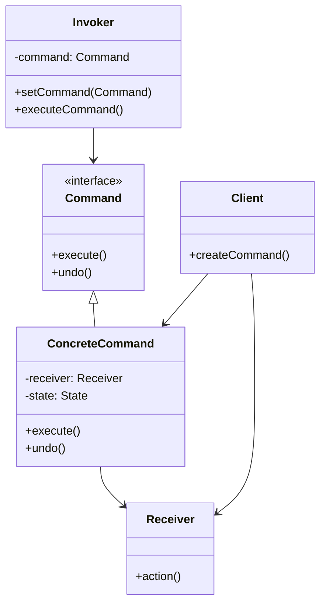
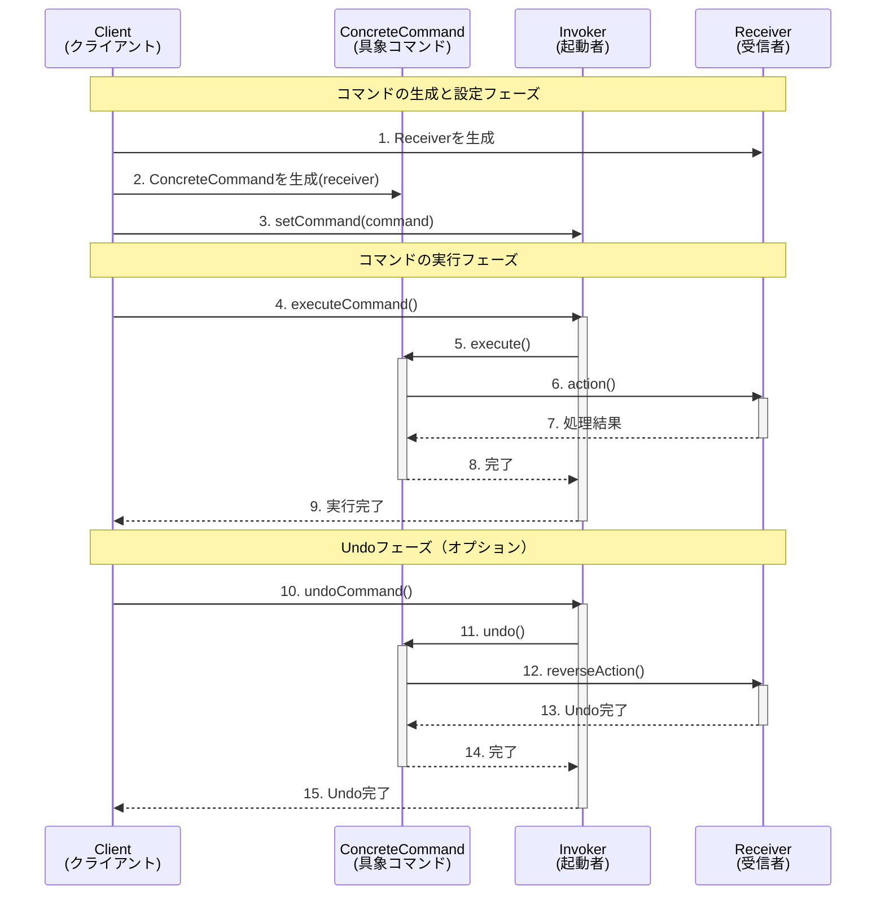
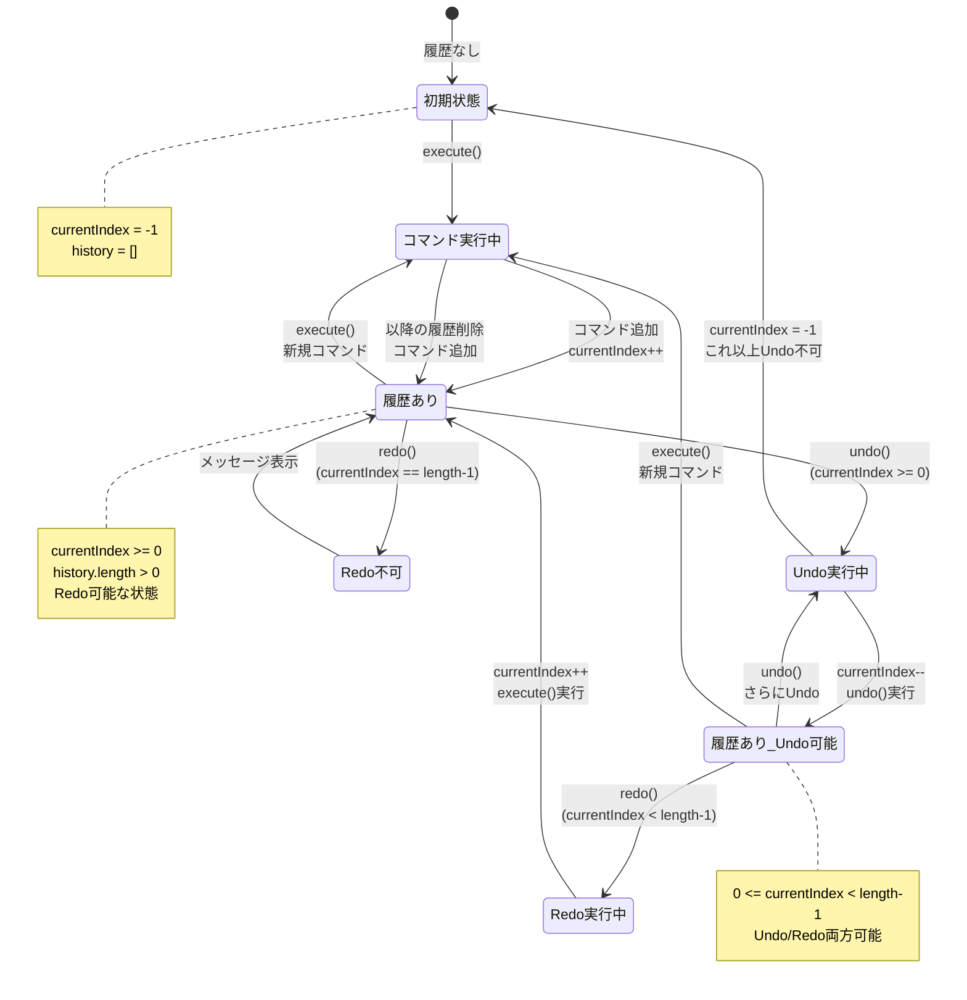
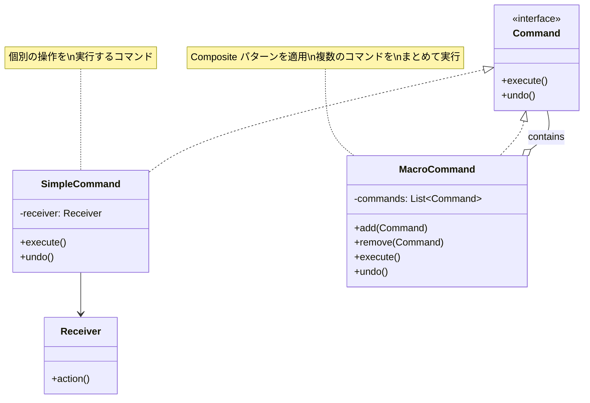
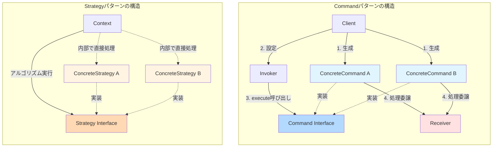
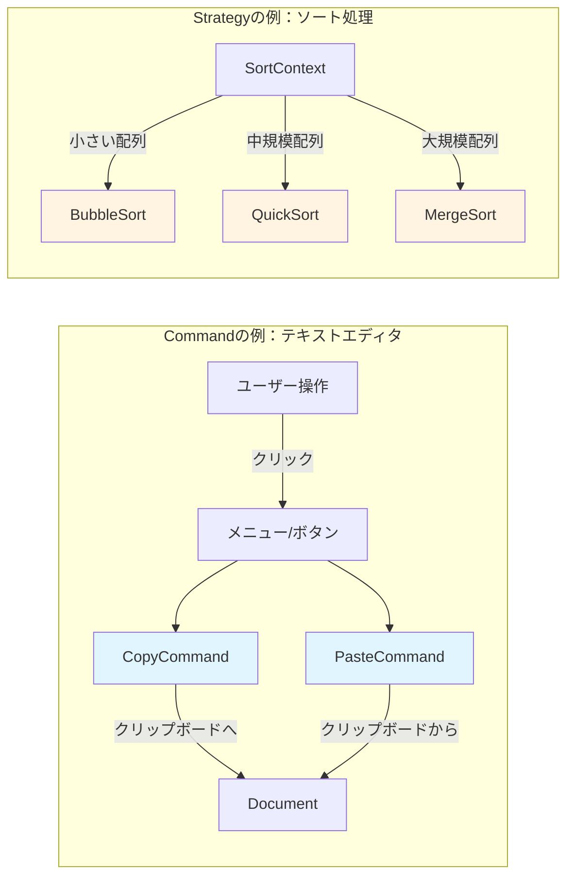
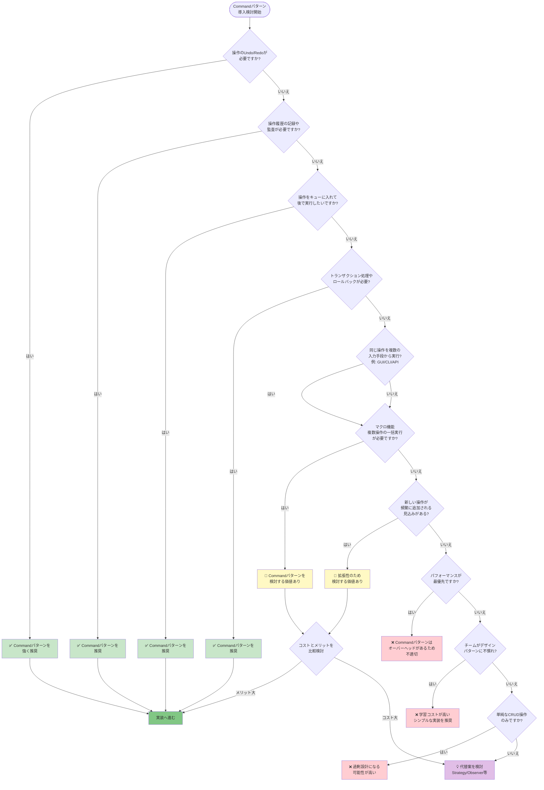
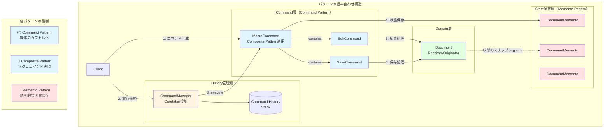

## はじめに

プログラムでアンドゥ・リドゥ機能を実装したり、操作履歴を管理したりする際、どのような設計を採用していますか？単純なif-else文の羅列では、機能追加のたびにコードが複雑化し、保守性が著しく低下します。

Commandパターンは、このような課題を解決するGoF（Gang of Four）デザインパターンの一つです。リクエストをオブジェクトとしてカプセル化することで、操作の履歴管理、アンドゥ・リドゥ、キューイング、トランザクション管理などを柔軟に実現できます。

本記事では、Commandパターンの基本概念から実装例、実践的な適用シーンまで、2025年時点での最新情報を交えて包括的に解説します。

## Commandパターンとは

### 基本概念

Commandパターンは、**リクエストをオブジェクトとしてカプセル化する**振る舞いパターンです。これにより、異なるリクエストでクライアントをパラメータ化したり、リクエストをキューに入れたり、ログに記録したり、アンドゥ可能な操作をサポートしたりできます。

### パターンの構成要素

Commandパターンは以下の5つの主要な要素で構成されます。



- **Command（コマンド）**: 実行する操作のインターフェースを定義する
- **ConcreteCommand（具象コマンド）**: Commandインターフェースを実装し、ReceiverとActionの結びつきを定義する
- **Receiver（受信者）**: 実際の処理を知っているオブジェクト
- **Invoker（起動者）**: コマンドを保持し、実行を要求するオブジェクト
- **Client（クライアント）**: ConcreteCommandオブジェクトを生成し、Receiverを設定する

### Commandパターンの実行フロー

以下のシーケンス図は、Commandパターンにおける各コンポーネント間の相互作用を示しています。クライアントがコマンドを生成してから、実際の処理が実行されるまでの流れを理解できます。



**図の解説:**
- **生成フェーズ（1-3）**: クライアントがReceiverとCommandを生成し、Invokerに設定する
- **実行フェーズ（4-9）**: Invokerを通じてコマンドが実行され、Receiverの実際の処理が呼び出される
- **Undoフェーズ（10-15）**: 必要に応じて操作を取り消すことができる

このように、InvokerとReceiverが直接やり取りせず、Commandを介することで疎結合が実現されています。

### GoFデザインパターンにおける位置づけ

Commandパターンは、GoFの23のデザインパターンのうち、**振る舞いパターン**（Behavioral Patterns）に分類されます。振る舞いパターンは、オブジェクト間の責任分担やアルゴリズムの実装方法に関するパターンで、以下の11種類があります。

- Chain of Responsibility
- **Command**（本記事の対象）
- Interpreter
- Iterator
- Mediator
- Memento
- Observer
- State
- Strategy
- Template Method
- Visitor

## Commandパターンの用途

### 主な適用シーン

Commandパターンは以下のような場面で特に有効です。

#### 1. Undo/Redo機能の実装

テキストエディタやグラフィックツールなど、操作の取り消しとやり直しが必要なアプリケーションで広く使用されます。各操作をコマンドオブジェクトとして保存し、履歴スタックを管理することで実現します。

#### 2. GUIアクションの抽象化

ボタンクリック、メニュー選択、キーボードショートカットなど、異なる入力手段から同じ処理を実行する場合に、コマンドオブジェクトを介することで実装を統一できます。

#### 3. タスクキューイングとスケジューリング

実行するタスクをコマンドオブジェクトとしてキューに追加し、バックグラウンドで順次処理するシステムに適用できます。

#### 4. トランザクション管理

データベース操作など、一連の処理をトランザクションとして管理し、必要に応じてロールバックする場合に有効です。

#### 5. ロギングと監査

実行されたコマンドを記録することで、操作履歴の追跡や監査証跡の作成が容易になります。

### 実世界での使用事例

#### テキストエディタのUndoシステム

VS CodeやIntelliJ IDEAなどのテキストエディタは、Commandパターンを使用してUndo/Redo機能を実装しています。各編集操作（挿入、削除、置換など）をコマンドオブジェクトとして表現し、履歴スタックで管理します。

#### レストラン注文システム

注文をCommandオブジェクトとして表現し、キッチンへの伝票として機能させます。注文の変更やキャンセルも容易に実装できます。

#### スマートホームコントローラー

照明のオン/オフ、温度調整、セキュリティシステムの制御など、異なるデバイスの操作をコマンドとして統一的に扱います。リモコンのボタンに任意のコマンドを割り当てることができます。

## 実装例

Commandパターンの具体的な実装を、3つのプログラミング言語で解説します。

### Java実装例：リモコンシステム

スマートホームのリモコンを題材に、Commandパターンを実装します。

```java
// Command インターフェース
interface Command {
    void execute();
    void undo();
}

// Receiver クラス（照明）
class Light {
    private String location;
    
    public Light(String location) {
        this.location = location;
    }
    
    public void on() {
        System.out.println(location + " の照明をONにしました");
    }
    
    public void off() {
        System.out.println(location + " の照明をOFFにしました");
    }
}

// ConcreteCommand クラス（照明ON）
class LightOnCommand implements Command {
    private Light light;
    
    public LightOnCommand(Light light) {
        this.light = light;
    }
    
    @Override
    public void execute() {
        light.on();
    }
    
    @Override
    public void undo() {
        light.off();
    }
}

// ConcreteCommand クラス（照明OFF）
class LightOffCommand implements Command {
    private Light light;
    
    public LightOffCommand(Light light) {
        this.light = light;
    }
    
    @Override
    public void execute() {
        light.off();
    }
    
    @Override
    public void undo() {
        light.on();
    }
}

// Invoker クラス（リモコン）
class RemoteControl {
    private Command[] onCommands;
    private Command[] offCommands;
    private Command undoCommand;
    
    public RemoteControl() {
        onCommands = new Command[7];
        offCommands = new Command[7];
        
        Command noCommand = new Command() {
            public void execute() {}
            public void undo() {}
        };
        
        for (int i = 0; i < 7; i++) {
            onCommands[i] = noCommand;
            offCommands[i] = noCommand;
        }
        undoCommand = noCommand;
    }
    
    public void setCommand(int slot, Command onCommand, Command offCommand) {
        onCommands[slot] = onCommand;
        offCommands[slot] = offCommand;
    }
    
    public void onButtonWasPushed(int slot) {
        onCommands[slot].execute();
        undoCommand = onCommands[slot];
    }
    
    public void offButtonWasPushed(int slot) {
        offCommands[slot].execute();
        undoCommand = offCommands[slot];
    }
    
    public void undoButtonWasPushed() {
        undoCommand.undo();
    }
}

// Client（使用例）
public class RemoteControlTest {
    public static void main(String[] args) {
        RemoteControl remote = new RemoteControl();
        
        Light livingRoomLight = new Light("リビング");
        Light kitchenLight = new Light("キッチン");
        
        LightOnCommand livingRoomLightOn = new LightOnCommand(livingRoomLight);
        LightOffCommand livingRoomLightOff = new LightOffCommand(livingRoomLight);
        LightOnCommand kitchenLightOn = new LightOnCommand(kitchenLight);
        LightOffCommand kitchenLightOff = new LightOffCommand(kitchenLight);
        
        remote.setCommand(0, livingRoomLightOn, livingRoomLightOff);
        remote.setCommand(1, kitchenLightOn, kitchenLightOff);
        
        remote.onButtonWasPushed(0);  // リビングの照明をONにしました
        remote.offButtonWasPushed(0); // リビングの照明をOFFにしました
        remote.undoButtonWasPushed(); // リビングの照明をONにしました
        
        remote.onButtonWasPushed(1);  // キッチンの照明をONにしました
    }
}
```

**実装のポイント:**
- Java 8以降のバージョンで動作する
- Null Object パターンを使用して初期化を簡素化している
- 各ボタンに複数のコマンドを割り当て可能である

### TypeScript実装例：Undo/Redoマネージャー

テキストエディタのような、より実践的なUndo/Redo機能を実装します。

```typescript
// Command インターフェース
interface Command {
  execute(): void;
  undo(): void;
}

// Receiver クラス（テキストドキュメント）
class TextDocument {
  private content: string = '';
  
  public insert(position: number, text: string): void {
    this.content = 
      this.content.slice(0, position) + 
      text + 
      this.content.slice(position);
    console.log(`挿入後: "${this.content}"`);
  }
  
  public delete(position: number, length: number): void {
    this.content = 
      this.content.slice(0, position) + 
      this.content.slice(position + length);
    console.log(`削除後: "${this.content}"`);
  }
  
  public getContent(): string {
    return this.content;
  }
}

// ConcreteCommand クラス（挿入コマンド）
class InsertCommand implements Command {
  private document: TextDocument;
  private position: number;
  private text: string;
  
  constructor(document: TextDocument, position: number, text: string) {
    this.document = document;
    this.position = position;
    this.text = text;
  }
  
  execute(): void {
    this.document.insert(this.position, this.text);
  }
  
  undo(): void {
    this.document.delete(this.position, this.text.length);
  }
}

// ConcreteCommand クラス（削除コマンド）
class DeleteCommand implements Command {
  private document: TextDocument;
  private position: number;
  private deletedText: string;
  private length: number;
  
  constructor(document: TextDocument, position: number, length: number) {
    this.document = document;
    this.position = position;
    this.length = length;
    this.deletedText = '';
  }
  
  execute(): void {
    this.deletedText = this.document.getContent()
      .slice(this.position, this.position + this.length);
    this.document.delete(this.position, this.length);
  }
  
  undo(): void {
    this.document.insert(this.position, this.deletedText);
  }
}

// Invoker クラス（コマンドマネージャー）
class CommandManager {
  private history: Command[] = [];
  private currentIndex: number = -1;
  
  public execute(command: Command): void {
    // 現在位置より後の履歴を削除（新しい操作を実行したら、それ以降のRedo履歴は無効）
    this.history = this.history.slice(0, this.currentIndex + 1);
    
    command.execute();
    this.history.push(command);
    this.currentIndex++;
  }
  
  public undo(): void {
    if (this.currentIndex >= 0) {
      this.history[this.currentIndex].undo();
      this.currentIndex--;
      console.log('Undoを実行しました');
    } else {
      console.log('これ以上Undoできません');
    }
  }
  
  public redo(): void {
    if (this.currentIndex < this.history.length - 1) {
      this.currentIndex++;
      this.history[this.currentIndex].execute();
      console.log('Redoを実行しました');
    } else {
      console.log('これ以上Redoできません');
    }
  }
}

// Client（使用例）
const document = new TextDocument();
const manager = new CommandManager();

// テキストの挿入
manager.execute(new InsertCommand(document, 0, 'Hello'));
// 挿入後: "Hello"

manager.execute(new InsertCommand(document, 5, ' World'));
// 挿入後: "Hello World"

manager.execute(new DeleteCommand(document, 5, 6));
// 削除後: "Hello"

// Undo/Redo操作
manager.undo(); // 挿入後: "Hello World"
manager.undo(); // 挿入後: "Hello"
manager.redo(); // 挿入後: "Hello World"
```

**実装のポイント:**
- TypeScript 4.0以降で動作する
- Undo/Redo履歴の管理を実装している
- 型安全性を確保したインターフェース設計である

### Undo/Redoの状態遷移

上記のCommandManagerによるUndo/Redo機能の動作を、状態遷移図で視覚化しました。コマンド履歴における現在位置がどのように変化するかを理解できます。



**図の解説:**
- **初期状態**: 履歴が空で、currentIndexが-1
- **履歴あり**: コマンドが実行され、履歴に追加された状態
- **Undo実行中**: 現在のコマンドのundo()を実行し、currentIndexをデクリメントする
- **Redo実行中**: 次のコマンドのexecute()を実行し、currentIndexをインクリメントする
- **重要なポイント**: 新規コマンド実行時は、currentIndex以降の履歴が削除される（分岐した履歴は保持しない）

この状態管理により、直感的なUndo/Redo操作が実現されています。

### Python実装例：シンプルな計算機

Pythonの動的な特性を活かしたシンプルな実装例です。

```python
from abc import ABC, abstractmethod
from typing import List

# Command 抽象基底クラス
class Command(ABC):
    @abstractmethod
    def execute(self) -> None:
        pass
    
    @abstractmethod
    def undo(self) -> None:
        pass

# Receiver クラス（計算機）
class Calculator:
    def __init__(self):
        self.current_value = 0
    
    def add(self, value: int) -> None:
        self.current_value += value
        print(f"{value} を加算: 結果 = {self.current_value}")
    
    def subtract(self, value: int) -> None:
        self.current_value -= value
        print(f"{value} を減算: 結果 = {self.current_value}")
    
    def get_value(self) -> int:
        return self.current_value

# ConcreteCommand クラス（加算）
class AddCommand(Command):
    def __init__(self, calculator: Calculator, value: int):
        self.calculator = calculator
        self.value = value
    
    def execute(self) -> None:
        self.calculator.add(self.value)
    
    def undo(self) -> None:
        self.calculator.subtract(self.value)

# ConcreteCommand クラス（減算）
class SubtractCommand(Command):
    def __init__(self, calculator: Calculator, value: int):
        self.calculator = calculator
        self.value = value
    
    def execute(self) -> None:
        self.calculator.subtract(self.value)
    
    def undo(self) -> None:
        self.calculator.add(self.value)

# Invoker クラス（コマンド実行管理）
class CommandInvoker:
    def __init__(self):
        self.history: List[Command] = []
    
    def execute_command(self, command: Command) -> None:
        command.execute()
        self.history.append(command)
    
    def undo_last(self) -> None:
        if self.history:
            command = self.history.pop()
            command.undo()
            print("Undoを実行しました")
        else:
            print("Undo履歴がありません")

# Client（使用例）
if __name__ == "__main__":
    calculator = Calculator()
    invoker = CommandInvoker()
    
    # コマンドの実行
    invoker.execute_command(AddCommand(calculator, 10))
    # 10 を加算: 結果 = 10
    
    invoker.execute_command(AddCommand(calculator, 20))
    # 20 を加算: 結果 = 30
    
    invoker.execute_command(SubtractCommand(calculator, 5))
    # 5 を減算: 結果 = 25
    
    # Undo操作
    invoker.undo_last()  # 5 を加算: 結果 = 30
    invoker.undo_last()  # 20 を減算: 結果 = 10
```

**実装のポイント:**
- Python 3.7以降で動作する（型ヒント使用）
- abc モジュールで抽象基底クラスを定義している
- シンプルで理解しやすい実装である

## Commandパターンの利点

### 1. 疎結合の実現

コマンドを発行するオブジェクト（Invoker）と実際の処理を行うオブジェクト（Receiver）を分離できます。これにより、以下のメリットが得られます。

- Invokerは実行する処理の詳細を知る必要がない
- Receiverの変更がInvokerに影響しない
- テストが容易になる

### 2. Undo/Redoのサポート

各コマンドに`undo()`メソッドを実装することで、操作の取り消しとやり直しを簡単に実現できます。

- コマンドの履歴をスタックで管理する
- 任意の時点まで戻る・進むことが可能である
- 複数レベルのUndo/Redoにも対応する

### 3. 拡張性の向上

新しい種類のコマンドを追加する際、既存のコードを変更する必要がありません（開放閉鎖の原則）。

- 新しいConcreteCommandクラスを追加するだけでよい
- 既存のInvokerやReceiverに影響を与えない
- 機能追加が容易である

### 4. コマンドのキューイングと遅延実行

コマンドをオブジェクトとして扱えるため、以下が可能になります。

- コマンドをキューに追加して順次実行できる
- コマンドをスケジュールして後で実行できる
- 非同期処理との相性が良い

### 5. マクロコマンドの実装

複数のコマンドを組み合わせて、一つの複合コマンドとして実行できます。

```java
class MacroCommand implements Command {
    private List<Command> commands = new ArrayList<>();
    
    public void add(Command command) {
        commands.add(command);
    }
    
    @Override
    public void execute() {
        for (Command command : commands) {
            command.execute();
        }
    }
    
    @Override
    public void undo() {
        // 逆順でundoを実行
        for (int i = commands.size() - 1; i >= 0; i--) {
            commands.get(i).undo();
        }
    }
}
```

### マクロコマンドの構造

Compositeパターンと組み合わせることで、単一のコマンドと複数のコマンドを統一的に扱えます。



**マクロコマンドの利点:**
- 複数の操作を1つの単位として実行・Undoできる
- コマンドの再利用性が向上する
- 複雑な操作を階層的に管理可能である

**使用例:**
```java
// 複数の照明を一度にONにするマクロコマンド
MacroCommand partyMode = new MacroCommand();
partyMode.add(new LightOnCommand(livingRoomLight));
partyMode.add(new LightOnCommand(kitchenLight));
partyMode.add(new LightOnCommand(bedroomLight));
partyMode.add(new MusicOnCommand(stereo));

// 1回の実行で全ての照明とステレオがON
remote.setCommand(0, partyMode, partyOffCommand);
remote.onButtonWasPushed(0);

// Undo実行で全て逆順にOFF
remote.undoButtonWasPushed();
```

### 6. ロギングと監査証跡

実行されたコマンドを記録することで、以下が実現できます。

- 操作履歴の追跡ができる
- デバッグ情報の収集ができる
- セキュリティ監査ができる
- クラッシュリカバリーができる（コマンドを再実行してシステムを復元）

## Commandパターンの欠点と注意点

### 1. クラス数の増加

各操作ごとにConcreteCommandクラスを作成する必要があるため、クラス数が増加します。

**対策:**
- ラムダ式や関数オブジェクトを活用する（Java 8以降、Python、TypeScript等）
- 単純な操作には無名クラスを使用する
- ジェネリックコマンドクラスで共通化する

```java
// ラムダ式を使った簡素化（Java 8以降）
Command lightOn = () -> light.on();
Command lightOff = () -> light.off();
```

### 2. 複雑性の増加

シンプルな操作に対してCommandパターンを適用すると、過剰設計になる可能性があります。

**適用すべきでない場面:**
- 単純なCRUD操作のみで、Undo/Redo不要な場合
- コマンドの種類が少なく、増える見込みがない場合
- 処理の抽象化が不要な場合

### 3. メモリ使用量の増加

コマンドの履歴を保持する場合、メモリ使用量が増加します。

**対策:**
- 履歴の保存数に上限を設ける
- 古いコマンドを定期的に削除する
- Mementoパターンと組み合わせて状態を効率的に保存する

```typescript
class CommandManager {
  private maxHistorySize = 100; // 履歴の上限
  
  public execute(command: Command): void {
    command.execute();
    this.history.push(command);
    
    // 上限を超えたら古い履歴を削除
    if (this.history.length > this.maxHistorySize) {
      this.history.shift();
      this.currentIndex = Math.min(this.currentIndex, this.history.length - 1);
    }
  }
}
```

### 4. デバッグの困難性

コマンドの実行フローが間接的になるため、デバッグが複雑になることがあります。

**対策:**
- 詳細なロギングを実装する
- コマンド名やパラメータを記録する
- デバッグ用のtoString()メソッドを実装する

```python
class AddCommand(Command):
    def __str__(self):
        return f"AddCommand(value={self.value})"
    
    def execute(self):
        logger.debug(f"Executing: {self}")
        self.calculator.add(self.value)
```

## Commandパターン vs Strategyパターン

CommandパターンとStrategyパターンは構造が似ていますが、目的と用途が異なります。

### 構造の違い

以下の図は、CommandパターンとStrategyパターンの構造的な違いを視覚化したものです。



**構造上の主な違い:**

| 要素 | Commandパターン | Strategyパターン |
|------|----------------|------------------|
| **中間層** | Invoker（命令を発行） | Context（アルゴリズムを使用） |
| **処理の委譲先** | Receiver（別オブジェクト） | Strategy自身が処理を実装 |
| **関心事** | 「何を」実行するか | 「どのように」実行するか |
| **状態保持** | CommandがReceiverへの参照を保持 | Strategyは通常ステートレス |

### 主な違い

| 観点 | Command パターン | Strategy パターン |
|------|-----------------|------------------|
| **目的** | アクションのカプセル化 | アルゴリズムのカプセル化 |
| **焦点** | 何を実行するか（What） | どう実行するか（How） |
| **状態** | Receiverと関連付けられた状態を保持 | 通常、状態を保持しない |
| **主な用途** | Undo/Redo、キューイング、ロギング | アルゴリズムの切り替え、ポリシーの適用 |
| **インターフェース** | execute(), undo() | doAlgorithm(), calculate() |

### 実例による比較



**使用例の違い:**
- **Command（左）**: 各操作（Copy、Paste）を独立したオブジェクトとして表現し、Undo/Redoや履歴管理が可能である
- **Strategy（右）**: データの状態に応じて最適なアルゴリズムを選択し、同じインターフェースで処理を実行する

### 使い分けガイドライン

**Commandパターンを選ぶべき場合:**
- 操作の履歴管理が必要である
- Undo/Redo機能を実装したい
- リクエストをキューに入れて処理したい
- トランザクション管理が必要である

**Strategyパターンを選ぶべき場合:**
- 複数のアルゴリズムから選択したい
- アルゴリズムを実行時に切り替えたい
- 条件分岐を減らしたい
- アルゴリズムの詳細を隠蔽したい

## Commandパターンの実践的な活用シーン

### ケース1: トランザクション管理システム

データベース操作をコマンドとして実装し、トランザクション全体をロールバック可能にします。

```typescript
interface DatabaseCommand {
  execute(): Promise<void>;
  rollback(): Promise<void>;
}

class InsertRecordCommand implements DatabaseCommand {
  constructor(
    private db: Database,
    private table: string,
    private record: Record<string, any>
  ) {}
  
  async execute(): Promise<void> {
    await this.db.insert(this.table, this.record);
  }
  
  async rollback(): Promise<void> {
    await this.db.delete(this.table, this.record.id);
  }
}

class TransactionManager {
  private commands: DatabaseCommand[] = [];
  
  async executeTransaction(commands: DatabaseCommand[]): Promise<void> {
    try {
      for (const command of commands) {
        await command.execute();
        this.commands.push(command);
      }
    } catch (error) {
      // エラー発生時は全てロールバック
      for (let i = this.commands.length - 1; i >= 0; i--) {
        await this.commands[i].rollback();
      }
      throw error;
    }
  }
}
```

### ケース2: ジョブスケジューラー

バックグラウンドタスクをコマンドとして管理し、優先度やスケジュールに基づいて実行します。

```python
from datetime import datetime, timedelta
import heapq

class ScheduledCommand:
    def __init__(self, command: Command, scheduled_time: datetime, priority: int = 0):
        self.command = command
        self.scheduled_time = scheduled_time
        self.priority = priority
    
    def __lt__(self, other):
        # 優先度が高い（数値が小さい）ものを先に実行
        if self.priority != other.priority:
            return self.priority < other.priority
        # 優先度が同じなら早い時刻のものを先に実行
        return self.scheduled_time < other.scheduled_time

class JobScheduler:
    def __init__(self):
        self.queue = []
    
    def schedule(self, command: Command, delay_seconds: int = 0, priority: int = 0):
        scheduled_time = datetime.now() + timedelta(seconds=delay_seconds)
        scheduled_cmd = ScheduledCommand(command, scheduled_time, priority)
        heapq.heappush(self.queue, scheduled_cmd)
    
    def run(self):
        while self.queue:
            scheduled_cmd = heapq.heappop(self.queue)
            
            # 実行時刻まで待機
            now = datetime.now()
            if scheduled_cmd.scheduled_time > now:
                wait_seconds = (scheduled_cmd.scheduled_time - now).total_seconds()
                time.sleep(wait_seconds)
            
            scheduled_cmd.command.execute()
```

### ケース3: ゲームの入力システム

プレイヤーの入力をコマンドとして記録し、リプレイ機能やチート検出に活用します。

```java
// ゲームコマンド
interface GameCommand {
    void execute(Player player);
}

class MoveCommand implements GameCommand {
    private int dx, dy;
    
    public MoveCommand(int dx, int dy) {
        this.dx = dx;
        this.dy = dy;
    }
    
    @Override
    public void execute(Player player) {
        player.move(dx, dy);
    }
}

class AttackCommand implements GameCommand {
    @Override
    public void execute(Player player) {
        player.attack();
    }
}

// 入力ハンドラー
class InputHandler {
    private Map<String, GameCommand> keyBindings = new HashMap<>();
    private List<GameCommand> commandHistory = new ArrayList<>();
    
    public InputHandler() {
        // キーバインディングの設定
        keyBindings.put("W", new MoveCommand(0, 1));
        keyBindings.put("S", new MoveCommand(0, -1));
        keyBindings.put("A", new MoveCommand(-1, 0));
        keyBindings.put("D", new MoveCommand(1, 0));
        keyBindings.put("SPACE", new AttackCommand());
    }
    
    public void handleInput(String key, Player player) {
        GameCommand command = keyBindings.get(key);
        if (command != null) {
            command.execute(player);
            commandHistory.add(command);
        }
    }
    
    // リプレイ機能
    public void replay(Player player) {
        for (GameCommand command : commandHistory) {
            command.execute(player);
        }
    }
}
```

## Commandパターン導入の判断基準

### 導入判断フローチャート

Commandパターンを導入すべきかどうか迷った際は、以下のフローチャートを参考にしてください。



**フローチャートの使い方:**
1. 上から順に質問に答えていく
2. **緑色**の結果が出たら、Commandパターンの導入を推奨する
3. **黄色**の結果が出たら、コストとメリットを慎重に比較する
4. **赤色**の結果が出たら、Commandパターン以外の方法を検討する

### 導入を検討すべき場合

以下のチェックリストに3つ以上当てはまる場合、Commandパターンの導入を検討してください。

- [ ] Undo/Redo機能が必要である
- [ ] 操作の履歴を保持・管理する必要がある
- [ ] リクエストをキューに入れて後で処理したい
- [ ] 操作をログに記録する必要がある
- [ ] トランザクション的な処理が必要である
- [ ] 同じ操作を異なる入力手段（GUI、CLI、API）から実行したい
- [ ] マクロ機能（複数操作の一括実行）が必要である
- [ ] 将来的に新しい種類の操作が頻繁に追加される見込みがある

### 導入を避けるべき場合

以下の場合は、Commandパターンの導入を避けた方が良いでしょう。

- 単純な処理で、上記のチェックリストに該当する項目が少ない
- パフォーマンスが最優先で、オーバーヘッドが許容できない
- チームメンバーがデザインパターンに不慣れで、学習コストが高い
- プロトタイプや一時的なコードである

## 関連パターンとの組み合わせ

### Mementoパターンとの組み合わせ

Commandパターンで操作を記録し、Mementoパターンで状態を保存することで、より効率的なUndo/Redoを実現できます。

```java
// Memento（状態の保存）
class DocumentMemento {
    private final String content;
    
    public DocumentMemento(String content) {
        this.content = content;
    }
    
    public String getContent() {
        return content;
    }
}

// Command with Memento
class EditCommand implements Command {
    private TextDocument document;
    private DocumentMemento beforeState;
    
    @Override
    public void execute() {
        // 実行前の状態を保存
        beforeState = document.createMemento();
        // 実際の編集処理
        document.edit();
    }
    
    @Override
    public void undo() {
        // 保存した状態を復元
        document.restore(beforeState);
    }
}
```

### Compositeパターンとの組み合わせ

マクロコマンド（複数のコマンドを組み合わせた複合コマンド）を実現します。

```typescript
class CompositeCommand implements Command {
  private commands: Command[] = [];
  
  add(command: Command): void {
    this.commands.push(command);
  }
  
  execute(): void {
    this.commands.forEach(cmd => cmd.execute());
  }
  
  undo(): void {
    // 逆順でundo
    for (let i = this.commands.length - 1; i >= 0; i--) {
      this.commands[i].undo();
    }
  }
}
```

### 実践的なパターン組み合わせ例

以下の図は、複数のデザインパターンを組み合わせた、エンタープライズレベルのCommandシステムの構造を示しています。



**組み合わせによる相乗効果:**

| パターン組み合わせ | メリット | 使用例 |
|------------------|---------|--------|
| **Command + Memento** | 状態変更前のスナップショットを効率的に保存 | 大規模ドキュメントエディタのUndo |
| **Command + Composite** | 複数操作をまとめて実行・管理 | マクロ機能、バッチ処理 |
| **Command + Observer** | コマンド実行を監視し、UI更新やログ記録 | リアルタイム通知システム |
| **Command + Chain of Responsibility** | コマンド処理を複数のハンドラで段階的に処理 | 承認ワークフロー |

## まとめ

Commandパターンは、リクエストをオブジェクトとしてカプセル化することで、操作の履歴管理、Undo/Redo、キューイング、トランザクション管理などを柔軟に実現する強力なデザインパターンです。

### 主要なポイント

- **疎結合**: InvokerとReceiverを分離し、保守性を向上させる
- **拡張性**: 新しいコマンドの追加が容易である（開放閉鎖の原則）
- **Undo/Redo**: 操作の取り消しとやり直しを簡単に実装できる
- **トレードオフ**: クラス数の増加と複雑性の上昇に注意が必要である

### 適用の判断

Commandパターンは万能ではありません。適用する場面を見極めることが重要です。

- **適している場合**: Undo/Redo、履歴管理、キューイング、トランザクションが必要な場合
- **適していない場合**: 単純な処理、パフォーマンス最優先、一時的なコード

### 次のステップ

Commandパターンをマスターしたら、以下のパターンも学習することをお勧めします。

- **Mementoパターン**: 状態の保存と復元（Commandと相性が良い）
- **Strategyパターン**: アルゴリズムのカプセル化（Commandとの使い分けを理解）
- **Chain of Responsibilityパターン**: リクエストの処理チェーン
- **Observerパターン**: コマンド実行時の通知機能

本記事で紹介した実装例を参考に、ぜひ実際のプロジェクトでCommandパターンを活用してみてください。

## 参考文献

以下のリソースで、さらに深い理解を得ることができます。








