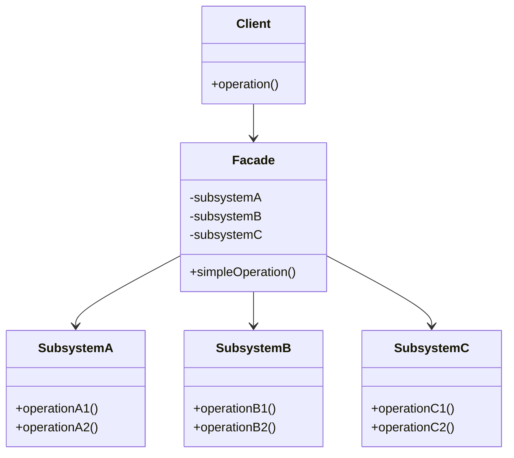

[@nqounet](https://x.com/nqounet)です。

ソフトウェア開発において、複数のクラスやライブラリが絡み合った複雑なコードに直面したことはありませんか？「この機能を使うだけなのに、なぜこんなに複雑な手順が必要なのか」と感じた経験があるかもしれません。

今回は、そんな複雑さを解消する**Facadeパターン**について解説します。

## 問題：複雑なサブシステムとの格闘

まず、Facadeパターンが解決する問題を具体的に見てみましょう。

### 複雑なコードの例

ホームシアターシステムを操作するコードを考えてみます。映画を見るという単純な目的のために、以下のような複雑な手順が必要になっています。

```java
// 映画を見るための手順（Facadeパターン適用前）
public class Client {
    public void watchMovie(String movie) {
        // 1. アンプの電源を入れて設定
        Amplifier amp = new Amplifier();
        amp.on();
        amp.setVolume(5);
        amp.setSurroundSound();
        
        // 2. DVDプレイヤーの準備
        DVDPlayer dvd = new DVDPlayer(amp);
        dvd.on();
        dvd.insert(movie);
        
        // 3. プロジェクターの設定
        Projector projector = new Projector(dvd);
        projector.on();
        projector.wideScreenMode();
        
        // 4. スクリーンを下ろす
        Screen screen = new Screen();
        screen.down();
        
        // 5. 照明を暗くする
        TheaterLights lights = new TheaterLights();
        lights.dim(10);
        
        // 6. ポップコーンマシンを起動
        PopcornPopper popper = new PopcornPopper();
        popper.on();
        popper.pop();
        
        // 7. 再生開始
        dvd.play(movie);
    }
}
```

### この設計の問題点

- **クライアントコードが複雑**: 単に映画を見たいだけなのに、7つのステップを正確に実行する必要がある
- **結合度が高い**: クライアントが6つのサブシステムクラスに直接依存している
- **変更に弱い**: サブシステムの変更がクライアントに直接影響する
- **再利用が困難**: 同じ操作を別の場所で行う際、同じ複雑な手順を繰り返す必要がある

実際の開発現場でも、このような複雑さに悩まされることは珍しくありません。

## 解決策：Facadeパターンの導入

Facadeパターンは、複雑なサブシステムに対して**シンプルな統一インターフェース**を提供するデザインパターンです。

### Facadeパターンとは

**定義**: サブシステム内の一連のインターフェースに対して、統一されたインターフェースを提供するパターン。Facadeは高レベルのインターフェースを定義し、サブシステムをより使いやすくする。

**分類**: GoF（Gang of Four）デザインパターンの**構造パターン**の1つ

**語源**: Facade（ファサード）は建築用語で「建物の正面」を意味します。建物の内部構造がどれだけ複雑であっても、正面から見ると整然とした外観を呈しているように、Facadeパターンは複雑なシステムにシンプルな「顔」を提供します。

### パターンの構造

Facadeパターンは3つの要素で構成されます。



- **Client（クライアント）**: サブシステムを使用する側
- **Facade（ファサード）**: サブシステムへの統一インターフェースを提供するクラス
- **Subsystem（サブシステム）**: 複雑な機能を実装するクラス群

## 実装例：ホームシアターシステムの改善

先ほどの複雑なコードをFacadeパターンで改善してみましょう。

### Facadeクラスの実装

```java
// Java
public class HomeTheaterFacade {
    private Amplifier amp;
    private DVDPlayer dvd;
    private Projector projector;
    private Screen screen;
    private TheaterLights lights;
    private PopcornPopper popper;
    
    public HomeTheaterFacade(
        Amplifier amp,
        DVDPlayer dvd,
        Projector projector,
        Screen screen,
        TheaterLights lights,
        PopcornPopper popper
    ) {
        this.amp = amp;
        this.dvd = dvd;
        this.projector = projector;
        this.screen = screen;
        this.lights = lights;
        this.popper = popper;
    }
    
    // 映画鑑賞を開始する統一インターフェース
    public void watchMovie(String movie) {
        System.out.println("映画鑑賞の準備をしています...");
        popper.on();
        popper.pop();
        lights.dim(10);
        screen.down();
        projector.on();
        projector.wideScreenMode();
        amp.on();
        amp.setVolume(5);
        amp.setSurroundSound();
        dvd.on();
        dvd.play(movie);
        System.out.println("映画をお楽しみください！");
    }
    
    // 映画鑑賞を終了する統一インターフェース
    public void endMovie() {
        System.out.println("ホームシアターをシャットダウンしています...");
        popper.off();
        lights.on();
        screen.up();
        projector.off();
        amp.off();
        dvd.stop();
        dvd.eject();
        dvd.off();
        System.out.println("シャットダウン完了");
    }
}
```

### クライアントコードの簡素化

```java
// Facadeパターン適用後のクライアントコード
public class Client {
    public static void main(String[] args) {
        // サブシステムのインスタンス生成は1回だけ
        HomeTheaterFacade homeTheater = new HomeTheaterFacade(
            new Amplifier(),
            new DVDPlayer(new Amplifier()),
            new Projector(new DVDPlayer(new Amplifier())),
            new Screen(),
            new TheaterLights(),
            new PopcornPopper()
        );
        
        // シンプルな操作
        homeTheater.watchMovie("インセプション");
        
        // 映画鑑賞後
        homeTheater.endMovie();
    }
}
```

### Before/After の比較

| 観点 | Before（Facade適用前） | After（Facade適用後） |
|------|----------------------|---------------------|
| コード行数 | 約20行 | 2行 |
| 依存クラス数 | 6つのサブシステムクラス | 1つのFacadeクラス |
| 複雑度 | 高（7ステップの手順） | 低（1メソッド呼び出し） |
| 保守性 | 低（変更箇所が多い） | 高（Facade内のみ） |
| 再利用性 | 低（毎回同じコードを書く） | 高（Facadeを呼ぶだけ） |

## より実践的な例：APIクライアントのラッピング

実務でよく見られるパターンとして、複雑なAPIクライアントをFacadeでラップする例を見てみましょう。

### サブシステム（複雑なAPI群）

```typescript
// TypeScript + Node.js
// 複雑な外部APIクライアント（サブシステム）
class AuthenticationAPI {
    async authenticate(credentials: Credentials): Promise<Token> {
        // 認証処理
        return { token: 'abc123', expiresIn: 3600 };
    }
    
    async refreshToken(token: Token): Promise<Token> {
        // トークンリフレッシュ
        return { token: 'xyz789', expiresIn: 3600 };
    }
}

class UserAPI {
    async getUser(userId: string, token: Token): Promise<User> {
        // ユーザー情報取得
        return { id: userId, name: 'John Doe', email: 'john@example.com' };
    }
    
    async updateUser(userId: string, data: Partial<User>, token: Token): Promise<User> {
        // ユーザー情報更新
        return { id: userId, ...data };
    }
}

class NotificationAPI {
    async sendEmail(recipient: string, message: string, token: Token): Promise<void> {
        // メール送信
        console.log(`Email sent to ${recipient}`);
    }
}
```

### Facadeクラスによる統合

```typescript
// APIFacade: 複雑なAPIを統一インターフェースで提供
class APIFacade {
    private authAPI: AuthenticationAPI;
    private userAPI: UserAPI;
    private notificationAPI: NotificationAPI;
    private currentToken?: Token;
    
    constructor() {
        this.authAPI = new AuthenticationAPI();
        this.userAPI = new UserAPI();
        this.notificationAPI = new NotificationAPI();
    }
    
    // 統一された高レベルインターフェース
    async loginAndGetUser(credentials: Credentials): Promise<User> {
        // 1. 認証
        this.currentToken = await this.authAPI.authenticate(credentials);
        
        // 2. ユーザー情報取得（認証トークンを自動的に使用）
        const user = await this.userAPI.getUser(credentials.userId, this.currentToken);
        
        return user;
    }
    
    async updateProfileAndNotify(
        userId: string, 
        updates: Partial<User>, 
        notifyEmail: boolean = true
    ): Promise<User> {
        // トークンの有効性チェック（簡略化）
        if (!this.currentToken) {
            throw new Error('Not authenticated');
        }
        
        // 1. プロフィール更新
        const updatedUser = await this.userAPI.updateUser(userId, updates, this.currentToken);
        
        // 2. 必要に応じて通知送信
        if (notifyEmail && updatedUser.email) {
            await this.notificationAPI.sendEmail(
                updatedUser.email,
                'プロフィールが更新されました',
                this.currentToken
            );
        }
        
        return updatedUser;
    }
}
```

### クライアントコードの簡素化

```typescript
// Facade使用前: 複数のAPIを直接操作
async function complexClientCode() {
    const authAPI = new AuthenticationAPI();
    const userAPI = new UserAPI();
    const notificationAPI = new NotificationAPI();
    
    // 認証
    const token = await authAPI.authenticate({ userId: '123', password: 'secret' });
    
    // ユーザー取得
    const user = await userAPI.getUser('123', token);
    
    // 更新
    const updatedUser = await userAPI.updateUser('123', { name: 'Jane Doe' }, token);
    
    // 通知
    await notificationAPI.sendEmail(updatedUser.email, 'Updated!', token);
}

// Facade使用後: シンプルな操作
async function simpleClientCode() {
    const api = new APIFacade();
    
    // ログインとユーザー取得を一度に
    const user = await api.loginAndGetUser({ userId: '123', password: 'secret' });
    
    // 更新と通知を一度に
    const updatedUser = await api.updateProfileAndNotify('123', { name: 'Jane Doe' }, true);
}
```

この例では、Facadeパターンによって以下のメリットが得られています：

- **認証トークンの管理を隠蔽**: クライアントはトークンを意識する必要がない
- **複数APIの連携を自動化**: 関連する操作を1つのメソッドにまとめる
- **エラーハンドリングの一元化**: Facade内で共通のエラー処理を実装できる

## Facadeパターンの利点

### 1. 複雑性の低減

サブシステムの複雑な詳細を隠蔽し、シンプルなインターフェースを提供します。これにより、クライアントコードの可読性と保守性が向上します。

### 2. 結合度の低減

クライアントとサブシステム間の直接的な依存関係を減らし、システムの柔軟性を高めます。サブシステムの変更がクライアントに波及しにくくなります。

### 3. レイヤードアーキテクチャの実現

複雑なシステムを階層化し、各層の責務を明確にします。特にレイヤードアーキテクチャやヘキサゴナルアーキテクチャで有効です。

### 4. テストの容易化

Facadeをモック化することで、サブシステム全体をモック化する必要がなくなり、ユニットテストが書きやすくなります。

```typescript
// テスト時にはFacadeをモック化するだけで済む
const mockAPI = {
    loginAndGetUser: jest.fn().mockResolvedValue({ id: '123', name: 'Test User' }),
    updateProfileAndNotify: jest.fn().mockResolvedValue({ id: '123', name: 'Updated' })
};
```

### 5. 段階的なリファクタリングが可能

レガシーシステムを新しいシステムに移行する際、Facadeを間に挟むことで段階的な移行が可能になります。

## Facadeパターンの欠点と注意点

### 1. 過剰な抽象化のリスク

Facadeが提供するインターフェースが限定的すぎると、サブシステムの柔軟性を失ってしまいます。

**対策**: 必要に応じて、Facadeを経由せずにサブシステムへ直接アクセスできるようにしておく

```java
public class HomeTheaterFacade {
    // Facadeを経由した簡単な操作
    public void watchMovie(String movie) { ... }
    
    // 詳細な制御が必要な場合は、サブシステムへのアクセスも提供
    public Amplifier getAmplifier() {
        return this.amp;
    }
}
```

### 2. 神クラス（God Class）化のリスク

Facadeにあまりに多くの責務を持たせると、肥大化して保守困難な「神クラス」になってしまいます。

**対策**: 責務に応じて複数のFacadeに分割する

```typescript
// 悪い例: 1つのFacadeに全てを詰め込む
class SystemFacade {
    loginAndGetUser() { ... }
    processOrder() { ... }
    generateReport() { ... }
    sendNotification() { ... }
    // ... 100個のメソッド
}

// 良い例: 責務ごとにFacadeを分割
class AuthFacade {
    loginAndGetUser() { ... }
}

class OrderFacade {
    processOrder() { ... }
}

class ReportFacade {
    generateReport() { ... }
}
```

### 3. 柔軟性とのトレードオフ

Facadeによる抽象化は、詳細な制御を犠牲にする場合があります。細かいカスタマイズが必要な場合には不向きです。

**対策**: ユースケースに応じて使い分ける。一般的な操作にはFacadeを使い、特殊な操作には直接サブシステムを使う

## 他のパターンとの違い

Facadeパターンは、他の構造パターンと混同されることがあります。ここでは主な違いを整理します。

### Adapter vs Facade

| 観点 | Adapter | Facade |
|------|---------|--------|
| **目的** | インターフェースの変換 | 複雑性の簡素化 |
| **対象** | 1つのクラス/インターフェース | 複数のクラス（サブシステム） |
| **クライアントの期待** | 特定のインターフェース | 簡単な操作 |
| **使用例** | レガシーコードの統合 | 複雑なライブラリのラッピング |

```java
// Adapter: インターフェースを変換
interface ModernPlayer {
    void play(String filename);
}

class LegacyAudioPlayer {
    void playAudio(File audioFile) { ... }
}

// LegacyAudioPlayerをModernPlayerインターフェースに適合させる
class AudioAdapter implements ModernPlayer {
    private LegacyAudioPlayer legacy;
    
    public void play(String filename) {
        File file = new File(filename);
        legacy.playAudio(file);  // インターフェース変換
    }
}

// Facade: 複雑なサブシステムを簡素化
class MediaFacade {
    private AudioPlayer audioPlayer;
    private VideoPlayer videoPlayer;
    private Equalizer equalizer;
    
    public void playMedia(String filename) {
        // 複数のサブシステムを調整して使いやすくする
        equalizer.setPreset("balanced");
        if (filename.endsWith(".mp3")) {
            audioPlayer.play(filename);
        } else {
            videoPlayer.play(filename);
        }
    }
}
```

### Proxy vs Facade

| 観点 | Proxy | Facade |
|------|-------|--------|
| **目的** | アクセス制御、遅延初期化 | 簡素化 |
| **インターフェース** | オリジナルと同じ | 新しい簡易インターフェース |
| **置き換え可能性** | オリジナルと置き換え可能 | 置き換え不可（別の抽象レベル） |
| **使用例** | キャッシング、権限チェック | 複雑なAPIのラッピング |

### Decorator vs Facade

| 観点 | Decorator | Facade |
|------|-----------|--------|
| **目的** | 機能の動的追加 | インターフェースの簡素化 |
| **構造** | オブジェクトを包む（ラッピング） | 複数オブジェクトを統合 |
| **使用例** | ストリームの装飾、GUIコンポーネント | 複雑なシステムの統合 |

## Facadeパターンを使うべき場面

### 1. 複雑なライブラリやフレームワークのラッピング

外部ライブラリのAPIが複雑な場合、Facadeでラップして使いやすくします。

```typescript
// 複雑な画像処理ライブラリをFacadeでラップ
class ImageProcessingFacade {
    private sharp: Sharp;
    private exif: ExifReader;
    private colorThief: ColorThief;
    
    async optimizeForWeb(inputPath: string, outputPath: string): Promise<void> {
        // 複雑な処理を1つのメソッドに集約
        const image = sharp(inputPath);
        const metadata = await image.metadata();
        
        await image
            .resize(1920, 1080, { fit: 'inside' })
            .jpeg({ quality: 85, progressive: true })
            .toFile(outputPath);
    }
}
```

### 2. レイヤードアーキテクチャでの層の分離

ビジネスロジック層がインフラ層の詳細を知らないようにするために使用します。

```java
// インフラ層の複雑さをFacadeで隠蔽
public class RepositoryFacade {
    private Database database;
    private Cache cache;
    private SearchEngine searchEngine;
    
    public List<User> findUsers(SearchCriteria criteria) {
        // キャッシュチェック、DB検索、検索エンジン利用を自動的に切り替え
        if (cache.has(criteria)) {
            return cache.get(criteria);
        }
        
        List<User> users = criteria.isFullText() 
            ? searchEngine.search(criteria)
            : database.query(criteria);
            
        cache.put(criteria, users);
        return users;
    }
}
```

### 3. レガシーシステムの統合

古いシステムと新しいシステムの橋渡しとして機能します。

```python
# Python
class LegacySystemFacade:
    """レガシーシステムへの統一インターフェース"""
    
    def __init__(self):
        # 複数のレガシーシステムを内部で保持
        self.old_db = LegacyDatabase()
        self.soap_client = SOAPClient()
        self.file_storage = FileSystemStorage()
    
    def get_customer_data(self, customer_id: str) -> dict:
        """新しいシステムから使いやすいインターフェース"""
        # レガシーシステムの複雑な呼び出しを隠蔽
        basic_info = self.old_db.execute_stored_procedure('sp_GetCustomer', customer_id)
        orders = self.soap_client.call('GetOrders', {'customerId': customer_id})
        documents = self.file_storage.list_files(f'/customers/{customer_id}/')
        
        # 新しい形式に統合
        return {
            'id': customer_id,
            'info': basic_info,
            'orders': orders,
            'documents': documents
        }
```

### 4. マイクロサービスのBFF（Backend for Frontend）

複数のマイクロサービスを統合して、フロントエンドに最適化されたAPIを提供します。

```typescript
// BFF (Backend for Frontend) パターンでのFacade
class MobileBFFService {
    private userService: UserService;
    private productService: ProductService;
    private orderService: OrderService;
    
    // モバイルアプリ用に最適化された統合API
    async getHomepageData(userId: string): Promise<HomepageData> {
        // 複数のマイクロサービスからデータを取得して統合
        const [user, recommendations, recentOrders] = await Promise.all([
            this.userService.getUser(userId),
            this.productService.getRecommendations(userId),
            this.orderService.getRecentOrders(userId, 5)
        ]);
        
        // モバイルアプリが必要とする形式に整形
        return {
            userName: user.name,
            recommendations: recommendations.map(p => ({
                id: p.id,
                name: p.name,
                thumbnail: p.images.small
            })),
            orders: recentOrders
        };
    }
}
```

## まとめ

Facadeパターンは、複雑なサブシステムに対してシンプルな統一インターフェースを提供することで、コードの可読性、保守性、再利用性を向上させるデザインパターンです。

### 主要なポイント

- **複雑さの隠蔽**: サブシステムの詳細をクライアントから隠す
- **結合度の低減**: クライアントとサブシステムの依存関係を減らす
- **使いやすさの向上**: 高レベルの統一インターフェースを提供

### 利点

- コードの簡素化と可読性の向上
- システムの柔軟性と保守性の向上
- テストの容易化
- レイヤードアーキテクチャの実現

### 注意点

- 過剰な抽象化による柔軟性の低下
- 神クラス化のリスク
- サブシステムへの直接アクセスも考慮する

### 適用場面

- 複雑なライブラリのラッピング
- レイヤードアーキテクチャの層分離
- レガシーシステムの統合
- マイクロサービスのBFF

Facadeパターンは、適切に使用すれば複雑なコードをシンプルで保守しやすいものに変えることができる強力なツールです。ただし、過度な抽象化には注意し、実際のニーズに応じて適用することが重要です。

## 参考文献







## 関連記事


