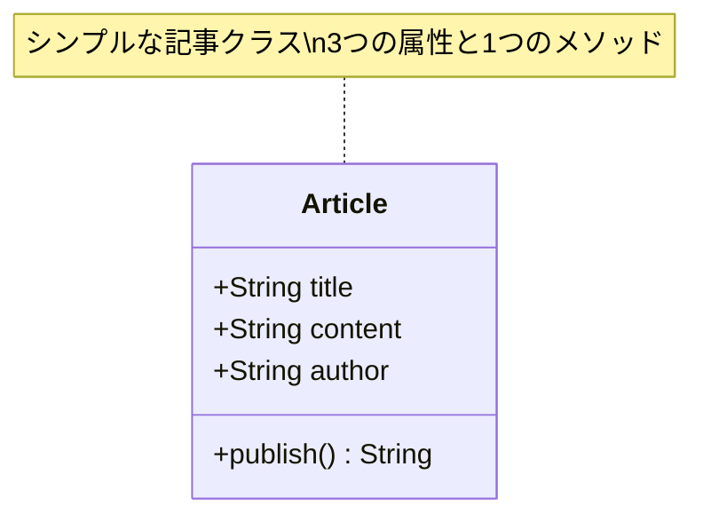
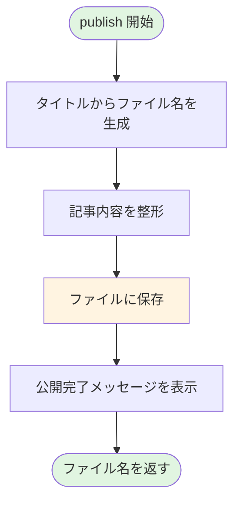

## はじめに

こんにちは！今回から、「自然に覚えるデザインパターン（Facade）」という連載をスタートします。この連載では、実用的なブログシステムを作りながら、**Facadeパターン**というデザインパターンを自然に学んでいきます。

デザインパターンと聞くと難しく感じるかもしれませんが、心配ありません。実際に手を動かしてコードを書きながら、「あれ、これって自然とパターンになってる！」という体験を目指します。

### この連載について

この連載では、ブログ記事の公開システムを題材に、段階的に機能を追加していきます。最初はシンプルな実装から始めて、機能が増えるにつれて複雑になっていく様子を体験し、最終的にFacadeパターンでその複雑さを整理する流れになっています。

**Facadeパターン**とは、複雑なサブシステムを隠蔽して、クライアントに対してシンプルなインターフェースを提供するデザインパターンです。でも今はまだ、この説明がピンとこなくても大丈夫。連載を進めるうちに、自然と理解できるようになります。

### 連載の流れ（全8回）

この連載は全8回の予定です：

- **第1回（今回）**: ブログ記事を公開する - シンプルな実装から始める
- **第2回**: バリデーションを追加する - 入力チェックで安全性向上
- **第3回**: 画像を自動リサイズする - 画像処理の統合
- **第4回**: メール通知を送る - 公開通知システム
- **第5回**: publish()が複雑すぎる！ - 問題の整理と設計方針
- **第6回**: Facadeパターンで解決する - PublishFacadeクラスの実装
- **第7回**: テストしやすくなった！ - モック化とテスト戦略
- **第8回**: 機能拡張が簡単に - 下書き保存機能の追加

第1回から第4回で段階的に機能を追加し、第5回で「あれ、なんだか複雑になってきたぞ？」と問題を認識します。そして第6回でFacadeパターンを導入して問題を解決し、第7回・第8回でその効果を実感する流れです。

### 対象読者と前提知識

この連載は、以下のような方を対象としています：

- **Perl入学式を卒業したレベル**の方
- **「Mooで覚えるオブジェクト指向プログラミング」シリーズを読了**した方
- **デザインパターンに興味がある**が、何から始めればいいか分からない方

前提知識として、以下の内容を理解していることを想定しています：

- Mooの基本（`has`、メソッド定義）
- オブジェクト指向の基礎（クラス、インスタンス、属性、メソッド）
- Perlの基本文法（変数、制御構文、リファレンス）

まだ「Mooで覚えるオブジェクト指向プログラミング」を読んでいない方は、先にそちらを読むことをお勧めします。



## なぜブログシステムを作るのか？

### 実用的なコードで学ぶ意義

デザインパターンの学習では、「銀行口座」や「図形描画」といった教科書的な例がよく使われます。しかし、実際の開発現場では、もっと複雑で実用的な問題に直面します。

そこでこの連載では、**ブログシステム**という実用的な題材を選びました。ブログシステムは：

- **多くの人が使ったことがある**（理解しやすい）
- **機能が段階的に増やせる**（学習に最適）
- **実際のWebアプリケーション開発に近い**（実務に活かせる）

という特徴があります。

### Facadeパターンとの出会い方

この連載では、最初から「Facadeパターンを使いましょう！」とは言いません。まずは知っている知識で動くプログラムを作り、機能を追加していく中で自然と問題に気づき、その解決策としてFacadeパターンに出会う——そんな流れを大切にしています。

これは、実際の開発現場でデザインパターンに出会う過程と同じです。「困った！どうしよう？」という問題があって初めて、パターンの価値が実感できるのです。

## 今回作るもの：記事公開の基本機能

### 要件定義

第1回では、ブログ記事を公開する最も基本的な機能を実装します。具体的には：

- **記事のタイトル、本文、著者を持つ**
- **記事を公開する**（ファイルとして保存する）

たったこれだけです。シンプルですよね？でも、このシンプルな実装が後々の機能追加の土台になります。

### シンプルな設計から始める理由

プログラミングでは、「最初から完璧な設計を目指す」よりも、**「動くものを作ってから改善する」**方が効果的です。これを**反復的開発**と呼びます。

Facadeパターンも、最初から必要なわけではありません。機能が増えて複雑になってきた時に初めて、その価値が発揮されます。だからこそ、まずはシンプルに始めましょう。

## Articleクラスを定義する

### Mooで記事クラスを作る

まずは、ブログ記事を表す`Article`クラスを作ります。Mooを使って、以下の属性を持つクラスを定義しましょう：

- `title`（タイトル）
- `content`（本文）
- `author`（著者）

### Articleクラスの構造

最初はシンプルな構造から始めます。以下の図は、`Article`クラスの基本的な構造を示しています：



### 属性の定義（title, content, author）

属性は`has`キーワードで定義します。すべて読み書き可能（`is => 'rw'`）とし、インスタンス生成時に必須（`required => 1`）とします。

### コード例1：Articleクラスの実装

```perl
# Article.pm
# Perl: v5.26以上推奨
# 外部依存: Moo
package Article;

use strict;
use warnings;
use utf8;
use Moo;

# 記事のタイトル
has title => (
    is       => 'rw',       # 読み書き可能
    required => 1,          # 必須属性
);

# 記事の本文
has content => (
    is       => 'rw',
    required => 1,
);

# 記事の著者
has author => (
    is       => 'rw',
    required => 1,
);

1;
```

このクラスは、Mooシリーズで学んだ基本的な属性定義そのままです。特別なことは何もしていません。3つの属性を持つだけのシンプルなクラスです。

## publish()メソッドを実装する

### 記事を公開する処理

次に、記事を「公開」する機能を実装します。今回は、記事の内容をファイルとして保存することで、公開を実現します。

以下のフローチャートは、`publish()`メソッドの処理の流れを示しています：



### ファイルへの保存（Path::Tinyを使用）

ファイル操作には、Perlでよく使われる`Path::Tiny`モジュールを使います。このモジュールは、ファイルやディレクトリの操作をシンプルに書けるようにしてくれます。

`Path::Tiny`の`path`関数でファイルパスを指定し、`spew_utf8`メソッドでUTF-8エンコーディングでファイルに書き込みます。

### コード例2：publish()メソッドのシンプルな実装

```perl
# Article.pm（続き）
# Perl: v5.26以上推奨
# 外部依存: Moo, Path::Tiny
use Path::Tiny;

# 記事を公開する（ファイルに保存）
sub publish {
    my ($self) = @_;
    
    # ファイル名をタイトルから生成（スペースをハイフンに置換）
    my $filename = $self->title;
    $filename =~ s/\s+/-/g;                    # スペースをハイフンに
    $filename = lc $filename;                  # 小文字に変換
    $filename = "articles/${filename}.txt";    # パスを追加
    
    # 記事の内容を整形
    my $output = sprintf(
        "Title: %s\nAuthor: %s\n\n%s\n",
        $self->title,
        $self->author,
        $self->content
    );
    
    # ファイルに保存
    path($filename)->spew_utf8($output);
    
    print "記事「", $self->title, "」を公開しました: $filename\n";
    
    return $filename;
}
```

`publish()`メソッドは、以下の処理を行います：

1. タイトルからファイル名を生成（スペースをハイフンに置換、小文字化）
2. 記事の内容を整形（タイトル、著者、本文をフォーマット）
3. `Path::Tiny`の`spew_utf8`でファイルに保存
4. 公開完了メッセージを表示
5. 保存したファイル名を返す

シンプルですが、これで記事を公開する基本機能が完成です！

## 動かしてみよう

### 実行例とその結果

実際に`Article`クラスを使ってみましょう。以下のようなスクリプトを作成します：

```perl
#!/usr/bin/env perl
# test_article.pl
use strict;
use warnings;
use utf8;
use lib './lib';
use Article;

# articlesディレクトリを作成（存在しない場合）
use Path::Tiny;
path('articles')->mkpath;

# 記事オブジェクトを作成
my $article = Article->new(
    title   => 'はじめてのPerl',
    content => 'Perlは楽しいプログラミング言語です。オブジェクト指向も簡単に書けます！',
    author  => 'perl_lover',
);

# 記事を公開
my $filename = $article->publish();

# 結果を確認
print "保存されたファイル: $filename\n";
```

このスクリプトを実行すると、以下のように表示されます：

```
記事「はじめてのPerl」を公開しました: articles/はじめてのperl.txt
保存されたファイル: articles/はじめてのperl.txt
```

そして、`articles/はじめてのperl.txt`というファイルが作成され、中身は以下のようになります：

```
Title: はじめてのPerl
Author: perl_lover

Perlは楽しいプログラミング言語です。オブジェクト指向も簡単に書けます！
```

### 現時点での設計の良い点

この実装には、いくつかの良い点があります：

- **シンプルで理解しやすい**: クラス定義もメソッドも短く、一目で何をしているか分かる
- **動く**: 実際に記事を保存できる実用的なコード
- **拡張の余地がある**: 後から機能を追加しやすい土台になっている

しかし、この設計には今後の課題も隠れています。それは次回以降、機能を追加していく中で見えてきます。

## 次回予告：バリデーションを追加する

### なぜバリデーションが必要か

今回の実装では、記事のタイトルや本文に何が入っていても、そのまま保存してしまいます。例えば：

- タイトルが空文字列でも保存される
- 本文が空でも保存される
- 著者名がなくても（空でも）保存される

これでは、意図しないデータが保存されてしまい、後で困ることになります。

### 徐々に機能を追加していく方針

次回（第2回）では、**バリデーション機能**を追加します。記事を公開する前に、タイトルや本文が適切かどうかをチェックする機能です。

新しく`Article::Validator`クラスを作成し、`publish()`メソッドの中で呼び出すようにします。このように、段階的に機能を追加していくことで、プログラムがどのように成長（そして複雑化）していくのかを体験できます。

第2回もお楽しみに！

## まとめ

### 今回学んだこと

第1回では、以下のことを学びました：

- ブログ記事を表す`Article`クラスの作成
- Mooを使った基本的な属性定義（`title`、`content`、`author`）
- `publish()`メソッドによるファイル保存の実装
- `Path::Tiny`を使ったファイル操作

シンプルな実装でしたが、これが後々の機能追加の土台になります。

### 次回への準備

次回は、バリデーション機能を追加します。今回のコードを手元で動かして、どんな問題が起こりうるか想像してみてください。例えば：

- タイトルが空文字列だったら？
- 本文が空だったら？
- ファイル名に使えない文字が含まれていたら？

こうした問題を解決するのが、次回の内容です。

それでは、第2回でお会いしましょう！

---

**連載リンク**:
- 第1回（今回）：ブログ記事を公開しよう - シンプルな実装から始める
- 第2回：バリデーションを追加する（準備中）

**関連記事**:

