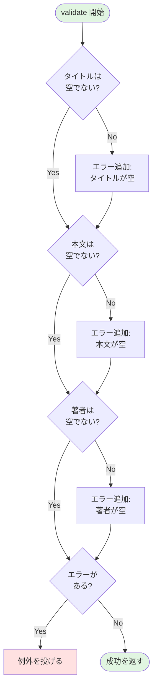
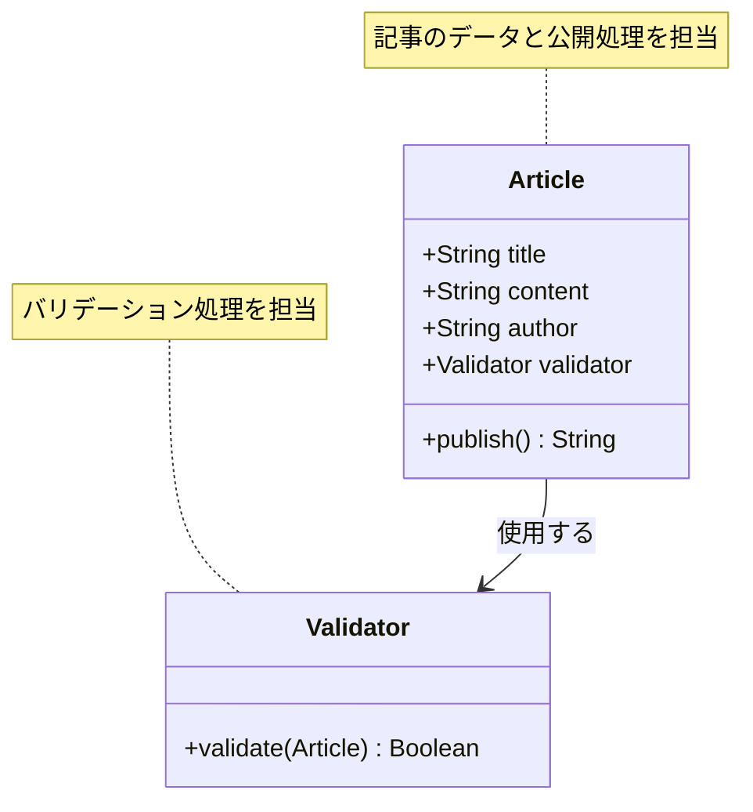

## はじめに

こんにちは！「自然に覚えるデザインパターン（Facade）」連載の第2回です。

前回は、ブログ記事を公開する基本的な`Article`クラスを作成しました。`title`、`content`、`author`の3つの属性を持ち、`publish()`メソッドでファイルに保存するシンプルな実装でしたね。

今回は、その実装に**バリデーション機能**を追加します。つまり、記事を公開する前に「このデータは本当に大丈夫？」とチェックする機能です。

### 前回の振り返り

前回作成した`Article`クラスの`publish()`メソッドは、渡されたデータをそのまま保存していました：

```perl
# 前回のpublish()メソッド（簡略版）
sub publish {
    my ($self) = @_;
    
    # タイトルからファイル名を生成
    my $filename = $self->title;
    $filename =~ s/\s+/-/g;
    # ... ファイルに保存
}
```

しかし、この実装には問題があります。**何もチェックせずに保存している**のです。

### 今回のゴール

第2回では、以下を実現します：

- タイトルが空でないかチェックする
- 本文が空でないかチェックする
- 著者名が空でないかチェックする
- チェックに失敗したらエラーを出す

まずは`publish()`メソッド内に直接バリデーション処理を書いてみて、その後、専用の`Article::Validator`クラスに分離します。

## なぜバリデーションが必要なのか？

### 空データの問題

前回の実装では、以下のような問題が発生する可能性があります：

```perl
# 問題のあるデータ例
my $bad_article = Article->new(
    title   => '',           # 空文字列！
    content => '',           # これも空！
    author  => 'someone',
);

$bad_article->publish();     # そのまま保存されてしまう
```

これでは、タイトルのない記事や内容のない記事が保存されてしまいます。ファイル名も正しく生成できず、後で困ることになります。

### 現実の開発でもよくある問題

Webアプリケーション開発では、ユーザーからの入力を受け取ることがほとんどです。そして、ユーザーは必ずしも正しいデータを入力してくれるとは限りません：

- フォームを空のまま送信する
- 不正な形式のデータを入力する
- スクリプトを含む危険な文字列を入力する

だからこそ、**バリデーション（検証）**が必要なのです。

## 最初の一歩：publish()内に直接書く

### シンプルな空チェック

まずは、`publish()`メソッドの中に、直接バリデーション処理を書いてみましょう。これが最もシンプルな方法です：

```perl
# Article.pm（バリデーション追加版）
# Perl: v5.26以上推奨
# 外部依存: Moo, Path::Tiny
sub publish {
    my ($self) = @_;
    
    # バリデーション：タイトルチェック
    if (!defined $self->title || $self->title eq '') {
        die "エラー: タイトルが空です\n";
    }
    
    # バリデーション：本文チェック
    if (!defined $self->content || $self->content eq '') {
        die "エラー: 本文が空です\n";
    }
    
    # バリデーション：著者チェック
    if (!defined $self->author || $self->author eq '') {
        die "エラー: 著者名が空です\n";
    }
    
    # ここから通常の公開処理
    my $filename = $self->title;
    $filename =~ s/\s+/-/g;
    $filename = lc $filename;
    $filename = "articles/${filename}.txt";
    
    my $output = sprintf(
        "Title: %s\nAuthor: %s\n\n%s\n",
        $self->title,
        $self->author,
        $self->content
    );
    
    path($filename)->spew_utf8($output);
    
    print "記事「", $self->title, "」を公開しました: $filename\n";
    
    return $filename;
}
```

これで、空のデータが来たときにエラーで止まるようになりました！

### この実装の問題点

しかし、この書き方には問題があります：

- **`publish()`メソッドが長くなった**: バリデーション処理が増えると、さらに長くなる
- **責任が混在している**: 「検証する」と「保存する」という2つの役割が1つのメソッドに入っている
- **再利用できない**: 他のメソッド（例えば`save_draft()`）でも同じバリデーションが必要になったとき、コピペすることになる

これが、**単一責任の原則**に反している状態です。1つのメソッドは1つのことだけをすべき、という原則ですね。

## Article::Validatorクラスを作る

### バリデーション処理を分離する

そこで、バリデーション処理を専用のクラスに分離します。`Article::Validator`というクラスを作りましょう。

以下の図は、バリデーションの処理フローを示しています：



### コード例1：Validatorクラスの定義

```perl
# Article/Validator.pm
# Perl: v5.26以上推奨
# 外部依存: Moo
package Article::Validator;

use strict;
use warnings;
use utf8;
use Moo;

# 記事オブジェクトを検証する
sub validate {
    my ($self, $article) = @_;
    
    my @errors;
    
    # タイトルの検証
    if (!defined $article->title || $article->title eq '') {
        push @errors, 'タイトルが空です';
    }
    
    # 本文の検証
    if (!defined $article->content || $article->content eq '') {
        push @errors, '本文が空です';
    }
    
    # 著者の検証
    if (!defined $article->author || $article->author eq '') {
        push @errors, '著者名が空です';
    }
    
    # エラーがあればdieで例外を投げる
    if (@errors) {
        die "バリデーションエラー:\n  - " . join("\n  - ", @errors) . "\n";
    }
    
    return 1;  # 検証成功
}

1;
```

このクラスのポイント：

- `validate()`メソッドは記事オブジェクトを受け取る
- すべてのエラーを配列`@errors`に集める
- エラーがあればまとめて例外を投げる
- 成功時は`1`（真）を返す

複数のエラーを一度に表示できるのが良いですね！

## Validatorを使ってpublish()を改善する

### クラス構成の変化

バリデーション機能を追加することで、クラスの関係は以下のように変わります：



### コード例2：validate()メソッドでチェック

`Article`クラスの`publish()`メソッドから、`Validator`を呼び出すように変更します：

```perl
# Article.pm（Validator使用版）
# Perl: v5.26以上推奨
# 外部依存: Moo, Path::Tiny, Article::Validator
package Article;

use strict;
use warnings;
use utf8;
use Moo;
use Path::Tiny;
use Article::Validator;

# 属性定義（前回と同じ）
has title => (
    is       => 'rw',
    required => 1,
);

has content => (
    is       => 'rw',
    required => 1,
);

has author => (
    is       => 'rw',
    required => 1,
);

# Validatorインスタンス（クラス全体で共有）
has validator => (
    is      => 'ro',
    default => sub { Article::Validator->new },
);

# 記事を公開する（バリデーション付き）
sub publish {
    my ($self) = @_;
    
    # バリデーション実行（エラーがあればdieする）
    $self->validator->validate($self);
    
    # ここから通常の公開処理（前回と同じ）
    my $filename = $self->title;
    $filename =~ s/\s+/-/g;
    $filename = lc $filename;
    $filename = "articles/${filename}.txt";
    
    my $output = sprintf(
        "Title: %s\nAuthor: %s\n\n%s\n",
        $self->title,
        $self->author,
        $self->content
    );
    
    path($filename)->spew_utf8($output);
    
    print "記事「", $self->title, "」を公開しました: $filename\n";
    
    return $filename;
}

1;
```

`publish()`メソッドがスッキリしました！バリデーション処理は`validator->validate($self)`の1行だけです。

### この設計の利点

この分離により、以下のメリットが生まれます：

- **責任の明確化**: `Article`は記事のデータと公開処理、`Validator`は検証処理と、それぞれの役割が明確
- **再利用性**: 他のメソッド（例えば将来追加する`save_draft()`）でも同じ`Validator`を使える
- **テストしやすい**: `Validator`クラスを単独でテストできる
- **拡張しやすい**: バリデーションルールを追加するときは、`Validator`だけを変更すればよい

## 動かしてみよう

### 正常なケース

正しいデータで記事を公開してみます：

```perl
#!/usr/bin/env perl
# test_validation.pl
use strict;
use warnings;
use utf8;
use lib './lib';
use Article;
use Path::Tiny;

path('articles')->mkpath;

# 正常なデータ
my $good_article = Article->new(
    title   => 'バリデーションの重要性',
    content => 'データの検証は、安全なアプリケーション開発に欠かせません。',
    author  => 'perl_learner',
);

eval {
    $good_article->publish();
};

if ($@) {
    print "エラーが発生しました: $@";
} else {
    print "公開に成功しました！\n";
}
```

実行結果：

```
記事「バリデーションの重要性」を公開しました: articles/バリデーションの重要性.txt
公開に成功しました！
```

### エラーケース

空のデータで試してみます：

```perl
# 問題のあるデータ
my $bad_article = Article->new(
    title   => '',
    content => '',
    author  => 'someone',
);

eval {
    $bad_article->publish();
};

if ($@) {
    print "エラーが発生しました:\n$@";
}
```

実行結果：

```
エラーが発生しました:
バリデーションエラー:
  - タイトルが空です
  - 本文が空です
```

複数のエラーがまとめて表示されるので、ユーザーにとって親切ですね！

## 次回予告：画像を自動リサイズする

### 機能がさらに増えていく

次回（第3回）では、**画像処理機能**を追加します。記事に含まれる画像を自動でリサイズする`Article::ImageProcessor`クラスを作成し、`publish()`メソッドから呼び出すようにします。

すると、`publish()`メソッドは以下のようになります：

```perl
sub publish {
    my ($self) = @_;
    
    # バリデーション
    $self->validator->validate($self);
    
    # 画像処理（次回追加）
    $self->image_processor->resize_images($self);
    
    # ファイル保存
    # ...
}
```

少しずつ処理が増えてきますね。このまま機能を追加していくと、`publish()`メソッドはどうなるのでしょうか？それは連載を進めていく中で見えてきます。

### 徐々に複雑化していく様子を体験する

この連載では、意図的に「機能を追加しながら複雑化していく過程」を体験してもらっています。最初はシンプルだったコードが、機能追加とともにどんどん膨らんでいく——それが現実の開発です。

そして、そんな複雑さをどう整理するか？その答えが、Facadeパターンです。でも、それは第6回までのお楽しみ。まずは機能を追加していきましょう！

## まとめ

### 今回学んだこと

第2回では、以下のことを学びました：

- バリデーションの必要性（空データの問題）
- 最初は`publish()`メソッド内に直接書く方法
- `Article::Validator`クラスへの分離
- 単一責任の原則に基づいた設計の改善
- エラーメッセージをまとめて表示する工夫

### 設計の改善点

今回の変更で、コードの品質が向上しました：

- **責任の分離**: 検証と保存が別々のクラスに
- **再利用性**: `Validator`は他の場所でも使える
- **テスト容易性**: `Validator`を単独でテストできる

しかし、`publish()`メソッドに処理が増えてきているのも事実です。次回以降、この傾向はさらに顕著になります。

### 次回への準備

次回は画像処理機能を追加します。今のうちに、以下のことを考えてみてください：

- `publish()`メソッドに処理が増え続けたらどうなる？
- 新しい機能を追加するたびに`publish()`を変更するのは良い設計？
- テストを書くとしたら、どこまでテストすればいい？

これらの疑問が、Facadeパターンへの理解につながります。

それでは、第3回でお会いしましょう！

---

**連載リンク**:
- 第1回：[Facadeパターン入門：ブログ記事を公開しよう](/content/post/facade-series-01.md)
- 第2回（今回）：バリデーションを追加する
- 第3回：画像を自動リサイズする（準備中）

**関連記事**:

