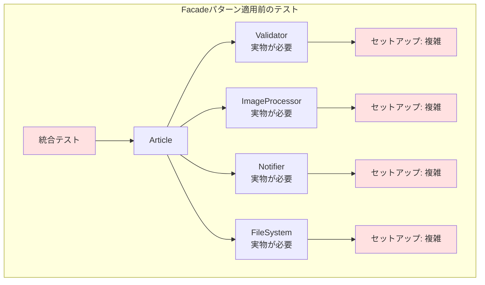
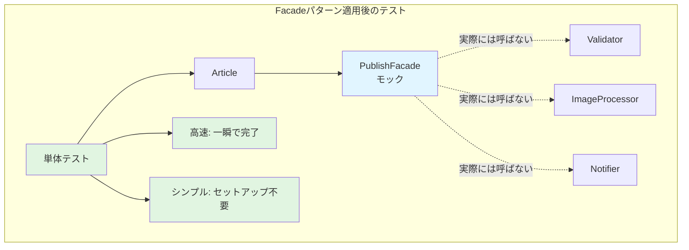
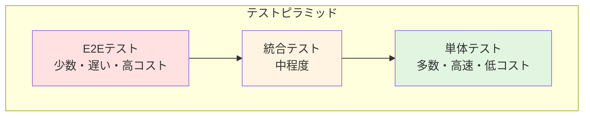
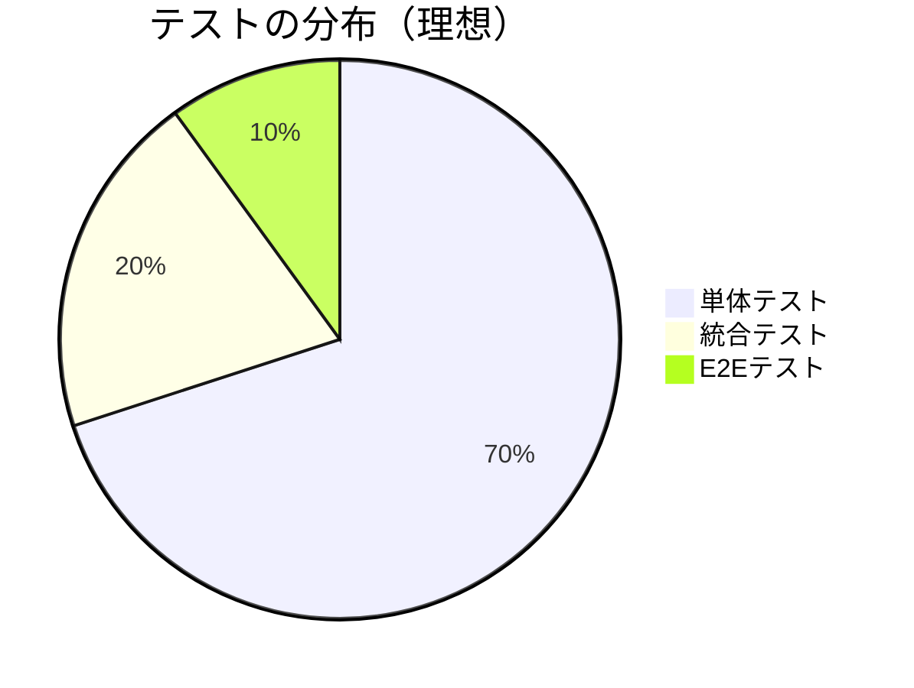

## はじめに

こんにちは！「自然に覚えるデザインパターン（Facade）」連載の第7回です。

前回は、`Article::PublishFacade`クラスを作成して、複雑な公開処理を統一インターフェースに集約しました。これにより、`publish()`メソッドがたった3行になりましたね。

今回は、Facadeパターンのもう1つの大きなメリット、**テスト容易性**にフォーカスします。Facadeを使うと、どれだけテストが書きやすくなるのか、実際のコード例で見ていきましょう！

### 前回の振り返り

前回、`Article::PublishFacade`を導入して、`publish()`メソッドをシンプルにしました：

```perl
# リファクタリング後のpublish()メソッド
sub publish {
    my ($self) = @_;
    
    return $self->publish_facade->execute($self);
}
```

このシンプルさが、テストにも大きな影響を与えます。

### 今回のゴール

第7回では、以下を実現します：

- Facadeパターン適用前のテストの問題点を認識する
- `PublishFacade`をモック化する方法を学ぶ
- `Article`クラスの単体テストを書く
- `PublishFacade`クラスの単体テストを書く
- 単体テストと統合テストの使い分けを理解する

## Facadeパターン適用前のテスト

### Before: 統合テストしか書けない

Facadeパターンを適用する前の`publish()`メソッドをテストするには、すべてのサブシステムを準備する必要がありました：

以下の図は、テスト時の依存関係を示しています：



```perl
# Facadeパターン適用前のテスト（統合テストになってしまう）
use strict;
use warnings;
use Test::More;
use lib './lib';
use Article;
use Path::Tiny;

# すべてのサブシステムを準備する必要がある！
# - Validator（バリデーション）
# - ImageProcessor（画像処理環境）
# - Notifier（メールサーバー設定）
# - ファイルシステム

# テスト用ディレクトリ
my $test_dir = Path::Tiny->tempdir;
chdir $test_dir;
$test_dir->child('articles')->mkpath;

# 記事を作成
my $article = Article->new(
    title   => 'テスト記事',
    content => 'これはテストです',
    author  => 'tester',
);

# テスト実行
my $filename = $article->publish();
ok -f $filename, 'ファイルが作成された';

# ここまで来るのに、たくさんのセットアップが必要...
done_testing;
```

このテストの問題点：

- **セットアップが大変**: メールサーバー、画像処理環境などを準備
- **テスト実行が遅い**: 実際にファイルを作ったり、画像処理をしたり
- **テスト対象が不明確**: 何をテストしているのか分かりにくい
- **失敗原因の特定が困難**: どのサブシステムで失敗したのか分からない

これは**統合テスト**です。統合テストも重要ですが、単体テストがないのは問題です。

## コード例1：PublishFacadeのモック

### Test::MockObjectを使う

Facadeパターン適用後は、`PublishFacade`をモックに差し替えることで、単体テストが書けるようになります。

以下の図は、モックを使ったテスト構造を示しています：



Perlでは、`Test::MockObject`モジュールを使ってモックオブジェクトを作ります：

```perl
# test_article_with_mock.t
# Perl: v5.26以上推奨
# 外部依存: Test::More, Test::MockObject, Article
use strict;
use warnings;
use Test::More;
use Test::MockObject;
use lib './lib';
use Article;

# PublishFacadeのモックを作成
my $mock_facade = Test::MockObject->new;

# execute()メソッドをモック化
# 実際には何もせず、ファイル名を返すだけ
$mock_facade->mock('execute', sub {
    my ($self, $article) = @_;
    
    # モック内でテスト用のログを出力
    note "モック: execute()が呼ばれました";
    note "  タイトル: ", $article->title;
    note "  著者: ", $article->author;
    
    # ファイル名を生成して返す（実際の処理はしない）
    my $filename = lc $article->title;
    $filename =~ s/\s+/-/g;
    return "articles/${filename}.txt";
});

# テスト対象の記事オブジェクトを作成
# publish_facadeにモックを注入
my $article = Article->new(
    title          => 'モックでテスト',
    content        => 'Facadeをモック化すると単体テストが書ける！',
    author         => 'test_user',
    publish_facade => $mock_facade,
);

# テスト実行
my $filename = $article->publish();

# アサーション
is $filename, 'articles/モックでテスト.txt', '期待通りのファイル名が返される';
ok $mock_facade->called('execute'), 'execute()メソッドが呼ばれた';

# execute()の引数を検証
my ($name, $args) = $mock_facade->next_call;
is $name, 'execute', 'メソッド名が正しい';
isa_ok $args->[1], 'Article', '引数が記事オブジェクト';

done_testing;
```

このテストの素晴らしい点：

- **高速**: 実際のファイル保存やメール送信をしないので一瞬で終わる
- **簡潔**: セットアップがほとんど不要
- **明確**: `publish()`メソッドの振る舞いだけをテストしている
- **安定**: 外部依存がないので、常に成功する

### モックの動作確認

上記のテストを実行すると、以下のような出力が得られます：

```
# モック: execute()が呼ばれました
#   タイトル: モックでテスト
#   著者: test_user
ok 1 - 期待通りのファイル名が返される
ok 2 - execute()メソッドが呼ばれた
ok 3 - メソッド名が正しい
ok 4 - 引数が記事オブジェクト
1..4
```

すべてのテストが一瞬で通ります！

## コード例2：テストコードの例

### PublishFacade自体のテスト

次に、`PublishFacade`クラス自体をテストしてみましょう。ここでは、各サブシステムをモック化します：

```perl
# test_publish_facade.t
# Perl: v5.26以上推奨
# 外部依存: Test::More, Test::MockObject, Article::PublishFacade, Article
use strict;
use warnings;
use Test::More;
use Test::MockObject;
use lib './lib';
use Article::PublishFacade;
use Article;

# サブシステムのモックを作成
my $mock_validator = Test::MockObject->new;
$mock_validator->mock('validate', sub {
    note "モック: Validatorのvalidate()が呼ばれました";
    return 1;  # 常に成功
});

my $mock_image_processor = Test::MockObject->new;
$mock_image_processor->mock('resize_images', sub {
    note "モック: ImageProcessorのresize_images()が呼ばれました";
    return [];  # 空の配列を返す
});

my $mock_notifier = Test::MockObject->new;
$mock_notifier->mock('send_notification', sub {
    note "モック: Notifierのsend_notification()が呼ばれました";
    return 1;  # 常に成功
});

# PublishFacadeを作成（モックを注入）
my $facade = Article::PublishFacade->new(
    validator       => $mock_validator,
    image_processor => $mock_image_processor,
    notifier        => $mock_notifier,
);

# テスト用の記事オブジェクト
use Path::Tiny;
my $test_dir = Path::Tiny->tempdir;
chdir $test_dir;
$test_dir->child('articles')->mkpath;

my $article = Article->new(
    title   => 'Facadeのテスト',
    content => 'PublishFacadeをテストしています',
    author  => 'facade_tester',
    images  => [],
);

# execute()メソッドをテスト
my $filename;
eval {
    $filename = $facade->execute($article);
};

# アサーション
is $@, '', '例外が発生しない';
like $filename, qr/articles\/facadeのテスト\.txt/, '正しいファイル名が返される';
ok -f $filename, 'ファイルが作成された';

# 各サブシステムのメソッドが呼ばれたことを確認
ok $mock_validator->called('validate'), 'Validatorが呼ばれた';
ok $mock_image_processor->called('resize_images'), 'ImageProcessorが呼ばれた';
ok $mock_notifier->called('send_notification'), 'Notifierが呼ばれた';

# 呼び出し順序の確認
my @calls;
push @calls, ($mock_validator->next_call)[0];
push @calls, ($mock_image_processor->next_call)[0];
push @calls, ($mock_notifier->next_call)[0];

is_deeply \@calls, ['validate', 'resize_images', 'send_notification'],
    '正しい順序で呼び出された';

done_testing;
```

このテストでは：

- **各サブシステムをモック化**: 実際のバリデーションや画像処理をしない
- **呼び出しを検証**: 各メソッドが呼ばれたことを確認
- **順序を検証**: 正しい順序で呼ばれたことを確認
- **ファイル保存だけ本物**: テンポラリディレクトリに実際に保存

これにより、`PublishFacade`の振る舞いを正確にテストできます。

## テスト戦略：単体テストと統合テスト

### テストのピラミッド

良いテスト戦略は、**テストピラミッド**の形になります：



テストの理想的な構成：



- **単体テスト（多数）**: 個々のクラス・メソッドをテスト（モックを使用）
- **統合テスト（中程度）**: 複数のクラスが連携する部分をテスト
- **E2Eテスト（少数）**: システム全体の動作をテスト

### 本シリーズのテスト戦略

Facadeパターンを使った場合の理想的なテスト戦略：

#### 1. 単体テスト（最も多い）

```perl
# Articleの単体テスト
# - PublishFacadeをモック化
# - publish()メソッドの振る舞いを検証

# PublishFacadeの単体テスト
# - 各サブシステムをモック化
# - execute()の処理フローを検証

# Validatorの単体テスト
# - モックなし（依存がないため）
# - 各バリデーションルールを検証

# ImageProcessorの単体テスト
# - テスト用の小さな画像を使用
# - リサイズ処理を検証

# Notifierの単体テスト
# - メール送信をモック化
# - メッセージ生成ロジックを検証
```

#### 2. 統合テスト（中程度）

```perl
# PublishFacade + 各サブシステム
# - モックを使わず、本物のサブシステムを使用
# - ただし、メール送信はモック（外部への影響を避ける）
# - テンポラリディレクトリを使用
```

#### 3. E2Eテスト（少数）

```perl
# Article + PublishFacade + すべてのサブシステム
# - 実際に記事を公開する一連の流れを検証
# - 本番環境に近い設定でテスト
```

### なぜこの戦略が良いのか？

- **単体テストが高速**: モックを使うので一瞬で終わる。開発中に何度も実行できる
- **問題の早期発見**: どのクラスで問題があるか、すぐに特定できる
- **リファクタリングが安全**: 単体テストがあるので、自信を持って変更できる
- **統合テストで総合確認**: サブシステム間の連携を確認
- **E2Eテストで最終確認**: 本番に近い環境で動作を保証

## Facadeパターンとテストの相性

### なぜFacadeパターンがテストに有効か？

Facadeパターンがテスト容易性を向上させる理由：

1. **依存性の注入が容易**: Facadeを差し替えるだけで済む
2. **テスト範囲の明確化**: どこまでをテストするか決めやすい
3. **モックの作成が簡単**: Facadeの`execute()`メソッド1つをモックすればいい
4. **テストの独立性**: 各サブシステムを個別にテストできる

### Before/Afterの比較

**Before（Facadeパターンなし）**:
- `Article`の`publish()`をテスト → すべてのサブシステムが必要 → 統合テストになる
- 単体テストが書けない

**After（Facadeパターンあり）**:
- `Article`の`publish()`をテスト → `PublishFacade`をモック → 単体テスト！
- `PublishFacade`の`execute()`をテスト → 各サブシステムをモック → 単体テスト！
- すべてを本物で動かす → 統合テスト

テストの選択肢が増えました！

## 次回予告：下書き保存機能を追加

### Facadeの拡張性を体験する

次回（第8回、最終回）では、新しい機能を追加します。**下書き保存機能**です。

Facadeパターンのおかげで、この機能追加が驚くほど簡単になります。既存のコードへの影響を最小限に抑えながら、新機能を追加できるのです。

### 連載のまとめも

最終回では、この連載全体を振り返り、Facadeパターンから学んだことをまとめます：

- Facadeパターンの真の価値とは？
- いつFacadeパターンを使うべきか？
- 他のデザインパターンとの関係は？

それでは、第8回でお会いしましょう！

## まとめ

### 今回学んだこと

第7回では、以下のことを学びました：

- **Facadeパターン適用前のテストの問題点**（統合テストしか書けない）
- **Test::MockObjectを使ったモック化**
- **Articleクラスの単体テスト**（PublishFacadeをモック）
- **PublishFacadeクラスの単体テスト**（各サブシステムをモック）
- **テストピラミッド戦略**（単体テスト多、統合テスト中、E2Eテスト少）

### テスト容易性の向上

Facadeパターンを導入したことで：

- **単体テストが書ける**: モックを使った高速なテスト
- **テスト範囲が明確**: 何をテストするか決めやすい
- **失敗原因の特定が容易**: どのクラスで問題があるか分かる
- **開発速度の向上**: テストが高速なので、頻繁に実行できる

### テストは品質保証の要

良いテストがあれば：

- **自信を持ってリファクタリングできる**
- **バグを早期に発見できる**
- **ドキュメントとしても機能する**（テストコードを見れば使い方が分かる）
- **チーム開発がスムーズになる**（他の人が変更しても、テストで検証できる）

Facadeパターンは、こうしたテスト戦略を実現するための強力な武器です。

### 次回への準備

次回は連載最終回、新機能追加です。今のうちに、以下のことを考えてみてください：

- 下書き保存機能は、公開機能とどう違う？（バリデーションは？通知は？）
- この機能を追加するとき、どのクラスを変更する必要がある？
- Facadeパターンがあると、機能追加はどう簡単になる？

これらの疑問が、次回の理解を深めます。

---

**連載リンク**:
- 第1回：[Facadeパターン入門：ブログ記事を公開しよう](/content/post/facade-series-01.md)
- 第2回：[バリデーションを追加する](/content/post/facade-series-02.md)
- 第3回：[画像を自動リサイズする](/content/post/facade-series-03.md)
- 第4回：[メール通知を送る](/content/post/facade-series-04.md)
- 第5回：[publish()が複雑すぎる！](/content/post/facade-series-05.md)
- 第6回：[Facadeパターンで解決する](/content/post/facade-series-06.md)
- 第7回（今回）：テストしやすくなった！
- 第8回：下書き保存機能を追加（準備中）

**関連記事**:


