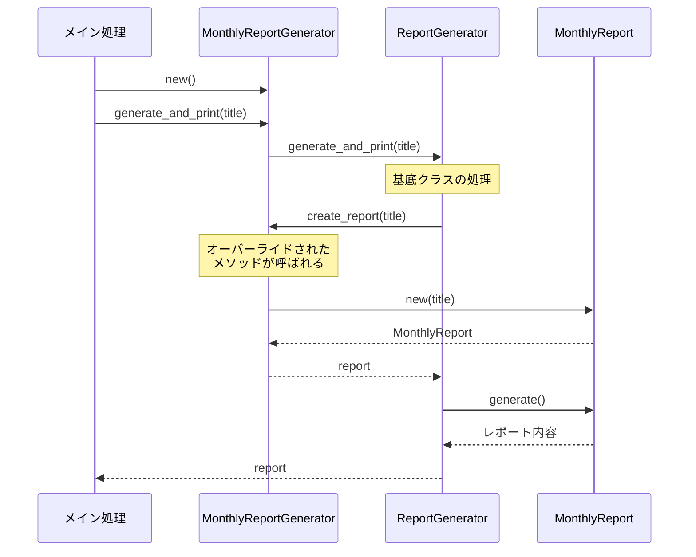

[@nqounet](https://x.com/nqounet)です。

## 前回の振り返り

前回は、継承を使ってジェネレーターを種別ごとに分けました。

- `ReportGenerator`を基底クラスとして整理した
- `MonthlyReportGenerator`と`WeeklyReportGenerator`を作成した
- if/elseが不要になった



## 今回の目標

今回は、`create_report`メソッドのオーバーライドについて詳しく解説します。

具体的には、以下のことを行います。

- オーバーライドの仕組みを理解する
- 新しく`DailyReportGenerator`を追加する
- 拡張が既存コードに影響しないことを確認する

## ストーリー設定

上司から「日次レポートも欲しい」と依頼されました。

前回の設計がうまくいっていれば、既存のコードを修正せずに新しいジェネレーターを追加できるはずです。

試してみましょう。

## 実装

### コード例1: オーバーライドの仕組み

まず、オーバーライドがどのように動作するかを確認します。

```perl
#!/usr/bin/env perl
use v5.36;

# ========================================
# ReportRole ロール
# ========================================
package ReportRole {
    use Moo::Role;

    requires 'generate';
    requires 'get_period';
}

# ========================================
# MonthlyReport クラス
# ========================================
package MonthlyReport {
    use Moo;
    with 'ReportRole';

    has title => (
        is       => 'ro',
        required => 1,
    );

    sub generate ($self) {
        say "=== " . $self->title . " ===";
        say "期間: " . $self->get_period();
        say "月次レポートを生成しました。";
    }

    sub get_period ($self) {
        return '月次';
    }
}

# ========================================
# WeeklyReport クラス
# ========================================
package WeeklyReport {
    use Moo;
    with 'ReportRole';

    has title => (
        is       => 'ro',
        required => 1,
    );

    sub generate ($self) {
        say "=== " . $self->title . " ===";
        say "期間: " . $self->get_period();
        say "週次レポートを生成しました。";
    }

    sub get_period ($self) {
        return '週次';
    }
}

# ========================================
# DailyReport クラス（新規追加）
# ========================================
package DailyReport {
    use Moo;
    with 'ReportRole';

    has title => (
        is       => 'ro',
        required => 1,
    );

    sub generate ($self) {
        say "=== " . $self->title . " ===";
        say "期間: " . $self->get_period();
        say "日次レポートを生成しました。";
    }

    sub get_period ($self) {
        return '日次';
    }
}

# ========================================
# ReportGenerator 基底クラス
# ========================================
package ReportGenerator {
    use Moo;

    # サブクラスでオーバーライドするメソッド
    sub create_report ($self, $title) {
        die "create_report() must be implemented by subclass";
    }

    # 共通の処理
    sub generate_and_print ($self, $title) {
        my $report = $self->create_report($title);
        $report->generate();
        return $report;
    }
}

# ========================================
# MonthlyReportGenerator クラス
# ========================================
package MonthlyReportGenerator {
    use Moo;
    extends 'ReportGenerator';

    # create_report をオーバーライド
    sub create_report ($self, $title) {
        return MonthlyReport->new(title => $title);
    }
}

# ========================================
# WeeklyReportGenerator クラス
# ========================================
package WeeklyReportGenerator {
    use Moo;
    extends 'ReportGenerator';

    # create_report をオーバーライド
    sub create_report ($self, $title) {
        return WeeklyReport->new(title => $title);
    }
}

# ========================================
# DailyReportGenerator クラス（新規追加）
# ========================================
package DailyReportGenerator {
    use Moo;
    extends 'ReportGenerator';

    # create_report をオーバーライド
    sub create_report ($self, $title) {
        return DailyReport->new(title => $title);
    }
}

# ========================================
# メイン処理
# ========================================
package main;

say "--- 月次レポート ---";
my $monthly = MonthlyReportGenerator->new();
$monthly->generate_and_print("2026年1月 売上レポート");

say "";

say "--- 週次レポート ---";
my $weekly = WeeklyReportGenerator->new();
$weekly->generate_and_print("2026年1月第1週 売上レポート");

say "";

say "--- 日次レポート ---";
my $daily = DailyReportGenerator->new();
$daily->generate_and_print("2026年1月9日 売上レポート");
```

オーバーライドについて詳しくは、以下の記事をご覧ください。



### コード例2: 実行結果の確認

実行結果は以下のようになります。

```
--- 月次レポート ---
=== 2026年1月 売上レポート ===
期間: 月次
月次レポートを生成しました。

--- 週次レポート ---
=== 2026年1月第1週 売上レポート ===
期間: 週次
週次レポートを生成しました。

--- 日次レポート ---
=== 2026年1月9日 売上レポート ===
期間: 日次
日次レポートを生成しました。
```

日次レポートが追加されました！

## オーバーライドのポイント

この設計のポイントは以下の通りです。



この図は、`generate_and_print`を呼び出したときの処理の流れを示しています。基底クラスの`generate_and_print`内で`create_report`が呼ばれると、オーバーライドされたサブクラスのメソッドが実行されます。

**基底クラス（ReportGenerator）**

- `create_report`メソッドは「サブクラスで実装してね」という宣言
- `generate_and_print`メソッドは共通の処理を提供
- 基底クラスは「具体的なレポートクラス」を知らない

**サブクラス（MonthlyReportGenerator等）**

- `create_report`をオーバーライドして、具体的なレポートを返す
- 各サブクラスは自分が担当するレポートだけを知っている
- `generate_and_print`は継承したものをそのまま使う

## 拡張性の確認

今回、`DailyReportGenerator`を追加しましたが、以下のファイル/クラスは**一切修正していません**。

- `ReportGenerator`基底クラス
- `MonthlyReportGenerator`クラス
- `WeeklyReportGenerator`クラス
- 既存のレポートクラス

新しい機能を追加するときに、既存のコードを修正する必要がない。これが「開放閉鎖原則」に従った設計です。

## 今回のまとめ

今回は、`create_report`メソッドのオーバーライドについて詳しく解説しました。

- 基底クラスでメソッドの「枠組み」を定義する
- サブクラスでメソッドをオーバーライドして「具体的な処理」を実装する
- 新しい種別を追加しても既存コードを修正しなくてよい

`create_report`メソッドは、各ジェネレーターが「どのレポートを作るか」を決定する重要なメソッドです。

この「生成を担当するメソッド」のことを、デザインパターンの世界では特別な名前で呼びますが、それは後のお楽しみです。

## 次回予告

次回は「基底クラスで共通処理をまとめよう」として、基底クラスに共通の処理を集約する方法を学びます。

`create_report`を呼び出して、レポートを生成して保存する、という一連の流れを統一しましょう。


