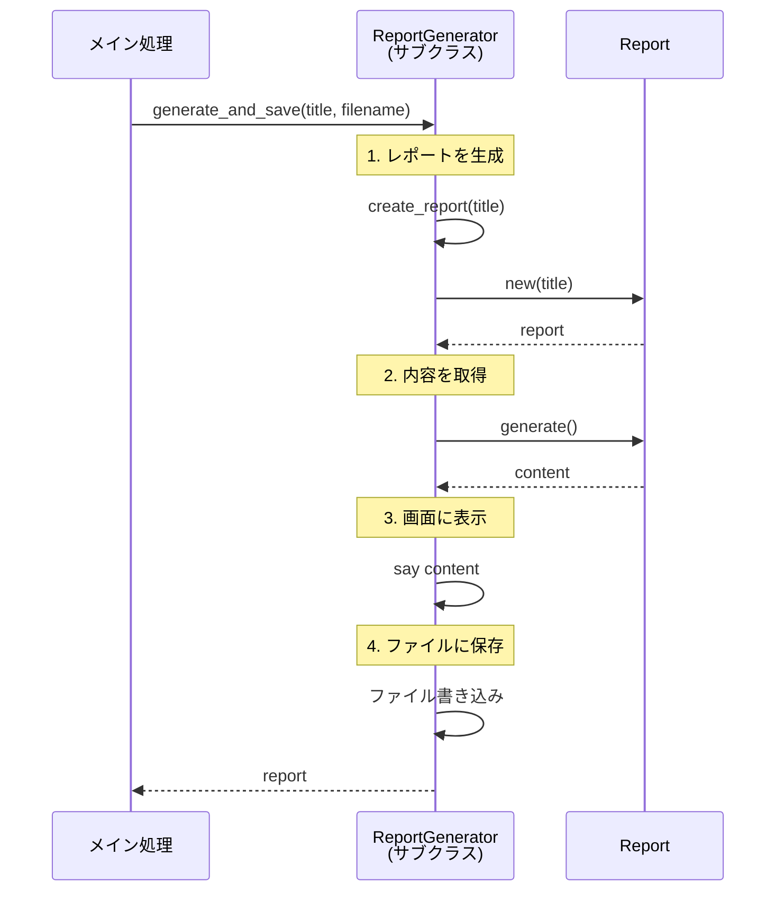

[@nqounet](https://x.com/nqounet)です。

## 前回の振り返り

前回は、`create_report`メソッドのオーバーライドについて詳しく解説しました。

- 基底クラスでメソッドの「枠組み」を定義する
- サブクラスでメソッドをオーバーライドして「具体的な処理」を実装する
- 新しい種別を追加しても既存コードを修正しなくてよい



## 今回の目標

今回は、基底クラスに共通の処理を集約します。

具体的には、以下のことを行います。

- `generate_and_save`メソッドを基底クラスに追加する
- 「レポート生成→表示→保存」という一連の流れを統一する
- サブクラスは`create_report`だけに集中できるようにする

## ストーリー設定

上司から「レポートを生成したら、自動的にファイルに保存してほしい」と依頼されました。

月次・週次・日次、すべてのレポートで同じ保存処理を行いたいとのこと。

各ジェネレーターに同じ保存処理を書くのは面倒なので、基底クラスにまとめてしまいましょう。

## 実装

### コード例1: generate_and_saveメソッドの実装

基底クラスに`generate_and_save`メソッドを追加します。

```perl
#!/usr/bin/env perl
use v5.36;

# ========================================
# ReportRole ロール
# ========================================
package ReportRole {
    use Moo::Role;

    requires 'generate';
    requires 'get_period';
}

# ========================================
# MonthlyReport クラス
# ========================================
package MonthlyReport {
    use Moo;
    with 'ReportRole';

    has title => (
        is       => 'ro',
        required => 1,
    );

    sub generate ($self) {
        my @lines = (
            "=== " . $self->title . " ===",
            "期間: " . $self->get_period(),
            "月次レポートを生成しました。",
        );
        return join("\n", @lines);
    }

    sub get_period ($self) {
        return '月次';
    }
}

# ========================================
# WeeklyReport クラス
# ========================================
package WeeklyReport {
    use Moo;
    with 'ReportRole';

    has title => (
        is       => 'ro',
        required => 1,
    );

    sub generate ($self) {
        my @lines = (
            "=== " . $self->title . " ===",
            "期間: " . $self->get_period(),
            "週次レポートを生成しました。",
        );
        return join("\n", @lines);
    }

    sub get_period ($self) {
        return '週次';
    }
}

# ========================================
# DailyReport クラス
# ========================================
package DailyReport {
    use Moo;
    with 'ReportRole';

    has title => (
        is       => 'ro',
        required => 1,
    );

    sub generate ($self) {
        my @lines = (
            "=== " . $self->title . " ===",
            "期間: " . $self->get_period(),
            "日次レポートを生成しました。",
        );
        return join("\n", @lines);
    }

    sub get_period ($self) {
        return '日次';
    }
}

# ========================================
# ReportGenerator 基底クラス
# ========================================
package ReportGenerator {
    use Moo;

    # サブクラスでオーバーライドするメソッド
    sub create_report ($self, $title) {
        die "create_report() must be implemented by subclass";
    }

    # 共通の処理: レポートを生成して表示
    sub generate_and_print ($self, $title) {
        my $report = $self->create_report($title);
        my $content = $report->generate();
        say $content;
        return $report;
    }

    # 共通の処理: レポートを生成して保存
    sub generate_and_save ($self, $title, $filename) {
        # 1. レポートを生成
        my $report = $self->create_report($title);

        # 2. レポートの内容を取得
        my $content = $report->generate();

        # 3. 画面に表示
        say $content;

        # 4. ファイルに保存（シミュレーション）
        say "";
        say "[保存] $filename に保存しました。";

        return $report;
    }
}

# ========================================
# MonthlyReportGenerator クラス
# ========================================
package MonthlyReportGenerator {
    use Moo;
    extends 'ReportGenerator';

    sub create_report ($self, $title) {
        return MonthlyReport->new(title => $title);
    }
}

# ========================================
# WeeklyReportGenerator クラス
# ========================================
package WeeklyReportGenerator {
    use Moo;
    extends 'ReportGenerator';

    sub create_report ($self, $title) {
        return WeeklyReport->new(title => $title);
    }
}

# ========================================
# DailyReportGenerator クラス
# ========================================
package DailyReportGenerator {
    use Moo;
    extends 'ReportGenerator';

    sub create_report ($self, $title) {
        return DailyReport->new(title => $title);
    }
}

# ========================================
# メイン処理
# ========================================
package main;

say "=== generate_and_save の使用例 ===";
say "";

my $monthly = MonthlyReportGenerator->new();
$monthly->generate_and_save(
    "2026年1月 売上レポート",
    "monthly_report_202601.txt"
);

say "";

my $weekly = WeeklyReportGenerator->new();
$weekly->generate_and_save(
    "2026年1月第1週 売上レポート",
    "weekly_report_202601_w1.txt"
);
```

ポイントは、`generate_and_save`メソッドが基底クラスに定義されていることです。

1. `create_report`を呼び出してレポートを生成（※サブクラスがオーバーライド）
2. `generate`を呼び出してレポートの内容を取得
3. 画面に表示
4. ファイルに保存

この流れは全てのジェネレーターで共通です。

### コード例2: 実行結果の確認

実行結果は以下のようになります。

```
=== generate_and_save の使用例 ===

=== 2026年1月 売上レポート ===
期間: 月次
月次レポートを生成しました。

[保存] monthly_report_202601.txt に保存しました。

=== 2026年1月第1週 売上レポート ===
期間: 週次
週次レポートを生成しました。

[保存] weekly_report_202601_w1.txt に保存しました。
```

月次レポートも週次レポートも、同じ`generate_and_save`メソッドで処理されています。

## 基底クラスに共通処理を集約するメリット

この設計には以下のメリットがあります。

**1. 重複コードの排除**

各ジェネレーターに同じ保存処理を書く必要がありません。

**2. 変更が容易**

保存処理を変更したいとき、基底クラスの1箇所だけを修正すれば全てに反映されます。

**3. サブクラスの責務が明確**

サブクラスは`create_report`だけに集中できます。「何を作るか」だけを決めればよいのです。

## 処理の流れを図解



基底クラスが「処理の骨格」を定義し、サブクラスが「具体的な部品」を提供する。この構造により、共通処理と個別処理を綺麗に分離できます。

## 今回のまとめ

今回は、基底クラスに共通処理を集約しました。

- `generate_and_save`メソッドを基底クラスに追加した
- 「生成→表示→保存」の流れを統一した
- サブクラスは`create_report`だけに集中できるようになった

基底クラスで「処理の骨格」を定義し、サブクラスで「具体的な部品」を提供する。この設計パターンは、コードの再利用性を高め、保守性を向上させます。

## 次回予告

次回は「レポートの型を保証しよう」として、`create_report`の戻り値が正しいレポートオブジェクトであることを保証します。

Mooの`does`制約を使って、型安全性を高めましょう。


