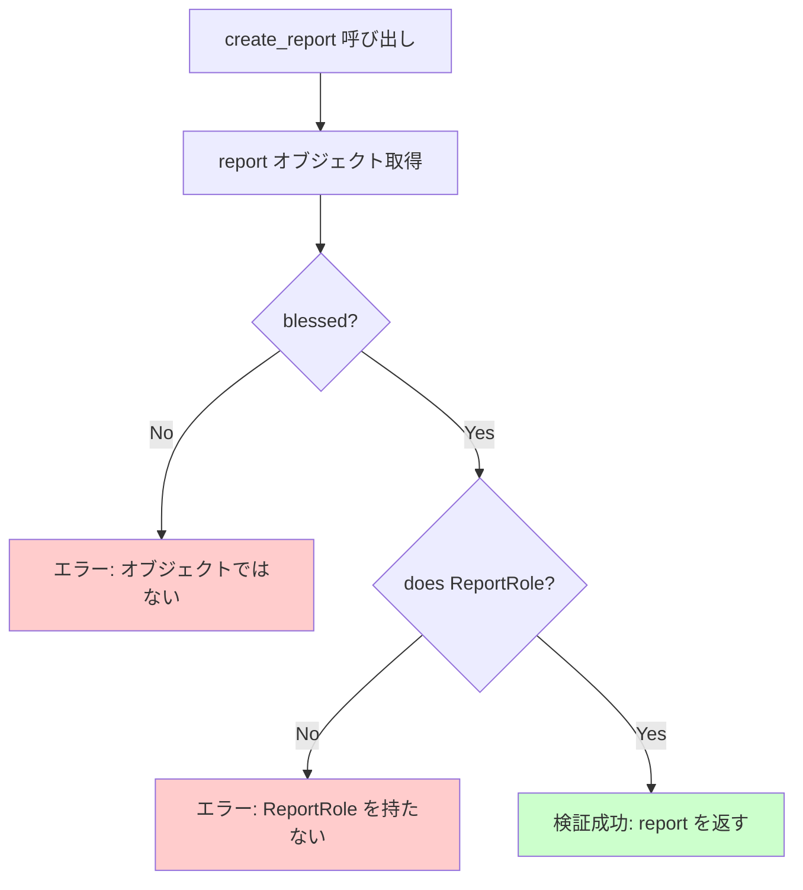

[@nqounet](https://x.com/nqounet)です。

## 前回の振り返り

前回は、基底クラスに共通処理を集約しました。

- `generate_and_save`メソッドを基底クラスに追加した
- 「生成→表示→保存」の流れを統一した
- サブクラスは`create_report`だけに集中できるようになった



## 今回の目標

今回は、`create_report`の戻り値が正しいレポートオブジェクトであることを保証します。

具体的には、以下のことを行います。

- `create_report`の戻り値を検証する
- `does`を使って`ReportRole`を持つことをチェックする
- 型エラーが発生した場合のデモを行う

## ストーリー設定

新しいメンバーがチームに加わりました。

彼が新しいレポートジェネレーターを作ったのですが、`create_report`が間違ったオブジェクトを返してしまい、バグが発生しました。

「`create_report`は必ず`ReportRole`を持つオブジェクトを返す」というルールを強制できないでしょうか？

## 実装

### コード例1: create_reportでの戻り値検証

基底クラスに、`create_report`の戻り値を検証する処理を追加します。

```perl
#!/usr/bin/env perl
use v5.36;

# ========================================
# ReportRole ロール
# ========================================
package ReportRole {
    use Moo::Role;

    requires 'generate';
    requires 'get_period';
}

# ========================================
# MonthlyReport クラス
# ========================================
package MonthlyReport {
    use Moo;
    with 'ReportRole';

    has title => (
        is       => 'ro',
        required => 1,
    );

    sub generate ($self) {
        my @lines = (
            "=== " . $self->title . " ===",
            "期間: " . $self->get_period(),
            "月次レポートを生成しました。",
        );
        return join("\n", @lines);
    }

    sub get_period ($self) {
        return '月次';
    }
}

# ========================================
# WeeklyReport クラス
# ========================================
package WeeklyReport {
    use Moo;
    with 'ReportRole';

    has title => (
        is       => 'ro',
        required => 1,
    );

    sub generate ($self) {
        my @lines = (
            "=== " . $self->title . " ===",
            "期間: " . $self->get_period(),
            "週次レポートを生成しました。",
        );
        return join("\n", @lines);
    }

    sub get_period ($self) {
        return '週次';
    }
}

# ========================================
# DailyReport クラス
# ========================================
package DailyReport {
    use Moo;
    with 'ReportRole';

    has title => (
        is       => 'ro',
        required => 1,
    );

    sub generate ($self) {
        my @lines = (
            "=== " . $self->title . " ===",
            "期間: " . $self->get_period(),
            "日次レポートを生成しました。",
        );
        return join("\n", @lines);
    }

    sub get_period ($self) {
        return '日次';
    }
}

# ========================================
# ReportGenerator 基底クラス
# ========================================
package ReportGenerator {
    use Moo;
    use Scalar::Util qw(blessed);

    # サブクラスでオーバーライドするメソッド
    sub create_report ($self, $title) {
        die "create_report() must be implemented by subclass";
    }

    # 戻り値を検証するラッパーメソッド
    sub create_validated_report ($self, $title) {
        my $report = $self->create_report($title);

        # 型チェック: ReportRoleを持っているか確認
        unless (blessed($report) && $report->does('ReportRole')) {
            die "create_report() must return an object that does ReportRole";
        }

        return $report;
    }

    # 共通の処理: レポートを生成して表示
    sub generate_and_print ($self, $title) {
        my $report = $self->create_validated_report($title);
        my $content = $report->generate();
        say $content;
        return $report;
    }

    # 共通の処理: レポートを生成して保存
    sub generate_and_save ($self, $title, $filename) {
        my $report = $self->create_validated_report($title);
        my $content = $report->generate();

        say $content;
        say "";
        say "[保存] $filename に保存しました。";

        return $report;
    }
}

# ========================================
# MonthlyReportGenerator クラス
# ========================================
package MonthlyReportGenerator {
    use Moo;
    extends 'ReportGenerator';

    sub create_report ($self, $title) {
        return MonthlyReport->new(title => $title);
    }
}

# ========================================
# WeeklyReportGenerator クラス
# ========================================
package WeeklyReportGenerator {
    use Moo;
    extends 'ReportGenerator';

    sub create_report ($self, $title) {
        return WeeklyReport->new(title => $title);
    }
}

# ========================================
# DailyReportGenerator クラス
# ========================================
package DailyReportGenerator {
    use Moo;
    extends 'ReportGenerator';

    sub create_report ($self, $title) {
        return DailyReport->new(title => $title);
    }
}

# ========================================
# メイン処理
# ========================================
package main;

say "=== 正常なケース ===";
my $monthly = MonthlyReportGenerator->new();
$monthly->generate_and_print("2026年1月 売上レポート");
```

ポイントは、`create_validated_report`メソッドです。

```perl
sub create_validated_report ($self, $title) {
    my $report = $self->create_report($title);

    # 型チェック: ReportRoleを持っているか確認
    unless (blessed($report) && $report->does('ReportRole')) {
        die "create_report() must return an object that does ReportRole";
    }

    return $report;
}
```

`does`メソッドを使って、オブジェクトが`ReportRole`を持っているかをチェックしています。

型チェックについて詳しくは、以下の記事をご覧ください。



### コード例2: 型エラーのデモ

もし`create_report`が間違ったオブジェクトを返したらどうなるでしょうか？

```perl
# ========================================
# 間違った実装のジェネレーター
# ========================================
package BrokenGenerator {
    use Moo;
    extends 'ReportGenerator';

    # ReportRoleを持たないオブジェクトを返してしまう
    sub create_report ($self, $title) {
        # 単なるハッシュリファレンスを返す（間違い！）
        return { title => $title };
    }
}

# ========================================
# エラーのデモ
# ========================================
package main;

say "";
say "=== 型エラーのデモ ===";

my $broken = BrokenGenerator->new();

eval {
    $broken->generate_and_print("テストレポート");
};

if ($@) {
    say "エラーが発生しました: $@";
}
```

実行結果は以下のようになります。

```
=== 正常なケース ===
=== 2026年1月 売上レポート ===
期間: 月次
月次レポートを生成しました。

=== 型エラーのデモ ===
エラーが発生しました: create_report() must return an object that does ReportRole at ...
```

`create_report`が`ReportRole`を持たないオブジェクト（この場合はハッシュリファレンス）を返したため、エラーが発生しました。

## 型チェックのメリット



この型チェックには以下のメリットがあります。

**1. バグの早期発見**

実行時にすぐにエラーが発生するため、問題を早期に発見できます。

**2. 契約の強制**

「`create_report`は必ず`ReportRole`を持つオブジェクトを返す」という契約が強制されます。

**3. ドキュメントの役割**

コードを読むだけで「何を返すべきか」がわかります。

## 今回のまとめ

今回は、`create_report`の戻り値を検証する仕組みを追加しました。

- `create_validated_report`メソッドで型チェックを行う
- `does`を使って`ReportRole`を持つことを確認する
- 型エラーが発生した場合は例外をスローする

これにより、新しいジェネレーターを作成する際に、間違った実装をしてしまうリスクを減らせます。

## 次回予告

次回は「新しいレポート種別を追加しよう」として、四半期レポートを追加します。

既存のコードを一切修正せずに、新しいクラスを追加するだけで機能を拡張できることを体験しましょう。


