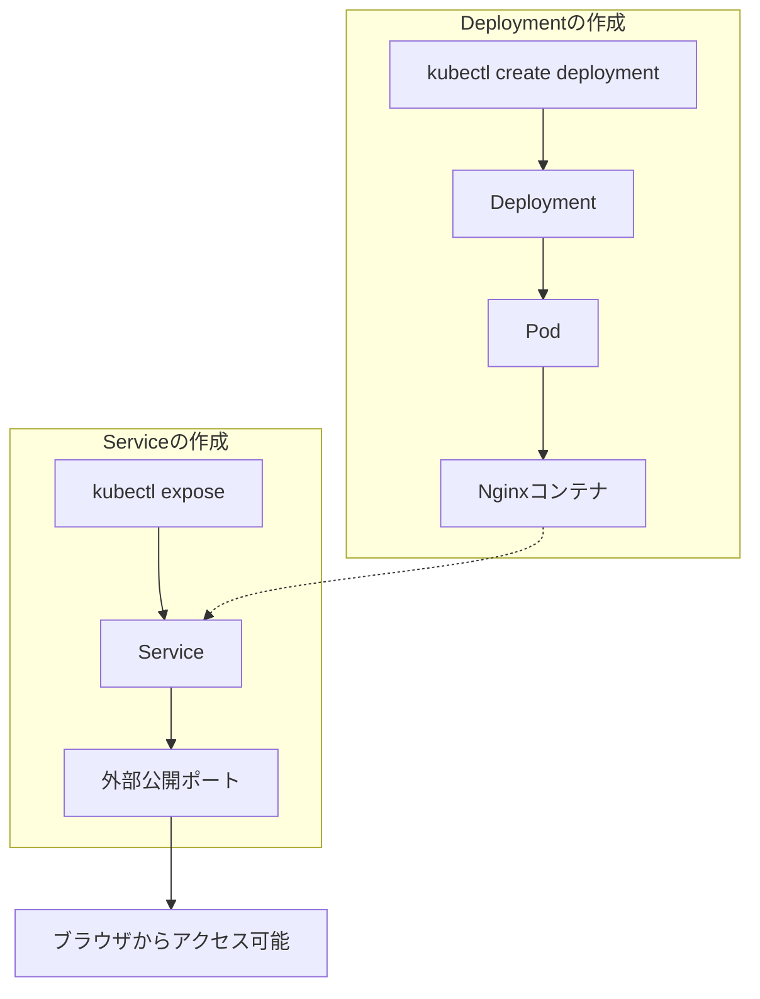

## はじめに

以前、[docker-composeを使ったローカル開発](/2017/12/03/025713/)について書きました。`docker-compose up`の一発でアプリが起動する便利さは今でも健在です。しかし、本番環境でKubernetesを使うプロジェクトが増えてきた今、「ローカルでもKubernetesを触ってみたい」と思う方も多いのではないでしょうか。

「Kubernetesは複雑で難しそう」というイメージがあるかもしれません。確かに、Pod、Deployment、Serviceといった独特の用語や、YAMLファイルの設定は最初は戸惑うものです。

でも安心してください。この記事では、**概念の説明は後回し**にして、まずは「Kubernetesを動かす」ことに集中します。Minikubeを使えば、わずか5分でNginxがKubernetes上で動く体験ができます。

### この記事で達成すること

この記事を読み終えると、以下のことができるようになります。

- Minikubeをインストールしてローカルにクラスタを起動する
- Kubernetesクラスタ上でNginxを動かす
- ブラウザからNginxにアクセスする
- Kubernetesダッシュボードでリソースを確認する
- クラスタを停止・削除してクリーンアップする

### 必要な環境

以下の環境が必要です。

- **OS**: macOS、Windows、またはLinux
- **Docker**: インストール済みであること（Docker Desktopまたはdocker-ce）
- **メモリ**: 2GB以上の空き
- **ディスク**: 20GB以上の空き
- **ターミナル操作**: 基本的なコマンドライン操作ができること

docker-composeを使ったことがある方なら、これらの条件は満たしているはずです。

## Minikubeのセットアップ

### インストールとクラスタ起動

お使いのOSに合わせてMinikubeをインストールします。

**macOS（Homebrew）**

```bash
brew install minikube
```

**Windows（winget）**

```powershell
winget install Kubernetes.minikube
```

**Windows（Chocolatey）**

```powershell
choco install minikube
```

**Linux（x86-64）**

```bash
curl -LO https://storage.googleapis.com/minikube/releases/latest/minikube-linux-amd64
sudo install minikube-linux-amd64 /usr/local/bin/minikube
rm minikube-linux-amd64
```

インストールが完了したら、クラスタを起動します。

```bash
minikube start
```

初回起動時は、必要なイメージのダウンロードなどで数分かかることがあります。Dockerがインストールされていれば、自動的にDockerドライバが選択されます。

### 起動確認

クラスタが正常に起動しているか確認しましょう。

```bash
minikube status
```

以下のような出力が表示されれば成功です。

```
minikube
type: Control Plane
host: Running
kubelet: Running
apiserver: Running
kubeconfig: Configured
```

次に、`kubectl`コマンドが使えることを確認します。Minikubeでは`minikube kubectl --`コマンドを通じてkubectlを使用できます。

```bash
minikube kubectl -- get nodes
```

以下のような出力が表示されます（バージョン番号は環境により異なる場合があります）。

```
NAME       STATUS   ROLES           AGE   VERSION
minikube   Ready    control-plane   1m    v1.31.0
```

このように`STATUS`が`Ready`になっていれば、Kubernetesクラスタが正常に動作しています。

**ヒント**: 毎回`minikube kubectl --`と入力するのは面倒なので、エイリアスを設定しておくと便利です。

```bash
alias kubectl="minikube kubectl --"
```

このエイリアスはターミナルを閉じると消えてしまいます。永続化したい場合は、`~/.bashrc`や`~/.zshrc`に追記してください。

## Nginxをデプロイする

いよいよKubernetesにNginxをデプロイします。docker-composeでいう`docker-compose up`に相当する操作を行います。

**注意**: 以降のコマンド例では、前述のエイリアス設定（`alias kubectl="minikube kubectl --"`）を前提としています。エイリアスを設定していない場合は、`kubectl`を`minikube kubectl --`に読み替えてください。

### コマンド一発でNginxを起動

以下のコマンドを実行するだけで、NginxがKubernetes上で動き始めます。

```bash
kubectl create deployment nginx --image=nginx
```

```
deployment.apps/nginx created
```

これでNginxのコンテナが起動しました。次に、外部からアクセスできるようにサービスを公開します。

```bash
kubectl expose deployment nginx --port=80 --type=NodePort
```

```
service/nginx exposed
```

### ブラウザでアクセス

Minikubeには、サービスにアクセスするための便利なコマンドがあります。

```bash
minikube service nginx
```

このコマンドを実行すると、自動的にブラウザが開き、Nginxのウェルカムページが表示されます。以下は出力例です（IPアドレスとポート番号は環境により異なります）。

```
|-----------|-------|-------------|---------------------------|
| NAMESPACE | NAME  | TARGET PORT |            URL            |
|-----------|-------|-------------|---------------------------|
| default   | nginx |          80 | http://192.168.49.2:31234 |
|-----------|-------|-------------|---------------------------|
🎉  Opening service default/nginx in default browser...
```

「Welcome to nginx!」というページが表示されれば成功です。おめでとうございます！**あなたはKubernetesでアプリケーションを動かすことに成功しました。**

### 何が起きたのか？

ここで行った操作を簡単に振り返ってみましょう。詳細な説明は次回以降に譲りますが、大まかな流れは以下の通りです。



1. `kubectl create deployment nginx --image=nginx`
   - **Deployment**というリソースを作成
   - Deploymentが**Pod**（コンテナの実行単位）を作成
   - PodがNginxコンテナを起動

2. `kubectl expose deployment nginx --port=80 --type=NodePort`
   - **Service**というリソースを作成
   - ServiceがPodへのアクセス経路を提供
   - NodePortタイプでクラスタ外部からアクセス可能に

docker-composeでの`services:`定義と`ports:`設定に相当する操作を、2つのコマンドで行ったことになります。

## ダッシュボードを見てみよう

Kubernetesの強みの一つは、クラスタの状態を可視化できるダッシュボードです。コマンドラインだけでなく、GUIでもリソースを確認できます。

### ダッシュボードの起動

以下のコマンドでダッシュボードを起動します。

```bash
minikube dashboard
```

ブラウザが自動的に開き、Kubernetesダッシュボードが表示されます。

### リソースを確認する

ダッシュボードでは、先ほど作成したリソースを視覚的に確認できます。

1. 左メニューの「**Workloads**」→「**Deployments**」を選択
2. 「nginx」というDeploymentが表示されることを確認
3. 「**Pods**」を選択し、NginxのPodが「Running」状態であることを確認
4. 「**Services**」→「**Services**」を選択し、nginxサービスを確認

ダッシュボードでは、以下の情報を簡単に把握できます。

- Podのステータス（Running、Pending、Failedなど）
- リソースの使用状況
- ログの確認
- コンテナへのシェルアクセス

docker-composeでは`docker-compose ps`や`docker-compose logs`で確認していた情報が、より見やすい形で提供されています。

**ダッシュボードを終了するには**、ターミナルで`Ctrl+C`を押します。

## トラブルシューティング

初めてMinikubeを使う際によく遭遇するエラーと解決方法を紹介します。

### Minikubeが起動しない

**症状**: `minikube start`でエラーが発生する

**原因と対処法**:

- **Dockerが起動していない**: Docker Desktopまたはdockerdを起動する
- **メモリ不足**: 他のアプリケーションを終了してメモリを確保する
- **古いMinikubeプロファイル**: `minikube delete`で既存クラスタを削除してから再度`minikube start`

```bash
minikube delete
minikube start
```

### kubectl: command not found

**症状**: `kubectl`コマンドが見つからない

**対処法**: Minikubeの`kubectl`サブコマンドを使用する

```bash
minikube kubectl -- <コマンド>
```

または、`kubectl`を別途インストールする

```bash
# macOS
brew install kubectl

# Windows
winget install Kubernetes.kubectl

# Linux
curl -LO "https://dl.k8s.io/release/$(curl -L -s https://dl.k8s.io/release/stable.txt)/bin/linux/amd64/kubectl"
sudo install kubectl /usr/local/bin/kubectl
```

### Podが起動しない（Pending状態のまま）

**症状**: `kubectl get pods`でPodがずっと`Pending`状態

**対処法**: クラスタのリソースを確認する

```bash
minikube kubectl -- describe pod nginx
```

出力の「Events」セクションを確認し、エラーメッセージに基づいて対処します。多くの場合、リソース不足が原因です。

### サービスにアクセスできない

**症状**: `minikube service nginx`でブラウザが開くが、接続できない

**対処法**: Podが正常に起動しているか確認する

```bash
minikube kubectl -- get pods
minikube kubectl -- logs nginx-<ポッド名>
```

Podの状態が`Running`でない場合は、Podが起動するまで待つか、ログを確認してエラーを解決します。

## 後片付けと次回予告

### クラスタの停止・削除

ハンズオンが終わったら、リソースを後片付けしましょう。

**作成したリソースの削除**

```bash
kubectl delete service nginx
kubectl delete deployment nginx
```

**クラスタの停止**（後で再開可能）

```bash
minikube stop
```

**クラスタの完全削除**（最初からやり直したい場合）

```bash
minikube delete
```

停止と削除の違いは以下の通りです。

| コマンド | 効果 | 再開方法 |
|---------|------|---------|
| `minikube stop` | クラスタを停止（状態を保持） | `minikube start` |
| `minikube delete` | クラスタを完全削除 | `minikube start`（新規作成） |

学習中は`stop`で停止し、完全にクリーンアップしたい場合は`delete`を使うのがおすすめです。

### 次回：「なぜこう動くのか」を理解する

今回は「とりあえず動かす」ことに集中しました。コマンド2つでNginxが動き、ダッシュボードでリソースを確認できることを体験していただけたと思います。

次回は、今回使った概念をもう少し掘り下げて解説します。

- **Pod**: コンテナの実行単位とは何か
- **Deployment**: なぜDeploymentを使うのか
- **Service**: ネットワーク周りの仕組み
- **マニフェストファイル**: YAMLでリソースを定義する方法

docker-composeの`docker-compose.yml`に相当する**マニフェストファイル**を使った方法も紹介します。コマンドラインでの操作からYAMLファイルでの管理へステップアップしていきましょう。

---

この記事はシリーズ「Kubernetesでローカル環境を構築する」の第1回です。

- **第1回**: Minikubeで5分Kubernetes体験（本記事）
- **第2回**: Pod、Deployment、Serviceを理解する（近日公開）
- **第3回**: docker-composeからKubernetesへ移行する（近日公開）

## 参考リンク




