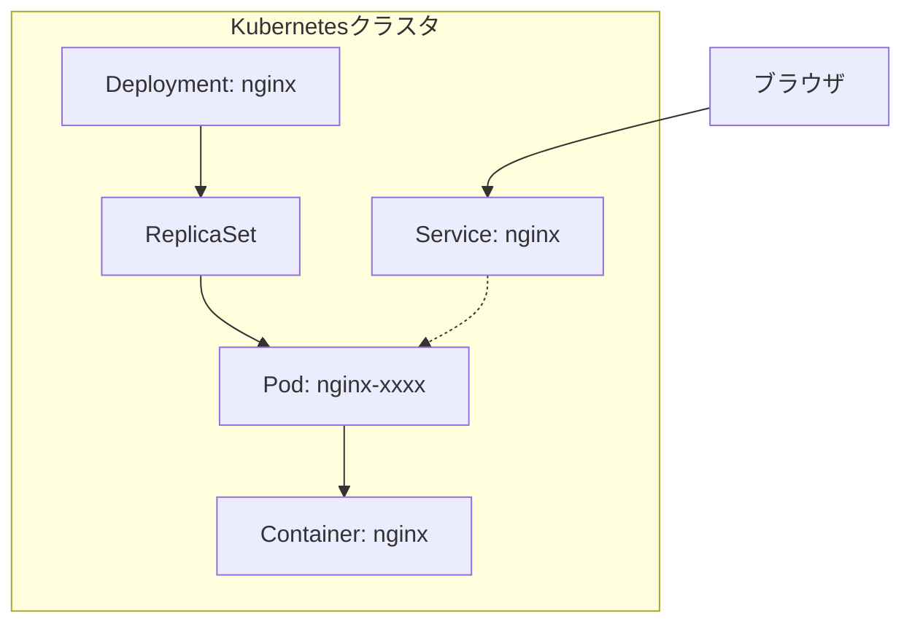
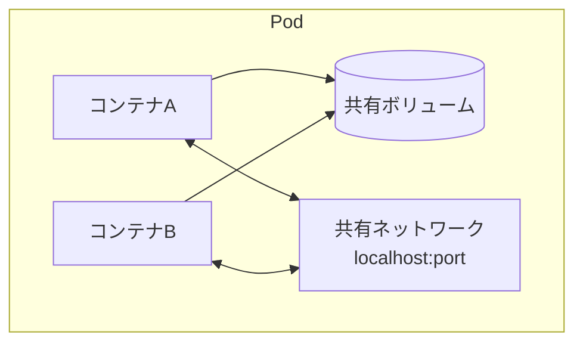
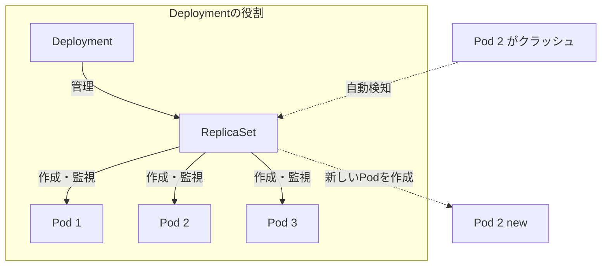
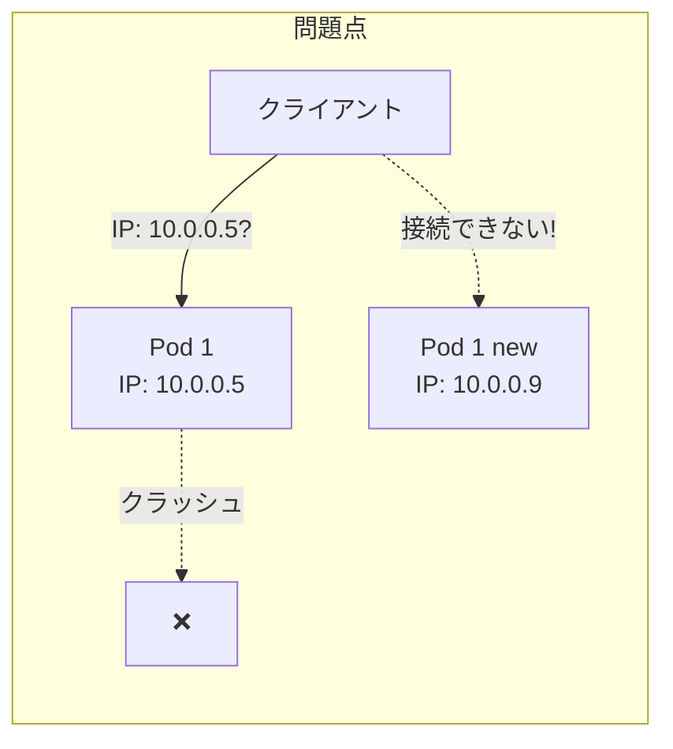
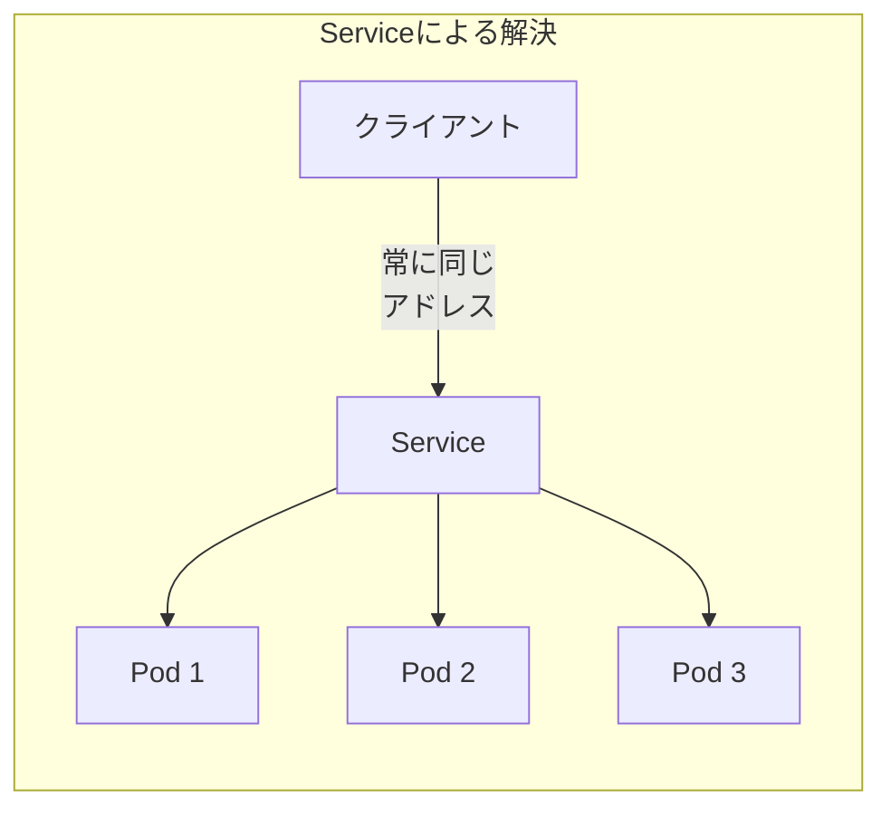
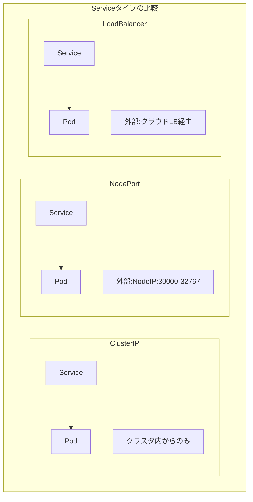

## 前回やったことを振り返る

[前回の記事](/kubernetes-local-part1/)では、Minikubeを使ってKubernetesクラスタを起動し、Nginxを動かすところまで体験しました。わずか2つのコマンドでNginxが動いたのは驚きだったのではないでしょうか。

### 2つのコマンドで何が起きていたのか

前回実行したコマンドを振り返ってみましょう。

```bash
kubectl create deployment nginx --image=nginx
kubectl expose deployment nginx --port=80 --type=NodePort
```

この2つのコマンドで、実際には以下のリソースが作成されていました。



- **Deployment**: アプリケーションの「あるべき状態」を定義するリソース
- **ReplicaSet**: Deploymentによって自動作成され、Podの数を管理する
- **Pod**: 1つ以上のコンテナをまとめた実行単位
- **Service**: Podへのネットワークアクセスを提供する

前回は「とりあえず動かす」ことに集中しましたが、今回はこれらの概念を実際に操作しながら理解していきます。

### 今回のゴール

この記事を読み終えると、以下のことができるようになります。

- Pod、Deployment、Serviceの役割を理解できる
- Podの自動復旧やスケーリングを体験できる
- YAMLマニフェストを読み書きできる
- 基本的なトラブルシューティングができる

**前提条件**: 前回の記事でMinikubeのセットアップが完了していること。まだの方は[前回の記事](/kubernetes-local-part1/)を先にご覧ください。

まず、クラスタが起動していることを確認しましょう。

```bash
minikube status
```

停止している場合は、以下のコマンドで起動します。

```bash
minikube start
```

**注意**: 以降のコマンド例では、`alias kubectl="minikube kubectl --"` が設定されている前提で記載しています。エイリアスを設定していない場合は、`kubectl` を `minikube kubectl --` に読み替えてください。

## Podとは何か

### コンテナとPodの関係

Kubernetesにおいて、**Pod**は最小のデプロイ単位です。Docker単体では「コンテナ」が最小単位でしたが、Kubernetesでは「Pod」という概念でコンテナをラップしています。



PodとDockerコンテナの違いを整理すると以下のようになります。

| 項目 | Dockerコンテナ | Kubernetes Pod |
|------|--------------|----------------|
| 単位 | 1コンテナ = 1プロセス | 1 Pod = 1つ以上のコンテナ |
| ネットワーク | コンテナごとにIP | Pod内で共有（localhost通信可） |
| ストレージ | コンテナごと | Pod内で共有ボリューム可 |
| ライフサイクル | 個別に管理 | Pod単位で生死を共にする |

多くの場合、1つのPodには1つのコンテナを入れます。複数コンテナを1つのPodに入れるのは、サイドカーパターン（メインアプリ + ログ収集コンテナなど）のような特殊なケースです。

### 実際にPodを作ってみる

まずは最もシンプルな形でPodを作成してみましょう。

```bash
kubectl run my-nginx --image=nginx
```

```
pod/my-nginx created
```

Podの状態を確認します。

```bash
kubectl get pods
```

```
NAME       READY   STATUS    RESTARTS   AGE
my-nginx   1/1     Running   0          10s
```

`STATUS`が`Running`になっていれば、Podが正常に動作しています。`READY`の`1/1`は「1つのコンテナのうち1つが準備完了」を意味します。

### Podを削除するとどうなる？

ここで重要な実験をしてみましょう。`kubectl run`で作成したPodを削除するとどうなるでしょうか。

```bash
kubectl delete pod my-nginx
```

```
pod "my-nginx" deleted
```

もう一度Podを確認します。

```bash
kubectl get pods
```

```
No resources found in default namespace.
```

Podが消えてしまいました。**`kubectl run`で直接作成したPodは、削除されると復活しません。** これはdocker-composeで`docker compose rm`した後に`docker compose up`しないと復活しないのと同じです。

この「削除されたら終わり」という問題を解決するのが、次に説明するDeploymentです。

### Podの状態を確認する方法

Podのトラブルシューティングには、詳細情報の確認が欠かせません。いくつかの便利なコマンドを紹介します。

**Podの詳細情報を表示**

```bash
kubectl describe pod <pod名>
```

**Podのログを表示**

```bash
kubectl logs <pod名>
```

**Podのシェルに接続（デバッグ用）**

```bash
kubectl exec -it <pod名> -- /bin/bash
```

これらのコマンドは後のトラブルシューティングセクションで活用します。

## Deploymentとは何か

### なぜ直接Podを作らないのか

前のセクションで見たように、`kubectl run`で直接Podを作成すると、削除されたら復活しません。本番環境では、アプリケーションが何らかの理由でクラッシュしても**自動的に復旧**してほしいものです。

**Deployment**は、この「あるべき状態」を定義するリソースです。「Nginxを1つ動かしておきたい」と宣言すると、Kubernetesがその状態を維持してくれます。



docker-composeとの比較で考えると、以下のような対応関係になります。

| docker-compose | Kubernetes |
|---------------|------------|
| `docker compose up` | Deploymentを作成 |
| `restart: always` | Deploymentの標準動作 |
| `replicas: 3` | `replicas: 3` |
| コンテナがクラッシュ → 手動復旧 | Pod がクラッシュ → 自動復旧 |

### 【体験】Podを消して自動復旧を観察

では、Deploymentの自動復旧機能を実際に体験してみましょう。

まず、前回のリソースが残っている場合はクリーンアップします。

```bash
kubectl delete deployment nginx --ignore-not-found
kubectl delete service nginx --ignore-not-found
```

Deploymentを作成します。

```bash
kubectl create deployment nginx --image=nginx
```

Podが作成されたことを確認します。

```bash
kubectl get pods
```

```
NAME                     READY   STATUS    RESTARTS   AGE
nginx-676b6c5bbc-7xj2k   1/1     Running   0          30s
```

Pod名をメモしておいてください（この例では`nginx-676b6c5bbc-7xj2k`）。

次に、このPodを**強制的に削除**してみます。

```bash
kubectl delete pod nginx-676b6c5bbc-7xj2k
```

すぐにPodの状態を確認します。

```bash
kubectl get pods
```

```
NAME                     READY   STATUS    RESTARTS   AGE
nginx-676b6c5bbc-m8p4n   1/1     Running   0          5s
```

**新しいPodが自動的に作成されました！** Pod名が変わっていることに注目してください。Deploymentが「Nginxが1つ動いているべき」という状態を維持するため、Podが消えると自動的に新しいPodを作成します。

これが、Deploymentを使う最大のメリットです。

### 【体験】レプリカ数を変更してスケール

次に、アプリケーションのスケーリングを体験します。現在はNginxが1つだけ動いていますが、これを3つに増やしてみましょう。

```bash
kubectl scale deployment nginx --replicas=3
```

```
deployment.apps/nginx scaled
```

Podの状態を確認します。

```bash
kubectl get pods
```

```
NAME                     READY   STATUS    RESTARTS   AGE
nginx-676b6c5bbc-m8p4n   1/1     Running   0          2m
nginx-676b6c5bbc-q2w3e   1/1     Running   0          10s
nginx-676b6c5bbc-r4t5y   1/1     Running   0          10s
```

3つのPodが動いています。負荷分散やバックアップのために複数のインスタンスを用意する場合、このように簡単にスケールできます。

スケールダウンも同様です。

```bash
kubectl scale deployment nginx --replicas=1
```

```bash
kubectl get pods
```

```
NAME                     READY   STATUS    RESTARTS   AGE
nginx-676b6c5bbc-m8p4n   1/1     Running   0          3m
```

docker-composeでは`docker compose up --scale web=3`のような操作に相当しますが、Kubernetesではより宣言的に管理できます。

## Serviceとは何か

### Podへのアクセス問題を解決する

Deploymentで複数のPodを管理できるようになりましたが、1つ問題があります。**Podは削除・再作成されるたびにIPアドレスが変わる**のです。



この問題を解決するのが**Service**です。Serviceは、Podの前に置かれる「安定したエンドポイント」で、背後のPodがどう変わっても同じアドレスでアクセスできます。



### ClusterIP・NodePort・LoadBalancer

Serviceにはいくつかのタイプがあります。

| タイプ | 用途 | アクセス範囲 |
|-------|------|-------------|
| **ClusterIP** | クラスタ内部通信 | クラスタ内部のみ |
| **NodePort** | 開発・テスト環境 | ノードのIPで外部公開 |
| **LoadBalancer** | 本番環境 | クラウドのロードバランサー経由 |



ローカル開発では主に**NodePort**を使用します。前回の記事で使った`--type=NodePort`がこれです。

### 【体験】Serviceを作成してアクセス

現在のDeploymentに対してServiceを作成しましょう。

```bash
kubectl expose deployment nginx --port=80 --type=NodePort
```

```
service/nginx exposed
```

Serviceの状態を確認します。

```bash
kubectl get services
```

```
NAME         TYPE        CLUSTER-IP      EXTERNAL-IP   PORT(S)        AGE
kubernetes   ClusterIP   10.96.0.1       <none>        443/TCP        1d
nginx        NodePort    10.96.123.45    <none>        80:31234/TCP   10s
```

`nginx`サービスが作成されました。`80:31234/TCP`は「クラスタ内部のポート80を、ノードのポート31234で公開している」ことを意味します。

Minikubeでアクセスしてみましょう。

```bash
minikube service nginx
```

ブラウザが開き、Nginxのウェルカムページが表示されれば成功です。

**補足**: `minikube service nginx --url`を実行すると、URLだけを取得できます。

## YAMLマニフェストに挑戦

### なぜYAMLを書くのか

ここまで`kubectl create`や`kubectl expose`コマンドでリソースを作成してきました。これらは手軽ですが、本番運用では**YAMLマニフェスト**を使うことが推奨されます。

YAMLマニフェストを使うメリットは以下の通りです。

- **バージョン管理**: Gitで変更履歴を追跡できる
- **再現性**: 同じ設定を何度でも適用できる
- **レビュー可能**: コードレビューでインフラの変更を確認できる
- **宣言的**: 「あるべき状態」をファイルで定義できる

docker-composeの`docker-compose.yml`と同じ発想です。

### 既存リソースからYAMLを生成する

まず、既に作成したリソースからYAMLを生成してみましょう。

```bash
kubectl get deployment nginx -o yaml
```

大量の出力がありますが、これが実際のリソース定義です。重要な部分だけを抜き出したものを見てみましょう。

**Deploymentの最小構成**

```yaml
apiVersion: apps/v1
kind: Deployment
metadata:
  name: nginx
spec:
  replicas: 1
  selector:
    matchLabels:
      app: nginx
  template:
    metadata:
      labels:
        app: nginx
    spec:
      containers:
      - name: nginx
        image: nginx
        ports:
        - containerPort: 80
```

**Serviceの最小構成**

```yaml
apiVersion: v1
kind: Service
metadata:
  name: nginx
spec:
  type: NodePort
  selector:
    app: nginx
  ports:
  - port: 80
    targetPort: 80
```

### YAMLの構造を理解する

Kubernetesのマニフェストには、共通の構造があります。

```yaml
apiVersion: <APIバージョン>   # リソースのAPIバージョン
kind: <リソース種別>          # Deployment, Service, Pod など
metadata:                      # メタデータ
  name: <リソース名>           # 必須
  labels:                      # ラベル（任意）
    key: value
spec:                          # リソース固有の設定
  ...
```

docker-compose.ymlとの比較も見てみましょう。

**docker-compose.yml**

```yaml
version: "3.8"
services:
  nginx:
    image: nginx
    ports:
      - "8080:80"
    deploy:
      replicas: 3
```

**Kubernetesマニフェスト（相当する部分）**

```yaml
# Deployment
apiVersion: apps/v1
kind: Deployment
metadata:
  name: nginx
spec:
  replicas: 3
  selector:
    matchLabels:
      app: nginx
  template:
    metadata:
      labels:
        app: nginx
    spec:
      containers:
      - name: nginx
        image: nginx
        ports:
        - containerPort: 80
---
# Service
apiVersion: v1
kind: Service
metadata:
  name: nginx
spec:
  type: NodePort
  selector:
    app: nginx
  ports:
  - port: 80
    targetPort: 80
```

Kubernetesの方が冗長に見えますが、これは各設定を明示的に記述しているためです。慣れると「何がどう設定されているか」が一目でわかるようになります。

以下に、docker-composeとKubernetesの設定項目の対応関係を示します。

| docker-compose | Kubernetes | 補足 |
|---------------|------------|------|
| `image: nginx` | `spec.containers[].image: nginx` | コンテナイメージの指定 |
| `ports: ["8080:80"]` | Service + `containerPort` | Serviceで外部公開を制御 |
| `deploy.replicas: 3` | `spec.replicas: 3` | Deploymentで指定 |
| `environment:` | `env:` または ConfigMap | 環境変数の設定 |
| `volumes:` | PersistentVolumeClaim | ストレージの永続化 |
| `depends_on:` | なし（代替手段あり） | initContainerやreadiness probeで制御 |
| `restart: always` | Deploymentの標準動作 | Kubernetesは自動で再起動を管理 |

### YAMLを編集して適用する

実際にYAMLファイルを作成して適用してみましょう。

まず、既存のリソースを削除します。

```bash
kubectl delete deployment nginx
kubectl delete service nginx
```

次に、マニフェストファイルを作成します。任意のエディタで`nginx-deployment.yaml`という名前のファイルを作成し、以下の内容を保存してください。

```yaml
apiVersion: apps/v1
kind: Deployment
metadata:
  name: nginx
  labels:
    app: nginx
spec:
  replicas: 2
  selector:
    matchLabels:
      app: nginx
  template:
    metadata:
      labels:
        app: nginx
    spec:
      containers:
      - name: nginx
        image: nginx:1.27
        ports:
        - containerPort: 80
---
apiVersion: v1
kind: Service
metadata:
  name: nginx
  labels:
    app: nginx
spec:
  type: NodePort
  selector:
    app: nginx
  ports:
  - port: 80
    targetPort: 80
```

このファイルには以下の変更を加えています。

- `replicas: 2` でPodを2つ起動する設定
- `image: nginx:1.27` で特定のバージョンを指定
- DeploymentとServiceを1つのファイルにまとめている（`---`で区切る）

マニフェストを適用します。

```bash
kubectl apply -f nginx-deployment.yaml
```

```
deployment.apps/nginx created
service/nginx created
```

リソースの状態を確認します。

```bash
kubectl get all -l app=nginx
```

```
NAME                         READY   STATUS    RESTARTS   AGE
pod/nginx-5d5dd5f5f9-abc12   1/1     Running   0          30s
pod/nginx-5d5dd5f5f9-def34   1/1     Running   0          30s

NAME            TYPE       CLUSTER-IP     EXTERNAL-IP   PORT(S)        AGE
service/nginx   NodePort   10.96.45.67    <none>        80:31456/TCP   30s

NAME                    READY   UP-TO-DATE   AVAILABLE   AGE
deployment.apps/nginx   2/2     2            2           30s
```

2つのPodが起動し、Serviceも作成されています。

マニフェストを変更したい場合は、ファイルを編集して再度`kubectl apply -f`を実行するだけです。Kubernetesが差分を検出し、必要な変更だけを適用してくれます。

## トラブルシューティング

### Podが起動しないときの調べ方

Kubernetesを使っていると、Podが期待通りに起動しないことがあります。以下のステップで原因を特定しましょう。

**ステップ1: Podの状態を確認**

```bash
kubectl get pods
```

```
NAME                     READY   STATUS             RESTARTS   AGE
nginx-5d5dd5f5f9-abc12   0/1     ImagePullBackOff   0          1m
```

`STATUS`列に注目します。`Running`以外の場合は問題があります。

**ステップ2: 詳細情報を確認**

```bash
kubectl describe pod nginx-5d5dd5f5f9-abc12
```

出力の最後にある「Events」セクションが特に重要です。

```
Events:
  Type     Reason     Age   From               Message
  ----     ------     ----  ----               -------
  Normal   Scheduled  1m    default-scheduler  Successfully assigned...
  Normal   Pulling    1m    kubelet            Pulling image "nginx:invalid"
  Warning  Failed     30s   kubelet            Failed to pull image "nginx:invalid"
  Warning  Failed     30s   kubelet            Error: ImagePullBackOff
```

このメッセージから「存在しないイメージタグを指定している」ことがわかります。

**ステップ3: ログを確認**

Podが起動している場合は、ログを確認します。

```bash
kubectl logs nginx-5d5dd5f5f9-abc12
```

アプリケーションのエラーメッセージがここに出力されます。

### よくあるエラーと解決策

| ステータス | 原因 | 解決策 |
|-----------|------|--------|
| `ImagePullBackOff` | イメージが見つからない | イメージ名・タグを確認し、プライベートレジストリの場合は認証設定を行う |
| `CrashLoopBackOff` | コンテナが起動直後にクラッシュ | `kubectl logs`でアプリケーションのエラーを確認する |
| `Pending` | スケジュールできない | リソース不足またはノードの問題が原因のため`kubectl describe pod`で確認する |
| `ContainerCreating` | コンテナ作成中 | しばらく待ち、長時間続く場合はボリュームやネットワークの問題を調査する |
| `ErrImagePull` | イメージ取得エラー | ネットワーク接続やレジストリ認証を確認する |

**デバッグのためのコマンド集**

```bash
# Podの詳細情報
kubectl describe pod <pod名>

# Podのログ（直近100行）
kubectl logs <pod名> --tail=100

# Podのログ（リアルタイム監視）
kubectl logs <pod名> -f

# コンテナ内でシェルを起動
kubectl exec -it <pod名> -- /bin/sh

# 全リソースの状態を確認
kubectl get all

# イベントを時系列で確認
kubectl get events --sort-by='.lastTimestamp'
```

## 次回予告

### docker-composeからKubernetesへ移行

今回は、Pod・Deployment・Serviceの基本概念と、YAMLマニフェストの書き方を学びました。

次回（最終回）では、実際のdocker-composeプロジェクトをKubernetesに移行する方法を解説します。

- **Komposeツール**によるdocker-compose.ymlの自動変換
- 複数サービス（Webアプリ + データベース）構成のデプロイ
- 環境変数やボリュームの移行手順
- 本番運用に向けた次のステップの紹介

docker-composeで管理しているプロジェクトをお持ちの方は、次回の記事で実際に移行を体験してみてください。

---

この記事はシリーズ「Kubernetesでローカル環境を構築する」の第2回です。

- **第1回**: [Minikubeで5分Kubernetes体験](/kubernetes-local-part1/)
- **第2回**: 動かして学ぶKubernetes入門（本記事）
- **第3回**: docker-composeからKubernetesへ移行する（近日公開）

## 参考リンク






