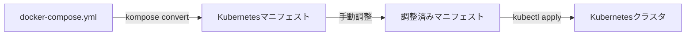
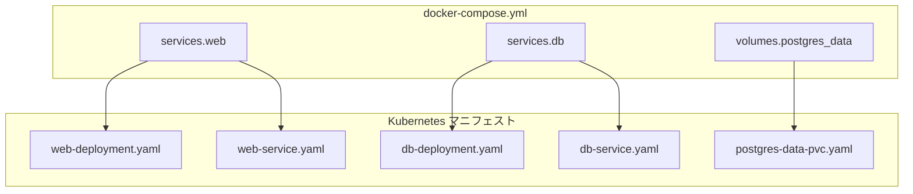
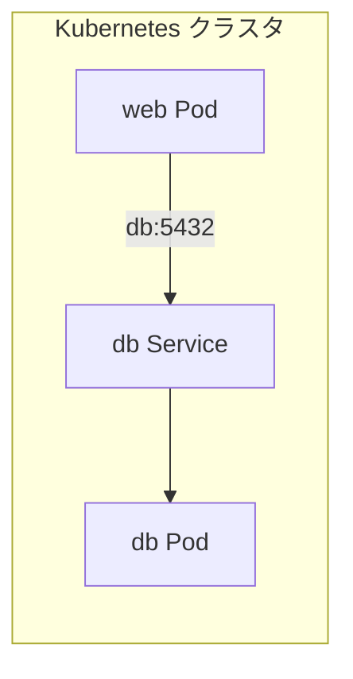
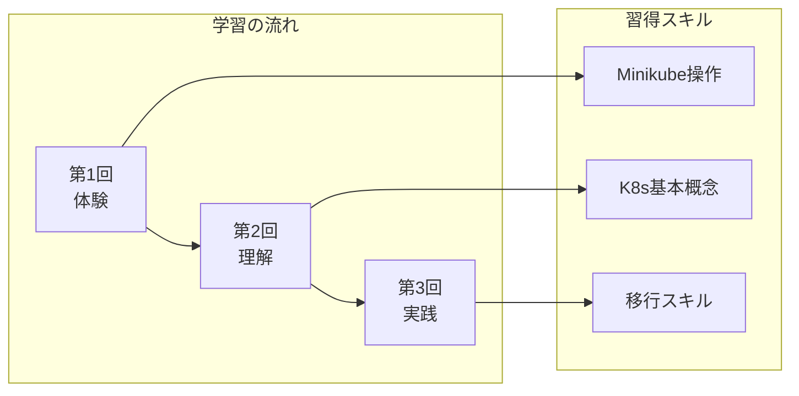
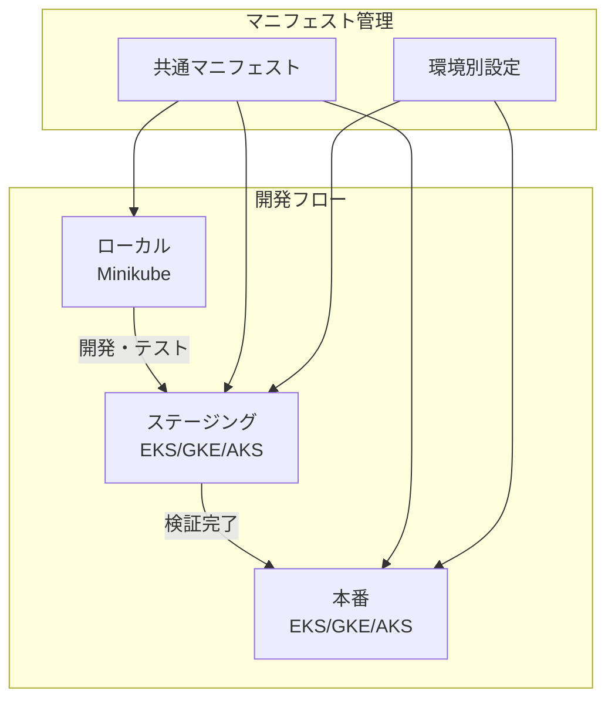

## 今回のゴール

シリーズ最終回となる今回は、docker-compose.ymlで管理しているアプリケーションをKubernetesに移行します。

以前、[docker-composeを使ったローカル開発](/2017/12/03/025713/)について書きました。docker-composeはシンプルで使いやすく、今でも多くのプロジェクトで活躍しています。しかし、本番環境でKubernetesを使用するプロジェクトでは、ローカル開発もKubernetesに統一することで環境差異を減らせます。

### docker-compose.ymlをKubernetesで動かす

docker-composeからKubernetesへの移行は、一見すると大変な作業に思えるかもしれません。しかし、**Kompose**というツールを使えば、既存のdocker-compose.ymlからKubernetesマニフェストを自動生成できます。

移行の全体像は以下の通りです。



自動変換で8割程度のマニフェストが生成され、残りの2割を手動で調整するというのが一般的な流れです。

### 使用するサンプルアプリ

今回は、Webアプリケーション（Flask）とデータベース（PostgreSQL）で構成されるシンプルな2層アーキテクチャを使用します。

まず、サンプルの`app.py`を用意します。

```python
# app/app.py
from flask import Flask
import os

app = Flask(__name__)

@app.route('/')
def hello():
    db_url = os.environ.get('DATABASE_URL', 'not set')
    return f'Hello from Kubernetes! DB: {db_url}'

if __name__ == '__main__':
    app.run(host='0.0.0.0', port=5000)
```

次に、このアプリを動かすためのdocker-compose.ymlです。

```yaml
# docker-compose.yml
version: "3.8"

services:
  web:
    image: python:3.12-slim
    command: >
      sh -c "pip install flask psycopg2-binary &&
             python /app/app.py"
    ports:
      - "5000:5000"
    environment:
      - DATABASE_URL=postgresql://appuser:apppass@db:5432/appdb
      - FLASK_ENV=development
    volumes:
      - ./app:/app
    depends_on:
      - db

  db:
    image: postgres:16
    environment:
      - POSTGRES_USER=appuser
      - POSTGRES_PASSWORD=apppass
      - POSTGRES_DB=appdb
    volumes:
      - postgres_data:/var/lib/postgresql/data
    ports:
      - "5432:5432"

volumes:
  postgres_data:
```

このdocker-compose.ymlには、以下の要素が含まれています。

- **2つのサービス**: webとdbで構成される
- **環境変数**: データベース接続情報を含む
- **ボリューム**: ソースコードのマウントとデータ永続化に使用
- **ポート公開**: アプリケーションとデータベースのポートを公開
- **依存関係**: webはdbに依存する

これらの要素がKubernetesでどのように表現されるかを見ていきましょう。

**前提条件**: 前回までの記事でMinikubeのセットアップが完了していること。まだの方は[第1回の記事](/kubernetes-local-part1/)を先にご覧ください。

**注意**: 以降のコマンド例では、`alias kubectl="minikube kubectl --"` が設定されている前提で記載しています。エイリアスを設定していない場合は、`kubectl` を `minikube kubectl --` に読み替えてください。

## Komposeで自動変換

### Komposeのインストール

Komposeは、docker-compose.ymlをKubernetesマニフェストに変換する公式ツールです。お使いのOSに合わせてインストールしてください。

**macOS（Homebrew）**

```bash
brew install kompose
```

**Windows（Chocolatey）**

```powershell
choco install kubernetes-kompose
```

**Linux（x86-64）**

```bash
curl -L https://github.com/kubernetes/kompose/releases/download/v1.34.0/kompose-linux-amd64 -o kompose
chmod +x kompose
sudo mv kompose /usr/local/bin/kompose
```

インストール後、バージョンを確認します。

```bash
kompose version
```

```
1.34.0 (cbf2c96b5)
```

### 変換コマンドの実行

docker-compose.ymlがあるディレクトリで、以下のコマンドを実行します。

```bash
kompose convert
```

以下のような出力が表示されます。

```
INFO Kubernetes file "db-service.yaml" created
INFO Kubernetes file "web-service.yaml" created
INFO Kubernetes file "db-deployment.yaml" created
INFO Kubernetes file "web-deployment.yaml" created
INFO Kubernetes file "postgres-data-persistentvolumeclaim.yaml" created
```

Komposeが自動的にDeployment、Service、PersistentVolumeClaimを生成しました。

### 生成ファイルの確認

生成されたファイルを確認してみましょう。

```bash
ls -la *.yaml
```

```
-rw-r--r-- 1 user user  432 Dec 30 10:00 db-deployment.yaml
-rw-r--r-- 1 user user  214 Dec 30 10:00 db-service.yaml
-rw-r--r-- 1 user user  198 Dec 30 10:00 postgres-data-persistentvolumeclaim.yaml
-rw-r--r-- 1 user user  521 Dec 30 10:00 web-deployment.yaml
-rw-r--r-- 1 user user  214 Dec 30 10:00 web-service.yaml
```

5つのファイルが生成されました。それぞれの役割は以下の通りです。

| ファイル | 役割 |
|---------|------|
| `db-deployment.yaml` | PostgreSQLのDeployment定義を格納 |
| `db-service.yaml` | PostgreSQLへのアクセス用Serviceを定義 |
| `web-deployment.yaml` | FlaskアプリのDeployment定義を格納 |
| `web-service.yaml` | Flaskアプリへのアクセス用Serviceを定義 |
| `postgres-data-persistentvolumeclaim.yaml` | データ永続化用のPVCを定義 |

## 生成されたファイルを理解する

### docker-compose.ymlとの対応関係

生成されたファイルとdocker-compose.ymlの対応関係を図で確認しましょう。



docker-composeでは1つの`services`定義で済んでいたものが、Kubernetesでは「Deployment + Service」の2つに分かれています。[第2回の記事](/kubernetes-local-part2/)で学んだように、Deploymentはコンテナの実行を管理し、Serviceはネットワークアクセスを提供するためです。

生成されたDeploymentの例を見てみましょう。

**db-deployment.yaml**

```yaml
apiVersion: apps/v1
kind: Deployment
metadata:
  labels:
    io.kompose.service: db
  name: db
spec:
  replicas: 1
  selector:
    matchLabels:
      io.kompose.service: db
  template:
    metadata:
      labels:
        io.kompose.service: db
    spec:
      containers:
        - env:
            - name: POSTGRES_DB
              value: appdb
            - name: POSTGRES_PASSWORD
              value: apppass
            - name: POSTGRES_USER
              value: appuser
          image: postgres:16
          name: db
          ports:
            - containerPort: 5432
          volumeMounts:
            - mountPath: /var/lib/postgresql/data
              name: postgres-data
      restartPolicy: Always
      volumes:
        - name: postgres-data
          persistentVolumeClaim:
            claimName: postgres-data
```

docker-compose.ymlで定義した環境変数、イメージ、ポート、ボリュームが適切に変換されています。

### 変換されなかった部分

Komposeは非常に便利ですが、すべてを完璧に変換できるわけではありません。以下の要素は変換されないか、調整が必要です。

| 要素 | 変換状況 | 対応方法 |
|------|---------|---------|
| `depends_on` | 変換されない | initContainerまたはreadinessProbeで対応 |
| `build` | 変換されない | 事前にイメージをビルドしてレジストリにプッシュ |
| ホストボリューム（`./app:/app`） | 変換されるがMinikubeでは動作しない | hostPathまたはミラーリングで対応 |
| `restart: always` | Deploymentの標準動作 | 自動的に対応済み |
| カスタムネットワーク | 変換されない | Kubernetesのネットワークモデルで自動対応 |

特に注意が必要なのは`depends_on`です。docker-composeでは「dbが起動してからwebを起動」という依存関係を定義できましたが、Kubernetesではこの順序制御は行われません。代わりに、アプリケーション側で接続リトライを実装するか、initContainerを使ってデータベースの起動を待つ必要があります。

## 手動で調整が必要な箇所

### ボリュームの扱い

docker-composeでは、ホストのディレクトリを直接マウントすることが一般的です。

```yaml
# docker-compose.yml
volumes:
  - ./app:/app  # ホストの./appをコンテナの/appにマウント
```

しかし、Kubernetesでは状況が異なります。Minikubeは仮想マシンまたはコンテナ内で動作するため、ホストのファイルシステムに直接アクセスできません。

**解決策1: minikube mount を使用**

Minikubeには、ホストのディレクトリをクラスタ内にマウントする機能があります。

```bash
# ターミナルで実行（このプロセスを維持する必要がある）
minikube mount ./app:/mnt/app
```

そして、マニフェストで`hostPath`を使用します。

```yaml
# web-deployment.yaml に追加
spec:
  containers:
    - name: web
      volumeMounts:
        - name: app-code
          mountPath: /app
  volumes:
    - name: app-code
      hostPath:
        path: /mnt/app
        type: Directory
```

**解決策2: ConfigMapを使用（小さなファイルの場合）**

設定ファイルなど小さなファイルであれば、ConfigMapとして管理できます。

```bash
kubectl create configmap app-code --from-file=app.py
```

**解決策3: イメージにコードを含める（本番向け）**

本番環境では、アプリケーションコードをDockerイメージに含めるのが一般的です。

```dockerfile
FROM python:3.12-slim
COPY ./app /app
RUN pip install flask psycopg2-binary
CMD ["python", "/app/app.py"]
```

今回のハンズオンでは、シンプルにするためにイメージにコードを含める方法を採用します。

### 環境変数の移行

生成されたマニフェストでは、環境変数がそのままDeploymentに含まれています。

```yaml
env:
  - name: POSTGRES_PASSWORD
    value: apppass  # 平文でパスワードが記載されている
```

これは開発環境では問題ありませんが、本番環境ではセキュリティ上の問題があります。**Secret**を使用して機密情報を分離しましょう。

**Secretの作成**

```bash
kubectl create secret generic db-credentials \
  --from-literal=POSTGRES_USER=appuser \
  --from-literal=POSTGRES_PASSWORD=apppass \
  --from-literal=POSTGRES_DB=appdb
```

**Deploymentでの参照**

```yaml
# db-deployment.yaml を修正
spec:
  containers:
    - name: db
      env:
        - name: POSTGRES_USER
          valueFrom:
            secretKeyRef:
              name: db-credentials
              key: POSTGRES_USER
        - name: POSTGRES_PASSWORD
          valueFrom:
            secretKeyRef:
              name: db-credentials
              key: POSTGRES_PASSWORD
        - name: POSTGRES_DB
          valueFrom:
            secretKeyRef:
              name: db-credentials
              key: POSTGRES_DB
```

docker-composeの`env_file`に相当する機能として、**ConfigMap**と**Secret**を使い分けます。

| docker-compose | Kubernetes | 用途 |
|---------------|------------|------|
| `environment:` | `env:` | 環境変数を直接指定 |
| `env_file:` | ConfigMap | 機密でない設定値 |
| `env_file:`（機密情報） | Secret | パスワード、APIキーなど |

### ネットワーク設定

docker-composeでは、同じネットワーク内のサービスはサービス名で通信できます。

```yaml
# docker-compose.yml
environment:
  - DATABASE_URL=postgresql://appuser:apppass@db:5432/appdb
```

Kubernetesでも同様に、**Service名で他のPodにアクセス**できます。これはKubernetesのDNSサービスディスカバリ機能によるものです。



Komposeが生成したServiceを確認します。

**db-service.yaml**

```yaml
apiVersion: v1
kind: Service
metadata:
  labels:
    io.kompose.service: db
  name: db
spec:
  ports:
    - port: 5432
      targetPort: 5432
  selector:
    io.kompose.service: db
```

Service名が`db`なので、webアプリからは`db:5432`でアクセスできます。docker-composeと同じ感覚で使えます。

ただし、外部からのアクセスには注意が必要です。

| docker-compose | Kubernetes | 説明 |
|---------------|------------|------|
| `ports: ["5000:5000"]` | Service type: ClusterIP | クラスタ内部のみアクセス可 |
| `ports: ["5000:5000"]` | Service type: NodePort | ノードのIPでアクセス可 |
| `ports: ["5000:5000"]` | Service type: LoadBalancer | ロードバランサー経由（クラウド向け） |

開発環境ではNodePortを使用します。web-service.yamlを修正しましょう。

```yaml
# web-service.yaml を修正
apiVersion: v1
kind: Service
metadata:
  name: web
spec:
  type: NodePort  # ClusterIPからNodePortに変更
  ports:
    - port: 5000
      targetPort: 5000
  selector:
    io.kompose.service: web
```

## デプロイして動作確認

### kubectl apply -f の実行

調整が完了したら、すべてのマニフェストを適用します。まず、Minikubeが起動していることを確認しましょう。

```bash
minikube status
```

停止している場合は起動します。

```bash
minikube start
```

Secretを作成します。

```bash
kubectl create secret generic db-credentials \
  --from-literal=POSTGRES_USER=appuser \
  --from-literal=POSTGRES_PASSWORD=apppass \
  --from-literal=POSTGRES_DB=appdb
```

マニフェストを適用します。

```bash
kubectl apply -f .
```

```
deployment.apps/db created
deployment.apps/web created
persistentvolumeclaim/postgres-data created
service/db created
service/web created
```

### ログでトラブルシューティング

リソースの状態を確認します。

```bash
kubectl get all
```

```
NAME                       READY   STATUS    RESTARTS   AGE
pod/db-7b9f8c6d4-abc12     1/1     Running   0          30s
pod/web-5d5dd5f5f9-def34   1/1     Running   0          30s

NAME                 TYPE        CLUSTER-IP      EXTERNAL-IP   PORT(S)          AGE
service/db           ClusterIP   10.96.123.45    <none>        5432/TCP         30s
service/kubernetes   ClusterIP   10.96.0.1       <none>        443/TCP          1d
service/web          NodePort    10.96.67.89     <none>        5000:31234/TCP   30s

NAME                  READY   UP-TO-DATE   AVAILABLE   AGE
deployment.apps/db    1/1     1            1           30s
deployment.apps/web   1/1     1            1           30s
```

すべてのPodが`Running`状態であれば成功です。

もし問題がある場合は、以下のコマンドでログを確認します。

```bash
# Podのログを確認
kubectl logs -l io.kompose.service=web

# Podの詳細情報を確認
kubectl describe pod -l io.kompose.service=web
```

よくあるエラーと対処法を以下にまとめます。

| エラー | 原因 | 対処法 |
|-------|------|--------|
| `ImagePullBackOff` | イメージが見つからない | イメージ名とタグを確認する |
| `CrashLoopBackOff` | コンテナが起動直後にクラッシュ | `kubectl logs`でエラーを確認する |
| `Pending` | PVCがバインドされない | `kubectl get pvc`でPVCの状態を確認する |
| 接続エラー | Service名が間違っている | 環境変数のホスト名がService名と一致しているか確認する |

### 正常動作の確認

webサービスにアクセスしてみましょう。

```bash
minikube service web
```

ブラウザが開き、アプリケーションが表示されれば成功です。

URLだけを取得したい場合は以下のコマンドを使います。

```bash
minikube service web --url
```

```
http://192.168.49.2:31234
```

curlで確認することもできます。

```bash
curl $(minikube service web --url)
```

**おめでとうございます！** docker-compose.ymlで管理していたアプリケーションが、Kubernetesで動作するようになりました。

### 後片付け

ハンズオンが終わったら、リソースを後片付けしましょう。

**作成したリソースの削除**

```bash
kubectl delete -f .
kubectl delete secret db-credentials
```

**クラスタの停止**（後で再開可能）

```bash
minikube stop
```

**クラスタの完全削除**（最初からやり直したい場合）

```bash
minikube delete
```

## シリーズ完結

### 3回で身についたこと

全3回のシリーズを通じて、以下のスキルを習得しました。

**第1回: Minikubeで5分Kubernetes体験**

- Minikubeのインストールとクラスタ起動を実行できる
- コマンド一発でコンテナをデプロイできる
- Kubernetesダッシュボードを活用できる

**第2回: Pod・Deployment・Serviceの理解**

- Podの概念とコンテナとの違いを理解できる
- Deploymentによる自動復旧とスケーリングを実行できる
- ServiceによるPodへのアクセスを設定できる
- YAMLマニフェストを読み書きできる

**第3回: docker-composeからの移行**（本記事）

- Komposeによる自動変換を実行できる
- ボリューム、環境変数、ネットワークの調整ができる
- Secretによる機密情報の管理ができる
- デプロイとトラブルシューティングができる



### Kubernetesをもっと学ぶには

Kubernetesの世界はまだまだ広がっています。次のステップとして、以下のトピックを学ぶことをお勧めします。

**Helm - パッケージマネージャー**

Helmを使うと、複雑なアプリケーションを1つのコマンドでデプロイできます。複数のマニフェストファイルをチャートとしてまとめ、パラメータ化することで再利用性が向上します。



**GitOps - 宣言的なデプロイ管理**

ArgoCD や Flux を使った GitOps を導入すると、Gitリポジトリの変更が自動的にクラスタに反映されます。「Gitにプッシュすればデプロイ完了」という開発フローが実現できます。



**Ingress - 高度なルーティング**

NodePortの代わりにIngressを使うと、ドメイン名やパスベースのルーティングが可能になります。本番環境では必須の機能です。



### 実務での活用に向けて

ローカル環境でKubernetesの基礎を習得したら、次はクラウド環境への展開を検討しましょう。

**主要なマネージドKubernetesサービス**

- **Amazon EKS**: AWS上で動作するKubernetes
- **Google GKE**: Google Cloud上で動作するKubernetes
- **Azure AKS**: Microsoft Azure上で動作するKubernetes

これらのサービスを使えば、クラスタの管理はクラウドプロバイダーに任せ、アプリケーションの開発に集中できます。

**ローカル環境との使い分け**



ローカルで動いたマニフェストは、そのままクラウド環境でも使えます。環境変数やリソース設定は環境ごとに調整しますが、基本的なアーキテクチャは同じです。これこそが「Infrastructure as Code」の真価です。

---

この記事はシリーズ「Kubernetesでローカル環境を構築する」の第3回（最終回）です。

- **第1回**: [Minikubeで5分Kubernetes体験](/kubernetes-local-part1/)
- **第2回**: [動かして学ぶKubernetes入門](/kubernetes-local-part2/)
- **第3回**: docker-composeからKubernetes移行（本記事）

docker-composeを使ったローカル開発から始まり、Kubernetesへの移行まで完走しました。[過去のdocker-compose記事](/2017/12/03/025713/)から約7年、コンテナ技術は大きく進化しました。ぜひKubernetesを活用して、モダンな開発環境を構築してください。

## 参考リンク






