# Mooでハンドラクラスを実装する - Moo::Roleによる拡張可能な設計【Perl】

> **この記事は「ログ監視と多段アラート判定 - Chain of Responsibilityパターン実践」シリーズの第2回です。**  
> Perl 5.36+とMooを使って、実務で使える保守性の高いログ監視システムを段階的に構築していきます。

## この記事で学べること

- ✅ Mooの基本とクラス設計の実践的な手法
- ✅ Moo::Roleによるインターフェース定義の重要性
- ✅ if/elseスパゲッティからハンドラクラスへのリファクタリング
- ✅ 拡張可能で保守性の高い設計パターン

## 想定読者

- Perlの基本構文を理解しており、OOPの基礎知識がある方
- 前回記事でif/else実装の問題点を理解した方
- Mooを使ったクラス設計に興味がある方
- 保守性の高いコード設計を学びたい実務者

---

## はじめに：前回の振り返りと本記事の位置づけ

前回の記事では、ログ監視システムの要件定義と基本設計を行いました。ERROR/WARN/INFOのログレベルに応じてPagerDuty、Slack、データベースへ振り分ける基本的な実装を紹介しましたね。

```perl
# 前回実装したシンプルな振り分けロジック
sub route_alert($log_entry) {
    my $severity = $log_entry->{severity};
    
    if ($severity >= LOG_ERROR) {
        send_to_pagerduty($log_entry);
        send_to_slack($log_entry, channel => '#alerts-critical');
        save_to_database($log_entry);
    }
    elsif ($severity >= LOG_WARN) {
        send_to_slack($log_entry, channel => '#alerts-warning');
        save_to_database($log_entry);
    }
    elsif ($severity >= LOG_INFO) {
        save_to_database($log_entry);
    }
}
```

この実装、動作はしますが...問題が見えてきませんか？

### 連載の構成（再掲）

| 回数 | タイトル | 内容 |
|-----|---------|-----|
| 第1回 | 要件定義と基本設計 | ログレベルとアラートルーティングの基本を実装 |
| **第2回（本記事）** | **Mooでハンドラクラス実装** | **Moo/Moo::Roleによるクラス設計** |
| 第3回 | Chain of Responsibility適用 | ハンドラチェーンで処理を連結し完成 |

---

## 1. if/elseの問題点：保守性・拡張性の課題

前回のコードは一見シンプルですが、実務では深刻な問題を抱えています。

### 1.1 具体的な問題シナリオ

想像してください。運用開始から3ヶ月後、こんな要望が来ます：

1. **「データベースエラーはJiraにも通知してください」**
2. **「ネットワークエラーだけメールでも送りたい」**
3. **「WARN以上はSlack通知前にメッセージを整形したい」**
4. **「特定のエラーコードはPagerDutyじゃなくTeamsに送って」**

すると、コードはこうなります：

```perl
sub route_alert($log_entry) {
    my $severity = $log_entry->{severity};
    my $message  = $log_entry->{message};
    
    # ERRORレベルの処理
    if ($severity >= LOG_ERROR) {
        # データベースエラーはJiraにも
        if ($message =~ /database/i) {
            send_to_pagerduty($log_entry);
            send_to_slack($log_entry, channel => '#alerts-critical');
            send_to_jira($log_entry);  # 新規追加
            save_to_database($log_entry);
        }
        # ネットワークエラーはメールも
        elsif ($message =~ /network/i) {
            send_to_pagerduty($log_entry);
            send_to_slack($log_entry, channel => '#alerts-critical');
            send_email($log_entry);  # 新規追加
            save_to_database($log_entry);
        }
        # 特定エラーコードはTeamsへ
        elsif ($message =~ /CODE-5\d{3}/) {
            send_to_teams($log_entry);  # 新規追加
            save_to_database($log_entry);
        }
        # その他のERROR
        else {
            send_to_pagerduty($log_entry);
            send_to_slack($log_entry, channel => '#alerts-critical');
            save_to_database($log_entry);
        }
    }
    # WARNレベルの処理
    elsif ($severity >= LOG_WARN) {
        my $formatted = format_message($log_entry);  # 新規追加
        send_to_slack($formatted, channel => '#alerts-warning');
        save_to_database($log_entry);
    }
    # 以下略...
}
```

**うわぁ...** これが典型的な「if/elseスパゲッティ」です。🍝

### 1.2 何が問題なのか？

#### 問題1：単一責任の原則（SRP）違反

`route_alert()`関数が**全ての判定と通知を一手に担当**しています：

- ログレベルの判定
- メッセージパターンのマッチング
- 各通知先の選択
- 通知の実行
- データベース保存

これらは本来、別々の責任であるべきです。

#### 問題2：開放閉鎖の原則（OCP）違反

新しい通知先を追加するたびに、**既存のコードを修正**する必要があります：

- ✅ 新機能追加に「開いている」べき
- ❌ 既存コード修正に「閉じている」べき

しかし現状は逆になっています。

#### 問題3：テストの困難性

条件分岐ごとにテストケースが必要です：

```perl
# こんなテストを書く羽目に...
subtest 'Database error routing' => sub {
    # データベースエラーのテスト
};

subtest 'Network error routing' => sub {
    # ネットワークエラーのテスト
};

subtest 'CODE-5xxx error routing' => sub {
    # 特定コードのテスト
};

# エンドレス...
```

各通知先のモック化も複雑になり、テストコードの保守コストが激増します。

#### 問題4：可読性の低下

ネストが深くなり、**どのパスで何が実行されるか**が直感的に分かりません。新しく参加したメンバーは読解に時間がかかります。

### 1.3 Before/After設計の比較図

以下の図は、if/elseスパゲッティからハンドラクラス設計へのリファクタリングによる構造の変化を示しています：

```mermaid
graph TB
    subgraph "Before: if/else スパゲッティ"
        A[route_alert関数] --> B{severity >= ERROR?}
        B -->|Yes| C[PagerDuty送信]
        B -->|Yes| D[Slack送信 #critical]
        B -->|Yes| E[DB保存]
        B -->|No| F{severity >= WARN?}
        F -->|Yes| G[Slack送信 #warning]
        F -->|Yes| H[DB保存]
        F -->|No| I{severity >= INFO?}
        I -->|Yes| J[DB保存]
        
        style A fill:#ff6b6b,stroke:#c92a2a,color:#fff
        style B fill:#ffd43b,stroke:#fab005
        style F fill:#ffd43b,stroke:#fab005
        style I fill:#ffd43b,stroke:#fab005
    end
    
    subgraph "After: ハンドラクラス設計"
        K[process_log関数] --> L[ハンドラリストループ]
        L --> M[PagerDutyNotifier<br/>can_handle & notify]
        L --> N[SlackNotifier<br/>can_handle & notify]
        L --> O[DatabaseSaver<br/>can_handle & notify]
        
        M -.-> M1[自己判断:<br/>ERROR以上のみ処理]
        N -.-> N1[自己判断:<br/>WARN以上のみ処理]
        O -.-> O1[自己判断:<br/>全て処理]
        
        style K fill:#51cf66,stroke:#2f9e44,color:#fff
        style L fill:#51cf66,stroke:#2f9e44,color:#fff
        style M fill:#74c0fc,stroke:#1c7ed6,color:#fff
        style N fill:#74c0fc,stroke:#1c7ed6,color:#fff
        style O fill:#74c0fc,stroke:#1c7ed6,color:#fff
    end
```



**図の見方：**

- **Before（上段）**: 1つの関数内に全ての判定ロジックと処理が詰め込まれ、複雑な条件分岐が発生
- **After（下段）**: シンプルなループ処理で、各ハンドラが自己判断して処理を実行
- **赤系**: 問題のある設計（単一責任違反、拡張性低）
- **緑/青系**: 改善された設計（責任分離、拡張性高）

この設計変更により、新しい通知先の追加は「リストに追加するだけ」となり、既存コードの修正が不要になります。

---

## 2. Mooとは：Perlの軽量OOPシステム

### 2.1 Mooの基本

**Moo（Minimalist Object Orientation）**は、Perlのための軽量なオブジェクト指向システムです。

```perl
package Person;
use Moo;

has name => (
    is       => 'ro',      # read-only
    required => 1,         # 必須属性
);

has age => (
    is      => 'rw',       # read-write
    default => 0,          # デフォルト値
);

sub greet($self) {
    say "Hello, I'm " . $self->name;
}

1;
```

**使用例：**

```perl
use Person;

my $person = Person->new(name => 'Alice', age => 30);
$person->greet;  # Hello, I'm Alice
say $person->age;  # 30
$person->age(31);  # 年齢を更新
```

**Perlらしいポイント！** 🎯

- `has`でアクセサが自動生成される（ゲッター/セッター不要！）
- `is => 'ro'`で不変オブジェクトを簡単に作れる
- シグネチャ（`sub method($self) { ... }`）がPerl 5.36+で標準対応

### 2.2 MooseとMooの違い

| 特徴 | Moose | Moo |
|-----|-------|-----|
| 機能性 | 非常に豊富 | 必要十分 |
| 起動速度 | 遅い | **高速** |
| メモリ使用量 | 多い | **少ない** |
| 型制約 | ビルトイン | `Types::Standard`で対応 |
| 適用場面 | 大規模システム | **スクリプト・中規模** |

**ログ監視スクリプトにはMooが最適！**

- 起動時間が重要（cron実行やリアルタイム監視）
- 機能はシンプルで十分
- メモリフットプリントを小さく保ちたい

### 2.3 なぜクラス設計が必要か？

前回のif/elseスパゲッティと比較して、クラス設計のメリットを見てみましょう：

| 観点 | if/else方式 | クラス設計 |
|-----|-----------|----------|
| **責任の分離** | 全て1つの関数 | 各クラスが単一責任 |
| **拡張性** | 既存コード修正必須 | 新クラス追加のみ |
| **テスト** | 複雑な条件網羅 | クラス単位でシンプル |
| **再利用** | 困難 | 容易 |
| **可読性** | ネストで分かりにくい | クラス名で意図明確 |

---

## 3. Moo::Roleの活用：インターフェース定義の重要性

### 3.1 Roleとは何か？

**Role（ロール）**は「振る舞いの共有」を表現する仕組みです。

- **継承（is-a）**: 「PersonはAnimalである」
- **Role（can-do）**: 「Personは歩くことができる」

ログ監視システムでは：

- **継承**: 「SlackNotifierはNotifierである」
- **Role**: 「SlackNotifierは通知できる（Notifiable）」

Roleの方が柔軟で、複数の振る舞いを組み合わせやすいのです！

### 3.2 Moo::Roleでインターフェース定義

**通知ハンドラの共通インターフェースを定義しましょう：**

```perl
package NotifierRole;
use v5.36;
use Moo::Role;

# 必須メソッドの宣言
requires 'notify';

# 共通の属性
has enabled => (
    is      => 'ro',
    default => 1,
);

# 共通のメソッド
sub should_notify($self, $log_entry) {
    return 0 unless $self->enabled;
    return $self->can_handle($log_entry);
}

# サブクラスで実装すべきメソッド
sub can_handle($self, $log_entry) {
    die "can_handle() must be implemented by the consuming class";
}

1;
```

**ポイント解説：**

1. **`requires 'notify'`**: Roleを使うクラスは必ず`notify()`を実装しなければならない
2. **共通属性**: `enabled`フラグで通知の有効/無効を制御
3. **共通メソッド**: `should_notify()`で通知判定のロジックを共通化
4. **抽象メソッド**: `can_handle()`は各クラスで実装する

### 3.3 Roleのメリット

#### メリット1：強制されるインターフェース

```perl
package BrokenNotifier;
use Moo;
with 'NotifierRole';

# notify()を実装し忘れた！

1;
```

**実行時エラー：**

```
Can't apply NotifierRole to BrokenNotifier - missing notify
```

これにより、**実装漏れを防止**できます。Perlでもインターフェースの恩恵が受けられるんです！ 🎉

#### メリット2：複数Roleの組み合わせ

```perl
package SlackNotifier;
use Moo;

with 'NotifierRole';      # 通知機能
with 'LoggableRole';      # ログ記録機能
with 'RetryableRole';     # リトライ機能

# 3つの振る舞いを同時に持つ！
```

継承だと単一の親クラスしか持てませんが、Roleなら複数の振る舞いを組み合わせられます。

### 3.4 Moo::Roleとハンドラクラスの関係図

以下のクラス図は、Moo::Roleによるインターフェース定義と、各ハンドラクラスの実装関係を示しています：

```mermaid
classDiagram
    class NotifierRole {
        <<interface>>
        +enabled: bool
        +notify(log_entry)* 
        +should_notify(log_entry): bool
        +can_handle(log_entry): bool
    }
    
    class SlackNotifier {
        +webhook_url: string
        +channel: string
        +http_client: HTTP::Tiny
        +notify(log_entry): bool
        +can_handle(log_entry): bool
        +format_message(log_entry): string
    }
    
    class PagerDutyNotifier {
        +integration_key: string
        +api_endpoint: string
        +http_client: HTTP::Tiny
        +notify(log_entry): bool
        +can_handle(log_entry): bool
        +map_severity(severity): string
    }
    
    class DatabaseSaver {
        +dsn: string
        +username: string
        +password: string
        +dbh: DBI
        +notify(log_entry): bool
        +can_handle(log_entry): bool
    }
    
    class TeamsNotifier {
        <<future>>
        +webhook_url: string
        +notify(log_entry): bool
        +can_handle(log_entry): bool
    }
    
    NotifierRole <|.. SlackNotifier : implements (with)
    NotifierRole <|.. PagerDutyNotifier : implements (with)
    NotifierRole <|.. DatabaseSaver : implements (with)
    NotifierRole <|.. TeamsNotifier : implements (with)
    
    note for NotifierRole "requires 'notify'で\nメソッド実装を強制"
    note for SlackNotifier "severity >= 3\n(WARN以上)を処理"
    note for PagerDutyNotifier "severity >= 4\n(ERROR以上)を処理"
    note for DatabaseSaver "全てのログを\n処理（保存）"
    note for TeamsNotifier "拡張例:\n新ハンドラ追加が容易"
```



**図の見方：**

- **NotifierRole（インターフェース）**: `requires 'notify'`により、全てのハンドラクラスが`notify()`メソッドの実装を強制される
- **点線矢印（implements）**: Moo::Roleの`with`キーワードによる実装関係
- **各ハンドラクラス**: NotifierRoleを実装し、独自の属性と処理ロジックを持つ
- **TeamsNotifier（破線）**: 将来の拡張例。新しいハンドラも同じインターフェースに従うだけで追加可能

この設計により、**全てのハンドラが統一されたインターフェース**を持ち、コードの一貫性と拡張性が保証されます。

---

## 4. ハンドラクラスの実装：具体的な通知ハンドラの作成

それでは、実際にハンドラクラスを実装していきましょう！

### 4.1 Slack通知ハンドラ

```perl
package SlackNotifier;
use v5.36;
use Moo;
use HTTP::Tiny;
use JSON::PP qw(encode_json);

with 'NotifierRole';

has webhook_url => (
    is       => 'ro',
    required => 1,
);

has channel => (
    is      => 'ro',
    default => '#alerts',
);

has http_client => (
    is      => 'lazy',
    default => sub { HTTP::Tiny->new(timeout => 10) },
);

sub can_handle($self, $log_entry) {
    # Slackは全てのERROR/WARNを処理可能
    return $log_entry->{severity} >= 3;  # WARN以上
}

sub notify($self, $log_entry) {
    return unless $self->should_notify($log_entry);
    
    my $message = $self->format_message($log_entry);
    my $payload = encode_json({
        channel => $self->channel,
        text    => $message,
        username => 'LogMonitor',
        icon_emoji => ':rotating_light:',
    });
    
    my $response = $self->http_client->post(
        $self->webhook_url,
        {
            headers => { 'Content-Type' => 'application/json' },
            content => $payload,
        }
    );
    
    unless ($response->{success}) {
        warn "Failed to send Slack notification: $response->{status} $response->{reason}";
        return 0;
    }
    
    say "[SlackNotifier] Sent to " . $self->channel;
    return 1;
}

sub format_message($self, $log_entry) {
    my $emoji = $log_entry->{severity} >= 4 ? ':fire:' : ':warning:';
    return sprintf(
        "%s *[%s]* %s",
        $emoji,
        $log_entry->{level},
        $log_entry->{message}
    );
}

1;
```

**実装のポイント：**

1. **`with 'NotifierRole'`**: Roleを消費（インターフェース実装）
2. **`has webhook_url`**: 必須属性として宣言
3. **`has http_client`**: lazy属性で最初の使用時に生成
4. **`can_handle()`**: WARN以上のログを処理対象とする
5. **`notify()`**: 実際のSlack通知ロジック
6. **`format_message()`**: メッセージ整形を分離

**Perlの魅力！** 🚀

```perl
has http_client => (
    is      => 'lazy',
    default => sub { HTTP::Tiny->new(timeout => 10) },
);
```

この`lazy`属性、素晴らしいです！HTTP::Tinyオブジェクトは実際に`$self->http_client`が呼ばれるまで生成されません。メモリ効率が良く、テスト時のモック化も簡単です。

### 4.2 PagerDuty通知ハンドラ

```perl
package PagerDutyNotifier;
use v5.36;
use Moo;
use HTTP::Tiny;
use JSON::PP qw(encode_json);

with 'NotifierRole';

has integration_key => (
    is       => 'ro',
    required => 1,
);

has api_endpoint => (
    is      => 'ro',
    default => 'https://events.pagerduty.com/v2/enqueue',
);

has http_client => (
    is      => 'lazy',
    default => sub { HTTP::Tiny->new(timeout => 10) },
);

sub can_handle($self, $log_entry) {
    # PagerDutyはERRORのみ（緊急アラート）
    return $log_entry->{severity} >= 4;  # ERROR以上
}

sub notify($self, $log_entry) {
    return unless $self->should_notify($log_entry);
    
    my $payload = encode_json({
        routing_key  => $self->integration_key,
        event_action => 'trigger',
        payload      => {
            summary  => $log_entry->{message},
            severity => $self->map_severity($log_entry->{severity}),
            source   => $log_entry->{source} // 'log-monitor',
            timestamp => $log_entry->{timestamp} // time(),
            custom_details => {
                level => $log_entry->{level},
                raw_message => $log_entry->{raw} // $log_entry->{message},
            },
        },
    });
    
    my $response = $self->http_client->post(
        $self->api_endpoint,
        {
            headers => { 'Content-Type' => 'application/json' },
            content => $payload,
        }
    );
    
    unless ($response->{success}) {
        warn "Failed to send PagerDuty alert: $response->{status} $response->{reason}";
        return 0;
    }
    
    say "[PagerDutyNotifier] Incident created";
    return 1;
}

sub map_severity($self, $severity) {
    return 'critical' if $severity >= 4;
    return 'error'    if $severity >= 3;
    return 'warning'  if $severity >= 2;
    return 'info';
}

1;
```

**設計のポイント：**

1. **ERRORのみ処理**: `can_handle()`でseverity >= 4のみtrueを返す
2. **PagerDuty Events API v2準拠**: 正しいペイロード構造
3. **severity mapping**: ログレベルをPagerDutyの形式に変換
4. **カスタム詳細**: `custom_details`で元のログ情報を保持

### 4.3 データベース保存ハンドラ

```perl
package DatabaseSaver;
use v5.36;
use Moo;
use DBI;

with 'NotifierRole';  # 「保存」も広義の「通知」として扱う

has dsn => (
    is       => 'ro',
    required => 1,
);

has username => (
    is      => 'ro',
    default => '',
);

has password => (
    is      => 'ro',
    default => '',
);

has dbh => (
    is      => 'lazy',
    default => sub ($self) {
        DBI->connect(
            $self->dsn,
            $self->username,
            $self->password,
            { RaiseError => 1, AutoCommit => 1 }
        );
    },
);

sub can_handle($self, $log_entry) {
    # 全てのログを保存対象とする
    return 1;
}

sub notify($self, $log_entry) {
    return unless $self->should_notify($log_entry);
    
    my $sth = $self->dbh->prepare(q{
        INSERT INTO logs (timestamp, level, severity, message, source)
        VALUES (?, ?, ?, ?, ?)
    });
    
    $sth->execute(
        $log_entry->{timestamp} // time(),
        $log_entry->{level},
        $log_entry->{severity},
        $log_entry->{message},
        $log_entry->{source} // 'unknown',
    );
    
    say "[DatabaseSaver] Saved log entry";
    return 1;
}

1;
```

**実装のポイント：**

1. **lazy DBH**: データベース接続は最初の保存時に確立
2. **全ログ保存**: `can_handle()`は常にtrueを返す
3. **シンプルなINSERT**: プレースホルダで安全に挿入

---

## 5. リファクタリング：前回コードをクラスベースに書き換え

それでは、前回のif/elseコードをハンドラクラスで置き換えてみましょう！

### 5.1 Before：if/elseスパゲッティ

```perl
# 前回のコード（再掲）
sub route_alert($log_entry) {
    my $severity = $log_entry->{severity};
    
    if ($severity >= LOG_ERROR) {
        send_to_pagerduty($log_entry);
        send_to_slack($log_entry, channel => '#alerts-critical');
        save_to_database($log_entry);
    }
    elsif ($severity >= LOG_WARN) {
        send_to_slack($log_entry, channel => '#alerts-warning');
        save_to_database($log_entry);
    }
    elsif ($severity >= LOG_INFO) {
        save_to_database($log_entry);
    }
}
```

**問題：**

- 3つのif/elsif分岐
- 各分岐内で複数の処理を呼び出し
- 新しい通知先追加は既存コード修正が必要

### 5.2 After：ハンドラクラスによる実装

```perl
#!/usr/bin/env perl
use v5.36;
use warnings;
use feature 'say';

use SlackNotifier;
use PagerDutyNotifier;
use DatabaseSaver;

# ハンドラの初期化
my $slack_critical = SlackNotifier->new(
    webhook_url => $ENV{SLACK_WEBHOOK_URL},
    channel     => '#alerts-critical',
);

my $slack_warning = SlackNotifier->new(
    webhook_url => $ENV{SLACK_WEBHOOK_URL},
    channel     => '#alerts-warning',
);

my $pagerduty = PagerDutyNotifier->new(
    integration_key => $ENV{PAGERDUTY_KEY},
);

my $db_saver = DatabaseSaver->new(
    dsn => 'dbi:SQLite:dbname=logs.db',
);

# ハンドラのリスト
my @handlers = (
    $pagerduty,
    $slack_critical,
    $slack_warning,
    $db_saver,
);

# ログ処理のメインロジック
sub process_log($log_entry) {
    for my $handler (@handlers) {
        # 各ハンドラは自分で判断して処理する
        $handler->notify($log_entry);
    }
}

# テスト実行
my $error_log = {
    level     => 'ERROR',
    severity  => 4,
    message   => 'Database connection failed',
    timestamp => time(),
};

my $warn_log = {
    level     => 'WARN',
    severity  => 3,
    message   => 'Disk usage at 85%',
    timestamp => time(),
};

say "=== Processing ERROR log ===";
process_log($error_log);

say "\n=== Processing WARN log ===";
process_log($warn_log);
```

**実行結果：**

```
=== Processing ERROR log ===
[PagerDutyNotifier] Incident created
[SlackNotifier] Sent to #alerts-critical
[DatabaseSaver] Saved log entry

=== Processing WARN log ===
[SlackNotifier] Sent to #alerts-warning
[DatabaseSaver] Saved log entry
```

**素晴らしい改善点：** ✨

1. **`process_log()`がシンプル**: ハンドラのリストをループするだけ
2. **各ハンドラが自己判断**: `can_handle()`で処理対象を決定
3. **新しいハンドラ追加が簡単**: リストに追加するだけ
4. **既存コード修正不要**: Open/Closed原則を満たす

### 5.3 改善の実証：新しいハンドラを追加する

「TeamsにもERROR通知したい」という要望が来たら？

**従来（if/else）**: 既存の`route_alert()`を修正する必要がある  
**新方式（ハンドラクラス）**: 新しいクラスを作ってリストに追加するだけ！

```perl
# 新しいTeamsNotifierクラスを作成
package TeamsNotifier;
use v5.36;
use Moo;

with 'NotifierRole';

has webhook_url => (is => 'ro', required => 1);

sub can_handle($self, $log_entry) {
    return $log_entry->{severity} >= 4;  # ERROR以上
}

sub notify($self, $log_entry) {
    return unless $self->should_notify($log_entry);
    
    # Teams通知のロジック
    say "[TeamsNotifier] Sent to Teams";
    return 1;
}

1;
```

**メインコードの変更（1行追加するだけ！）：**

```perl
my $teams = TeamsNotifier->new(
    webhook_url => $ENV{TEAMS_WEBHOOK_URL},
);

my @handlers = (
    $pagerduty,
    $slack_critical,
    $slack_warning,
    $teams,          # ← これだけ追加！
    $db_saver,
);
```

**既存のコードは一切修正していません！** これが**開放閉鎖の原則（OCP）**の実践です。🎯

### 5.4 テストの簡素化

**従来のテスト（if/else）：**

```perl
# 複雑な条件網羅テスト
subtest 'ERROR with database error' => sub { ... };
subtest 'ERROR with network error' => sub { ... };
subtest 'WARN routing' => sub { ... };
# 分岐ごとにテストケース...
```

**新方式のテスト（ハンドラクラス）：**

```perl
# SlackNotifierのテスト
use Test2::V0;
use SlackNotifier;

subtest 'SlackNotifier handles WARN and above' => sub {
    my $notifier = SlackNotifier->new(
        webhook_url => 'http://test.local',
        enabled     => 1,
    );
    
    # ERRORは処理対象
    ok $notifier->can_handle({ severity => 4 }), 'Handles ERROR';
    
    # WARNは処理対象
    ok $notifier->can_handle({ severity => 3 }), 'Handles WARN';
    
    # INFOは処理対象外
    ok !$notifier->can_handle({ severity => 2 }), 'Ignores INFO';
};

done_testing;
```

**各クラスを独立してテストできる！** これがクラス設計の真骨頂です。

---

## 6. 設計のベストプラクティス

### 6.1 単一責任の原則（SRP）

各ハンドラは**1つの責任だけ**を持ちます：

- `SlackNotifier`: Slack通知
- `PagerDutyNotifier`: PagerDuty通知
- `DatabaseSaver`: データベース保存

これにより：

- コードが読みやすい
- 変更の影響範囲が限定される
- テストが書きやすい

### 6.2 依存性注入（DI）

```perl
my $notifier = SlackNotifier->new(
    webhook_url => $ENV{SLACK_WEBHOOK_URL},
    http_client => $mock_http_client,  # テスト時にモック注入
);
```

外部依存（HTTP::Tiny、DBI）をコンストラクタで注入可能にすることで、テストが容易になります。

### 6.3 設定の外部化

```perl
# ハードコードしない
has webhook_url => (
    is       => 'ro',
    required => 1,  # 外部から必ず渡す
);

# 使用時
my $notifier = SlackNotifier->new(
    webhook_url => $ENV{SLACK_WEBHOOK_URL},  # 環境変数から取得
);
```

これにより、環境（開発/ステージング/本番）ごとに設定を切り替えられます。

### 6.4 エラーハンドリング

```perl
sub notify($self, $log_entry) {
    return unless $self->should_notify($log_entry);
    
    my $response = $self->http_client->post(...);
    
    unless ($response->{success}) {
        warn "Failed to send notification: $response->{status}";
        return 0;  # 失敗を返す
    }
    
    return 1;  # 成功を返す
}
```

通知の成功/失敗を呼び出し側に返すことで、リトライ処理や別の通知手段へのフォールバックが可能になります。

### 6.5 ハンドラの拡張性を示す設計図

以下の図は、Open/Closed原則に基づいた拡張可能な設計を示しています：

```mermaid
graph LR
    subgraph "コア設計（変更不要）"
        A[NotifierRole<br/>インターフェース] -.defines.-> B[notify<br/>can_handle<br/>should_notify]
        C[process_log<br/>メインロジック] --> D[ハンドラリスト<br/>@handlers]
    end
    
    subgraph "既存ハンドラ（変更不要）"
        E1[PagerDutyNotifier]
        E2[SlackNotifier]
        E3[DatabaseSaver]
    end
    
    subgraph "新規追加ハンドラ（拡張）"
        F1[TeamsNotifier]:::new
        F2[EmailNotifier]:::new
        F3[JiraNotifier]:::new
    end
    
    A -.-> E1
    A -.-> E2
    A -.-> E3
    A -.-> F1
    A -.-> F2
    A -.-> F3
    
    D --> E1
    D --> E2
    D --> E3
    D -.add to list.-> F1
    D -.add to list.-> F2
    D -.add to list.-> F3
    
    style A fill:#845ef7,stroke:#5f3dc4,color:#fff
    style C fill:#51cf66,stroke:#2f9e44,color:#fff
    style D fill:#51cf66,stroke:#2f9e44,color:#fff
    style E1 fill:#74c0fc,stroke:#1c7ed6,color:#fff
    style E2 fill:#74c0fc,stroke:#1c7ed6,color:#fff
    style E3 fill:#74c0fc,stroke:#1c7ed6,color:#fff
    
    classDef new fill:#ffd43b,stroke:#fab005,color:#000
```

**Open/Closed原則の実践：**

1. **拡張に対して開いている**:
   - 新しいハンドラクラス（TeamsNotifier、EmailNotifier、JiraNotifier）を作成
   - NotifierRoleを`with`で実装するだけ
   - `@handlers`リストに追加するだけ

2. **修正に対して閉じている**:
   - コア設計（NotifierRole、process_log）は変更不要
   - 既存ハンドラ（PagerDutyNotifier、SlackNotifier、DatabaseSaver）も変更不要
   - テストコードも既存部分は修正不要

3. **実装の容易さ**:
   ```perl
   # 新しいハンドラを追加する場合
   my $email = EmailNotifier->new(...);
   push @handlers, $email;  # たったこれだけ！
   ```

この設計により、**システムの成長に応じて機能を追加しても、既存コードの品質を保ちながら拡張できます**。

---

## 7. まとめと次回予告

### 7.1 本記事で学んだこと

1. **if/elseスパゲッティの問題点**
   - 単一責任の原則違反
   - 開放閉鎖の原則違反
   - テストの困難性
   - 可読性の低下

2. **Mooによるクラス設計**
   - `has`による属性定義
   - lazy属性による効率的な初期化
   - シグネチャによる明確なメソッド定義

3. **Moo::Roleによるインターフェース定義**
   - `requires`で必須メソッドを強制
   - 共通の振る舞いをRoleで共有
   - 複数Roleの組み合わせが可能

4. **ハンドラクラスの実装**
   - 各ハンドラが単一責任を持つ
   - `can_handle()`で処理対象を自己判断
   - 新しいハンドラの追加が容易

5. **リファクタリングの実践**
   - if/elseからハンドラクラスへの移行
   - 拡張性と保守性の劇的な向上
   - テストの簡素化

### 7.2 現時点の設計の課題

実はまだ改善の余地があります：

```perl
# 現在の実装
sub process_log($log_entry) {
    for my $handler (@handlers) {
        $handler->notify($log_entry);
    }
}
```

この実装には微妙な問題があります：

1. **全ハンドラが毎回実行される**: 処理対象でなくても`can_handle()`のチェックが走る
2. **ハンドラ間の依存関係を表現できない**: 「Aの処理が成功したらBを実行」が難しい
3. **途中で処理を止められない**: エラー時の早期リターンができない

これらを解決するのが、次回で学ぶ**Chain of Responsibilityパターン**です！

### 7.3 次回予告：Chain of Responsibilityでハンドラチェーン構築

第3回では、本記事で作成したハンドラクラスを**チェーン状に連結**します：

```perl
# 次回で実装するコードのプレビュー
my $chain = SeverityFilter->new(min_severity => 3)
    ->set_next(
        PagerDutyNotifier->new(...)
    )->set_next(
        SlackNotifier->new(...)
    )->set_next(
        DatabaseSaver->new(...)
    );

# ログエントリを最初のハンドラに渡すだけ
$chain->handle($log_entry);
```

こうすることで：

- 処理の流れが明確になる
- 途中で処理を止められる
- ハンドラ間で情報を受け渡せる
- 動的にチェーンを組み替えられる

**Chain of Responsibilityパターン**は、ログ処理パイプラインに最適なデザインパターンです。次回をお楽しみに！ 🚀

---

## 参考リンク

### 関連記事

- [ログ監視システムの要件定義と基本設計 - ログレベルとアラートルーティング【Perl】](#)（前回記事）
- [Chain of Responsibilityパターン調査ドキュメント](/warehouse/chain-of-responsibility-pattern/)
- [Moo OOP連載調査](/warehouse/moo-oop-series-research/)
- [デザインパターン概要](/warehouse/design-patterns-overview/)

### 外部リソース

- [Moo公式ドキュメント - MetaCPAN](https://metacpan.org/pod/Moo)
- [Moo::Role公式ドキュメント - MetaCPAN](https://metacpan.org/pod/Moo::Role)
- [Perl Maven - OOP with Moo](https://perlmaven.com/oop-with-moo)
- [SOLID原則入門](https://en.wikipedia.org/wiki/SOLID)

---

## シリーズ記事

1. [ログ監視システムの要件定義と基本設計 - ログレベルとアラートルーティング【Perl】](#)（前回）
2. **Mooでハンドラクラスを実装する - Moo::Roleによる拡張可能な設計【Perl】**（本記事）
3. Chain of Responsibilityでログ処理パイプライン構築 - 本番対応完全版【Perl】（次回）

---

**タグ**: #perl #moo #moo-role #オブジェクト指向 #クラス設計 #ログ監視 #デザインパターン #リファクタリング

**執筆日**: 2026-01-05  
**カテゴリ**: Perl / デザインパターン / システム運用
