# ハンドラチェーンで処理を連結する - Chain of Responsibilityパターンで作る本番運用可能なログ監視【Perl】

> **この記事は「ログ監視と多段アラート判定 - Chain of Responsibilityパターン実践」シリーズの第3回（最終回）です。**  
> Perl 5.36+とMooを使って、実務で使える保守性の高いログ監視システムを完成させます。

## この記事で学べること

- ✅ Chain of Responsibilityパターンの本質と実装方法
- ✅ ハンドラチェーンの構築と動的な組み替え
- ✅ 実際のログファイル処理とエラーハンドリング
- ✅ テストコードの書き方と品質保証
- ✅ 本番運用のためのデプロイとメンテナンス

## 想定読者

- 第1回、第2回を読んで基礎とMooクラス設計を理解した方
- デザインパターンを実務で活用したいエンジニア
- 本番投入可能な品質のコードを書きたい方

---

## はじめに：連載の振り返りと本記事の位置づけ

やっと最終回までたどり着きました。ここまでの旅を振り返ってみましょう。

### これまでの進化の軌跡

**第1回：要件定義と基本設計**
```perl
# シンプルなif/else実装
if ($severity >= LOG_ERROR) {
    send_to_pagerduty($log_entry);
    send_to_slack($log_entry);
    save_to_database($log_entry);
}
```

シンプルだけど、拡張性に問題がありました。

**第2回：Mooでハンドラクラス実装**
```perl
# 各ハンドラが独立したクラスに
my @handlers = (
    $pagerduty,
    $slack_critical,
    $slack_warning,
    $db_saver,
);

for my $handler (@handlers) {
    $handler->notify($log_entry);
}
```

責任の分離はできたけど、ハンドラ間の依存関係が表現できません。

**第3回（本記事）：Chain of Responsibilityで完成！**

ハンドラをチェーン状に連結し、柔軟で拡張可能なパイプラインを構築します。

### 連載全体の進化を可視化


**図0: 連載全体の進化の軌跡**  
シンプルなif/else → 独立したハンドラクラス → Chain of Responsibilityパターンへと段階的に進化していきました。

### 連載の構成（再掲）

| 回数 | タイトル | 内容 |
|-----|---------|-----|
| 第1回 | 要件定義と基本設計 | ログレベルとアラートルーティングの基本を実装 |
| 第2回 | Mooでハンドラクラス実装 | Moo/Moo::Roleによるクラス設計 |
| **第3回（本記事）** | **ハンドラチェーンで処理を連結** | **Chain of Responsibility適用と実運用** |

---

## 1. Chain of Responsibilityパターンとは

### 1.1 GoFデザインパターンの定義

**Chain of Responsibility（責任の連鎖）**は、Gang of Four（GoF）が定義した振る舞いパターンの一つです。

#### パターンの本質

> 複数のオブジェクトをチェーン状に連結し、リクエストを処理できるオブジェクトが見つかるまで順次委譲する。

**キーコンセプト：**

1. **送信者と受信者の分離**: クライアントは最初のハンドラに渡すだけ
2. **動的な責任配分**: どのハンドラが処理するかは実行時に決まる
3. **拡張性**: 新しいハンドラの追加が既存コード修正なしで可能

#### 構成要素

```
┌────────┐      ┌─────────────┐      ┌─────────────┐
│ Client │─────>│ Handler A   │─────>│ Handler B   │──>...
└────────┘      │ (can handle)│      │ (skip)      │
                └─────────────┘      └─────────────┘
                      ↓
                   処理実行
```

- **Handler（抽象ハンドラ）**: 共通インターフェースと次ハンドラへの参照
- **ConcreteHandler（具体ハンドラ）**: 実際の処理ロジック
- **Client**: チェーンの先頭にリクエストを送信

### 1.2 なぜログ監視に適しているのか？

ログ監視はChain of Responsibilityパターンの理想的な適用例です：

#### 1. 多段階のフィルタリング

```
ログエントリ → Severityチェック → パターンマッチ → 通知先選択 → 記録
```

各段階が独立したハンドラになります。

#### 2. 柔軟な条件判定

```perl
# 「ERROR かつ データベース関連」だけPagerDutyへ
# 「WARN 以上」はSlackへ
# 「全て」をデータベースへ
```

ハンドラの組み合わせで複雑な条件を表現できます。

#### 3. 運用中の変更が容易

```perl
# 夜間はPagerDutyを無効化
if (is_night_shift()) {
    $pagerduty_handler->enabled(0);
}
```

既存のコードを修正せず、設定だけで動作を変更できます。

### 1.3 Chain of Responsibilityの基本動作

以下の図は、Chain of Responsibilityパターンの基本的な動作フローを示しています。リクエスト（ログエントリ）が複数のハンドラを順次通過し、各ハンドラが「処理する」または「次に渡す」の判断を行います。

```mermaid
sequenceDiagram
    participant Client as クライアント
    participant H1 as Handler A<br/>(フィルタ)
    participant H2 as Handler B<br/>(通知)
    participant H3 as Handler C<br/>(保存)

    Client->>H1: handle(logEntry)
    
    alt can_handle() = true
        H1->>H1: process(logEntry)
        Note over H1: ✅ 処理を実行
    else can_handle() = false
        Note over H1: ⏭️ スキップ
    end
    
    H1->>H2: 次のハンドラへ委譲
    
    alt can_handle() = true
        H2->>H2: process(logEntry)
        Note over H2: ✅ 通知を実行
    else can_handle() = false
        Note over H2: ⏭️ スキップ
    end
    
    H2->>H3: 次のハンドラへ委譲
    
    H3->>H3: process(logEntry)
    Note over H3: ✅ 保存を実行
    
    H3-->>Client: 処理完了
```



**図1: Chain of Responsibilityパターンの動作フロー**  
リクエストがチェーン状に連結されたハンドラを通過し、各ハンドラが独立して処理判断を行います。

### 1.4 if/elseとの違い

**従来のif/else方式：**

```perl
sub route_alert($log_entry) {
    if ($severity >= LOG_ERROR && $message =~ /database/i) {
        send_to_pagerduty($log_entry);
        send_to_slack($log_entry);
        send_to_jira($log_entry);
        save_to_database($log_entry);
    }
    elsif ($severity >= LOG_WARN) {
        send_to_slack($log_entry);
        save_to_database($log_entry);
    }
    # ... エンドレス
}
```

**問題点：**
- ❌ 新しい条件追加で既存コードを修正
- ❌ テストが複雑（全分岐網羅が必要）
- ❌ どこで何が実行されるか追いづらい

**Chain of Responsibility方式：**

```perl
my $chain = SeverityFilter->new(min_severity => LOG_ERROR)
    ->set_next(
        PatternFilter->new(pattern => qr/database/i)
    )->set_next(
        PagerDutyNotifier->new(...)
    )->set_next(
        SlackNotifier->new(...)
    )->set_next(
        DatabaseSaver->new(...)
    );

$chain->handle($log_entry);
```

**改善点：**
- ✅ 新しいハンドラはチェーンに追加するだけ
- ✅ 各ハンドラを個別にテスト可能
- ✅ チェーンの流れが視覚的に明確

---

## 2. チェーン構築の実装

### 2.1 基底Handlerロールの定義

まず、全てのハンドラが従うべきインターフェースを定義します：

```perl
package HandlerRole;
use v5.36;
use Moo::Role;

# 必須メソッド
requires 'can_handle';  # このハンドラが処理できるか？
requires 'process';     # 実際の処理

# 共通属性：次のハンドラへの参照
has next_handler => (
    is        => 'rw',
    predicate => 'has_next_handler',
);

# チェーン連結用メソッド
sub set_next($self, $next_handler) {
    $self->next_handler($next_handler);
    return $next_handler;  # メソッドチェーン可能
}

# チェーン処理の核心
sub handle($self, $log_entry) {
    # このハンドラで処理可能か？
    if ($self->can_handle($log_entry)) {
        $self->process($log_entry);
    }
    
    # 次のハンドラがあれば委譲
    if ($self->has_next_handler) {
        return $self->next_handler->handle($log_entry);
    }
    
    return 1;  # チェーン終了
}

1;
```

**設計のポイント：**

1. **`can_handle()`**: ハンドラごとの判定ロジック
2. **`process()`**: 実際の処理（通知、保存など）
3. **`handle()`**: 判定→処理→委譲の流れを制御

**Perlの魅力！** 🎯

```perl
sub set_next($self, $next_handler) {
    $self->next_handler($next_handler);
    return $next_handler;  # これがメソッドチェーンの鍵
}
```

戻り値として`$next_handler`を返すことで、こんな美しい記述が可能に：

```perl
$handler_a->set_next($handler_b)->set_next($handler_c);
```

### 2.2 基底Handlerクラスの実装

ロールを実装する基底クラスも用意しましょう：

```perl
package BaseHandler;
use v5.36;
use Moo;

with 'HandlerRole';

# 共通属性：有効/無効フラグ
has enabled => (
    is      => 'ro',
    default => 1,
);

# デフォルトの can_handle（サブクラスでオーバーライド）
sub can_handle($self, $log_entry) {
    return $self->enabled;
}

# デフォルトの process（サブクラスで必須実装）
sub process($self, $log_entry) {
    die "process() must be implemented in subclass";
}

1;
```

これにより、具体的なハンドラは`BaseHandler`を継承して`can_handle()`と`process()`だけを実装すればOKです。

### 2.3 具体的なフィルタハンドラの実装

#### SeverityFilter - ログレベルでフィルタリング

```perl
package SeverityFilter;
use v5.36;
use Moo;

extends 'BaseHandler';

has min_severity => (
    is       => 'ro',
    required => 1,
);

sub can_handle($self, $log_entry) {
    return 0 unless $self->enabled;
    return $log_entry->{severity} >= $self->min_severity;
}

sub process($self, $log_entry) {
    # フィルタは処理を行わず、通過させるだけ
    say "[SeverityFilter] Passed: severity=$log_entry->{severity}";
    return 1;
}

1;
```

**使用例：**

```perl
my $error_filter = SeverityFilter->new(min_severity => 4);  # ERROR以上
my $warn_filter  = SeverityFilter->new(min_severity => 3);  # WARN以上
```

#### PatternFilter - メッセージパターンでフィルタリング

```perl
package PatternFilter;
use v5.36;
use Moo;

extends 'BaseHandler';

has pattern => (
    is       => 'ro',
    required => 1,
);

has description => (
    is      => 'ro',
    default => 'pattern match',
);

sub can_handle($self, $log_entry) {
    return 0 unless $self->enabled;
    
    my $pattern = $self->pattern;
    my $message = $log_entry->{message} // '';
    
    return $message =~ /$pattern/;
}

sub process($self, $log_entry) {
    say "[PatternFilter] Matched: " . $self->description;
    return 1;
}

1;
```

**使用例：**

```perl
my $db_filter = PatternFilter->new(
    pattern     => qr/database|db|mysql|postgres/i,
    description => 'Database errors',
);

my $network_filter = PatternFilter->new(
    pattern     => qr/network|timeout|connection/i,
    description => 'Network errors',
);
```

**正規表現のパワー！** 🚀

Perlの正規表現は強力です。複雑なパターンも簡潔に記述できます：

```perl
# データベース関連のエラーコード（ERRxxxx形式）
pattern => qr/\b(?:ERR[1-9]\d{3}|database|DB)\b/i

# IPアドレスを含む不審なアクセス
pattern => qr/(?:192\.168|10\.|172\.(?:1[6-9]|2\d|3[01]))\.\d+\.\d+/
```

---

## 3. 完全なログ監視システムの実装

### 3.1 実際のログファイル処理

それでは、実際のログファイルを読み込んで処理する完全なシステムを構築しましょう。

#### ログパーサーの実装

```perl
package LogParser;
use v5.36;
use Moo;

# ログレベル定数
use constant {
    LOG_ERROR => 4,
    LOG_WARN  => 3,
    LOG_INFO  => 2,
    LOG_DEBUG => 1,
};

has log_format => (
    is      => 'ro',
    default => qr/^(\d{4}-\d{2}-\d{2}\s+\d{2}:\d{2}:\d{2})\s+\[(\w+)\]\s+(.+)$/,
);

sub parse_line($self, $line) {
    chomp $line;
    
    my $format = $self->log_format;
    if ($line =~ /$format/) {
        my ($timestamp, $level, $message) = ($1, $2, $3);
        
        return {
            timestamp => $timestamp,
            level     => $level,
            severity  => $self->get_severity($level),
            message   => $message,
            raw       => $line,
        };
    }
    
    return undef;  # パース失敗
}

sub get_severity($self, $level) {
    my %level_map = (
        ERROR => LOG_ERROR,
        WARN  => LOG_WARN,
        INFO  => LOG_INFO,
        DEBUG => LOG_DEBUG,
    );
    
    return $level_map{$level} // 0;
}

1;
```

#### ログ監視メインクラス

```perl
package LogMonitor;
use v5.36;
use Moo;
use Path::Tiny;

has log_file => (
    is       => 'ro',
    required => 1,
);

has parser => (
    is      => 'lazy',
    default => sub { LogParser->new },
);

has handler_chain => (
    is       => 'rw',
    required => 1,
);

has stats => (
    is      => 'rw',
    default => sub { {} },
);

sub monitor($self) {
    say "=== Starting Log Monitor ===";
    say "Log file: " . $self->log_file;
    say "";
    
    my @lines = path($self->log_file)->lines_utf8;
    
    for my $line (@lines) {
        my $entry = $self->parser->parse_line($line);
        next unless $entry;
        
        # 統計情報の更新
        $self->_update_stats($entry);
        
        # ハンドラチェーンで処理
        eval {
            $self->handler_chain->handle($entry);
        };
        if ($@) {
            warn "Failed to process log: $@";
        }
    }
    
    $self->_print_stats;
    say "\n=== Log Monitor Completed ===";
}

sub _update_stats($self, $entry) {
    my $stats = $self->stats;
    
    $stats->{total}++;
    $stats->{by_level}{$entry->{level}}++;
}

sub _print_stats($self) {
    say "\n=== Statistics ===";
    say "Total entries: " . ($self->stats->{total} // 0);
    
    if (my $by_level = $self->stats->{by_level}) {
        say "\nBy level:";
        for my $level (sort keys %$by_level) {
            say "  $level: $by_level->{$level}";
        }
    }
}

1;
```

### 3.2 通知ハンドラの完全実装（第2回の強化版）

第2回で作成したハンドラを`BaseHandler`を継承する形に書き換えます。

#### SlackNotifier（強化版）

```perl
package SlackNotifier;
use v5.36;
use Moo;
use HTTP::Tiny;
use JSON::PP qw(encode_json);

extends 'BaseHandler';

has webhook_url => (
    is       => 'ro',
    required => 1,
);

has channel => (
    is      => 'ro',
    default => '#alerts',
);

has min_severity => (
    is      => 'ro',
    default => 3,  # WARN以上
);

has http_client => (
    is      => 'lazy',
    default => sub { HTTP::Tiny->new(timeout => 10) },
);

sub can_handle($self, $log_entry) {
    return 0 unless $self->enabled;
    return $log_entry->{severity} >= $self->min_severity;
}

sub process($self, $log_entry) {
    my $message = $self->format_message($log_entry);
    my $payload = encode_json({
        channel    => $self->channel,
        text       => $message,
        username   => 'LogMonitor',
        icon_emoji => ':rotating_light:',
    });
    
    my $response = $self->http_client->post(
        $self->webhook_url,
        {
            headers => { 'Content-Type' => 'application/json' },
            content => $payload,
        }
    );
    
    unless ($response->{success}) {
        die "Slack notification failed: $response->{status} $response->{reason}";
    }
    
    say "[SlackNotifier] Sent to " . $self->channel;
    return 1;
}

sub format_message($self, $log_entry) {
    my $emoji = $log_entry->{severity} >= 4 ? ':fire:' : ':warning:';
    return sprintf(
        "%s *[%s]* %s\n```%s```",
        $emoji,
        $log_entry->{level},
        $log_entry->{message},
        $log_entry->{timestamp}
    );
}

1;
```

#### PagerDutyNotifier（強化版）

```perl
package PagerDutyNotifier;
use v5.36;
use Moo;
use HTTP::Tiny;
use JSON::PP qw(encode_json);

extends 'BaseHandler';

has integration_key => (
    is       => 'ro',
    required => 1,
);

has api_endpoint => (
    is      => 'ro',
    default => 'https://events.pagerduty.com/v2/enqueue',
);

has http_client => (
    is      => 'lazy',
    default => sub { HTTP::Tiny->new(timeout => 10) },
);

sub can_handle($self, $log_entry) {
    return 0 unless $self->enabled;
    return $log_entry->{severity} >= 4;  # ERROR以上のみ
}

sub process($self, $log_entry) {
    my $payload = encode_json({
        routing_key  => $self->integration_key,
        event_action => 'trigger',
        payload      => {
            summary  => $log_entry->{message},
            severity => 'critical',
            source   => 'log-monitor',
            timestamp => $log_entry->{timestamp},
            custom_details => {
                level => $log_entry->{level},
                raw   => $log_entry->{raw},
            },
        },
    });
    
    my $response = $self->http_client->post(
        $self->api_endpoint,
        {
            headers => { 'Content-Type' => 'application/json' },
            content => $payload,
        }
    );
    
    unless ($response->{success}) {
        die "PagerDuty alert failed: $response->{status} $response->{reason}";
    }
    
    say "[PagerDutyNotifier] Incident created";
    return 1;
}

1;
```

#### DatabaseSaver（強化版）

```perl
package DatabaseSaver;
use v5.36;
use Moo;
use DBI;

extends 'BaseHandler';

has dsn => (
    is       => 'ro',
    required => 1,
);

has username => (
    is      => 'ro',
    default => '',
);

has password => (
    is      => 'ro',
    default => '',
);

has dbh => (
    is      => 'lazy',
    default => sub ($self) {
        DBI->connect(
            $self->dsn,
            $self->username,
            $self->password,
            { RaiseError => 1, AutoCommit => 1 }
        );
    },
);

sub can_handle($self, $log_entry) {
    return $self->enabled;  # 全てのログを保存
}

sub process($self, $log_entry) {
    my $sth = $self->dbh->prepare(q{
        INSERT INTO logs (timestamp, level, severity, message, raw)
        VALUES (?, ?, ?, ?, ?)
    });
    
    $sth->execute(
        $log_entry->{timestamp},
        $log_entry->{level},
        $log_entry->{severity},
        $log_entry->{message},
        $log_entry->{raw},
    );
    
    say "[DatabaseSaver] Saved log entry";
    return 1;
}

1;
```

### 3.3 チェーン構築と実行

それでは、全てを組み合わせて動作させましょう。

#### 完全なログ監視システムのアーキテクチャ

```mermaid
flowchart TD
    subgraph Input["入力"]
        LogFile[ログファイル<br/>/var/log/app.log]
    end
    
    subgraph Parser["パースレイヤー"]
        LP[LogParser]
        LogFile -->|読み込み| LP
        LP -->|パース| Entry[LogEntry<br/>timestamp/level/severity/message]
    end
    
    subgraph Monitor["監視レイヤー"]
        LM[LogMonitor]
        Entry --> LM
    end
    
    subgraph Chain["ハンドラチェーン"]
        direction LR
        
        subgraph Filters["フィルタ群"]
            SF[SeverityFilter<br/>min_severity: ERROR]
            PF[PatternFilter<br/>pattern: /database/i]
        end
        
        subgraph Notifiers["通知ハンドラ群"]
            PD[PagerDutyNotifier<br/>severity >= ERROR]
            SC[SlackNotifier<br/>#alerts-critical]
            SW[SlackNotifier<br/>#alerts-warning]
        end
        
        subgraph Storage["保存ハンドラ"]
            DB[(DatabaseSaver<br/>全ログ保存)]
        end
        
        SF -->|next| PF
        PF -->|next| PD
        PD -->|next| SC
        SC -->|next| SW
        SW -->|next| DB
    end
    
    LM -->|handle| SF
    
    subgraph Flow["処理フロー例"]
        direction TB
        E1[ERROR + database] -->|✅ Pass| F1[SeverityFilter]
        F1 -->|✅ Pass| F2[PatternFilter]
        F2 -->|✅ Notify| N1[PagerDuty]
        N1 -->|✅ Notify| N2[Slack Critical]
        N2 -->|⏭️ Skip| N3[Slack Warning]
        N3 -->|✅ Save| S1[Database]
    end
    
    style Input fill:#e3f2fd,stroke:#1976d2
    style Parser fill:#fff3e0,stroke:#f57c00
    style Monitor fill:#f3e5f5,stroke:#7b1fa2
    style Filters fill:#fff9c4,stroke:#f9a825
    style Notifiers fill:#ffccbc,stroke:#d84315
    style Storage fill:#c8e6c9,stroke:#388e3c
    style Flow fill:#f5f5f5,stroke:#616161,stroke-dasharray: 5 5
    
    style SF fill:#ffeb3b
    style PF fill:#ffeb3b
    style PD fill:#ff7043
    style SC fill:#ff7043
    style SW fill:#ff7043
    style DB fill:#66bb6a
```



**図2: 完全なログ監視システムのアーキテクチャ**  
LogParser → LogMonitor → ハンドラチェーン（Filter → Notifier → Saver）という3層構造で、実際のログエントリが処理されていきます。各ハンドラが独立して判断を行い、柔軟なルーティングを実現しています。

```perl
#!/usr/bin/env perl
use v5.36;
use warnings;
use feature 'say';

# 全てのクラスをロード
use HandlerRole;
use BaseHandler;
use SeverityFilter;
use PatternFilter;
use SlackNotifier;
use PagerDutyNotifier;
use DatabaseSaver;
use LogParser;
use LogMonitor;

# ハンドラチェーンの構築
sub build_handler_chain() {
    # 通知ハンドラの初期化
    my $pagerduty = PagerDutyNotifier->new(
        integration_key => $ENV{PAGERDUTY_KEY} // 'test-key',
        enabled         => $ENV{PAGERDUTY_ENABLED} // 0,
    );
    
    my $slack_critical = SlackNotifier->new(
        webhook_url  => $ENV{SLACK_WEBHOOK_URL} // 'http://test.local',
        channel      => '#alerts-critical',
        min_severity => 4,  # ERROR以上
        enabled      => $ENV{SLACK_ENABLED} // 0,
    );
    
    my $slack_warning = SlackNotifier->new(
        webhook_url  => $ENV{SLACK_WEBHOOK_URL} // 'http://test.local',
        channel      => '#alerts-warning',
        min_severity => 3,  # WARN以上
        enabled      => $ENV{SLACK_ENABLED} // 0,
    );
    
    my $db_saver = DatabaseSaver->new(
        dsn     => $ENV{DB_DSN} // 'dbi:SQLite:dbname=logs.db',
        enabled => $ENV{DB_ENABLED} // 1,
    );
    
    # チェーンの構築（メソッドチェーンの美しさ！）
    return $pagerduty
        ->set_next($slack_critical)
        ->set_next($slack_warning)
        ->set_next($db_saver);
}

# メイン処理
sub main() {
    my $log_file = $ARGV[0] // 'sample.log';
    
    unless (-f $log_file) {
        die "Log file not found: $log_file\n";
    }
    
    my $chain = build_handler_chain();
    
    my $monitor = LogMonitor->new(
        log_file      => $log_file,
        handler_chain => $chain,
    );
    
    $monitor->monitor;
}

main();
```

**実行例：**

```bash
# 環境変数で動作を制御
export SLACK_ENABLED=1
export SLACK_WEBHOOK_URL=https://hooks.slack.com/services/YOUR/WEBHOOK/URL
export PAGERDUTY_ENABLED=1
export PAGERDUTY_KEY=your-integration-key

# 実行
perl log_monitor.pl /var/log/application.log
```

**出力例：**

```
=== Starting Log Monitor ===
Log file: sample.log

[SlackNotifier] Sent to #alerts-warning
[DatabaseSaver] Saved log entry
[PagerDutyNotifier] Incident created
[SlackNotifier] Sent to #alerts-critical
[DatabaseSaver] Saved log entry
[DatabaseSaver] Saved log entry

=== Statistics ===
Total entries: 5

By level:
  DEBUG: 1
  ERROR: 2
  INFO: 1
  WARN: 1

=== Log Monitor Completed ===
```

---

## 4. エラーハンドリングと堅牢性

### 4.1 本番運用に必要なエラー処理

実運用では、ネットワーク障害やAPI制限など様々なエラーが発生します。適切なエラーハンドリングが必須です。

### エラーハンドリング機構の全体像

```mermaid
flowchart TD
    subgraph Retry["リトライ機構（RetryableHandler）"]
        direction TB
        Start1[process開始] --> Try1{処理実行}
        Try1 -->|成功| Success1[✅ 完了]
        Try1 -->|失敗| Count1{リトライ回数<br/>< max_retries?}
        Count1 -->|Yes| Wait1[指数バックオフ待機<br/>delay × retry_count]
        Wait1 --> Try1
        Count1 -->|No| Fail1[❌ エラー送出]
        
        style Start1 fill:#e3f2fd
        style Success1 fill:#c8e6c9,stroke:#388e3c,stroke-width:2px
        style Fail1 fill:#ffcdd2,stroke:#c62828,stroke-width:2px
        style Wait1 fill:#fff9c4
    end
    
    subgraph Fallback["フォールバック機構（FallbackHandler）"]
        direction TB
        Start2[process開始] --> Primary{Primary<br/>Handler実行}
        Primary -->|成功| Success2[✅ 完了]
        Primary -->|失敗| Warn[⚠️ 警告ログ出力]
        Warn --> Secondary{Fallback<br/>Handler実行}
        Secondary -->|成功| Success3[✅ 代替手段で完了]
        Secondary -->|失敗| Fail2[❌ 両方失敗]
        
        style Start2 fill:#e3f2fd
        style Success2 fill:#c8e6c9,stroke:#388e3c,stroke-width:2px
        style Success3 fill:#fff59d,stroke:#f9a825,stroke-width:2px
        style Fail2 fill:#ffcdd2,stroke:#c62828,stroke-width:2px
        style Warn fill:#ffccbc
    end
    
    subgraph Example["実運用例：PagerDuty → Slack フォールバック"]
        direction LR
        E1[ERRORログ検出] --> E2[PagerDuty送信試行]
        E2 -->|障害発生| E3[⚠️ Slackへ切替]
        E3 --> E4[Slack #alerts-critical]
        E4 --> E5[✅ 通知完了]
        
        style E1 fill:#ffebee
        style E2 fill:#ffccbc
        style E3 fill:#fff9c4
        style E4 fill:#bbdefb
        style E5 fill:#c8e6c9
    end
    
    Retry -.->|組み合わせ可能| Fallback
```



**図3: リトライ/フォールバック機構の動作フロー**  
RetryableHandlerは指数バックオフで自動リトライを行い、FallbackHandlerは主系が失敗した場合に代替手段へ切り替えます。これらを組み合わせることで、本番環境でも堅牢なエラーハンドリングを実現できます。

#### リトライ機能付きハンドラ

```perl
package RetryableHandler;
use v5.36;
use Moo;
use Time::HiRes qw(sleep);

extends 'BaseHandler';

has max_retries => (
    is      => 'ro',
    default => 3,
);

has retry_delay => (
    is      => 'ro',
    default => 1,  # 秒
);

# process()をラップしてリトライ機能を追加
around process => sub ($orig, $self, $log_entry) {
    my $retries = 0;
    
    while ($retries <= $self->max_retries) {
        eval {
            $self->$orig($log_entry);
        };
        
        if ($@) {
            $retries++;
            
            if ($retries <= $self->max_retries) {
                warn "Retry $retries/" . $self->max_retries . ": $@";
                sleep $self->retry_delay * $retries;  # 指数バックオフ
            } else {
                die "Max retries exceeded: $@";
            }
        } else {
            return 1;  # 成功
        }
    }
};

1;
```

**使用例：**

```perl
package SlackNotifierWithRetry;
use Moo;
extends 'RetryableHandler';
with 'HandlerRole';

# SlackNotifierのprocess()をここに実装
# リトライ機能は自動的に適用される
```

#### フォールバック機能

```perl
package FallbackHandler;
use v5.36;
use Moo;

extends 'BaseHandler';

has primary_handler => (
    is       => 'ro',
    required => 1,
);

has fallback_handler => (
    is       => 'ro',
    required => 1,
);

sub process($self, $log_entry) {
    eval {
        $self->primary_handler->process($log_entry);
    };
    
    if ($@) {
        warn "Primary handler failed: $@";
        say "[FallbackHandler] Switching to fallback...";
        
        eval {
            $self->fallback_handler->process($log_entry);
        };
        
        if ($@) {
            die "Both primary and fallback failed: $@";
        }
    }
    
    return 1;
}

1;
```

**使用例：**

```perl
# PagerDutyがダウンしてたらSlackで代替
my $critical_alert = FallbackHandler->new(
    primary_handler  => $pagerduty,
    fallback_handler => $slack_critical,
);
```

### 4.2 ログ処理のエラー隔離

1つのログエントリの処理エラーで全体が止まらないようにします：

```perl
sub monitor($self) {
    my @lines = path($self->log_file)->lines_utf8;
    
    for my $line (@lines) {
        # 各ログエントリをtry/catchで囲む
        eval {
            my $entry = $self->parser->parse_line($line);
            return unless $entry;
            
            $self->_update_stats($entry);
            $self->handler_chain->handle($entry);
        };
        
        if ($@) {
            # エラーをログに記録して続行
            warn "Failed to process line: $line\nError: $@";
            $self->stats->{errors}++;
        }
    }
}
```

**Perl 5.36+の魅力！** 🎉

Perl 5.36以降では`try/catch`構文が標準搭載されました：

```perl
use v5.36;  # try/catch が自動有効化

try {
    $handler->process($log_entry);
} catch ($e) {
    warn "Error: $e";
}
```

`eval { ... }; if ($@) { ... }`より読みやすくて安全です。

---

## 5. テストコードの実装

### 5.1 ユニットテスト - 個別ハンドラのテスト

```perl
use Test2::V0;
use Test2::Mock;

subtest 'SeverityFilter tests' => sub {
    my $filter = SeverityFilter->new(min_severity => 3);  # WARN以上
    
    # WARN以上は通過
    ok $filter->can_handle({ severity => 4 }), 'ERROR passes';
    ok $filter->can_handle({ severity => 3 }), 'WARN passes';
    
    # INFO以下はブロック
    ok !$filter->can_handle({ severity => 2 }), 'INFO blocked';
    ok !$filter->can_handle({ severity => 1 }), 'DEBUG blocked';
};

subtest 'PatternFilter tests' => sub {
    my $filter = PatternFilter->new(pattern => qr/database/i);
    
    # パターンマッチ
    ok $filter->can_handle({ message => 'Database connection failed' }), 
        'Matches "Database"';
    ok $filter->can_handle({ message => 'mysql error' }), 
        'Matches "mysql" (case-insensitive)';
    
    # マッチしない
    ok !$filter->can_handle({ message => 'Network timeout' }), 
        'No match for "Network"';
};

done_testing;
```

### 5.2 統合テスト - チェーン全体のテスト

```perl
use Test2::V0;
use Test2::Mock;

subtest 'Handler chain integration' => sub {
    # モックハンドラの作成
    my @processed;
    
    my $mock_handler = mock 'BaseHandler' => (
        override => [
            process => sub ($self, $entry) {
                push @processed, $entry->{message};
            },
        ],
    );
    
    # チェーン構築
    my $handler_a = BaseHandler->new;
    my $handler_b = BaseHandler->new;
    my $handler_c = BaseHandler->new;
    
    $handler_a->set_next($handler_b)->set_next($handler_c);
    
    # テスト実行
    $handler_a->handle({ message => 'Test log', severity => 4 });
    
    # 検証：全てのハンドラが呼ばれた
    is scalar @processed, 3, 'All handlers processed';
};

done_testing;
```

### 5.3 モックを使った外部依存のテスト

```perl
use Test2::V0;
use Test2::Mock;

subtest 'SlackNotifier with mock HTTP client' => sub {
    my $mock_http = mock 'HTTP::Tiny' => (
        override => [
            post => sub {
                return { success => 1, status => 200 };
            },
        ],
    );
    
    my $notifier = SlackNotifier->new(
        webhook_url => 'http://test.local',
        http_client => $mock_http,
    );
    
    lives_ok {
        $notifier->process({
            level    => 'ERROR',
            severity => 4,
            message  => 'Test error',
        });
    } 'Notification succeeds with mock';
};

subtest 'SlackNotifier failure handling' => sub {
    my $mock_http = mock 'HTTP::Tiny' => (
        override => [
            post => sub {
                return { success => 0, status => 500, reason => 'Server Error' };
            },
        ],
    );
    
    my $notifier = SlackNotifier->new(
        webhook_url => 'http://test.local',
        http_client => $mock_http,
    );
    
    dies_ok {
        $notifier->process({
            level    => 'ERROR',
            severity => 4,
            message  => 'Test error',
        });
    } 'Notification fails with error response';
};

done_testing;
```

**Perlのテストエコシステム！** 🧪

- **Test2::V0**: モダンなテストフレームワーク（Test::Moreの後継）
- **Test2::Mock**: 柔軟なモック機能
- **lives_ok/dies_ok**: 例外のテストが簡単

```perl
# 成功を期待
lives_ok { $handler->process($entry) } 'Process succeeds';

# 失敗を期待
dies_ok { $handler->process($bad_entry) } 'Process fails';
```

---

## 6. 実運用のポイント

### 6.1 デプロイメント

#### systemdサービス化

```ini
# /etc/systemd/system/log-monitor.service
[Unit]
Description=Log Monitoring Service
After=network.target

[Service]
Type=simple
User=logmonitor
Group=logmonitor
WorkingDirectory=/opt/log-monitor
ExecStart=/usr/bin/perl /opt/log-monitor/log_monitor.pl /var/log/application.log
Restart=on-failure
RestartSec=10
StandardOutput=journal
StandardError=journal

[Install]
WantedBy=multi-user.target
```

#### 設定ファイルの外部化

```yaml
# config.yaml
slack:
  enabled: true
  webhook_url: https://hooks.slack.com/services/YOUR/WEBHOOK/URL
  channels:
    critical: '#alerts-critical'
    warning: '#alerts-warning'

pagerduty:
  enabled: true
  integration_key: your-integration-key

database:
  enabled: true
  dsn: dbi:Pg:dbname=logs;host=localhost
  username: logmonitor
  password: secret

filters:
  min_severity: 3  # WARN以上
  patterns:
    - name: Database errors
      regex: 'database|db|mysql|postgres'
    - name: Network errors
      regex: 'network|timeout|connection'
```

#### 設定ロード機能

```perl
use YAML::XS qw(LoadFile);

sub load_config($config_file) {
    my $config = LoadFile($config_file);
    
    # 環境変数で上書き可能
    $config->{slack}{enabled} = $ENV{SLACK_ENABLED} 
        if defined $ENV{SLACK_ENABLED};
    
    return $config;
}
```

### 6.2 監視とアラート

#### ヘルスチェックエンドポイント

```perl
package HealthCheck;
use v5.36;
use Moo;

has handlers => (
    is       => 'ro',
    required => 1,
);

sub check($self) {
    my %status;
    
    for my $handler (@{$self->handlers}) {
        my $name = ref $handler;
        
        eval {
            # 各ハンドラの状態確認
            $status{$name} = {
                enabled => $handler->enabled,
                healthy => $handler->can('health_check') 
                    ? $handler->health_check 
                    : 1,
            };
        };
        
        if ($@) {
            $status{$name} = { error => $@ };
        }
    }
    
    return \%status;
}

1;
```

#### メトリクス収集

```perl
package MetricsCollector;
use v5.36;
use Moo;

has metrics => (
    is      => 'rw',
    default => sub { {} },
);

sub record($self, $metric_name, $value) {
    $self->metrics->{$metric_name} //= 0;
    $self->metrics->{$metric_name} += $value;
}

sub get_all($self) {
    return $self->metrics;
}

1;
```

**使用例：**

```perl
# ハンドラ内でメトリクスを記録
sub process($self, $log_entry) {
    $self->metrics->record('logs_processed', 1);
    
    if ($log_entry->{severity} >= 4) {
        $self->metrics->record('errors_detected', 1);
    }
    
    # 実際の処理...
}
```

### 6.3 パフォーマンス最適化

#### バッチ処理

```perl
package BatchProcessor;
use v5.36;
use Moo;

has batch_size => (
    is      => 'ro',
    default => 100,
);

has handler => (
    is       => 'ro',
    required => 1,
);

has buffer => (
    is      => 'rw',
    default => sub { [] },
);

sub add($self, $log_entry) {
    push @{$self->buffer}, $log_entry;
    
    if (scalar @{$self->buffer} >= $self->batch_size) {
        $self->flush;
    }
}

sub flush($self) {
    return unless @{$self->buffer};
    
    $self->handler->process_batch($self->buffer);
    $self->buffer([]);
}

1;
```

#### 非同期処理（Advanced）

```perl
use Mojo::IOLoop;

sub process_async($self, $log_entry) {
    Mojo::IOLoop->delay(
        sub ($delay) {
            my $end = $delay->begin;
            
            # 非同期でSlack通知
            $self->http_client->post_async(
                $self->webhook_url,
                $payload,
                sub ($response) {
                    say "Async notification sent";
                    $end->();
                }
            );
        }
    )->wait;
}
```

---

## 7. 連載の振り返り：3回の進化を総括

### 7.1 第1回からの成長

**第1回：シンプルなif/else実装**
```perl
if ($severity >= LOG_ERROR) {
    send_to_pagerduty($log_entry);
    send_to_slack($log_entry);
}
```

- ✅ 動作はシンプル
- ❌ 拡張性がない
- ❌ テストが困難
- ❌ 責任が集中

**第2回：Mooでハンドラクラス化**
```perl
my @handlers = ($pagerduty, $slack, $db_saver);
for my $handler (@handlers) {
    $handler->notify($log_entry);
}
```

- ✅ 責任の分離
- ✅ 新しいハンドラの追加が容易
- ⚠️ ハンドラ間の依存関係が不明
- ⚠️ 順序制御が難しい

**第3回：Chain of Responsibilityパターン**
```perl
my $chain = $filter->set_next($pagerduty)
                   ->set_next($slack)
                   ->set_next($db_saver);
$chain->handle($log_entry);
```

- ✅ 責任の分離と明確な流れ
- ✅ 動的な組み替えが可能
- ✅ テストが簡単
- ✅ 本番運用可能な品質

### 7.2 習得したスキルセット

この連載を通じて、あなたはこれらのスキルを習得しました：

#### 1. 設計スキル
- 要件定義からの設計アプローチ
- SOLID原則の実践
- デザインパターンの適用判断

#### 2. Perlスキル
- Modern Perl（5.36+）の活用
- Moo/Moo::Roleによるクラス設計
- シグネチャ、try/catchの実践

#### 3. 実装スキル
- ハンドラパターンの実装
- エラーハンドリングの設計
- テストコードの記述

#### 4. 運用スキル
- systemdサービス化
- 設定の外部化
- 監視・メトリクス収集

### 7.3 実務への応用

この連載で学んだパターンは、ログ監視以外にも応用できます：

#### HTTPミドルウェア
```perl
my $middleware = AuthMiddleware->new
    ->set_next(RateLimitMiddleware->new)
    ->set_next(LoggingMiddleware->new)
    ->set_next(ApplicationHandler->new);

$middleware->handle($request);
```

#### バリデーションパイプライン
```perl
my $validator = FormatValidator->new
    ->set_next(BusinessRuleValidator->new)
    ->set_next(PermissionValidator->new);

$validator->validate($input);
```

#### イベント処理
```perl
my $event_chain = SecurityEventHandler->new
    ->set_next(AuditEventHandler->new)
    ->set_next(NotificationHandler->new);

$event_chain->handle($event);
```

---

## 8. 発展的な話題

### 8.1 他のデザインパターンとの組み合わせ

#### Strategy + Chain of Responsibility

```perl
# Strategyパターンで通知方法を切り替え
package NotificationStrategy;
use Moo::Role;
requires 'notify';

package EmailStrategy {
    use Moo;
    with 'NotificationStrategy';
    sub notify($self, $message) { ... }
}

package SlackStrategy {
    use Moo;
    with 'NotificationStrategy';
    sub notify($self, $message) { ... }
}

# Chain of Responsibilityで組み合わせ
my $handler = NotificationHandler->new(
    strategy => $is_business_hours ? EmailStrategy->new : SlackStrategy->new
);
```

#### Observer + Chain of Responsibility

```perl
# Observerパターンで状態変化を監視
package Observable;
use Moo::Role;

has observers => (is => 'rw', default => sub { [] });

sub attach($self, $observer) {
    push @{$self->observers}, $observer;
}

sub notify_observers($self, $event) {
    $_->update($event) for @{$self->observers};
}

# Chain of Responsibilityと統合
package ChainWithObserver {
    use Moo;
    extends 'BaseHandler';
    with 'Observable';
    
    around process => sub ($orig, $self, $entry) {
        $self->notify_observers({ type => 'before_process', entry => $entry });
        my $result = $self->$orig($entry);
        $self->notify_observers({ type => 'after_process', entry => $entry, result => $result });
        return $result;
    };
}
```

### 8.2 関連パターン

- **Command**: リクエストをオブジェクト化（Chain of Responsibilityと組み合わせ可）
- **Decorator**: 動的に機能を追加（チェーンとの類似点）
- **Composite**: ツリー構造の処理（チェーンは直列、これは階層）
- **Mediator**: オブジェクト間の通信を仲介（チェーンは単方向、Mediatorは多方向）

### 8.3 さらなる学習リソース

#### 書籍
- 「Design Patterns: Elements of Reusable Object-Oriented Software」（GoF本）
- 「リファクタリング: 既存のコードを安全に改善する」（Martin Fowler）
- 「Effective Perl Programming」（Joseph Hall）

#### オンラインリソース
- [Refactoring.Guru - Chain of Responsibility](https://refactoring.guru/design-patterns/chain-of-responsibility)
- [Perl Design Patterns](https://www.oreilly.com/library/view/perl-best-practices/0596001738/)
- [Modern Perl](http://modernperlbooks.com/)

---

## まとめ

### 本記事で学んだこと

1. **Chain of Responsibilityパターンの本質**
   - 送信者と受信者の分離
   - 動的な責任配分
   - 拡張性の確保

2. **チェーン構築の実装**
   - HandlerRoleの定義
   - BaseHandlerクラス
   - 具体的なフィルタと通知ハンドラ

3. **完全なログ監視システム**
   - ログパーサー
   - LogMonitorクラス
   - 実際のログファイル処理

4. **エラーハンドリング**
   - リトライ機能
   - フォールバック機構
   - エラー隔離

5. **テストコード**
   - ユニットテスト
   - 統合テスト
   - モックの活用

6. **実運用のポイント**
   - デプロイメント
   - 監視とアラート
   - パフォーマンス最適化

### 連載全体の成果

**第1回**: 要件定義と基本設計  
**第2回**: Mooでハンドラクラス実装  
**第3回**: Chain of Responsibilityで完成

3回の連載を通じて、**シンプルなif/elseから本番運用可能なログ監視システム**へと進化させることができました。

### あなたが手に入れたもの

- ✅ 実務で使えるデザインパターンの知識
- ✅ Modern Perlの実践的スキル
- ✅ 本番投入可能な品質のコード
- ✅ 拡張可能で保守しやすい設計

**おめでとうございます。** 🎉

あなたは今、Perlでデザインパターンを実装できるエンジニアになりました。この知識を武器に、さらなる高みを目指してください。

---

## 参考リンク

### シリーズ記事

1. [ログ監視システムの要件定義と基本設計 - ログレベルとアラートルーティング【Perl】](#)（第1回）
2. [Mooでハンドラクラスを実装する - Moo::Roleによる拡張可能な設計【Perl】](#)（第2回）
3. **ハンドラチェーンで処理を連結する - Chain of Responsibilityパターンで作る本番運用可能なログ監視【Perl】**（本記事）

### 関連記事

- [Chain of Responsibilityパターン調査ドキュメント](/warehouse/chain-of-responsibility-pattern/)
- [ログ監視と多段アラート判定調査ドキュメント](/warehouse/log-monitoring-alert-chain/)
- [Moo OOP連載調査](/warehouse/moo-oop-series-research/)

### 外部リソース

- [Refactoring.Guru - Chain of Responsibility](https://refactoring.guru/design-patterns/chain-of-responsibility)
- [Moo公式ドキュメント - MetaCPAN](https://metacpan.org/pod/Moo)
- [Perl 5.36リリースノート](https://perldoc.perl.org/perl5360delta)
- [Test2::Suite - MetaCPAN](https://metacpan.org/pod/Test2::Suite)

---

**タグ**: #perl #chain-of-responsibility #デザインパターン #ログ監視 #moo #本番運用 #テスト

**執筆日**: 2026-01-05  
**カテゴリ**: Perl / デザインパターン / システム運用
