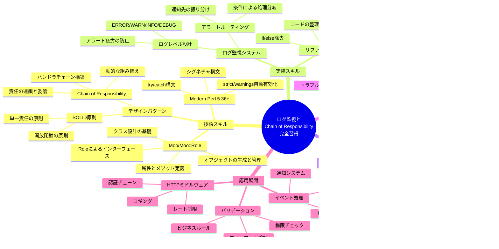

# シリーズ目次 - ログ監視と多段アラート判定 - Chain of Responsibilityパターン実践【Perl】

> **Perl 5.36+とMooで、本番運用可能なログ監視システムを段階的に構築！**  
> シンプルなif/elseから始めて、デザインパターンで拡張性・保守性を劇的に向上させる実践的連載です。

---

## シリーズ紹介

このシリーズでは、実務でよくある「ログレベルに応じて通知先を振り分ける」という要件を題材に、**Perlでデザインパターンを実践的に活用する方法**を学びます。

### なぜこのシリーズを読むべきか？

プロダクション環境でログ監視を実装すると、こんな壁にぶつかりませんか？

```perl
# よくあるif/elseスパゲッティ
if ($severity >= LOG_ERROR && $message =~ /database/i) {
    send_to_pagerduty($log_entry);
    send_to_slack($log_entry);
    send_to_jira($log_entry);
    save_to_database($log_entry);
}
elsif ($severity >= LOG_ERROR && $message =~ /network/i) {
    send_to_pagerduty($log_entry);
    send_to_slack($log_entry);
    send_email($log_entry);
    save_to_database($log_entry);
}
# ... エンドレス ...
```

- ❌ 新しい通知先を追加するたびに既存コードを修正
- ❌ 条件分岐が増えてネストが深くなる
- ❌ テストケースが爆発的に増える
- ❌ どこで何が実行されるか追いづらい

**このシリーズで、これらの問題を段階的に解決します！**

### 連載を通じて学べること

- ✅ **実務に直結する設計スキル**: 要件定義からリファクタリングまでの実践的アプローチ
- ✅ **Modern Perlの活用**: Perl 5.36+のシグネチャ、try/catch、Moo/Moo::Roleを徹底解説
- ✅ **デザインパターンの実践**: Chain of Responsibilityパターンをゼロから実装
- ✅ **本番運用可能な品質**: エラーハンドリング、テスト、デプロイまで網羅

### 最終的に完成するシステム

```perl
# 美しく、拡張可能で、テストしやすいコード
my $chain = SeverityFilter->new(min_severity => LOG_ERROR)
    ->set_next(
        PatternFilter->new(pattern => qr/database/i)
    )->set_next(
        PagerDutyNotifier->new(integration_key => $ENV{PAGERDUTY_KEY})
    )->set_next(
        SlackNotifier->new(webhook_url => $ENV{SLACK_WEBHOOK_URL})
    )->set_next(
        DatabaseSaver->new(dsn => $ENV{DB_DSN})
    );

# ログエントリを最初のハンドラに渡すだけ！
$chain->handle($log_entry);
```

**これが、if/elseスパゲッティからの卒業です！** 🎉

---

## 対象読者

このシリーズは、以下のような方に特におすすめです：

### 🎯 こんな方にピッタリ

- **Perlで実務経験があり、次のステップに進みたい方**
  - 基本的なPerlの構文は理解している
  - スクリプトは書けるが、設計やパターンに不安がある

- **ログ監視・アラート設計で悩んでいる運用担当者**
  - if/elseの肥大化に困っている
  - 新しい通知先追加のたびにコード修正が大変

- **デザインパターンを実践で学びたいエンジニア**
  - 本を読んだだけでは理解が浅い
  - 実際のコードで動かしながら学びたい

- **Modern Perlのベストプラクティスを知りたい方**
  - Perl 5.36+の新機能を活用したい
  - Moo/Moo::Roleの実践的な使い方を学びたい

### 前提知識

- Perlの基本構文（変数、制御構文、サブルーチン）
- 正規表現の基礎
- オブジェクト指向プログラミングの概念（継承、ポリモーフィズムなど）

※Mooやデザインパターンの知識は不要です。連載内で丁寧に解説します。

---

## シリーズ一覧

### 第1回：ログ監視システムの要件定義と基本設計 - ログレベルとアラートルーティング【Perl】



**学べること：**

- プロダクション環境で必要なログ監視の要件整理
- ERROR/WARN/INFO/DEBUGのログレベル設計原則
- アラート疲労（Alert Fatigue）を防ぐベストプラクティス
- シンプルなif/else実装とその問題点の理解

**こんな人におすすめ：**

まずはシンプルな実装から始めて、段階的に改善していきたい方。要件定義の重要性を理解したい方。

---

### 第2回：Mooでハンドラクラスを実装する - Moo::Roleによる拡張可能な設計【Perl】



**学べること：**

- Mooの基本とクラス設計の実践的手法
- Moo::Roleによるインターフェース定義の重要性
- if/elseスパゲッティからハンドラクラスへのリファクタリング
- SOLID原則（単一責任、開放閉鎖）の実践

**こんな人におすすめ：**

オブジェクト指向設計を学びたい方。拡張性の高いコードを書きたい方。Mooの実践的な使い方を知りたい方。

---

### 第3回：ハンドラチェーンで処理を連結する - Chain of Responsibilityパターンで作る本番運用可能なログ監視【Perl】



**学べること：**

- Chain of Responsibilityパターンの本質と実装
- ハンドラチェーンの構築と動的な組み替え
- 実際のログファイル処理とエラーハンドリング
- テストコードの書き方と品質保証
- 本番運用のためのデプロイとメンテナンス

**こんな人におすすめ：**

デザインパターンを実務で活用したい方。本番投入可能な品質のコードを書きたい方。連載の集大成を見たい方。

---

## 学習の進め方

### 📊 シリーズ全体のロードマップ

このシリーズは、**段階的に理解を深める構成**になっています。以下の図で、全体の流れと各回で習得する内容を確認しましょう。


**図の見方：**
- 🟠 **オレンジ枠**: 各回の記事（推奨学習時間付き）
- 🔵 **青枠**: 各回で習得する具体的なスキル
- 🟢 **緑枠**: 最終成果物と応用展開
- 🟡 **黄色枠**: 理解度チェックポイント

### 推奨する読み進め方

#### 📚 ステップ1：基礎を固める（第1回）

まずは第1回で、ログ監視の要件定義と基本設計を学びましょう。

- プロダクション環境での現実的な要件を理解
- シンプルなif/else実装を動かしてみる
- **その問題点を体感する**（これが重要！）

**時間の目安**: 30-40分

#### 🏗️ ステップ2：設計を学ぶ（第2回）

第2回で、Mooを使ったクラス設計を学びます。

- Moo/Moo::Roleの基本を習得
- ハンドラクラスを実装
- if/elseからのリファクタリングを実践

**時間の目安**: 45-60分

#### 🚀 ステップ3：パターンを極める（第3回）

第3回で、Chain of Responsibilityパターンを実装し、完成させます。

- デザインパターンの本質を理解
- チェーン構築の実装
- テスト、デプロイまで完全網羅

**時間の目安**: 60-90分

### 効果的な学習のコツ

#### ✅ 実際にコードを動かす

各記事のサンプルコードは、そのまま動作します。**必ず手を動かしましょう！**

```bash
# 環境準備（cpanmがない場合はインストール）
cpanm Moo HTTP::Tiny JSON::PP Path::Tiny DBI

# サンプルコードを実行
perl log_monitor.pl
```

#### ✅ 段階的に理解する

焦らず、1記事ずつ確実に理解していきましょう。前の記事の内容が分からないと、次の記事は理解しづらくなります。

#### ✅ 自分の環境に適用してみる

連載のコードをそのまま使うのではなく、**自分のプロジェクトに適用**してみましょう。その過程で多くの気づきが得られます。

#### ✅ テストを書く

第3回で紹介するテストコードを参考に、自分でもテストを書いてみましょう。テストを書くことで、設計の理解が深まります。

---

## コード例について

### GitHubリポジトリ

連載で使用する完全なコード例は、以下で公開予定です：

```
（GitHubリポジトリのURLは公開時に追加されます）
```

### 実行環境

このシリーズのコードは、以下の環境で動作確認しています：

- **Perl**: 5.36 以降（シグネチャ、try/catchを使用）
- **主要モジュール**:
  - Moo 2.005005 以降
  - HTTP::Tiny
  - JSON::PP
  - Path::Tiny
  - DBI（データベース使用時）
  - Test2::V0（テスト実行時）

### インストール方法

```bash
# cpanmを使用（推奨）
cpanm Moo HTTP::Tiny JSON::PP Path::Tiny DBI Test2::Suite

# または cpan
cpan Moo HTTP::Tiny JSON::PP Path::Tiny DBI Test2::Suite
```

**Modern Perlの魅力！** 🎯

Perl 5.36以降では、`use v5.36;`だけで以下が有効化されます：

```perl
use v5.36;  # これだけで以下が全て有効に！

# シグネチャ
sub greet($name) { say "Hello, $name!" }

# try/catch
try {
    risky_operation();
} catch ($e) {
    warn "Error: $e";
}

# strictとwarningsも自動有効化
```

従来の冗長な記述が不要になり、コードが驚くほど読みやすくなります！

---

## 連載を終えたあなたは...

このシリーズを完走すると、以下のスキルが身につきます：

### 📊 習得スキルマップ

連載を通じて獲得できる知識とスキルを、体系的に整理しました。



**マインドマップの読み方：**
- **中心（緑）**: シリーズ全体のゴール
- **第1階層**: 5つの主要スキルカテゴリ
- **第2階層以降**: 具体的な技術要素とトピック

### 🎓 技術スキル

- ✅ **Perl 5.36+のモダンな書き方をマスター**
- ✅ **Moo/Moo::Roleでクラス設計ができる**
- ✅ **Chain of Responsibilityパターンを実装できる**
- ✅ **拡張可能で保守しやすいコードが書ける**

### 💼 実務スキル

- ✅ **要件定義から実装まで設計できる**
- ✅ **リファクタリングの判断基準が分かる**
- ✅ **テストコードを書く習慣が身につく**
- ✅ **本番運用を見据えた実装ができる**

### 🚀 応用力

学んだパターンは、ログ監視以外にも応用できます：

- **HTTPミドルウェア**: 認証→レート制限→ロギング→ハンドラ
- **バリデーションパイプライン**: フォーマット検証→ビジネスルール→権限チェック
- **イベント処理**: セキュリティ→監査→通知

**あなたは今、Perlでデザインパターンを実装できるエンジニアです！** 🎉

---

## さあ、始めましょう！

準備はいいですか？それでは、第1回から学習を始めましょう！

### 👉 まずはここから



**第1回：ログ監視システムの要件定義と基本設計**

プロダクション環境で必要な要件を整理し、シンプルな実装から始めます。その問題点を理解することが、次のステップへの鍵です。

---

## フィードバックとコミュニティ

### 質問・コメント

記事に関する質問やコメントは、各記事のコメント欄でお気軽にどうぞ！

### 誤字・脱字の報告

記事の改善にご協力ください。誤字・脱字や技術的な誤りを見つけた場合は、ぜひお知らせください。

### 続編のリクエスト

「こんなパターンも解説してほしい」「別のテーマで連載してほしい」といったリクエストもお待ちしています！

---

## 関連リンク

### シリーズ記事

1. [ログ監視システムの要件定義と基本設計 - ログレベルとアラートルーティング【Perl】](#)
2. [Mooでハンドラクラスを実装する - Moo::Roleによる拡張可能な設計【Perl】](#)
3. [ハンドラチェーンで処理を連結する - Chain of Responsibilityパターンで作る本番運用可能なログ監視【Perl】](#)

### 参考資料

- [Chain of Responsibilityパターン調査ドキュメント](/warehouse/chain-of-responsibility-pattern/)
- [Moo OOP連載調査](/warehouse/moo-oop-series-research/)
- [デザインパターン概要](/warehouse/design-patterns-overview/)

### 外部リソース

- [Moo公式ドキュメント - MetaCPAN](https://metacpan.org/pod/Moo)
- [Perl 5.36リリースノート](https://perldoc.perl.org/perl5360delta)
- [Refactoring.Guru - Chain of Responsibility](https://refactoring.guru/design-patterns/chain-of-responsibility)
- [Modern Perl](http://modernperlbooks.com/)

---

**タグ**: #perl #シリーズ #ログ監視 #chain-of-responsibility #moo #デザインパターン #Modern Perl

**執筆日**: 2026-01-05  
**カテゴリ**: Perl / デザインパターン / システム運用 / 連載
