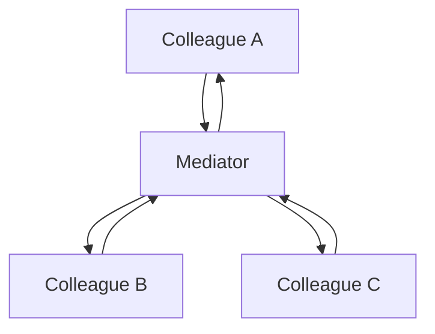

[@nqounet](https://x.com/nqounet)です。

今回は、GoF（Gang of Four）デザインパターンの振る舞いパターンの一つ、**Mediatorパターン（仲介者パターン）**について調査しました。

複数のオブジェクトが互いに通信し合う必要がある場合、それぞれが直接参照し合うと密結合になり、保守性が低下します。Mediatorパターンは、この問題を解決するための強力なパターンです。

## Mediatorパターンとは

Mediatorパターンは、**オブジェクト群の相互作用をカプセル化する仲介者オブジェクトを定義する**デザインパターンです。

複数のオブジェクト（同僚オブジェクト、Colleague）が互いに直接参照し合うのではなく、仲介者（Mediator）を通じて通信することで、疎結合を実現します。

### 基本構造

Mediatorパターンは以下の要素で構成されます。

- **Mediator（仲介者インターフェース）**: 同僚オブジェクト間の通信メソッドを定義
- **ConcreteMediator（具体的な仲介者）**: 実際に同僚オブジェクト間の調整を行う実装
- **Colleague（同僚オブジェクト）**: 仲介者を通じてのみ他のオブジェクトと通信するコンポーネント



同僚オブジェクト同士は直接参照せず、すべての通信が仲介者を経由します。

## 用途と適用場面

Mediatorパターンは、以下のような場面で特に有効です。

### 典型的な使用例

**1. GUIダイアログボックス**

複数のUI要素（ボタン、テキストフィールド、チェックボックスなど）が互いに影響し合う場合に使用されます。

- 例：あるチェックボックスがオフのとき、特定のボタンを無効化する
- 例：テキストフィールドに入力があるまで送信ボタンを無効にする

**2. チャットアプリケーション**

ユーザー同士が直接通信せず、チャットルーム（仲介者）を経由してメッセージをやり取りします。

- ユーザーは他のユーザーを直接知らない
- チャットルームがメッセージの配信を管理

**3. 航空管制システム**

飛行機同士が直接通信せず、管制塔（仲介者）を介して調整します。

- 各飛行機は管制塔とのみ通信
- 管制塔が全体の調整を行う

**4. ワークフローエンジン**

プロセスの各ステップが仲介者を通じて協調動作します。

### 適用すべき場面

Mediatorパターンの適用を検討すべき場面：

- 複数のオブジェクト間に複雑で保守が困難な相互作用がある
- オブジェクト間の直接通信が密結合を引き起こしている
- オブジェクトを異なるコンテキストで再利用したいが、通信ロジックが内部に埋め込まれている
- 相互作用のルールが頻繁に変更される可能性があり、中央で管理したい

## サンプルコード

実際のコード例を通じて、Mediatorパターンの実装を見てみましょう。

### Python実装例：チャットルーム

チャットアプリケーションを例に、Mediatorパターンを実装します。

```python
from datetime import datetime

# Mediator Interface
class ChatRoomMediator:
    def show_message(self, user, message):
        pass

# Concrete Mediator
class ChatRoom(ChatRoomMediator):
    def show_message(self, user, message):
        time = datetime.now().strftime("%H:%M:%S")
        sender = user.get_name()
        print(f"[{time}] {sender}: {message}")

# Colleague
class User:
    def __init__(self, name, mediator):
        self.name = name
        self.mediator = mediator
    
    def get_name(self):
        return self.name
    
    def send_message(self, message):
        # 仲介者を通じてメッセージを送信
        self.mediator.show_message(self, message)

# 使用例
if __name__ == "__main__":
    # 仲介者（チャットルーム）を作成
    chat_room = ChatRoom()
    
    # ユーザーを作成（仲介者を渡す）
    alice = User("Alice", chat_room)
    bob = User("Bob", chat_room)
    
    # ユーザー同士は直接参照しないが、仲介者経由で通信可能
    alice.send_message("こんにちは、Bob!")
    bob.send_message("やあ、Alice!")
```

このコードでは、`User`オブジェクト同士は互いを直接参照していません。すべての通信が`ChatRoom`（仲介者）を経由して行われます。

### Java実装例

```java
// Mediator
class ChatRoom {
    public static void showMessage(User user, String message) {
        System.out.println(new java.util.Date() 
            + " [" + user.getName() + "] : " + message);
    }
}

// Colleague
class User {
    private String name;
    
    public User(String name) {
        this.name = name;
    }
    
    public String getName() {
        return name;
    }
    
    public void sendMessage(String message) {
        // 仲介者を通じてメッセージを送信
        ChatRoom.showMessage(this, message);
    }
}

// 使用例
public class MediatorPatternDemo {
    public static void main(String[] args) {
        User robert = new User("Robert");
        User john = new User("John");
        
        robert.sendMessage("Hi! John!");
        john.sendMessage("Hello! Robert!");
    }
}
```

### より実践的な例：GUIダイアログ

より複雑な例として、GUIダイアログでの使用を考えてみます。

```python
# Mediator Interface
class DialogMediator:
    def notify(self, sender, event):
        pass

# Concrete Mediator
class LoginDialog(DialogMediator):
    def __init__(self):
        self.username_field = TextField(self)
        self.password_field = TextField(self)
        self.login_button = Button(self)
        self.remember_checkbox = Checkbox(self)
    
    def notify(self, sender, event):
        if sender == self.username_field and event == "changed":
            # ユーザー名が入力されたら、ログインボタンの状態を更新
            self.update_login_button()
        
        elif sender == self.password_field and event == "changed":
            # パスワードが入力されたら、ログインボタンの状態を更新
            self.update_login_button()
        
        elif sender == self.login_button and event == "clicked":
            # ログインボタンがクリックされたら、ログイン処理
            self.login()
        
        elif sender == self.remember_checkbox and event == "toggled":
            # チェックボックスの状態に応じた処理
            self.handle_remember_me()
    
    def update_login_button(self):
        # ユーザー名とパスワードの両方が入力されている場合のみ有効化
        if self.username_field.has_text() and self.password_field.has_text():
            self.login_button.enable()
        else:
            self.login_button.disable()
    
    def login(self):
        print(f"Logging in as {self.username_field.get_text()}")
    
    def handle_remember_me(self):
        if self.remember_checkbox.is_checked():
            print("Remember me enabled")
        else:
            print("Remember me disabled")

# Colleague Base
class Component:
    def __init__(self, mediator):
        self.mediator = mediator

# Concrete Colleagues
class TextField(Component):
    def __init__(self, mediator):
        super().__init__(mediator)
        self.text = ""
    
    def set_text(self, text):
        self.text = text
        # 仲介者に変更を通知
        self.mediator.notify(self, "changed")
    
    def get_text(self):
        return self.text
    
    def has_text(self):
        return len(self.text) > 0

class Button(Component):
    def __init__(self, mediator):
        super().__init__(mediator)
        self.enabled = False
    
    def click(self):
        if self.enabled:
            # 仲介者に通知
            self.mediator.notify(self, "clicked")
    
    def enable(self):
        self.enabled = True
    
    def disable(self):
        self.enabled = False

class Checkbox(Component):
    def __init__(self, mediator):
        super().__init__(mediator)
        self.checked = False
    
    def toggle(self):
        self.checked = not self.checked
        # 仲介者に通知
        self.mediator.notify(self, "toggled")
    
    def is_checked(self):
        return self.checked
```

このGUIの例では、各UI要素（TextField、Button、Checkbox）は互いを直接知らず、すべての相互作用がDialogMediator（仲介者）を通じて管理されます。

## 利点（メリット）

Mediatorパターンには以下のような利点があります。

### 1. 疎結合の実現

同僚オブジェクトは仲介者のみを知っており、他の同僚オブジェクトを直接参照しません。

- システムがモジュール化される
- 変更、テスト、拡張が容易になる

### 2. 通信ロジックの中央集権化

相互作用のロジックが一箇所（仲介者）に集約されます。

- 管理や更新が容易になる
- 通信ルールの変更が局所化される

### 3. 複雑な相互作用の簡素化

オブジェクト間の複雑な依存関係の網を避けられます。

- 相互作用のルールが仲介者で管理され、追跡しやすい
- システム全体の理解が容易になる

### 4. 再利用性の向上

同僚オブジェクトは通信ロジックを内部に持たないため、異なるコンテキストで再利用しやすくなります。

### 5. 単一責任原則の促進

各コンポーネントは自身の核となるロジックに集中でき、オブジェクト間通信の責任は仲介者に委譲されます。

### 6. 新しいコンポーネントの追加が容易

新しい同僚オブジェクトを追加する際、仲介者とのインターフェースのみを考慮すればよくなります。

## 欠点（デメリット）

一方で、Mediatorパターンには以下のような欠点もあります。

### 1. 仲介者の複雑化

多くの責任を仲介者に集中させると、仲介者自体が非常に複雑になる可能性があります。

- "神オブジェクト（God Object）"になるリスク
- モジュール性の原則に違反する可能性
- 仲介者のメンテナンスが困難になる

### 2. 単一障害点（Single Point of Failure）

すべての通信が仲介者を経由するため、仲介者に障害が発生するとシステム全体の相互作用が停止します。

### 3. 不必要な複雑さの追加

オブジェクト間の相互作用がシンプルな場合、仲介者の導入は不要なオーバーヘッドとなります。

- シンプルな問題に複雑な解決策を適用してしまう
- 開発コストが増加する

### 4. 仲介者への結合

同僚オブジェクト同士の結合は減りますが、すべての同僚オブジェクトが仲介者のインターフェースに依存します。

- 仲介者の変更がすべての依存コンポーネントに影響を及ぼす可能性

### 5. パフォーマンスの懸念

仲介者が大量のトラフィックを処理する必要がある場合、ボトルネックになる可能性があります。

- リアルタイム性が重要なシステムでは性能劣化の原因となりうる

## 使用を避けるべき場面

以下のような場合は、Mediatorパターンの使用を避けるべきです。

- オブジェクト間の相互作用がシンプルで、直接的な関係が問題にならない場合
- パフォーマンスが重要で、仲介者がボトルネックになる可能性がある場合
- オブジェクト間の相互作用が非常に特殊化されており、一般化が困難な場合

## 関連パターンとの比較

### Observerパターンとの違い

- **Observer**: 一対多の依存関係。Subject（主体）の変更が複数のObserverに通知される
- **Mediator**: 多対多の相互作用を中央集権化。オブジェクト間の双方向通信を調整

Observerは主に通知の一方向の流れを扱うのに対し、Mediatorは双方向の複雑な通信を管理します。

### Facadeパターンとの違い

- **Facade**: サブシステムへの統一インターフェースを提供（単方向）
- **Mediator**: オブジェクト間の双方向通信を仲介

Facadeはサブシステムを簡素化するためのインターフェースですが、Mediatorは相互作用を調整します。

## まとめ

Mediatorパターンは、複数のオブジェクト間の複雑な相互作用を管理するための強力なツールです。

### 適用の判断基準

✅ **使用を検討すべき場合：**

- 複雑なオブジェクト間通信がある
- 密結合が問題になっている
- 通信ルールが頻繁に変更される
- オブジェクトの再利用性を高めたい

❌ **使用を避けるべき場合：**

- 相互作用がシンプル
- パフォーマンスが最重要
- 仲介者が過度に複雑になる懸念がある

Mediatorパターンを適切に使用することで、疎結合で保守性の高いシステムを構築できますが、仲介者自体が複雑になりすぎないよう注意が必要です。

システムの複雑さとパターンのオーバーヘッドのバランスを考慮し、適切な場面で適用することが重要です。

## 参考リンク









## 関連記事

他のデザインパターンについても解説しています。


