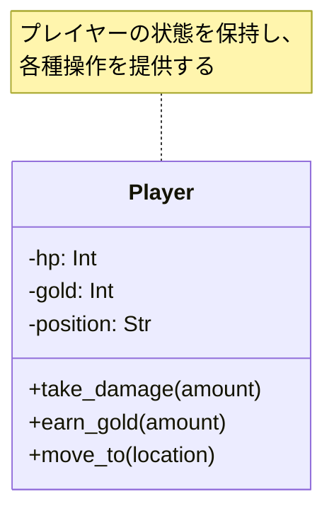
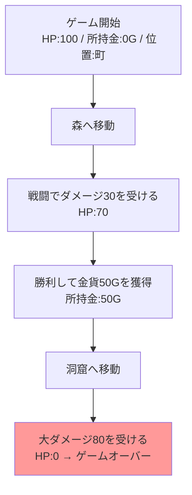

[@nqounet](https://x.com/nqounet)です。

今回から、新シリーズ「Mooを使ってゲームのセーブ機能を作ってみよう」を始めます。

## シリーズの紹介

このシリーズでは、PerlとMooを使ってセーブ機能付きのシンプルなRPGを作成します。全10回を通して、RPGゲームを段階的に機能拡張していきます。

最終的には、以下のような機能を持つゲームが完成します。

- プレイヤーの状態管理（HP、所持金、位置）
- ゲームのセーブ・ロード機能
- 複数のセーブスロット管理
- オートセーブ機能
- セーブデータの保護

これらの機能を実装する過程で、オブジェクト指向設計の重要な考え方を自然に学んでいきます。

### このシリーズで学べること

- オブジェクトの状態を保存・復元する仕組み
- カプセル化を維持したままデータを管理する方法
- 複数のクラスを連携させる設計
- 実践的なオブジェクト指向プログラミングの考え方

ゲームという身近な題材を通じて、実用的な設計パターンを楽しく学ぶことができます。

## 対象読者と前提知識

### 対象読者

このシリーズは、以下のような方を対象としています。

- Perl入学式を卒業したばかりの入門者
- Mooを使ったオブジェクト指向プログラミングを学んだ方
- 実践的なコード例を通じて理解を深めたい方

### 前提知識

このシリーズは、「Mooで覚えるオブジェクト指向プログラミング」シリーズ（全12回）を読了している方を対象としています。



具体的には、以下の知識を前提としています。

- `has`による属性定義
- `is => 'ro'` / `is => 'rw'`の使い分け
- `required`と`default`オプション
- `Moo::Role`によるロール定義
- `with`によるロールの適用

まだ読んでいない方は、先に上記シリーズをご覧ください。

## 今回のゴール

今回は、シリーズの第1回として、プレイヤーの状態を管理するシンプルなRPGを作成します。

まずは動くものを作ることを優先し、設計はシンプルに保ちます。今回作成するゲームには「セーブ機能」はまだありません。それは次回以降で追加していきます。

## Playerクラスを作る

まず、今回作成する`Player`クラスの構造を確認しましょう。



では、プレイヤーの状態を管理するための`Player`クラスを作成しましょう。

```perl
# Perl v5.36 以降
# 外部依存: Moo

package Player {
    use Moo;
    use v5.36;

    has hp => (
        is      => 'rw',
        default => 100,
    );

    has gold => (
        is      => 'rw',
        default => 0,
    );

    has position => (
        is      => 'rw',
        default => '町',
    );

    sub take_damage ($self, $amount) {
        $self->hp($self->hp - $amount);
        if ($self->hp < 0) {
            $self->hp(0);
        }
    }

    sub earn_gold ($self, $amount) {
        $self->gold($self->gold + $amount);
    }

    sub move_to ($self, $location) {
        $self->position($location);
    }

    sub is_alive ($self) {
        return $self->hp > 0;
    }

    sub show_status ($self) {
        say "HP: " . $self->hp;
        say "所持金: " . $self->gold . "G";
        say "位置: " . $self->position;
        say "";
    }
};
```

コメントに記載の通り、このコードはPerl v5.36以降で動作します。v5.36から導入されたサブルーチンシグネチャ機能（`sub method_name ($self, $param)`の書き方）を使用しているためです。

このPlayerクラスは、3つの属性と5つのメソッドを持っています。

**属性:**

- `hp` — プレイヤーの体力（初期値100）
- `gold` — 所持金（初期値0）
- `position` — 現在位置（初期値「町」）

すべての属性は`is => 'rw'`で読み書き可能に設定されています。これは、ゲーム中にプレイヤーの状態が変化するためです。

**メソッド:**

- `take_damage($amount)` — ダメージを受ける。HPが0未満にならないようガード処理を入れている
- `earn_gold($amount)` — お金を得る
- `move_to($location)` — 指定した場所に移動する
- `is_alive()` — 生存しているか確認する。HPが0より大きければ生存
- `show_status()` — 現在の状態を表示する

## ゲームループで動作確認

プレイヤークラスができたので、実際にゲームをプレイしてみましょう。

以下のフローで、RPGの基本的な動作を見てみます。プレイヤーは森で戦闘に勝利しますが、洞窟でドラゴンに敗北してゲームオーバーになります。



### コード例

このPlayerクラスを使って、実際にゲームをプレイしてみましょう。

```perl
# Perl v5.36 以降
# 外部依存: Moo

use v5.36;

package Player {
    use Moo;

    has hp => (
        is      => 'rw',
        default => 100,
    );

    has gold => (
        is      => 'rw',
        default => 0,
    );

    has position => (
        is      => 'rw',
        default => '町',
    );

    sub take_damage ($self, $amount) {
        $self->hp($self->hp - $amount);
        if ($self->hp < 0) {
            $self->hp(0);
        }
    }

    sub earn_gold ($self, $amount) {
        $self->gold($self->gold + $amount);
    }

    sub move_to ($self, $location) {
        $self->position($location);
    }

    sub is_alive ($self) {
        return $self->hp > 0;
    }

    sub show_status ($self) {
        say "HP: " . $self->hp;
        say "所持金: " . $self->gold . "G";
        say "位置: " . $self->position;
        say "";
    }
};

# ゲームループのデモ
my $player = Player->new;

say "=== ゲーム開始 ===";
$player->show_status;

say "森へ移動...";
$player->move_to('森');
$player->show_status;

say "スライムと戦闘！";
$player->take_damage(30);
say "30のダメージを受けた！";
$player->show_status;

if ($player->is_alive) {
    say "スライムを倒した！";
    $player->earn_gold(50);
    say "50Gを手に入れた！";
    $player->show_status;
}

say "洞窟へ移動...";
$player->move_to('洞窟');
$player->show_status;

say "ドラゴンと戦闘！";
$player->take_damage(80);
say "80のダメージを受けた！";
$player->show_status;

if (!$player->is_alive) {
    say "=== GAME OVER ===";
}
```

実行結果は以下のようになります。

```
=== ゲーム開始 ===
HP: 100
所持金: 0G
位置: 町

森へ移動...
HP: 100
所持金: 0G
位置: 森

スライムと戦闘！
30のダメージを受けた！
HP: 70
所持金: 0G
位置: 森

スライムを倒した！
50Gを手に入れた！
HP: 70
所持金: 50G
位置: 森

洞窟へ移動...
HP: 70
所持金: 50G
位置: 洞窟

ドラゴンと戦闘！
80のダメージを受けた！
HP: 0
所持金: 50G
位置: 洞窟

=== GAME OVER ===
```

プレイヤーの状態がきちんと変化し、最後にゲームオーバーになることが確認できます。

しかし、ここで問題があります。ドラゴンに負けてしまったら、また最初からやり直しです。森での戦闘後、HP70・所持金50Gの状態に戻りたいのですが、その方法がありません。

次回は、この「途中の状態から再開したい」という課題に取り組みます。

## 今回作成した完成コード

以下が今回作成した完成コードです。1つのスクリプトファイルとして動作します。

```perl
#!/usr/bin/env perl
# Perl v5.36 以降
# 外部依存: Moo

use v5.36;

package Player {
    use Moo;

    has hp => (
        is      => 'rw',
        default => 100,
    );

    has gold => (
        is      => 'rw',
        default => 0,
    );

    has position => (
        is      => 'rw',
        default => '町',
    );

    sub take_damage ($self, $amount) {
        $self->hp($self->hp - $amount);
        if ($self->hp < 0) {
            $self->hp(0);
        }
    }

    sub earn_gold ($self, $amount) {
        $self->gold($self->gold + $amount);
    }

    sub move_to ($self, $location) {
        $self->position($location);
    }

    sub is_alive ($self) {
        return $self->hp > 0;
    }

    sub show_status ($self) {
        say "HP: " . $self->hp;
        say "所持金: " . $self->gold . "G";
        say "位置: " . $self->position;
        say "";
    }
};

# ゲームループのデモ
my $player = Player->new;

say "=== ゲーム開始 ===";
$player->show_status;

say "森へ移動...";
$player->move_to('森');
$player->show_status;

say "スライムと戦闘！";
$player->take_damage(30);
say "30のダメージを受けた！";
$player->show_status;

if ($player->is_alive) {
    say "スライムを倒した！";
    $player->earn_gold(50);
    say "50Gを手に入れた！";
    $player->show_status;
}

say "洞窟へ移動...";
$player->move_to('洞窟');
$player->show_status;

say "ドラゴンと戦闘！";
$player->take_damage(80);
say "80のダメージを受けた！";
$player->show_status;

if (!$player->is_alive) {
    say "=== GAME OVER ===";
}
```

## まとめ

今回は、シリーズの第1回として、プレイヤーの状態を管理するシンプルなRPGを作成しました。

**作成したもの:**

- `Player`クラスを作成し、HP・所持金・位置を管理できるようにした
- `take_damage`メソッドでダメージを受ける処理を実装した
- `earn_gold`メソッドで所持金を増やす処理を実装した
- `move_to`メソッドで移動する処理を実装した
- ゲームループでプレイヤーの状態が正しく変化することを確認した

**確認できたこと:**

- Mooの`has`を使った属性定義の基本
- `is => 'rw'`で読み書き可能な属性を作る方法
- Perl v5.36のサブルーチンシグネチャの使い方

まだセーブ機能はありませんが、動くゲームの土台ができました。次回からは、この土台に「状態を保存して復元する」機能を追加していきます。

## 次回予告

今回作成したRPGには、「セーブ機能」がありません。

ゲームオーバーになったら、また最初からやり直しです。ドラゴンと戦う前のHP70、所持金50Gの状態に戻りたいのに、戻る方法がありません。

次回は、この「途中から再開したい！」という問題に取り組みます。

最初は単純な方法で状態を保存しようとしますが、思わぬ落とし穴に気づくことになります。変数のコピーだけでは解決できない、Perlの「参照」にまつわる問題が待っています。

**第2回のテーマ: ゲームオーバーで最初から？状態保存の必要性**

お楽しみに。
