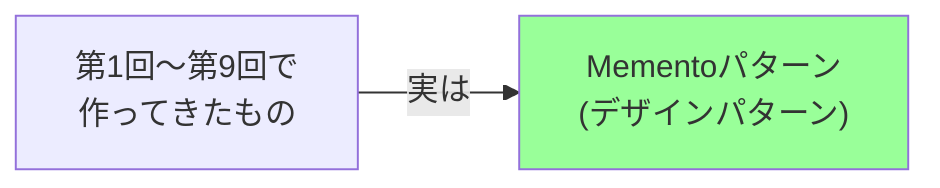
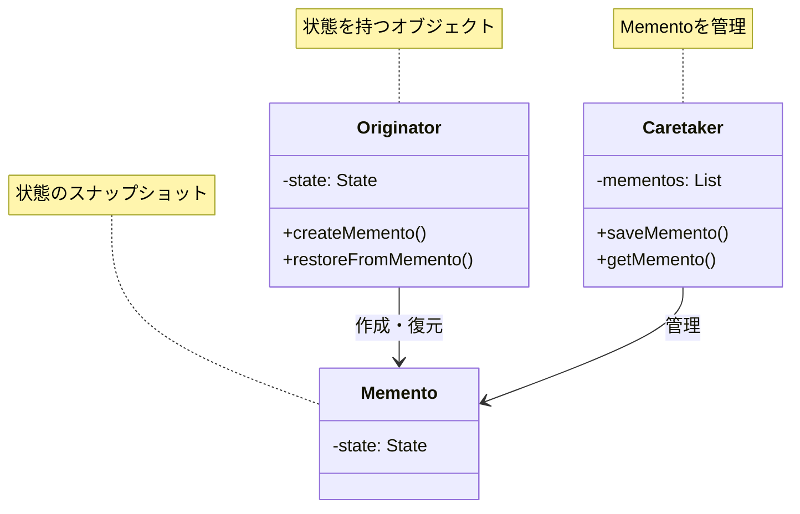
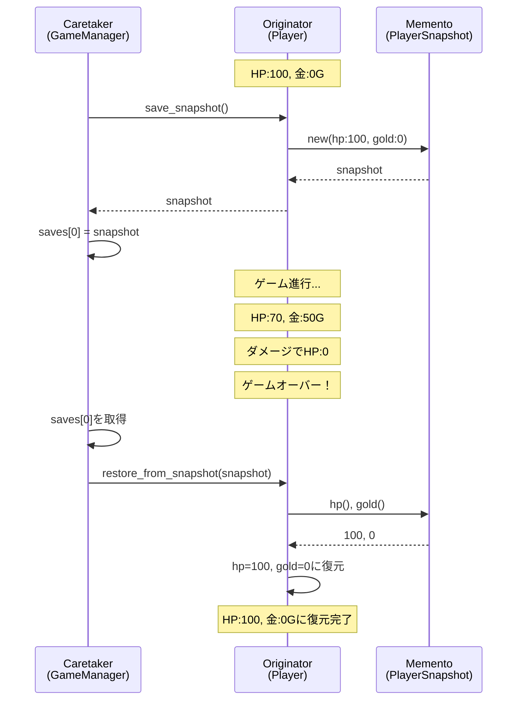
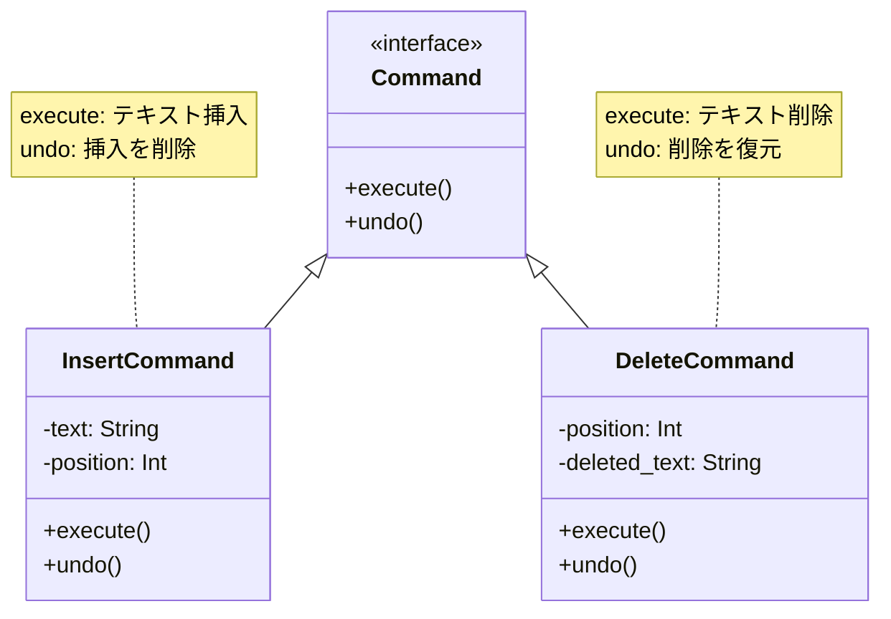
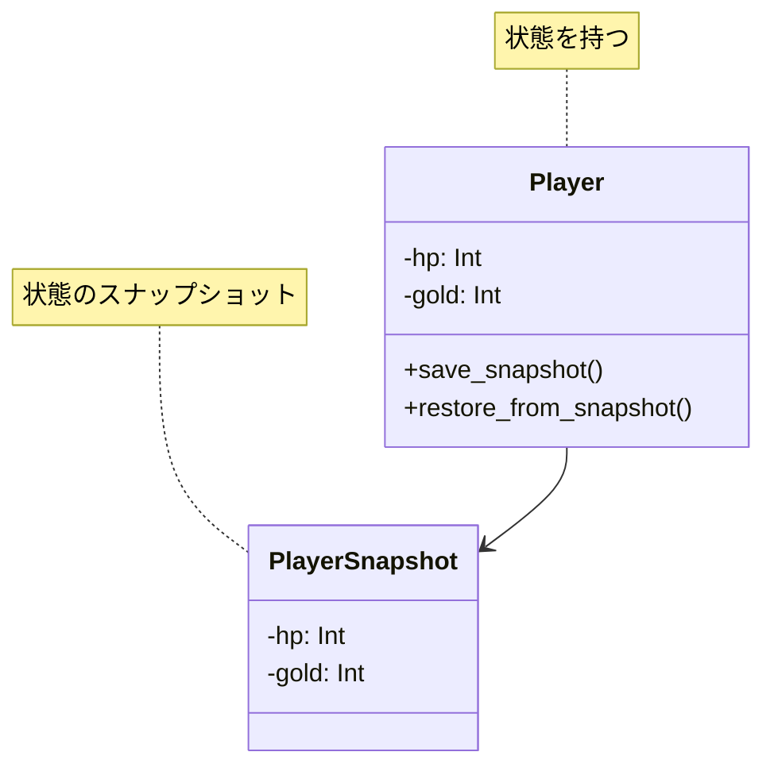
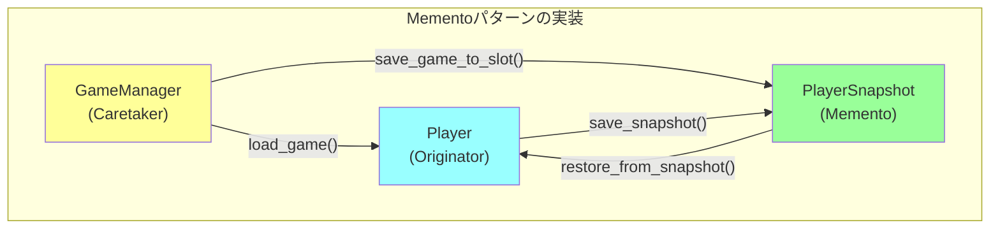
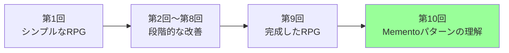

[@nqounet](https://x.com/nqounet)です。

## 前回の振り返り

前回は、これまでに作成したすべての機能を統合し、セーブ機能付きRPGを完成させました。対話的なCLIインターフェースで、実際に遊べるゲームが完成しました。



### これまでに作成したもの

- `Player`クラス — プレイヤーの状態管理
- `PlayerSnapshot`クラス — 不変なセーブデータ
- `GameManager`クラス — セーブスロット管理
- オートセーブ機能、複数セーブスロット機能
- 対話的なCLIゲーム

今回（最終回）は、作ってきたものが実は**Mementoパターン**というデザインパターンだったことを明かします。

## 今回のゴール

今回のゴールは、Mementoパターンを理解することです。

- Mementoパターンの3つの役割を理解する
- Commandパターンとの違いを理解する
- Mementoパターンの実務での活用例を知る
- 他のデザインパターンとの関係を理解する

これで、オブジェクト指向設計の深い理解を得られます。

## 種明かし：これがMementoパターンだ

第1回から第9回まで、私たちはゲームのセーブ機能を作ってきました。

実は、この設計は**Mementoパターン**（メメントパターン）という、有名なデザインパターンそのものでした。



### Mementoパターンとは

Mementoパターンは、GoF（Gang of Four）の「デザインパターン」という書籍で紹介されている、23の基本的なデザインパターンの1つです。

**定義:**

> Mementoパターンは、オブジェクトの内部状態をカプセル化を破壊せずに外部に保存し、後でその状態に復元できるようにするパターン

まさに、私たちが作ってきたゲームのセーブ・ロード機能と同じです！

## Mementoパターンの3つの役割

Mementoパターンには、3つの主要な役割があります。



### 1. Originator（作成者）

**役割:** 自分の状態を知っており、Mementoを作成・復元する

**私たちのゲームでは:** `Player`クラス

```perl
package Player {
    # 状態を持つ
    has hp       => (is => 'rw');
    has gold     => (is => 'rw');
    has position => (is => 'rw');
    
    # Mementoを作成
    sub save_snapshot ($self) {
        return PlayerSnapshot->new(...);
    }
    
    # Mementoから復元
    sub restore_from_snapshot ($self, $snapshot) {
        $self->hp($snapshot->hp);
        # ...
    }
};
```

### 2. Memento（記念品）

**役割:** Originatorの状態を保存する。不変（イミュータブル）

**私たちのゲームでは:** `PlayerSnapshot`クラス

```perl
package PlayerSnapshot {
    # すべて読み取り専用（不変）
    has hp       => (is => 'ro', required => 1);
    has gold     => (is => 'ro', required => 1);
    has position => (is => 'ro', required => 1);
};
```

### 3. Caretaker（管理者）

**役割:** Mementoを管理する。いつ保存・復元するかを決める

**私たちのゲームでは:** `GameManager`クラス

```perl
package GameManager {
    # Mementoを管理
    has saves => (is => 'ro', default => sub { [] });
    
    # 保存
    sub save_game_to_slot ($self, $player, $slot) {
        my $memento = $player->save_snapshot;
        $self->saves->[$slot] = $memento;
    }
    
    # 復元
    sub load_game ($self, $player, $slot) {
        my $memento = $self->saves->[$slot];
        $player->restore_from_snapshot($memento);
    }
};
```

### 3つの役割の対応表

| 役割 | クラス | 責任 |
|-----|--------|------|
| **Originator** | Player | 自分の状態を知る。Mementoを作成・復元 |
| **Memento** | PlayerSnapshot | 状態を保存。不変（`is => 'ro'`） |
| **Caretaker** | GameManager | Mementoを管理。保存・復元のタイミング制御 |

## Mementoパターンの構造図解

私たちが作ってきたゲームの設計を、Mementoパターンの観点から図解してみましょう。



この図が、Mementoパターンの本質です。

## Commandパターンとの違い

第1回で、既存シリーズに「簡易テキストエディタシリーズ」があることをお伝えしました。そのシリーズは**Commandパターン**を使った設計でした。

同じ「元に戻す（Undo）」機能でも、MementoパターンとCommandパターンは本質的に異なります。

### Commandパターン（テキストエディタ）



### Mementoパターン（ゲームセーブ）



### 2つのパターンの比較

| 観点 | Mementoパターン | Commandパターン |
|-----|----------------|----------------|
| **保存対象** | オブジェクトの**状態**（スナップショット） | **操作**をオブジェクト化 |
| **Undo方法** | 以前の状態を丸ごと復元 | 操作の逆実行 |
| **メモリ使用** | 状態全体を保存（大きい） | 操作のみ保存（小さい） |
| **実装の複雑さ** | 状態のコピーのみ | 各操作にundo()が必要 |
| **適した場面** | 状態が複雑、逆操作の定義が難しい | 操作が明確、逆操作が定義しやすい |
| **具体例** | ゲームセーブ、データベーストランザクション | テキストエディタ、図形エディタ |

### なぜMementoを選んだのか

ゲームのセーブ機能には、Mementoパターンが適している理由があります。

1. **状態が複雑** — HP、所持金、位置など、多数の属性を管理
2. **逆操作が定義しにくい** — 「ダメージを受ける」の逆操作は？「モンスターを復活させる」？
3. **スナップショット的な復元** — 特定の時点の状態に丸ごと戻したい

一方、テキストエディタでは、Commandパターンが適しています。

1. **操作が明確** — 挿入、削除、置換など
2. **逆操作が定義しやすい** — 挿入の逆は削除、削除の逆は挿入
3. **メモリ効率** — テキスト全体ではなく、操作のみを保存

## Mementoパターンの実務での活用例

Mementoパターンは、実務でも広く使われています。

### 1. データベーストランザクション

```perl
# トランザクション開始前の状態を保存
my $savepoint = $db->create_savepoint;

eval {
    $db->update(...);
    $db->insert(...);
};

if ($@) {
    # エラーが発生したらロールバック
    $db->rollback_to_savepoint($savepoint);
}
```

### 2. アプリケーションの設定管理

```perl
# 設定変更前のバックアップ
my $backup = $config->create_backup;

eval {
    $config->set_theme('dark');
    $config->set_language('en');
};

if ($config->is_broken) {
    # 設定が壊れたら復元
    $config->restore_from_backup($backup);
}
```

### 3. フォームの一時保存

```perl
# フォーム入力中の一時保存
my $draft = $form->save_draft;

# 後で復元
$form->restore_from_draft($draft);
```

これらはすべて、Mementoパターンの応用です。

## 他のデザインパターンとの関係

Mementoパターンは、他のデザインパターンと組み合わせて使うことができます。

### 1. Commandパターンと組み合わせ

```perl
# Commandで操作を記録
# Mementoで状態を保存

my $command_history = [];  # Command
my $state_snapshots = [];  # Memento

# 両方を使い分ける
push @$command_history, $command;  # 細かい操作
push @$state_snapshots, $snapshot; # 重要なポイント
```

### 2. Prototypeパターンとの関連

Mementoの実装で、オブジェクトのクローン（複製）が必要な場合があります。これはPrototypeパターンの領域です。

```perl
# 深いコピーが必要な場合
use Storable qw(dclone);

sub save_snapshot ($self) {
    return PlayerSnapshot->new(
        items => dclone($self->items),  # Prototypeパターン的
    );
}
```

### 3. Iteratorパターンとの組み合わせ

複数のMementoを順に処理する場合、Iteratorパターンが役立ちます。

```perl
# セーブデータを順に処理
my $iter = $manager->get_save_iterator;

while (my $save = $iter->next) {
    say $save->hp;
}
```

## GoFデザインパターンの位置づけ

Mementoパターンは、GoFの23パターンのうち、**振る舞いに関するパターン**に分類されます。

### GoFの23パターン（抜粋）

| カテゴリ | パターン名 | 役割 |
|---------|----------|------|
| **生成に関する** | Singleton | インスタンスを1つだけ生成 |
| | Factory Method | オブジェクト生成を委譲 |
| | Prototype | オブジェクトを複製 |
| **構造に関する** | Adapter | インターフェースを変換 |
| | Decorator | 機能を動的に追加 |
| | Proxy | 代理オブジェクト |
| **振る舞いに関する** | **Memento** | 状態の保存と復元 |
| | Command | 操作をオブジェクト化 |
| | Strategy | アルゴリズムを切り替え |
| | Observer | 変更を通知 |

私たちが作ったゲームは、Mementoパターンの教科書的な実装例なのです。

## なぜパターンを学ぶのか

デザインパターンを学ぶ意義は何でしょうか。

### 1. 共通言語を得る

「このクラスはOriginatorの役割だね」と言えば、他の開発者もすぐに理解できます。

### 2. 車輪の再発明を防ぐ

よくある問題には、すでに実証済みの解決策（パターン）があります。

### 3. 設計の選択肢が増える

問題に対して、複数のアプローチ（Memento vs Command）を検討できます。

### 4. コードレビューの質が上がる

「ここはMementoパターンで実装すべきでは？」という指摘ができます。

## このシリーズで学んだこと

第1回から第10回まで、私たちは以下のことを学びました。

### 技術的なスキル

- Mooによるオブジェクト指向プログラミング
- `is => 'ro'` / `is => 'rw'`の使い分け
- カプセル化の実践
- 不変オブジェクト（イミュータブル）の活用
- 複数クラスの協調設計

### デザインの原則

- 責任の分離（SRP: Single Responsibility Principle）
- カプセル化（情報隠蔽）
- 不変性の重要性
- インターフェースと実装の分離

### デザインパターン

- **Mementoパターン**の構造と実装
- Commandパターンとの違い
- パターンの実務での活用

### 問題解決のアプローチ

- 素朴な実装から始める
- 問題を発見する
- パターンを適用して解決する
- 段階的に機能を追加する

## 次のステップ

このシリーズで基礎を身につけたあなたは、以下のステップに進めます。

### 1. 他のGoFパターンを学ぶ

- **Commandパターン** — 簡易テキストエディタシリーズ
- **Strategyパターン** — データエクスポーターシリーズ
- **Stateパターン** — 自動販売機シミュレーターシリーズ

### 2. より複雑な実装に挑戦

- セーブデータの永続化（ファイル、データベース）
- Mementoの圧縮（メモリ効率の改善）
- 差分保存（Incremental Memento）

### 3. 実務での応用

- Webアプリケーションのフォーム一時保存
- データベーストランザクション
- 設定管理システム

## シリーズの完成コード（再掲）

第9回で作成した完成コードが、Mementoパターンの完全な実装例です。



## まとめ

今回（最終回）は、作ってきたものが**Mementoパターン**だったことを明かしました。

**学んだこと:**

- Mementoパターンの3つの役割（Originator、Memento、Caretaker）
- Commandパターンとの違い（状態 vs 操作）
- Mementoパターンの実務での活用例
- GoFデザインパターンの位置づけ

**このシリーズで達成したこと:**

- 第1回：素朴な実装から始めた
- 第2回〜第8回：問題を発見し、段階的に解決した
- 第9回：完全に動作するゲームを完成させた
- 第10回：それがMementoパターンだと理解した

**Perlとmooで学ぶ意義:**

- Perlの柔軟性により、パターンの本質に集中できた
- Mooのシンプルな文法で、オブジェクト指向の基礎を習得できた
- 実際に動くゲームを作ることで、設計の重要性を体感できた

## 最終回を終えて

おめでとうございます！あなたは、Mementoパターンをゼロから実装し、完全に理解しました。

第1回で作った「シンプルなRPG」は、第10回では「Mementoパターンを実装した設計の良いRPG」に進化しました。

この経験は、他のデザインパターンを学ぶ際にも、実務でオブジェクト指向設計をする際にも、必ず役立ちます。



### 著者からのメッセージ

デザインパターンは、暗記するものではありません。問題に直面し、解決策を探す中で、自然に身につくものです。

このシリーズでは、「セーブ機能が欲しい」という素朴な要求から始め、段階的に問題を解決していく中で、自然とMementoパターンにたどり着きました。

これが、本当の意味でパターンを「理解する」ということです。

あなたも、実務で問題に直面したとき、「これはMementoパターンで解決できるかも」と気づけるようになっているはずです。

---

このシリーズを最後まで読んでくださり、ありがとうございました。

Perlとmooで、楽しくオブジェクト指向プログラミングを学んでいただけたなら幸いです。

それでは、また別のシリーズでお会いしましょう！

**Happy Hacking with Perl and Moo!**

---

[@nqounet](https://x.com/nqounet)
