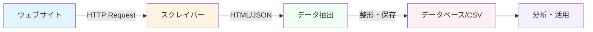
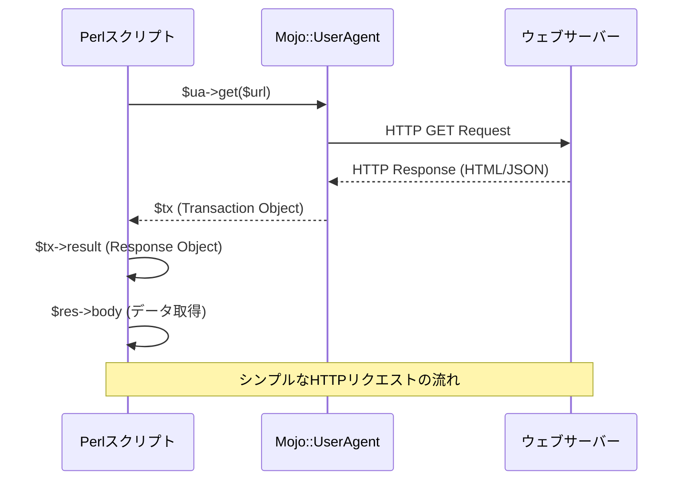
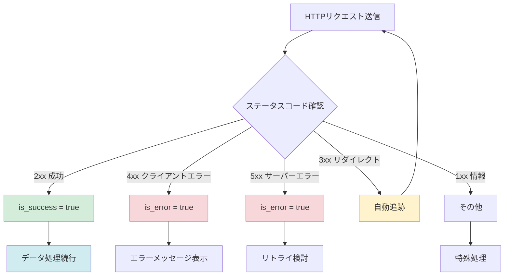
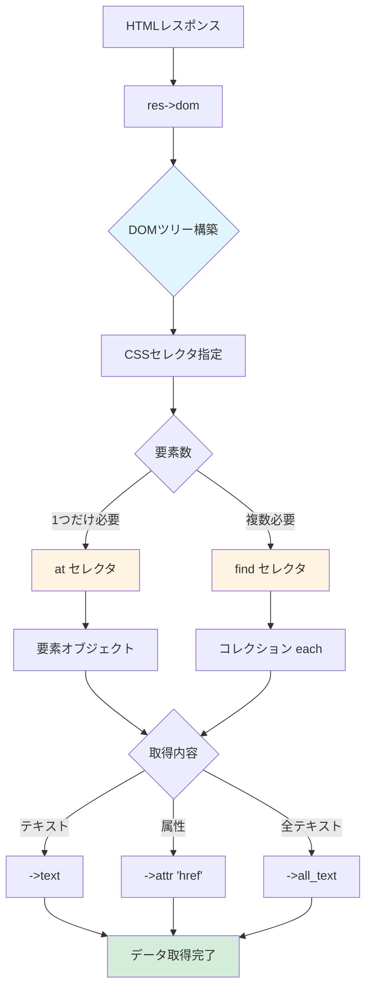
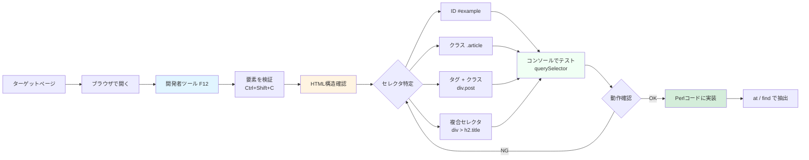
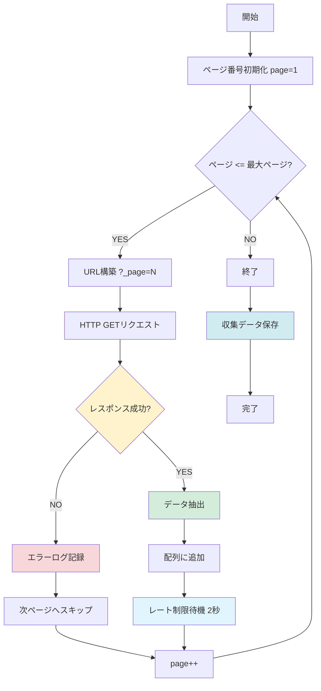
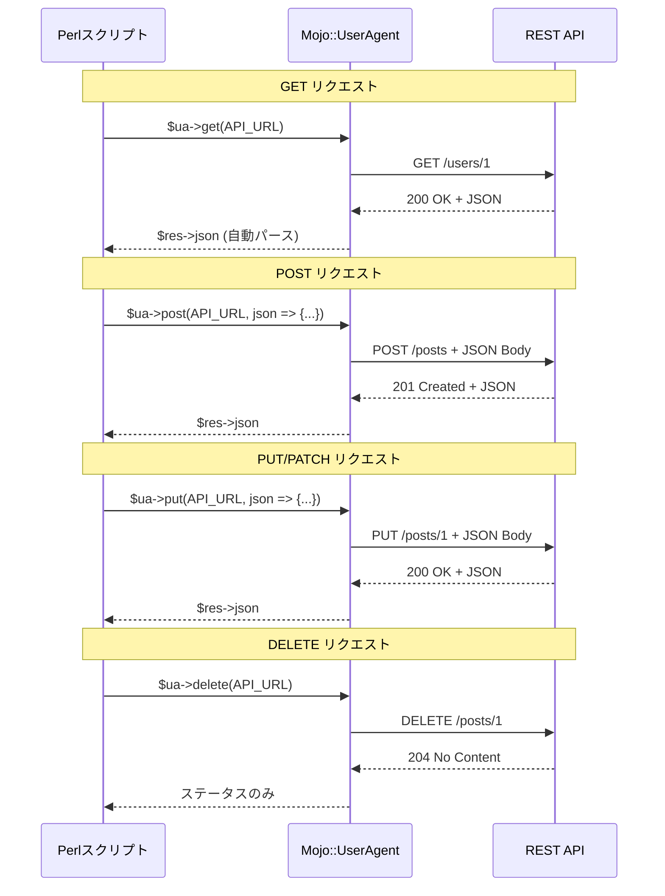
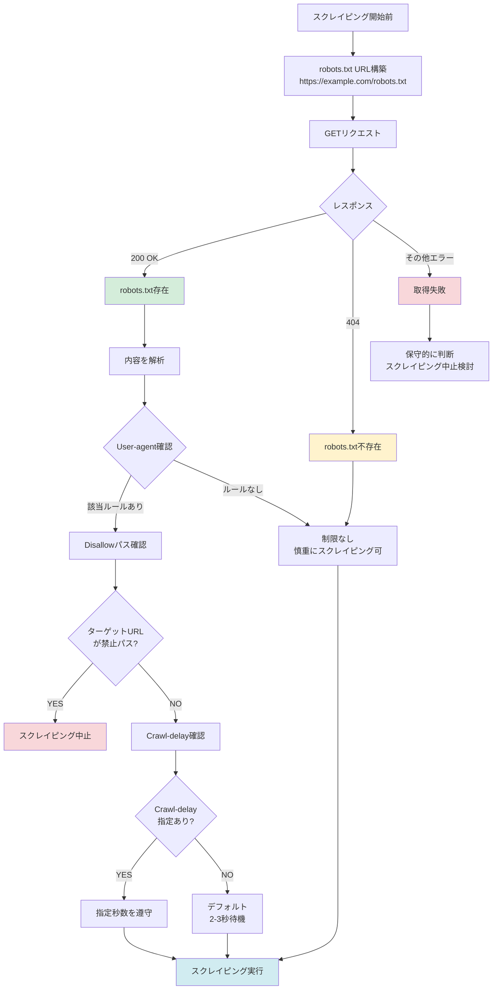
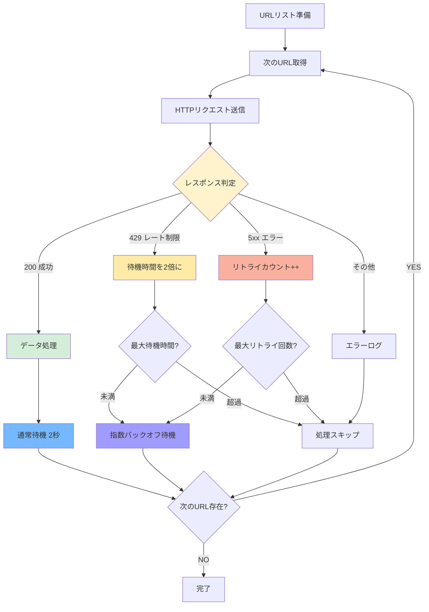
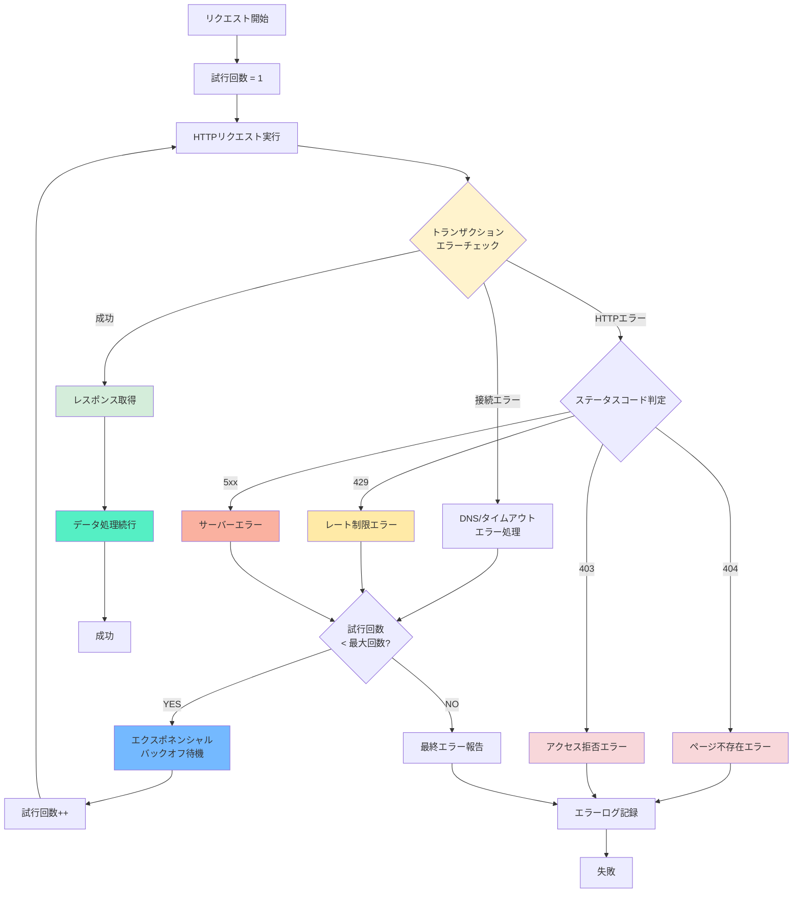

## はじめに：Perlで始めるWebスクレイピング

**この記事でわかること**

- Mojo::UserAgentの基本的な使い方とインストール方法
- HTTP GETリクエストの送信とレスポンス処理の実装
- CSSセレクタを使ったHTML解析とDOM操作のテクニック
- REST APIとのJSON通信の実装方法
- エラーハンドリング、レート制限など本番運用のベストプラクティス
- robots.txtの確認方法とエシカルスクレイピングの基礎

この記事は、**Perlウェブスクレイピング初心者**の方でも段階的に学べる実践チュートリアルです。約30分で基本的なスクレイパーを作成できるようになります。

### ウェブスクレイピングとは何か

ウェブスクレイピングとは、ウェブサイトから必要な情報を自動的に収集する技術です。Perlは、そのテキスト処理能力の高さと豊富なライブラリにより、ウェブスクレイピング入門に最適な言語といえます。例えば以下のような場面で活用できます。

- 複数の技術ブログから最新記事を定期的に収集する
- ECサイトの価格変動を追跡する
- REST APIからデータを取得して自動処理する
- 研究や分析のためのデータを収集する



**図: スクレイピングの基本的なワークフロー**

### Mojo::UserAgentを選ぶべき3つの理由

Perlには様々なHTTPクライアントライブラリが存在します（LWP::UserAgent、WWW::Mechanizeなど）が、Mojo::UserAgentはWebスクレイピングにおいて特に以下の点で優れています。

**1. 組み込みのHTML/XML解析機能**
- Mojo::DOMによるCSSセレクタをサポート
- 追加のパーサーモジュールが不要
- 直感的なAPIを提供

**2. モダンな機能が標準装備**
- 同期・非同期の両方に対応
- WebSocketをサポート
- IPv6、TLS、SNIに対応
- JSON自動エンコード/デコードを実装

**3. アクティブなメンテナンス**
- Mojoliciousエコシステムの一部として継続的に更新される
- 豊富なドキュメントとコミュニティサポートがある
- Perl 5.16以降で動作する

### この記事で作れるようになること

このチュートリアルを完了すると、以下のことができるようになります。

- Mojo::UserAgentで任意のウェブページにアクセスする
- HTMLから欲しい情報を抽出する
- 複数ページを自動巡回するスクリプトを作成する
- REST APIとのJSON通信を行う
- エラーに強い堅牢なスクレイパーを実装する

それでは実際に手を動かして学んでいきましょう！

## 環境準備：5分でセットアップ完了

### Mojoliciousのインストール方法

Mojo::UserAgentはMojoliciousフレームワークに含まれています。インストールは非常に簡単です。

**cpanmを使う場合**（推奨）:
```bash
# cpanmがない場合は先にインストール
curl -L https://cpanmin.us | perl - App::cpanminus

# Mojoliciousをインストール
cpanm Mojolicious
```

**cpanを使う場合**:
```bash
cpan Mojolicious
```

**バージョン要件**:
- Perl: 5.16以降（推奨は5.38以降）
- Mojolicious: 9.0以降（執筆時点の最新は9.38）

**システム要件**:
- インターネット接続
- SSL/TLS対応（IO::Socket::SSLが推奨）
- 5MB程度のディスク空間

### 動作確認とトラブルシューティング

インストールが完了したら、動作確認をしましょう。

```perl
#!/usr/bin/env perl
# check_install.pl
# Perl 5.16以降
# 依存: Mojolicious 9.0以降

use strict;
use warnings;
use Mojo::UserAgent;

# バージョン確認
print "Mojolicious version: $Mojolicious::VERSION\n";

# 簡単な動作確認
my $ua = Mojo::UserAgent->new;
my $res = $ua->get('https://www.perl.org')->result;

if ($res->is_success) {
    print "成功！Mojo::UserAgentは正常に動作しています。\n";
} else {
    print "エラー: " . $res->message . "\n";
}
```

実行してみましょう:
```bash
perl check_install.pl
```

**よくあるトラブルと対処法**

| 問題 | 原因 | 解決策 |
|------|------|--------|
| `Can't locate Mojolicious` | モジュール未インストール | `cpanm Mojolicious`を実行する |
| SSL接続エラー | SSL証明書の問題 | `IO::Socket::SSL`をインストール: `cpanm IO::Socket::SSL` |
| タイムアウト | ネットワーク接続の問題 | プロキシ設定を確認、またはタイムアウト値を増やす |

## ステップ1：最初のHTTPリクエストを送る

### 最小構成のコード

まずは最もシンプルなHTTP GETリクエストから始めましょう。



**図: HTTP GETリクエストのシーケンス図**

```perl
#!/usr/bin/env perl
# simple_get.pl
# Perl 5.16以降
# 依存: Mojolicious 9.0以降

use strict;
use warnings;
use Mojo::UserAgent;

# UserAgentオブジェクトを作成
my $ua = Mojo::UserAgent->new;

# GETリクエストを送信
my $tx = $ua->get('https://www.perl.org');

# レスポンスを取得
my $res = $tx->result;

# 本文を表示
print $res->body;
```

**コードの解説**

- `Mojo::UserAgent->new`: HTTPクライアントを作成する
- `$ua->get($url)`: 指定URLにGETリクエストを送信し、トランザクションオブジェクト（`$tx`）を返す
- `$tx->result`: レスポンスオブジェクトを取得する
- `$res->body`: レスポンス本文（HTML）を取得する

### レスポンスを表示する

より実用的に、取得したデータを確認しやすくしましょう。

```perl
#!/usr/bin/env perl
# display_response.pl
# Perl 5.16以降
# 依存: Mojolicious 9.0以降

use strict;
use warnings;
use feature 'say';
use Mojo::UserAgent;

my $ua = Mojo::UserAgent->new;
my $res = $ua->get('https://jsonplaceholder.typicode.com/posts/1')->result;

# ステータスコードを表示
say "Status: " . $res->code;

# レスポンスヘッダーを表示
say "Content-Type: " . $res->headers->content_type;

# 本文を表示（最初の500文字）
my $body = $res->body;
say "Body (first 500 chars):";
say substr($body, 0, 500);
```

### ステータスコードの確認方法

HTTP通信では、リクエストが成功したかどうかをステータスコードで判断します。



**図: HTTPステータスコード判定フロー**

```perl
#!/usr/bin/env perl
# check_status.pl
# Perl 5.16以降
# 依存: Mojolicious 9.0以降

use strict;
use warnings;
use feature 'say';
use Mojo::UserAgent;

my $ua = Mojo::UserAgent->new;
my $res = $ua->get('https://www.perl.org')->result;

# ステータスコードで分岐
if ($res->is_success) {
    # 2xx系レスポンス（成功）
    say "成功！ステータスコード: " . $res->code;
} elsif ($res->is_error) {
    # 4xx, 5xx系レスポンス（エラー）
    say "エラー: " . $res->message;
    say "ステータスコード: " . $res->code;
} else {
    # 1xx, 3xx系レスポンス（情報、リダイレクト）
    say "その他のレスポンス: " . $res->code;
}

# 個別のステータスコード判定
if ($res->code == 200) {
    say "OK - リクエスト成功";
} elsif ($res->code == 404) {
    say "Not Found - ページが存在しません";
} elsif ($res->code == 429) {
    say "Too Many Requests - レート制限に達しました";
} elsif ($res->code >= 500) {
    say "Server Error - サーバー側のエラーです";
}
```

**重要なステータスコード一覧**

| コード | 意味 | 対処方法 |
|--------|------|----------|
| 200 | OK - 成功 | そのまま処理を続行する |
| 301/302 | リダイレクト | Mojo::UserAgentは自動で追跡する |
| 403 | Forbidden - アクセス拒否 | User-Agentやrobots.txtを確認する |
| 404 | Not Found - ページなし | URLを確認する |
| 429 | Too Many Requests | レート制限を実装、待機時間を増やす |
| 500/503 | Server Error | リトライ処理を実装する |

## ステップ2：CSSセレクタでHTMLから情報を取り出す

### Mojo::DOMによるHTML解析の基礎

取得したHTMLから必要な情報を抽出するには、Mojo::DOMを使用します。



**図: Mojo::DOMによるHTML解析の流れ**

```perl
#!/usr/bin/env perl
# parse_html.pl
# Perl 5.16以降
# 依存: Mojolicious 9.0以降

use strict;
use warnings;
use feature 'say';
use Mojo::UserAgent;

my $ua = Mojo::UserAgent->new;
my $res = $ua->get('https://www.perl.org')->result;

# DOMオブジェクトを取得
my $dom = $res->dom;

# タイトルを取得（安全に）
if (my $title_elem = $dom->at('title')) {
    say "ページタイトル: " . $title_elem->text;
} else {
    say "タイトル要素が見つかりません";
}

# 最初のh1要素を取得
if (my $h1 = $dom->at('h1')) {
    say "最初のh1: " . $h1->text;
} else {
    say "h1要素が見つかりません";
}

# すべてのh2要素を取得
say "\nすべてのh2要素:";
for my $h2 ($dom->find('h2')->each) {
    say "- " . $h2->text;
}
```

**DOMメソッドの使い分け**

| メソッド | 戻り値 | 使用場面 |
|----------|--------|----------|
| `at($selector)` | 最初の要素1つ | タイトルや特定の要素を取得する |
| `find($selector)` | すべての要素のコレクション | 複数の記事やリンクを取得する |
| `text` | テキストのみ | タグを除いた文字列が欲しい場合 |
| `all_text` | 子孫すべてのテキスト | ネストした要素のテキストも取得する |
| `attr($name)` | 属性値 | href、src、idなどの属性を取得する |

### CSSセレクタの基本パターン

Mojo::DOMはCSS3セレクタをサポートしています。よく使うパターンを覚えましょう。

```perl
#!/usr/bin/env perl
# css_selectors.pl
# Perl 5.16以降
# 依存: Mojolicious 9.0以降

use strict;
use warnings;
use feature 'say';
use Mojo::UserAgent;

my $ua = Mojo::UserAgent->new;

# サンプルHTMLで練習
my $html = <<'HTML';
<html>
<head><title>サンプルページ</title></head>
<body>
  <h1 id="main-title">メインタイトル</h1>
  <div class="article">
    <h2 class="title">記事1</h2>
    <p>これは記事1の内容です。</p>
    <a href="https://example.com/1">続きを読む</a>
  </div>
  <div class="article">
    <h2 class="title">記事2</h2>
    <p>これは記事2の内容です。</p>
    <a href="https://example.com/2">続きを読む</a>
  </div>
</body>
</html>
HTML

my $dom = Mojo::DOM->new($html);

# 1. IDで要素を取得
say "IDセレクタ (#main-title):";
say $dom->at('#main-title')->text;

# 2. クラスで要素を取得
say "\nクラスセレクタ (.title):";
for my $title ($dom->find('.title')->each) {
    say "- " . $title->text;
}

# 3. 子孫セレクタ（divの中のa要素）
say "\n子孫セレクタ (div a):";
for my $link ($dom->find('div a')->each) {
    say "- " . $link->attr('href') . " : " . $link->text;
}

# 4. 複合セレクタ（class="article"のdiv内のh2）
say "\n複合セレクタ (div.article h2):";
for my $h2 ($dom->find('div.article h2')->each) {
    say "- " . $h2->text;
}

# 5. 属性セレクタ（href属性を持つすべての要素）
say "\n属性セレクタ ([href]):";
for my $link ($dom->find('[href]')->each) {
    say "- " . $link->attr('href');
}

# 6. 否定セレクタ（class="title"以外のh2）
say "\n否定セレクタ (h2:not(.title)):";
for my $h2 ($dom->find('h2:not(.title)')->each) {
    say "- " . $h2->text;
}
```

**よく使うCSSセレクタ早見表**

| セレクタ | 例 | マッチする要素 |
|----------|-----|----------------|
| タグ名 | `p` | すべての`<p>`要素 |
| ID | `#header` | `id="header"`の要素 |
| クラス | `.article` | `class="article"`を含む要素 |
| 子孫 | `div p` | `<div>`内のすべての`<p>` |
| 直接の子 | `div > p` | `<div>`の直下の`<p>`のみ |
| 属性 | `[href]` | href属性を持つ要素 |
| 属性値一致 | `[type="text"]` | `type="text"`の要素 |
| 複数クラス | `.post.featured` | 両方のクラスを持つ要素 |
| 否定 | `:not(.hidden)` | `class="hidden"`以外 |
| 最初の子 | `:first-child` | 親の最初の子要素 |

### テキストとリンクの抽出実例

実際のウェブページからデータを抽出してみましょう。

```perl
#!/usr/bin/env perl
# extract_links.pl
# Perl 5.16以降
# 依存: Mojolicious 9.0以降

use strict;
use warnings;
use feature 'say';
use Mojo::UserAgent;

my $ua = Mojo::UserAgent->new;
# 礼儀正しくUser-Agentを設定
$ua->agent('PerlScraper/1.0 (Learning Purpose)');

my $res = $ua->get('https://blogs.perl.org')->result;

unless ($res->is_success) {
    die "リクエスト失敗: " . $res->message;
}

my $dom = $res->dom;

# すべてのリンクを抽出
say "=== リンク一覧 ===";
for my $link ($dom->find('a[href]')->each) {
    my $href = $link->attr('href');
    my $text = $link->text // '（テキストなし）';
    
    # 空のリンクをスキップ
    next unless $href;
    
    # 相対URLを絶対URLに変換
    my $abs_url = Mojo::URL->new($href)->to_abs($res->request->url);
    
    say "$text => $abs_url";
}
```

**実践Tips**

- `text // 'デフォルト値'`: テキストがない場合のフォールバック
- 相対URLを絶対URLに変換すると扱いやすくなる
- リンクが空でないかチェックする

## ステップ3：実践！ブログ記事を収集する

### 目標の設定：何を作るか

ここでは、技術ブログから記事タイトルとURLを収集するスクレイパーを作成します。対象サイトはJSONPlaceholderのようなテスト用APIや、公開されているブログサイトを使用します。



**仕様**

- 記事タイトルを抽出する
- 記事へのリンクURLを取得する
- 投稿日があれば取得する
- 結果をCSVファイルに保存する

### 記事タイトルの抽出コード

まずは1ページから記事情報を抽出します。

```perl
#!/usr/bin/env perl
# extract_articles.pl
# Perl 5.16以降
# 依存: Mojolicious 9.0以降

use strict;
use warnings;
use feature 'say';
use Mojo::UserAgent;

my $ua = Mojo::UserAgent->new;
$ua->agent('PerlBlogScraper/1.0');

# ブログのトップページにアクセス
my $res = $ua->get('https://blogs.perl.org')->result;

unless ($res->is_success) {
    die "リクエスト失敗: " . $res->message . "\n";
}

my $dom = $res->dom;

# 記事要素を見つける（サイトごとに異なる）
# ※実際のサイトのHTML構造に応じて調整が必要
say "=== 記事一覧 ===\n";

# h2内のリンクを記事タイトルと仮定
for my $article ($dom->find('h2 > a')->each) {
    my $title = $article->text;
    my $url = $article->attr('href');
    
    # 絶対URLに変換
    my $abs_url = Mojo::URL->new($url)->to_abs($res->request->url);
    
    say "タイトル: $title";
    say "URL: $abs_url";
    say "-" x 50;
}
```

**DOM構造の調査方法**

1. ブラウザでページを開く
2. 開発者ツール（F12キー）を開く
3. 要素を選択（Ctrl+Shift+C または要素の検証）して構造を確認する
4. 記事のコンテナとなる要素のクラスやIDを特定する
5. CSSセレクタで表現できるか検証する
6. コンソールで`document.querySelector('セレクタ')`を試して動作確認する



**図: CSSセレクタ特定のワークフロー**

**初心者向けTips**

- まずは1つの記事要素だけを抽出して試す
- セレクタが複雑になりすぎる場合は、より単純な構造を探す
- 要素が見つからない場合は`at()`の戻り値が`undef`になるのでチェックする

### 複数ページの自動処理

ページネーションがあるサイトから複数ページを処理します。



**図: 複数ページ自動収集のフローチャート**

```perl
#!/usr/bin/env perl
# scrape_multiple_pages.pl
# Perl 5.16以降
# 依存: Mojolicious 9.0以降、Time::HiRes

use strict;
use warnings;
use feature 'say';
use Mojo::UserAgent;
use Time::HiRes qw(usleep);

my $ua = Mojo::UserAgent->new;
$ua->agent('PerlBlogScraper/1.0');

# 収集する記事データを格納
my @articles;

# 複数ページを処理（例: 1-3ページ）
for my $page (1..3) {
    my $url = "https://jsonplaceholder.typicode.com/posts?_page=$page&_limit=10";
    
    say "ページ $page を処理中...";
    
    my $res = $ua->get($url)->result;
    
    unless ($res->is_success) {
        warn "ページ $page の取得失敗: " . $res->message;
        next; # 次のページへ
    }
    
    # JSONレスポンスをパース
    my $posts = $res->json;
    
    for my $post (@$posts) {
        push @articles, {
            id    => $post->{id},
            title => $post->{title},
            body  => substr($post->{body}, 0, 100) . '...',
        };
    }
    
    # レート制限: 2秒待機（サーバーに優しく！）
    say "待機中...";
    usleep(2_000_000); # 2秒 = 2,000,000マイクロ秒
}

# 収集結果を表示
say "\n=== 収集結果 ===";
say "総記事数: " . scalar(@articles);
for my $article (@articles) {
    say "ID: $article->{id}";
    say "タイトル: $article->{title}";
    say "内容: $article->{body}";
    say "-" x 50;
}
```

### 結果をファイルに保存

収集したデータをCSV形式で保存します。

```perl
#!/usr/bin/env perl
# save_to_csv.pl
# Perl 5.16以降
# 依存: Mojolicious 9.0以降、Text::CSV

use strict;
use warnings;
use feature 'say';
use Mojo::UserAgent;
use Time::HiRes qw(usleep);
use Text::CSV;
use Encode qw(encode);

my $ua = Mojo::UserAgent->new;
$ua->agent('PerlBlogScraper/1.0');

# CSV出力の準備
my $csv = Text::CSV->new({ binary => 1, eol => "\n" });
open my $fh, '>:encoding(utf8)', 'articles.csv' or die "ファイルを開けません: $!";

# CSVヘッダーを書き込み
$csv->print($fh, ['ID', 'タイトル', 'URL']);

# 記事を収集
for my $page (1..3) {
    my $url = "https://jsonplaceholder.typicode.com/posts?_page=$page&_limit=10";
    
    say "ページ $page を処理中...";
    
    my $res = $ua->get($url)->result;
    
    unless ($res->is_success) {
        warn "エラー: " . $res->message;
        next;
    }
    
    my $posts = $res->json;
    
    for my $post (@$posts) {
        # CSVに書き込み
        $csv->print($fh, [
            $post->{id},
            $post->{title},
            "https://jsonplaceholder.typicode.com/posts/$post->{id}"
        ]);
    }
    
    usleep(2_000_000); # 2秒待機
}

close $fh;
say "\narticles.csv に保存しました！";
```

**CSVライブラリがない場合のインストール**

```bash
cpanm Text::CSV
```

## ステップ4：REST APIとJSON通信を行う

### REST APIへのアクセス方法

Mojo::UserAgentは、REST APIとの通信に最適化されています。



**図: REST API操作のシーケンス図（各HTTPメソッド）**

```perl
#!/usr/bin/env perl
# rest_api_get.pl
# Perl 5.16以降
# 依存: Mojolicious 9.0以降

use strict;
use warnings;
use feature 'say';
use Mojo::UserAgent;
use Data::Dumper;

my $ua = Mojo::UserAgent->new;

# GETリクエストでJSONを取得
my $res = $ua->get('https://jsonplaceholder.typicode.com/users/1')->result;

if ($res->is_success) {
    # JSONを自動的にPerlのデータ構造に変換
    my $user = $res->json;
    
    say "=== ユーザー情報 ===";
    say "ID: " . $user->{id};
    say "名前: " . $user->{name};
    say "Email: " . $user->{email};
    say "会社: " . $user->{company}{name};
    
    # デバッグ用：全データを表示
    say "\n=== 全データ（デバッグ用） ===";
    print Dumper($user);
} else {
    die "エラー: " . $res->message;
}
```

### JSONレスポンスの解析

複雑なJSON構造を扱う例です。

```perl
#!/usr/bin/env perl
# parse_complex_json.pl
# Perl 5.16以降
# 依存: Mojolicious 9.0以降

use strict;
use warnings;
use feature 'say';
use Mojo::UserAgent;

my $ua = Mojo::UserAgent->new;

# ユーザー一覧を取得
my $res = $ua->get('https://jsonplaceholder.typicode.com/users')->result;

unless ($res->is_success) {
    die "エラー: " . $res->message;
}

# JSONを配列リファレンスとして取得
my $users = $res->json;

say "=== ユーザー一覧（" . scalar(@$users) . "人） ===\n";

for my $user (@$users) {
    say "名前: " . $user->{name};
    say "メール: " . $user->{email};
    
    # ネストしたデータへのアクセス
    say "住所: " . $user->{address}{city} . ", " . $user->{address}{street};
    
    # 座標情報（さらにネストしている）
    say "座標: (" . $user->{address}{geo}{lat} . ", " . $user->{address}{geo}{lng} . ")";
    say "-" x 50;
}
```

### データの活用方法

取得したJSONデータをPOSTで送信する例です。

```perl
#!/usr/bin/env perl
# post_json.pl
# Perl 5.16以降
# 依存: Mojolicious 9.0以降

use strict;
use warnings;
use feature 'say';
use Mojo::UserAgent;

my $ua = Mojo::UserAgent->new;

# POSTするJSONデータ
my $post_data = {
    title  => 'Perlでスクレイピング入門',
    body   => 'Mojo::UserAgentは素晴らしい！',
    userId => 1,
};

# JSONとしてPOST
my $res = $ua->post(
    'https://jsonplaceholder.typicode.com/posts',
    json => $post_data
)->result;

if ($res->is_success) {
    my $created = $res->json;
    
    say "投稿に成功しました！";
    say "作成されたID: " . $created->{id};
    say "タイトル: " . $created->{title};
    say "内容: " . $created->{body};
} else {
    die "エラー: " . $res->message;
}
```

**PUT、DELETEメソッドの例**

```perl
#!/usr/bin/env perl
# http_methods.pl
# Perl 5.16以降
# 依存: Mojolicious 9.0以降

use strict;
use warnings;
use feature 'say';
use Mojo::UserAgent;

my $ua = Mojo::UserAgent->new;

# PUT: データの更新
say "=== PUT: データ更新 ===";
my $update_data = {
    id     => 1,
    title  => '更新されたタイトル',
    body   => '更新された本文',
    userId => 1,
};

my $res = $ua->put(
    'https://jsonplaceholder.typicode.com/posts/1',
    json => $update_data
)->result;

if ($res->is_success) {
    say "更新成功: " . $res->json->{title};
}

# DELETE: データの削除
say "\n=== DELETE: データ削除 ===";
$res = $ua->delete('https://jsonplaceholder.typicode.com/posts/1')->result;

if ($res->is_success) {
    say "削除成功（ステータス: " . $res->code . "）";
}

# PATCH: 部分的な更新
say "\n=== PATCH: 部分更新 ===";
$res = $ua->patch(
    'https://jsonplaceholder.typicode.com/posts/1',
    json => { title => '部分的に更新' }
)->result;

if ($res->is_success) {
    say "部分更新成功: " . $res->json->{title};
}
```

## 失敗しないためのスクレイピングベストプラクティス

### robots.txtを必ず確認する理由と方法

スクレイピングを行う前に、必ず対象サイトの`robots.txt`を確認しましょう。これはウェブマナーの基本です。

**robots.txtとは**

- ウェブサイトのルートディレクトリに配置される（例: `https://example.com/robots.txt`）
- どのパスがクローリング可能/不可能かを示す
- クロール間隔（Crawl-delay）の推奨値を指定することもある

**robots.txtの確認例**

```perl
#!/usr/bin/env perl
# check_robots.pl
# Perl 5.16以降
# 依存: Mojolicious 9.0以降

use strict;
use warnings;
use feature 'say';
use Mojo::UserAgent;
use Mojo::URL;

sub check_robots_txt {
    my ($url) = @_;
    
    my $ua = Mojo::UserAgent->new;
    
    # URLからrobots.txtのURLを構築
    my $base_url = Mojo::URL->new($url)->base;
    my $robots_url = $base_url->clone->path('/robots.txt');
    
    say "robots.txtを確認: $robots_url";
    
    my $res = $ua->get($robots_url)->result;
    
    if ($res->is_success) {
        say "\n=== robots.txt の内容 ===";
        say $res->body;
        return 1;
    } elsif ($res->code == 404) {
        say "robots.txtが存在しません（スクレイピング制限なし）";
        return 1;
    } else {
        warn "robots.txtの取得に失敗: " . $res->message;
        return 0;
    }
}

# 使用例
check_robots_txt('https://www.perl.org');
```

**robots.txtの読み方**

```
User-agent: *
Disallow: /private/
Disallow: /admin/
Crawl-delay: 10
```

上記の例の意味

- `User-agent: *`: すべてのボットに適用する
- `Disallow: /private/`: `/private/`以下はクロール禁止
- `Crawl-delay: 10`: リクエスト間隔を10秒以上空ける



**図: robots.txt確認とルール適用フロー**

**重要な注意点**

- `robots.txt`を無視すると、IPアドレスがブロックされる可能性がある
- 法的問題に発展するケースもある（Computer Fraud and Abuse Act等）
- エシカルスクレイピングの基本として必ず尊重すること

### サーバーに優しいレート制限の実装

適切なレート制限は、サーバーへの負荷を軽減し、長期的にスクレイピングを継続するために不可欠です。



**図: 動的レート制限とリトライロジックのフローチャート**

**基本的なレート制限**

```perl
#!/usr/bin/env perl
# rate_limiting.pl
# Perl 5.16以降
# 依存: Mojolicious 9.0以降、Time::HiRes

use strict;
use warnings;
use feature 'say';
use Mojo::UserAgent;
use Time::HiRes qw(usleep);

my $ua = Mojo::UserAgent->new;
my @urls = (
    'https://jsonplaceholder.typicode.com/posts/1',
    'https://jsonplaceholder.typicode.com/posts/2',
    'https://jsonplaceholder.typicode.com/posts/3',
);

# 各URLを処理
for my $url (@urls) {
    say "取得中: $url";
    
    my $res = $ua->get($url)->result;
    
    if ($res->is_success) {
        my $data = $res->json;
        say "  タイトル: " . $data->{title};
    }
    
    # 2秒待機（サーバーに優しく）
    say "  待機中...";
    usleep(2_000_000); # 2秒 = 2,000,000マイクロ秒
}
```

**動的レート制限（429エラーに対応）**

```perl
#!/usr/bin/env perl
# adaptive_rate_limiting.pl
# Perl 5.16以降
# 依存: Mojolicious 9.0以降、Time::HiRes

use strict;
use warnings;
use feature 'say';
use Mojo::UserAgent;
use Time::HiRes qw(usleep);
use List::Util qw(min);

my $ua = Mojo::UserAgent->new;

# レート制限の設定
my $delay = 2;        # 初期待機時間（秒）
my $max_delay = 60;   # 最大待機時間（秒）
my $backoff_factor = 2; # バックオフ係数

my @urls = map { "https://jsonplaceholder.typicode.com/posts/$_" } (1..10);

for my $url (@urls) {
    my $success = 0;
    my $retries = 0;
    my $max_retries = 5;
    
    while (!$success && $retries < $max_retries) {
        say "取得中: $url (試行: " . ($retries + 1) . ")";
        
        my $res = $ua->get($url)->result;
        
        if ($res->is_success) {
            # 成功：遅延をリセット
            say "  成功！";
            $delay = 2;
            $success = 1;
        } elsif ($res->code == 429) {
            # レート制限：遅延を増やす
            $retries++;
            $delay = min($delay * $backoff_factor, $max_delay);
            warn "  レート制限検出！ ${delay}秒待機します...";
            usleep($delay * 1_000_000);
        } else {
            # その他のエラー
            warn "  エラー: " . $res->message;
            last;
        }
    }
    
    # 通常の待機
    usleep(2_000_000) if $success;
}
```

**推奨レート制限ガイドライン**

| サイトタイプ | 推奨間隔 | 理由 |
|--------------|----------|------|
| 個人ブログ | 3-5秒 | サーバーリソースが限られている |
| 中規模サイト | 2-3秒 | 一般的な負荷分散 |
| 大規模サイト | 1-2秒 | インフラが強固だが礼儀として |
| API（制限なし） | 1秒 | APIは通常スクレイピングより堅牢 |

**Crawl-delayの尊重**

`robots.txt`に`Crawl-delay`が指定されている場合は、それを優先します。

### エラーハンドリングとリトライ戦略

堅牢なスクレイパーは、一時的なエラーを適切に処理します。



**図: 包括的エラーハンドリングとリトライのフロー**

**包括的なエラーハンドリング**

```perl
#!/usr/bin/env perl
# robust_error_handling.pl
# Perl 5.16以降
# 依存: Mojolicious 9.0以降

use strict;
use warnings;
use feature 'say';
use Mojo::UserAgent;

sub fetch_with_error_handling {
    my ($url) = @_;
    
    my $ua = Mojo::UserAgent->new;
    
    # トランザクションを実行
    my $tx = $ua->get($url);
    
    # トランザクションレベルのエラーをチェック
    if (my $err = $tx->error) {
        if ($err->{code}) {
            # HTTPエラー（4xx, 5xx）
            die "HTTPエラー $err->{code}: $err->{message}";
        } else {
            # 接続エラー（タイムアウト、DNS解決失敗など）
            die "接続エラー: $err->{message}";
        }
    }
    
    # レスポンスを取得
    my $res = $tx->result;
    
    # ステータスコード別の処理
    if ($res->is_success) {
        return $res;
    } elsif ($res->code == 404) {
        die "ページが見つかりません: $url";
    } elsif ($res->code == 403) {
        die "アクセスが拒否されました（User-Agentやrobots.txtを確認）";
    } elsif ($res->code == 429) {
        die "レート制限に達しました（待機時間を増やしてください）";
    } elsif ($res->code >= 500) {
        die "サーバーエラー（リトライを検討）: " . $res->code;
    } else {
        die "予期しないレスポンス: " . $res->code;
    }
}

# 使用例
eval {
    my $res = fetch_with_error_handling('https://jsonplaceholder.typicode.com/posts/1');
    say "成功: " . $res->json->{title};
};
if ($@) {
    warn "エラーが発生しました: $@";
}
```

**リトライロジックの実装**

```perl
#!/usr/bin/env perl
# retry_logic.pl
# Perl 5.16以降
# 依存: Mojolicious 9.0以降、Time::HiRes

use strict;
use warnings;
use feature 'say';
use Mojo::UserAgent;
use Time::HiRes qw(usleep);

sub fetch_with_retry {
    my ($url, $max_retries, $base_delay) = @_;
    $max_retries //= 3;
    $base_delay  //= 2; # 秒
    
    my $ua = Mojo::UserAgent->new;
    
    for my $attempt (1..$max_retries) {
        say "試行 $attempt/$max_retries: $url";
        
        my $res = $ua->get($url)->result;
        
        # 成功したら即座に返す
        if ($res->is_success) {
            say "  成功！";
            return $res;
        }
        
        # 最終試行でない場合は待機
        if ($attempt < $max_retries) {
            my $delay = $base_delay * (2 ** ($attempt - 1)); # エクスポネンシャルバックオフ
            warn "  失敗（" . $res->code . "）。${delay}秒後にリトライ...";
            usleep($delay * 1_000_000);
        }
    }
    
    # すべての試行が失敗
    die "最大リトライ回数（$max_retries）に達しました";
}

# 使用例
eval {
    my $res = fetch_with_retry('https://jsonplaceholder.typicode.com/posts/1');
    say "タイトル: " . $res->json->{title};
};
if ($@) {
    warn "最終的に失敗しました: $@";
}
```

### User-Agentの適切な設定

User-Agentは、あなたのスクレイパーの身元を示す重要なヘッダーです。

**推奨されるUser-Agentの設定**

```perl
#!/usr/bin/env perl
# user_agent_settings.pl
# Perl 5.16以降
# 依存: Mojolicious 9.0以降

use strict;
use warnings;
use feature 'say';
use Mojo::UserAgent;

# 1. 正直にボットであることを示す（推奨）
my $ua1 = Mojo::UserAgent->new;
$ua1->agent('MyBlogScraper/1.0 (+https://mywebsite.com/scraper-info)');

# 2. 一般的なブラウザを装う（必要な場合のみ）
my $ua2 = Mojo::UserAgent->new;
$ua2->agent('Mozilla/5.0 (Windows NT 10.0; Win64; x64) AppleWebKit/537.36 (KHTML, like Gecko) Chrome/120.0.0.0 Safari/537.36');

# 3. リクエストごとに個別設定
my $ua3 = Mojo::UserAgent->new;
my $res = $ua3->get(
    'https://example.com',
    { 'User-Agent' => 'CustomBot/2.0' }
)->result;

# デフォルトのUser-Agentを確認
say "デフォルトUA: " . Mojo::UserAgent->new->agent;
```

**User-Agent設定のベストプラクティス**

| ケース | 推奨設定 | 例 |
|--------|----------|-----|
| 学習・研究目的 | ボット名+バージョン+URL | `PerlScraper/1.0 (+https://mysite.com/bot)` |
| 商用スクレイパー | 会社名+製品名+連絡先 | `CompanyName-Bot/1.0 (contact@company.com)` |
| アンチボット回避 | 最新のブラウザUA | `Mozilla/5.0 (...)` |

**重要な注意**

- 正直に身元を明かすことが最も安全
- ブラウザを装う場合でも、他のヘッダー（Accept、Refererなど）も設定すると効果的
- User-AgentだけでなくIPアドレスでもブロックされる可能性がある

**複数のヘッダーを設定する例**

```perl
#!/usr/bin/env perl
# custom_headers.pl
# Perl 5.16以降
# 依存: Mojolicious 9.0以降

use strict;
use warnings;
use feature 'say';
use Mojo::UserAgent;

my $ua = Mojo::UserAgent->new;

# ブラウザらしいヘッダーをセット
my $res = $ua->get('https://example.com' => {
    'User-Agent'      => 'Mozilla/5.0 (Windows NT 10.0; Win64; x64) AppleWebKit/537.36',
    'Accept'          => 'text/html,application/xhtml+xml,application/xml;q=0.9,*/*;q=0.8',
    'Accept-Language' => 'ja,en-US;q=0.9,en;q=0.8',
    'Accept-Encoding' => 'gzip, deflate, br',
    'Referer'         => 'https://www.google.com/',
})->result;

if ($res->is_success) {
    say "リクエスト成功";
}
```

**よくある間違いと対処法**

| 間違い | 問題 | 正しい方法 |
|--------|------|-----------|
| `$dom->at('a')->text` | 要素がないとエラーになる | `if (my $a = $dom->at('a')) { $a->text }` |
| User-Agent未設定 | ブロックされる | `$ua->agent('BotName/1.0')` |
| robots.txt無視 | IPバンのリスク | 必ず事前確認する |
| レート制限なし | サーバー負荷、ブロック | `usleep(2_000_000)` |
| エラー処理なし | スクリプトが止まる | `eval { ... }` または `is_success`チェック |

## まとめ：Mojo::UserAgentで始めるスクレイピング

### 学習の振り返り：習得したスキル

このPerlウェブスクレイピング入門チュートリアルを通じて、以下のスキルを習得しました。

**基礎スキル**

- Mojo::UserAgentのインストールと基本的な使い方
- HTTP GETリクエストの送信とレスポンスの取得
- ステータスコードによるエラーハンドリング

**DOM解析スキル**

- Mojo::DOMによるHTML解析
- CSSセレクタを使った要素の抽出
- テキスト、リンク、属性の取得

**実践スキル**

- 複数ページの自動巡回
- JSONデータの取得と送信（REST API連携）
- データのCSV保存

**ベストプラクティス**

- robots.txtの確認と尊重
- レート制限の実装（固定・動的）
- 包括的なエラーハンドリングとリトライ戦略
- 適切なUser-Agent設定

### 次に学ぶべきこと

スクレイピングスキルをさらに向上させるための次のステップです。

**Perlの基礎を深める**

まだPerlの基礎に自信がない方は、以下の関連記事をご覧ください。

- Perl入門シリーズ（`tags: perl`で検索）
- Mojoliciousフレームワーク入門（`tags: mojolicious`で検索）
- PerlでのHTTPクライアント比較（`tags: http-client`で検索）

**中級トピック**

- 非同期リクエストによる高速化（Mojo::UserAgentの非同期機能）
- Cookieとセッション管理（ログインが必要なサイト）
- フォーム送信とPOSTデータの処理
- プロキシサーバーの利用
- CAPTCHA対策（2Captcha、reCAPTCHA v3など）

**高度なトピック**

- JavaScriptレンダリングサイトの攻略（Selenium、Puppeteer連携）
- 分散スクレイピング（複数サーバーからの並列実行）
- データベースへの保存（SQLite、PostgreSQL、MongoDB）
- スケジューリング（cron、systemdタイマー）
- スクレイピング結果の可視化（グラフ、ダッシュボード）

**法律とエシカル**

- 各国のウェブスクレイピング関連法規
- 利用規約（Terms of Service）の理解
- 個人情報の取り扱い（GDPR、個人情報保護法）

### 役立つ参考リソース

**公式ドキュメント**







**チュートリアルと記事**







**ベストプラクティス**







**書籍**



**コミュニティ**



**関連記事**（内部リンク）

このMojo::UserAgentスクレイピング入門と併せて読むと理解が深まる記事です。

- Mojolicious::Liteでハローワールド（`tags: mojolicious`で検索）
- Perl入門記事シリーズ（`tags: perl`で検索）
- PerlでのJSON処理入門（`tags: perl, json-rpc`で検索）
- PerlとWebSocket通信（`tags: websocket`で検索）
- Dockerコンテナでのスクレイピング環境構築（`tags: docker, perl`で検索）

### クイックリファレンス

**基本的なリクエスト**

```perl
my $ua = Mojo::UserAgent->new;
my $res = $ua->get('https://example.com')->result;
```

**DOM解析**

```perl
my $dom = $res->dom;
my $title = $dom->at('title')->text;           # 1つ取得
my @links = $dom->find('a[href]')->each;       # 複数取得
```

**JSON処理**

```perl
my $data = $res->json;                         # JSON取得
$ua->post($url, json => { key => 'value' });   # JSON送信
```

**エラーハンドリング**

```perl
if ($res->is_success) { ... }
elsif ($res->is_error) { warn $res->message; }
```

**レート制限**

```perl
use Time::HiRes qw(usleep);
usleep(2_000_000);  # 2秒待機
```

---

これでMojo::UserAgentを使ったPerlウェブスクレイピングの基礎をマスターしました！実際にコードを書いて、いろいろなサイトやAPIを試してみてください。

**すぐに始められるアクションプラン**

1. **今すぐ試す**: この記事のコード例をコピーして、実際に動かしてみましょう
2. **小さく始める**: まずはJSONPlaceholderのようなテスト用APIで練習
3. **徐々に拡張**: 慣れてきたら実際のウェブサイトに挑戦
4. **コミュニティに参加**: Mojolicious GitHubやPerl MongerのSlackで質問・情報交換

Perlスクレイピングの世界へようこそ。ハッピースクレイピング！ 🎉
