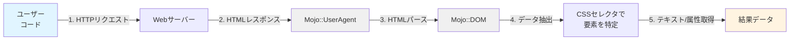
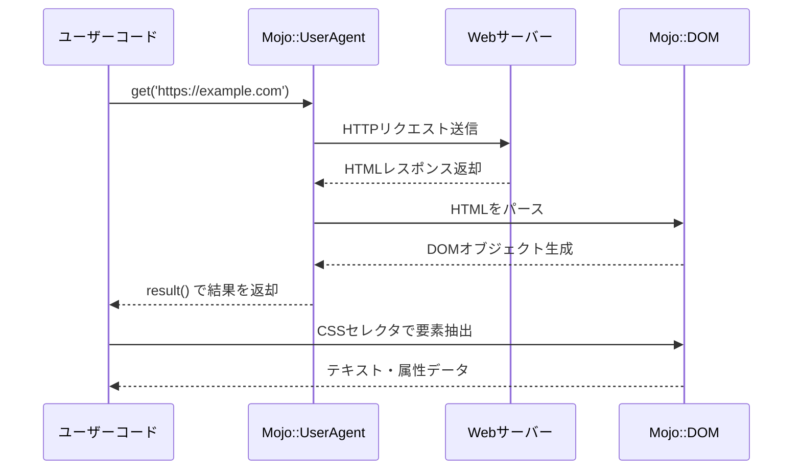
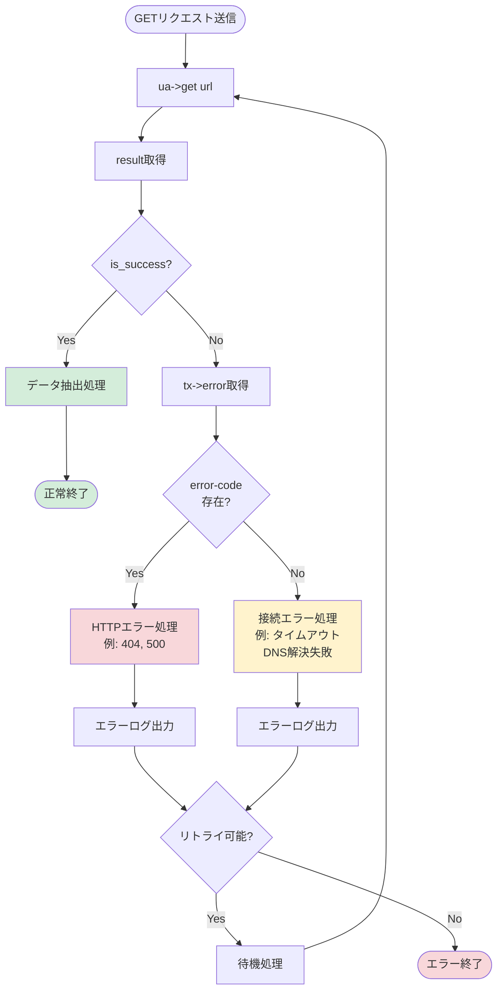
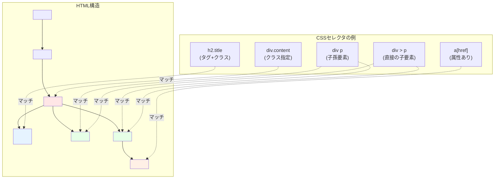
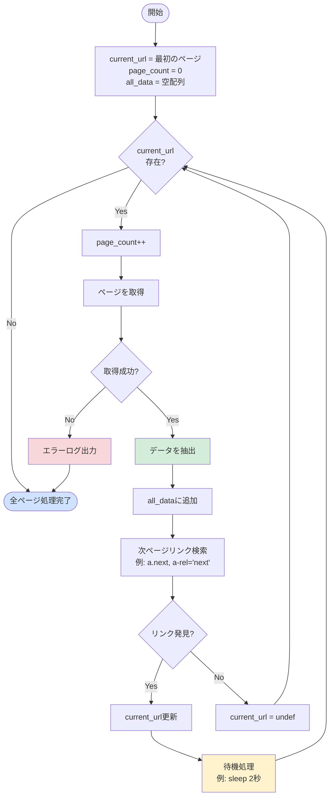

## Mojo::UserAgentとは？なぜスクレイピングに最適なのか

### ウェブスクレイピングの基礎知識

ウェブスクレイピングとは、ウェブサイトから自動的にデータを抽出する技術のことです。ニュースサイトのヘッドライン収集、ECサイトの価格監視、データ分析のための情報収集など、様々な場面で活用されています。

たとえば、以下のような簡単なコードで、ウェブページからタイトルとリンクを抽出できます。

```perl
use Mojo::UserAgent;

my $ua = Mojo::UserAgent->new;
my $res = $ua->get('https://example.com')->result;

# ページタイトルを取得
print "Title: ", $res->dom->at('title')->text, "\n";

# すべてのリンクを抽出
for my $link ($res->dom->find('a[href]')->each) {
    print $link->text, ": ", $link->attr('href'), "\n";
}
```

わずか数行のコードで、これだけのことができるのです。



**図1: スクレイピングの基本的なフロー**

Perlでスクレイピングを行う場合、かつてはLWP::UserAgentが定番でした。しかし、現在ではMojo::UserAgentがモダンで強力な選択肢として注目されています。

### Mojo::UserAgentの3つの強み

Mojo::UserAgentには、スクレイピングに適した以下の3つの特徴があります。

**1. 組み込みHTMLパーサー（Mojo::DOM）**

追加のモジュールをインストールすることなく、HTMLのパースが可能です。CSSセレクタを使って直感的に要素を抽出できるため、フロントエンド開発の経験がある方にとっても馴染みやすい設計となっています。

**2. 同期・非同期の両対応**

シンプルなスクレイピングには同期処理、大量のページを効率的に処理したい場合には非同期処理と、用途に応じて使い分けることができます。

**3. モダンで統一されたAPI**

Mojoliciousフレームワークの一部として開発されているため、一貫性のある美しいAPIを提供しています。HTTP/1.1、TLS/SSL、クッキー管理、自動リダイレクトなど、ウェブクライアントに必要な機能がすべて揃っています。

### LWP::UserAgentとの違いを比較

従来のLWP::UserAgentとMojo::UserAgentの主な違いを整理しておきましょう。

| 機能 | LWP::UserAgent | Mojo::UserAgent |
|------|----------------|-----------------|
| 同期/非同期処理 | 同期のみ | 両方対応 |
| HTMLパース | 外部モジュールが必要 | Mojo::DOMで標準搭載 |
| CSSセレクタ | なし | ネイティブサポート |
| WebSocket対応 | なし | 対応 |
| API設計 | やや古い | モダンで統一的 |

新しくスクレイピングを始めるなら、Mojo::UserAgentを選択することをおすすめします。本記事では、Mojo::UserAgentを使ったスクレイピングの基礎から実践まで、段階的に解説していきます。



**図2: Mojo::UserAgentの処理シーケンス**

なお、Mojoliciousフレームワーク自体については、以下の記事も参考にしてください。

関連記事:
- [Mojolicious::Liteでハローワールド](/2015/02/02/075435)
- [Mojolicious::Liteのプレースホルダとパラメータ](/2015/01/31/082426)

---

## 【ステップ1】環境構築とインストール

### Perlのバージョン確認方法

まず、システムにPerlがインストールされているか確認しましょう。ターミナル（Windowsではコマンドプロンプト）で以下のコマンドを実行します。

```bash
perl -v
```

Perl 5.10以上であれば問題ありません。以下のような出力が表示されます。

```
This is perl 5, version 38, subversion 0 (v5.38.0)
```

もし古いバージョンやインストールされていない場合は、以下のサイトから最新版をインストールしてください。

- **Linux/macOS**: システムパッケージマネージャー（apt、yum、brewなど）でインストール
- **Windows**: Strawberry Perl（）の利用を推奨

### cpanmを使ったMojoliciousのインストール

Mojoliciousのインストールには、CPANモジュールインストーラーの`cpanm`（App::cpanminus）を使用します。

**Linux/macOSの場合**

```bash
# cpanmのインストール
curl -L https://cpanmin.us | perl - --sudo App::cpanminus

# Mojoliciousのインストール
cpanm Mojolicious
```

**Windowsの場合**

Strawberry Perlには`cpanm`が同梱されているため、そのまま以下を実行します。

```bash
cpanm Mojolicious
```

**権限がない環境の場合**

システムディレクトリへの書き込み権限がない場合は、ローカルディレクトリにインストールします。

```bash
cpanm --local-lib ~/perl5 Mojolicious
export PERL5LIB=~/perl5/lib/perl5:$PERL5LIB
```

### 動作確認：最初の一歩

インストールが完了したら、バージョンを確認してみましょう。

```bash
perl -MMojolicious -e 'print $Mojolicious::VERSION, "\n"'
```

バージョン番号（例: `9.43`）が表示されれば、正常にインストールされています。

次に、簡単なテストスクリプトで動作を確認します。以下のコードを`test.pl`として保存してください。

```perl
#!/usr/bin/env perl
use strict;
use warnings;
use Mojo::UserAgent;

# UserAgentオブジェクトを作成
my $ua = Mojo::UserAgent->new;

# example.comにアクセス
my $tx = $ua->get('https://example.com');

# 結果を取得
my $res = $tx->result;

# ステータスコードを表示
print "Status: ", $res->code, "\n";
print "Success!\n" if $res->is_success;
```

実行してみましょう。

```bash
perl test.pl
```

`Status: 200` と `Success!` が表示されれば、環境構築は完了です！

## 【ステップ2】初めてのGETリクエストでページを取得

### 基本的なコード構成を理解する

Mojo::UserAgentを使った基本的なスクレイピングコードは、以下の3つのステップで構成されます。

```perl
use Mojo::UserAgent;

# ステップ1: UserAgentオブジェクトの作成
my $ua = Mojo::UserAgent->new;

# ステップ2: GETリクエストの送信
my $tx = $ua->get('https://example.com');

# ステップ3: レスポンスの取得
my $res = $tx->result;
```

より簡潔に、メソッドチェーンを使って1行で書くこともできます。

```perl
my $res = Mojo::UserAgent->new->get('https://example.com')->result;
```

### HTTPレスポンスの確認方法

レスポンスオブジェクトには、取得したページの情報が格納されています。主要なメソッドを確認しましょう。

```perl
use Mojo::UserAgent;

my $ua = Mojo::UserAgent->new;
my $res = $ua->get('https://example.com')->result;

# ステータスコード（200, 404, 500など）
print "Status Code: ", $res->code, "\n";

# ステータスメッセージ（OK, Not Found, Internal Server Errorなど）
print "Message: ", $res->message, "\n";

# Content-Type
print "Content-Type: ", $res->headers->content_type, "\n";

# HTML本文
print "Body:\n", $res->body, "\n";
```

成功判定には`is_success`メソッドが便利です。

```perl
if ($res->is_success) {
    print "ページの取得に成功しました\n";
} else {
    print "エラーが発生しました\n";
}
```

### エラーハンドリングの基礎

実際のスクレイピングでは、ネットワークエラーやサーバーエラーに対処する必要があります。適切なエラーハンドリングを実装しましょう。



**図4: エラーハンドリングのフローチャート**

```perl
use Mojo::UserAgent;

my $ua = Mojo::UserAgent->new;
my $tx = $ua->get('https://example.com');
my $res = $tx->result;

# 成功時の処理
if ($res->is_success) {
    print "Content: ", $res->body, "\n";
}
# エラー時の処理
else {
    my $err = $tx->error;
    
    # HTTPステータスコードがある場合（サーバーからの応答あり）
    if ($err->{code}) {
        warn "HTTP Error $err->{code}: $err->{message}\n";
    }
    # 接続エラーなど（サーバーからの応答なし）
    else {
        warn "Connection Error: $err->{message}\n";
    }
}
```

実践的な例として、タイムアウトを設定してみましょう。

```perl
use Mojo::UserAgent;

my $ua = Mojo::UserAgent->new;

# 接続タイムアウト: 5秒
$ua->connect_timeout(5);

# 非アクティブタイムアウト: 10秒
$ua->inactivity_timeout(10);

my $res = $ua->get('https://example.com')->result;

if ($res->is_success) {
    print "Success!\n";
} else {
    warn "Error: ", $tx->error->{message}, "\n";
}
```

## 【ステップ3】Mojo::DOMでHTMLをパースする

### CSSセレクタの基本文法

Mojo::DOMは、CSSセレクタを使ってHTML要素を簡単に抽出できます。フロントエンド開発で使う`querySelector`と同じ感覚で扱えます。

基本的なセレクタの種類は以下の通りです。

- **タグ名**: `p`, `div`, `a`
- **クラス**: `.content`, `.title`
- **ID**: `#main`, `#header`
- **属性**: `a[href]`, `input[type="text"]`
- **子孫・子要素**: `div p`, `div > p`
- **疑似クラス**: `p:first-child`, `div:nth-child(2)`



**図3: CSSセレクタとHTML要素の対応関係**

### 単一要素の抽出（atメソッド）

`at`メソッドは、条件に一致する最初の要素を1つだけ取得します。

```perl
use Mojo::UserAgent;

my $ua = Mojo::UserAgent->new;
my $res = $ua->get('https://example.com')->result;

# DOMオブジェクトを取得
my $dom = $res->dom;

# タイトル要素を取得
my $title = $dom->at('title');
print "Title: ", $title->text, "\n" if $title;

# 最初のh1要素を取得
my $h1 = $dom->at('h1');
print "H1: ", $h1->text, "\n" if $h1;

# IDがmainの要素を取得
my $main = $dom->at('#main');
print "Main content: ", $main->text, "\n" if $main;
```

要素が見つからない場合は`undef`が返されるため、必ず存在チェックを行いましょう。

### 複数要素の抽出（findメソッド）

`find`メソッドは、条件に一致するすべての要素を取得します。

```perl
use Mojo::UserAgent;

my $ua = Mojo::UserAgent->new;
my $res = $ua->get('https://example.com')->result;
my $dom = $res->dom;

# すべてのリンク要素を取得
for my $link ($dom->find('a[href]')->each) {
    my $url = $link->attr('href');
    my $text = $link->text;
    print "Link: $text -> $url\n";
}

# クラス名がproductの要素をすべて取得
for my $product ($dom->find('.product')->each) {
    print "Product: ", $product->text, "\n";
}
```

`each`メソッドで各要素に対してループ処理を行います。

### 属性値とテキストの取得

要素から情報を抽出する主要なメソッドを紹介します。

```perl
use Mojo::UserAgent;

my $ua = Mojo::UserAgent->new;
my $res = $ua->get('https://example.com')->result;
my $dom = $res->dom;

# 最初のリンク要素を取得
my $link = $dom->at('a');

if ($link) {
    # href属性を取得
    my $href = $link->attr('href');
    
    # テキストを取得（タグ内のテキストのみ）
    my $text = $link->text;
    
    # すべてのテキストを取得（子要素のテキストも含む）
    my $all_text = $link->all_text;
    
    print "URL: $href\n";
    print "Text: $text\n";
    print "All Text: $all_text\n";
}

# input要素のvalue属性を取得
my $input = $dom->at('input[name="username"]');
my $value = $input->val if $input;
```

実践的な例として、記事のタイトルとメタ情報を抽出してみましょう。

```perl
use Mojo::UserAgent;

my $ua = Mojo::UserAgent->new;
my $res = $ua->get('https://example.com')->result;
my $dom = $res->dom;

# タイトルを取得
my $title = $dom->at('title')->text;

# meta descriptionを取得
my $description = $dom->at('meta[name="description"]');
my $desc_text = $description->attr('content') if $description;

# OG画像を取得
my $og_image = $dom->at('meta[property="og:image"]');
my $image_url = $og_image->attr('content') if $og_image;

print "Title: $title\n";
print "Description: $desc_text\n" if $desc_text;
print "Image: $image_url\n" if $image_url;
```

## 【ステップ4】実践！サンプルサイトからデータを抽出

### タイトルとリンクを抽出する

実際のウェブページから、タイトルとすべてのリンクを抽出するスクリプトを作成しましょう。

```perl
#!/usr/bin/env perl
use strict;
use warnings;
use Mojo::UserAgent;

# 対象URL（例としてexample.comを使用）
my $url = 'https://example.com';

# UserAgentを作成
my $ua = Mojo::UserAgent->new;
$ua->transactor->name('MyScraperBot/1.0 (+https://yourdomain.com/bot-info)');

# ページを取得
my $res = $ua->get($url)->result;

# エラーチェック
unless ($res->is_success) {
    die "Failed to fetch $url: ", $res->message, "\n";
}

# DOMオブジェクトを取得
my $dom = $res->dom;

# ページタイトルを取得
my $title = $dom->at('title')->text;
print "Page Title: $title\n\n";

# すべてのリンクを抽出
print "Links:\n";
for my $link ($dom->find('a[href]')->each) {
    my $href = $link->attr('href');
    my $text = $link->text || '(no text)';
    print "  [$text] -> $href\n";
}
```

### テーブルデータをパースする

HTMLテーブルからデータを抽出する例です。

```perl
use Mojo::UserAgent;

my $ua = Mojo::UserAgent->new;
my $res = $ua->get('https://example.com/table.html')->result;

unless ($res->is_success) {
    die "Error: ", $res->message, "\n";
}

my $dom = $res->dom;

# テーブルの各行を処理
for my $row ($dom->find('table tr')->each) {
    my @cells;
    
    # 各セル（tdまたはth）を取得
    for my $cell ($row->find('td, th')->each) {
        push @cells, $cell->text;
    }
    
    # カンマ区切りで出力
    print join(", ", @cells), "\n" if @cells;
}
```

より実践的に、特定のテーブルから構造化されたデータを抽出しましょう。

```perl
use Mojo::UserAgent;

my $ua = Mojo::UserAgent->new;
my $res = $ua->get('https://example.com/products.html')->result;

unless ($res->is_success) {
    die "Error: ", $res->message, "\n";
}

my $dom = $res->dom;
my @products;

# 商品テーブルの各行を処理（ヘッダー行は除外）
for my $row ($dom->find('table.products tbody tr')->each) {
    my $name = $row->at('td:nth-child(1)')->text;
    my $price = $row->at('td:nth-child(2)')->text;
    my $stock = $row->at('td:nth-child(3)')->text;
    
    push @products, {
        name  => $name,
        price => $price,
        stock => $stock,
    };
}

# 取得したデータを表示
use Data::Dumper;
print Dumper(\@products);
```

### 画像URLを収集する

ページ内のすべての画像URLを抽出する例です。

```perl
use Mojo::UserAgent;
use Mojo::URL;

my $ua = Mojo::UserAgent->new;
my $target_url = 'https://example.com';
my $res = $ua->get($target_url)->result;

unless ($res->is_success) {
    die "Error: ", $res->message, "\n";
}

my $dom = $res->dom;
my $base_url = Mojo::URL->new($target_url);

# すべてのimg要素を取得
for my $img ($dom->find('img')->each) {
    my $src = $img->attr('src');
    next unless $src;
    
    # 相対URLを絶対URLに変換
    my $absolute_url = Mojo::URL->new($src)->to_abs($base_url);
    
    # alt属性も取得
    my $alt = $img->attr('alt') || '(no alt)';
    
    print "Image: $alt\n";
    print "  URL: $absolute_url\n\n";
}
```

このコードでは、`Mojo::URL`を使って相対URLを絶対URLに変換しています。これにより、`/images/photo.jpg`のような相対パスも正しい完全URLとして取得できます。

## 【ステップ5】POSTリクエストとフォーム送信

### フォームデータの送信方法

GETリクエストだけでなく、POSTリクエストでデータを送信することもできます。ログインフォームや検索フォームなど、多くの場面で必要となる機能です。

```perl
use Mojo::UserAgent;

my $ua = Mojo::UserAgent->new;

# application/x-www-form-urlencoded形式でPOST
my $tx = $ua->post(
    'https://example.com/login' => form => {
        username => 'myuser',
        password => 'mypassword',
    }
);

my $res = $tx->result;

if ($res->is_success) {
    print "Login successful!\n";
    print $res->body, "\n";
} else {
    warn "Login failed: ", $res->message, "\n";
}
```

`form`オプションを使うと、自動的に適切な`Content-Type`ヘッダーが設定され、データがエンコードされます。

### JSON形式でのデータ送信

REST APIなどでよく使われるJSON形式でのデータ送信も簡単です。

```perl
use Mojo::UserAgent;

my $ua = Mojo::UserAgent->new;

# JSON形式でPOST
my $tx = $ua->post(
    'https://api.example.com/endpoint' => json => {
        key1 => 'value1',
        key2 => 'value2',
        nested => {
            key3 => 'value3',
        },
    }
);

my $res = $tx->result;

if ($res->is_success) {
    # レスポンスもJSONの場合はパース
    my $json = $res->json;
    print "Response: ", $json->{status}, "\n";
} else {
    warn "Error: ", $res->message, "\n";
}
```

`json`オプションを使うと、`Content-Type: application/json`が自動設定され、PerlのハッシュリファレンスがJSON形式に変換されます。

### 認証が必要なサイトへのアクセス

Basic認証やBearer Token認証を使ったアクセス方法を紹介します。

**Basic認証の例**

```perl
use Mojo::UserAgent;
use Mojo::URL;

my $ua = Mojo::UserAgent->new;

# URLに認証情報を含める方法
my $url = Mojo::URL->new('https://example.com/api')
    ->userinfo('username:password');

my $res = $ua->get($url)->result;

if ($res->is_success) {
    print "Authenticated access successful!\n";
} else {
    warn "Authentication failed: ", $res->message, "\n";
}
```

**Bearer Token認証の例**

```perl
use Mojo::UserAgent;

my $ua = Mojo::UserAgent->new;
my $token = 'your_api_token_here';

# Authorizationヘッダーを設定
my $res = $ua->get(
    'https://api.example.com/protected' => {
        'Authorization' => "Bearer $token"
    }
)->result;

if ($res->is_success) {
    print "Access granted!\n";
    print $res->body, "\n";
} else {
    warn "Access denied: ", $res->message, "\n";
}
```

**セッションベース認証（クッキー管理）**

多くのウェブサイトでは、ログイン後にセッションクッキーを使って認証状態を保持します。

```perl
use Mojo::UserAgent;

my $ua = Mojo::UserAgent->new;

# クッキーをファイルに永続化（オプション）
$ua->cookie_jar->file('cookies.txt');

# ログイン
my $login_res = $ua->post(
    'https://example.com/login' => form => {
        username => 'myuser',
        password => 'mypassword',
    }
)->result;

if ($login_res->is_success) {
    print "Login successful!\n";
    
    # ログイン後、保護されたページにアクセス
    # クッキーは自動的に送信される
    my $protected_res = $ua->get('https://example.com/dashboard')->result;
    
    if ($protected_res->is_success) {
        print "Dashboard content:\n";
        print $protected_res->body, "\n";
    }
    
    # クッキーをファイルに保存
    $ua->cookie_jar->save;
} else {
    warn "Login failed: ", $login_res->message, "\n";
}
```

## 【ステップ6】データを保存する（CSV/JSON出力）

### JSON形式で保存する

スクレイピングしたデータをJSON形式で保存すると、他のプログラムやツールとの連携が容易になります。

```perl
use Mojo::UserAgent;
use Mojo::JSON qw(encode_json);

my $ua = Mojo::UserAgent->new;
my $res = $ua->get('https://example.com/products')->result;

unless ($res->is_success) {
    die "Error: ", $res->message, "\n";
}

my $dom = $res->dom;
my @products;

# 商品情報を抽出
for my $item ($dom->find('.product')->each) {
    my $title = $item->at('.title')->text;
    my $price = $item->at('.price')->text;
    my $link = $item->at('a')->attr('href');
    
    push @products, {
        title => $title,
        price => $price,
        url   => $link,
    };
}

# JSON形式で保存
open my $fh, '>', 'products.json' or die "Cannot open file: $!";
print $fh encode_json(\@products);
close $fh;

print "Saved ", scalar(@products), " products to products.json\n";
```

より読みやすいフォーマット（prettify）で保存したい場合は、以下のようにします。

```perl
use Mojo::JSON qw(to_json);

# 整形されたJSONで保存
open my $fh, '>:encoding(UTF-8)', 'products.json' or die $!;
print $fh to_json(\@products, { pretty => 1, canonical => 1 });
close $fh;
```

### CSV形式で保存する

Excelなどで扱いやすいCSV形式での保存には、Text::CSVモジュールを使用します。

```perl
use Mojo::UserAgent;
use Text::CSV;

my $ua = Mojo::UserAgent->new;
my $res = $ua->get('https://example.com/products')->result;

unless ($res->is_success) {
    die "Error: ", $res->message, "\n";
}

my $dom = $res->dom;

# CSVオブジェクトを作成
my $csv = Text::CSV->new({
    binary => 1,           # バイナリモード
    eol    => "\n",        # 改行コード
    sep_char => ',',       # 区切り文字
});

# ファイルを開く
open my $fh, '>:encoding(UTF-8)', 'products.csv' or die $!;

# ヘッダー行を書き込み
$csv->print($fh, ['Title', 'Price', 'URL']);

# データ行を書き込み
for my $item ($dom->find('.product')->each) {
    my $title = $item->at('.title')->text;
    my $price = $item->at('.price')->text;
    my $url = $item->at('a')->attr('href');
    
    $csv->print($fh, [$title, $price, $url]);
}

close $fh;
print "CSV file saved successfully!\n";
```

### ファイル操作のベストプラクティス

ファイル操作時の推奨事項をまとめます。

**エンコーディングの明示**

```perl
# UTF-8で保存する場合は必ず指定
open my $fh, '>:encoding(UTF-8)', 'output.txt' or die $!;
```

**エラーハンドリング**

```perl
# ファイルオープン時は必ずエラーチェック
open my $fh, '>', 'output.txt' or die "Cannot open output.txt: $!";

# 確実にクローズする
close $fh or warn "Failed to close file: $!";
```

**ディレクトリの作成**

```perl
use File::Path qw(make_path);

# 出力ディレクトリが存在しない場合は作成
my $output_dir = 'data/scraping';
make_path($output_dir) unless -d $output_dir;

open my $fh, '>', "$output_dir/output.json" or die $!;
```

**タイムスタンプ付きファイル名**

```perl
use Time::Piece;

# 現在時刻でファイル名を生成
my $timestamp = localtime->strftime('%Y%m%d_%H%M%S');
my $filename = "products_$timestamp.json";

open my $fh, '>', $filename or die $!;
```

## 【ステップ7】ページネーションの処理方法

### 次のページURLを自動で取得する

複数ページにわたる情報を取得する場合、ページネーションの処理が必要です。



**図5: ページネーション処理のフローチャート**

```perl
use Mojo::UserAgent;
use Mojo::URL;

my $ua = Mojo::UserAgent->new;
my $base_url = 'https://example.com';
my $current_url = "$base_url/articles?page=1";

# 最初のページを取得
my $res = $ua->get($current_url)->result;
my $dom = $res->dom;

# 次のページへのリンクを探す
my $next_link = $dom->at('a.next');

if ($next_link) {
    my $next_href = $next_link->attr('href');
    
    # 相対URLを絶対URLに変換
    my $next_url = Mojo::URL->new($next_href)->to_abs($base_url);
    
    print "Next page: $next_url\n";
}
```

### 複数ページを連続で処理する

すべてのページを自動的に巡回するスクリプトを作成しましょう。

```perl
use Mojo::UserAgent;
use Mojo::URL;
use Time::HiRes qw(sleep);

my $ua = Mojo::UserAgent->new;
$ua->transactor->name('MyBot/1.0 (+https://example.com/bot)');

my $base_url = 'https://example.com';
my $current_url = "$base_url/articles";
my $page_count = 0;
my @all_articles;

# ページが存在する限りループ
while ($current_url) {
    $page_count++;
    print "Processing page $page_count: $current_url\n";
    
    # ページを取得
    my $res = $ua->get($current_url)->result;
    
    unless ($res->is_success) {
        warn "Failed to fetch $current_url: ", $res->message, "\n";
        last;
    }
    
    my $dom = $res->dom;
    
    # このページの記事を抽出
    for my $article ($dom->find('.article')->each) {
        my $title = $article->at('.title')->text;
        my $link = $article->at('a')->attr('href');
        
        push @all_articles, {
            title => $title,
            url   => Mojo::URL->new($link)->to_abs($base_url)->to_string,
        };
    }
    
    # 次のページへのリンクを探す
    my $next = $dom->at('a.next, a[rel="next"]');
    
    if ($next) {
        $current_url = Mojo::URL->new($next->attr('href'))->to_abs($base_url)->to_string;
        
        # サーバーに負荷をかけないよう待機（重要！）
        sleep(2);
    } else {
        # 次のページが見つからない場合は終了
        $current_url = undef;
    }
}

print "\nTotal articles collected: ", scalar(@all_articles), "\n";
print "Total pages processed: $page_count\n";
```

### 処理の進捗を確認する

大量のページを処理する場合、進捗状況を表示すると便利です。

```perl
use Mojo::UserAgent;
use Time::HiRes qw(sleep);

my $ua = Mojo::UserAgent->new;
my $total_pages = 100;  # 総ページ数が既知の場合

for my $page (1..$total_pages) {
    my $url = "https://example.com/items?page=$page";
    
    # 進捗を表示
    printf "Processing page %d/%d (%.1f%%)...\n", 
        $page, $total_pages, ($page / $total_pages * 100);
    
    my $res = $ua->get($url)->result;
    
    if ($res->is_success) {
        my $dom = $res->dom;
        
        # データ抽出処理
        my $item_count = $dom->find('.item')->size;
        print "  Found $item_count items\n";
        
        # 処理を実装...
    } else {
        warn "  Error on page $page: ", $res->message, "\n";
    }
    
    # レート制限（2秒待機）
    sleep(2) if $page < $total_pages;
}

print "All pages processed!\n";
```

## スクレイピングのマナーとベストプラクティス

### User-Agentを適切に設定する

User-Agentは、あなたのボットを識別する重要な情報です。デフォルトのまま使用せず、必ず設定しましょう。

```perl
use Mojo::UserAgent;

my $ua = Mojo::UserAgent->new;

# 推奨される設定方法
$ua->transactor->name('MyScraperBot/1.0 (+https://yourdomain.com/bot-info)');
```

User-Agent文字列には以下の情報を含めることが推奨されます。

- ボット名とバージョン
- 連絡先情報（URLまたはメールアドレス）

**良い例**

```
MyBot/1.0 (+https://example.com/bot; contact@example.com)
```

**悪い例**（一般的なブラウザを装う）

```
Mozilla/5.0 (Windows NT 10.0; Win64; x64) AppleWebKit/537.36
```

ブラウザを装うと、サイト運営者がボットを識別できず、適切な対応ができなくなります。透明性を持った運用を心がけましょう。

### リクエスト間隔（レート制限）の実装

サーバーに過度な負荷をかけないよう、リクエスト間に適切な待機時間を設けます。

```perl
use Mojo::UserAgent;
use Time::HiRes qw(sleep);

my $ua = Mojo::UserAgent->new;
my @urls = (
    'https://example.com/page1',
    'https://example.com/page2',
    'https://example.com/page3',
);

for my $url (@urls) {
    my $res = $ua->get($url)->result;
    
    # データ処理...
    
    # 2秒待機
    sleep(2);
}
```

待機時間の目安は以下の通りです。

- 小規模サイト: 10-15秒
- 中規模サイト: 3-5秒
- 大規模サイト（Amazon、Google等）: 1-2秒

**HTTP 429（Too Many Requests）への対応**

サーバーからレート制限エラーが返された場合、`Retry-After`ヘッダーに従って待機しましょう。

```perl
use Mojo::UserAgent;
use Time::HiRes qw(sleep);

my $ua = Mojo::UserAgent->new;

sub fetch_with_retry {
    my ($url) = @_;
    my $max_retries = 3;
    
    for my $attempt (1..$max_retries) {
        my $res = $ua->get($url)->result;
        
        if ($res->is_success) {
            return $res;
        }
        elsif ($res->code == 429) {
            # Retry-Afterヘッダーを確認
            my $retry_after = $res->headers->header('Retry-After') || 60;
            warn "Rate limited. Waiting $retry_after seconds... (Attempt $attempt/$max_retries)\n";
            sleep($retry_after);
        }
        else {
            warn "Error: ", $res->message, "\n";
            last;
        }
    }
    
    return undef;
}

# 使用例
my $res = fetch_with_retry('https://example.com');
if ($res) {
    print "Success: ", $res->dom->at('title')->text, "\n";
} else {
    warn "Failed after retries\n";
}
```

### robots.txtを確認する習慣

robots.txtは、ウェブサイトがクローラーに対して示すルールです。スクレイピングを始める前に必ず確認しましょう。

**robots.txtの取得方法**

```perl
use Mojo::UserAgent;

my $ua = Mojo::UserAgent->new;
my $domain = 'https://example.com';
my $res = $ua->get("$domain/robots.txt")->result;

if ($res->is_success) {
    print $res->body, "\n";
} else {
    print "robots.txt not found (access may be allowed)\n";
}
```

**robots.txtの読み方**

```
User-agent: *
Disallow: /admin/
Disallow: /private/
Allow: /public/
Crawl-delay: 2
```

- `User-agent: *` - すべてのボットに対するルール
- `Disallow` - アクセス禁止のパス
- `Allow` - アクセス許可のパス
- `Crawl-delay` - リクエスト間隔（秒）

**WWW::RobotRulesモジュールを使った自動チェック**

```perl
use Mojo::UserAgent;
use WWW::RobotRules;

my $ua = Mojo::UserAgent->new;
my $robot_name = 'MyBot/1.0';
my $rules = WWW::RobotRules->new($robot_name);

# robots.txtを取得してパース
my $robots_url = 'https://example.com/robots.txt';
my $res = $ua->get($robots_url)->result;

if ($res->is_success) {
    $rules->parse($robots_url, $res->body);
}

# URLがアクセス可能かチェック
my $target = 'https://example.com/some/path';
if ($rules->allowed($target)) {
    print "Access allowed: $target\n";
    # スクレイピング処理...
} else {
    print "Access denied by robots.txt: $target\n";
}
```

### タイムアウト設定でハングを防ぐ

ネットワークの問題やサーバーの応答遅延で、スクリプトがハングすることを防ぎます。

```perl
use Mojo::UserAgent;

my $ua = Mojo::UserAgent->new;

# 接続タイムアウト: サーバーへの接続確立までの時間（秒）
$ua->connect_timeout(5);

# 非アクティブタイムアウト: データ送受信の停止を検知する時間（秒）
$ua->inactivity_timeout(10);

# リクエストタイムアウト: リクエスト全体の制限時間（秒）
$ua->request_timeout(30);

# 最大リダイレクト回数
$ua->max_redirects(5);

my $res = $ua->get('https://example.com')->result;
```

各タイムアウトの役割は以下の通りです。

- `connect_timeout`: DNS解決とTCP接続の確立時間
- `inactivity_timeout`: データ転送中の無通信許容時間
- `request_timeout`: リクエスト全体の最大実行時間

## 法的・倫理的配慮を忘れずに

### 日本におけるスクレイピングの法的状況

日本でスクレイピングを行う際には、以下の法律に注意する必要があります。

**著作権法**

ウェブサイトのテキスト、画像、デザインなどには著作権が存在します。スクレイピングしたコンテンツを無断で再配布すると、著作権侵害になる可能性があります。

- 個人的な利用や研究目的であれば問題ない場合が多い
- データ分析や統計処理は一般的に許容される
- コンテンツの再配布や商用利用は著作権者の許可が必要

**不正競争防止法**

競合他社のデータを抽出したり、技術的保護手段を回避するスクレイピングは「不正競争」とみなされる可能性があります。

**個人情報保護法**

個人を特定できる情報（氏名、メールアドレス、電話番号など）を収集する場合は、適切な同意を得るか、法的に許可された目的で使用する必要があります。

### 利用規約（ToS）の確認ポイント

多くのウェブサイトには利用規約（Terms of Service）があります。スクレイピングを始める前に必ず確認しましょう。

**確認すべき項目**

- スクレイピング・クローリングの明示的な禁止
- 自動アクセスツールの使用制限
- データの再利用や商用利用の制限
- API提供の有無

利用規約でスクレイピングが禁止されている場合、それに違反すると契約違反として法的責任を問われる可能性があります。

### 個人情報保護法への配慮

個人情報を含むデータをスクレイピングする場合の注意点です。

**個人情報の定義**

- 氏名
- メールアドレス
- 電話番号
- 住所
- その他、個人を特定できる情報

**遵守すべきルール**

- 利用目的を明確にする
- 必要最小限のデータのみを収集する
- 適切なセキュリティ対策を講じる
- 第三者への提供には同意が必要

### 安全にスクレイピングするための5つのルール

倫理的で合法的なスクレイピングを実践するための基本ルールです。

**1. robots.txtを尊重する**

```perl
# robots.txtを確認してからスクレイピング
my $robots_res = $ua->get('https://example.com/robots.txt')->result;
```

**2. 透明性のあるUser-Agentを設定する**

```perl
# 正体を明かし、連絡先を提供する
$ua->transactor->name('MyBot/1.0 (+https://example.com/contact)');
```

**3. 適切なレート制限を実装する**

```perl
# サーバーに負荷をかけない
use Time::HiRes qw(sleep);
sleep(2);  # 2秒待機
```

**4. 公開されたデータのみを対象にする**

- ログインが必要なページは避ける
- パスワード保護されたコンテンツは対象外
- 技術的保護手段を回避しない

**5. 利用規約とrobots.txtを確認する**

```perl
# 事前確認を習慣化する
# 1. 利用規約を読む
# 2. robots.txtを確認する
# 3. 可能ならAPI利用を検討する
```

公式APIが提供されている場合は、スクレイピングではなくAPIの利用を優先しましょう。





## トラブルシューティング：よくあるエラーと解決法

### 接続エラーが発生する場合

**症状**

```
Connection Error: Connection refused
```

**原因と対策**

1. **URLの誤り**
   ```perl
   # 正: https://
   my $res = $ua->get('https://example.com')->result;
   
   # 誤: http://（サイトによってはhttpsのみ対応）
   ```

2. **ネットワーク問題**
   ```perl
   # タイムアウトを長めに設定
   $ua->connect_timeout(10);
   $ua->inactivity_timeout(20);
   ```

3. **プロキシ環境**
   ```perl
   # プロキシ経由でアクセス
   $ua->proxy->detect;  # 環境変数から自動検出
   # または
   $ua->proxy->http('http://proxy.example.com:8080');
   ```

4. **SSL/TLS証明書の問題**
   ```perl
   # 証明書検証を無効化（開発時のみ）
   $ua->insecure(1);
   ```

### 要素が見つからない場合

**症状**

```
Can't call method "text" on an undefined value
```

**原因と対策**

1. **セレクタの誤り**
   ```perl
   # 要素の存在を必ず確認
   my $element = $dom->at('.title');
   if ($element) {
       print $element->text, "\n";
   } else {
       warn "Element not found\n";
   }
   ```

2. **JavaScriptで動的に生成される要素**
   
   Mojo::UserAgentは静的なHTMLのみを取得します。JavaScriptで後から追加される要素は取得できません。
   
   **確認方法**: ブラウザの開発者ツールで以下を確認してください。
   
   - ページを開いた直後のHTMLソース（Ctrl+U または Cmd+U）
   - 開発者ツールの「Elements」タブ（動的に変更された後のDOM）
   
   この2つが異なる場合、JavaScriptで要素が追加されています。
   
   **対策**: 目的の要素が最初のHTMLに含まれているか確認してください。含まれていない場合は、以下の方法を検討します。
   
   ```perl
   # 方法1: サイトのAPIを探す
   # ブラウザの開発者ツール「Network」タブで、
   # JavaScriptが呼び出すAPI URLを確認できる
   
   my $res = $ua->get('https://api.example.com/data.json')->result;
   my $data = $res->json;  # JSONデータを直接取得
   
   # 方法2: より高度な手段が必要な場合
   # - Selenium（ブラウザ自動化）の使用を検討
   # - WWW::Selenium, Selenium::Remote::Driver などのモジュール
   ```
   
   実践例:
   
   ```perl
   use Mojo::UserAgent;
   
   my $ua = Mojo::UserAgent->new;
   
   # 多くのサイトでは、HTMLとは別にAPIでデータを取得している
   # 開発者ツールのNetworkタブでAPI URLを見つける
   my $api_url = 'https://example.com/api/products?page=1';
   
   my $res = $ua->get($api_url => {
       'User-Agent' => 'MyBot/1.0',
       'Accept' => 'application/json',
   })->result;
   
   if ($res->is_success && $res->headers->content_type =~ /json/) {
       my $json = $res->json;
       for my $item (@{$json->{products}}) {
           print "Product: $item->{name}, Price: $item->{price}\n";
       }
   }
   ```

3. **セレクタのデバッグ**
   
   要素が見つからない場合は、HTMLの構造を確認しましょう。
   
   ```perl
   # HTMLの構造を確認
   print $dom->to_string;
   
   # 特定のクラスを持つ要素をすべて表示
   for my $elem ($dom->find('*[class]')->each) {
       my $class = $elem->attr('class');
       my $tag = $elem->tag;
       print "Tag: $tag, Class: $class\n";
   }
   
   # より詳細なデバッグ
   use Data::Dumper;
   my $elem = $dom->at('.title');
   if ($elem) {
       print "Found element:\n";
       print "  Tag: ", $elem->tag, "\n";
       print "  Text: ", $elem->text, "\n";
       print "  HTML: ", $elem->to_string, "\n";
   } else {
       print "Element not found. Available classes:\n";
       print Dumper([$dom->find('*[class]')->map('attr', 'class')->each]);
   }
   ```

### 文字化けが発生する場合

**症状**

```
ã��ã�"ã�«ã�¡ã�¯  # 「こんにちは」が文字化け
```

**原因と対策**

1. **文字コードの明示的な指定**
   ```perl
   use Encode qw(decode);
   
   my $res = $ua->get('https://example.com')->result;
   
   # レスポンスのエンコーディングを確認
   my $charset = $res->headers->content_type;
   print "Content-Type: $charset\n";
   
   # 必要に応じてデコード
   my $text = $dom->at('title')->text;
   # Mojo::DOMは通常、自動的にUTF-8にデコードします
   ```

2. **保存時のエンコーディング指定**
   ```perl
   # ファイル保存時は必ずエンコーディングを指定
   open my $fh, '>:encoding(UTF-8)', 'output.txt' or die $!;
   print $fh $text;
   close $fh;
   ```

3. **端末の文字コード設定**
   ```perl
   # スクリプトの先頭で標準出力をUTF-8に設定
   use open qw(:std :utf8);
   binmode(STDOUT, ':utf8');
   binmode(STDERR, ':utf8');
   ```

## まとめと次のステップ

### この記事で学んだこと

本記事では、Mojo::UserAgentを使ったPerlスクレイピングの基礎から実践まで、以下の内容を学びました。

**基礎知識**
- Mojo::UserAgentの特徴と優位性
- 環境構築とインストール方法
- GETリクエストとHTMLパース

**実践スキル**
- CSSセレクタを使ったデータ抽出
- POSTリクエストとフォーム送信
- データのJSON/CSV出力
- ページネーション処理

**応用・マナー**
- スクレイピングのマナーとベストプラクティス
- 法的・倫理的配慮
- トラブルシューティング

これらの知識があれば、基本的なスクレイピングタスクを実装できます。実際にコードを書いて、少しずつ経験を積んでいきましょう。

### 非同期スクレイピングへの発展

基本をマスターしたら、次は非同期処理に挑戦してみましょう。大量のURLを効率的に処理できるようになります。

**同期処理の場合（従来の方法）**

```perl
# 10個のURLを順番に処理（約20秒かかる）
use Mojo::UserAgent;

my $ua = Mojo::UserAgent->new;
my @urls = map { "https://example.com/page$_" } (1..10);

for my $url (@urls) {
    my $res = $ua->get($url)->result;
    print $res->dom->at('title')->text, "\n" if $res->is_success;
    sleep(2);  # レート制限
}
```

**非同期処理の場合（Promiseを使用）**

```perl
# 10個のURLを並行処理（約4秒で完了！）
use Mojo::UserAgent;
use Mojo::Promise;

my $ua = Mojo::UserAgent->new;
my @urls = map { "https://example.com/page$_" } (1..10);

# Promiseを使った並行処理
Mojo::Promise->map(
    { concurrency => 5 },  # 最大5並行（レート制限に配慮）
    sub {
        my $url = shift;
        $ua->get_p($url)->then(sub {
            my $tx = shift;
            my $res = $tx->result;
            print $res->dom->at('title')->text, "\n" if $res->is_success;
        })->catch(sub {
            my $err = shift;
            warn "Error fetching $url: $err\n";
        });
    },
    @urls
)->wait;
```

非同期処理を使えば、処理時間を大幅に短縮できます。ただし、`concurrency`パラメータでサーバーへの同時接続数を制限し、過度な負荷をかけないよう注意してください。

### 参考リソースとコミュニティ

**公式ドキュメント**

Mojo::UserAgent公式ドキュメント:



Mojo::DOMドキュメント:



MetaCPAN - Mojo::UserAgent:



**学習リソース**

- Mojolicious公式ガイド: 体系的なチュートリアル
- MetaCPAN: モジュールの詳細なドキュメント
- PerlMonksフォーラム: コミュニティサポート

**次に学ぶべきトピック**

以下のトピックに進むことで、さらに高度なスクレイピング技術を習得できます。

**初級から中級へ**
- 非同期処理とMojo::Promise
- エラーリトライ戦略の実装
- クッキーとセッションの高度な管理

**中級から上級へ**
- WebSocketを使ったリアルタイム通信
- Mojolicious::Liteでスクレイピング結果を表示するWebアプリ作成
- Test::Mojoを使った自動テスト

**実践的な応用**
- データベース（SQLite、PostgreSQLなど）との連携
- 定期実行（cron）による自動スクレイピング
- メール通知やSlack連携

Perlスクレイピングの世界へようこそ！Mojo::UserAgentを使って、ウェブからのデータ収集を楽しんでください。ただし、常に倫理的で合法的な方法を心がけることを忘れないでください。

Happy scraping with Perl!
