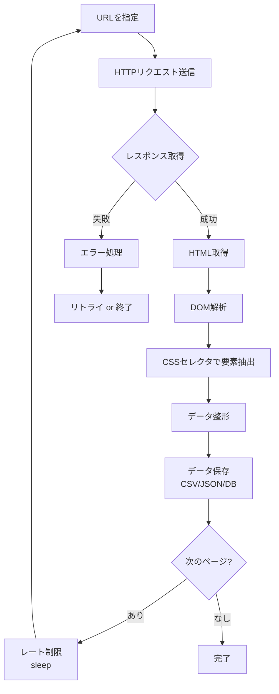
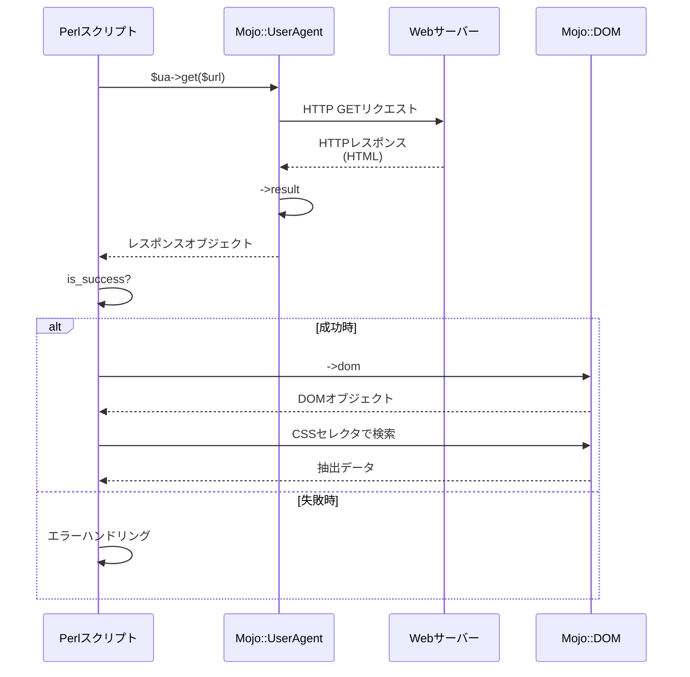
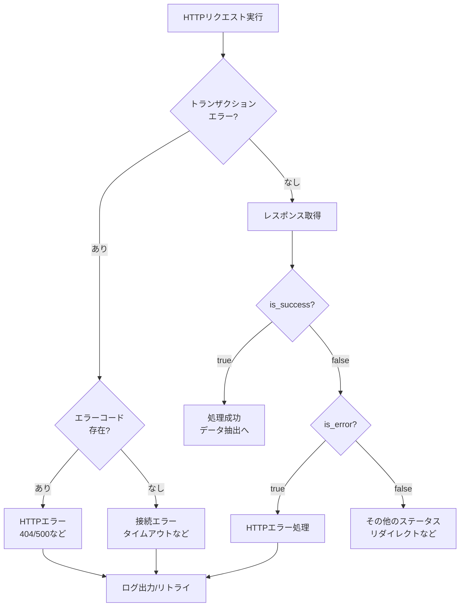
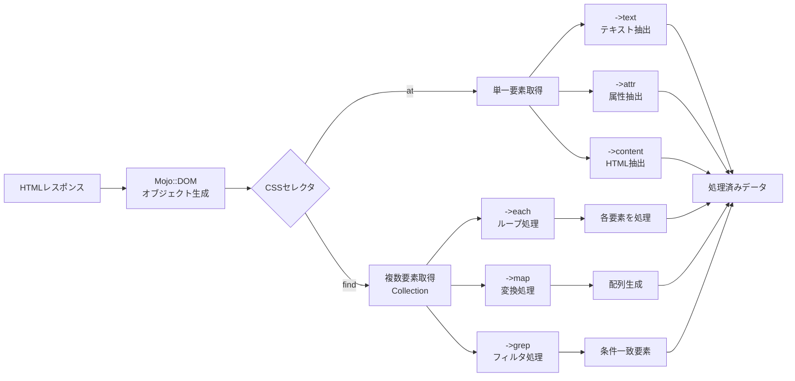
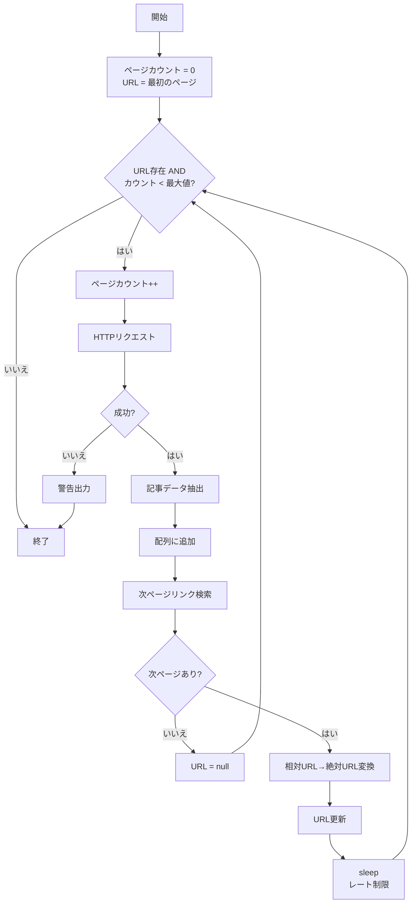
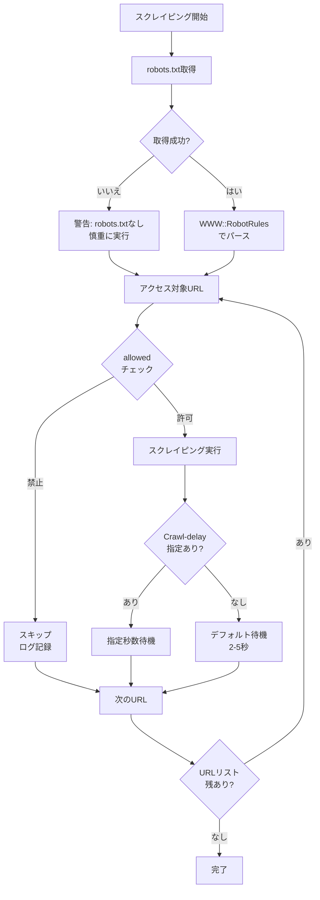
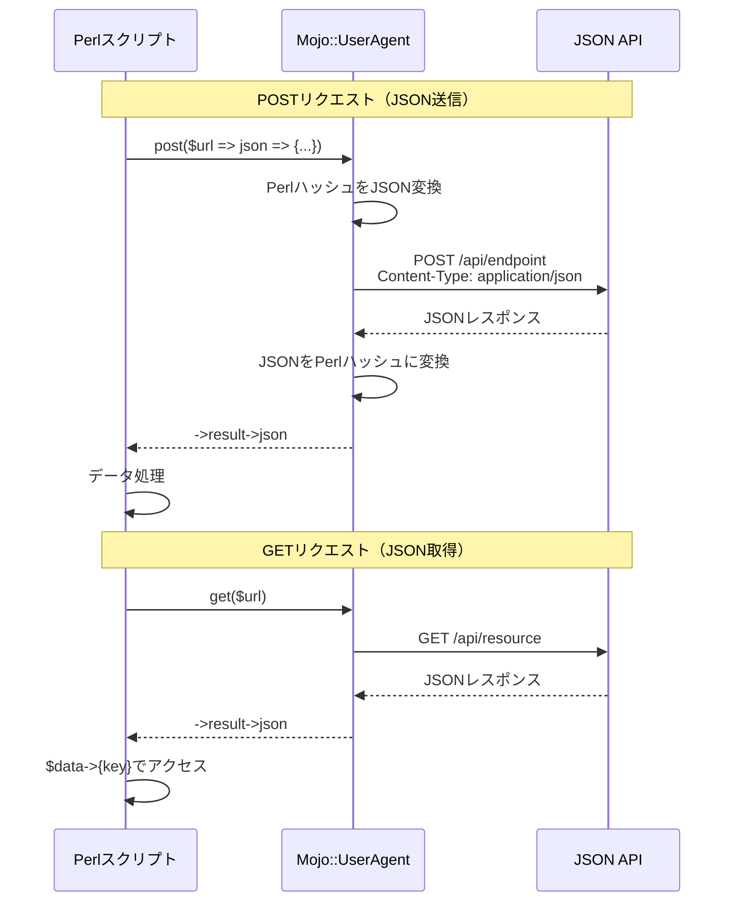
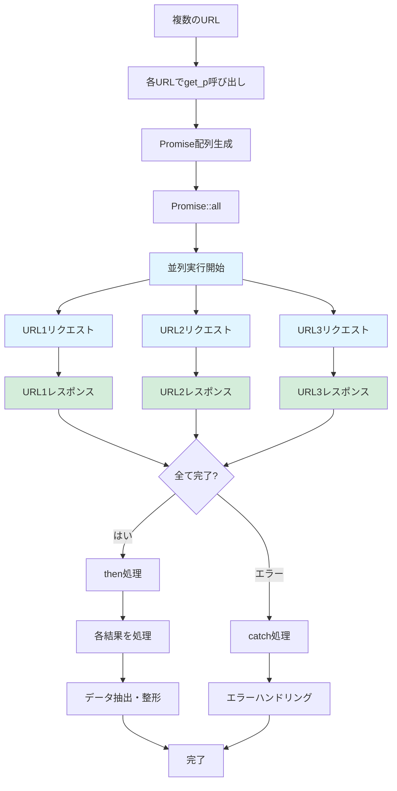

**Perlでのスクレイピング**を始めたい方へ。この記事では、**Mojo::UserAgent**を使った**Webスクレイピング**の基礎から実践まで、10分で動くコードが書けるよう段階的に解説します。

**本記事で学べること**：GETリクエスト実装、CSSセレクタでのデータ抽出、エラーハンドリング、robots.txt遵守、レート制限、JSON API連携、Promise並列処理まで。すべてのコード例は実行可能で、コピー＆ペーストですぐに試せます（Perl 5.16以上、Mojolicious 9.x系対応）。

## Webスクレイピングとは？PerlとMojo::UserAgentで始める理由

### Webスクレイピングの基本概念と実践的な活用シーン

**Webスクレイピング（Web scraping）**は、ウェブサイトから情報を自動的に抽出する技術です。ブラウザで見ているHTMLページをプログラムで取得し、必要なデータだけを解析して取り出します。手作業でコピー＆ペーストする代わりに、自動化することで大量のデータを効率的に収集できます。

**Perlでのスクレイピング**は、強力なテキスト処理能力と豊富なCPANモジュールにより、効率的かつ安定したデータ収集を実現します。

**主な活用シーン**

- 価格比較サイトでの商品情報収集：複数のECサイトから価格を自動取得
- ニュースサイトからの記事抽出：トレンド分析やアーカイブ作成に活用
- SNS・フォーラムのユーザー投稿分析：マーケティングリサーチ
- 不動産サイトの物件情報収集：相場調査や物件比較
- 求人サイトの求人情報集約：キャリア分析
- 学術研究データ収集：論文引用情報やデータセット構築

> **重要**: スクレイピングには法的・倫理的な配慮が必要です。[robots.txtの確認](#必須知識スクレイピングの倫理的法的配慮)やレート制限の実装は必須事項となります。

**Webスクレイピングのワークフロー図**

以下は、Webスクレイピングの基本的な処理フローを示した図です。



この図からわかるように、**Perlスクレイピング**は「取得→解析→抽出→保存」という一連のサイクルで構成されています。各ステップを確実に実装することで、安定したデータ収集を実現できます。

### Mojo::UserAgentを選ぶ3つの決定的理由

**Perlでスクレイピング**を行う場合、従来は `LWP::UserAgent` が広く使われてきました。しかし、2025年現在では **Mojo::UserAgent** が以下の3つの理由で強く推奨されます。

**1. Modern Perlの完全対応**

Mojo::UserAgentは、Perl 5.16以上（推奨5.20以上）で動作し、**Modern Perl**の機能をフル活用しています。`strict`、`warnings`、`utf8` のデフォルト有効化、サブルーチン署名などの最新機能に対応しており、現代的なPerlコードを書くことができます。

**2. 統合DOM解析エンジン（Mojo::DOM）**

最大の特徴は、**Mojo::DOM**というHTML解析エンジンが統合されている点です。jQueryライクなCSSセレクタを使って、直感的にHTML要素を抽出できます。別途HTML::TreeやWeb::Scraperをインストールする必要がなく、これ一つで完結します。

**3. 非同期処理とPromiseベースの並列実行**

非ブロッキングI/Oと**Promiseベースの並列実行**に対応しており、複数のURLを効率的にクロールできます。従来の同期的なアプローチと比べて、大量のページを処理する際のパフォーマンスが大幅に向上します。

> **Perlスクレイピング初心者へ**: Mojo::UserAgentは学習コストが低く、すぐに実践的なコードが書けるため、Perl入門者にも最適な選択肢です。

### この記事で習得できるPerlスクレイピングスキル

この記事では、**Perlの基礎知識**をお持ちの方が、10分程度で実際に動くスクレイピングコードを書けるようになることを目指します。

**学習内容（ステップバイステップ）**

1. Mojoliciousのインストールと環境構築
2. GETリクエストの実装とエラーハンドリング
3. Mojo::DOMとCSSセレクタによるデータ抽出
4. ニュースサイトからの情報収集の実践例
5. CSVファイルへのデータ保存
6. 複数ページのクロール処理
7. robots.txtやレート制限などの倫理的配慮
8. よくあるエラーとその解決方法
9. POSTリクエスト、JSON API連携、非同期処理の基礎

**本記事の特徴**

- すべてのコード例は実行可能でコピー＆ペーストですぐに試せる
- Perl 5.16以上、Mojolicious 9.x系で動作確認済み
- 初心者にも分かりやすい段階的な解説
- 実践的なユースケースを豊富に掲載
- 倫理的・法的配慮も詳しく解説

> **関連記事**: ブログ構築について興味がある方は、本サイトで使用している[Hugo静的サイトジェネレーター](/tags/hugo/)の記事もご覧ください。

## Mojo::UserAgentのインストールと環境構築（Perl 5.16以上）

### Perlバージョン確認：5.16以上が必須

まず、現在のPerl環境を確認しましょう。ターミナルで以下のコマンドを実行します。

```bash
perl -v
```

`This is perl 5, version XX, subversion XX` という表示が出ます。バージョンが5.16以上であることを確認してください。できれば5.20以降が望ましいです。

5.16未満の場合は、**perlbrew**や**plenv**などのツールでPerlをアップデートすることを推奨します。

> **Tip**: Modern Perlの機能を最大限活用するため、可能であれば**Perl 5.20以降**の使用を推奨します。

### cpan/cpanmでMojoliciousを簡単インストール

Mojo::UserAgentは、**Mojolicious**フレームワークに含まれています。CPANから簡単にインストールできます。

**cpanmを使う場合（推奨）**

```bash
# cpanm がインストールされていない場合
curl -L https://cpanmin.us | perl - App::cpanminus

# Mojolicious をインストール
cpanm Mojolicious
```

**cpanを使う場合**

```bash
cpan Mojolicious
```

インストールには数分かかる場合があります。完了すると、Mojolicious 9.x系がインストールされます。

### 動作確認：最初のスクリプトを実行

インストールが完了したら、動作確認をしましょう。以下のスクリプトを `test_mojo.pl` として保存します。

```perl
#!/usr/bin/env perl
# Perl 5.16+, Mojolicious 9.x
# 依存: Mojolicious (cpanm Mojolicious)

use strict;
use warnings;
use utf8;
use Mojo::UserAgent;

# UserAgentオブジェクトを作成
my $ua = Mojo::UserAgent->new;

# example.com にGETリクエストを送信
my $res = $ua->get('https://example.com/')->result;

# ページタイトルを表示
if ($res->is_success) {
    my $title = $res->dom->at('title')->text;
    print "タイトル: $title\n";
} else {
    die "エラー: " . $res->message . "\n";
}
```

実行してみましょう。

```bash
chmod +x test_mojo.pl
./test_mojo.pl
```

**実行結果**

```
タイトル: Example Domain
```

`タイトル: Example Domain` と表示されれば成功です！これで環境構築は完了です。

**動作確認のポイント**

- `$ua->get($url)->result` で HTTPリクエスト＆レスポンス取得を1行で実行
- `$res->dom` でMojo::DOMオブジェクトを取得（HTML解析の起点）
- `->at('title')` でCSSセレクタを使ってtitle要素を取得
- `->text` で要素内のテキストコンテンツを抽出

## 基礎：PerlでHTTP GETリクエストを実装する

### シンプルなGETリクエストの実装例

Mojo::UserAgentでGETリクエストを送るのは非常にシンプルです。基本パターンを見てみましょう。

```perl
#!/usr/bin/env perl
# Perl 5.16+, Mojolicious 9.x

use strict;
use warnings;
use utf8;
use Mojo::UserAgent;

my $ua = Mojo::UserAgent->new;
my $url = 'https://example.com/';

# GETリクエストを送信してレスポンスを取得
my $res = $ua->get($url)->result;

# HTMLボディを取得
if ($res->is_success) {
    print $res->body;
} else {
    warn "Failed: " . $res->message;
}
```

`$ua->get($url)` はトランザクションオブジェクトを返し、`->result` でレスポンスを取得します。この2ステップが基本形です。

以下は、Mojo::UserAgentによるHTTPリクエストとレスポンス処理の流れを示した図です。



この図は、リクエストからデータ取得までの一連の流れを時系列で表しています。

### レスポンスの確認とis_success/is_errorの使い分け

レスポンスの状態を確認するメソッドがいくつか用意されています。

```perl
#!/usr/bin/env perl
# Perl 5.16+, Mojolicious 9.x

use strict;
use warnings;
use Mojo::UserAgent;
use feature 'say';

my $ua = Mojo::UserAgent->new;
my $res = $ua->get('https://httpbin.org/status/404')->result;

# 各種チェックメソッド
say "HTTPステータスコード: " . $res->code;
say "成功: " . ($res->is_success ? 'Yes' : 'No');   # 2xx
say "エラー: " . ($res->is_error ? 'Yes' : 'No');   # 4xx, 5xx
say "リダイレクト: " . ($res->is_redirect ? 'Yes' : 'No'); # 3xx
say "メッセージ: " . $res->message;
```

主な判定メソッドの使い分けは以下の通りです。

- `is_success()`: HTTPステータスコードが2xxの場合にtrue（200 OK, 201 Created等）
- `is_error()`: HTTPステータスコードが4xxまたは5xxの場合にtrue（404 Not Found, 500 Internal Server Error等）
- `is_redirect()`: HTTPステータスコードが3xxの場合にtrue（301 Moved Permanently等）

### エラーハンドリングのベストプラクティス

実践的なコードでは、適切なエラーハンドリングが不可欠です。以下のパターンを推奨します。

```perl
#!/usr/bin/env perl
# Perl 5.16+, Mojolicious 9.x

use strict;
use warnings;
use utf8;
use Mojo::UserAgent;
use feature 'say';

my $ua = Mojo::UserAgent->new;

# タイムアウト設定（デフォルトは無制限）
$ua->connect_timeout(10);  # 接続タイムアウト10秒
$ua->request_timeout(30);  # リクエスト全体で30秒

my $url = 'https://example.com/';
my $tx = $ua->get($url);

# トランザクションレベルのエラーチェック（接続エラーなど）
if (my $err = $tx->error) {
    if ($err->{code}) {
        # HTTPエラー（404, 500など）
        die sprintf "HTTP %d: %s\n", $err->{code}, $err->{message};
    } else {
        # 接続エラー、タイムアウトなど
        die "Connection error: $err->{message}\n";
    }
}

my $res = $tx->result;

# レスポンスレベルのチェック
if ($res->is_success) {
    say "成功！";
    say $res->dom->at('title')->text;
} elsif ($res->is_error) {
    say "HTTPエラー: " . $res->code . " " . $res->message;
} else {
    say "その他: " . $res->code;
}
```

このパターンでは、接続エラーとHTTPエラーを分けて処理できます。本番環境では、ログ出力やリトライロジックを追加すると良いでしょう。

以下は、エラーハンドリングの判定フローを示した図です。



この図は、エラーハンドリングの判定ロジックを階層的に示しています。接続レベルのエラーとHTTPレベルのエラーを適切に分離することが重要です。

## データ抽出：Mojo::DOMによるHTML解析とCSSセレクタ活用

### CSSセレクタの基本メソッド（at/find/map/each）

Mojo::DOMは、jQueryライクなCSSセレクタでHTML要素を抽出できます。主要なメソッドを見ていきましょう。

```perl
#!/usr/bin/env perl
# Perl 5.16+, Mojolicious 9.x
# 依存: Mojolicious

use strict;
use warnings;
use utf8;
use Mojo::UserAgent;
use feature 'say';  # say は Perl 5.10+ で利用可能
binmode STDOUT, ':utf8';  # UTF-8出力を有効化

my $ua = Mojo::UserAgent->new;
my $html = <<'HTML';
<!DOCTYPE html>
<html>
<head><title>テストページ</title></head>
<body>
    <h1 id="main-title">メインタイトル</h1>
    <div class="article">
        <h2>記事1</h2>
        <p class="content">本文1</p>
    </div>
    <div class="article">
        <h2>記事2</h2>
        <p class="content">本文2</p>
    </div>
    <a href="https://example.com">リンク1</a>
    <a href="/page2">リンク2</a>
</body>
</html>
HTML

my $dom = Mojo::DOM->new($html);

# at() - 最初の1つだけを取得（単数形）
my $title = $dom->at('title')->text;
say "タイトル: $title";

my $main_title = $dom->at('#main-title')->text;  # IDセレクタ
say "メインタイトル: $main_title";

# find() - 該当する全要素のコレクションを取得（複数形）
say "\n=== すべての記事 ===";
$dom->find('div.article')->each(sub {
    my $article = shift;
    my $h2 = $article->at('h2')->text;
    my $p = $article->at('p.content')->text;
    say "$h2: $p";
});

# map() - 変換して配列を取得（関数型プログラミング風）
say "\n=== すべてのリンク（map使用）===";
my @links = $dom->find('a')->map(sub {
    return $_->attr('href');
})->each;
say "Links: " . join(', ', @links);

# map('attr', 'href') - 短縮記法
say "\n=== すべてのリンク（短縮記法）===";
my @hrefs = $dom->find('a')->map(attr => 'href')->each;
say join("\n", @hrefs);

# grep でフィルタリング
say "\n=== 外部リンクのみ ===";
$dom->find('a')->grep(sub { $_->attr('href') =~ /^https?:/ })->each(sub {
    say $_->text . " -> " . $_->attr('href');
});
```

**主要メソッドの使い分け**

- `at($selector)`: 最初にマッチした1つの要素を返す（単数形）。見つからない場合はundef
- `find()`: マッチしたすべての要素をMojo::Collectionとして返す（複数形）
- `each(sub {...})`: コレクションの各要素に対してサブルーチンを実行（副作用あり）
- `map(sub {...})`: 各要素を変換した新しいコレクションを返す（関数型スタイル）
- `grep(sub {...})`: 条件に合う要素だけフィルタリングする

**CSSセレクタの例**

- `tag`: タグ名（例: `div`, `p`, `a`）
- `.class`: クラス名（例: `.article`, `.content`）
- `#id`: ID（例: `#main-title`）
- `tag.class`: タグとクラスの組み合わせ（例: `div.article`）
- `parent > child`: 直接の子要素（例: `div > p`）
- `ancestor descendant`: 子孫要素（例: `body a`）
- `[attr]`: 属性を持つ要素（例: `[href]`, `[data-id]`）
- `[attr=value]`: 属性値が一致（例: `[type="text"]`）

### タイトル・リンク・テキストの抽出実例

実際のウェブページから情報を抽出してみましょう。

```perl
#!/usr/bin/env perl
# Perl 5.16+, Mojolicious 9.x

use strict;
use warnings;
use utf8;
use Mojo::UserAgent;
use feature 'say';
binmode STDOUT, ':utf8';

my $ua = Mojo::UserAgent->new;
my $res = $ua->get('https://example.com/')->result;

unless ($res->is_success) {
    die "Failed: " . $res->message;
}

my $dom = $res->dom;

# 1. ページタイトルの取得
my $title = $dom->at('title')->text;
say "ページタイトル: $title";

# 2. すべてのリンクのテキストとURLを取得
say "\n=== リンク一覧 ===";
$dom->find('a')->each(sub {
    my $link = shift;
    my $text = $link->text;
    my $href = $link->attr('href') // '';
    say "$text -> $href" if $text && $href;
});

# 3. メタディスクリプションを取得
my $description = $dom->at('meta[name="description"]');
if ($description) {
    say "\nDescription: " . $description->attr('content');
}

# 4. すべての段落テキストを取得
say "\n=== 段落 ===";
$dom->find('p')->each(sub {
    my $p = shift;
    say $p->text;
});
```

### 属性取得とデータ整形のテクニック

HTML要素の属性を取得し、データを整形する実践的なテクニックを紹介します。

```perl
#!/usr/bin/env perl
# Perl 5.16+, Mojolicious 9.x

use strict;
use warnings;
use utf8;
use Mojo::UserAgent;
use Mojo::DOM;
use feature 'say';
binmode STDOUT, ':utf8';

my $html = <<'HTML';
<div class="product" data-id="123" data-price="1980">
    <h3 class="name">商品A</h3>
    
    <span class="price">¥1,980</span>
</div>
HTML

my $dom = Mojo::DOM->new($html);
my $product = $dom->at('div.product');

# 属性の取得
my $id = $product->attr('data-id');
my $price_data = $product->attr('data-price');
say "商品ID: $id";
say "価格（data属性）: $price_data";

# テキストの取得と整形
my $name = $product->at('h3.name')->text;
my $price_text = $product->at('span.price')->text;

# 数値の抽出（正規表現で整形）
$price_text =~ s/[^0-9]//g;  # 数字以外を削除
say "商品名: $name";
say "価格（整形後）: ${price_text}円";

# 画像URLの取得と絶対URL化
my $img = $product->at('img');
my $img_src = $img->attr('src');
my $img_alt = $img->attr('alt');
say "画像URL: $img_src";
say "画像ALT: $img_alt";

# 複数の属性を持つ要素のフィルタリング
my @items = $dom->find('[data-id]')->map(sub {
    return {
        id    => $_->attr('data-id'),
        name  => $_->at('.name')->text,
        price => $_->attr('data-price'),
    };
})->each;

use Data::Dumper;
print Dumper(\@items);
```

重要なポイントは以下の通りです。

- `attr($name)`: 指定した属性の値を取得
- `text`: 要素内のテキストコンテンツを取得（HTMLタグは除外）
- `all_text`: 子孫要素のテキストもすべて含めて取得
- `content`: 内部HTMLを取得
- 正規表現と組み合わせてデータをクリーンアップ

以下は、Mojo::DOMによるHTML解析とデータ抽出のプロセスを示した図です。



この図は、HTMLからデータを抽出する際の各メソッドの役割と処理の流れを表しています。CSSセレクタで要素を特定し、適切なメソッドでデータを取り出す流れが理解できます。

## 実践：PerlでニュースサイトのWebスクレイピング

### サイト構造分析とCSSセレクタ設計

実際のサイトをスクレイピングする前に、ブラウザの開発者ツールでHTML構造を分析します。この作業がスクレイピングの成功を左右します。

**分析手順**

1. ブラウザで対象ページを開く
2. **F12キー**で開発者ツールを起動
3. 要素を**右クリック→「検証」**で該当箇所のHTMLを確認
4. CSSクラス名やID、要素の階層構造をメモ
5. 繰り返し現れるパターン（記事一覧など）を特定

例えば、以下のような構造だとします。

```html
<article class="news-item">
    <h2 class="title"><a href="/news/123">記事タイトル</a></h2>
    <p class="summary">記事の要約文...</p>
    <time datetime="2025-01-15">2025年1月15日</time>
</article>
```

**CSSセレクタの設計**

この場合、CSSセレクタは以下のようになります。

| 取得対象 | CSSセレクタ | 説明 |
|---------|------------|------|
| 記事全体 | `article.news-item` | 繰り返しの基準点 |
| タイトルテキスト | `h2.title a` | タイトルのリンク要素 |
| URL | `h2.title a[href]` | href属性を持つa要素 |
| 要約 | `p.summary` | summary クラスのp要素 |
| 日付（属性） | `time[datetime]` | datetime属性 |
| 日付（テキスト） | `time` | 表示用の日付文字列 |

**セレクタ設計のコツ**

- できるだけ**クラス名やID**を使う（タグ名だけだと曖昧）
- **階層は浅く**（深い階層は変更に弱い）
- **複数の候補**を用意（サイト変更時のフォールバック用）
- Chrome DevToolsの**「Copy selector」機能**も参考になる（ただし長すぎる場合あり）

### 記事一覧の取得と整形

実際に記事一覧を取得するコードを書いてみましょう。ここでは架空のニュースサイトを例にします。

```perl
#!/usr/bin/env perl
# Perl 5.16+, Mojolicious 9.x

use strict;
use warnings;
use utf8;
use Mojo::UserAgent;
use Mojo::URL;
use feature 'say';
binmode STDOUT, ':utf8';

my $ua = Mojo::UserAgent->new;

# User-Agentを設定（連絡先含む）
$ua->transactor->name('MyNewsBot/1.0 (your-email@example.com)');

# タイムアウト設定
$ua->connect_timeout(10);
$ua->request_timeout(30);

my $base_url = 'https://example-news.com';
my $url = "$base_url/news/";

say "記事を取得中: $url";

my $res = $ua->get($url)->result;

unless ($res->is_success) {
    die "エラー: " . $res->message;
}

my $dom = $res->dom;
my @articles;

# 記事一覧を取得
$dom->find('article.news-item')->each(sub {
    my $article = shift;
    
    # タイトルとURL
    my $title_elem = $article->at('h2.title a');
    my $title = $title_elem ? $title_elem->text : '(タイトルなし)';
    my $href = $title_elem ? $title_elem->attr('href') : '';
    
    # 相対URLを絶対URLに変換
    my $url_obj = Mojo::URL->new($href)->to_abs(Mojo::URL->new($base_url));
    my $full_url = $url_obj->to_string;
    
    # 要約文
    my $summary_elem = $article->at('p.summary');
    my $summary = $summary_elem ? $summary_elem->text : '';
    
    # 日付
    my $date_elem = $article->at('time');
    my $date = $date_elem ? $date_elem->attr('datetime') : '';
    
    push @articles, {
        title   => $title,
        url     => $full_url,
        summary => $summary,
        date    => $date,
    };
});

say "取得件数: " . scalar(@articles);
say "\n=== 記事一覧 ===";

foreach my $article (@articles) {
    say "タイトル: $article->{title}";
    say "URL: $article->{url}";
    say "日付: $article->{date}";
    say "要約: $article->{summary}";
    say "---";
}
```

重要なポイントは以下の通りです。

- `Mojo::URL->new($href)->to_abs($base)`: 相対URLを絶対URLに変換
- 三項演算子でnull安全にデータを取得（要素が存在しない場合の対策）
- User-Agentに連絡先を含める（倫理的配慮）

### CSVファイルへの保存方法

取得したデータをCSVファイルに保存してみましょう。PerlのCSV処理では**Text::CSV_XS**が定番です。

```perl
#!/usr/bin/env perl
# Perl 5.16+, Mojolicious 9.x
# 依存: Mojolicious, Text::CSV_XS
# インストール: cpanm Text::CSV_XS

use strict;
use warnings;
use utf8;
use Mojo::UserAgent;
use Mojo::URL;
use Text::CSV_XS;
use Encode qw(encode_utf8);
use feature 'say';

my $ua = Mojo::UserAgent->new;
$ua->transactor->name('MyNewsBot/1.0 (contact@example.com)');

my $base_url = 'https://example-news.com';
my $res = $ua->get("$base_url/news/")->result;

die "Error: " . $res->message unless $res->is_success;

my @articles;

# データ収集
$res->dom->find('article.news-item')->each(sub {
    my $article = shift;
    
    # 各フィールドを安全に取得（null safe）
    my $title_elem = $article->at('h2.title a');
    my $title = $title_elem ? $title_elem->text : '';
    
    my $href = $title_elem ? $title_elem->attr('href') : '';
    my $full_url = Mojo::URL->new($href)->to_abs($base_url)->to_string;
    
    my $summary = $article->at('p.summary') ? $article->at('p.summary')->text : '';
    my $date = $article->at('time') ? $article->at('time')->attr('datetime') : '';
    
    # 配列リファレンスとして保存
    push @articles, [$title, $full_url, $date, $summary];
});

# CSV出力
my $csv = Text::CSV_XS->new({ 
    binary => 1,        # バイナリモード（UTF-8対応に必須）
    auto_diag => 1,     # エラー時に自動的にdie
    eol => "\n",        # 改行コード（明示的に指定）
});

open my $fh, '>:encoding(utf8)', 'news_articles.csv' 
    or die "Cannot open: $!";

# ヘッダー行
$csv->print($fh, ['タイトル', 'URL', '日付', '要約']);

# データ行
foreach my $article (@articles) {
    $csv->print($fh, $article);
}

close $fh;

say "CSVファイルに保存しました: news_articles.csv";
say "総件数: " . scalar(@articles);
```

**Text::CSV_XS の利点**

- カンマやダブルクォート、改行を含むデータも正しくエスケープ
- UTF-8を含む多言語対応
- 高速（XSはC言語で実装されたPerl拡張）
- RFC 4180準拠の標準的なCSV形式

**代替案: JSON形式で保存**

CSVではなくJSON形式で保存したい場合は、Mojoliciousに含まれる `Mojo::JSON` を使えます。

```perl
use Mojo::JSON qw(encode_json);
use Mojo::File;

# データをハッシュリファレンスの配列に変換
my @json_data = map {
    {
        title   => $_->[0],
        url     => $_->[1],
        date    => $_->[2],
        summary => $_->[3],
    }
} @articles;

# JSON形式で保存
Mojo::File->new('news_articles.json')
    ->spurt(encode_json(\@json_data));
```

JSON形式は階層構造を表現できるため、より複雑なデータ構造に適しています。

### 複数ページのクロール処理とレート制限

多くのサイトでは、記事一覧がページネーションされています。複数ページをクロールする際は、**レート制限（sleep）**の実装が必須となります。

```perl
#!/usr/bin/env perl
# Perl 5.16+, Mojolicious 9.x

use strict;
use warnings;
use utf8;
use Mojo::UserAgent;
use Mojo::URL;
use Time::HiRes qw(sleep);
use feature 'say';
binmode STDOUT, ':utf8';

my $ua = Mojo::UserAgent->new;
$ua->transactor->name('MyNewsBot/1.0 (contact@example.com)');
$ua->max_redirects(3);  # リダイレクトを最大3回まで追従

my $base_url = 'https://example-news.com';
my $current_url = "$base_url/news/page/1";
my $max_pages = 5;  # 最大5ページまで取得
my $page_count = 0;
my @all_articles;

while ($current_url && $page_count < $max_pages) {
    $page_count++;
    say "ページ $page_count を取得中: $current_url";
    
    my $res = $ua->get($current_url)->result;
    
    unless ($res->is_success) {
        warn "エラー: " . $res->message;
        last;
    }
    
    my $dom = $res->dom;
    
    # 記事を収集
    $dom->find('article.news-item')->each(sub {
        my $article = shift;
        my $title = $article->at('h2.title a') ? $article->at('h2.title a')->text : '';
        push @all_articles, $title if $title;
    });
    
    # 次のページへのリンクを取得
    my $next_link = $dom->at('a.next-page, li.next a');
    if ($next_link) {
        my $next_href = $next_link->attr('href');
        $current_url = Mojo::URL->new($next_href)->to_abs($base_url)->to_string;
    } else {
        say "次のページが見つかりません。終了します。";
        $current_url = undef;
    }
    
    # レート制限：2秒待機
    sleep(2) if $current_url;
}

say "\n総取得件数: " . scalar(@all_articles);
say "取得ページ数: $page_count";
```

重要なポイントは以下の通りです。

- `while` ループで次のページが存在する限り継続
- `sleep(2)` でリクエスト間隔を確保（サーバー負荷軽減）
- 最大ページ数の制限で無限ループを防止
- エラー時は `warn` してループを抜ける

以下は、複数ページをクロールする際の処理フローを示した図です。



この図は、ページネーション対応のクローリング処理における、ループ制御とエラーハンドリングの仕組みを明確に示しています。

## 必須知識：Webスクレイピングの倫理と法的配慮

**Webスクレイピング**は強力な技術ですが、不適切な使用は法的問題や倫理的批判を招きます。必ず以下の点を遵守してください。

> **重要**: 日本では不正アクセス禁止法や著作権法、海外ではGDPR、CCPA、CFAAなどの法規制が適用されます。[法的リスクの詳細](#gdprccpacfaa等の法的リスク)を必ず確認してください。

### robots.txtの確認とPerlでの実装方法

**robots.txt**は、ウェブサイトのクロールルールを定義したファイルです。法的拘束力はありませんが、尊重することが強く推奨されます。Perlでは`WWW::RobotRules`モジュールを使って簡単に実装できます。

**robots.txtの確認方法**

ブラウザで `https://example.com/robots.txt` にアクセスします。

```
User-agent: *
Disallow: /admin/
Disallow: /private/
Crawl-delay: 10

User-agent: Googlebot
Disallow: /temp/
```

この例では、`/admin/` と `/private/` がクロール禁止、クロール間隔は10秒です。

**Perlでの実装例**

```perl
#!/usr/bin/env perl
# Perl 5.16+, Mojolicious 9.x
# WWW::RobotRulesによるrobots.txt解析

use strict;
use warnings;
use Mojo::UserAgent;
use WWW::RobotRules;
use feature 'say';

my $ua = Mojo::UserAgent->new;
my $bot_name = 'MyBot/1.0';
my $base_url = 'https://example.com';

# robots.txtを取得
my $robots_url = "$base_url/robots.txt";
my $res = $ua->get($robots_url)->result;

my $rules = WWW::RobotRules->new($bot_name);

if ($res->is_success) {
    $rules->parse($robots_url, $res->body);
} else {
    warn "robots.txtが取得できません。慎重に進めます。";
}

# アクセス可否のチェック
my @urls_to_check = (
    "$base_url/",
    "$base_url/admin/",
    "$base_url/news/",
);

foreach my $url (@urls_to_check) {
    if ($rules->allowed($url)) {
        say "OK: $url";
    } else {
        say "NG: $url (robots.txtで禁止されています)";
    }
}
```

`WWW::RobotRules` モジュールは `cpanm WWW::RobotRules` でインストールできます。

以下は、robots.txtのチェックとアクセス制御のフローを示した図です。



この図は、robots.txtを尊重した倫理的なスクレイピングの実装フローを表しています。

### レート制限（sleep）の適切な設定

サーバーに過剰な負荷をかけないよう、リクエスト間に適切な待機時間を設けます。

**推奨する待機時間**

- 小規模な個人サイト: 10〜15秒
- 一般的な商用サイト: 2〜5秒
- robots.txtにCrawl-delayがある場合: その値に従う
- APIが提供されている場合: APIを優先

```perl
use Time::HiRes qw(sleep);

# 基本パターン
sleep(2);  # 2秒待機

# robots.txtのCrawl-delayに従う場合
my $crawl_delay = 10;  # robots.txtから取得した値
sleep($crawl_delay);

# ランダムな待機時間（1〜3秒）
sleep(1 + rand(2));
```

### User-Agent文字列のカスタマイズ（連絡先含む）

デフォルトのUser-Agentではなく、明確で連絡可能なUser-Agentを設定します。

```perl
#!/usr/bin/env perl
use strict;
use warnings;
use Mojo::UserAgent;

my $ua = Mojo::UserAgent->new;

# 推奨: ボット名、バージョン、連絡先を含める
$ua->transactor->name('MyDataBot/1.0 (contact@example.com; +https://mysite.com/bot)');

# 実際のリクエスト
my $res = $ua->get('https://example.com/')->result;
```

良いUser-Agent文字列の例は以下の通りです。

- `MyBot/1.0 (contact@example.com)`
- `ResearchBot/2.0 (+https://university.edu/research-project)`
- `PriceMonitor/1.5 (admin@mysite.com; Purpose: Price comparison)`

サイトオーナーがあなたのボットに問題があると感じた場合、連絡を取れるようにすることで信頼性が向上します。

### 利用規約とAPI優先の原則

多くのウェブサイトは利用規約（Terms of Service）でスクレイピングを明示的に禁止しています。

**確認すべき事項**

- 利用規約ページで「scraping」「crawling」「automated access」などのキーワードを検索
- APIが提供されている場合は必ずAPIを使用
- データの商用利用が許可されているか確認
- 個人情報や著作物の取り扱いに注意

**API優先の原則**

公式APIが存在する場合、スクレイピングではなくAPIを使用するべきです。APIは以下の利点があります。

- 構造化されたデータ形式（JSON、XML）
- レート制限が明確
- サイト構造の変更に影響されない
- 法的に安全

### GDPR・CCPA・CFAA等の法的リスク

スクレイピングに関連する主な法規制は以下の通りです。

**GDPR（EU一般データ保護規則）**

- EU市民の個人データを収集する場合に適用
- 氏名、メールアドレス、IPアドレスなどが該当
- 違反時の罰金は最大で全世界売上高の4%または2,000万ユーロ

**CCPA（カリフォルニア州消費者プライバシー法）**

- カリフォルニア州住民の個人情報を扱う場合に適用
- データ収集の透明性と消費者の権利を保護

**CFAA（米国コンピュータ詐欺および濫用防止法）**

- 「権限なきアクセス」を禁止
- 利用規約に違反するスクレイピングが訴訟対象になる可能性
- hiQ Labs vs. LinkedIn事件など、判例が複雑

**日本国内の法律**

- 不正アクセス禁止法: 認証を破ってのアクセスは違法
- 著作権法: 著作物の無断複製・再配布は違法
- 不正競争防止法: 営業秘密の不正取得

**安全にスクレイピングするために**

- 公開情報のみを対象にする
- 個人情報は収集しない
- robots.txtと利用規約を遵守
- 適切なレート制限を設ける
- APIが提供されていればAPIを優先
- 商用利用の場合は法律専門家に相談

## トラブルシューティング：Perlスクレイピングのよくあるエラーと解決法

### 接続エラー・タイムアウトの対処方法

**問題**: ネットワークエラーやタイムアウトが発生する

```perl
#!/usr/bin/env perl
use strict;
use warnings;
use Mojo::UserAgent;
use feature 'say';

my $ua = Mojo::UserAgent->new;

# タイムアウト設定
$ua->connect_timeout(15);  # 接続タイムアウト
$ua->request_timeout(60);  # リクエスト全体のタイムアウト

# リトライロジック
my $url = 'https://example.com/';
my $max_retries = 3;
my $retry_count = 0;
my $res;

while ($retry_count < $max_retries) {
    my $tx = $ua->get($url);
    
    if (my $err = $tx->error) {
        $retry_count++;
        if ($err->{code}) {
            # HTTPエラー
            say "HTTPエラー $err->{code}: $err->{message}";
            last;  # HTTPエラーはリトライしない
        } else {
            # 接続エラー、タイムアウトなど
            say "接続エラー (試行 $retry_count/$max_retries): $err->{message}";
            if ($retry_count < $max_retries) {
                sleep(5);  # 5秒待ってリトライ
                next;
            }
        }
    } else {
        $res = $tx->result;
        last;  # 成功
    }
}

if ($res && $res->is_success) {
    say "成功！";
} else {
    die "最大リトライ回数を超えました";
}
```

### CSSセレクタが見つからない場合のデバッグ

**問題**: `at()` や `find()` で要素が見つからない

```perl
#!/usr/bin/env perl
use strict;
use warnings;
use Mojo::UserAgent;
use feature 'say';
binmode STDOUT, ':utf8';

my $ua = Mojo::UserAgent->new;
my $res = $ua->get('https://example.com/')->result;

my $dom = $res->dom;

# デバッグ: HTML全体を確認
# say $dom->to_string;

# 要素が存在するかチェック
my $elem = $dom->at('h1.title');
if ($elem) {
    say "タイトル: " . $elem->text;
} else {
    warn "h1.title が見つかりません";
    
    # 代替セレクタを試す
    my $alt1 = $dom->at('h1');
    if ($alt1) {
        say "代替1（h1）: " . $alt1->text;
    }
    
    my $alt2 = $dom->at('.title');
    if ($alt2) {
        say "代替2（.title）: " . $alt2->text;
    }
    
    # title要素にクラスがあるか確認
    $dom->find('h1')->each(sub {
        my $h1 = shift;
        say "h1要素のクラス: " . ($h1->attr('class') // 'なし');
        say "h1要素のテキスト: " . $h1->text;
    });
}
```

**デバッグのコツ**

- `$dom->to_string` でHTML全体を出力して構造を確認
- セレクタを段階的に簡略化（`div.main > p.text` → `p.text` → `p`）
- `find()` で全要素を列挙してクラス名やIDを確認
- ブラウザの開発者ツールで「Copy selector」を使用

### 文字化け問題の解決（UTF-8対応）

**問題**: 日本語が文字化けする

```perl
#!/usr/bin/env perl
use strict;
use warnings;
use utf8;  # スクリプト内のUTF-8文字列を有効化
use Mojo::UserAgent;
use Encode qw(decode encode);
use feature 'say';

# 標準出力をUTF-8に設定
binmode STDOUT, ':utf8';
binmode STDERR, ':utf8';

my $ua = Mojo::UserAgent->new;
my $res = $ua->get('https://example.com/')->result;

# Mojo::UserAgentは自動的にcharsetを検出・デコード
my $html = $res->body;  # 自動的にUTF-8にデコードされる
my $dom = $res->dom;

# タイトルの取得（正しくデコードされる）
my $title = $dom->at('title')->text;
say "タイトル: $title";

# ファイルへの保存（UTF-8エンコード）
open my $fh, '>:encoding(utf8)', 'output.txt' or die $!;
print $fh $title;
close $fh;

# charsetが正しく検出されない場合の手動デコード
my $body_bytes = $res->body;
if ($body_bytes !~ /\p{Hiragana}/) {  # ひらがなが見つからない = 文字化け？
    # 手動でShift_JISからデコード
    my $decoded = decode('Shift_JIS', $body_bytes);
    say "手動デコード: " . substr($decoded, 0, 100);
}
```

**対処法**

- `use utf8;` をスクリプト冒頭に記述
- `binmode STDOUT, ':utf8';` で出力をUTF-8化
- Mojo::UserAgentは通常、自動的にcharsetを検出してデコードします。
- 問題がある場合は `Encode` モジュールで手動デコードを行う

### result vs resの違いと使い分け

**問題**: `result` と `res` の違いがわからない

```perl
#!/usr/bin/env perl
use strict;
use warnings;
use Mojo::UserAgent;
use feature 'say';

my $ua = Mojo::UserAgent->new;
my $tx = $ua->get('https://httpbin.org/status/404');

# res(): 常にMojo::Messageオブジェクトを返す（エラーでも）
my $res = $tx->res;
say "res()->code: " . $res->code;  # 404
say "res()->is_error: " . $res->is_error;  # 1 (true)

# result(): 成功時はレスポンス、エラー時は例外を投げる
eval {
    my $result = $tx->result;
    say "result成功: " . $result->code;
};
if ($@) {
    say "resultで例外発生: $@";
}

# 使い分けの例
say "\n=== 使い分け ===";

# パターン1: エラーチェックしたい場合 -> res()
my $tx1 = $ua->get('https://httpbin.org/status/500');
my $response = $tx1->res;
if ($response->is_error) {
    say "エラー検出: " . $response->code;
}

# パターン2: 成功前提でシンプルに書きたい場合 -> result()
eval {
    my $tx2 = $ua->get('https://httpbin.org/get');
    my $data = $tx2->result->json;
    say "JSON取得成功";
};
say "例外: $@" if $@;
```

**使い分けのガイドライン**

- `res()`: エラーの有無を判定したい場合に使用し、`is_error`や`is_success`で細かく制御
- `result()`: 成功を前提とする場合に使用し、失敗時に即座に例外でエラーハンドリング
- 一般的には `result()` のほうがより簡潔で読みやすい

## 応用：PerlでのPOSTリクエストとJSON API連携

### フォームデータのPOST送信

Webフォームに対してPOSTリクエストを送信する例です。

```perl
#!/usr/bin/env perl
# Perl 5.16+, Mojolicious 9.x

use strict;
use warnings;
use utf8;
use Mojo::UserAgent;
use feature 'say';
binmode STDOUT, ':utf8';

my $ua = Mojo::UserAgent->new;

# フォームデータをPOST
my $url = 'https://httpbin.org/post';
my $tx = $ua->post($url => form => {
    username => 'testuser',
    password => 'secret123',
    remember => 'on',
});

if (my $res = $tx->result) {
    if ($res->is_success) {
        # httpbin.orgはエコーバックするのでPOSTデータを確認できる
        my $json = $res->json;
        say "送信したフォームデータ:";
        use Data::Dumper;
        print Dumper($json->{form});
    } else {
        warn "エラー: " . $res->message;
    }
}
```

**ファイルアップロードの例**

```perl
#!/usr/bin/env perl
use strict;
use warnings;
use Mojo::UserAgent;

my $ua = Mojo::UserAgent->new;

# multipart/form-dataでファイルアップロード
my $tx = $ua->post(
    'https://httpbin.org/post' => form => {
        title => 'テストファイル',
        file  => {
            file     => '/path/to/file.txt',
            filename => 'upload.txt',
        },
    }
);

if ($tx->result->is_success) {
    print "アップロード成功\n";
}
```

### JSON APIとの連携（post/json）

JSON形式のAPIとやり取りする場合は、`json` オプションを使います。

```perl
#!/usr/bin/env perl
# Perl 5.16+, Mojolicious 9.x

use strict;
use warnings;
use utf8;
use Mojo::UserAgent;
use feature 'say';
use Data::Dumper;

my $ua = Mojo::UserAgent->new;

# JSON形式でPOST
my $api_url = 'https://httpbin.org/post';
my $tx = $ua->post($api_url => json => {
    name  => '太郎',
    email => 'taro@example.com',
    age   => 25,
    tags  => ['perl', 'mojolicious'],
});

my $res = $tx->result;

if ($res->is_success) {
    # JSONレスポンスをPerlハッシュに変換
    my $data = $res->json;
    say "レスポンス:";
    print Dumper($data);
    
    # 特定のフィールドにアクセス
    say "\n送信したJSON:";
    print Dumper($data->{json});
} else {
    die "エラー: " . $res->message;
}

# GETリクエストでJSON取得
say "\n=== GET でJSON取得 ===";
my $json_url = 'https://jsonplaceholder.typicode.com/users/1';
my $user = $ua->get($json_url)->result->json;

say "ユーザー名: $user->{name}";
say "メール: $user->{email}";
```

JSONのパース・生成は自動的に行われるため、非常にシンプルです。

以下は、JSON APIとの連携フローを示した図です。



この図は、JSON APIとのやり取りにおけるデータのシリアライズ/デシリアライズの流れを明確に示しています。

### Promiseによる並列処理の基礎

複数のURLを並列に取得する場合、Promiseを使用します。

```perl
#!/usr/bin/env perl
# Perl 5.16+, Mojolicious 9.x

use strict;
use warnings;
use utf8;
use Mojo::UserAgent;
use Mojo::Promise;
use feature 'say';
binmode STDOUT, ':utf8';

my $ua = Mojo::UserAgent->new;

# 複数のURLを並列取得
my @urls = (
    'https://jsonplaceholder.typicode.com/users/1',
    'https://jsonplaceholder.typicode.com/users/2',
    'https://jsonplaceholder.typicode.com/users/3',
);

# Promise配列を作成
my @promises = map { $ua->get_p($_) } @urls;

# 全てのPromiseが完了するまで待機
Mojo::Promise->all(@promises)->then(sub {
    my @results = @_;
    
    say "すべてのリクエストが完了しました";
    
    for my $i (0 .. $#results) {
        my $tx = $results[$i][0];  # Promiseの結果はネストされている
        if (my $res = $tx->result) {
            my $user = $res->json;
            say "ユーザー ${\($i+1)}: $user->{name}";
        }
    }
})->catch(sub {
    my $err = shift;
    warn "エラー: $err";
})->wait;

say "処理完了";
```

**並列処理のメリット**

- 複数のリクエストを同時に実行し、全体の処理時間を大幅に短縮
- ネットワークI/O待ちの間にCPUを有効活用
- `get_p()` はPromiseを返す非同期版のメソッド

以下は、Promiseによる並列処理の仕組みを示した図です。



この図は、複数のHTTPリクエストを並列実行し、すべての完了を待って結果を処理する仕組みを視覚的に示しています。従来の同期的な処理と比べて、待機時間を大幅に削減できることがわかります。

### 非ブロッキングI/Oの活用

Mojo::UserAgentは非ブロッキングI/Oをサポートしており、コールバック形式でも記述できます。

```perl
#!/usr/bin/env perl
# Perl 5.16+, Mojolicious 9.x

use strict;
use warnings;
use utf8;
use Mojo::UserAgent;
use Mojo::IOLoop;
use feature 'say';
binmode STDOUT, ':utf8';

my $ua = Mojo::UserAgent->new;

# 非ブロッキングリクエスト（コールバック形式）
$ua->get('https://example.com/' => sub {
    my ($ua, $tx) = @_;
    my $title = $tx->result->dom->at('title')->text;
    say "サイト1のタイトル: $title";
});

$ua->get('https://www.google.com/' => sub {
    my ($ua, $tx) = @_;
    my $title = $tx->result->dom->at('title')->text;
    say "サイト2のタイトル: $title";
});

# イベントループを開始（既に動いている場合は不要）
Mojo::IOLoop->start unless Mojo::IOLoop->is_running;

say "すべてのリクエストが完了しました";
```

この方式では、2つのリクエストが並列に実行され、完了したものから順次コールバックが呼ばれます。

## まとめ：Perlスクレイピングで広がる可能性

### 本記事で習得したPerlスクレイピングスキル

この記事では、Mojo::UserAgentを使ったPerlスクレイピングの基礎から実践まで学びました。

**習得した主なスキル**

- Mojoliciousのインストールと環境構築
- GETリクエストの実装とエラーハンドリング
- Mojo::DOMを使ったCSSセレクタによるデータ抽出
- 実践的なニュースサイトスクレイピング
- CSVファイルへのデータ保存
- 複数ページのクロール処理
- robots.txtやレート制限などの倫理的配慮
- 文字化けや接続エラーのトラブルシューティング
- POSTリクエスト、JSON API連携
- Promise による並列処理の基礎

### さらなる学習リソース（公式ドキュメント・コミュニティ）

**公式ドキュメント**

Mojoliciousの公式ドキュメントは充実しており、英語ですが読みやすく書かれています。









**日本語リソース**

日本語でのPerl学習サイトも参考になります。



**コミュニティ**

- YAPC::Japan: 日本最大のPerlカンファレンス
- GitHub Discussions: Mojoliciousの開発者と交流
- PerlMonks: 英語のPerl Q&Aコミュニティ

**参考書籍**

Perlの基礎をしっかり学びたい方には、以下の書籍をお勧めします。







### おすすめ次のステップ（Selenium連携・データ分析など）

Mojo::UserAgentでの基本的なスクレイピングを習得したら、以下のステップに進むことをお勧めします。

**1. JavaScript対応が必要なサイトのスクレイピング**

Mojo::UserAgent単体では、JavaScriptで動的に生成されるコンテンツ（SPA: Single Page Application等）は取得できません。そのような場合は、Selenium WebDriverとの連携を検討しましょう。

```perl
# Selenium::Remote::Driver を使った例
use Selenium::Remote::Driver;

my $driver = Selenium::Remote::Driver->new(
    browser_name => 'chrome',
    headless     => 1,  # ヘッドレスモード
);

$driver->get('https://example.com/spa-page');
sleep(3);  # JavaScriptの実行完了を待つ

my $html = $driver->get_page_source;
my $dom = Mojo::DOM->new($html);

# 以降はMojo::DOMでスクレイピング
```

**推奨モジュール**

- `Selenium::Remote::Driver`: Selenium WebDriver のPerl実装
- `WWW::Mechanize::Chrome`: Chrome DevTools Protocol を使った制御
- Headless Chromeやヘッドレスブラウザとの連携

**2. 構造化されたデータの保存**

CSV以外の形式でのデータ保存も検討しましょう。

```perl
# SQLiteデータベースへの保存
use DBI;

my $dbh = DBI->connect('dbi:SQLite:dbname=articles.db', '', '');
$dbh->do('CREATE TABLE IF NOT EXISTS articles (
    id INTEGER PRIMARY KEY,
    title TEXT,
    url TEXT UNIQUE,
    date TEXT,
    summary TEXT
)');

my $sth = $dbh->prepare('INSERT OR IGNORE INTO articles 
    (title, url, date, summary) VALUES (?, ?, ?, ?)');

foreach my $article (@articles) {
    $sth->execute(@$article);
}
```

**推奨の保存形式**

- **JSON**: 階層構造を持つデータ、API連携
- **SQLite**: 検索・集計が必要なデータ、中規模データセット
- **PostgreSQL/MySQL**: 大規模データ、複雑なクエリ
- **Excel**: 非技術者との共有、レポート作成（`Excel::Writer::XLSX`）

**3. データ分析と可視化**

収集したデータを分析・可視化する技術を習得しましょう。

```perl
# 簡単な統計処理
use List::Util qw(sum max min);

my @prices = map { $_->{price} } @products;
my $avg = sum(@prices) / @prices;
my $max = max(@prices);
my $min = min(@prices);

say "平均価格: $avg";
say "最高価格: $max";
say "最低価格: $min";
```

**推奨ツール・モジュール**

- `PDL`（Perl Data Language）: 数値解析、科学計算
- `Chart::Clicker`, `GD::Graph`: グラフ生成
- `Statistics::Descriptive`: 基本統計量の計算
- R や Python（Pandas）との連携: より高度な分析

**4. 分散クローリング**

大規模なクローリングを行う場合、分散処理が必要です。

```perl
# Minion（Mojoliciousのジョブキューシステム）を使った例
use Minion;

my $minion = Minion->new(Pg => 'postgresql://user@localhost/minion');

# タスクの定義
$minion->add_task(scrape_page => sub {
    my ($job, $url) = @_;
    # スクレイピング処理
    $job->finish({ status => 'completed' });
});

# タスクの投入
for my $url (@urls) {
    $minion->enqueue(scrape_page => [$url]);
}

# ワーカーの起動
$minion->worker->run;
```

**推奨アーキテクチャ**

- **Minion**: Mojoliciousのジョブキュー（PostgreSQL/Redis バックエンド）
- **RabbitMQ + Net::AMQP::RabbitMQ**: エンタープライズ向けメッセージキュー
- **Docker + Kubernetes**: コンテナ化によるスケーラブルな分散クローラー
- **AWS Lambda / Google Cloud Functions**: サーバーレスクローリング

**5. Webサービス化**

スクレイピングしたデータをAPIとして提供することも可能です。

```perl
# Mojolicious::Lite でシンプルなAPIサーバー構築
use Mojolicious::Lite;

get '/api/articles' => sub {
    my $c = shift;
    
    # データベースから記事を取得
    my @articles = get_articles_from_db();
    
    $c->render(json => \@articles);
};

app->start;
```

**推奨フレームワーク**

- **Mojolicious::Lite**: シンプルなAPI、小規模プロジェクト
- **Dancer2**: 軽量、シンプル、Web::Simpleのような書き心地
- **Catalyst**: 大規模、エンタープライズ向け
- **OpenAPI/Swagger**: APIドキュメント自動生成

**学習リソース**

- CPAN Modules: 実践的なモジュールを探す
- YAPC（Yet Another Perl Conference）: カンファレンス動画・資料
- Perl Mongers: 地域コミュニティ
- blogs.perl.org: Perl開発者のブログ集約サイト

Perlとスクレイピングの世界は奥深く、探求し続けることで様々な可能性が開けます。ぜひ、この記事で学んだ知識を基盤に、次のステップへ進んでみてください。

**最後に一言**

**Perlスクレイピング**は強力な技術ですが、常に倫理と法を守ることを忘れずに。robots.txt を尊重し、適切なレート制限を設け、個人情報を保護し、著作権を侵害しない――これらを守ることで、信頼されるデータエンジニアとして成長できます。

Happy Hacking! 🐪✨

## よくある質問（FAQ）

### Perlスクレイピングは初心者でも始められますか？

はい、可能です。Perlの基礎知識があれば、Mojo::UserAgentを使って10分程度で動くコードが書けます。本記事のサンプルコードをコピー＆ペーストして試してみてください。

### Mojo::UserAgentとLWP::UserAgentの違いは？

Mojo::UserAgentは、Modern Perl対応、統合DOM解析（Mojo::DOM）、非同期処理に対応しています。2025年現在では、新規プロジェクトにはMojo::UserAgentを推奨します。

### スクレイピングは違法ですか？

適切に行えば合法です。ただし、robots.txtの遵守、利用規約の確認、個人情報保護、著作権侵害の回避が必要です。不正アクセス禁止法やGDPR等の法規制も確認してください。

### JavaScriptで動的に生成されるコンテンツは取得できますか？

Mojo::UserAgent単体では取得できません。Selenium::Remote::DriverやWWW::Mechanize::Chromeなどのヘッドレスブラウザツールとの連携が必要です。

### レート制限はどのくらいに設定すべきですか？

robots.txtのCrawl-delay指定に従うか、指定がない場合は2〜5秒程度を推奨します。個人サイトなど負荷に弱いサイトでは10〜15秒が望ましいです。

### 取得したデータはどのように保存すべきですか？

用途に応じて選択します。シンプルな表形式データはCSV（Text::CSV_XS）、階層構造データはJSON（Mojo::JSON）、大量データや検索が必要な場合はSQLite/PostgreSQL/MySQLを推奨します。

---

**この記事が役に立ったら**：[Perlタグ](/tags/perl/)や[Webスクレイピングタグ](/tags/web-scraping/)の他の記事もご覧ください。実践的なテクニックや応用例を多数掲載しています。

**次のステップ**：本記事で基礎を習得したら、[Selenium連携](#おすすめ次のステップselenium連携データ分析など)や[データ分析](#おすすめ次のステップselenium連携データ分析など)など、より高度なトピックに挑戦してみましょう。

<!--
SEO最適化メモ:
- 構造化データ（HowTo Schema）の追加を推奨
- パンくずリスト（BreadcrumbList Schema）の実装を検討
- 記事の更新日を定期的にメンテナンス
- コード例のシンタックスハイライトがSEOにプラス効果
- 内部リンクは /tags/ ページを活用してトピッククラスター形成
- FAQ セクションは FAQPage Schema の対象
-->

