## Observerパターンとは？【30秒で理解】

**Observerパターン**は、あるオブジェクト（Subject/被観察者）の状態変化を、複数のオブジェクト（Observer/観察者）に自動的に通知する仕組みです。

GoF（Gang of Four）デザインパターンの「振る舞いパターン」に分類され、**Publish-Subscribe（Pub-Sub）パターン**とも呼ばれます。

**具体例で理解する**

あなたがYouTubeチャンネルを登録すると、新着動画が公開されるたびに自動で通知が届きますよね。これがObserverパターンの典型的な実例です。

```
YouTubeチャンネル（Subject）が動画を公開
  ↓ 自動通知
購読者A（Observer）に通知
購読者B（Observer）に通知
購読者C（Observer）に通知
```

このように、**1つの変化を複数の対象に自動伝播**させるのがObserverパターンの核心です。

## なぜObserverパターンが必要なのか？【3つの問題を解決】

Observerパターンを使わない場合、以下の問題が発生します。

### 問題1：密結合によるメンテナンス地獄

状態変化を通知する側が、通知先を直接知っている必要があります。

```perl
# ❌ 密結合な実装例
package UserManager;

sub register_user {
    my ($self, $user) = @_;
    
    # データベースに保存
    $self->save_to_db($user);
    
    # 通知先を直接呼び出し（密結合）
    $self->{email_notifier}->send_email($user);
    $self->{slack_notifier}->send_slack($user);
    $self->{logger}->log($user);
    
    # 新しい通知先を追加するたびに、このコードを修正が必要
}
```

**問題点**
- 通知先が増えるたびに`register_user`メソッドを修正が必要
- テストが困難（全ての通知先をモック化が必要）
- 通知先の変更が元のコードに影響

### 問題2：同期処理の記述漏れ

複数の表示を手動で同期させると、更新漏れが発生しやすくなります。

```perl
# ❌ 手動同期の例
sub update_user_score {
    my ($self, $user_id, $new_score) = @_;
    
    $self->{user_data}{$user_id}{score} = $new_score;
    
    # 更新を反映（記述漏れのリスク）
    $self->update_scoreboard($user_id, $new_score);
    $self->update_ranking($user_id, $new_score);
    # あれ？通知機能の更新を忘れてる！
}
```

### 問題3：変更に弱い設計

新機能追加のたびに既存コードを修正すると、バグの温床になります。

**Observerパターンの解決策**

これらの問題を、**疎結合**と**自動通知**で解決します。

```perl
# ✅ Observerパターンでの実装
sub register_user {
    my ($self, $user) = @_;
    
    $self->save_to_db($user);
    
    # 自動的に全てのObserverに通知（疎結合）
    $self->notify_observers($user);
}

# 新しい通知先を追加する場合
$user_manager->attach($new_sms_notifier);  # コード修正不要！
```

### Before/After比較図

密結合から疎結合への構造変化を視覚的に理解しましょう。

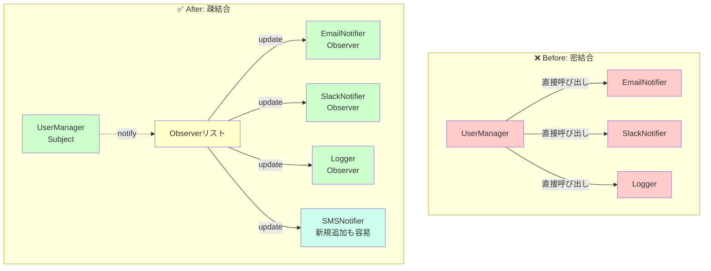

**Before（密結合）の問題点**
- UserManagerが各通知先を直接知っている
- 新しい通知先を追加するたびにUserManagerのコードを修正
- 変更の影響範囲が広い

**After（疎結合）の利点**
- UserManagerは「Observerインターフェース」のみを知っている
- 新しい通知先は`attach`で追加するだけ（既存コードの修正不要）
- 各Observerは独立して変更可能

### 手動通知 vs 自動通知のフロー比較

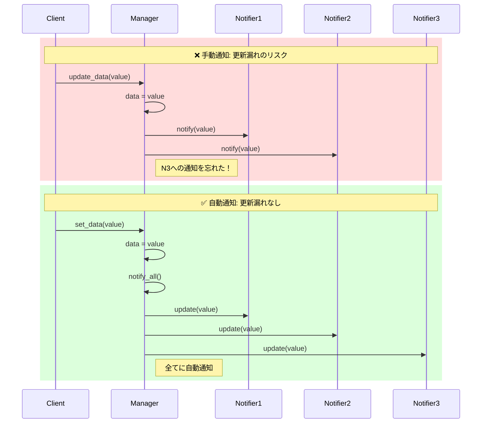

**手動通知の問題**
- 通知先ごとに個別に呼び出す必要がある
- 通知先が増えると呼び出し漏れが発生しやすい
- コードの重複が多い

**自動通知の利点**
- `notify_all()`で一括通知
- 通知先の追加・削除に強い
- コードがシンプルで保守しやすい

## Observerパターンの仕組み【図解で理解】

### 登場人物

Observerパターンは2つの役割で構成されます。

**Subject（被観察者）**
- 状態を持つオブジェクト
- Observerのリストを管理
- 状態変化時にObserverに通知

**Observer（観察者）**
- Subjectの変化を監視
- `update`メソッドで通知を受け取る
- 複数のObserverが存在可能

### クラス図

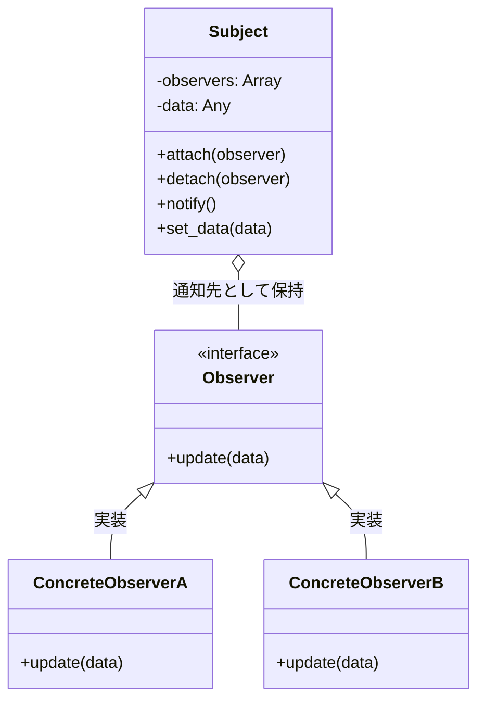

### シーケンス図

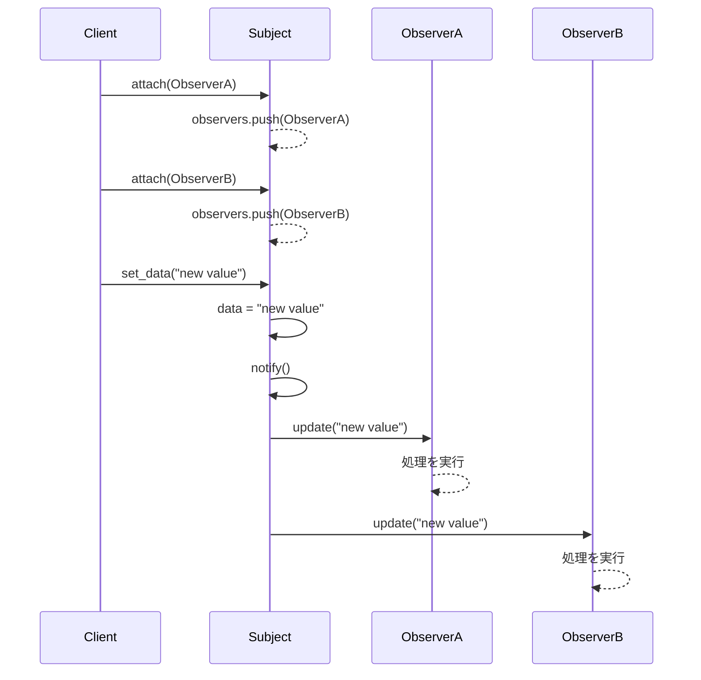

### 動作フロー

1. **初期化**: ClientがSubjectとObserverを生成
2. **登録**: `attach`メソッドでObserverをSubjectに登録
3. **状態変更**: Subjectの状態が変わる
4. **自動通知**: SubjectがすべてのObserverの`update`メソッドを呼び出す
5. **処理実行**: 各Observerが独自の処理を実行

## Perlでの実装方法【2つのアプローチ】

### 方法1：標準的なbless実装

Perlの基本的なOOP機能のみを使った実装です。

**Subject.pm**

```perl
# Subject.pm - 被観察者
# Perl 5.8以降で動作
# 外部依存: なし
package Subject;
use strict;
use warnings;

sub new {
    my $class = shift;
    my $self = {
        observers => [],    # 観察者のリスト
        data      => undef, # 状態データ
    };
    bless $self, $class;
    return $self;
}

# 観察者を登録
sub attach {
    my ($self, $observer) = @_;
    push @{ $self->{observers} }, $observer;
}

# 観察者を削除
sub detach {
    my ($self, $observer) = @_;
    @{ $self->{observers} } = grep { $_ != $observer } @{ $self->{observers} };
}

# 全観察者に通知
sub notify {
    my ($self) = @_;
    for my $observer (@{ $self->{observers} }) {
        $observer->update($self->{data});
    }
}

# 状態変更と通知
sub set_data {
    my ($self, $data) = @_;
    $self->{data} = $data;
    $self->notify();  # 変更を通知
}

sub get_data {
    my ($self) = @_;
    return $self->{data};
}

1;
```

**Observer.pm**

```perl
# Observer.pm - 観察者
# Perl 5.8以降で動作
# 外部依存: なし
package Observer;
use strict;
use warnings;

sub new {
    my ($class, $name) = @_;
    my $self = {
        name => $name || 'Anonymous',
    };
    bless $self, $class;
    return $self;
}

# 状態変更時に呼び出される
sub update {
    my ($self, $data) = @_;
    print "[" . $self->{name} . "] Observer received data: $data\n";
}

1;
```

**使用例**

```perl
# example_basic.pl
use strict;
use warnings;
use lib '.';
use Subject;
use Observer;

# 被観察者を作成
my $subject = Subject->new();

# 観察者を作成して登録
my $observer1 = Observer->new('Logger');
my $observer2 = Observer->new('Display');

$subject->attach($observer1);
$subject->attach($observer2);

# 状態を変更すると、全てのObserverに自動通知
$subject->set_data("System started");

# 出力:
# [Logger] Observer received data: System started
# [Display] Observer received data: System started

# 特定のObserverを削除
$subject->detach($observer1);

$subject->set_data("System running");

# 出力:
# [Display] Observer received data: System running
```

### 方法2：Mooを使ったモダン実装

Mooを使うと、型安全性とコードの簡潔さが向上します。

**Subject.pm（Moo版）**

```perl
# Subject.pm (Moo版)
# Perl 5.10以降で動作
# 外部依存: Moo, Types::Standard
package Subject;
use Moo;
use Types::Standard qw(ArrayRef Any);

has observers => (
    is      => 'ro',
    isa     => ArrayRef,
    default => sub { [] },
);

has data => (
    is      => 'rw',
    isa     => Any,
    trigger => sub { shift->notify },  # データ変更時に自動通知
);

sub attach {
    my ($self, $observer) = @_;
    push @{ $self->observers }, $observer;
    return $self;  # メソッドチェーン対応
}

sub detach {
    my ($self, $observer) = @_;
    @{ $self->observers } = grep { $_ != $observer } @{ $self->observers };
    return $self;
}

sub notify {
    my $self = shift;
    $_->update($self->data) for @{ $self->observers };
}

1;
```

**Observer.pm（Moo版）**

```perl
# Observer.pm (Moo版)
# Perl 5.10以降で動作
# 外部依存: Moo, Types::Standard
package Observer;
use Moo;
use Types::Standard qw(Str CodeRef);

has name => (
    is       => 'ro',
    isa      => Str,
    required => 1,
);

has callback => (
    is      => 'ro',
    isa     => CodeRef,
    default => sub {
        sub {
            my ($self, $data) = @_;
            print "[" . $self->name . "] received: $data\n";
        }
    },
);

sub update {
    my ($self, $data) = @_;
    $self->callback->($self, $data);
}

1;
```

**使用例（Moo版）**

```perl
# example_moo.pl
use strict;
use warnings;
use lib '.';
use Subject;
use Observer;

my $subject = Subject->new;

# カスタムコールバック付きObserver
my $logger = Observer->new(
    name     => 'Logger',
    callback => sub {
        my ($self, $data) = @_;
        print "[LOG] " . localtime() . " - $data\n";
    }
);

my $display = Observer->new(name => 'Display');

# メソッドチェーンで登録
$subject
    ->attach($logger)
    ->attach($display);

# trigger により自動通知
$subject->data('System started');

# 出力:
# [LOG] Tue Dec 31 09:39:32 2025 - System started
# [Display] received: System started
```

**Moo実装の利点**

- `trigger`による自動通知（`set_data`メソッド不要）
- 型制約による実行時エラー検出
- メソッドチェーン対応でコードが簡潔
- カスタムコールバックで柔軟な処理

Mooの詳細は[Mooで学ぶOOP](/2025/12/30/163814/)の記事を参照してください。

## 実践：ログシステムを作ってみよう【ハンズオン】

実際にObserverパターンを使って、マルチ出力対応のログシステムを実装します。

### 要件定義

- ログメッセージを複数の出力先（ファイル、コンソール、メール）に送信
- 実行時に出力先を追加・削除可能
- ログレベル（INFO、WARNING、ERROR）に対応

### 実装コード

**LogSubject.pm**

```perl
# LogSubject.pm
# ログイベントを管理するSubject
package LogSubject;
use Moo;
use Types::Standard qw(ArrayRef Str);

extends 'Subject';  # 前述のSubjectを継承

has log_level => (
    is      => 'rw',
    isa     => Str,
    default => 'INFO',
);

sub log {
    my ($self, $level, $message) = @_;
    my $log_entry = "[$level] " . localtime() . " - $message";
    $self->data($log_entry);  # triggerで自動通知
}

1;
```

**FileLogger.pm**

```perl
# FileLogger.pm
# ファイルに出力するObserver
package FileLogger;
use Moo;
use Types::Standard qw(Str);

has name => (
    is      => 'ro',
    isa     => Str,
    default => 'FileLogger',
);

has filename => (
    is       => 'ro',
    isa      => Str,
    required => 1,
);

sub update {
    my ($self, $data) = @_;
    open my $fh, '>>', $self->filename or die "Cannot open file: $!";
    print $fh "$data\n";
    close $fh;
}

1;
```

**ConsoleLogger.pm**

```perl
# ConsoleLogger.pm
# コンソールに出力するObserver
package ConsoleLogger;
use Moo;
use Types::Standard qw(Str);

has name => (
    is      => 'ro',
    isa     => Str,
    default => 'ConsoleLogger',
);

sub update {
    my ($self, $data) = @_;
    print "[CONSOLE] $data\n";
}

1;
```

**EmailLogger.pm**

```perl
# EmailLogger.pm
# メール送信するObserver（簡易版）
package EmailLogger;
use Moo;
use Types::Standard qw(Str);

has name => (
    is      => 'ro',
    isa     => Str,
    default => 'EmailLogger',
);

has email_address => (
    is       => 'ro',
    isa      => Str,
    required => 1,
);

sub update {
    my ($self, $data) = @_;
    # 実際のメール送信処理は省略
    print "[EMAIL to " . $self->email_address . "] $data\n";
}

1;
```

**app.pl（メインアプリケーション）**

```perl
# app.pl
use strict;
use warnings;
use lib '.';
use LogSubject;
use FileLogger;
use ConsoleLogger;
use EmailLogger;

# ログシステムを初期化
my $log_system = LogSubject->new;

# 出力先を追加
my $file_logger    = FileLogger->new(filename => 'app.log');
my $console_logger = ConsoleLogger->new;
my $email_logger   = EmailLogger->new(email_address => 'admin@example.com');

$log_system
    ->attach($file_logger)
    ->attach($console_logger)
    ->attach($email_logger);

# ログを記録（全ての出力先に自動送信）
$log_system->log('INFO', 'Application started');
$log_system->log('WARNING', 'Low memory detected');
$log_system->log('ERROR', 'Database connection failed');

# 実行時に出力先を削除
$log_system->detach($email_logger);

$log_system->log('INFO', 'Email logger disabled');

# 出力:
# [CONSOLE] [INFO] Tue Dec 31 09:39:32 2025 - Application started
# [EMAIL to admin@example.com] [INFO] Tue Dec 31 09:39:32 2025 - Application started
# （app.logにも出力）
# [CONSOLE] [WARNING] Tue Dec 31 09:39:32 2025 - Low memory detected
# [EMAIL to admin@example.com] [WARNING] Tue Dec 31 09:39:32 2025 - Low memory detected
# （app.logにも出力）
# [CONSOLE] [ERROR] Tue Dec 31 09:39:32 2025 - Database connection failed
# [EMAIL to admin@example.com] [ERROR] Tue Dec 31 09:39:32 2025 - Database connection failed
# （app.logにも出力）
# [CONSOLE] [INFO] Tue Dec 31 09:39:32 2025 - Email logger disabled
# （app.logにも出力、メール送信なし）
```

### テストコード

```perl
# t/log_system.t
# Perl 5.10以降で動作
# 外部依存: Test::More
use strict;
use warnings;
use Test::More tests => 4;
use lib 'lib';

use_ok('LogSubject');
use_ok('ConsoleLogger');

my $log_system = LogSubject->new;
isa_ok($log_system, 'LogSubject');

my $console = ConsoleLogger->new;
$log_system->attach($console);

# 通知が正しく動作するか確認
my $notified = 0;
{
    no warnings 'redefine';
    local *ConsoleLogger::update = sub { $notified = 1 };
    $log_system->log('INFO', 'Test message');
}

ok($notified, 'Observer was notified');
```

このログシステムは、新しい出力先を追加する際に既存コードの修正が不要で、拡張性が高い設計になっています。

## Observerパターンの3つのメリット

### メリット1：疎結合による保守性向上

SubjectとObserverが互いに具体的な実装を知らないため、一方の変更が他方に影響しない。

**具体例**

```perl
# Subjectは「updateメソッドを持つオブジェクト」だけを知っている
sub notify {
    my $self = shift;
    $_->update($self->data) for @{ $self->observers };
}

# Observerの内部実装を自由に変更可能
package EmailLogger;
sub update {
    my ($self, $data) = @_;
    # 実装方法をSMTP→API経由に変更しても、Subjectは影響を受けない
    $self->send_via_api($data);
}
```

**開放閉鎖の原則（Open-Closed Principle）**

新機能追加時に既存コードを修正しない（閉じている）が、拡張には開いている。

[Strategyパターン](/2025/12/30/164012/)と並んで、OOPの重要原則を実現するパターンである。

### メリット2：動的な関係構築

実行時にObserverを追加・削除できるため、柔軟な動作制御が可能。

**ユースケース例**

```perl
# デバッグモード時のみ詳細ログを有効化
my $debug_logger = DebugLogger->new;

if ($ENV{DEBUG}) {
    $log_system->attach($debug_logger);
}

# 本番環境では特定の通知を無効化
if ($ENV{PRODUCTION}) {
    $log_system->detach($console_logger);
}
```

### メリット3：自動同期によるヒューマンエラー防止

状態変更時の通知を自動化することで、更新漏れを防ぐ。

**従来の手動同期の問題**

```perl
# ❌ 手動更新（更新漏れのリスク）
$user->score = 100;
$scoreboard->update($user);
$ranking->update($user);
# あれ？通知を忘れてる！
```

**Observerパターンでの自動化**

```perl
# ✅ 自動通知（更新漏れなし）
$user->set_score(100);  # 自動的に全Observerに通知
```

## 5つの落とし穴と対策【実務で重要】

### 落とし穴1：Observer解除忘れによるメモリリーク

**問題**

Observerを`detach`せずに破棄すると、Subjectが参照を保持し続けるためメモリリークが発生する。

```perl
# ❌ メモリリーク例
{
    my $temp_observer = Observer->new('Temporary');
    $subject->attach($temp_observer);
    # スコープを抜けてもSubjectが参照を保持
}
# $temp_observerは解放されない！
```

### メモリリーク発生パターン図

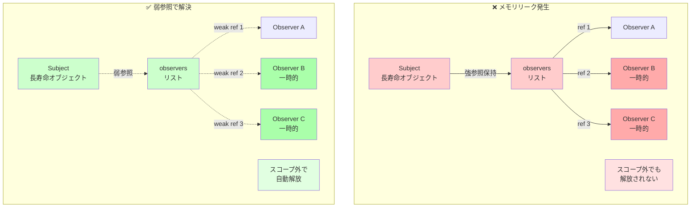

**メモリリークの仕組み**

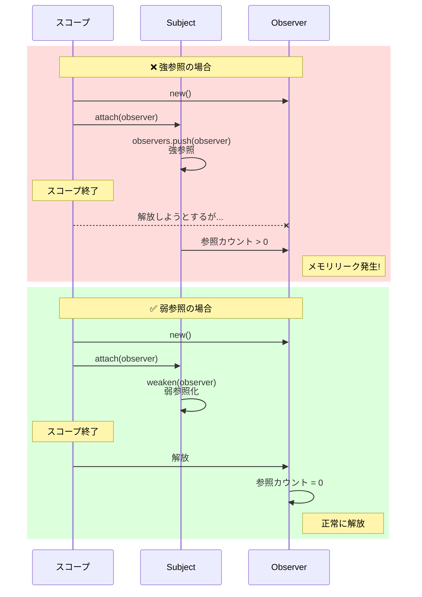

**対策：弱参照（Weak Reference）の利用**

```perl
# ✅ 弱参照で循環参照を防ぐ
# Perl 5.8以降で動作
# 外部依存: Scalar::Util
package Subject;
use Scalar::Util qw(weaken);

sub attach {
    my ($self, $observer) = @_;
    push @{ $self->{observers} }, $observer;
    weaken($self->{observers}[-1]);  # 弱参照化
}
```

**対策：RAIIパターン（スコープガード）**

```perl
# ✅ スコープ終了時に自動detach
# Perl 5.10以降で動作
# 外部依存: Guard
use Guard;

sub scoped_attach {
    my ($subject, $observer) = @_;
    $subject->attach($observer);
    return guard { $subject->detach($observer) };
}

{
    my $guard = scoped_attach($subject, $temp_observer);
    # 処理...
}  # スコープ終了時に自動detach
```

### 落とし穴2：循環参照による無限ループ

**問題**

ObserverがSubjectの状態を変更すると、無限ループが発生する。

```perl
# ❌ 無限ループ例
package EchoObserver;
sub update {
    my ($self, $data) = @_;
    $self->{subject}->set_data($data . " echo");  # 再度通知が発生
}
```

### 無限ループ発生メカニズム図

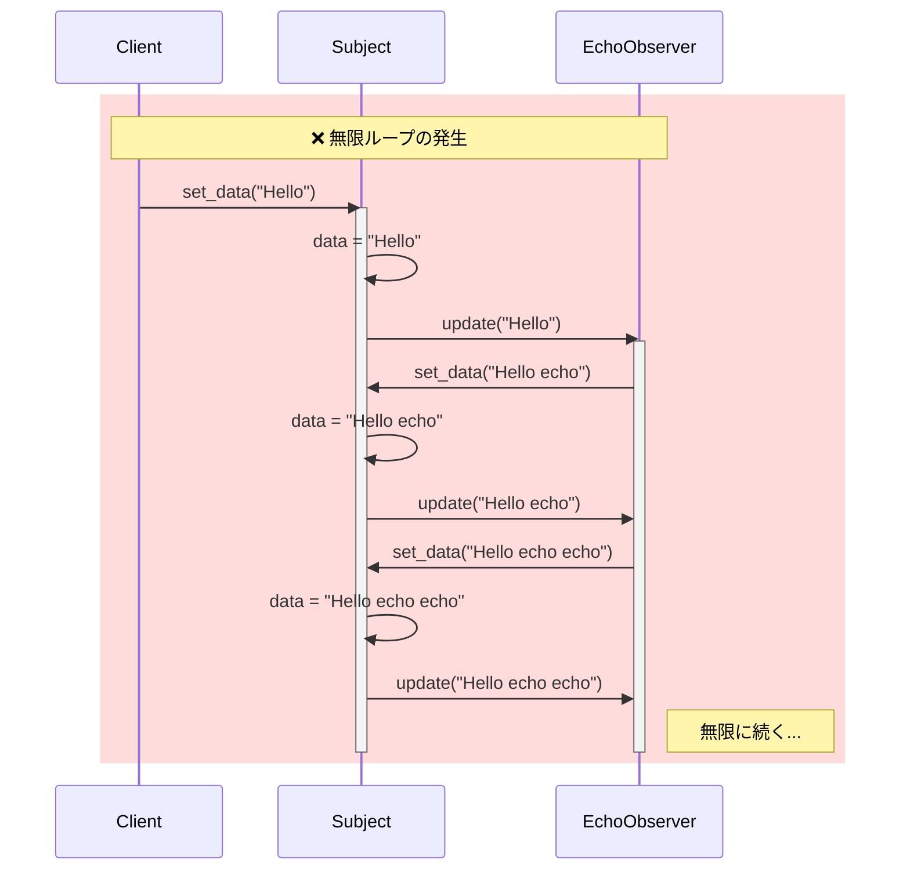

**発生パターン**

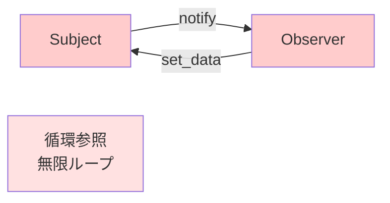

**対策：通知フラグの導入**

```perl
# ✅ 通知中フラグで再帰を防止
package Subject;

has is_notifying => (
    is      => 'rw',
    default => 0,
);

sub notify {
    my $self = shift;
    return if $self->is_notifying;  # 通知中は再通知しない
    
    $self->is_notifying(1);
    $_->update($self->data) for @{ $self->observers };
    $self->is_notifying(0);
}
```

### 無限ループ対策後のフロー

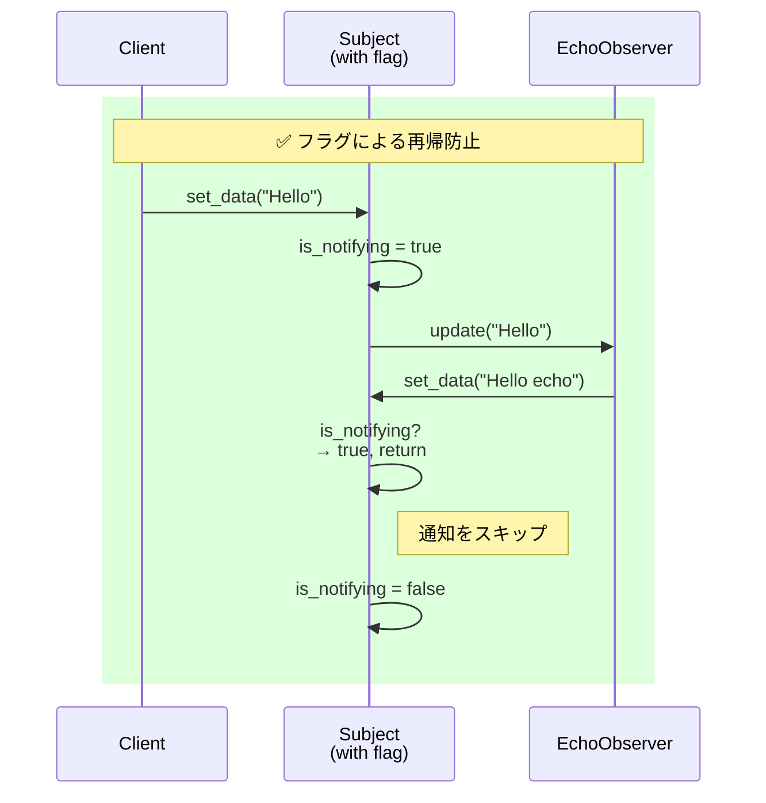

### 落とし穴3：通知順序の不確定性

**問題**

Observerへの通知順序が保証されないため、依存関係がある処理で問題が発生する。

```perl
# ❌ 順序依存の例
# DisplayObserverはLogObserverより先に実行される必要がある
$subject->attach($log_observer);
$subject->attach($display_observer);
# 登録順に通知されるが、仕様として保証されていない
```

**対策：優先度付きObserver**

```perl
# ✅ 優先度管理
package PrioritySubject;
use Moo;
extends 'Subject';

sub attach {
    my ($self, $observer, $priority) = @_;
    $priority //= 0;
    push @{ $self->observers }, { obj => $observer, pri => $priority };
    
    # 優先度順にソート
    @{ $self->observers } = sort { $b->{pri} <=> $a->{pri} } @{ $self->observers };
}

sub notify {
    my $self = shift;
    $_->{obj}->update($self->data) for @{ $self->observers };
}
```

### 落とし穴4：大量Observerでのパフォーマンス低下

**問題**

Observer数が多い場合、1回の`notify`で全てのObserverが同期実行されるため遅延が発生する。

```perl
# ❌ 1000個のObserverに同期通知
for (1..1000) {
    $subject->attach(Observer->new("Observer $_"));
}
$subject->set_data("update");  # 1000回のupdateが順次実行
```

**対策：非同期通知**

```perl
# ✅ 非同期通知（Promiseパターン）
# Perl 5.26以降で動作
# 外部依存: Future::AsyncAwait, IO::Async
use Future::AsyncAwait;
use IO::Async::Loop;

my $loop = IO::Async::Loop->new;

sub notify_async {
    my $self = shift;
    
    for my $observer (@{ $self->observers }) {
        $loop->later(sub { $observer->update($self->data) });
    }
}
```

**対策：バッチ通知**

```perl
# ✅ 一定時間内の変更をまとめて通知
package BatchSubject;
use Moo;
use AnyEvent;

has batch_timer => (is => 'rw');
has pending_notify => (is => 'rw', default => 0);

sub set_data {
    my ($self, $data) = @_;
    $self->data($data);
    
    # 既にタイマーが設定されていれば何もしない
    return if $self->pending_notify;
    
    $self->pending_notify(1);
    $self->batch_timer(
        AnyEvent->timer(
            after => 0.1,  # 100ms後にまとめて通知
            cb    => sub {
                $self->notify;
                $self->pending_notify(0);
            },
        )
    );
}
```

### 落とし穴5：通知経路の可視化困難

**問題**

どのObserverが登録されているかコード上で追跡しづらい。

**対策：デバッグログの追加**

```perl
# ✅ 通知経路をログ出力
package Subject;

sub attach {
    my ($self, $observer) = @_;
    push @{ $self->observers }, $observer;
    warn "Observer attached: " . ref($observer) if $ENV{DEBUG};
}

sub notify {
    my $self = shift;
    warn "Notifying " . scalar(@{ $self->observers }) . " observers" if $ENV{DEBUG};
    
    for my $observer (@{ $self->observers }) {
        warn "  -> " . ref($observer) . "->update()" if $ENV{DEBUG};
        $observer->update($self->data);
    }
}
```

## 他言語・フレームワークでの実装【比較】

### Pub-Subパターンとの違い

Observerパターンと混同されやすいPub-Sub（Publish-Subscribe）パターンとの違いを明確にします。

**比較表**

| 観点 | Observerパターン | Pub-Subパターン |
|------|------------------|-----------------|
| **結合度** | 強い（SubjectがObserverを直接管理） | 弱い（BrokerやEvent Busが仲介） |
| **通知方式** | 同期的・直接呼び出し | 非同期・メッセージキュー経由 |
| **スコープ** | プロセス内、同一アプリ内 | クロスモジュール、分散システム |
| **拡張性** | 小〜中規模向き | 大規模・多数の参加者向き |
| **実装コスト** | 低い | 高い（Brokerインフラが必要） |
| **トピック管理** | なし（Subject単位） | あり（チャネル/トピックで分類） |

**使い分けの指針**

- **Observerパターン**: UI更新、小規模な状態同期、イベント駆動GUI
- **Pub-Sub**: マイクロサービス通信、大規模イベント配信、メッセージキュー（RabbitMQ、Kafka）

### アーキテクチャ比較図

ObserverパターンとPub-Subパターンの構造的な違いを明確に理解しましょう。

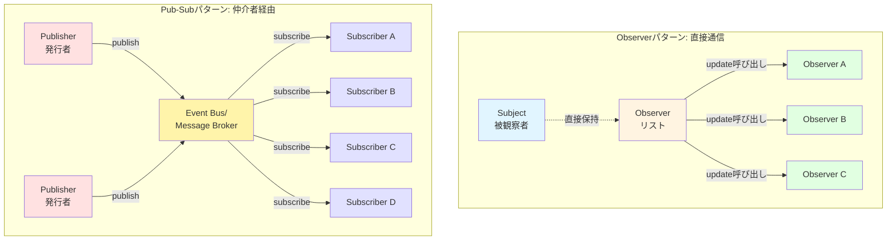

**Observerパターンの特徴**
- Subjectが全Observerを直接管理
- 同期的な通知（メソッド呼び出し）
- 同一プロセス内での動作が基本
- シンプルな実装で低コスト

**Pub-Subパターンの特徴**
- PublisherとSubscriberは互いを知らない（完全疎結合）
- Event Busが仲介（トピックやチャネルで分類）
- 非同期・分散システムに適している
- インフラ（Message Queue等）が必要

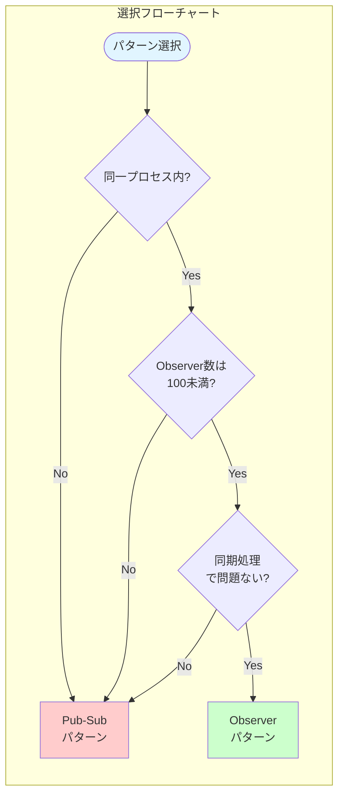

### React（JavaScript）での実装

React 19では、状態管理に内部的にObserverパターンを利用しています。

```javascript
// React 19のuseStateは内部的にObserverパターン
import { useState, useEffect } from 'react';

function UserProfile() {
  const [user, setUser] = useState({ name: 'John', score: 0 });
  
  // useEffectがObserver的な役割
  useEffect(() => {
    console.log('User updated:', user);
    // 依存配列に基づいて自動実行（自動通知）
  }, [user]);
  
  return (
    <div>
      <h1>{user.name}</h1>
      <button onClick={() => setUser({ ...user, score: user.score + 1 })}>
        Score: {user.score}
      </button>
    </div>
  );
}
```

**Reactとの対応関係**

- **Subject**: Reactの`state`
- **Observer**: 依存コンポーネント、`useEffect`フック
- **notify**: `setState`呼び出し時の自動再レンダリング



### Vue.js（JavaScript）での実装

Vue 3のリアクティブシステムは、Proxyベースの高度なObserverパターンです。

```javascript
// Vue 3のreactiveがObserverパターン
import { reactive, watch } from 'vue';

const state = reactive({
  count: 0,
  message: 'Hello'
});

// watchがObserver
watch(
  () => state.count,
  (newValue, oldValue) => {
    console.log(`Count changed from ${oldValue} to ${newValue}`);
  }
);

state.count++;  // 自動的にwatchが実行される
```

### TypeScript（型安全な実装）

```typescript
// TypeScript 5.0以降で動作
// 外部依存: なし
interface Observer<T> {
  update(data: T): void;
}

class Subject<T> {
  private observers: Set<Observer<T>> = new Set();
  private _data?: T;
  
  attach(observer: Observer<T>): void {
    this.observers.add(observer);
  }
  
  detach(observer: Observer<T>): void {
    this.observers.delete(observer);
  }
  
  notify(): void {
    this.observers.forEach(observer => observer.update(this._data!));
  }
  
  setData(data: T): void {
    this._data = data;
    this.notify();
  }
}

// 使用例
class ConsoleLogger implements Observer<string> {
  update(data: string): void {
    console.log('[LOG]', data);
  }
}

const subject = new Subject<string>();
const logger = new ConsoleLogger();
subject.attach(logger);
subject.setData('Event occurred');
```

### Java（伝統的な実装）

Javaには`java.util.Observable`クラスがありましたが、Java 9で非推奨になりました。

```java
// Java 8以降（java.util.Observableは非推奨）
// 現代的な実装例
import java.util.ArrayList;
import java.util.List;

interface Observer {
    void update(String data);
}

class Subject {
    private List<Observer> observers = new ArrayList<>();
    private String data;
    
    public void attach(Observer observer) {
        observers.add(observer);
    }
    
    public void detach(Observer observer) {
        observers.remove(observer);
    }
    
    public void setData(String data) {
        this.data = data;
        notify();
    }
    
    private void notify() {
        for (Observer observer : observers) {
            observer.update(data);
        }
    }
}
```

### CPANモジュール（Perl）

既存のCPANモジュールを使う方法もあります。

```perl
# Class::Observableを使った実装
# Perl 5.8以降で動作
# 外部依存: Class::Observable
use Class::Observable;

package MySubject;
use base qw(Class::Observable);

sub new {
    my $class = shift;
    my $self = bless {}, $class;
    return $self;
}

sub set_data {
    my ($self, $data) = @_;
    $self->{data} = $data;
    $self->notify_observers($data);
}

# 使用例
package main;
MySubject->add_observer(sub {
    my ($subject, $data) = @_;
    print "Observed: $data\n";
});

my $subject = MySubject->new;
$subject->set_data("test");
```

ただし、`Class::Observable`は2009年以降メンテナンスされていないため、本番環境では自前実装かMooでの実装を推奨します。

## よくある質問（FAQ）

### Q1: StrategyパターンとObserverパターンの違いは？

**A:** 目的と役割が異なります。

- **Strategyパターン**: アルゴリズムの切り替え（例：ソート方法を変更）
- **Observerパターン**: 状態変化の通知（例：データ更新を複数箇所に伝える）

詳細は[Strategyパターンの記事](/2025/12/30/164012/)を参照してください。

### Q2: いつObserverパターンを使うべき？

**A:** 以下の条件に当てはまる場合に有効です。

- 1つの変更を複数箇所に反映したい
- 変更元と変更先を疎結合にしたい
- 実行時に通知先を動的に変更したい

### Q3: Observerパターンは遅くないか？

**A:** Observer数が少ない場合（数十個程度）は問題ありません。

大量のObserver（数百〜数千）がある場合は、以下の最適化を検討します。

- 非同期通知
- バッチ処理
- 優先度制御
- 条件付き通知（変更があった場合のみ）

### Q4: メモリリークを完全に防ぐには？

**A:** 以下の対策を組み合わせます。

1. 弱参照（`Scalar::Util::weaken`）の利用
2. スコープガード（`Guard`モジュール）の利用
3. 明示的な`detach`の徹底
4. 定期的なObserverリストのクリーンアップ

### Q5: テストしやすい設計にするには？

**A:** モックObserverを使ったテストが有効です。

```perl
# テスト用のモックObserver
package MockObserver;
use Moo;

has call_count => (is => 'rw', default => 0);
has last_data  => (is => 'rw');

sub update {
    my ($self, $data) = @_;
    $self->call_count($self->call_count + 1);
    $self->last_data($data);
}

# テストコード
use Test::More;

my $subject = Subject->new;
my $mock    = MockObserver->new;

$subject->attach($mock);
$subject->set_data('test');

is($mock->call_count, 1, 'update was called once');
is($mock->last_data, 'test', 'received correct data');
```

### Q6: 複数のSubjectを監視できるか？

**A:** 可能です。1つのObserverが複数のSubjectを監視できます。

```perl
package MultiSubjectObserver;
use Moo;

sub update {
    my ($self, $data) = @_;
    print "Received from any subject: $data\n";
}

# 使用例
my $observer = MultiSubjectObserver->new;

my $subject1 = Subject->new;
my $subject2 = Subject->new;

$subject1->attach($observer);
$subject2->attach($observer);

$subject1->set_data('from subject1');
$subject2->set_data('from subject2');
```

どのSubjectから通知されたかを識別したい場合は、`update`メソッドでSubjectを受け取る設計にします。

```perl
sub update {
    my ($self, $subject, $data) = @_;
    print "Received from " . ref($subject) . ": $data\n";
}

# Subjectのnotifyメソッドを修正
sub notify {
    my $self = shift;
    $_->update($self, $self->data) for @{ $self->observers };
}
```

## まとめと次のステップ【学習ロードマップ】

### この記事で学んだこと

- **Observerパターンの定義**: 状態変化を自動通知する仕組み
- **3つの問題解決**: 密結合、同期漏れ、変更に弱い設計
- **2つの実装方法**: bless版とMoo版
- **実践例**: マルチ出力ログシステム
- **5つの落とし穴**: メモリリーク、循環参照、順序不確定、パフォーマンス、可視化困難
- **他言語との比較**: React、Vue、TypeScript、Java

### Observerパターン選択フローチャート

実務でObserverパターンを採用すべきか判断する際の指針です。

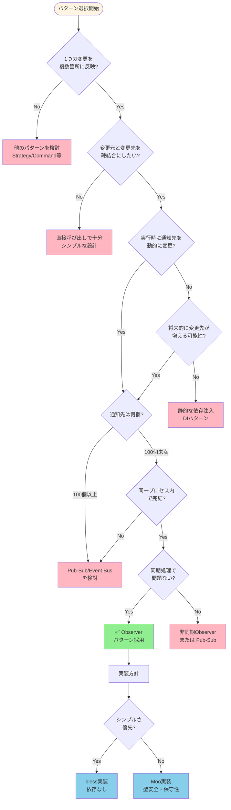

**判断基準のポイント**

| 条件 | 推奨パターン | 理由 |
|------|------------|------|
| UI更新、状態同期が必要 | Observer | 自動通知で更新漏れ防止 |
| 通知先が頻繁に変わる | Observer | 動的なattach/detach |
| 大規模・分散システム | Pub-Sub | スケーラビリティ |
| 通知先100個以上 | Pub-Sub + 非同期 | パフォーマンス対策 |
| シンプルな1対1通知 | 直接呼び出し | オーバーエンジニアリング回避 |

### 関連パターンの関係図

Observerパターンは他のデザインパターンと組み合わせることで、より強力な設計を実現できます。

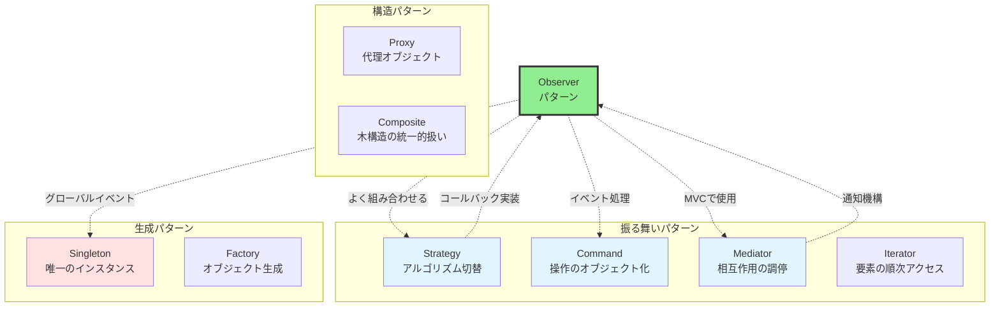

**パターン間の関係**

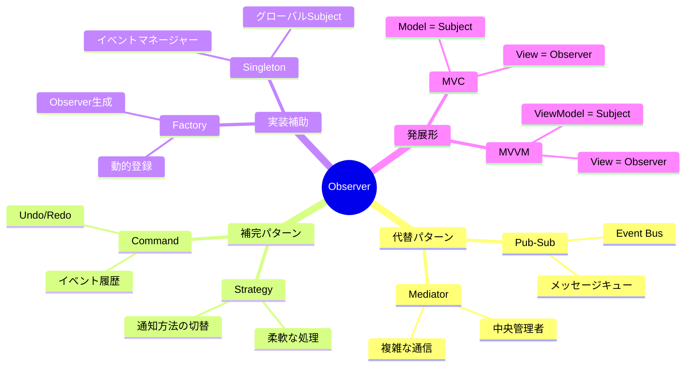

**組み合わせ例**

| パターン組み合わせ | ユースケース | 効果 |
|------------------|------------|------|
| Observer + Strategy | 通知方法を動的に変更（同期/非同期） | 柔軟性向上 |
| Observer + Command | イベント履歴の記録とリプレイ | デバッグ・監査 |
| Observer + Singleton | アプリ全体のイベントバス | グローバル通知 |
| Observer + Mediator | 複雑なUI更新の調停 | 依存関係の整理 |
| Observer + Factory | 設定ファイルからObserver生成 | プラグイン機構 |

### 実務で使うための次のステップ

**ステップ1：小規模な実装で練習**

まずは簡単なイベント通知システムを作ってみましょう。

```perl
# 練習課題：温度センサーシステム
# - Subjectが温度データを保持
# - Observer1: 25度以上で警告
# - Observer2: 温度履歴をファイルに記録
# - Observer3: 現在温度を画面表示
```

**ステップ2：デザインパターンの体系的学習**

Observerパターンは振る舞いパターンの1つです。他のパターンも学びましょう。

**推奨学習順序**

1. **Strategy**パターン - アルゴリズムの切り替え（[記事](/2025/12/30/164012/)）
2. **Observer**パターン - 今回の記事
3. **Command**パターン - 操作のオブジェクト化
4. **Mediator**パターン - 複雑な相互作用の調停

**ステップ3：フレームワークのソースコード読解**

ReactやVueの内部実装を読んで、Observerパターンがどう使われているか確認しましょう。

**ステップ4：本番環境への適用**

実際のプロジェクトで、以下のような場面でObserverパターンを活用します。

- ログシステムの実装
- イベント駆動アーキテクチャ
- プラグインシステム
- 設定変更の通知

### 参考書籍・リソース

**書籍**



デザインパターンの原典です。Observerパターンの正式な定義と、C++/Smalltalkでの実装例が掲載されています。

**オンラインリソース**



図解が豊富で初心者にも分かりやすい解説です。



Mooの公式ドキュメントです。本記事のMoo実装例の理解に役立ちます。

### Perlでのオブジェクト指向を深める

Observerパターンを理解するには、Perlのオブジェクト指向の基礎が重要です。

- [Mooで覚えるオブジェクト指向プログラミング](/2025/12/30/163814/)
- カプセル化、継承、ポリモーフィズムの理解

### さあ、実装してみよう！

理論を学んだら、実際にコードを書いてみることが最も重要です。

本記事のサンプルコードをベースに、あなた独自のObserverパターン実装に挑戦してください！

**Happy Hacking with Perl! 🐪✨**
