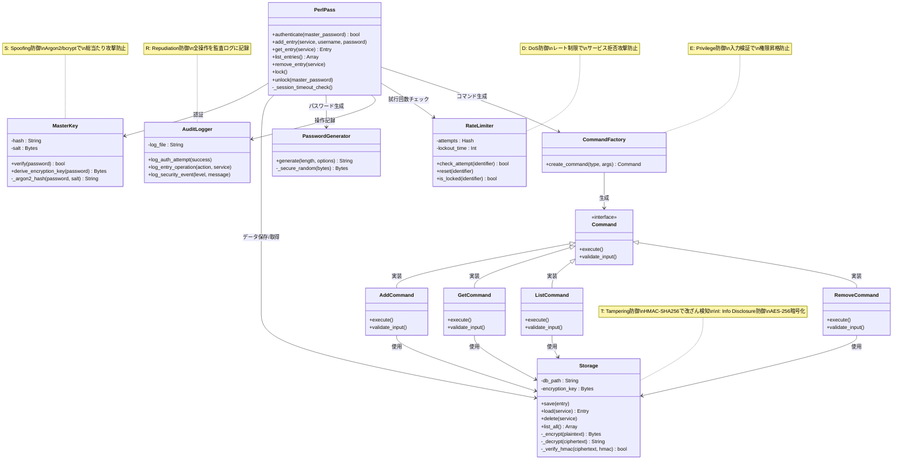

[@nqounet](https://x.com/nqounet)です。

パスワードマネージャーは、すべてのアカウント情報を一元管理する「最後の砦」です。その設計を誤れば、全アカウントが一度に漏洩する重大なリスクを招きます。

本記事は、**パスワード生成・管理ツールシリーズ**の第1回として、NIST SP 800-63B（2024年改訂版）とOWASP推奨基準に準拠した、安全なパスワードマネージャー「PerlPass」の設計方針を解説します。

## なぜパスワードマネージャーが必要なのか

### 「最後の砦」を守るために

現代のWebサービスは、一人あたり平均100以上のアカウントを持つと言われています。それらすべてに異なる強力なパスワードを設定し、記憶することは人間には不可能です。

パスワードマネージャーは、以下の問題を解決します：

- **パスワード再利用の防止**: 同じパスワードを使い回すと、1つのサービスが侵害された際に全アカウントが危険にさらされる
- **強力なパスワード生成**: ランダムで推測不可能なパスワードを自動生成
- **安全な保管**: すべてのパスワードを暗号化して一元管理
- **利便性の向上**: マスターパスワード1つで全パスワードにアクセス

しかし、パスワードマネージャー自体が侵害されれば、全アカウントが一度に漏洩します。設計段階からセキュリティを組み込むことが極めて重要なのです。

### 設計段階でのセキュリティ検討が投資対効果最大

セキュリティ脆弱性の修正コストは、開発段階が最も低く、リリース後は指数関数的に増大します。設計段階で脅威を洗い出し、適切な対策を組み込むことで、後の大きな手戻りを防ぐことができます。

## PerlPassプロジェクトの全体像

### シリーズの目標

本シリーズでは、以下の機能を持つコマンドラインパスワードマネージャー「PerlPass」を段階的に実装します：

- **マスターパスワード認証**: NIST準拠の15文字以上パスフレーズ、Argon2ハッシュ化
- **パスワード生成**: 安全な乱数生成器（Crypt::URandom）による強力なパスワード作成
- **安全な保管**: AES-256暗号化、SQLiteデータベース
- **CLIインターフェース**: サブコマンド方式（add/list/get/remove）
- **セキュア設計**: ゼロ知識設計、メモリ保護、監査ログ

### 使用する技術スタック

PerlPassは、以下のCPANモジュールとPerl 5.36以降の機能を使用します：

| カテゴリ | モジュール/機能 | 用途 |
|---------|--------------|------|
| **OOP基盤** | Moo, Type::Tiny | クラス定義、型チェック |
| **暗号化** | Crypt::Argon2, Crypt::Bcrypt | パスワードハッシュ化 |
| **データ暗号化** | Crypt::Mode::CBC (AES-256) | データベース暗号化 |
| **乱数生成** | Crypt::URandom | セキュアな乱数生成 |
| **データベース** | DBI, DBD::SQLite | パスワードストレージ |
| **CLI** | Getopt::Long | コマンドライン引数処理 |

外部依存は最小限に抑え、信頼性の高いCPANモジュールのみを使用します。





## 8つのセキュリティ要件

パスワードマネージャーに求められるセキュリティ要件を8つのカテゴリに整理しました。これらは、NIST SP 800-63BとOWASP Password Storage Cheat Sheetに準拠しています。


**図2: セキュリティ要件のデータフロー**

上図は、ユーザー入力から暗号化データベース保存までの流れと、8つのセキュリティ要件がどの段階で適用されるかを示しています。各色は要件のグループを表し、データが複数のセキュリティ層を通過することで多層防御を実現しています。

### 1. マスターパスワードの保護

マスターパスワードは、パスワードマネージャーへのアクセスを制御する唯一の鍵です。その保護が最優先課題となります。

#### NIST SP 800-63B（2024年改訂版）準拠要件

2024年8月改訂のNIST SP 800-63Bでは、パスワードポリシーが大幅に見直されました：

- **最小長**: 一般用途で8文字以上、**パスワードマネージャーでは15文字以上を強く推奨**
- **最大長**: 最低64文字まで受け入れる（パスフレーズ対応）
- **複雑性要求の廃止**: 大文字・小文字・数字・記号の強制混在は不要
- **パスフレーズ優先**: 短く複雑より、長く記憶しやすいパスフレーズへ
- **定期変更不要**: 侵害時のみ変更（定期的な強制変更は廃止）

#### MD5/SHA-256単体の危険性

MD5やSHA-256は、本来「高速なハッシュ関数」として設計されています。しかし、パスワードハッシュ化においては、この高速性が致命的な弱点となります。

- **MD5**: 秒間数十億回のハッシュ計算が可能。総当たり攻撃に極めて脆弱
- **SHA-256単体**: MD5より安全だが、GPU並列計算で秒間数億回の試行が可能

パスワードハッシュには、**意図的に計算コストを高めた専用アルゴリズム**が必須です。

#### OWASP推奨アルゴリズム比較

| アルゴリズム | 推奨度 | 主な特徴 | Perlモジュール |
|-------------|--------|---------|--------------|
| **Argon2id** | ★★★★★ | PHC優勝、メモリハード、GPU耐性 | Crypt::Argon2 |
| **bcrypt** | ★★★★☆ | 実績豊富、72バイト制限 | Crypt::Bcrypt |
| **scrypt** | ★★★★☆ | メモリハード、Argon2の代替 | Crypt::ScryptKDF |
| **PBKDF2** | ★★★☆☆ | FIPS準拠が必要な場合のみ | Crypt::PBKDF2 |

PerlPassでは、**Argon2id**をデフォルト、bcryptをフォールバックとして採用します。



#### レート制限とアカウントロックアウト

総当たり攻撃を防ぐため、以下の機能を実装します。

- ログイン試行回数制限: 5回失敗で30分間ロック
- タイミング攻撃対策: 正しいユーザー名でも間違ったパスワードでも同じ処理時間
- 監査ログ: すべてのログイン試行を記録

### 2. データベース暗号化

パスワードデータベース全体を暗号化し、ファイルが盗まれても内容を読み取れないようにします。

#### AES-256による暗号化

AES（Advanced Encryption Standard）は、米国政府が採用する標準暗号アルゴリズムで、現在最も信頼されている対称鍵暗号です。

- **鍵長**: 256ビット（32バイト）
- **暗号化モード**: CBC（Cipher Block Chaining）
- **初期化ベクトル（IV）**: 毎回ランダムに生成（16バイト）
- **完全性検証**: HMAC-SHA256（Encrypt-then-MAC）

#### データベース構造

```
[暗号化されたSQLiteデータベース]
├── IV（16バイト）
├── 暗号文（可変長）
└── HMAC-SHA256（32バイト）
```

暗号化されたデータベースファイルは、マスターパスワードから導出した鍵でのみ復号可能です。

### 3. ゼロ知識設計

**ゼロ知識設計**とは、サービス提供者（サーバー側）がユーザーのデータを復号できない設計を指します。

#### ゼロ知識設計の原則

- クライアント側暗号化: すべての暗号化・復号をローカル（クライアント）で実行
- サーバーは暗号文のみ保存: サーバーに保存されるのは暗号化済みデータのみ
- マスターパスワード非送信: マスターパスワードはネットワークを通過しない
- 鍵導出もローカル: 暗号化鍵の生成もクライアント側で完結

PerlPassは**完全ローカル実行**のため、そもそもサーバーが存在しません。これは最も強力なゼロ知識設計と言えます。

#### KeePassのローカルコントロール設計に学ぶ

世界的に広く使われているKeePassは、ローカル完結型アーキテクチャの代表例です。

- すべてのデータをローカルファイル（.kdbx）に保存
- クラウド同期はユーザーの選択（Dropbox等に暗号化ファイルを配置）
- サーバー侵害のリスクがゼロ
- オフライン環境でも使用可能

### 4. メモリ上の機密情報保護

プログラムが動作中、メモリ上にはマスターパスワードや復号された機密データが一時的に存在します。

#### メモリダンプ攻撃の脅威

- **スワップファイル**: メモリがディスクにスワップアウトされ、機密データが平文で保存される可能性
- **クラッシュダンプ**: アプリケーションクラッシュ時にメモリダンプファイルが生成される
- **デバッガ**: デバッガやメモリスキャンツールでプロセスメモリを読み取られる

#### 対策

Perlでのメモリ保護は限定的ですが、以下の対策を実施します。

- 使用後即座にクリア: パスワード文字列を使用後すぐに上書き（`undef`やゼロ埋め）
- スコープの最小化: 機密データの変数スコープを最小限に
- Readonly変数の回避: 復号後のパスワードはReadonlyにしない（変更できないとクリアできない）

### 5. 安全な乱数生成

パスワード生成、ソルト、IV（初期化ベクトル）には、暗号学的に安全な乱数生成器（CSPRNG: Cryptographically Secure Pseudo-Random Number Generator）が必須です。

#### Perlの標準`rand()`は暗号用途に不適

```perl
# ❌ 絶対にやってはいけない
my $password = int(rand(1000000));  # 予測可能、暗号学的に不安全
```

Perlの`rand()`は、メルセンヌツイスタなどの疑似乱数生成器を使用しており、暗号用途には不適です。

#### Crypt::URandomによるセキュアな乱数生成

```perl
use Crypt::URandom qw(urandom);

# ✅ 正しい方法: OSのエントロピー源から取得
my $random_bytes = urandom(32);  # 32バイトのランダムデータ
```

`Crypt::URandom`は、Linux/Unixの`/dev/urandom`、Windowsの`CryptGenRandom`などOS提供のCSPRNGを使用します。

### 6. 入力検証

すべての外部入力を検証し、インジェクション攻撃やバッファオーバーフローを防ぎます。

#### 検証項目

- マスターパスワード: 長さ15文字以上64文字以下、全Unicode対応
- サービス名/URL: 最大255文字、SQLインジェクション対策
- ユーザー名: 最大255文字
- 生成パスワード長: 8〜128文字の範囲



### 7. 監査ログ

すべての重要な操作を記録し、不正アクセスの検知と事後調査を可能にします。

#### ログ記録対象

- マスターパスワード認証試行（成功/失敗）
- パスワードエントリの追加・更新・削除
- データベースファイルのアクセス
- 異常な操作パターン

#### ログフォーマット

```
[2025-12-31 18:58:24] [INFO] Master password authenticated successfully
[2025-12-31 18:59:01] [INFO] Entry added: service=github.com
[2025-12-31 19:00:15] [WARN] Failed authentication attempt (3/5)
[2025-12-31 19:01:22] [ERROR] Account locked due to too many failed attempts
```

### 8. セキュアな削除

削除されたパスワードが復元されないよう、確実に消去します。

#### ファイルシステムレベルの削除

SQLiteの`DELETE`文だけでは、ディスク上のデータは物理的に削除されません。以下の対策を実施します。

- VACUUM実行: SQLiteデータベースを最適化し、削除済みデータを物理削除
- 上書き削除: 削除前に乱数で複数回上書き（paranoidモード）
- 暗号化による保護: 暗号化されているため、削除後も読み取り不可

## セキュリティ要件チェックリスト

以下は、PerlPassが満たすべきセキュリティ要件をPerlのハッシュデータ構造で表現したものです。実装時の指針として使用します。

```perl
#!/usr/bin/env perl
use v5.36;

# PerlPassセキュリティ要件定義
# NIST SP 800-63B (2024) / OWASP Password Storage準拠

my $security_requirements = {
    # 要件1: マスターパスワードの保護
    authentication => {
        # NIST SP 800-63B準拠
        master_password => {
            min_length              => 15,    # パスワードマネージャー推奨長
            max_length              => 64,    # NIST最小受入長
            complexity_required     => 0,     # 複雑性要求廃止（NIST 2024）
            passphrase_preferred    => 1,     # パスフレーズ優先
            unicode_support         => 1,     # 全Unicode文字対応
        },
        # OWASP推奨ハッシュアルゴリズム
        password_hashing => {
            primary   => 'Argon2id',          # PHC優勝、最新推奨
            fallback  => 'bcrypt',            # 実績豊富な代替
            params => {
                argon2id => {
                    time_cost   => 3,         # 繰り返し回数
                    memory_cost => '32M',     # メモリ使用量（32MB）
                    parallelism => 1,         # スレッド数
                    tag_length  => 16,        # 出力長（バイト）
                },
                bcrypt => {
                    cost => 12,               # 2^12 = 4096回の繰り返し
                },
            },
        },
        # ブルートフォース攻撃対策
        rate_limiting => {
            enabled           => 1,
            max_attempts      => 5,           # 最大試行回数
            lockout_duration  => 1800,        # ロック時間（秒、30分）
        },
        # ソルト必須
        salt => {
            required      => 1,
            min_length    => 16,              # 最小16バイト
            random_source => 'Crypt::URandom', # CSPRNG使用
        },
    },

    # 要件2: データベース暗号化
    encryption => {
        algorithm        => 'AES-256',        # NIST承認アルゴリズム
        mode             => 'CBC',            # Cipher Block Chaining
        key_derivation   => 'Argon2id',       # マスターパスワードから鍵導出
        iv => {
            length        => 16,              # 128ビット
            random_source => 'Crypt::URandom',
            reuse         => 0,               # 毎回生成、再利用禁止
        },
    },

    # 要件3: ゼロ知識設計
    zero_knowledge => {
        client_side_encryption => 1,          # クライアント側で暗号化
        local_only             => 1,          # 完全ローカル実行
        server_access          => 0,          # サーバーは暗号文すら見ない
    },

    # 要件4: メモリ保護
    memory_protection => {
        clear_after_use   => 1,               # 使用後即座にクリア
        minimize_scope    => 1,               # スコープ最小化
        avoid_readonly    => 1,               # Readonly変数を避ける
    },

    # 要件5: 安全な乱数生成
    random_generation => {
        source            => 'Crypt::URandom', # OS提供CSPRNG
        password_length   => {
            min => 8,
            max => 128,
            default => 16,
        },
    },

    # 要件6: 入力検証
    input_validation => {
        master_password => {
            min_length => 15,
            max_length => 64,
        },
        service_name => {
            max_length => 255,
            sql_escape => 1,                   # SQLインジェクション対策
        },
        username => {
            max_length => 255,
        },
    },

    # 要件7: 監査ログ
    audit_logging => {
        enabled => 1,
        log_level => 'INFO',                   # INFO/WARN/ERROR
        log_events => [
            'authentication_attempt',
            'entry_added',
            'entry_updated',
            'entry_deleted',
            'database_accessed',
        ],
    },

    # 要件8: セキュアな削除
    secure_deletion => {
        vacuum_on_delete => 1,                 # SQLite VACUUM実行
        overwrite_passes => 3,                 # 上書き回数（paranoidモード）
    },

    # 完全性検証
    integrity => {
        hmac_algorithm => 'SHA256',            # HMAC-SHA256
        encrypt_then_mac => 1,                 # Encrypt-then-MAC方式
    },
};

# 要件の検証例
sub validate_master_password ($password) {
    my $req = $security_requirements->{authentication}{master_password};
    
    die "パスワードは$req->{min_length}文字以上必要です\n"
        if length($password) < $req->{min_length};
    
    die "パスワードは$req->{max_length}文字以下である必要があります\n"
        if length($password) > $req->{max_length};
    
    return 1;
}

# 使用例
eval {
    validate_master_password("short");  # 15文字未満なので失敗
};
say "検証エラー: $@" if $@;

eval {
    validate_master_password("correct_horse_battery_staple");  # 成功
};
say "検証成功" unless $@;
```

**出力:**
```
検証エラー: パスワードは15文字以上必要です
検証成功
```

このチェックリストは、実装の各段階で参照し、すべての要件が満たされていることを確認します。

## STRIDE脅威モデルで設計を検証する

### Microsoftが提唱する6つの脅威カテゴリ

**STRIDE**は、Microsoftが開発したセキュリティ脅威を体系的に分析するフレームワークです。6つのカテゴリで脅威を洗い出し、対策を漏れなく検討します。


**図1: STRIDE脅威モデルとPerlPassにおける対策の全体像**

上図は、6つの脅威カテゴリ（赤系統）、PerlPassで想定される具体的な攻撃例（中央）、そしてそれぞれに対する対策（緑）を可視化したものです。すべての脅威に対して明確な防御策が用意されていることが分かります。

| カテゴリ | 脅威の種類 | PerlPassでの例 | 対策 |
|---------|----------|--------------|------|
| **S**poofing | なりすまし | マスターパスワード総当たり | Argon2、レート制限 |
| **T**ampering | 改ざん | 暗号化DBファイル改ざん | HMAC-SHA256検証 |
| **R**epudiation | 否認 | 「削除していない」と主張 | 監査ログ、タイムスタンプ |
| **I**nformation Disclosure | 情報漏洩 | メモリダンプから漏洩 | メモリ保護、即座クリア |
| **D**enial of Service | サービス拒否 | 大量ログイン試行ロック | レート制限 |
| **E**levation of Privilege | 権限昇格 | 脆弱性でマスターキー取得 | 入力検証、最小権限 |

### オンライン攻撃への対策

実行中のPerlPassプロセスに対する攻撃パターンと対策を示します。

#### キーロガー攻撃

**脅威**: マルウェアがキーボード入力を記録し、マスターパスワードを盗む

**対策**:
- OSレベルのセキュリティソフト使用を推奨
- 信頼できる環境でのみ実行
- 将来的には仮想キーボード機能の追加を検討

#### メモリダンプ攻撃

**脅威**: プロセスメモリから復号済みパスワードを抽出

**対策**:
- 使用後即座に変数をクリア
- スコープを最小化（`my`変数の活用）
- セッションタイムアウト（5分間操作がなければ自動ロック）

#### クリップボード監視攻撃

**脅威**: クリップボードにコピーされたパスワードを他のプログラムが読み取る

**対策**:
- 30秒後にクリップボード自動クリア
- コピー時に警告メッセージ表示
- 可能であればクリップボード履歴への保存を防止

### オフライン攻撃への対策

暗号化されたデータベースファイルを入手した攻撃者による攻撃を想定します。

#### 暗号化DB総当たり攻撃

**脅威**: データベースファイルを入手し、マスターパスワードを総当たり

**対策**:
- AES-256暗号化（現在の技術で解読不可能）
- Argon2による高コストKDF（1回の試行に100ms以上）
- 15文字以上のマスターパスワード（エントロピー十分）

#### 辞書攻撃

**脅威**: 一般的なパスワードリストで試行

**対策**:
- パスワード強度チェック（登録時に警告）
- ブロックリスト（"password123"等を拒否）
- パスフレーズ推奨（"correct horse battery staple"）

#### レインボーテーブル攻撃

**脅威**: 事前計算済みハッシュテーブルで照合

**対策**:
- **ランダムソルト必須**（各パスワードに固有のソルト）
- ソルトがあればレインボーテーブルは無効化される

## PerlPassのクラス設計

### クラス図と脅威モデル

以下のMermaid図は、PerlPassの主要クラスと、STRIDE脅威に対する防御ポイントを可視化したものです。矢印はクラス間の依存関係、`note`はセキュリティ対策を示しています。



### 各クラスの責務

#### PerlPassクラス（メインコントローラー）

- **責務**: 全体の制御、セッション管理、コマンドのディスパッチ
- **主要メソッド**:
  - `authenticate()`: マスターパスワード認証
  - `add_entry()`, `get_entry()`: エントリ操作
  - `lock()`, `unlock()`: セッション管理

#### MasterKeyクラス（認証管理）

- **責務**: マスターパスワードのハッシュ化・検証、暗号化鍵の導出
- **セキュリティ機能**:
  - Argon2idによる高コストハッシュ化
  - ランダムソルト生成
  - タイミング攻撃対策（検証時間を一定に）

#### Storageクラス（暗号化ストレージ）

- **責務**: SQLiteデータベースへの暗号化保存・復号読込
- **セキュリティ機能**:
  - AES-256-CBC暗号化
  - HMAC-SHA256による完全性検証
  - Encrypt-then-MAC方式

#### PasswordGeneratorクラス（パスワード生成）

- **責務**: セキュアなランダムパスワード生成
- **セキュリティ機能**:
  - Crypt::URandomによるCSPRNG使用
  - カスタマイズ可能な文字種（英数字、記号）

#### AuditLoggerクラス（監査ログ）

- **責務**: すべての操作をログ記録
- **セキュリティ機能**:
  - タイムスタンプ付き記録
  - ログレベル（INFO/WARN/ERROR）
  - 異常パターン検知

#### RateLimiterクラス（レート制限）

- **責務**: ログイン試行回数制限
- **セキュリティ機能**:
  - 5回失敗で30分ロック
  - IPアドレス/ユーザー単位の制限

#### CommandFactoryクラス（コマンド生成）

- **責務**: コマンドライン引数から適切なCommandオブジェクトを生成
- **セキュリティ機能**:
  - 入力検証
  - 不正なコマンド拒否



#### Commandインターフェースと実装クラス

- **責務**: 各サブコマンド（add/get/list/remove）の実装
- **デザインパターン**: コマンドパターンで各操作を独立したクラスに



## FAQ

### Q1: なぜ15文字以上のパスフレーズが推奨されるのですか？

**A1**: エントロピー（ランダム性）が高まり、総当たり攻撃に対する耐性が指数関数的に向上するためです。

パスワードの強度は、**エントロピー（ビット数）**で測定されます。英小文字のみ（26種類）の場合、1文字あたり約4.7ビットのエントロピーがあります。

- 8文字パスワード: 約38ビット（2^38 = 約2740億通り）
- 15文字パスフレーズ: 約70ビット（2^70 = 約1180京通り）

Argon2で1回の試行に100msかかると仮定すると：

- 8文字パスワード: 約8.7年で全探索
- 15文字パスフレーズ: 約3740万年で全探索

#### パスワード強度比較表

| 文字数 | 文字種 | エントロピー | 組み合わせ数 | Argon2での全探索時間<br/>（100ms/試行） | 攻撃耐性 |
|--------|--------|------------|-------------|--------------------------------|---------|
| 8文字 | 英小文字(26) | 約38ビット | 2.1×10¹¹ | **8.7年** | ⚠️ 低い |
| 8文字 | 英数字+記号(94) | 約53ビット | 6.1×10¹⁵ | **19万年** | ✅ 中程度 |
| 12文字 | 英小文字(26) | 約56ビット | 9.5×10¹⁶ | **30万年** | ✅ 中程度 |
| 15文字 | 英小文字(26) | 約70ビット | 1.7×10²¹ | **3740万年** | ✅✅ 高い |
| 15文字 | 英数字+記号(94) | 約99ビット | 4.9×10²⁹ | **1.6×10²² 年** | ✅✅✅ 極めて高い |
| 20文字 | 英小文字(26) | 約94ビット | 1.9×10²⁸ | **6000兆年** | ✅✅✅ 極めて高い |

**表1: パスワード長とエントロピーの関係**

上表から分かるように、文字数が増えるほど攻撃耐性が指数関数的に向上します。**15文字以上の英小文字パスフレーズ**でも、Argon2の高コストハッシュ化と組み合わせれば、現実的な時間での総当たり攻撃は不可能です。

NIST SP 800-63B（2024）は、短く複雑なパスワードより、長く記憶しやすいパスフレーズ（例: "correct horse battery staple"）を推奨しています。

### Q2: Argon2とbcryptの違いは何ですか？

**A2**: Argon2は2015年Password Hashing Competition（PHC）優勝の最新アルゴリズムで、bcryptより高いメモリ負荷によりGPU攻撃に強いです。

#### Argon2 vs bcrypt 詳細比較

| 項目 | Argon2id | bcrypt | 推奨シナリオ |
|------|---------|--------|------------|
| **登場年** | 2015年（PHC優勝） | 1999年 | Argon2: 新規開発<br/>bcrypt: レガシー互換性 |
| **アルゴリズム特性** | メモリハード | CPU集約的 | Argon2: GPU攻撃対策重視<br/>bcrypt: 実績重視 |
| **メモリ使用量** | 調整可能（推奨32MB+） | 約4KB（固定） | Argon2: メモリ豊富な環境<br/>bcrypt: 組み込み系 |
| **GPU耐性** | ✅✅✅ 極めて高い | ✅ 中程度 | Argon2: クラウド攻撃対策<br/>bcrypt: 従来型攻撃対策 |
| **カスタマイズ性** | time, memory, parallelism | cost（2^cost 回） | Argon2: 環境に合わせた調整<br/>bcrypt: シンプル設定 |
| **最大パスワード長** | 制限なし（4GB理論値） | 72バイト | Argon2: 長いパスフレーズ<br/>bcrypt: 一般的なパスワード |
| **ハッシュ時間（推奨設定）** | 約100-500ms | 約100-300ms | どちらも同程度の遅延設定可能 |
| **実装成熟度** | 新しい（9年） | 成熟（25年以上） | Argon2: モダン環境<br/>bcrypt: 保守的環境 |
| **OWASP推奨度** | ★★★★★ | ★★★★☆ | Argon2: 第一選択<br/>bcrypt: 信頼できる代替 |

**表2: Argon2とbcryptの技術的比較**


**図3: Argon2とbcryptの攻撃耐性比較**

**Argon2のメモリハード特性**とは、ハッシュ計算に大量のメモリが必要で、GPU並列計算のコスト優位性を打ち消す設計です。これにより、攻撃者は専用ハードウェアを使っても効率的に総当たりできません。

#### PerlPassでの採用方針

PerlPassでは、**Argon2idをデフォルト**とし、以下の場合にbcryptにフォールバックします。

- Crypt::Argon2モジュールがインストールできない環境
- メモリ制約が厳しい組み込みシステム
- レガシーシステムとの互換性が必要な場合

どちらのアルゴリズムも、適切なパラメータ設定により十分なセキュリティを提供します。

### Q3: ゼロ知識設計とは何ですか？

**A3**: サーバー（存在する場合）がユーザーのデータを復号できない設計です。クライアント側でのみ暗号化・復号を行い、サーバー侵害時でもデータが保護されます。

#### 従来設計 vs ゼロ知識設計の比較


**図4: 3つのアーキテクチャパターンのセキュリティ比較**

**従来のパスワード管理**:
```
ユーザー → [平文パスワード送信] → サーバー → [サーバーで暗号化] → DB
（サーバー管理者はデータを見られる）
```

**ゼロ知識設計**:
```
ユーザー → [クライアントで暗号化] → サーバー → [暗号文のみ保存] → DB
（サーバー管理者も見られない）
```

**PerlPass（完全ローカル実行）**:
```
ユーザー → [ローカルで暗号化] → [ローカルDB保存]
（サーバー不要、通信リスクゼロ）
```

PerlPassは**完全ローカル実行**のため、そもそもサーバーが存在しません。これは最も強力なゼロ知識設計で、以下の利点があります。

- ✅ サーバー侵害のリスクゼロ
- ✅ 通信傍受のリスクゼロ
- ✅ プライバシー完全保護
- ✅ オフライン動作可能
- ✅ 第三者への信頼不要

1Password、Bitwarden、LastPassなどのクラウド型パスワードマネージャーも、ゼロ知識設計を採用しています（サーバーに保存されるのは暗号文のみ）。

## まとめ

本記事では、安全なパスワードマネージャー「PerlPass」の設計方針を解説しました。

**8つのセキュリティ要件**を整理しました。
1. マスターパスワード保護（NIST準拠15文字以上、Argon2ハッシュ化）
2. データベース暗号化（AES-256、HMAC-SHA256）
3. ゼロ知識設計（完全ローカル実行）
4. メモリ保護（使用後即座クリア）
5. 安全な乱数生成（Crypt::URandom）
6. 入力検証（SQLインジェクション対策）
7. 監査ログ（全操作記録）
8. セキュアな削除（VACUUM、上書き）

**STRIDE脅威モデル**による体系的な脅威分析と、各脅威への具体的な対策を明示しました。

**クラス設計**では、コマンドパターンとファクトリパターンを活用し、拡張性と保守性を確保しています。

## 次回予告

次回は、**第2回【暗号化実装編】**として、以下の内容を解説します。

- Crypt::Argon2によるマスターパスワードハッシュ化の実装
- Crypt::Mode::CBCによるAES-256暗号化の実装
- DBIを使ったSQLiteデータベース設計
- Mooによるクラス実装の詳細

実際に動作するコードを段階的に作成し、セキュアなパスワードマネージャーの基盤を完成させます。

お楽しみに！
