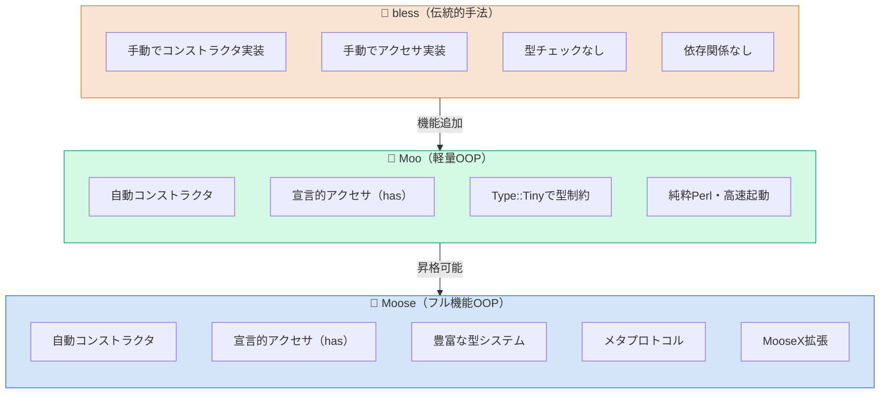
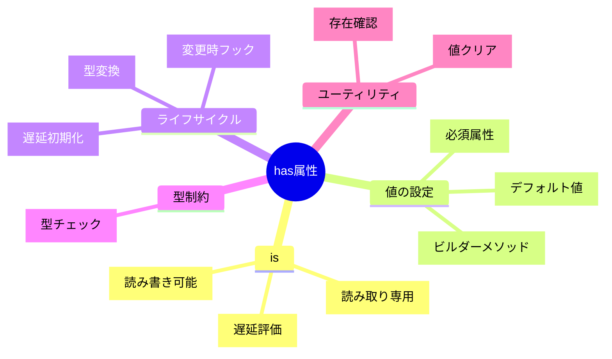
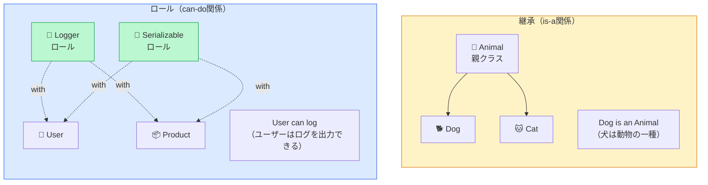
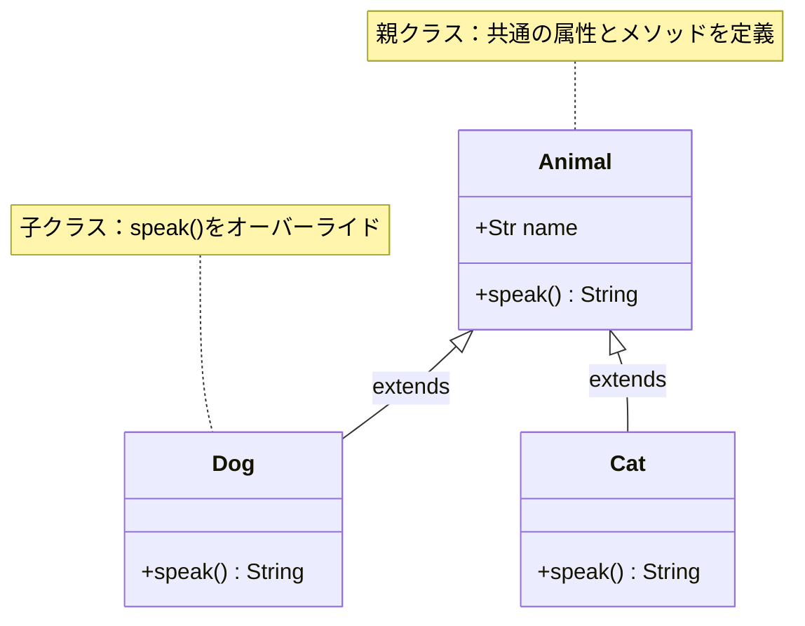
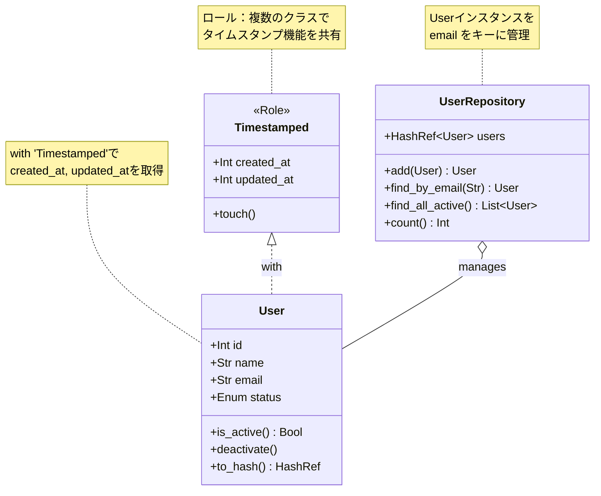

## はじめに - なぜMooを学ぶのか

Perlでオブジェクト指向プログラミング（OOP）を始めようとすると、まず`bless`を使った伝統的な手法に出会います。しかし、この方法にはいくつかの限界があり、現代のソフトウェア開発では物足りなさを感じることがあります。

この記事では、Mooという軽量で高速なオブジェクト指向システムを使って、モダンなPerlクラスを書く方法を学びます。

### blessの限界とモダンなOOPの必要性

`bless`を使った伝統的なPerl OOPには、以下のような問題点があります。

- コンストラクタやアクセサの手書きが必要
- 型チェックやバリデーションを手動で実装する必要がある
- 継承やコード再利用の仕組みが煩雑
- クラスの構造が把握しにくい

なお、Moo/Mooseの概要については、以下の記事でも解説しています。



たとえば、簡単なPersonクラスを`bless`で書くと、こうなります。

```perl
package Person;
use strict;
use warnings;

sub new {
    my ($class, %args) = @_;
    my $self = {
        name => $args{name} // die "name is required",
        age  => $args{age},
    };
    bless $self, $class;
    return $self;
}

sub name {
    my ($self, $value) = @_;
    if (defined $value) {
        $self->{name} = $value;
    }
    return $self->{name};
}

sub age {
    my ($self, $value) = @_;
    if (defined $value) {
        die "age must be positive" unless $value > 0;
        $self->{age} = $value;
    }
    return $self->{age};
}

1;
```

40行近いコードが必要で、ボイラープレートが大量に含まれています。

### Mooが解決すること

Mooを使えば、同じ機能をわずか15行程度で実現できます。

```perl
package Person;
use Moo;
use Types::Standard qw(Str Int);

has name => (
    is       => 'rw',
    isa      => Str,
    required => 1,
);

has age => (
    is  => 'rw',
    isa => Int,
);

1;
```

Mooは以下のメリットを提供します。

- 宣言的な構文でクラス構造が明確
- アクセサの自動生成
- 型制約を簡単に追加可能
- ロールによるコード再利用が可能
- Mooseへの移行が容易

### この記事で学べること

この記事を読み終えると、以下のことができるようになります。

- Mooを使った基本的なクラス定義
- has属性のオプション活用
- Moo::Roleによるコード再利用
- Type::Tinyによる型制約の追加
- extendsによる継承の実装

## Mooとは何か - 軽量で高速なオブジェクト指向システム

### Mooの特徴と位置づけ

Moo（Minimalist Object Orientation）は、Perlのモダンなオブジェクト指向システムです。2010年にMatt S Troutによって開発され、現在も活発にメンテナンスされています。

Mooの主な特徴は以下のとおりです。

- **純粋Perl実装**: XSに依存しないため、どの環境でもインストール可能
- **軽量・高速**: Mooseより起動が速く、メモリ使用量も少ない
- **Moose互換**: Mooseのほとんどの機能をサポートし、必要に応じてMooseに移行可能
- **宣言的構文**: `has`キーワードでクラス構造を明確に定義可能

### Moo vs Moose - どちらを選ぶべきか

MooとMooseは兄弟のような関係にあります。どちらを選ぶかは、プロジェクトの要件によります。

以下の図は、bless、Moo、Mooseの3つのOOPシステムを比較したものです。



| 項目 | Moo | Moose |
|------|-----|-------|
| 起動速度 | 非常に高速 | やや遅い |
| 依存関係 | 純粋Perl（XSなし） | XS依存あり |
| メタプロトコル | なし | あり（Class::MOP） |
| 型システム | 基本的（Type::Tiny） | 豊富で拡張可能 |
| ロール | Role::Tiny | 強力なネイティブロール |
| 用途 | CLI、スクリプト、中規模 | 大規模アプリ、フレームワーク |

**Mooを選ぶべきケース**:

- 高速な起動が必要（CLIツール、小規模スクリプト）
- 最小限の依存関係が求められる
- 中規模までのプロジェクト

**Mooseを選ぶべきケース**:

- 高度なメタプログラミングが必要
- MooseX拡張エコシステムを活用したい
- 大規模で複雑なアプリケーション

なお、MooからMooseへの「昇格」は簡単で、`use Moose`を追加するだけで自動的にMooseクラスに変換されます。

### 環境構築

Mooを使うには、CPANからモジュールをインストールします。

```bash
# cpanmを使う場合
cpanm Moo

# 型制約も使う場合
cpanm Moo Types::Standard
```

Perl 5.20以上が推奨されますが、5.8以上でも動作します。

## 最初のMooクラスを作る

### 基本的なクラス定義

Mooクラスの最小構成は非常にシンプルです。

```perl
package MyClass;
use Moo;

1;
```

`use Moo;`を書くだけで、自動的に以下の設定が適用されます。

- `use strict;`と`use warnings;`が有効化
- `new`メソッド（コンストラクタ）の自動生成
- `extends`、`has`、`with`などのキーワードが利用可能

### 実践：Personクラスを作る

実際にPersonクラスを作ってみましょう。

```perl
package Person;
use Moo;

has name => (is => 'rw');
has age  => (is => 'rw');

sub greet {
    my $self = shift;
    return "Hello, my name is " . $self->name . "!";
}

1;
```

使い方は以下のとおりです。

```perl
use Person;

my $person = Person->new(name => 'Alice', age => 30);
print $person->greet;   # Hello, my name is Alice!
print $person->age;     # 30

$person->age(31);       # 値を更新
print $person->age;     # 31
```

### blessとMooの比較

同じPersonクラスを`bless`とMooで比較してみましょう。

**bless版**（約40行）:

```perl
package Person;
use strict;
use warnings;

sub new {
    my ($class, %args) = @_;
    my $self = {
        name => $args{name},
        age  => $args{age},
    };
    bless $self, $class;
    return $self;
}

sub name {
    my ($self, $value) = @_;
    $self->{name} = $value if defined $value;
    return $self->{name};
}

sub age {
    my ($self, $value) = @_;
    $self->{age} = $value if defined $value;
    return $self->{age};
}

sub greet {
    my $self = shift;
    return "Hello, my name is " . $self->name . "!";
}

1;
```

**Moo版**（約15行）:

```perl
package Person;
use Moo;

has name => (is => 'rw');
has age  => (is => 'rw');

sub greet {
    my $self = shift;
    return "Hello, my name is " . $self->name . "!";
}

1;
```

Moo版はコード量が半分以下になり、クラスの構造が一目でわかります。

## has属性を理解する - Mooの心臓部

`has`はMooの中核となる機能で、クラスの属性を宣言的に定義します。

以下の図は、`has`で使用できる主要なオプションとその関係を示しています。



### アクセサタイプ（is）

`is`オプションでアクセサのタイプを指定します。

```perl
# 読み取り専用（コンストラクタでのみ設定可能）
has id => (is => 'ro');

# 読み書き可能
has name => (is => 'rw');

# 遅延評価（最初のアクセス時にdefaultが評価される）
has data => (is => 'lazy');
```

**使い分けの指針**:

- `ro`: 一度設定したら変更されない値に使用
- `rw`: 変更が必要な値に使用
- `lazy`: 初期化コストが高い値や、必ずしも使われない値に使用

### デフォルト値（default）

`default`で属性のデフォルト値を設定できます。

```perl
# スカラー値
has status => (
    is      => 'rw',
    default => 'active',
);

# コードリファレンス（動的な値）
has created_at => (
    is      => 'ro',
    default => sub { time },
);

# 配列やハッシュはコードリファレンスで包む
has items => (
    is      => 'ro',
    default => sub { [] },
);

has options => (
    is      => 'ro',
    default => sub { {} },
);
```

**重要**: 配列やハッシュのデフォルト値は必ずコードリファレンスで指定してください。そうしないと、すべてのインスタンスで同じリファレンスが共有されてしまいます。

### 必須属性（required）

`required => 1`を指定すると、コンストラクタで必ず値を渡す必要があります。

```perl
has email => (
    is       => 'ro',
    required => 1,
);

# これはエラーになる
my $user = User->new;  # "Missing required arguments: email"

# これはOK
my $user = User->new(email => 'user@example.com');
```

### 遅延評価（lazy）

`lazy => 1`を指定すると、属性の値は最初にアクセスされるまで計算されません。

```perl
has expensive_data => (
    is      => 'lazy',
    default => sub {
        my $self = shift;
        # 重い処理
        return $self->load_from_database;
    },
);
```

`is => 'lazy'`は`is => 'ro', lazy => 1`のショートカットです。

遅延評価が有効なケース:

- 初期化にコストがかかる属性
- 必ずしも使われるとは限らない属性
- 他の属性の値に依存する属性

### 変更時フック（trigger）

`trigger`を使うと、属性が設定されたときにコールバックを実行できます。

```perl
has size => (
    is      => 'rw',
    trigger => sub {
        my ($self, $new_value) = @_;
        print "Size changed to $new_value\n";
    },
);

has password => (
    is      => 'rw',
    trigger => sub {
        my ($self, $new_value) = @_;
        $self->_hash_password($new_value);
    },
);
```

`trigger`はロギング、バリデーション、関連状態の更新などに便利です。

### その他の便利なオプション

```perl
has cache => (
    is        => 'lazy',
    predicate => 'has_cache',   # has_cache() メソッドが生成される
    clearer   => 'clear_cache', # clear_cache() メソッドが生成される
);

# 使い方
if ($obj->has_cache) {
    return $obj->cache;
}
$obj->clear_cache;  # キャッシュをクリア
```

## Moo::Role - ロールでコードを再利用する

### ロールとは何か

ロール（Role）は、複数のクラスで共通する機能をまとめる仕組みです。多重継承の問題を避けながら、コードを再利用できます。

以下の図は、ロールと継承の違いを視覚的に説明しています。



ロールと継承の違い:

- **継承**: 「AはBの一種である」という関係（is-a）
- **ロール**: 「Aは〜できる」という能力の付与（can-do）

### ロールの定義と使用

ロールは`Moo::Role`で定義します。

```perl
package Serializable;
use Moo::Role;

requires 'to_hash';  # 消費クラスで実装が必要

sub to_json {
    my $self = shift;
    require JSON;
    return JSON::encode_json($self->to_hash);
}

1;
```

クラスでロールを使うには`with`を使います。

```perl
package User;
use Moo;
with 'Serializable';

has name  => (is => 'ro');
has email => (is => 'ro');

sub to_hash {
    my $self = shift;
    return {
        name  => $self->name,
        email => $self->email,
    };
}

1;
```

### 実践：Loggerロールを作る

実用的なLoggerロールを作ってみましょう。

```perl
package Logger;
use Moo::Role;

has log_prefix => (
    is      => 'ro',
    default => sub { '[LOG]' },
);

has log_level => (
    is      => 'rw',
    default => 'info',
);

sub log_info {
    my ($self, $msg) = @_;
    return if $self->log_level eq 'error';
    print $self->log_prefix . " [INFO] $msg\n";
}

sub log_error {
    my ($self, $msg) = @_;
    print $self->log_prefix . " [ERROR] $msg\n";
}

sub log_debug {
    my ($self, $msg) = @_;
    return unless $self->log_level eq 'debug';
    print $self->log_prefix . " [DEBUG] $msg\n";
}

1;
```

```perl
package MyApp::Service;
use Moo;
with 'Logger';

has name => (is => 'ro');

sub do_something {
    my $self = shift;
    $self->log_info("Starting " . $self->name);
    # 処理
    $self->log_info("Finished " . $self->name);
}

1;
```

### requires - 必須メソッドの指定

ロールは、消費するクラスに特定のメソッドの実装を要求できます。

```perl
package Printable;
use Moo::Role;

requires 'to_string';  # 消費クラスはto_stringを実装必須

sub print {
    my $self = shift;
    print $self->to_string . "\n";
}

1;
```

```perl
package Document;
use Moo;
with 'Printable';

has title   => (is => 'ro');
has content => (is => 'ro');

# requiresで要求されたメソッドを実装
sub to_string {
    my $self = shift;
    return $self->title . ": " . $self->content;
}

1;
```

`requires`で指定されたメソッドが実装されていないと、コンパイル時にエラーになります。

### 複数のロールを適用する

```perl
package MyApp::Entity;
use Moo;
with 'Serializable', 'Logger', 'Printable';

# ...
1;
```

ロール間でメソッド名が衝突した場合は、エラーになります。明示的に解決する必要があります。

## Type::Tinyで型制約を追加する

### なぜ型制約が必要か

型制約を使うと、以下のメリットがあります。

- 不正な値が設定されたときに早期にエラーを検出可能
- ドキュメントとして機能（どんな値が期待されているかわかる）
- バグの原因を特定しやすい

### Types::Standardの基本型

Types::Standardモジュールは、よく使う型制約を提供します。

```perl
use Types::Standard qw(
    Str Int Num Bool
    ArrayRef HashRef
    Maybe
    InstanceOf
    Enum
);
```

主な型は以下のとおりです。

| 型 | 説明 | 例 |
|----|------|-----|
| `Str` | 文字列 | `"hello"` |
| `Int` | 整数 | `42` |
| `Num` | 数値 | `3.14` |
| `Bool` | ブール値 | `0`, `1` |
| `ArrayRef` | 配列リファレンス | `[]` |
| `HashRef` | ハッシュリファレンス | `{}` |
| `Maybe[T]` | Tまたはundef | `Maybe[Str]` |
| `InstanceOf[C]` | クラスCのインスタンス | `InstanceOf['DateTime']` |
| `Enum[...]` | 列挙値 | `Enum['m', 'f']` |

### 型制約の使い方

```perl
package User;
use Moo;
use Types::Standard qw(Str Int Enum ArrayRef Maybe);

has name => (
    is       => 'ro',
    isa      => Str,
    required => 1,
);

has age => (
    is  => 'rw',
    isa => Int,
);

has gender => (
    is  => 'ro',
    isa => Enum['male', 'female', 'other'],
);

has email => (
    is  => 'ro',
    isa => Maybe[Str],  # 文字列またはundef
);

has tags => (
    is      => 'ro',
    isa     => ArrayRef[Str],  # 文字列の配列
    default => sub { [] },
);

1;
```

型制約に違反すると、例外が発生します。

```perl
my $user = User->new(
    name => 'Alice',
    age  => 'thirty',  # エラー! Intが期待されている
);
# => Value "thirty" did not pass type constraint "Int"
```

### カスタム型制約

`where`を使って型に条件を追加できます。

```perl
# 年齢を0〜150の範囲に制限する例
has age => (
    is  => 'rw',
    isa => Int->where(sub { $_ >= 0 && $_ <= 150 }),
);

# 簡易的なメールアドレス検証の例
has email => (
    is  => 'ro',
    isa => Str->where(sub { /^[^@]+@[^@]+\.[^@]+$/ }),
);
```

より複雑なカスタム型はType::Tinyで定義できます。

```perl
use Type::Tiny;

my $PositiveInt = Type::Tiny->new(
    name       => 'PositiveInt',
    parent     => Int,
    constraint => sub { $_ > 0 },
    message    => sub { "Must be a positive integer, got $_" },
);

has count => (
    is  => 'rw',
    isa => $PositiveInt,
);
```

## 継承（extends）

### extendsの基本

`extends`を使って親クラスを継承します。

以下の図は、Mooでのクラス継承関係を示すUMLクラス図風の図です。



```perl
package Animal;
use Moo;

has name => (is => 'ro');

sub speak {
    my $self = shift;
    return "...";
}

1;
```

```perl
package Dog;
use Moo;
extends 'Animal';

sub speak {
    my $self = shift;
    return "Woof!";
}

1;
```

```perl
my $dog = Dog->new(name => 'Pochi');
print $dog->name;   # Pochi
print $dog->speak;  # Woof!
```

### 実践：UserからEmployeeを継承

```perl
package User;
use Moo;
use Types::Standard qw(Str Int);

has name => (
    is       => 'ro',
    isa      => Str,
    required => 1,
);

has email => (
    is       => 'ro',
    isa      => Str,
    required => 1,
);

has age => (
    is  => 'rw',
    isa => Int,
);

sub greet {
    my $self = shift;
    return "Hello, I'm " . $self->name;
}

1;
```

```perl
package Employee;
use Moo;
use Types::Standard qw(Str Num);
extends 'User';

has employee_id => (
    is       => 'ro',
    isa      => Str,
    required => 1,
);

has department => (
    is  => 'rw',
    isa => Str,
);

has salary => (
    is  => 'rw',
    isa => Num,
);

# 親メソッドをオーバーライド
sub greet {
    my $self = shift;
    return $self->SUPER::greet . " from " . $self->department;
}

1;
```

```perl
my $emp = Employee->new(
    name        => 'Taro',
    email       => 'taro@example.com',
    employee_id => 'E001',
    department  => 'Engineering',
);

print $emp->greet;  # Hello, I'm Taro from Engineering
```

## 実践例 - シンプルなユーザー管理

### クラス設計

ユーザー管理システムを設計してみましょう。以下のクラスを作成します。

- `User`: ユーザーを表すクラス
- `UserRepository`: ユーザーの保存・検索を行うクラス
- `Timestamped`: タイムスタンプを提供するロール

以下の図は、これらのクラスとロールの関係を示しています。



### コード例

**Timestampedロール**:

```perl
package Timestamped;
use Moo::Role;
use Types::Standard qw(Int);

has created_at => (
    is      => 'ro',
    isa     => Int,
    default => sub { time },
);

has updated_at => (
    is  => 'rw',
    isa => Int,
);

sub touch {
    my $self = shift;
    $self->updated_at(time);
}

1;
```

**Userクラス**:

```perl
package User;
use Moo;
use Types::Standard qw(Str Int Enum);
with 'Timestamped';

has id => (
    is      => 'ro',
    isa     => Int,
    lazy    => 1,
    # デモ用の簡易ID生成（本番ではUUIDやシーケンスを使用すること）
    default => sub { int(rand(100000)) },
);

has name => (
    is       => 'ro',
    isa      => Str,
    required => 1,
);

has email => (
    is       => 'ro',
    isa      => Str,
    required => 1,
);

has status => (
    is      => 'rw',
    isa     => Enum['active', 'inactive', 'suspended'],
    default => 'active',
    trigger => sub {
        my ($self, $value) = @_;
        $self->touch;
    },
);

sub is_active {
    my $self = shift;
    return $self->status eq 'active';
}

sub deactivate {
    my $self = shift;
    $self->status('inactive');
}

sub to_hash {
    my $self = shift;
    return {
        id         => $self->id,
        name       => $self->name,
        email      => $self->email,
        status     => $self->status,
        created_at => $self->created_at,
        updated_at => $self->updated_at,
    };
}

1;
```

**UserRepositoryクラス**:

```perl
package UserRepository;
use Moo;
use Types::Standard qw(HashRef InstanceOf);

has users => (
    is      => 'ro',
    isa     => HashRef[InstanceOf['User']],
    default => sub { {} },
);

sub add {
    my ($self, $user) = @_;
    $self->users->{$user->email} = $user;
    return $user;
}

sub find_by_email {
    my ($self, $email) = @_;
    return $self->users->{$email};
}

sub find_all_active {
    my $self = shift;
    return grep { $_->is_active } values %{$self->users};
}

sub count {
    my $self = shift;
    return scalar keys %{$self->users};
}

1;
```

**使用例**:

```perl
use User;
use UserRepository;

my $repo = UserRepository->new;

# ユーザーを追加
my $alice = $repo->add(User->new(
    name  => 'Alice',
    email => 'alice@example.com',
));

my $bob = $repo->add(User->new(
    name  => 'Bob',
    email => 'bob@example.com',
));

print "Total users: " . $repo->count . "\n";  # 2

# ユーザーを検索
my $user = $repo->find_by_email('alice@example.com');
print $user->name . " is " . $user->status . "\n";  # Alice is active

# ステータスを変更
$user->deactivate;
print $user->status . "\n";  # inactive

# アクティブなユーザーのみ取得
my @active = $repo->find_all_active;
print "Active users: " . scalar(@active) . "\n";  # 1
```

## よくある問題と解決策

### デフォルト値が共有される問題

**問題**: 配列やハッシュのデフォルト値が全インスタンスで共有される。

```perl
# 間違った書き方
has items => (
    is      => 'ro',
    default => [],  # 全インスタンスで同じ配列を共有してしまう！
);
```

**解決策**: コードリファレンスで包む。

```perl
# 正しい書き方
has items => (
    is      => 'ro',
    default => sub { [] },  # 毎回新しい配列を作成
);
```

### 循環参照の問題

**問題**: 親子関係で循環参照が発生してメモリリークする。

```perl
package Parent;
use Moo;
has children => (is => 'ro', default => sub { [] });

package Child;
use Moo;
has parent => (is => 'ro');  # 親への参照
```

**解決策**: 弱参照を使う。

```perl
package Child;
use Moo;
use Scalar::Util qw(weaken);

has parent => (
    is      => 'ro',
    trigger => sub {
        my ($self, $value) = @_;
        weaken($self->{parent});
    },
);
```

または`weak_ref`オプションを使う（MooXで提供される場合）。

### デバッグのコツ

**1. 型制約エラーの読み方**

```
Value "abc" did not pass type constraint "Int" (in $args->{"age"})
```

このエラーは、`age`属性に文字列`"abc"`が渡されたが、`Int`型が期待されていることを示しています。

**2. ロールの競合**

```
Due to a method name conflict in roles 'RoleA' and 'RoleB', 
the method 'foo' must be implemented by 'MyClass'
```

両方のロールが`foo`メソッドを持っている場合、クラス側で明示的に実装する必要があります。

**3. Data::Dumperで内部構造を確認**

```perl
use Data::Dumper;
print Dumper($object);
```

## まとめと次のステップ

### 学んだことの振り返り

この記事では、以下のことを学びました。

- **Mooの基本**: `use Moo`でモダンなOOPが始まる
- **has属性**: `is`, `default`, `required`, `lazy`, `trigger`などのオプション
- **Moo::Role**: ロールによるコード再利用と`requires`
- **Type::Tiny**: 型制約による安全性の向上
- **extends**: 継承の実装方法
- **実践例**: ユーザー管理システムの設計

### 次に学ぶべきこと

Mooをマスターしたら、以下のトピックにも挑戦してみてください。

- **MooX::*モジュール**: Mooの機能を拡張するモジュール群
- **Moose**: より高度なメタプログラミング機能
- **DBIx::Class**: MooベースのORMフレームワーク
- **Mojo::Base**: Mojoliciousフレームワークでのオブジェクト指向

### 参考リンク









### 参考書籍



Mooを使えば、Perlでも美しく保守性の高いオブジェクト指向コードが書けます。ぜひ実際のプロジェクトで試してみてください。
