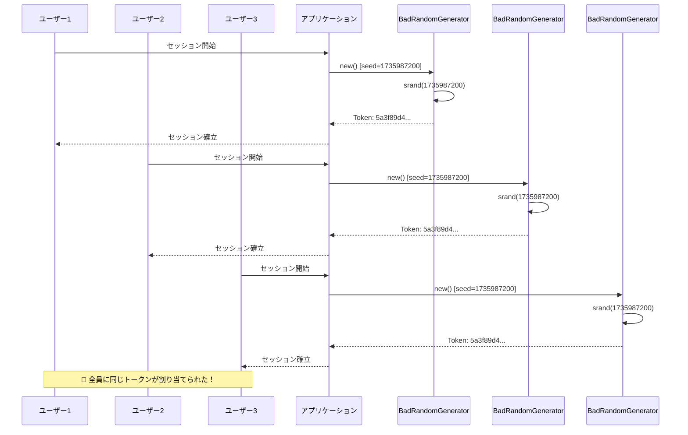
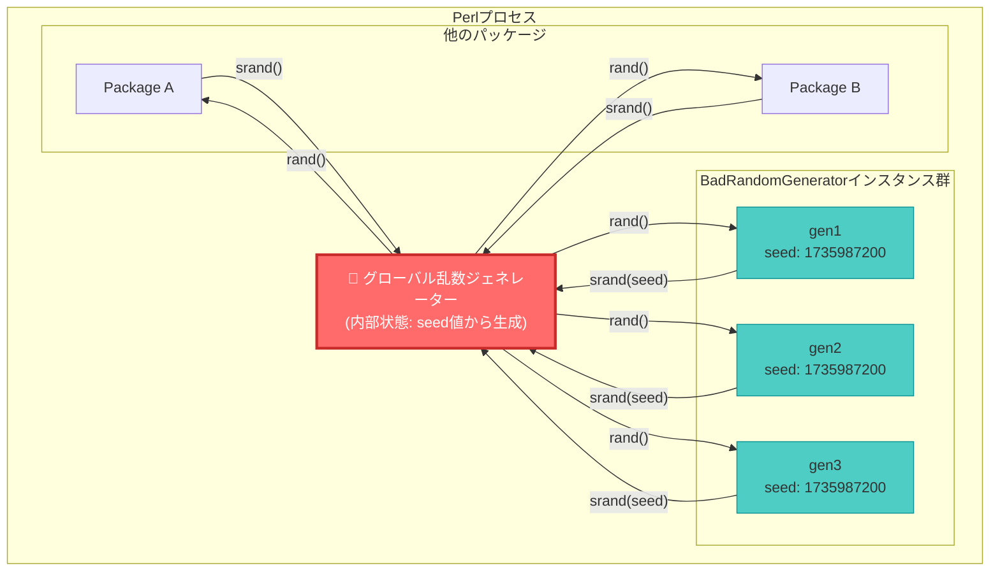
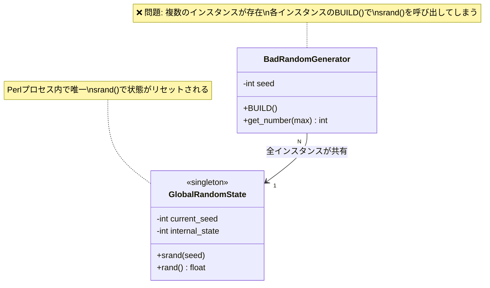

## はじめに：セッショントークン生成での不思議なバグ

ある日、Webアプリケーションを開発していたときのことです。ユーザーごとにユニークなセッショントークンを生成する機能を実装し、動作確認をしていたところ、不思議な現象に遭遇しました。

**複数のユーザーに同じセッショントークンが割り当てられていたのです。**

セッショントークンはランダムに生成しているはずなのに、なぜ同じ値になってしまうのか。この問題は単なるバグではなく、セキュリティ上の重大なリスクです。もし本番環境で発生したら、別のユーザーのセッションが乗っ取られる可能性があります。

この記事では、私が実際に遭遇したこのバグを題材に、Perlの乱数生成の仕組みと、なぜSingletonパターンが必要なのかを学んでいきます。問題の発見から原因の特定、そして次回の解決までのデバッグの旅を一緒に体験しましょう。

なお、この記事ではMooを使ったオブジェクト指向プログラミングの基礎知識を前提としています。Mooに慣れていない方は、先にを読むことをお勧めします。

## 素朴な乱数ジェネレーターの実装

まずは、問題が起きる前の実装を見てみましょう。セッショントークン生成のために、シンプルな乱数ジェネレーターをMooで作成しました。

### クラス設計の意図

このクラスは以下の方針で設計しました：

- `seed`属性でシード値を管理する
- `BUILD`メソッドで`srand()`を呼び出し、乱数ジェネレーターを初期化する
- `get_number`メソッドで指定範囲の乱数を生成する

一見、何の問題もなさそうな設計です。各インスタンスが独自のシード値を持ち、独立した乱数を生成できると考えました。

### コード例1：BadRandomGeneratorクラス

```perl
# Perl 5.26以降、Moo 2.0+
package BadRandomGenerator {
    use Moo;
    use feature 'say';
    
    # シード値を属性として保持
    has seed => (
        is      => 'ro',
        default => sub { time() },  # 現在時刻をシードにする
    );
    
    # インスタンス生成時に乱数ジェネレーターを初期化
    sub BUILD {
        my $self = shift;
        srand($self->seed);  # ここがあとで問題になる
    }
    
    # 指定範囲の乱数を生成
    sub get_number {
        my ($self, $max) = @_;
        $max //= 100;  # デフォルトは0-99
        return int(rand($max));
    }
}

1;
```

このコードは非常にシンプルで理解しやすく、実際に単体で動かすと問題なく動作します。`time()`関数は現在時刻を秒単位で返すため、実行するたびに異なるシード値が得られる……はずでした。

### 一見問題なく動く実装

試しに使ってみましょう：

```perl
use BadRandomGenerator;

my $gen = BadRandomGenerator->new;
say "乱数1: " . $gen->get_number(100);
say "乱数2: " . $gen->get_number(100);
say "乱数3: " . $gen->get_number(100);
```

実行結果（例）：

```
乱数1: 42
乱数2: 67
乱数3: 89
```

ちゃんと異なる値が出ています。素晴らしい！……と、この時点では思っていました。

## バグの発生：同じトークンが生成される

さて、このクラスを使ってセッショントークン生成関数を実装しました。

### セッショントークン生成関数

セッショントークンは16バイトのランダムな値を16進数文字列にしたものです：

```perl
sub generate_session_token {
    my $gen = BadRandomGenerator->new;  # 毎回新しいインスタンスを作成
    my $token = '';
    
    # 16バイト分の乱数を生成
    for (1..16) {
        $token .= sprintf '%02x', $gen->get_number(256);
    }
    
    return $token;
}
```

この関数を呼ぶたびに新しい`BadRandomGenerator`インスタンスを作成し、16個の乱数（0-255の範囲）を生成して16進数文字列に変換しています。各呼び出しで新しいインスタンスを作れば、異なる乱数列が得られる……はずでした。

### コード例2：問題の再現コード

実際にセッショントークンを複数生成してみます：

```perl
#!/usr/bin/env perl
use strict;
use warnings;
use feature 'say';

# 短時間に複数のセッショントークンを生成
my $token1 = generate_session_token();
my $token2 = generate_session_token();
my $token3 = generate_session_token();

say "Token 1: $token1";
say "Token 2: $token2";
say "Token 3: $token3";

# トークンの一致をチェック
if ($token1 eq $token2) {
    say "\n警告: Token 1とToken 2が一致しています！";
}
if ($token2 eq $token3) {
    say "警告: Token 2とToken 3が一致しています！";
}
```

### 実行結果の衝撃

実行してみると……：

```
Token 1: 5a3f89d4c1b7e2068a4d9f1c3e5b8207
Token 2: 5a3f89d4c1b7e2068a4d9f1c3e5b8207
Token 3: 5a3f89d4c1b7e2068a4d9f1c3e5b8207

警告: Token 1とToken 2が一致しています！
警告: Token 2とToken 3が一致しています！
```

**完全に同じトークンが生成されてしまいました！**

これは大問題です。セッショントークンは各ユーザーを識別するための重要な値なのに、複数のユーザーに同じトークンが割り当てられたら、セッションハイジャックのリスクが発生します。



*図1: 問題の発生シーケンス - 短時間に複数のインスタンスを生成すると、全て同じシード値で初期化され、同一のトークンが生成される*

でも、なぜこんなことが起きるのでしょうか？コードには一見、何の問題もないように見えます。

## 原因の調査：デバッグの旅

この不思議な現象を解明するため、デバッグを開始しました。

### 仮説1：rand()の問題か？

最初に考えたのは「もしかして`rand()`関数自体がおかしいのか？」ということです。

Perlの公式ドキュメント（`perldoc -f rand`）を確認すると、`rand()`は疑似乱数を生成する関数で、十分にランダムな分布を持つことが保証されています。実際、でも検証されているように、Perlの乱数の品質自体に問題はありません。

**仮説1は却下**です。`rand()`関数は正常に動作しています。

### 仮説2：seedの問題か？

次に考えたのは「シード値が同じになっているのでは？」という仮説です。

試しにシード値を出力してみます：

```perl
sub generate_session_token_debug {
    my $gen = BadRandomGenerator->new;
    say "Debug: seed = " . $gen->seed;
    
    my $token = '';
    for (1..16) {
        $token .= sprintf '%02x', $gen->get_number(256);
    }
    return $token;
}
```

実行結果：

```
Debug: seed = 1735987200
Token 1: 5a3f89d4c1b7e2068a4d9f1c3e5b8207
Debug: seed = 1735987200
Token 2: 5a3f89d4c1b7e2068a4d9f1c3e5b8207
Debug: seed = 1735987200
Token 3: 5a3f89d4c1b7e2068a4d9f1c3e5b8207
```

ビンゴ！**全て同じシード値になっています！**

これは`time()`が秒単位でしか値が変わらないためです。短時間に複数回呼び出すと、同じ秒内であれば同じ値が返ってきます。つまり、1秒以内に複数のインスタンスを生成すると、全て同じシード値で初期化されてしまうのです。

```mermaid
gantt
    title time()関数の精度とインスタンス生成のタイミング
    dateFormat X
    axisFormat %L ms
    
    section 時刻
    1735987200秒      :milestone, t1, 0, 0
    1735987201秒      :milestone, t2, 1000, 0
    
    section インスタンス生成
    gen1 = new()     :active, g1, 0, 10
    gen2 = new()     :active, g2, 50, 10
    gen3 = new()     :active, g3, 100, 10
    
    section seed値
    time()=1735987200 :crit, s1, 0, 999
    time()=1735987201 :crit, s2, 1000, 1000
```



*図2: time()の精度の限界 - 1秒以内に生成された全てのインスタンスは同じシード値を受け取る*

### 仮説3：srand()の真実

しかし、ここで疑問が湧きます。「同じシード値でも、別々のインスタンスなら別々の乱数列が生成されるのでは？」

各インスタンスが独立した乱数ジェネレーターを持っていれば、シード値が同じでも問題ないはずです。しかし、実際には同じ乱数列が生成されています。

ここで`srand()`のドキュメント（`perldoc -f srand`）を詳しく読んでみると、重要な記述を発見しました：

> srand EXPR sets the random number seed for the rand operator.

「**rand演算子のための**乱数シード」と書かれています。「各インスタンスのための」ではなく、「rand演算子のための」です。

つまり、**`srand()`はグローバルな状態を設定する関数**なのです。

## Perlのrand()/srand()のグローバル状態

ここで、Perlの乱数生成の仕組みをしっかり理解しましょう。

### Perlの乱数の仕組み

Perlの乱数生成は以下のように動作します：

1. **Perlプロセスは1つの疑似乱数ジェネレーターを持つ**（グローバル状態）
2. `srand()`はこのグローバルな乱数ジェネレーターのシード値を設定する
3. `rand()`はこのグローバルな乱数ジェネレーターから次の値を取得する
4. どのパッケージから呼び出しても、**同じ内部状態を共有する**



*図3: Perlのグローバル乱数状態 - 全てのインスタンスとパッケージが同じ乱数ジェネレーターを共有*

実験で確認してみましょう：

```perl
#!/usr/bin/env perl
use strict;
use warnings;
use feature 'say';

# 同じシードで初期化
srand(42);
say "1回目: " . int(rand(100));

# もう一度同じシードで初期化
srand(42);
say "2回目: " . int(rand(100));  # 1回目と同じ値が出る
```

実行結果：

```
1回目: 84
2回目: 84
```

**同じ値が出ました！**

これは`srand(42)`を呼ぶたびに乱数ジェネレーターの内部状態が同じ状態にリセットされるためです。

### srand()はプロセス全体で共有される

さらに重要なのは、`srand()`の影響がプロセス全体に及ぶということです：

```perl
package A {
    sub get_rand {
        srand(123);
        return int(rand(100));
    }
}

package B {
    sub get_rand {
        srand(123);
        return int(rand(100));
    }
}

package main;
use feature 'say';

say "A: " . A::get_rand();  # 例: 57
say "B: " . B::get_rand();  # 例: 57（同じ！）
```

異なるパッケージから呼び出しても、**グローバルな乱数ジェネレーターは共有されています**。

### 複数インスタンス化の落とし穴

ここで私たちの`BadRandomGenerator`に話を戻しましょう。

```perl
my $gen1 = BadRandomGenerator->new;  # srand(time())が呼ばれる
my $gen2 = BadRandomGenerator->new;  # 同じ秒内なら、srand(同じtime())が呼ばれる
```

このコードでは：

1. `$gen1`の生成時に`srand(time())`が呼ばれ、グローバルな乱数ジェネレーターが初期化される
2. `$gen2`の生成時に**再び**`srand(time())`が呼ばれ、グローバルな乱数ジェネレーターが**同じ値で再初期化される**
3. 両方のインスタンスが同じグローバル状態から乱数を取得するため、**同じ乱数列**が生成される

```mermaid
sequenceDiagram
    participant Code as コード
    participant Gen1 as gen1インスタンス
    participant Gen2 as gen2インスタンス
    participant RNG as グローバル乱数ジェネレーター
    
    Code->>Gen1: new() 呼び出し
    activate Gen1
    Gen1->>Gen1: BUILD実行
    Gen1->>RNG: srand(1735987200)
    Note over RNG: 状態リセット<br/>seed=1735987200
    Gen1->>RNG: rand(256)
    RNG-->>Gen1: 90
    deactivate Gen1
    
    Code->>Gen2: new() 呼び出し
    activate Gen2
    Gen2->>Gen2: BUILD実行
    Gen2->>RNG: srand(1735987200)
    Note over RNG: 状態リセット<br/>seed=1735987200<br/>🚨 同じ値で再初期化！
    Gen2->>RNG: rand(256)
    RNG-->>Gen2: 90
    Note over Gen1,Gen2: 同じ乱数が生成される！
    deactivate Gen2
    
    style RNG fill:#ff6b6b,stroke:#c92a2a,stroke-width:3px
```

*図4: 複数インスタンス化による状態リセット問題 - 各インスタンスのBUILDでsrand()が呼ばれ、グローバル状態が同じ値で再初期化される*

各インスタンスは独立していると思っていましたが、実際には**全てのインスタンスが同じグローバルな乱数ジェネレーターを共有していた**のです。

この問題は、Perlの乱数生成が持つ根本的な特性に起因しています。実は、この特性についてはでも言及されており、Perlの乱数を扱う上で知っておくべき重要なポイントなのです。

## 問題の本質：なぜ複数インスタンスがダメなのか

ここまでの調査で、問題の本質が見えてきました。

### 同じseed値による同じ乱数列

疑似乱数ジェネレーターは決定論的なアルゴリズムです。同じシード値で初期化すれば、必ず同じ乱数列が生成されます。これは仕様であり、バグではありません。

むしろ、この性質は再現可能なテストを書く際には有用です。しかし、セキュリティが重要な用途では致命的な弱点になります。

### time()の精度の限界

`time()`関数は秒単位でしか値が変わりません。1秒間に数百、数千のリクエストを処理する現代のWebアプリケーションでは、同じ秒内に多数のセッショントークンを生成することは十分にあり得ます。

つまり、**短時間に複数のインスタンスを生成すると、高確率で同じシード値になる**のです。

### セキュリティリスク

同じセッショントークンが複数のユーザーに割り当てられると：

- ユーザーAのセッションにユーザーBがアクセスできる
- セッションハイジャック攻撃のリスク
- 個人情報の漏洩

これは看過できない重大なセキュリティ問題です。

### 根本原因：複数インスタンスの存在

問題の根本原因は明確です：

**複数の`BadRandomGenerator`インスタンスが存在し、それぞれが`srand()`を呼んでグローバルな乱数ジェネレーターを同じ値で再初期化してしまう**



*図5: 問題の構造 - N個のBadRandomGeneratorインスタンスが1つのグローバル状態を共有し、それぞれがsrand()を呼んで状態を上書きする*

もし、乱数ジェネレーターのインスタンスが**ただ1つだけ**存在し、`srand()`が**一度だけ**呼ばれるようにできれば、この問題は解決します。

では、どうすれば「1つのインスタンスだけ」を保証できるのでしょうか？

## まとめ：次回への橋渡し

この記事では、セッショントークン生成で同じ値が繰り返し出る不思議なバグに遭遇し、その原因を徹底的に調査しました。

**発見したこと**：

- Perlの`rand()`と`srand()`はグローバルな状態を共有する
- 複数のインスタンスがそれぞれ`srand()`を呼ぶと、乱数ジェネレーターが何度も再初期化される
- 同じシード値（`time()`）で初期化されると、同じ乱数列が生成される
- セキュリティ上、これは重大な問題である

**必要なこと**：

- 乱数ジェネレーターのインスタンスは**1つだけ**あればいい
- むしろ、**1つだけであるべき**である
- しかし、どうやって「1つだけ」を保証するのか？

この「1つのインスタンスだけを保証する」という問題を解決するデザインパターンが存在します。それが**Singletonパターン**です。

## 次回予告

次回は、今回明らかになった問題を**Singletonパターン**で解決します。

**第2回で学ぶこと**：

- Singletonパターンとは何か
- Mooを使ったSingletonパターンの実装
- クラス変数`$_instance`による唯一のインスタンス管理
- `instance()`メソッドでのインスタンス取得
- 改善されたシード生成方法
- セッショントークン問題の完全解決

Singletonパターンを理解すれば、今回のような「グローバルなリソースを管理する」場面で適切な設計ができるようになります。乱数ジェネレーター以外にも、ログマネージャー、設定管理、データベース接続プールなど、様々な場面で活用できる重要なパターンです。

次回もお楽しみに！🐪✨

---

**関連記事**：

- 
- 
