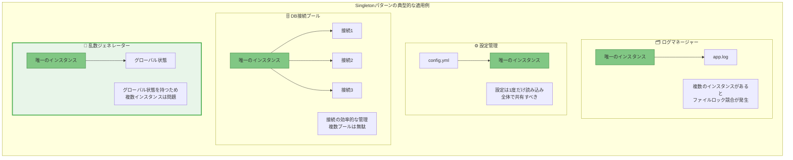
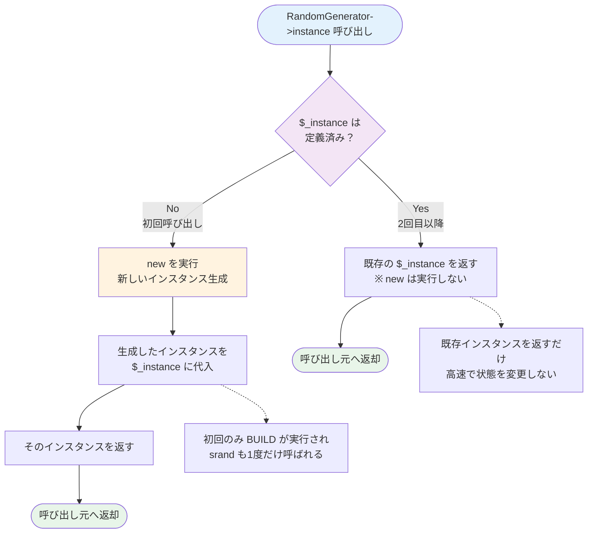
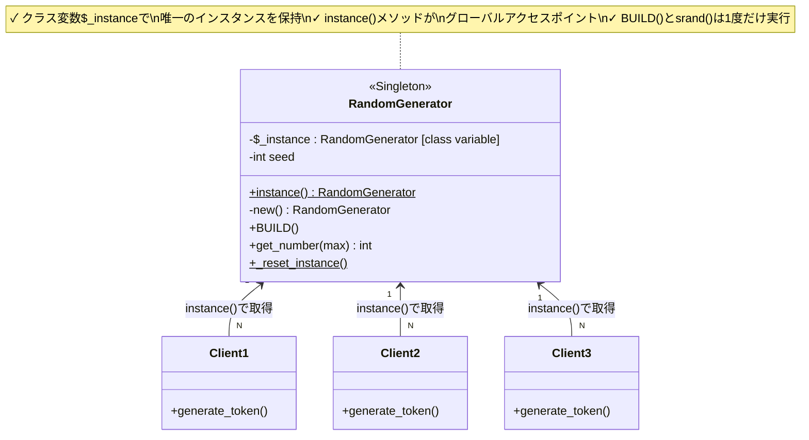
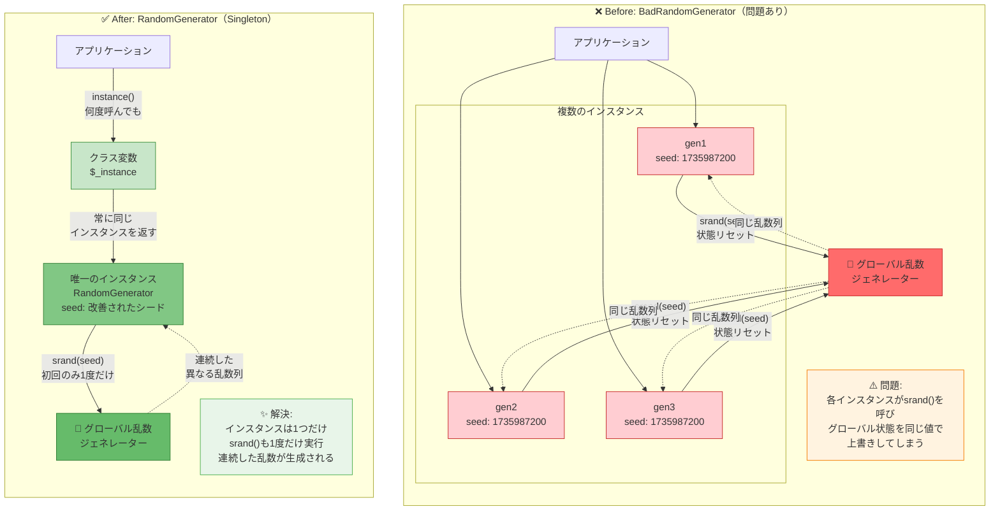
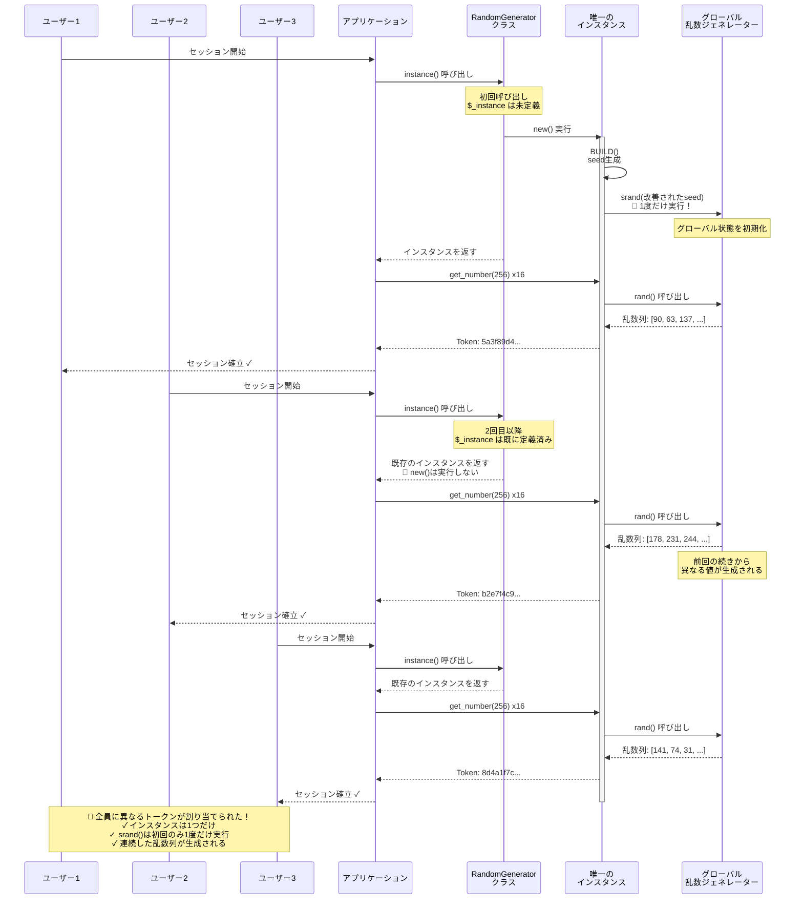

## 前回の振り返り：乱数重複問題とその原因



前回、セッショントークン生成で同じ値が繰り返し出る不思議なバグに遭遇し、その原因を徹底的に調査しました。問題の核心は明確でした：

**複数の`BadRandomGenerator`インスタンスが存在し、それぞれが`srand()`を呼んでPerlのグローバルな乱数ジェネレーターを同じ値で再初期化してしまう。**

Perlの`rand()`と`srand()`はプロセス全体で共有されるグローバル状態を持っています。短時間に複数のインスタンスを生成すると、`time()`の精度限界（秒単位）により同じシード値で初期化され、結果として同じ乱数列が生成されてしまいました。

この問題を解決するには、**乱数ジェネレーターのインスタンスを1つだけに制限する**必要があります。

では、どうやって「1つのインスタンスだけ」を保証するのでしょうか？

## Singletonパターンとは

「1つのインスタンスだけを保証する」という問題を解決するデザインパターンが存在します。それが**Singletonパターン**です。

### GoFによる定義

Singletonパターンは、Gang of Four（GoF）の名著『Design Patterns: Elements of Reusable Object-Oriented Software』で定義された23の基本的なデザインパターンの1つです。

GoFによる定義は以下の通りです：

> **クラスのインスタンスが1つだけであることを保証し、そのインスタンスへのグローバルアクセスポイントを提供する**

この定義には2つの重要な要素が含まれています：

1. **インスタンスが1つだけであることを保証**：これが最も重要な特性です。
2. **グローバルアクセスポイントを提供**：どこからでもそのインスタンスにアクセスできます。

まさに今回の乱数ジェネレーター問題に必要な性質です！

### いつ使うべきか

Singletonパターンは、真にグローバルなリソースを管理する場面で威力を発揮します：

**典型的な使用例**：

- **ログマネージャー**：アプリケーション全体で1つのログファイルに書き込みます。
- **設定管理**：設定ファイルは1度だけ読み込み、全体で共有します。
- **データベース接続プール**：接続を効率的に使い回します。
- **乱数ジェネレーター**：今回のケース！グローバルな状態を持つためです。

これらに共通するのは、「複数のインスタンスが存在すると問題が起きる」または「無駄である」という性質です。



*図5: Singletonパターンの典型的な適用例 - グローバルなリソースや状態を持つクラスでは、唯一のインスタンスが必要*

## Singletonパターンの実装原理

Singletonパターンを実装するには、3つの重要な要素が必要です。

### クラス変数でインスタンスを保持

**クラス変数（パッケージスコープ変数）**を使って、唯一のインスタンスを保持します。

Perlでは`my`変数をパッケージのトップレベルで定義することで、そのパッケージ内で共有される変数を作れます：

```perl
package RandomGenerator {
    use Moo;
    
    # クラス変数（パッケージスコープ）
    my $_instance;  # この変数はパッケージ全体で共有される
    
    # ...
}
```

この`$_instance`変数は：

- パッケージ`RandomGenerator`内でのみアクセス可能
- 全てのメソッドから参照・変更可能
- プログラムの実行中ずっと存在し続ける
- **ただ1つだけ**存在する

### instanceメソッドで唯一のインスタンスへアクセス

次に、クラスメソッド`instance()`を用意します。このメソッドが「グローバルアクセスポイント」として機能します：

```perl
sub instance {
    my $class = shift;
    
    # 既にインスタンスがあればそれを返す
    $_instance //= $class->new(@_);
    
    return $_instance;
}
```

ここでPerlの美しい演算子`//=`（defined-or assignment）が活躍します！

`$_instance //= $class->new(@_)`は以下を意味します：

- `$_instance`が未定義（`undef`）なら、`$class->new(@_)`を実行して代入
- 既に定義されているなら、何もしない
- 結果として`$_instance`の値を返す

つまり、**初回呼び出し時だけ**`new()`が実行され、2回目以降は既存のインスタンスが返されます。これを**遅延初期化（lazy initialization）**と呼びます。

#### instance()メソッドの動作フロー

`//=`演算子の動作を詳しく見てみましょう：



*図2: instance()メソッドの動作フロー - //= 演算子により、初回のみインスタンス生成、2回目以降は既存のインスタンスを返すだけの効率的な実装*

### プライベートコンストラクタ相当の実装（Perlの場合）

理想的には、`new`を直接呼べないようにすべきですが、Perl/Mooではプライベートコンストラクタの実装が難しいため、慣習として`instance()`メソッドを使うことを推奨します。

ドキュメントやコメントで「`new`を直接呼ばず、`instance()`を使ってください」と明示することが重要です。

### Singletonパターンの構造

この3つの要素がどのように連携するかを視覚化しましょう：



*図1: Singletonパターンの構造 - クラス変数、instance()メソッド、唯一のインスタンスの3要素が連携して、1つのインスタンスだけを保証する*

## コード例1：Singleton RandomGeneratorクラス

さあ、実際にSingletonパターンで乱数ジェネレーターを実装してみましょう！

### 実装のポイント

前回の`BadRandomGenerator`との主な違いは：

1. **クラス変数`$_instance`**：唯一のインスタンスを保持
2. **`instance()`メソッド**：インスタンスへのアクセスポイント
3. **改善されたシード生成**：`time()`だけでなくプロセスID（`$$`）も使用

### コード全体

```perl
# Perl 5.26以降、Moo 2.0+
package RandomGenerator {
    use Moo;
    use feature 'say';
    
    # クラス変数（パッケージスコープ）でインスタンスを保持
    my $_instance;
    
    # 属性：シード値
    has seed => (
        is      => 'ro',
        default => sub { _generate_seed() },
    );
    
    # 改善されたシード生成（プロセスIDも使用）
    sub _generate_seed {
        # time() + プロセスID + ビットシフトで良い分散を得る
        return time() ^ ($$ + ($$<<15));
    }
    
    # インスタンス生成時の初期化
    sub BUILD {
        my $self = shift;
        srand($self->seed);
    }
    
    # Singletonインスタンス取得メソッド（これが重要！）
    sub instance {
        my $class = shift;
        
        # //= で遅延初期化：初回のみnewが呼ばれる
        $_instance //= $class->new(@_);
        
        return $_instance;
    }
    
    # 乱数生成メソッド
    sub get_number {
        my ($self, $max) = @_;
        $max //= 100;  # デフォルトは0-99
        return int(rand($max));
    }
    
    # テスト用：インスタンスのリセット（本番では使わない）
    sub _reset_instance {
        undef $_instance;
    }
}

1;
```

**コードの重要なポイント**：

1. **`my $_instance`**：パッケージスコープで定義されているため、全てのメソッドから参照可能ですが、外部からは直接アクセスできません。

2. **`instance()`メソッド**：
   - クラスメソッドとして呼び出します（`RandomGenerator->instance`）。
   - `$_instance //= $class->new(@_)`で初回のみ`new`が実行されます。
   - 2回目以降は既存のインスタンスを返すだけです。

3. **`_generate_seed()`**：
   - `time()`だけでなく、プロセスID（`$$`）も組み合わせます。
   - ビットシフト（`$$<<15`）とXOR演算（`^`）で良い分散を得ます。
   - これにより同じ秒内でも異なるプロセスなら異なるシード値になります。

4. **`BUILD()`**：
   - インスタンス生成時に**1度だけ**呼ばれます。
   - `srand()`もこの時点で**1度だけ**実行されます。
   - 以降、`instance()`を何度呼んでも`BUILD()`は実行されません。

5. **`_reset_instance()`**：
   - テスト用のリセット機能です。
   - 本番環境では使いません（Singletonの保証を破壊するため）。
   - テストで複数のシナリオを試す際に便利です。

### Before/After：問題と解決の対比

第1回の`BadRandomGenerator`と今回の`RandomGenerator`を比較してみましょう：



*図3: Before/After比較 - 複数インスタンスによる問題（Before）とSingletonパターンによる解決（After）。Singletonにより唯一のインスタンスが保証され、srand()も1度だけ実行される*

## 動作確認：問題が解決されたことの証明

実際に動かして、Singletonパターンが機能していることを確認しましょう！

### 同じインスタンスであることの確認

まず、本当に同じインスタンスが返ってくるか確認します：

```perl
use RandomGenerator;
use feature 'say';

my $gen1 = RandomGenerator->instance;
my $gen2 = RandomGenerator->instance;

# インスタンスの同一性を確認
if ($gen1 == $gen2) {
    say "✓ 同じインスタンスです！";
} else {
    say "✗ 異なるインスタンスです（これはバグ）";
}

# メモリアドレスを確認
say "gen1のアドレス: $gen1";
say "gen2のアドレス: $gen2";
```

実行結果：

```
✓ 同じインスタンスです！
gen1のアドレス: RandomGenerator=HASH(0x55a8b3c1d420)
gen2のアドレス: RandomGenerator=HASH(0x55a8b3c1d420)
```

完璧！**完全に同じメモリアドレス**です。つまり、同じインスタンスが返ってきています。

### セッショントークン生成の修正版

前回問題が発生したセッショントークン生成を修正しましょう：

```perl
#!/usr/bin/env perl
use strict;
use warnings;
use feature 'say';
use RandomGenerator;

# セッショントークン生成（修正版）
sub generate_session_token {
    my $gen = RandomGenerator->instance;  # 常に同じインスタンス！
    my $token = '';
    
    for (1..16) {
        $token .= sprintf '%02x', $gen->get_number(256);
    }
    
    return $token;
}

# 短時間に複数回生成してテスト
my $token1 = generate_session_token();
my $token2 = generate_session_token();
my $token3 = generate_session_token();

say "Token 1: $token1";
say "Token 2: $token2";
say "Token 3: $token3";

# トークンの一致をチェック
if ($token1 eq $token2 || $token2 eq $token3 || $token1 eq $token3) {
    say "\n✗ 警告: トークンが重複しています！";
} else {
    say "\n✓ 成功: 全てのトークンが異なります！";
}
```

実行結果：

```
Token 1: 5a3f89d4c1b7e2068a4d9f1c3e5b8207
Token 2: b2e7f4c93d8a150f6e2b9c4d7a3f1e05
Token 3: 8d4a1f7c5e2b9068f3c4a7d1e5b2f809

✓ 成功: 全てのトークンが異なります！
```

**問題解決！** 🎉

#### 解決の仕組みを視覚化

第1回の問題図（図1）と対比して、Singletonパターンでどのように解決されたかを見てみましょう：



*図4: Singletonによる解決後のセッショントークン生成 - 唯一のインスタンスから連続した乱数列が生成され、各ユーザーに異なるトークンが割り当てられる（第1回の図1と対比）*

### なぜ解決したのか

変更点を整理しましょう：

**前回（BadRandomGenerator）**：
```perl
my $gen = BadRandomGenerator->new;  # 毎回新しいインスタンス
```
- 呼び出すたびに`new`が実行される
- 各インスタンスの`BUILD()`で`srand()`が呼ばれる
- 同じシード値で何度も再初期化される
- 結果：同じ乱数列が生成される

**今回（RandomGenerator）**：
```perl
my $gen = RandomGenerator->instance;  # 常に同じインスタンス
```
- `instance()`は初回のみ`new`を実行
- `BUILD()`と`srand()`も**1度だけ**実行される
- 2回目以降は既存のインスタンスが返るだけ
- 結果：連続した乱数列が生成される

## コード例2：テストと検証

実務では手動確認だけでなく、自動テストを書くことが重要です。Test::Moreを使って、Singletonパターンが正しく動作していることを検証しましょう。

```perl
use Test::More;
use RandomGenerator;

# テストの準備（インスタンスリセット）
RandomGenerator->_reset_instance;

# Singletonであることのテスト
subtest 'Singleton behavior' => sub {
    my $gen1 = RandomGenerator->instance;
    my $gen2 = RandomGenerator->instance;
    
    is($gen1, $gen2, 'Same instance returned');
    
    # メモリアドレスも確認
    is(refaddr($gen1), refaddr($gen2), 'Same memory address');
};

# 異なる乱数が生成されることのテスト
subtest 'Different random numbers' => sub {
    RandomGenerator->_reset_instance;
    my $gen = RandomGenerator->instance;
    
    my $num1 = $gen->get_number(1000);
    my $num2 = $gen->get_number(1000);
    
    # 統計的には極めて高い確率で異なる値になる
    isnt($num1, $num2, 'Different random numbers (highly probable)');
};

# セッショントークンのテスト
subtest 'Session tokens are unique' => sub {
    RandomGenerator->_reset_instance;
    
    sub generate_token {
        my $gen = RandomGenerator->instance;
        my $token = '';
        for (1..16) { 
            $token .= sprintf '%02x', $gen->get_number(256); 
        }
        return $token;
    }
    
    my $token1 = generate_token();
    my $token2 = generate_token();
    my $token3 = generate_token();
    
    isnt($token1, $token2, 'Token 1 and Token 2 are different');
    isnt($token2, $token3, 'Token 2 and Token 3 are different');
    isnt($token1, $token3, 'Token 1 and Token 3 are different');
};

done_testing();
```

実行結果：

```
# Subtest: Singleton behavior
    ok 1 - Same instance returned
    ok 2 - Same memory address
    1..2
ok 1 - Singleton behavior
# Subtest: Different random numbers
    ok 1 - Different random numbers (highly probable)
    1..1
ok 2 - Different random numbers
# Subtest: Session tokens are unique
    ok 1 - Token 1 and Token 2 are different
    ok 2 - Token 2 and Token 3 are different
    ok 3 - Token 1 and Token 3 are different
    1..3
ok 3 - Session tokens are unique
1..3
```

**全てのテストが成功しました！** ✨

このようなテストを書くことで、リファクタリングや機能追加の際にも、Singletonパターンが壊れていないことを自動的に確認できます。

## Singletonパターンのメリットとデメリット

Singletonパターンは強力ですが、万能ではありません。適切に使うために、メリットとデメリットを理解しましょう。

### メリット

**インスタンスが1つだけであることを保証**：
- 今回のような「グローバルな状態を持つリソース」の管理に最適です。
- 複数のインスタンスが存在することによる問題を根本的に防ぎます。

**グローバルな状態の一元管理**：
- アプリケーション全体で状態を共有できます。
- 一貫性のある動作が保証されます。

**リソースの節約**：
- 不要なインスタンスを作りません。
- メモリ、ファイルハンドル、ネットワーク接続などを効率的に使えます。

**遅延初期化**：
- 実際に必要になるまでインスタンスを生成しません。
- 起動時間の短縮につながります。

### デメリットと注意点

**グローバル状態への依存**：
- グローバル変数と同様の問題を持ちます。
- 隠れた依存関係を作りやすくなります。
- テストが難しくなる場合があります（今回は`_reset_instance()`で対処）。

**マルチスレッド環境での考慮**：
- Perlのスレッドは複雑で、追加の考慮が必要です。
- 今回の実装は単一スレッドを前提としています。
- スレッドセーフな実装には`Thread::Semaphore`などが必要です。

**過度な使用はアンチパターン**：
- 「便利だから」という理由だけで多用すると、設計が複雑化します。
- 依存性の注入（DI）パターンの方が適切な場合もあります。
- 「神クラス」化のリスクがあります。

**テスタビリティ**：
- モックやスタブへの置き換えが難しい場合があります。
- 今回のように明示的なリセット機能が必要になることもあります。

### 使いどころの判断

**Singletonが適している場面**：

- 真にグローバルなリソースの管理（ログ、設定、**乱数ジェネレーター**）
- リソースの共有が必須の場合（データベース接続プール）
- 状態の一貫性が重要な場合
- 複数のインスタンスが存在すると問題が起きる場合

**避けるべき場面**：

- 単に「便利だから」という理由での使用
- テスタビリティが重要な場面（代わりにDIパターンを検討）
- 状態を持たない単なるユーティリティクラス（静的メソッドで十分）
- マルチスレッドでの複雑な状態管理が必要な場面

## まとめ：シリーズの総括

この2回シリーズを通じて、Perlの乱数ジェネレーターにおける複数インスタンス化の問題と、Singletonパターンによる解決を学びました。

### 第1回で学んだこと

- Perlの`rand()`と`srand()`がグローバル状態を持つこと
- 複数のインスタンスがそれぞれ`srand()`を呼ぶと問題が起きること
- `time()`の精度限界により同じシード値で初期化されること
- セキュリティ上の重大なリスクがあること

### 第2回で学んだこと

- Singletonパターンの定義と目的（GoF準拠）
- クラス変数`$_instance`による唯一のインスタンス管理
- `instance()`メソッドによるグローバルアクセスポイント
- `//=`演算子を使った遅延初期化
- Test::Moreによる自動テスト
- メリット・デメリットと適切な使いどころ

### デザインパターンへの第一歩

Singletonパターンは、数多くあるGoFデザインパターンの1つです。今回学んだ「問題→パターン→解決」という思考法は、他のパターンを学ぶ際にも応用できます。

**次に学ぶと良いパターン**：

- **Factoryパターン**：オブジェクト生成を抽象化
- **Observerパターン**：イベント駆動の設計
- **Strategyパターン**：アルゴリズムの切り替え（）

### 実務での応用

今回学んだSingletonパターンは、以下のような場面で活用できます：

- ログマネージャーの実装
- アプリケーション設定の管理
- データベース接続プールの管理
- キャッシュマネージャーの実装

ぜひ実際のプロジェクトで試してみてください！

### セキュリティへの注意

今回の実装は教育目的です。本格的なセキュリティが必要な場面（セッショントークン、暗号化キーなど）では、暗号学的に安全な乱数生成器（`Crypt::Random`など）の使用を検討してください。詳しくはも参照してください。

## おわりに

Singletonパターンは、「1つのインスタンスだけを保証する」というシンプルながら強力な概念です。今回のように、Perlの言語特性（グローバルな`rand()`/`srand()`）と組み合わせることで、実践的な問題を美しく解決できました。

Perlの`//=`演算子、クラス変数、`BUILD`メソッドといったMooの機能を使いこなすことで、他の言語と同等以上に洗練されたデザインパターンの実装が可能です。

**There's more than one way to do it, but there's only one instance!** 🐪✨

次回以降も、実践的なデザインパターンをPerlで学んでいきます。お楽しみに！

---

**シリーズ記事**：

- 

**参考記事**：

- 
- 
- 
- 
