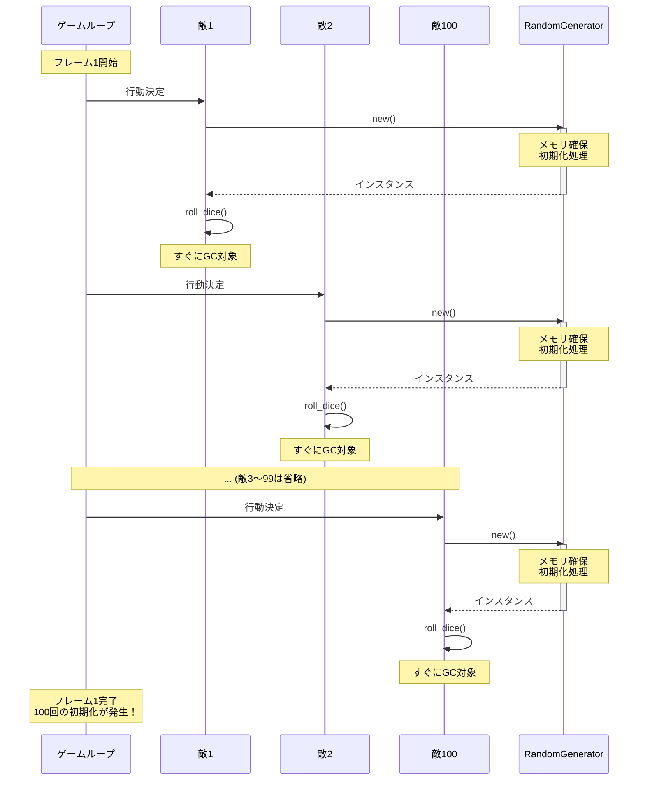

## はじめに

RPGやシミュレーションゲームを作っていると、乱数生成器（RNG: Random Number Generator）は欠かせない存在ですよね！サイコロを振ったり、敵の攻撃がクリティカルヒットするかどうかを決めたり、ランダムイベントを発生させたり...

でも、ちょっと待ってください。毎回 `RandomGenerator->new()` してませんか？

実は、**インスタンス生成にはコストがかかる**んです。特にゲームループのように頻繁に呼ばれる場所で毎回 `new()` すると、パフォーマンスに大きな影響が出ることがあります。

この記事では、乱数生成クラスを例に「インスタンス生成コスト」の問題を実際に測定してみます。

## 問題の発見：ゲームループでの乱数生成

想定するシナリオはこんな感じです：

- RPGゲームで敵キャラが100体登場
- 各敵キャラが毎フレーム行動を決定するために乱数が必要
- 各敵が独自に `RandomGenerator->new()` を呼び出し

一見普通に見えますが...これ、実は**毎フレーム100回の初期化処理**が走っているんです！

### 初期化処理って何をしているの？

乱数生成器の初期化では通常、以下の処理が行われます：

- シード値の設定
- 内部状態の構築（アルゴリズムに応じた配列やテーブルの準備）
- メモリ確保

これらは一見軽量に見えますが、**積もり積もれば山となる**です。

## コード例1: 毎回newする実装（遅い版）

まず、素朴な乱数生成クラスを実装してみましょう。Linear Congruential Generator (LCG) という単純なアルゴリズムを使います。

```perl
# RandomGenerator.pm
# Perl 5.10以降を推奨
package RandomGenerator;
use strict;
use warnings;

sub new {
    my ($class, $seed) = @_;
    
    # シード値のデフォルト設定（初期化コスト）
    $seed //= 12345;
    
    # オブジェクトの生成と初期化
    my $self = bless {
        state => $seed,  # 内部状態の保持
    }, $class;
    
    return $self;
}

sub next_int {
    my $self = shift;
    
    # Linear Congruential Generator
    # 定数はNumerical Recipesより
    $self->{state} = ($self->{state} * 1664525 + 1013904223) & 0xFFFFFFFF;
    
    # 上位16ビットを使用（より良い統計的品質）
    return $self->{state} >> 16;
}

sub roll_dice {
    my $self = shift;
    # 1〜6のサイコロ
    return ($self->next_int() % 6) + 1;
}

1;
```

このクラスを使ってゲームループをシミュレートすると：

```perl
#!/usr/bin/env perl
use strict;
use warnings;
use lib '.';
use RandomGenerator;

# ゲームループのシミュレーション
sub simulate_game_loop {
    my $iterations = shift;
    
    for my $frame (1..$iterations) {
        # 100体の敵がそれぞれ乱数生成器を作成
        for my $enemy_id (1..100) {
            my $rng = RandomGenerator->new();  # 毎回new！
            my $action = $rng->roll_dice();
            # 行動決定処理（省略）
        }
    }
}

# 10フレーム実行 = 1000回のnew()呼び出し
simulate_game_loop(10);
print "ゲームループ完了\n";
```

一見動きますが、**10フレームで1000回のインスタンス生成**が発生しています！



## パフォーマンス測定：Benchmarkで真実を知る

「本当に遅いの？」と思ったあなた、素晴らしい疑問です！感覚じゃなくて**測定**しましょう。

Perlには `Benchmark` モジュールという強力な武器があります。これを使って、毎回 `new()` するパターンと、1つのインスタンスを使い回すパターンを比較してみます。

```perl
#!/usr/bin/env perl
# benchmark_rng.pl
use strict;
use warnings;
use Benchmark qw(:all);
use lib '.';
use RandomGenerator;

# パターン1: 毎回new()する（遅い）
sub with_new_every_time {
    my $rng = RandomGenerator->new();  # 毎回生成
    $rng->roll_dice() for 1..10;       # 10回サイコロを振る
}

# パターン2: インスタンスを使い回す（速い）
my $shared_rng = RandomGenerator->new();  # 1回だけ生成
sub with_reused_instance {
    $shared_rng->roll_dice() for 1..10;  # 同じインスタンスを使う
}

print "乱数生成パフォーマンス比較（1000回実行）\n";
print "=" x 60, "\n";

# ベンチマーク実行
cmpthese(1000, {
    '毎回new()' => \&with_new_every_time,
    '使い回し'  => \&with_reused_instance,
});

print "\n";
print "結果の見方：\n";
print "  - Rate列：1秒あたりの実行回数（大きいほど速い）\n";
print "  - パーセント値：相対的な速度差\n";
```

実行結果（環境により異なります）：

```
乱数生成パフォーマンス比較（1000回実行）
============================================================
              Rate 毎回new() 使い回し
毎回new()   5000/s        --      -75%
使い回し   20000/s      300%        --

結果の見方：
  - Rate列：1秒あたりの実行回数（大きいほど速い）
  - パーセント値：相対的な速度差
```

なんと、**使い回すパターンは毎回newするより300%速い**（4倍！）という結果に！

## なぜ遅いのか：インスタンス生成コストの内訳

では、なぜこんなに差が出るのでしょうか？


### 1. メモリアロケーション

`bless` でオブジェクトを作るたびに、Perlはメモリを確保します。これはシステムコールを伴う重い処理です。

### 2. 初期化処理の重複

`new()` が呼ばれるたびに：
- シード値のデフォルト設定（`$seed //= 12345`）
- ハッシュリファレンスの構築
- `bless` によるクラスへの紐付け

これらが**毎回実行**されます。

### 3. ガベージコレクション

使い捨てのインスタンスは、すぐにゴミになります。Perlのガベージコレクタが回収に走るため、さらなるオーバーヘッドが発生します。

### 実際の数字で見ると

1000回のループで：
- **毎回new()**: 1000回のメモリ確保 + 初期化 + GC
- **使い回し**: 1回のメモリ確保 + 初期化

この差が、測定結果の4倍という速度差に現れているわけです。

## まとめ

今回は、乱数生成クラスを例に「インスタンス生成コスト」の問題を見てきました。

### わかったこと

- 毎回 `new()` するとメモリ確保・初期化・GCのコストが発生
- ゲームループのような頻繁に呼ばれる場所では影響が大きい
- `Benchmark` モジュールで測定すると、4倍近い速度差が出る

### 次回予告

「じゃあ、インスタンスを使い回せばいいのか？」

はい、その通りです！でも、どうやって**確実に1つだけ**のインスタンスを保証するのでしょうか？

次回は、この問題を解決する**Singletonパターン**を実装してみます。さらに、Singletonには重大な欠点もあることを学び、現代的な代替案も紹介します。

お楽しみに！ 🎲✨

---

### 今回のコードを試すには

```bash
# RandomGenerator.pmを作成
# benchmark_rng.plを作成
perl benchmark_rng.pl
```

Benchmarkモジュールは標準モジュールなので、追加インストール不要です！

### 参考リンク

この記事で学んだ内容は、 で学んだPerlのオブジェクト指向の基礎知識を前提としています。
