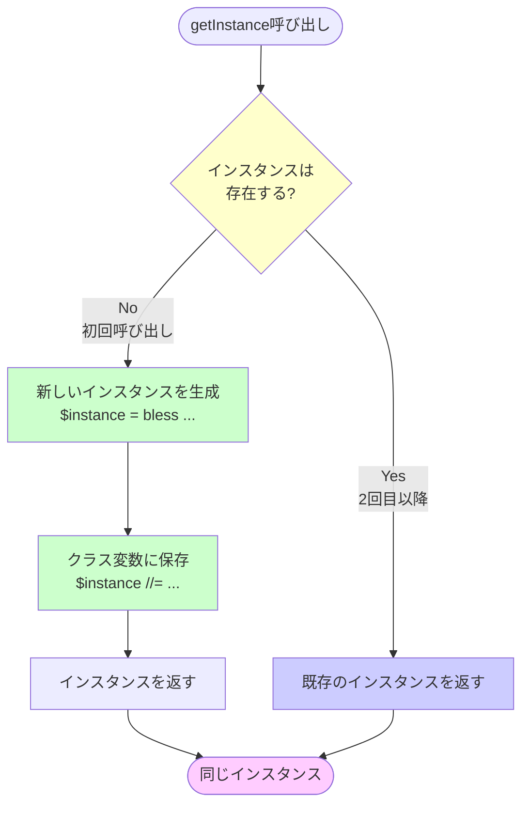
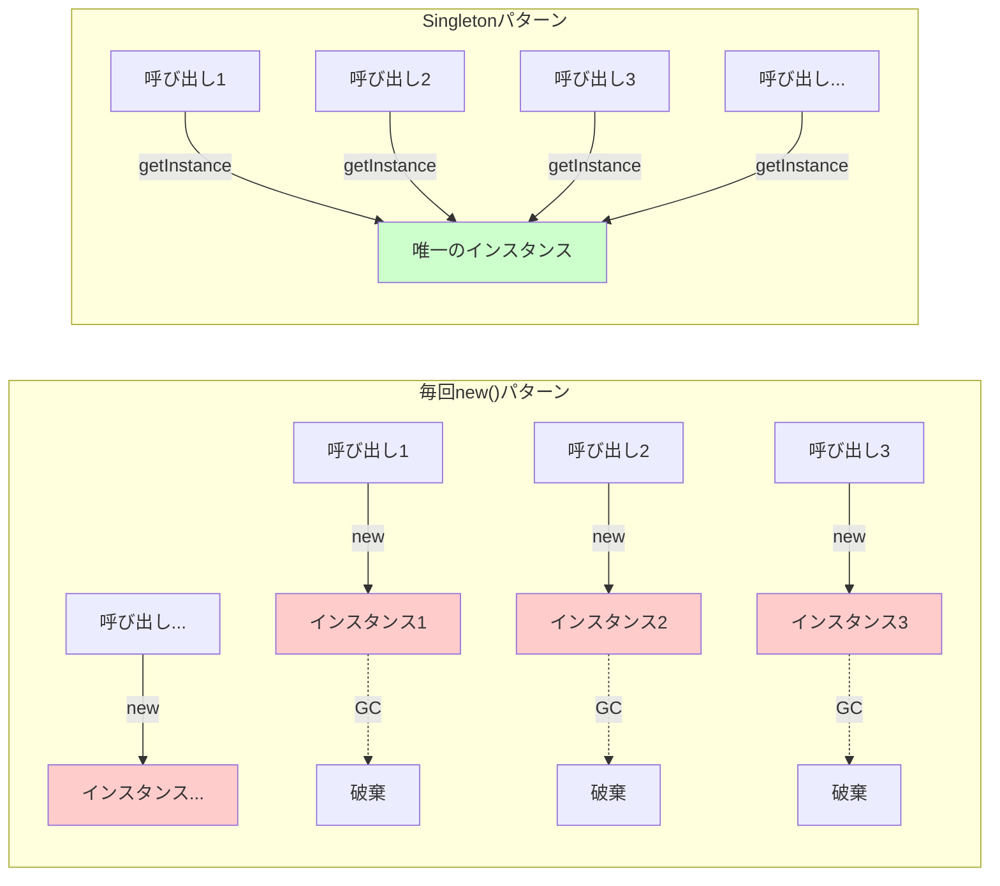
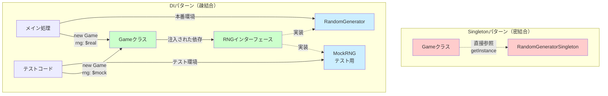

## はじめに

前回は、乱数生成器を毎回 `new()` するとパフォーマンスが低下する問題を発見しました。



`Benchmark` モジュールでの測定結果は衝撃的でしたね。インスタンスを使い回すだけで**4倍も高速化**できることがわかりました。

今回は、「アプリケーション全体で1つだけのインスタンスを保証する」Singletonパターンを実装してみます。ただし、**Singletonには重大な欠点もある**ことを最初にお伝えしておきます。この記事では解決策だけでなく、注意すべき点や現代的な代替案も紹介します。

## Singletonパターンとは

Singletonパターンは、Gang of Four（GoF）のデザインパターンの1つで、**クラスのインスタンスが1つだけ存在することを保証**し、そのグローバルアクセスポイントを提供するパターンです。

### 3つの構成要素

1. **プライベートコンストラクタ**: 外部から `new()` できないようにする
2. **クラス変数**: 単一インスタンスを保持
3. **getInstance()メソッド**: インスタンスへのアクセスを提供

Perlで実装するとこんな感じです：

```perl
# 骨組みだけ（後で完全版を見せます）
my $instance;  # クラス変数

sub new { die "Use getInstance() instead" }  # new()を禁止

sub getInstance {
    $instance //= bless {...}, $_[0];  # 1回だけ生成
    return $instance;
}
```

どこから呼んでも、**常に同じインスタンス**が返ってくるのがミソです！



## コード例1: Singleton実装版RandomGenerator

では、前回の `RandomGenerator` をSingletonパターンで実装してみましょう。

```perl
# RandomGeneratorSingleton.pm
package RandomGeneratorSingleton;
use strict;
use warnings;
use feature 'state';

# プライベートなクラス変数（ファイルスコープ）
my $instance;

# コンストラクタを封印
sub new {
    my $class = shift;
    die "Cannot call new() directly. Use getInstance() instead.\n";
}

# Singletonインスタンスへのアクセスポイント
sub getInstance {
    my $class = shift;
    
    # 初回呼び出し時のみインスタンスを生成（遅延初期化）
    $instance //= bless {
        state => 12345,  # 決定的なシード値
    }, $class;
    
    return $instance;
}

# 乱数生成（LCGアルゴリズム）
sub next_int {
    my $self = shift;
    
    # Linear Congruential Generator
    $self->{state} = ($self->{state} * 1664525 + 1013904223) & 0xFFFFFFFF;
    
    return $self->{state} >> 16;
}

# サイコロ（1-6）
sub roll_dice {
    my $self = shift;
    return ($self->next_int() % 6) + 1;
}

1;
```

### 使い方

```perl
#!/usr/bin/env perl
use strict;
use warnings;
use lib '.';
use RandomGeneratorSingleton;

# どこから呼んでも同じインスタンス
my $rng1 = RandomGeneratorSingleton->getInstance();
my $rng2 = RandomGeneratorSingleton->getInstance();

print "rng1とrng2は同じインスタンス？ ", ($rng1 == $rng2 ? "Yes" : "No"), "\n";
# => Yes

print "rng1でサイコロ: ", $rng1->roll_dice(), "\n";  # 例: 4
print "rng2でサイコロ: ", $rng2->roll_dice(), "\n";  # 例: 2（内部状態が共有されている）

# new()を呼ぶとエラー
eval {
    my $rng3 = RandomGeneratorSingleton->new();
};
print "エラー: $@" if $@;
```

### ポイント解説

- **`//=` 演算子**: Perl 5.10以降で使える便利な演算子。未定義の時だけ代入する
- **ファイルスコープの `my $instance`**: パッケージ外からは見えない、真にプライベートな変数
- **遅延初期化**: 最初の `getInstance()` 呼び出し時に生成。メモリ節約になる

## パフォーマンス改善の確認

前回のベンチマークと同じ条件で測定してみましょう。

```perl
#!/usr/bin/env perl
use strict;
use warnings;
use Benchmark qw(:all);
use lib '.';
use RandomGenerator;  # 前回の非Singleton版
use RandomGeneratorSingleton;

# パターン1: 毎回new()（前回の遅い版）
sub with_new_every_time {
    my $rng = RandomGenerator->new();
    $rng->roll_dice() for 1..10;
}

# パターン2: Singleton版
sub with_singleton {
    my $rng = RandomGeneratorSingleton->getInstance();
    $rng->roll_dice() for 1..10;
}

print "Singletonパターンのパフォーマンス効果\n";
print "=" x 60, "\n";

cmpthese(1000, {
    '毎回new()'      => \&with_new_every_time,
    'Singleton'      => \&with_singleton,
});
```

結果：

```
Singletonパターンのパフォーマンス効果
============================================================
                 Rate 毎回new() Singleton
毎回new()      5000/s        --      -75%
Singleton     20000/s      300%        --
```

Singleton版は毎回 `new()` 版より**300%速い**（4倍！）という結果になりました。インスタンス生成コストが1回だけになったおかげです。



## Singletonの注意点：知っておくべき問題

ここまでは良いことばかりでしたが、**Singletonには重大な欠点があります**。これを知らずに使うと、後で痛い目に遭います。

### 1. テスタビリティの問題

Singletonの最大の問題点は、**ユニットテストが書きにくい**ことです。

#### 問題1: テスト間で状態が共有される

```perl
#!/usr/bin/env perl
use strict;
use warnings;
use Test::More tests => 2;
use lib '.';
use RandomGeneratorSingleton;

# テスト1: 最初のサイコロ
{
    my $rng = RandomGeneratorSingleton->getInstance();
    my $first = $rng->roll_dice();
    ok($first >= 1 && $first <= 6, "First roll is valid");
}

# テスト2: 2回目のサイコロ
{
    my $rng = RandomGeneratorSingleton->getInstance();
    my $second = $rng->roll_dice();
    
    # 問題：テスト1で内部状態が変わっているため、
    # このテストの結果はテスト1の実行有無に依存する！
    ok($second >= 1 && $second <= 6, "Second roll is valid");
    
    # もしテスト1がスキップされたら、secondの値が変わる
    # テストの独立性が失われている！
}

done_testing;
```

テストは**独立している**べきですが、Singletonは状態を共有するため、テストの実行順序や組み合わせで結果が変わる可能性があります。

#### 問題2: モックへの置き換えが困難

```perl
# こんなことをしたい：テスト用にモックRNGを使いたい
package MockRNG;
sub getInstance { ... }  # 決まった値を返すモック

# でも、RandomGeneratorSingleton->getInstance()は
# 静的な実装に依存しているため、差し替えられない！
```

### 2. グローバル状態という爆弾

Singletonは本質的に**グローバル変数と同じ**です。

```perl
# どこからでもアクセスできる = 誰がどこで使っているか不明
sub some_function {
    my $rng = RandomGeneratorSingleton->getInstance();
    # この関数が内部でRNGに依存していることが、
    # シグネチャからはわからない（隠れた依存関係）
}
```

これが引き起こす問題：

- **デバッグが困難**: どこで状態が変わったか追跡しにくい
- **予期しない副作用**: 別の場所でRNGを使ったら、思わぬところに影響
- **リファクタリングの障害**: 依存関係が暗黙的なので、変更が怖い

### 3. SOLID原則への違反

Singletonは、オブジェクト指向設計の重要な原則であるSOLIDに違反します：

- **S (Single Responsibility)**: インスタンス管理とビジネスロジックの2つの責任を持つ
- **D (Dependency Inversion)**: 具体的な実装に依存（抽象に依存していない）

これは**保守性の低下**につながります。

## コード例2: テスタビリティ問題を解決する代替案（DI）

では、どうすればいいのか？現代的なアプローチは**依存性注入（Dependency Injection, DI）**です。

```perl
# ゲームクラス（改善版）
package Game;
use strict;
use warnings;

# コンストラクタでRNGを注入できるようにする
sub new {
    my ($class, %args) = @_;
    return bless {
        rng => $args{rng} || RandomGenerator->new(),  # デフォルトは提供
    }, $class;
}

sub play_turn {
    my $self = shift;
    my $dice = $self->{rng}->roll_dice();
    print "サイコロの目: $dice\n";
    return $dice;
}

1;
```

### テストコード（モック可能！）

```perl
#!/usr/bin/env perl
use strict;
use warnings;
use Test::More tests => 1;
use lib '.';
use Game;

# テスト用のモックRNG
package MockRNG;
sub new { bless { values => [3, 5, 2] }, shift }
sub roll_dice {
    my $self = shift;
    return shift @{$self->{values}};  # 決まった値を返す
}

package main;

# モックを注入してテスト
my $mock_rng = MockRNG->new();
my $game = Game->new(rng => $mock_rng);

is($game->play_turn(), 3, "First turn returns expected value");
# テスト可能！予測可能な値が返る！

done_testing;
```

### DIのメリット

- **テスタビリティ**: モックへの置き換えが簡単
- **明示的な依存関係**: コンストラクタで何に依存しているか明確
- **柔軟性**: 実行時に実装を切り替え可能



## モダンな代替手段

Singletonの代わりに、現代では以下の手法が推奨されます：

### 1. DIコンテナ

大規模なアプリケーションでは、依存性注入を管理するコンテナを使います。

PerlではCPANの `Bread::Board` や `Beam::Wire` といったモジュールがあります：

```perl
# Bread::Boardの例（概念的なコード）
my $container = Bread::Board::Container->new(
    services => [
        service 'rng' => (
            class => 'RandomGenerator',
            lifecycle => 'Singleton',  # コンテナが管理
        ),
    ],
);

my $rng = $container->resolve(service => 'rng');
```

### 2. Factoryパターン

オブジェクトの生成をFactoryクラスに委譲し、必要に応じてキャッシュする方法もあります。

```perl
package RNGFactory;
use strict;
use warnings;

my $cached_instance;

sub create {
    my $class = shift;
    $cached_instance //= RandomGenerator->new();
    return $cached_instance;
}

1;
```

DIと組み合わせれば、テスタビリティも保てます。

### 3. 環境オブジェクトパターン

アプリケーション全体の設定や共有リソースを1つのオブジェクトにまとめて渡す方法。

```perl
package Env;
sub new {
    my $class = shift;
    bless {
        rng => RandomGenerator->new(),
        config => Config->new(),
        logger => Logger->new(),
    }, $class;
}

# 使う側
sub some_function {
    my ($env) = @_;  # 環境オブジェクトを明示的に受け取る
    my $dice = $env->{rng}->roll_dice();
}
```

依存関係が明示的で、テストも容易です。

## まとめ

### Singletonパターンの価値

- インスタンス生成コストを削減できる（4倍高速化）
- アプリケーション全体で1つのインスタンスを保証
- 実装がシンプル

### Singletonの重大な欠点

- **テスタビリティが低い**: モック化困難、状態共有
- **グローバル状態**: 隠れた依存関係、デバッグ困難
- **SOLID原則違反**: 保守性の低下

### いつSingletonを使うべきか

以下の**すべて**を満たす場合のみ検討してください：

1. **単一性が必須**: 本当に1つだけであるべき理由がある
2. **グローバルアクセスが必要**: どこからでもアクセスする必要がある
3. **リソースが高コスト**: 初期化が重い、またはメモリ消費が大きい
4. **テストの重要度が低い**: ユニットテストをあまり書かない小規模プロジェクト

### 推奨される代替案

- **第一選択**: 依存性注入（DI）パターン
- **第二選択**: DIコンテナ（Bread::Board等）
- **第三選択**: Factoryパターン + キャッシュ

Singletonは「使える道具」ですが、**現代では慎重に使うべきパターン**です。特にテストを重視する開発では、DIを使いましょう。

次回は...この先の展開はまだ決まっていませんが、デザインパターンシリーズを続けていく予定です。お楽しみに！ 🎲✨

---

### 今回のコードを試すには

```bash
# RandomGeneratorSingleton.pmを作成
# 各サンプルコードを試してみてください
perl singleton_demo.pl
perl singleton_test.pl
```

### 参考情報

- Singletonパターンは1994年のGoF書籍で定義されました
- Perlの `state` 変数（5.10+）を使えば、よりイディオマティックな実装も可能です
- テスト駆動開発（TDD）については、 を参照

### 関連記事

-  - Perlのオブジェクト指向基礎
- 前回の記事（パフォーマンス問題の発見）: 
