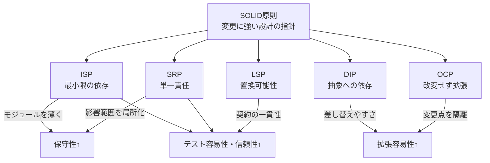

オブジェクト指向の設計を学び始めると、SOLID原則が頻繁に登場します。5つの原則はすべて「変更に強い構造を作る」ための視点です。本記事では、入門者がつまずきやすい誤解を解きほぐし、すぐ試せる実践ポイントとPython 3.12のシンプルなコード例で確認します。

## 学び方のガイド（5分で流れを把握）

### 本記事の読み方と到達目標

最初に5原則の狙いと読み進め方を共有します。定義と目的を短く押さえたうえで、ありがちな誤解と実践チェックを組み合わせて理解を深めます。各コード例は最小限の依存に抑えた差し替えやすい構造にしているので、そのまま手元で動かしながら確認してください。

### SOLID全体像の俯瞰図

SOLIDの5原則がどの設計品質に効くのかを、関係性ごとにざっと押さえておきましょう。



## SRP—ログと保存を分けて影響範囲を狭める

単一責任の原則は「1つの変更理由だけを持たせる」ことが目的です。表示や保存、検証など異なる変更理由を分けることで、修正時の影響範囲を局所化できます。

### ビフォーコード（混在例）

よくある誤解は「メソッドが少なければ単一責任」という考え方です。ログと保存を同じメソッドに入れると、どちらか一方の変更でも両方を触る必要が生じます。

言語: Python 3.12 / 依存: なし
```python
class ReportService:
    def __init__(self, path: str) -> None:
        self.path = path

    def save_and_log(self, content: str) -> None:
        with open(self.path, "a", encoding="utf-8") as f:
            f.write(content + "\n")
        print(f"[log] saved to {self.path}")
```

### アフターコード（責務分離）

責務を分けるとテストしやすさも上がります。保存と通知を合成するだけにし、変更理由を1つに絞ります。

- 変更理由をUI・永続化・ドメインで列挙し、混在を分割しておくべきである
- 横断関心はデコレータや合成で注入する構造にし、責務の境界を保つべきである

言語: Python 3.12 / 依存: なし
```python
class FileStorage:
    def __init__(self, path: str) -> None:
        self.path = path

    def save(self, content: str) -> None:
        with open(self.path, "a", encoding="utf-8") as f:
            f.write(content + "\n")


class Logger:
    def log(self, message: str) -> None:
        print(f"[log] {message}")


class ReportService:
    def __init__(self, storage: FileStorage, logger: Logger) -> None:
        self.storage = storage
        self.logger = logger

    def save(self, content: str) -> None:
        self.storage.save(content)
        self.logger.log("saved report")
```

## OCP—料金プラン追加をifなしで拡張する

開放閉鎖の原則は「改変せずに拡張する」ために抽象を挟みます。`if` を増やして振る舞いを増やすのは拡張ではなく改変です。

### 戦略パターンで拡張点を外出し

- 拡張ポイントはインターフェースで固定し、新しい戦略を追加するだけにする設計にしておくべきである
- 登録やDIで新戦略を差し込む経路を先に用意しておく方針である

言語: Python 3.12 / 依存: なし
```python
from abc import ABC, abstractmethod


class Pricing(ABC):
    @abstractmethod
    def amount(self, usage: int) -> int:
        ...


class BasicPricing(Pricing):
    def amount(self, usage: int) -> int:
        return 1000 + usage * 10


class PremiumPricing(Pricing):
    def amount(self, usage: int) -> int:
        return 2000 + usage * 8


def calc_invoice(pricing: Pricing, usage: int) -> int:
    return pricing.amount(usage)


# 新プランを増やすときは Pricing の具象クラスを追加するだけ
```

## LSP—モック置換で破れない契約を作る

リスコフ置換の原則は「サブタイプは基底型と同じ契約を守る」ことです。例外や戻り値の扱いを変えてしまうと、テストダブルに差し替えた瞬間に破綻します。

### 期待する不変条件をテストで明文化

- 事前条件を厳しくしない（null許容ならサブタイプも許容するのが原則である）
- 事後条件を緩めない（戻り値の意味を変えないことが契約である）
- 例外型の互換性を保つことが置換可能性を守る条件である

言語: Python 3.12 / 依存: なし
```python
from typing import Protocol, Optional


class Repository(Protocol):
    def find(self, item_id: str) -> Optional[str]:
        ...


class MemoryRepo:
    def __init__(self) -> None:
        self.data: dict[str, str] = {}

    def find(self, item_id: str) -> Optional[str]:
        return self.data.get(item_id)


class CachingRepo:
    def __init__(self, origin: Repository) -> None:
        self.origin = origin
        self.cache: dict[str, Optional[str]] = {}

    def find(self, item_id: str) -> Optional[str]:
        if item_id in self.cache:
            return self.cache[item_id]
        result = self.origin.find(item_id)
        self.cache[item_id] = result
        return result  # 契約通り Optional[str] をそのまま返す
```

## ISP—Fat Interfaceをロールに分ける

インターフェース分離の原則は「クライアントが使わないメソッドを強制しない」ことが目的です。大きなインターフェースをそのまま小さくするだけでは役割が曖昧なまま残ります。

### Reader/Writer分離の小さなリファクタ

- 呼び出しパターンごとにロールを分割するのが基本である
- 合成可能な小インターフェースにしてモック作成コストを下げるのが定石である

言語: Python 3.12 / 依存: なし
```python
from abc import ABC, abstractmethod


class Reader(ABC):
    @abstractmethod
    def read(self) -> str:
        ...


class Writer(ABC):
    @abstractmethod
    def write(self, data: str) -> None:
        ...


class FileStream(Reader, Writer):
    def __init__(self, path: str) -> None:
        self.path = path

    def read(self) -> str:
        with open(self.path, "r", encoding="utf-8") as f:
            return f.read()

    def write(self, data: str) -> None:
        with open(self.path, "w", encoding="utf-8") as f:
            f.write(data)
```

## DIP—メール送信を抽象に寄せて差し替え自在に

依存性逆転の原則は「安定した抽象に依存し、具象は外側から注入する」ことです。DIコンテナの有無ではなく、抽象の所有権が内側にあるかが重要です。

### ポートとアダプタの分離手順

- ドメイン側でインターフェース（ポート）を定義するのが原則である
- インフラ側で実装（アダプタ）し、コンストラクタで注入する流れである
- newをドメインから追い出し、差し替えやすくしておくことが目標である

言語: Python 3.12 / 依存: なし
```python
from abc import ABC, abstractmethod


class EmailSender(ABC):
    @abstractmethod
    def send(self, to: str, body: str) -> None:
        ...


class SmtpEmailSender(EmailSender):
    def send(self, to: str, body: str) -> None:
        # 実際にはSMTPクライアントをここで扱う
        print(f"send to {to}: {body}")


class OrderService:
    def __init__(self, sender: EmailSender) -> None:
        self.sender = sender

    def notify(self, to: str, body: str) -> None:
        self.sender.send(to, body)
```

## まとめと次の一歩

### どの原則から適用するかの優先順位

まずはSRPとISPで「変更理由」と「必要なロール」を整理すると、OCPやDIPの抽象化がスムーズになります。LSPはテストで期待値を固定し、差し替え可能性を守るための安全網として活用してください。入門段階では「テストしやすさ」を指標に小さく適用し、成功体験を積み重ねることが上達への近道です。

参考になりそうな資料もあわせて置いておきます。深掘りしたいときに活用してください。

- 
- 
- 
