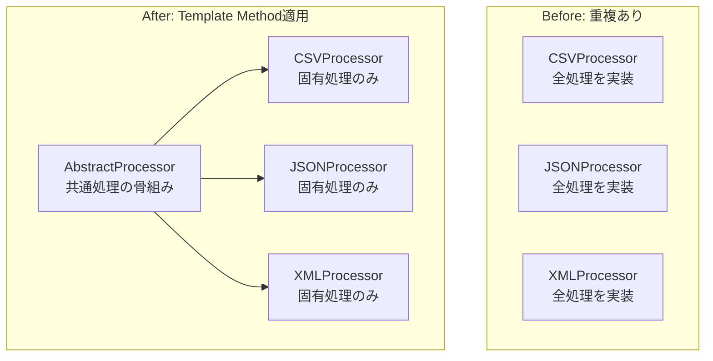
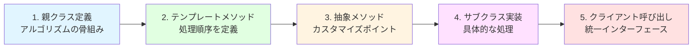
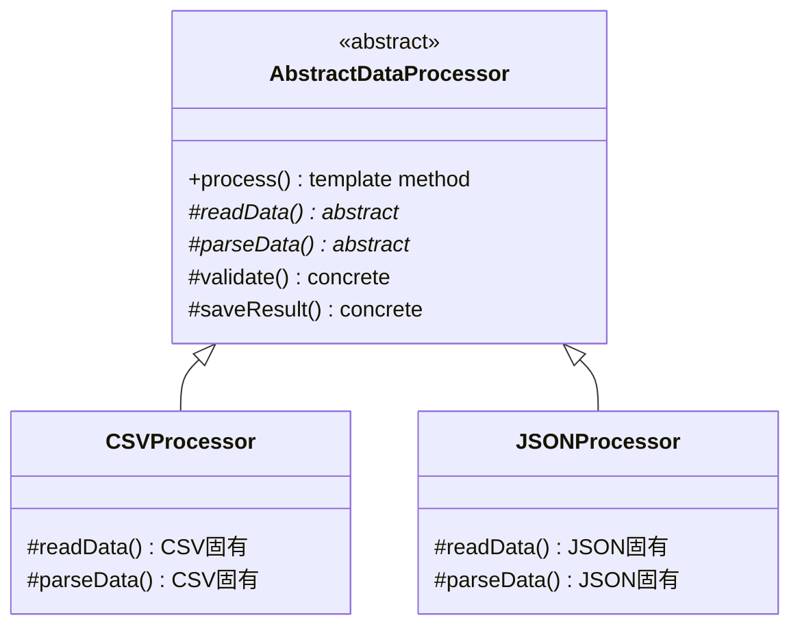
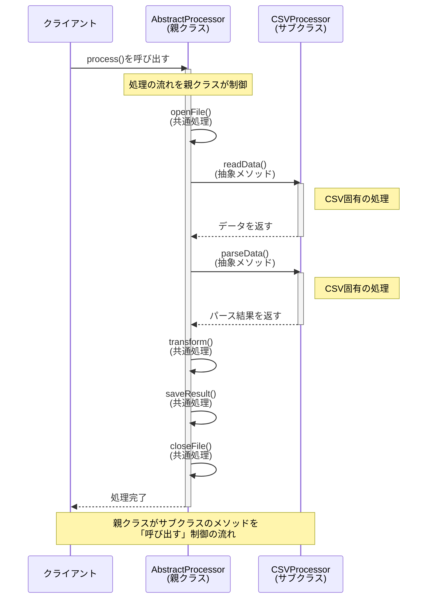
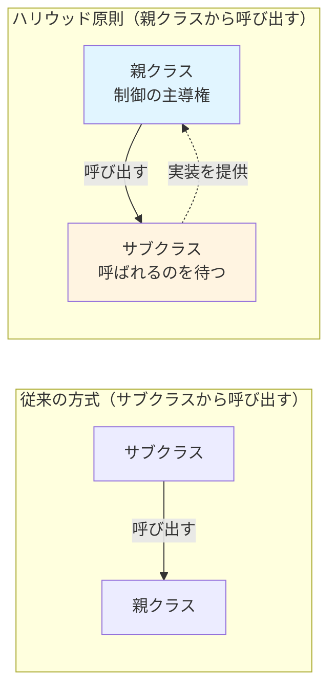
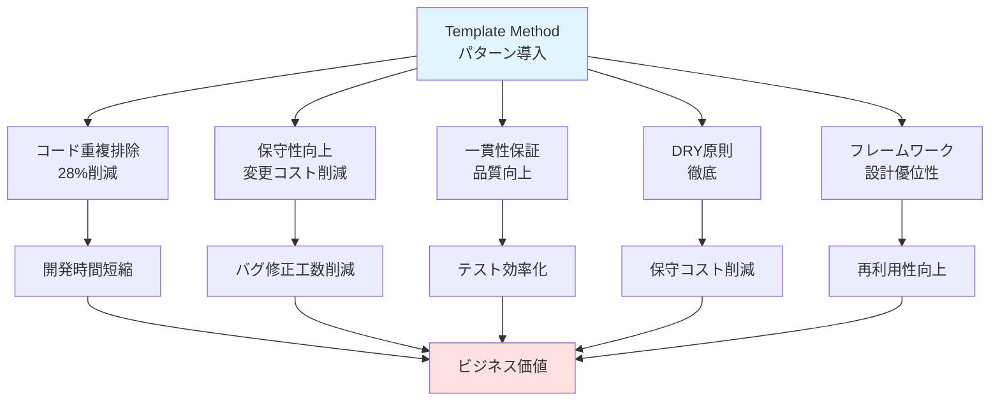
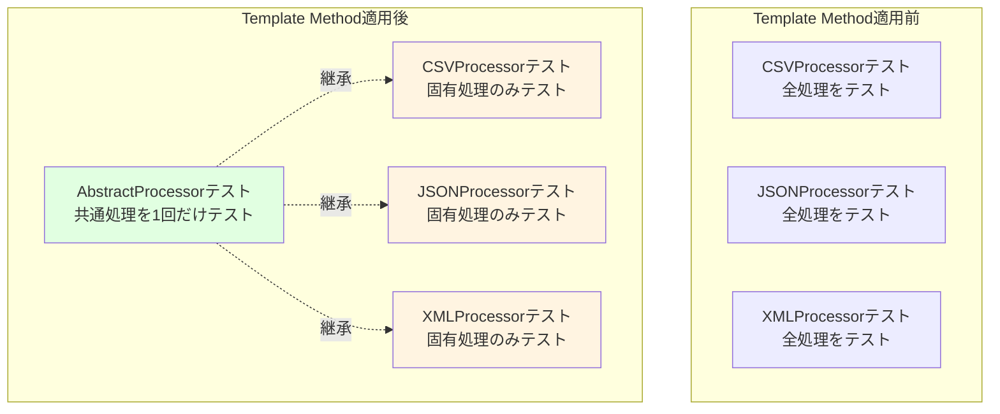
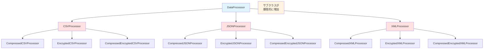
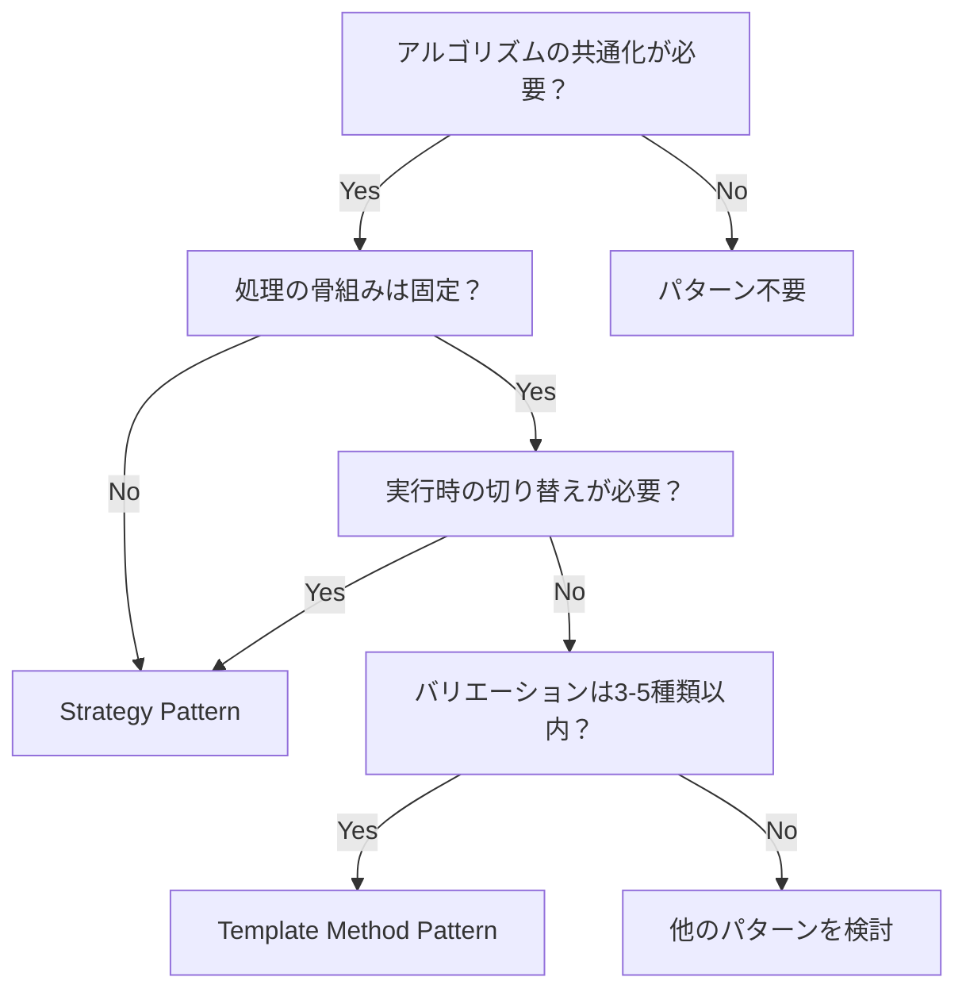

CSVファイルとJSONファイルの処理を実装したら、ほとんど同じコードが2箇所に…という経験はありませんか？Template Methodパターンを使えば、このようなコードの重複を解消し、保守性を劇的に向上できます。

本記事では、Template Methodパターンの基本概念から実装例、実務での活用方法、注意点まで徹底解説します。Java、Python、TypeScriptの3言語でのサンプルコードも掲載していますので、すぐに実践できます。

## 解決する問題：コードの重複と保守性低下

### よくある3つの問題シーン

Template Methodパターンが解決する典型的な問題を見てみましょう。

**問題1: コードの重複**

異なるデータ形式（CSV、JSON、XML）を処理する際、ファイル読み込み、データ検証、変換、保存といった処理の流れは同じなのに、形式ごとに似たようなコードを書いてしまうことがある

```java
// CSV処理クラス
class CSVProcessor {
    void process() {
        openFile();      // 共通
        validateHeader(); // CSV固有
        parseData();      // CSV固有
        transform();      // 共通
        saveResult();     // 共通
    }
}

// JSON処理クラス
class JSONProcessor {
    void process() {
        openFile();       // 共通 - 重複！
        validateSchema(); // JSON固有
        parseData();      // JSON固有
        transform();      // 共通 - 重複！
        saveResult();     // 共通 - 重複！
    }
}
```

修正時に全箇所を変更する必要があり、修正漏れのリスクが高くなる

**問題2: 保守性の低下**

- 共通ロジックの変更が複数箇所に波及する
- バグ修正のコストが増大する
- テストコードも重複し、メンテナンスが困難になる

**問題3: 一貫性の欠如**

- 処理の順序がクラスごとに微妙に異なる
- エラーハンドリングの実装が統一されていない
- コードレビューが困難で品質のばらつきが発生する

### Template Methodパターンによる解決アプローチ

Template Methodパターンは、以下の3つの原則でこれらの問題を解決します。

- **アルゴリズムの骨組みを親クラスで定義**: 処理の流れは1箇所で管理
- **可変部分のみをサブクラスで実装**: 形式固有の処理だけを各クラスが担当
- **共通ロジックは1箇所に集約**: 重複を排除し、変更の影響範囲を最小化



## パターンの基本：アルゴリズムの骨組みを共通化する

### Template Methodパターンの定義

GoF（Gang of Four）の定義では、Template Methodパターンは次のように説明されています。

> **操作にアルゴリズムの骨組みを定義し、いくつかの手順をサブクラスに任せる。Template Methodにより、アルゴリズムの構造を変えずに、アルゴリズムの特定の手順をサブクラスで再定義できる**

より平易に言い換えると、「処理の手順は親クラスで決めておき、具体的な中身だけを子クラスで実装する」ということです。

料理のレシピで考えると分かりやすくなります。「材料を準備する→調理する→盛り付ける」という手順（骨組み）は共通で、具体的な食材や調理法だけが異なるイメージです。

**Template Methodパターンのライフサイクル**



### 4つの構成要素と役割分担

Template Methodパターンは以下の4つの要素で構成されます。

| 要素 | 役割 | 具体例 |
|------|------|--------|
| **抽象クラス** | アルゴリズムの骨組みを定義 | `AbstractDataProcessor` |
| **テンプレートメソッド** | 処理の順序を定義する具象メソッド | `process()` |
| **抽象メソッド** | サブクラスが必ず実装すべきメソッド | `readData()`, `parseData()` |
| **具象サブクラス** | 抽象メソッドの具体的実装を提供 | `CSVProcessor`, `JSONProcessor` |



### ハリウッド原則「呼び出すな、呼ばれるのを待て」

Template Methodパターンは、**ハリウッド原則（Hollywood Principle）**を体現しています。

通常のメソッド呼び出しでは、サブクラスが親クラスのメソッドを呼び出します。しかし、Template Methodでは逆に、親クラスが「いつ」「どの順番で」サブクラスのメソッドを呼び出すかを制御します。



**ハリウッド原則の概念図**



これにより、以下のメリットが生まれます。

- 処理の流れが親クラスに集約され、全体像を把握しやすい
- サブクラスは自分の役割（抽象メソッドの実装）にのみ集中できる
- フレームワーク開発でよく使われる設計原則

## 実装ステップ：3つの言語で完全理解

### Java実装：データ処理の共通化パターン

**動作環境**
- Java 8以降
- 外部依存: なし

```java
// 抽象クラス：データ処理の骨組み
abstract class DataProcessor {
    // テンプレートメソッド：処理の流れを定義
    public final void process() {
        openFile();
        String data = readData();
        if (validate(data)) {
            Object parsed = parseData(data);
            transform(parsed);
            saveResult(parsed);
        }
        closeFile();
    }
    
    // 共通処理：具象メソッド
    private void openFile() {
        System.out.println("ファイルを開く");
    }
    
    private void closeFile() {
        System.out.println("ファイルを閉じる");
    }
    
    protected boolean validate(String data) {
        return data != null && !data.isEmpty();
    }
    
    private void transform(Object data) {
        System.out.println("データを変換");
    }
    
    private void saveResult(Object data) {
        System.out.println("結果を保存");
    }
    
    // 抽象メソッド：サブクラスで実装
    protected abstract String readData();
    protected abstract Object parseData(String data);
}

// CSV処理の具体実装
class CSVProcessor extends DataProcessor {
    @Override
    protected String readData() {
        return "name,age\nJohn,30\nJane,25";
    }
    
    @Override
    protected Object parseData(String data) {
        System.out.println("CSVをパース");
        return data.split("\n");
    }
}

// JSON処理の具体実装
class JSONProcessor extends DataProcessor {
    @Override
    protected String readData() {
        return "{\"users\":[{\"name\":\"John\",\"age\":30}]}";
    }
    
    @Override
    protected Object parseData(String data) {
        System.out.println("JSONをパース");
        return data; // 実際にはJSONライブラリを使用
    }
}

// 使用例
public class Main {
    public static void main(String[] args) {
        DataProcessor csv = new CSVProcessor();
        csv.process();
        
        DataProcessor json = new JSONProcessor();
        json.process();
    }
}
```

**ポイント**

- テンプレートメソッド`process()`に`final`修飾子を付けて、サブクラスでの上書きを防ぐ
- 抽象メソッドは`protected`にして、外部からの直接呼び出しを制限
- 共通処理は`private`メソッドとして実装

### Python実装：決済フローの統一パターン

**動作環境**
- Python 3.7以降
- 標準ライブラリ: `abc`, `typing`

```python
from abc import ABC, abstractmethod
from typing import Dict, Any

# 抽象クラス：決済処理の骨組み
class PaymentProcessor(ABC):
    # テンプレートメソッド
    def process_payment(self, amount: float) -> bool:
        if not self.validate_amount(amount):
            return False
        
        if self.authenticate():
            payment_data = self.prepare_payment(amount)
            result = self.execute_payment(payment_data)
            self.log_transaction(result)
            return result
        return False
    
    # 共通処理：具象メソッド
    def validate_amount(self, amount: float) -> bool:
        return amount > 0
    
    def log_transaction(self, result: bool) -> None:
        status = "成功" if result else "失敗"
        print(f"取引ログ: {status}")
    
    # 抽象メソッド：サブクラスで実装
    @abstractmethod
    def authenticate(self) -> bool:
        """認証処理"""
        pass
    
    @abstractmethod
    def prepare_payment(self, amount: float) -> Dict[str, Any]:
        """決済データ準備"""
        pass
    
    @abstractmethod
    def execute_payment(self, payment_data: Dict[str, Any]) -> bool:
        """決済実行"""
        pass

# クレジットカード決済
class CreditCardPayment(PaymentProcessor):
    def authenticate(self) -> bool:
        print("クレジットカード認証")
        return True
    
    def prepare_payment(self, amount: float) -> Dict[str, Any]:
        return {
            "method": "credit_card",
            "amount": amount,
            "currency": "JPY"
        }
    
    def execute_payment(self, payment_data: Dict[str, Any]) -> bool:
        print(f"クレジットカード決済: {payment_data['amount']}円")
        return True

# PayPal決済
class PayPalPayment(PaymentProcessor):
    def authenticate(self) -> bool:
        print("PayPal認証")
        return True
    
    def prepare_payment(self, amount: float) -> Dict[str, Any]:
        return {
            "method": "paypal",
            "amount": amount,
            "email": "user@example.com"
        }
    
    def execute_payment(self, payment_data: Dict[str, Any]) -> bool:
        print(f"PayPal決済: {payment_data['amount']}円")
        return True

# 使用例
if __name__ == "__main__":
    credit = CreditCardPayment()
    credit.process_payment(5000)
    
    paypal = PayPalPayment()
    paypal.process_payment(3000)
```

**ポイント**

- `ABC`（Abstract Base Class）と`@abstractmethod`デコレータを使用
- 型ヒント（Type Hints）で可読性を向上
- Pythonでは`final`がないため、ドキュメントで「上書き禁止」を明示

### TypeScript実装：ファイル操作の抽象化パターン

**動作環境**
- TypeScript 4.0以降
- 外部依存: なし

```typescript
// 抽象クラス：ファイル操作の骨組み
abstract class FileExporter {
    // テンプレートメソッド
    public export(data: any[]): void {
        const formatted = this.formatData(data);
        const content = this.generateContent(formatted);
        const validated = this.validateContent(content);
        
        if (validated) {
            this.writeFile(content);
            this.notifyCompletion();
        }
    }
    
    // 共通処理
    protected formatData(data: any[]): any[] {
        console.log("データをフォーマット");
        return data.filter(item => item !== null);
    }
    
    protected validateContent(content: string): boolean {
        return content.length > 0;
    }
    
    protected notifyCompletion(): void {
        console.log("エクスポート完了");
    }
    
    // 抽象メソッド：サブクラスで実装
    protected abstract generateContent(data: any[]): string;
    protected abstract writeFile(content: string): void;
}

// CSV形式でエクスポート
class CSVExporter extends FileExporter {
    protected generateContent(data: any[]): string {
        const header = Object.keys(data[0]).join(",");
        const rows = data.map(row => 
            Object.values(row).join(",")
        );
        return [header, ...rows].join("\n");
    }
    
    protected writeFile(content: string): void {
        console.log("CSVファイルに書き込み");
        console.log(content);
    }
}

// JSON形式でエクスポート
class JSONExporter extends FileExporter {
    protected generateContent(data: any[]): string {
        return JSON.stringify(data, null, 2);
    }
    
    protected writeFile(content: string): void {
        console.log("JSONファイルに書き込み");
        console.log(content);
    }
}

// 使用例
const data = [
    { name: "Alice", age: 30 },
    { name: "Bob", age: 25 }
];

const csvExporter = new CSVExporter();
csvExporter.export(data);

const jsonExporter = new JSONExporter();
jsonExporter.export(data);
```

**ポイント**

- `abstract`キーワードでクラスとメソッドを定義
- `protected`修飾子で適切なカプセル化を実現
- TypeScriptの型システムを活用して安全性を向上

## 実務活用：主要フレームワークでの実例

### Spring JdbcTemplate：定型処理の提供方法

Spring FrameworkのJdbcTemplateは、Template Methodパターンの典型的な実装例です。

```java
// JdbcTemplateの内部構造（簡略版）
public abstract class JdbcTemplate {
    // テンプレートメソッド
    public <T> T query(String sql, RowMapper<T> rowMapper) {
        Connection conn = getConnection();      // 共通処理
        PreparedStatement ps = prepare(sql);    // 共通処理
        ResultSet rs = ps.executeQuery();       // 共通処理
        
        T result = rowMapper.mapRow(rs, 0);     // カスタマイズポイント
        
        close(rs, ps, conn);                    // 共通処理
        return result;
    }
}

// 使用例
List<User> users = jdbcTemplate.query(
    "SELECT * FROM users",
    (rs, rowNum) -> new User(
        rs.getString("name"),
        rs.getInt("age")
    )  // RowMapperの実装部分だけを提供
);
```

**利点**

- 接続管理、例外処理などの定型処理を隠蔽
- 開発者はデータマッピングロジックにのみ集中できる
- コードの量が大幅に削減される

### Django CBV：リクエスト処理のライフサイクル

Django Class-Based Views（CBV）も、Template Methodパターンを採用しています。

```python
# Djangoの内部構造（簡略版）
class View:
    def dispatch(self, request, *args, **kwargs):
        # テンプレートメソッド
        if request.method.lower() in self.http_method_names:
            handler = getattr(
                self, 
                request.method.lower(), 
                self.http_method_not_allowed
            )
        else:
            handler = self.http_method_not_allowed
        
        return handler(request, *args, **kwargs)

class ListView(View):
    def get(self, request, *args, **kwargs):
        # GETリクエスト固有の処理
        self.object_list = self.get_queryset()
        context = self.get_context_data()
        return self.render_to_response(context)

# 使用例
class ArticleListView(ListView):
    model = Article
    template_name = 'articles/list.html'
    
    def get_queryset(self):
        # カスタマイズポイント
        return Article.objects.filter(published=True)
```

**利点**

- リクエスト処理の共通フローを再利用
- 認証、権限チェックなどのミドルウェア処理を統一
- テストが容易になる

### データパイプライン・レポート生成での活用

ETL（Extract, Transform, Load）処理やレポート生成でも、Template Methodパターンは威力を発揮します。

```python
class ReportGenerator(ABC):
    def generate_report(self, start_date, end_date):
        # テンプレートメソッド
        raw_data = self.extract_data(start_date, end_date)
        cleaned = self.clean_data(raw_data)
        aggregated = self.aggregate_data(cleaned)
        formatted = self.format_report(aggregated)
        self.output_report(formatted)
    
    @abstractmethod
    def extract_data(self, start_date, end_date):
        pass
    
    def clean_data(self, data):
        # デフォルト実装（オーバーライド可能）
        return [d for d in data if d is not None]
    
    @abstractmethod
    def aggregate_data(self, data):
        pass
    
    @abstractmethod
    def format_report(self, data):
        pass
    
    @abstractmethod
    def output_report(self, report):
        pass

class SalesReport(ReportGenerator):
    def extract_data(self, start_date, end_date):
        # 売上データをDBから取得
        return db.query_sales(start_date, end_date)
    
    def aggregate_data(self, data):
        # 日次売上を集計
        return summarize_by_day(data)
    
    def format_report(self, data):
        # Excel形式にフォーマット
        return create_excel(data)
    
    def output_report(self, report):
        # ファイルに保存
        report.save('sales_report.xlsx')
```

**適用シーン**

- データウェアハウスへのデータロード処理
- 定期実行されるバッチ処理
- 複数の出力形式に対応したレポート生成

## 導入効果：5つの利点とビジネス価値

Template Methodパターンの導入により得られる具体的な効果を、ビジネス価値の観点から見ていきましょう。



### コード重複排除による開発コスト削減

**Before（重複あり）**
```java
class CSVProcessor {
    void process() {
        openFile();         // 100行
        validateCSV();      // 50行
        parseCSV();         // 80行
        transform();        // 150行
        save();             // 80行
        closeFile();        // 50行
    }
}

class JSONProcessor {
    void process() {
        openFile();         // 100行（重複）
        validateJSON();     // 50行
        parseJSON();        // 80行
        transform();        // 150行（重複）
        save();             // 80行（重複）
        closeFile();        // 50行（重複）
    }
}
// 合計：890行
```

**After（Template Method適用）**
```java
abstract class DataProcessor {
    final void process() {
        openFile();         // 100行
        validate();
        parse();
        transform();        // 150行
        save();             // 80行
        closeFile();        // 50行
    }
    // 共通処理：380行
}

class CSVProcessor extends DataProcessor {
    void validate() { /* 50行 */ }
    void parse() { /* 80行 */ }
    // CSV固有：130行
}

class JSONProcessor extends DataProcessor {
    void validate() { /* 50行 */ }
    void parse() { /* 80行 */ }
    // JSON固有：130行
}
// 合計：640行（28%削減）
```

**削減効果**

- コード量が28%削減
- 新しい形式追加時は固有処理のみで済む
- 開発時間の短縮

### 保守性向上と変更コスト削減

**修正シナリオ：エラーハンドリングの改善**

Template Method適用前
- 変更箇所：3クラス × 6メソッド = 18箇所
- テスト：3クラス × 6メソッド = 18ケース
- レビュー工数：高

Template Method適用後
- 変更箇所：親クラスの1メソッドのみ
- テスト：1メソッド（サブクラスは変更なし）
- レビュー工数：低

**ビジネス価値**

- バグ修正の工数削減
- リリースサイクルの短縮
- 品質の向上

### 一貫性保証とテスト効率化

**処理順序の統一**

Template Methodパターンを使うと、すべてのサブクラスで処理順序が統一されます。

```python
# 親クラスで順序を保証
class DataProcessor(ABC):
    def process(self):
        self.step1_validate()   # 必ず最初
        self.step2_parse()      # 2番目
        self.step3_transform()  # 3番目
        self.step4_save()       # 最後
```

**テスト戦略の可視化**



**テストの効率化**

- 共通処理のテストは親クラスで1回だけ
- サブクラスは固有処理のみテストすればよい
- テストコードの重複を排除

```python
# 親クラスのテスト
class TestDataProcessor(unittest.TestCase):
    def test_process_flow(self):
        # 処理順序のテスト（全サブクラスで有効）
        processor = MockProcessor()
        processor.process()
        
        self.assertEqual(processor.call_order, [
            'validate', 'parse', 'transform', 'save'
        ])

# サブクラスのテスト
class TestCSVProcessor(unittest.TestCase):
    def test_parse_csv(self):
        # CSV固有の処理のみテスト
        processor = CSVProcessor()
        result = processor.parse("name,age\nJohn,30")
        self.assertEqual(len(result), 2)
```

### DRY原則の徹底

DRY（Don't Repeat Yourself）原則は、「すべての知識は、システム内で単一、明確、信頼できる表現を持つべき」という原則です。

Template Methodパターンは、この原則を自然に実現します。

- **単一の表現**: アルゴリズムの骨組みは親クラスに1箇所だけ
- **明確性**: 処理の流れが一目瞭然
- **信頼性**: 変更は1箇所で済み、バグの混入リスクが低い

### フレームワーク設計での優位性

Template Methodパターンは、フレームワーク設計において特に有効です

**ライブラリ設計の例**

```typescript
// フレームワーク側（ライブラリ作者が提供）
abstract class TestRunner {
    public runTest(): void {
        this.setup();           // フレームワークが順序を制御
        try {
            this.execute();
        } finally {
            this.teardown();
        }
    }
    
    protected abstract execute(): void;
    
    protected setup(): void {
        // デフォルト実装（オーバーライド可能）
    }
    
    protected teardown(): void {
        // デフォルト実装（オーバーライド可能）
    }
}

// ユーザー側（フレームワーク利用者）
class MyTest extends TestRunner {
    protected execute(): void {
        // テストロジックだけを書けばよい
        expect(calculator.add(2, 3)).toBe(5);
    }
}
```

**メリット**

- フレームワーク利用者は、骨組みを意識せずに済む
- ベストプラクティスを強制できる
- バージョンアップ時も影響範囲が限定される

## 注意点：欠点とアンチパターン

### 継承依存による柔軟性の制限

Template Methodパターンは継承に依存するため、以下の制約があります。

**問題1：単一継承の制約**

Java、C#、PHPなどの言語では、クラスは1つの親クラスしか継承できない

```java
// これはできない（コンパイルエラー）
class CSVProcessor extends DataProcessor, LoggingMixin {
    // エラー：Javaは単一継承のみサポート
}
```

**回避策**

- インターフェースと委譲を併用
- Strategyパターンへの切り替えを検討

**問題2：サブクラスの爆発**

バリエーションが増えると、サブクラスが増殖します。



**回避策**

- Decoratorパターンとの組み合わせ
- Strategyパターンへの移行

### よくある3つの失敗パターン

**失敗1：テンプレートメソッドの上書きを許可**

```java
// アンチパターン
abstract class DataProcessor {
    // finalを付けていない（上書き可能）
    public void process() {
        openFile();
        readData();
        closeFile();
    }
}

class BadCSVProcessor extends DataProcessor {
    @Override
    public void process() {
        // 処理順序が変わってしまう
        readData();  // closeFileを呼ばずに終了してリソースリーク
    }
}
```

**対策**: テンプレートメソッドに`final`修飾子を付ける

**失敗2：抽象メソッドが多すぎる**

```python
# アンチパターン
class DataProcessor(ABC):
    @abstractmethod
    def step1(self): pass
    
    @abstractmethod
    def step2(self): pass
    
    @abstractmethod
    def step3(self): pass
    
    @abstractmethod
    def step4(self): pass
    
    @abstractmethod
    def step5(self): pass
    
    # ... 20個の抽象メソッド
```

抽象メソッドが多すぎると、サブクラスの実装負担が大きくなり、パターンのメリットが失われます。

**対策**:

- デフォルト実装（フックメソッド）を提供する
- 本当に必須のメソッドのみを抽象化する

**失敗3：処理の粒度が適切でない**

```java
// アンチパターン：粒度が細かすぎる
abstract class DataProcessor {
    final void process() {
        openFile();
        readLine1();
        readLine2();
        readLine3();
        // ... 100個の細かいメソッド
    }
}

// アンチパターン：粒度が粗すぎる
abstract class DataProcessor {
    final void process() {
        doEverything();  // すべてをサブクラスに丸投げ
    }
}
```

**対策**: 意味のある処理単位でメソッドを分割する

### 適用すべきでない4つのケース

**ケース1：バリエーションがほとんどない**

1種類のデータ形式しか扱わない場合、Template Methodパターンは過剰設計です

```java
// 不要な抽象化
abstract class DataProcessor {
    final void process() { /* ... */ }
}

class CSVProcessor extends DataProcessor {
    // これしか使わない
}
```

**ケース2: 処理フローが頻繁に変わる**

アルゴリズムの骨組み自体が頻繁に変わる場合、Template Methodは適しません。

**代替案**: Strategyパターンの方が適切

**ケース3: 複数の軸でバリエーションが存在する**

- データ形式（CSV、JSON、XML）
- 圧縮方法（ZIP、GZIP、なし）
- 暗号化（AES、RSA、なし）

このような多次元のバリエーションには、BridgeパターンやStrategyパターンの方が適しています。

**ケース4: 実行時に処理を切り替えたい**

Template Methodパターンは、コンパイル時に処理が確定します。実行時に動的に処理を切り替えたい場合は、Strategyパターンを使うべきです。

```python
# Template Methodでは実行時切り替えが困難
processor = CSVProcessor()  # コンパイル時に確定
processor.process()

# Strategyパターンなら容易
processor = DataProcessor(CSVStrategy())  # 実行時に選択
processor.set_strategy(JSONStrategy())     # 動的に切り替え可能
```

## Strategyパターンとの使い分け：選択ガイドライン

### 詳細比較表：6つの観点から分析

| 観点 | Template Method | Strategy | 備考 |
|------|----------------|----------|------|
| **構造** | 継承ベース（is-a関係） | 委譲ベース（has-a関係） | Strategyの方が柔軟 |
| **変更の粒度** | アルゴリズム全体の骨組み | アルゴリズムの一部分のみ | Template Methodは粗粒度 |
| **実行時の切り替え** | 不可（コンパイル時確定） | 可能（動的切り替え） | Strategyが有利 |
| **処理順序の制御** | 親クラスが制御 | クライアントが制御 | Template Methodが厳格 |
| **コード量** | 少ない（継承のみ） | 多い（インターフェース+実装） | Template Methodが簡潔 |
| **テスタビリティ** | やや低い（継承依存） | 高い（依存注入可能） | Strategyがテストしやすい |

**構造の違いを可視化**

```mermaid
graph TB
    subgraph "Template Method（継承ベース）"
        TM_A[AbstractProcessor<br/>処理の骨組み]
        TM_C1[CSVProcessor]
        TM_C2[JSONProcessor]
        
        TM_A -.継承.-> TM_C1
        TM_A -.継承.-> TM_C2
        
        TM_Client[Client] -->|使用| TM_C1
        TM_Client -->|使用| TM_C2
    end
    
    subgraph "Strategy（委譲ベース）"
        ST_Context[Context<br/>処理の骨組み]
        ST_I[<<interface>><br/>Strategy]
        ST_S1[CSVStrategy]
        ST_S2[JSONStrategy]
        
        ST_Context -->|has-a| ST_I
        ST_I <|.. ST_S1
        ST_I <|.. ST_S2
        
        ST_Client[Client] -->|ストラテジーを注入| ST_Context
        ST_Client -.->|生成| ST_S1
        ST_Client -.->|生成| ST_S2
    end
    
    style TM_A fill:#e1f5ff
    style ST_Context fill:#ffe1ff
    style ST_I fill:#fff4e1
```

### Template Method選択の判断基準

以下の条件を**すべて**満たす場合、Template Methodパターンを選択します。

1. **処理の骨組みが固定**: アルゴリズムの手順が変わらない
2. **バリエーションが限定**: 3〜5種類程度の実装
3. **実行時の切り替え不要**: コンパイル時に処理が確定
4. **is-a関係が自然**: 「CSVProcessorはDataProcessorの一種」と言える

**選択例**

- テストフレームワークのライフサイクル（setup → test → teardown）
- HTTPリクエスト処理のライフサイクル
- データベーストランザクション処理

### 両パターンの組み合わせ方

Template MethodとStrategyは、**組み合わせて使う**こともできます。

```java
// Template Methodで骨組みを定義
abstract class DataProcessor {
    private ValidationStrategy validationStrategy;
    
    final void process() {
        String data = readData();
        
        // Strategyパターンで検証方法を切り替え
        if (validationStrategy.validate(data)) {
            parseData(data);
            saveResult();
        }
    }
    
    // Strategyを外部から注入
    public void setValidationStrategy(ValidationStrategy strategy) {
        this.validationStrategy = strategy;
    }
    
    protected abstract String readData();
    protected abstract void parseData(String data);
}

// 検証戦略のインターフェース
interface ValidationStrategy {
    boolean validate(String data);
}

class StrictValidation implements ValidationStrategy {
    public boolean validate(String data) {
        // 厳格な検証
        return data != null && data.length() > 0;
    }
}

class LenientValidation implements ValidationStrategy {
    public boolean validate(String data) {
        // 緩やかな検証
        return data != null;
    }
}
```

**組み合わせのメリット**

- Template Methodで処理の流れを統一
- Strategyで一部の処理を柔軟に切り替え
- 両者の長所を活かせる

### パターン選択のフローチャート



## 実装チェックリスト：導入を成功させる5つのポイント

Template Methodパターンを導入する際の、実践的なチェックリストです。

### 1. テンプレートメソッドの設計

- [ ] テンプレートメソッドに`final`修飾子を付けた（Java/C#/PHP）
- [ ] 処理の流れが明確でわかりやすい
- [ ] メソッド名が処理内容を正確に表している
- [ ] 例外処理が適切に組み込まれている

### 2. 抽象メソッドの設計

- [ ] 抽象メソッドの数は5個以内に抑えた
- [ ] 各抽象メソッドの責務が明確
- [ ] メソッドのシグネチャが適切（引数、戻り値）
- [ ] ドキュメントで期待される振る舞いを明記

### 3. フックメソッドの活用

- [ ] オプションの処理にはフックメソッドを使用
- [ ] デフォルト実装を提供（空実装またはデフォルト処理）
- [ ] サブクラスでのオーバーライドが容易

```java
// フックメソッドの例
abstract class DataProcessor {
    final void process() {
        openFile();
        readData();
        
        // フックメソッド：必要に応じてオーバーライド
        beforeSave();
        
        saveData();
        closeFile();
    }
    
    // デフォルト実装（何もしない）
    protected void beforeSave() {
        // サブクラスで必要に応じてオーバーライド
    }
}
```

### 4. ドキュメント化

- [ ] クラス図を作成した
- [ ] 各メソッドの役割をJavaDoc/docstring/JSDocで文書化
- [ ] 使用例を README に記載
- [ ] サブクラス作成のガイドラインを明記

### 5. テスト戦略

- [ ] 親クラスの共通処理をテスト
- [ ] 各サブクラスの固有処理をテスト
- [ ] 処理順序が守られることをテスト
- [ ] エッジケースのテストを網羅

```python
# テスト例
class TestTemplateMethod(unittest.TestCase):
    def test_processing_order(self):
        """処理順序のテスト"""
        processor = MockProcessor()
        processor.process()
        
        self.assertEqual(processor.call_log, [
            'openFile',
            'readData',
            'validate',
            'parse',
            'save',
            'closeFile'
        ])
    
    def test_all_steps_called(self):
        """全ステップが呼ばれることを確認"""
        processor = MockProcessor()
        processor.process()
        
        self.assertTrue(processor.open_called)
        self.assertTrue(processor.read_called)
        self.assertTrue(processor.close_called)
```

## まとめ：Template Methodパターンで保守性の高いコードを書く

Template Methodパターンは、**アルゴリズムの骨組みを定義し、詳細をサブクラスに委譲する**振る舞いパターンです。本記事で解説した要点をまとめます。

### 主要なポイント

**解決する問題**

- コードの重複による保守性の低下
- 処理フローの不統一
- 変更の影響範囲の拡大

**パターンの構造**

- 抽象クラスでアルゴリズムの骨組みを定義
- テンプレートメソッドで処理順序を制御
- サブクラスで具体的な実装を提供

**主な利点**

- コード重複の排除（DRY原則の実現）
- 保守性の向上
- 一貫性の保証
- テストの効率化

**注意すべき欠点**

- 継承への依存
- 実行時の切り替えが困難
- サブクラスの増加リスク

### 実践のための次のステップ

1. **既存コードの見直し**：重複している処理フローを探す
2. **小さく始める**：1つの処理から適用してみる
3. **段階的にリファクタリング**：既存コードを徐々に移行
4. **チームで共有**：パターンの利点と注意点を共有

### 関連パターンとの比較

Template Methodパターンを理解したら、以下の関連パターンも学習すると、設計の幅が広がります。

- **Strategyパターン**: 実行時にアルゴリズムを切り替えたい場合
- **Factory Methodパターン**: オブジェクト生成の共通化
- **Bridgeパターン**: 抽象と実装を分離したい場合

Template Methodパターンは、適切に使えば保守性の高い、拡張しやすいコードを実現できる強力なツールです。本記事の実装例を参考に、ぜひ実務で活用してみてください。

## 参考リンク

### デザインパターン解説サイト







### 書籍



### フレームワーク公式ドキュメント




